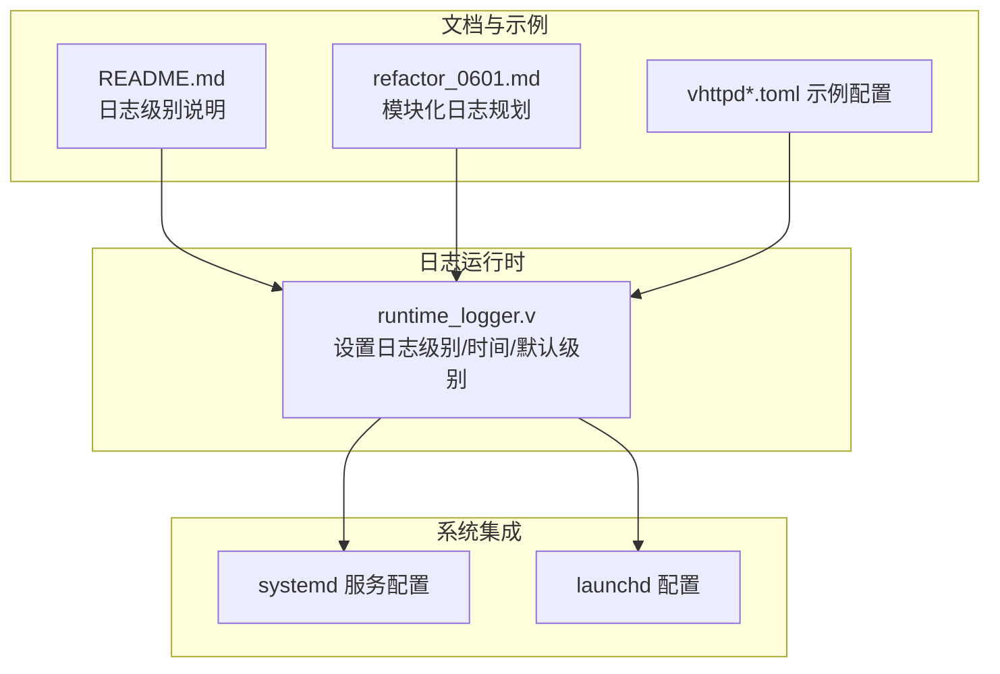
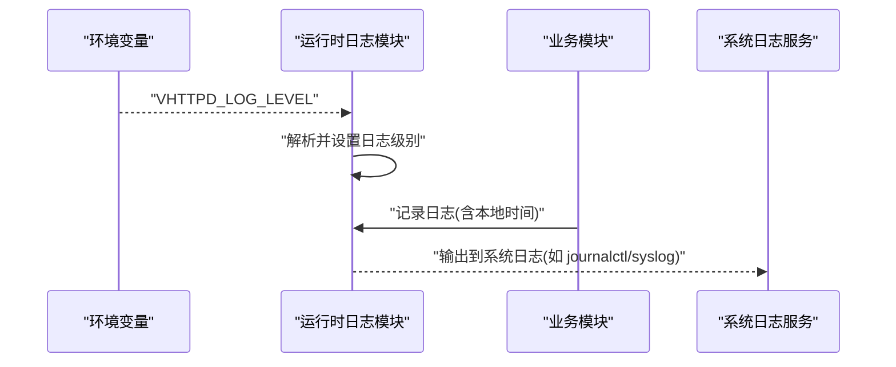
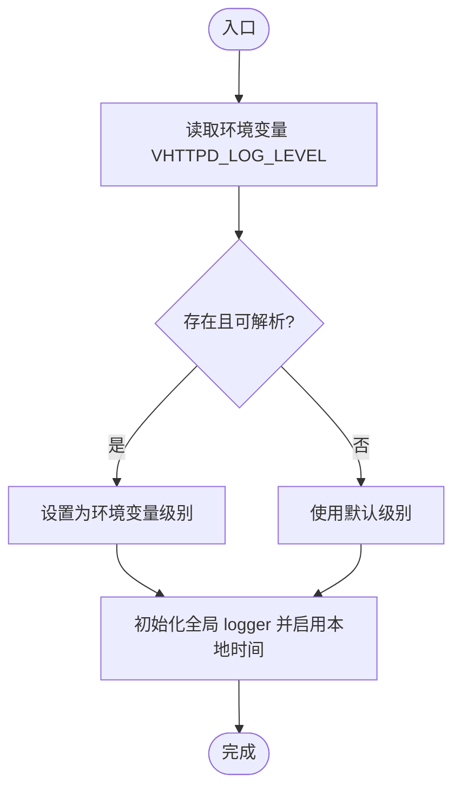
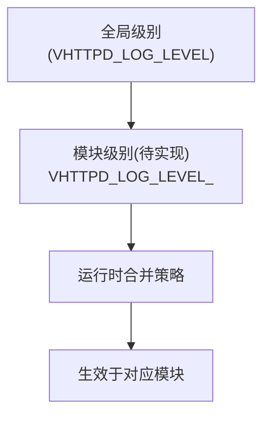
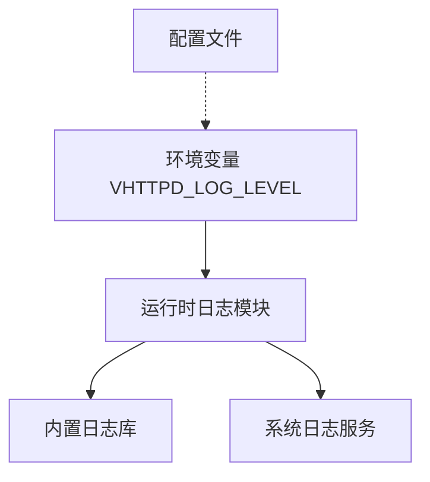

# 日志管理

<cite>
**本文引用的文件**
- [src/logging/runtime_logger.v](file://src/logging/runtime_logger.v)
- [README.md](file://README.md)
- [deploy/systemd/vhttpd@.service](file://deploy/systemd/vhttpd@.service)
- [deploy/launchd/io.guweigang.vhttpd.plist](file://deploy/launchd/io.guweigang.vhttpd.plist)
- [docs/refactor_0601.md](file://docs/refactor_0601.md)
- [config/vhttpd.example.toml](file://config/vhttpd.example.toml)
- [config/vhttpd.multi.example.toml](file://config/vhttpd.multi.example.toml)
- [config/vhttpd.vjsx.example.toml](file://config/vhttpd.vjsx.example.toml)
</cite>

## 目录
1. [简介](#简介)
2. [项目结构](#项目结构)
3. [核心组件](#核心组件)
4. [架构总览](#架构总览)
5. [详细组件分析](#详细组件分析)
6. [依赖关系分析](#依赖关系分析)
7. [性能考量](#性能考量)
8. [故障排查指南](#故障排查指南)
9. [结论](#结论)
10. [附录](#附录)

## 简介
本文件面向运维工程师，提供 vhttpd 的日志管理完整解决方案。内容涵盖：
- 日志系统配置项：日志级别、时间格式与输出行为
- 集中化日志收集：syslog、ELK/EFK、云日志平台对接建议
- 日志轮转：文件大小限制、保留天数、压缩策略
- 日志分析与查询：关键指标提取、异常模式识别
- 安全与隐私：敏感信息脱敏、最小暴露原则
- 自动化脚本与工具：日志采集、轮转、告警联动

vhttpd 当前采用内置日志库进行运行时日志记录，并通过环境变量控制日志级别；系统还提供了 systemd/launchd 的服务配置示例，便于与系统日志服务集成。

## 项目结构
围绕日志管理的关键目录与文件：
- 日志运行时配置与实现：src/logging/runtime_logger.v
- 运行时日志级别说明与示例：README.md
- 服务层日志集成：deploy/systemd/vhttpd@.service、deploy/launchd/io.guweigang.vhttpd.plist
- 模块化日志级别规划与现状：docs/refactor_0601.md
- 示例配置：config/vhttpd.example.toml、config/vhttpd.multi.example.toml、config/vhttpd.vjsx.example.toml

**图表来源**
- [src/logging/runtime_logger.v:1-39](file://src/logging/runtime_logger.v#L1-L39)
- [README.md:270-270](file://README.md#L270-L270)
- [deploy/systemd/vhttpd@.service:12-12](file://deploy/systemd/vhttpd@.service#L12-L12)
- [deploy/launchd/io.guweigang.vhttpd.plist:18-18](file://deploy/launchd/io.guweigang.vhttpd.plist#L18-L18)
- [docs/refactor_0601.md:108-115](file://docs/refactor_0601.md#L108-L115)
- [config/vhttpd.example.toml:1-200](file://config/vhttpd.example.toml#L1-L200)

**章节来源**
- [src/logging/runtime_logger.v:1-39](file://src/logging/runtime_logger.v#L1-L39)
- [README.md:270-270](file://README.md#L270-L270)
- [deploy/systemd/vhttpd@.service:12-12](file://deploy/systemd/vhttpd@.service#L12-L12)
- [deploy/launchd/io.guweigang.vhttpd.plist:18-18](file://deploy/launchd/io.guweigang.vhttpd.plist#L18-L18)
- [docs/refactor_0601.md:108-115](file://docs/refactor_0601.md#L108-L115)
- [config/vhttpd.example.toml:1-200](file://config/vhttpd.example.toml#L1-L200)

## 核心组件
- 日志级别解析与默认值
  - 默认级别：生产构建默认警告及以上，开发构建默认信息及以上
  - 可通过环境变量覆盖：VHTTPD_LOG_LEVEL=debug|info|warn|error|fatal
- 日志时间与时区
  - 使用本地时间格式
- 日志输出
  - 通过内置日志库设置全局 logger，供运行时各模块使用

以上能力由运行时日志模块统一提供，确保部署时可通过环境变量快速调整日志密度。

**章节来源**
- [src/logging/runtime_logger.v:6-11](file://src/logging/runtime_logger.v#L6-L11)
- [src/logging/runtime_logger.v:13-22](file://src/logging/runtime_logger.v#L13-L22)
- [src/logging/runtime_logger.v:25-32](file://src/logging/runtime_logger.v#L25-L32)
- [src/logging/runtime_logger.v:34-39](file://src/logging/runtime_logger.v#L34-L39)
- [README.md:270-270](file://README.md#L270-L270)

## 架构总览
vhttpd 日志架构以“运行时日志库 + 环境变量控制 + 系统集成”为核心，形成从应用到操作系统的完整链路。

**图表来源**
- [src/logging/runtime_logger.v:25-39](file://src/logging/runtime_logger.v#L25-L39)
- [deploy/systemd/vhttpd@.service:12-12](file://deploy/systemd/vhttpd@.service#L12-L12)
- [deploy/launchd/io.guweigang.vhttpd.plist:18-18](file://deploy/launchd/io.guweigang.vhttpd.plist#L18-L18)

## 详细组件分析

### 组件一：运行时日志配置与级别控制
- 功能要点
  - 解析字符串到日志级别枚举
  - 优先从环境变量读取，否则回退到默认级别
  - 设置本地时间戳
- 关键路径
  - 级别解析函数
  - 默认级别选择
  - 生效逻辑
  - 全局 logger 初始化

**图表来源**
- [src/logging/runtime_logger.v:13-22](file://src/logging/runtime_logger.v#L13-L22)
- [src/logging/runtime_logger.v:25-32](file://src/logging/runtime_logger.v#L25-L32)
- [src/logging/runtime_logger.v:34-39](file://src/logging/runtime_logger.v#L34-L39)

**章节来源**
- [src/logging/runtime_logger.v:6-11](file://src/logging/runtime_logger.v#L6-L11)
- [src/logging/runtime_logger.v:13-22](file://src/logging/runtime_logger.v#L13-L22)
- [src/logging/runtime_logger.v:25-32](file://src/logging/runtime_logger.v#L25-L32)
- [src/logging/runtime_logger.v:34-39](file://src/logging/runtime_logger.v#L34-L39)

### 组件二：系统集成与输出目标
- systemd 集成
  - 在服务单元中设置环境变量，影响运行时日志级别
- launchd 集成
  - 在 plist 中设置环境变量，影响运行时日志级别
- 输出目标
  - 通过系统日志服务（journalctl、rsyslog）统一收集
  - 可进一步接入 ELK/EFK/云日志平台

**图表来源**
- [deploy/systemd/vhttpd@.service:12-12](file://deploy/systemd/vhttpd@.service#L12-L12)
- [deploy/launchd/io.guweigang.vhttpd.plist:18-18](file://deploy/launchd/io.guweigang.vhttpd.plist#L18-L18)
- [src/logging/runtime_logger.v:34-39](file://src/logging/runtime_logger.v#L34-L39)

**章节来源**
- [deploy/systemd/vhttpd@.service:12-12](file://deploy/systemd/vhttpd@.service#L12-L12)
- [deploy/launchd/io.guweigang.vhttpd.plist:18-18](file://deploy/launchd/io.guweigang.vhttpd.plist#L18-L18)
- [src/logging/runtime_logger.v:34-39](file://src/logging/runtime_logger.v#L34-L39)

### 组件三：模块化日志级别规划（现状与演进）
- 现状
  - 支持全局日志级别控制（VHTTPD_LOG_LEVEL）
  - 文档中提出按模块/Provider 的细粒度控制（如 VHTTPD_LOG_LEVEL_codex、VHTTPD_LOG_LEVEL_feishu）
- 建议
  - 在运行时解析中增加对模块前缀环境变量的支持
  - 为不同 Provider/模块提供独立的覆盖能力，避免高负载场景被 debug 日志淹没

**图表来源**
- [docs/refactor_0601.md:108-115](file://docs/refactor_0601.md#L108-L115)
- [docs/refactor_0601.md:372-372](file://docs/refactor_0601.md#L372-L372)

**章节来源**
- [docs/refactor_0601.md:108-115](file://docs/refactor_0601.md#L108-L115)
- [docs/refactor_0601.md:372-372](file://docs/refactor_0601.md#L372-L372)

### 组件四：配置文件中的日志相关项
- 示例配置文件包含运行时参数、监听端口、上游配置等，日志相关项通常通过环境变量控制
- 建议在配置文件中补充日志输出目标、格式模板、轮转策略等字段，以便统一管理

**章节来源**
- [config/vhttpd.example.toml:1-200](file://config/vhttpd.example.toml#L1-L200)
- [config/vhttpd.multi.example.toml:1-200](file://config/vhttpd.multi.example.toml#L1-L200)
- [config/vhttpd.vjsx.example.toml:1-200](file://config/vhttpd.vjsx.example.toml#L1-L200)

## 依赖关系分析
- 运行时日志模块依赖内置日志库与环境变量接口
- 服务层通过 systemd/launchd 注入环境变量，间接影响运行时日志级别
- 配置文件不直接定义日志格式/目标，主要通过环境变量与系统日志服务协同

**图表来源**
- [src/logging/runtime_logger.v:25-39](file://src/logging/runtime_logger.v#L25-L39)
- [deploy/systemd/vhttpd@.service:12-12](file://deploy/systemd/vhttpd@.service#L12-L12)
- [deploy/launchd/io.guweigang.vhttpd.plist:18-18](file://deploy/launchd/io.guweigang.vhttpd.plist#L18-L18)

**章节来源**
- [src/logging/runtime_logger.v:25-39](file://src/logging/runtime_logger.v#L25-L39)
- [deploy/systemd/vhttpd@.service:12-12](file://deploy/systemd/vhttpd@.service#L12-L12)
- [deploy/launchd/io.guweigang.vhttpd.plist:18-18](file://deploy/launchd/io.guweigang.vhttpd.plist#L18-L18)

## 性能考量
- 日志级别
  - 生产环境建议 warn 或更高，降低 IO 压力
  - 调试阶段临时提升至 info/debug，问题定位后恢复
- 日志量控制
  - 避免在高并发场景开启 debug
  - 对高频事件进行采样或聚合
- 输出路径
  - 优先使用系统日志服务，利用其轮转与压缩能力
- 时间戳
  - 本地时间可读性更好，但需注意时区一致性

[本节为通用指导，无需特定文件引用]

## 故障排查指南
- 症状：日志过少
  - 检查环境变量是否正确设置
  - 确认服务单元是否注入了 VHTTPD_LOG_LEVEL
- 症状：日志过多
  - 提升日志级别至 warn/error
  - 在高负载场景关闭 debug
- 症状：无法查看日志
  - 使用系统日志命令查看（如 journalctl 或 rsyslog 输出）
- 症状：日志时间与预期不符
  - 确认系统时区与 NTP 同步状态

**章节来源**
- [src/logging/runtime_logger.v:25-32](file://src/logging/runtime_logger.v#L25-L32)
- [deploy/systemd/vhttpd@.service:12-12](file://deploy/systemd/vhttpd@.service#L12-L12)
- [deploy/launchd/io.guweigang.vhttpd.plist:18-18](file://deploy/launchd/io.guweigang.vhttpd.plist#L18-L18)
- [README.md:270-270](file://README.md#L270-L270)

## 结论
vhttpd 的日志体系以“环境变量驱动 + 系统日志服务”为核心，具备即插即用、易于运维的特点。建议在现有基础上：
- 引入模块化日志级别控制
- 在配置文件中补充日志输出与轮转策略
- 通过系统日志服务对接 ELK/EFK/云日志平台
- 制定日志级别与轮转策略的标准化流程

[本节为总结，无需特定文件引用]

## 附录

### A. 日志级别与默认值
- 默认级别
  - 生产构建：warn
  - 开发构建：info
- 可选级别：debug、info、warn、error、fatal
- 覆盖方式：VHTTPD_LOG_LEVEL=级别

**章节来源**
- [src/logging/runtime_logger.v:6-11](file://src/logging/runtime_logger.v#L6-L11)
- [src/logging/runtime_logger.v:13-22](file://src/logging/runtime_logger.v#L13-L22)
- [README.md:270-270](file://README.md#L270-L270)

### B. 系统集成与输出目标
- systemd
  - 在服务单元中设置环境变量，影响运行时日志级别
- launchd
  - 在 plist 中设置环境变量，影响运行时日志级别
- 输出目标
  - 系统日志服务（journald、rsyslog）
  - 可进一步接入 ELK/EFK/云日志平台

**章节来源**
- [deploy/systemd/vhttpd@.service:12-12](file://deploy/systemd/vhttpd@.service#L12-L12)
- [deploy/launchd/io.guweigang.vhttpd.plist:18-18](file://deploy/launchd/io.guweigang.vhttpd.plist#L18-L18)
- [src/logging/runtime_logger.v:34-39](file://src/logging/runtime_logger.v#L34-L39)

### C. 日志轮转与保留策略
- 文件大小限制
  - 使用系统日志服务的轮转能力（如 journald 的最大文件大小与保留空间）
- 保留天数
  - 使用系统日志服务的保留策略（如 journald 的最大保留天数）
- 压缩策略
  - 系统日志服务通常自带压缩与归档能力
- 建议
  - 在配置文件中补充轮转参数字段，便于统一管理

**章节来源**
- [config/vhttpd.example.toml:1-200](file://config/vhttpd.example.toml#L1-L200)
- [config/vhttpd.multi.example.toml:1-200](file://config/vhttpd.multi.example.toml#L1-L200)
- [config/vhttpd.vjsx.example.toml:1-200](file://config/vhttpd.vjsx.example.toml#L1-L200)

### D. 集中化日志收集方案
- syslog
  - 将系统日志转发至 rsyslog，再导入 ELK/EFK/云日志平台
- ELK/EFK
  - 使用 Filebeat/Fluent Bit 收集系统日志，写入 Elasticsearch/Kibana
- 云日志平台
  - 使用平台提供的 agent 或 syslog 接收器
- 输出格式
  - 建议在配置文件中增加日志格式模板字段，统一字段结构

**章节来源**
- [src/logging/runtime_logger.v:34-39](file://src/logging/runtime_logger.v#L34-L39)
- [config/vhttpd.example.toml:1-200](file://config/vhttpd.example.toml#L1-L200)

### E. 日志分析与查询最佳实践
- 关键指标
  - 错误率、超时率、吞吐量、P95/P99 延迟
- 异常模式识别
  - 使用规则引擎检测突发错误、连接失败、资源耗尽
- 查询建议
  - 为常见查询建立仪表板与告警阈值
  - 对高基数字段（如请求 ID）进行采样或聚合

**章节来源**
- [docs/refactor_0601.md:108-115](file://docs/refactor_0601.md#L108-L115)

### F. 安全与隐私
- 最小暴露原则
  - 不在日志中记录敏感信息（密码、令牌、个人数据）
- 脱敏策略
  - 对日志中的敏感字段进行掩码或替换
- 访问控制
  - 限制日志存储与查询权限，遵循审计要求

**章节来源**
- [docs/refactor_0601.md:108-115](file://docs/refactor_0601.md#L108-L115)

### G. 自动化脚本与工具
- 日志采集
  - 使用 systemd-journald、rsyslog、Filebeat/Fluent Bit
- 轮转与清理
  - 使用系统日志服务自带的轮转与保留策略
- 告警联动
  - 基于日志规则触发告警，结合运维工单系统

**章节来源**
- [deploy/systemd/vhttpd@.service:12-12](file://deploy/systemd/vhttpd@.service#L12-L12)
- [deploy/launchd/io.guweigang.vhttpd.plist:18-18](file://deploy/launchd/io.guweigang.vhttpd.plist#L18-L18)