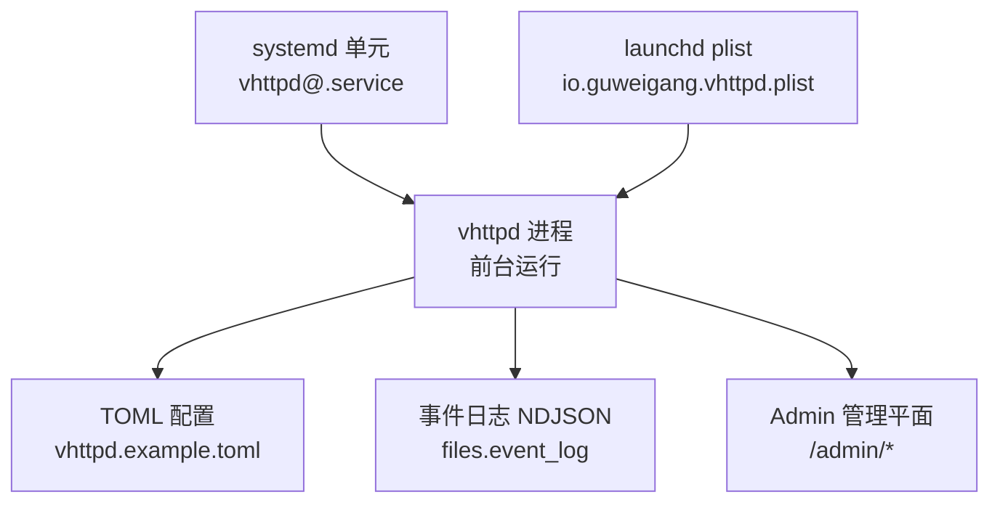
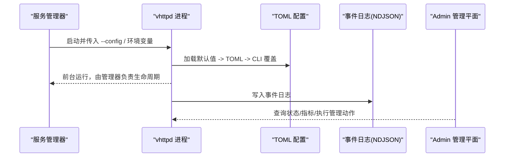
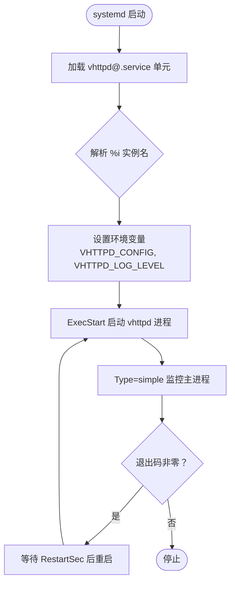
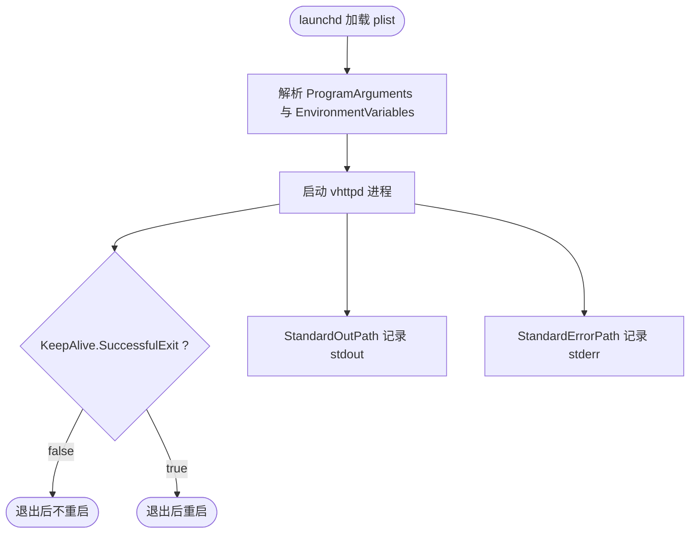
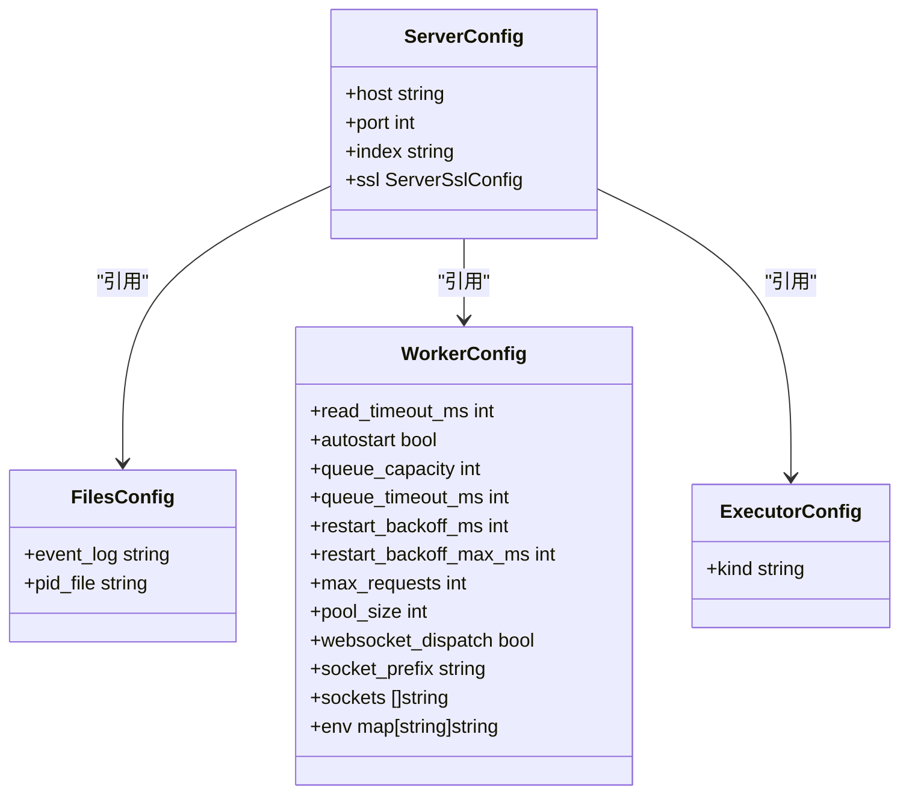
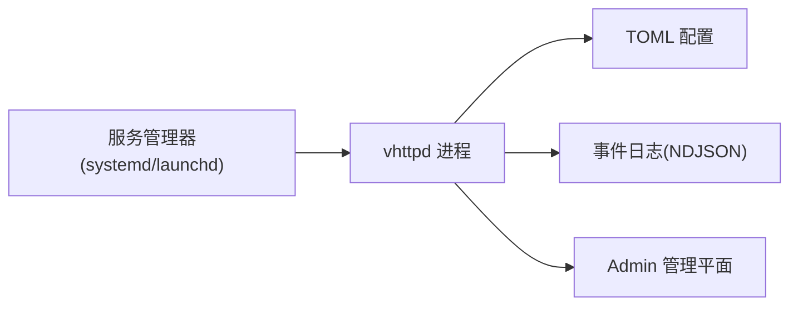

# 服务管理

<cite>
**本文引用的文件**   
- [deploy/systemd/vhttpd@.service](file://deploy/systemd/vhttpd@.service)
- [deploy/launchd/io.guweigang.vhttpd.plist](file://deploy/launchd/io.guweigang.vhttpd.plist)
- [README.md](file://README.md)
- [config/vhttpd.example.toml](file://config/vhttpd.example.toml)
- [src/config/config.v](file://src/config/config.v)
- [articles/11-observability.md](file://articles/11-observability.md)
</cite>

## 目录
1. [简介](#简介)
2. [项目结构](#项目结构)
3. [核心组件](#核心组件)
4. [架构总览](#架构总览)
5. [详细组件分析](#详细组件分析)
6. [依赖关系分析](#依赖关系分析)
7. [性能与资源限制](#性能与资源限制)
8. [故障排查指南](#故障排查指南)
9. [结论](#结论)
10. [附录：发行版兼容性与特殊处理](#附录发行版兼容性与特殊处理)

## 简介
本文件面向运维与平台工程师，系统化说明 vhttpd 在 Linux 与 macOS 上的服务化部署与管理实践。内容覆盖 systemd 单元配置、多实例部署、服务依赖与重启策略、日志收集、环境变量与安全权限设置；并提供 launchd 模板用于 macOS 环境。同时给出日常监控、日志查看与故障恢复操作建议，以及不同 Linux 发行版的兼容性要点。

## 项目结构
仓库提供了跨平台的服务管理模板与示例配置，便于快速落地生产部署：
- Linux：使用 systemd 的实例单元（vhttpd@.service）实现多实例隔离与统一生命周期管理
- macOS：使用 launchd plist 模板进行用户态或系统级守护进程管理
- 应用侧通过 TOML 配置文件与 CLI 参数组合完成运行时行为控制

图表来源
- [deploy/systemd/vhttpd@.service](file://deploy/systemd/vhttpd@.service)
- [deploy/launchd/io.guweigang.vhttpd.plist](file://deploy/launchd/io.guweigang.vhttpd.plist)
- [config/vhttpd.example.toml](file://config/vhttpd.example.toml)
- [README.md](file://README.md)

章节来源
- [README.md](file://README.md)

## 核心组件
- systemd 实例单元：定义服务启动参数、运行用户/组、工作目录、环境变量、重启策略、安全沙箱与文件描述符上限等
- launchd plist：定义程序入口、环境变量、工作目录、KeepAlive、标准输出/错误路径、资源限制等
- TOML 配置：集中管理服务器监听、文件路径、执行器、Worker 池、Admin 管理平面、静态资源、飞书集成等
- Admin 管理平面：提供运行时状态、指标、Worker 管理与诊断能力

章节来源
- [deploy/systemd/vhttpd@.service](file://deploy/systemd/vhttpd@.service)
- [deploy/launchd/io.guweigang.vhttpd.plist](file://deploy/launchd/io.guweigang.vhttpd.plist)
- [config/vhttpd.example.toml](file://config/vhttpd.example.toml)
- [articles/11-observability.md](file://articles/11-observability.md)

## 架构总览
下图展示了服务管理器到 vhttpd 进程的调用链路与关键外部依赖：

图表来源
- [README.md](file://README.md)
- [config/vhttpd.example.toml](file://config/vhttpd.example.toml)
- [articles/11-observability.md](file://articles/11-observability.md)

## 详细组件分析

### systemd 服务单元（Linux）
- 多实例部署：采用实例单元 vhttpd@.service，通过 %i 注入实例名，映射到独立配置与工作目录
- 依赖管理：声明网络目标依赖，确保网络就绪后再启动
- 自动重启策略：失败时自动重启，并设置最小重启间隔
- 日志收集：结合系统日志与事件日志（NDJSON），便于集中采集与分析
- 安全与权限：以专用用户/组运行，启用只读文件系统保护、私有临时目录、最小特权模式，仅开放必要写路径
- 资源限制：提高最大打开文件数，避免高并发场景下资源耗尽

图表来源
- [deploy/systemd/vhttpd@.service](file://deploy/systemd/vhttpd@.service)

章节来源
- [deploy/systemd/vhttpd@.service](file://deploy/systemd/vhttpd@.service)

### launchd 服务（macOS）
- 多实例部署：复制 plist 并使用不同 Label，分别设置 EnvironmentVariables.VHTTPD_CONFIG 指向不同 TOML
- 自动重启策略：KeepAlive 控制是否因成功退出而重启，可按需调整
- 日志收集：StandardOutPath/StandardErrorPath 将 stdout/stderr 重定向至指定日志文件
- 资源限制：Soft/Hard ResourceLimits 设置 NumberOfFiles 上限
- 启动时机：RunAtLoad 控制加载即启动

图表来源
- [deploy/launchd/io.guweigang.vhttpd.plist](file://deploy/launchd/io.guweigang.vhttpd.plist)

章节来源
- [deploy/launchd/io.guweigang.vhttpd.plist](file://deploy/launchd/io.guweigang.vhttpd.plist)

### TOML 配置与运行时参数
- 配置加载顺序：默认值 -> TOML 配置 -> CLI 参数（CLI 优先级最高）
- 变量展开：支持 ${section.key} 与 ${env.NAME:-default} 语法
- 关键配置项：
  - files.pid_file、files.event_log：PID 与事件日志路径
  - worker.*：Worker 池大小、超时、队列容量、重启退避等
  - admin.*：Admin 管理平面主机、端口、鉴权令牌
  - assets.*：静态资源开关、前缀、根目录与缓存策略
  - feishu.*：飞书集成开关与连接参数
- 多监听模式：一个进程可绑定多个 host:port，每个站点拥有独立执行器与运行时上下文

图表来源
- [src/config/config.v](file://src/config/config.v)
- [config/vhttpd.example.toml](file://config/vhttpd.example.toml)

章节来源
- [README.md](file://README.md)
- [config/vhttpd.example.toml](file://config/vhttpd.example.toml)
- [src/config/config.v](file://src/config/config.v)

### Admin 管理平面与可观测性
- 启用方式：在 TOML 中配置 [admin] 段，包含 host、port、token
- 访问控制：多数端点需要携带 x-vhttpd-admin-token 请求头
- 核心端点：
  - /admin/runtime：运行时摘要（Worker 池、请求计数、流/WebSocket/MCP 会话等）
  - /admin/workers：Worker 列表与状态
  - /admin/stats：请求速率、延迟分位、错误统计
  - /admin/runtime/upstreams/websocket：上游 WebSocket 连接状态与事件
  - /admin/runtime/mcp：MCP 会话状态与事件
- 事件日志：NDJSON 格式，包含 http.request、worker.request、upstream.connect/error、mcp.session.* 等类型，便于集中采集与检索

章节来源
- [articles/11-observability.md](file://articles/11-observability.md)
- [config/vhttpd.example.toml](file://config/vhttpd.example.toml)

## 依赖关系分析
- 服务管理器依赖：
  - systemd：实例单元、依赖目标、重启策略、安全沙箱
  - launchd：plist 标签、环境变量、KeepAlive、日志重定向、资源限制
- vhttpd 进程依赖：
  - TOML 配置：全局与站点级配置叠加
  - 事件日志：NDJSON 文件路径由 files.event_log 指定
  - Admin 管理平面：本地回环地址与鉴权令牌

图表来源
- [deploy/systemd/vhttpd@.service](file://deploy/systemd/vhttpd@.service)
- [deploy/launchd/io.guweigang.vhttpd.plist](file://deploy/launchd/io.guweigang.vhttpd.plist)
- [config/vhttpd.example.toml](file://config/vhttpd.example.toml)
- [articles/11-observability.md](file://articles/11-observability.md)

章节来源
- [deploy/systemd/vhttpd@.service](file://deploy/systemd/vhttpd@.service)
- [deploy/launchd/io.guweigang.vhttpd.plist](file://deploy/launchd/io.guweigang.vhttpd.plist)
- [config/vhttpd.example.toml](file://config/vhttpd.example.toml)
- [articles/11-observability.md](file://articles/11-observability.md)

## 性能与资源限制
- 文件描述符上限：systemd 与 launchd 均提供相应限制，建议根据并发连接数调优
- Worker 池与队列：
  - pool_size：并发处理能力
  - queue_capacity/queue_timeout_ms：背压与超时控制
  - restart_backoff_ms/restart_backoff_max_ms：失败重启退避策略
- 静态资源缓存：assets.cache_control 控制浏览器缓存策略，降低重复请求压力
- 事件日志：合理选择 event_log 路径与轮转策略，避免磁盘 I/O 成为瓶颈

章节来源
- [config/vhttpd.example.toml](file://config/vhttpd.example.toml)
- [deploy/systemd/vhttpd@.service](file://deploy/systemd/vhttpd@.service)
- [deploy/launchd/io.guweigang.vhttpd.plist](file://deploy/launchd/io.guweigang.vhttpd.plist)

## 故障排查指南
- 服务状态检查：
  - Linux：systemctl status vhttpd@<instance>
  - macOS：launchctl list | grep io.guweigang.vhttpd
- 日志查看：
  - 系统日志：journalctl -u vhttpd@<instance>
  - 应用事件日志：tail -f <files.event_log>
  - macOS 标准输出/错误：查看 StandardOutPath/StandardErrorPath 对应文件
- 健康检查：
  - Admin 管理平面 /admin/runtime 返回运行时摘要
  - 自定义 /health 适配器可通过站点配置暴露
- 故障恢复：
  - 重启单个/全部 Worker：通过 Admin 管理平面端点触发
  - 调整配置后重载：systemd 支持 ExecReload，launchd 可重新加载 plist 并重启服务

章节来源
- [README.md](file://README.md)
- [articles/11-observability.md](file://articles/11-observability.md)
- [deploy/systemd/vhttpd@.service](file://deploy/systemd/vhttpd@.service)
- [deploy/launchd/io.guweigang.vhttpd.plist](file://deploy/launchd/io.guweigang.vhttpd.plist)

## 结论
通过 systemd 与 launchd 的标准化管理，vhttpd 可在多实例、高并发与复杂依赖环境下稳定运行。配合 TOML 配置与 Admin 管理平面，可实现细粒度的运行时控制与可观测性。建议在部署时明确安全边界（用户/组、文件系统保护）、合理设置资源限制与重启策略，并结合事件日志与指标端点进行持续监控与排障。

## 附录：发行版兼容性与特殊处理
- 通用要求：
  - 二进制路径：模板假设 vhttpd 位于 /usr/local/bin/vhttpd，请根据打包布局调整
  - 配置路径：/etc/vhttpd/<instance>.toml 与 /usr/local/etc/vhttpd/<instance>.toml
  - 工作目录：/var/lib/vhttpd/<instance> 与 /usr/local/var/vhttpd/default
- Linux 发行版差异：
  - systemd 版本差异：部分旧版本可能不支持某些安全字段（如 ProtectSystem=full），可按需降级为更宽松的策略
  - 用户/组创建：确保存在专用的 vhttpd 用户与组，或使用现有低权限账户
  - 网络目标：After/Wants=network-online.target 适用于大多数发行版；若网络初始化较慢，可适当增加依赖或延时
- macOS 特殊处理：
  - 用户态 vs 系统级：~/Library/LaunchAgents 适合用户态；如需系统级与特权端口，请使用 LaunchDaemons 并调整权限
  - 环境变量注入：通过 EnvironmentVariables 注入 VHTTPD_CONFIG 与 VHTTPD_LOG_LEVEL
  - 日志轮转：建议使用系统日志轮转工具（如 logrotate 替代方案）对 StandardOutPath/StandardErrorPath 进行管理

章节来源
- [README.md](file://README.md)
- [deploy/systemd/vhttpd@.service](file://deploy/systemd/vhttpd@.service)
- [deploy/launchd/io.guweigang.vhttpd.plist](file://deploy/launchd/io.guweigang.vhttpd.plist)