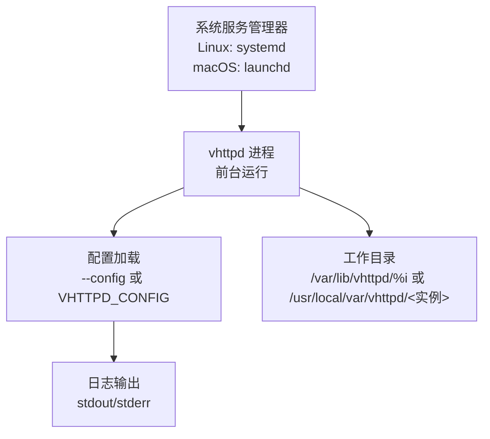
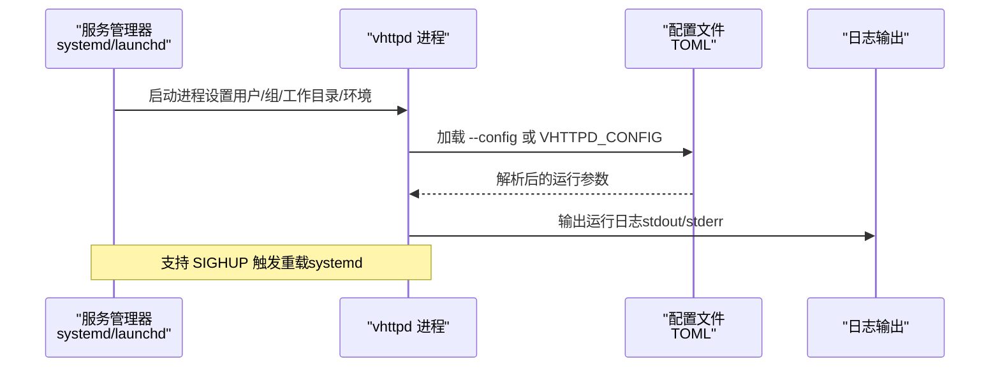
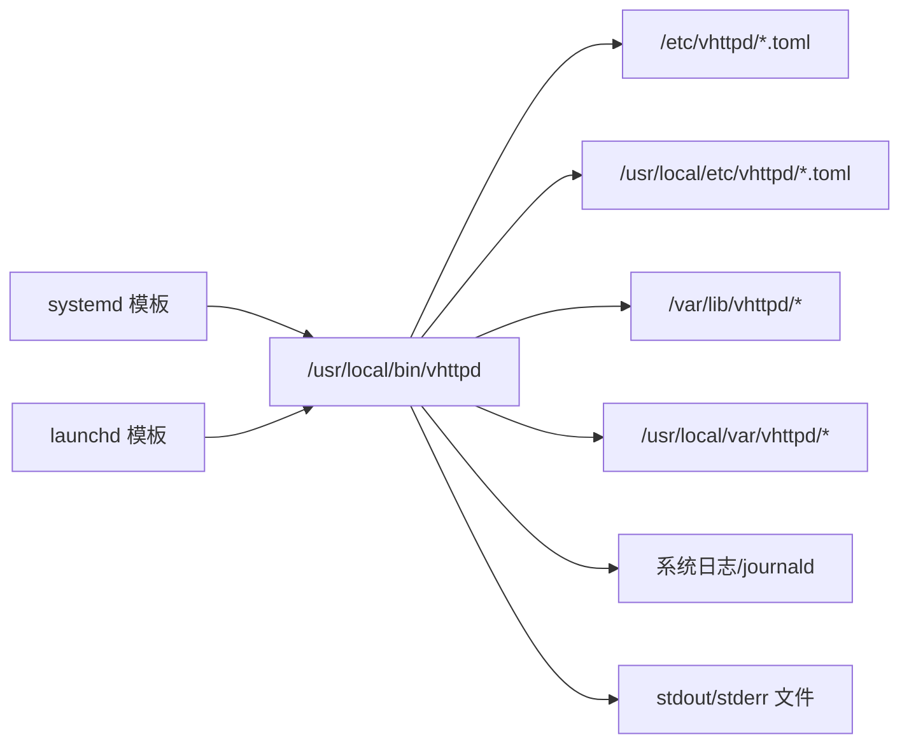

# 服务管理

<cite>
**本文引用的文件**
- [README.md](file://README.md)
- [vhttpd@.service](file://deploy/systemd/vhttpd@.service)
- [io.guweigang.vhttpd.plist](file://deploy/launchd/io.guweigang.vhttpd.plist)
- [vhttpd.example.toml](file://config/vhttpd.example.toml)
- [vhttpd.multi.example.toml](file://config/vhttpd.multi.example.toml)
- [vhttpd.vjsx.example.toml](file://config/vhttpd.vjsx.example.toml)
</cite>

## 目录
1. [简介](#简介)
2. [项目结构](#项目结构)
3. [核心组件](#核心组件)
4. [架构总览](#架构总览)
5. [详细组件分析](#详细组件分析)
6. [依赖关系分析](#依赖关系分析)
7. [性能与资源建议](#性能与资源建议)
8. [故障排除指南](#故障排除指南)
9. [结论](#结论)
10. [附录](#附录)

## 简介
本文件面向系统管理员，提供 vhttpd 服务在 Linux（systemd）与 macOS（launchd）上的完整部署与管理指导。内容覆盖服务模板参数说明、配置文件路径约定、启停与重载命令、状态检查、配置验证与常见问题排查等，帮助您以最小成本完成生产级部署。

## 项目结构
vhttpd 在仓库中提供了两套官方服务模板：
- Linux systemd 实例模板：deploy/systemd/vhttpd@.service
- macOS launchd 模板：deploy/launchd/io.guweigang.vhttpd.plist

同时，README 提供了最小化安装与启用流程，以及多实例与多站点配置的参考示例。

图示来源
- [README.md: 376-411:376-411](file://README.md#L376-L411)
- [vhttpd@.service: 1-27:1-27](file://deploy/systemd/vhttpd@.service#L1-L27)
- [io.guweigang.vhttpd.plist: 1-54:1-54](file://deploy/launchd/io.guweigang.vhttpd.plist#L1-L54)

章节来源
- [README.md: 376-411:376-411](file://README.md#L376-L411)

## 核心组件
- systemd 实例服务模板：vhttpd@.service
  - 支持多实例并映射到不同 TOML 配置文件
  - 默认用户/组、工作目录、环境变量、重启策略、文件描述符限制等
- launchd 模板：io.guweigang.vhttpd.plist
  - 前台运行、自动启动、资源限制、日志路径等
- 配置文件约定
  - Linux: /etc/vhttpd/<name>.toml
  - macOS: /usr/local/etc/vhttpd/<name>.toml
  - 可通过 --config 或 VHTTPD_CONFIG 指定

章节来源
- [vhttpd@.service: 1-27:1-27](file://deploy/systemd/vhttpd@.service#L1-L27)
- [io.guweigang.vhttpd.plist: 1-54:1-54](file://deploy/launchd/io.guweigang.vhttpd.plist#L1-L54)
- [README.md: 376-411:376-411](file://README.md#L376-L411)

## 架构总览
下图展示服务管理器如何启动 vhttpd 并加载配置：

图示来源
- [vhttpd@.service: 7-26:7-26](file://deploy/systemd/vhttpd@.service#L7-L26)
- [io.guweigang.vhttpd.plist: 8-51:8-51](file://deploy/launchd/io.guweigang.vhttpd.plist#L8-L51)
- [README.md: 428-531:428-531](file://README.md#L428-L531)

## 详细组件分析

### systemd 服务模板（vhttpd@.service）
- 单元类型与生命周期
  - Type=simple：前台进程，由服务管理器直接管理
  - After/Wants=network-online.target：在网络就绪后启动
- 用户与权限
  - User/Group：指定运行用户与组
  - NoNewPrivileges=true：限制提权
  - ProtectSystem=full、ProtectHome=true：保护系统与家目录
- 工作目录与环境
  - WorkingDirectory：按实例填充 /var/lib/vhttpd/%i
  - Environment：VHTTPD_CONFIG 指向 /etc/vhttpd/%i.toml；VHTTPD_LOG_LEVEL=info
- 执行与重启
  - ExecStart：以 --config 指定配置文件
  - ExecReload：发送 HUP 信号触发重载
  - Restart=on-failure、RestartSec=2s：失败时自动重启
- 资源限制
  - LimitNOFILE=65535：提高文件描述符上限
  - PrivateTmp=true：隔离临时目录
- 安装目标
  - WantedBy=multi-user.target：随系统多用户目标启用

章节来源
- [vhttpd@.service: 1-27:1-27](file://deploy/systemd/vhttpd@.service#L1-L27)

### systemd 多实例与配置映射
- 实例命名：vhttpd@prod、vhttpd@staging 等
- 配置映射：vhttpd@<name> → /etc/vhttpd/<name>.toml
- 启用与启动：systemctl enable --now vhttpd@<name>

章节来源
- [README.md: 382-390:382-390](file://README.md#L382-L390)
- [README.md: 407](file://README.md#L407)

### launchd 模板（io.guweigang.vhttpd.plist）
- 启动方式
  - ProgramArguments：通过 shell 执行 vhttpd，并从环境变量读取配置路径
  - RunAtLoad=true：随登录或引导立即启动
  - KeepAlive：成功退出不重启（保持前台常驻）
- 环境变量
  - VHTTPD_CONFIG：默认指向 /usr/local/etc/vhttpd/vhttpd.toml
  - VHTTPD_LOG_LEVEL：默认 info
- 工作目录与日志
  - WorkingDirectory：默认 /usr/local/var/vhttpd/default
  - StandardOutPath/StandardErrorPath：分别写入 stdout.log 与 stderr.log
- 资源限制
  - SoftResourceLimits/HardResourceLimits：NumberOfFiles=65535
- 多实例建议
  - 为每个实例复制一份 plist，修改 Label 与 VHTTPD_CONFIG

章节来源
- [io.guweigang.vhttpd.plist: 1-54:1-54](file://deploy/launchd/io.guweigang.vhttpd.plist#L1-L54)

### 配置文件与示例
- 单站点示例：config/vhttpd.example.toml
- 多监听示例：config/vhttpd.multi.example.toml
- vjsx 示例：config/vhttpd.vjsx.example.toml
- 配置加载顺序与变量扩展：README 中有详细说明

章节来源
- [README.md: 437-531:437-531](file://README.md#L437-L531)
- [vhttpd.example.toml](file://config/vhttpd.example.toml)
- [vhttpd.multi.example.toml](file://config/vhttpd.multi.example.toml)
- [vhttpd.vjsx.example.toml](file://config/vhttpd.vjsx.example.toml)

## 依赖关系分析
- 服务模板与二进制
  - 两者均假设二进制位于 /usr/local/bin/vhttpd
  - systemd 使用 ExecStart 指定 --config；launchd 通过 VHTTPD_CONFIG 环境变量传递
- 配置文件位置
  - Linux：/etc/vhttpd/<name>.toml
  - macOS：/usr/local/etc/vhttpd/<name>.toml
- 工作目录
  - Linux：/var/lib/vhttpd/<name>
  - macOS：/usr/local/var/vhttpd/<name>
- 日志输出
  - systemd：journal（可结合 journald 查看）
  - launchd：stdout/stderr 日志文件

图示来源
- [vhttpd@.service: 11-14:11-14](file://deploy/systemd/vhttpd@.service#L11-L14)
- [io.guweigang.vhttpd.plist: 17-24:17-24](file://deploy/launchd/io.guweigang.vhttpd.plist#L17-L24)
- [README.md: 405-410:405-410](file://README.md#L405-L410)

章节来源
- [README.md: 376-411:376-411](file://README.md#L376-L411)

## 性能与资源建议
- 文件描述符
  - systemd：LimitNOFILE=65535
  - launchd：NumberOfFiles=65535
- 运行模式
  - 建议保持 vhttpd 前台运行，交由服务管理器守护
- 日志级别
  - 默认 info；可通过 VHTTPD_LOG_LEVEL 调整
- 多实例与多站点
  - systemd 支持并行实例；macOS 可通过多个 plist 实现
  - 多站点配置请参考多监听示例

章节来源
- [vhttpd@.service: 18-18:18-18](file://deploy/systemd/vhttpd@.service#L18-L18)
- [io.guweigang.vhttpd.plist: 42-51:42-51](file://deploy/launchd/io.guweigang.vhttpd.plist#L42-L51)
- [README.md: 376-411:376-411](file://README.md#L376-L411)

## 故障排除指南
- 无法找到配置文件
  - 检查 /etc/vhttpd/<name>.toml 或 /usr/local/etc/vhttpd/<name>.toml 是否存在
  - 确认 systemd/launchd 的环境变量或 ExecStart 参数是否正确
- 权限不足
  - 确认 User/Group 设置与工作目录、日志目录权限匹配
  - 检查 ProtectSystem/ProtectHome 是否影响必要路径访问
- 端口占用或权限端口
  - 若监听 80/443，请确保具备相应权限或使用反向代理
- 重载配置无效
  - systemd：使用 systemctl reload vhttpd@<name> 或发送 HUP 信号
  - launchd：由于模板未定义 Reload 指令，需重启服务以应用新配置
- 日志定位
  - systemd：journalctl -u vhttpd@<name> -f
  - launchd：查看 stdout/stderr 日志文件

章节来源
- [vhttpd@.service: 15-15:15-15](file://deploy/systemd/vhttpd@.service#L15-L15)
- [io.guweigang.vhttpd.plist: 35-39:35-39](file://deploy/launchd/io.guweigang.vhttpd.plist#L35-L39)
- [README.md: 382-401:382-401](file://README.md#L382-L401)

## 结论
通过官方 systemd 与 launchd 模板，vhttpd 可以稳定地以前台进程形式运行于生产环境。建议：
- Linux 使用 systemd 实例模式，支持多实例与自动重启
- macOS 使用 launchd 模板，按需复制多份 plist 实现多实例
- 将配置文件放置于约定路径并通过环境变量或 --config 指定
- 使用标准日志与资源限制，配合监控与告警体系

## 附录

### 常用操作命令（基于 README 示例）
- Linux（systemd）
  - 安装模板与配置
    - 复制模板至 /etc/systemd/system/vhttpd@.service
    - 将配置文件复制至 /etc/vhttpd/<name>.toml
  - 重载与启用
    - systemctl daemon-reload
    - systemctl enable --now vhttpd@<name>
  - 启停与重载
    - systemctl start/stop/restart/status vhttpd@<name>
    - systemctl reload vhttpd@<name>
  - 日志
    - journalctl -u vhttpd@<name> -f
- macOS（launchd）
  - 安装模板与配置
    - 将配置文件复制至 /usr/local/etc/vhttpd/<name>.toml
    - 复制 plist 至 ~/Library/LaunchAgents/ 并调整 VHTTPD_CONFIG
  - 启用与启动
    - launchctl bootstrap gui/$(id -u) ~/Library/LaunchAgents/<label>.plist
    - launchctl enable gui/$(id -u)/<label>
  - 启停与重载
    - launchctl kickstart -p gui/$(id -u)/<label>
    - 如需重载配置，先 unload 再 load
  - 日志
    - 查看 stdout/stderr 日志文件

章节来源
- [README.md: 382-401:382-401](file://README.md#L382-L401)

### 配置验证要点
- 变量扩展与优先级
  - README 明确：默认值 → TOML → CLI 参数；CLI 总是覆盖配置
- 多监听与站点别名
  - README 提供多监听示例与站点 DSL 说明，便于验证路由与执行器选择
- vjsx 与 PHP 执行器切换
  - 通过 executor.kind 或 CLI 参数切换，注意 worker 自动启动行为差异

章节来源
- [README.md: 437-617:437-617](file://README.md#L437-L617)
- [vhttpd.multi.example.toml](file://config/vhttpd.multi.example.toml)