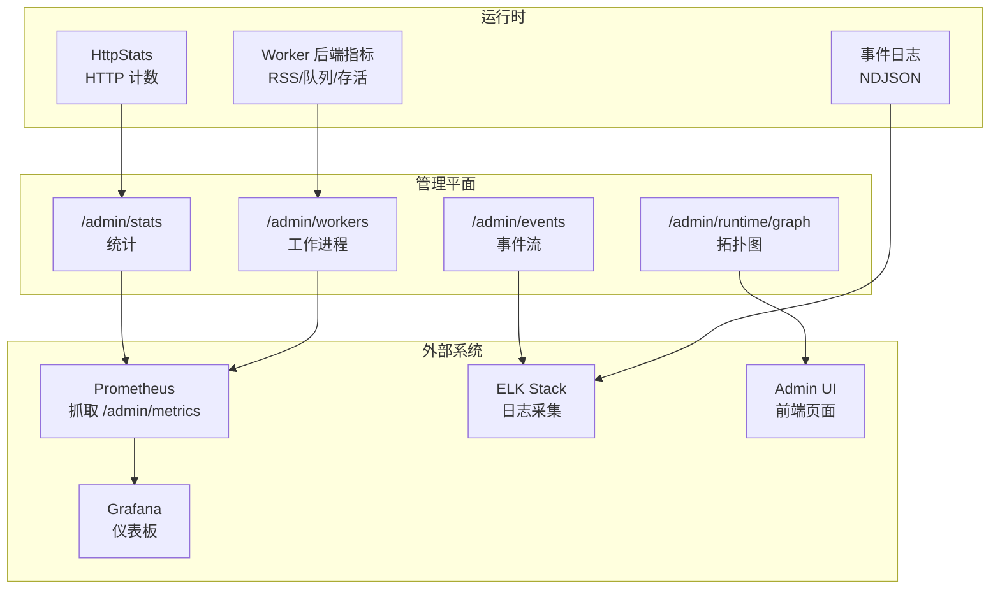
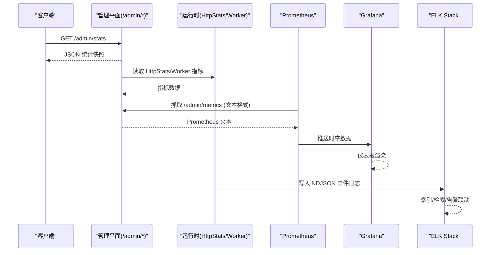
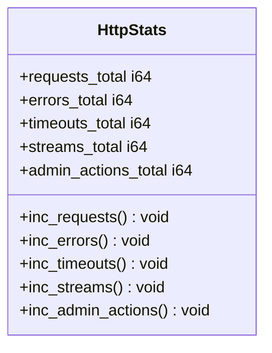
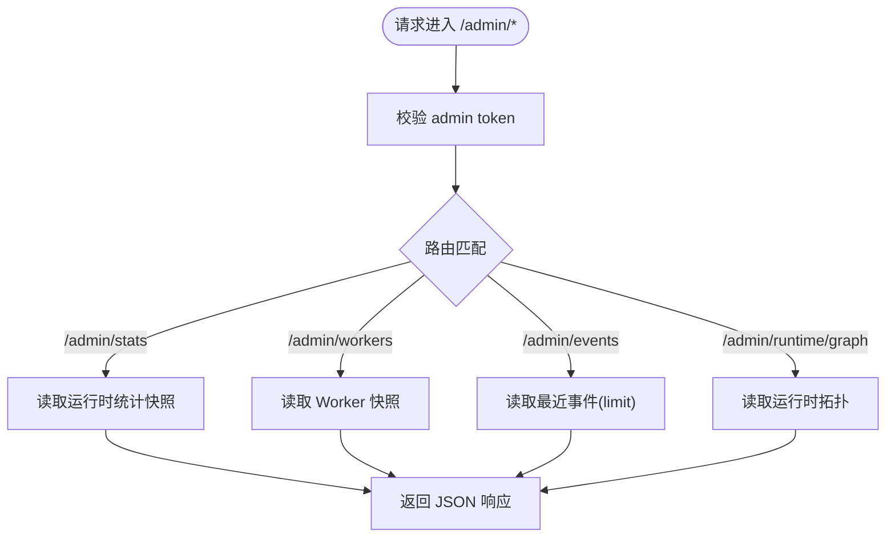
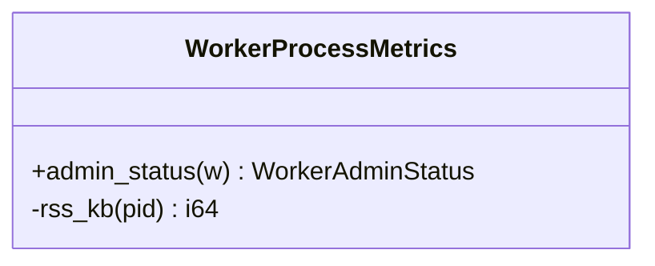
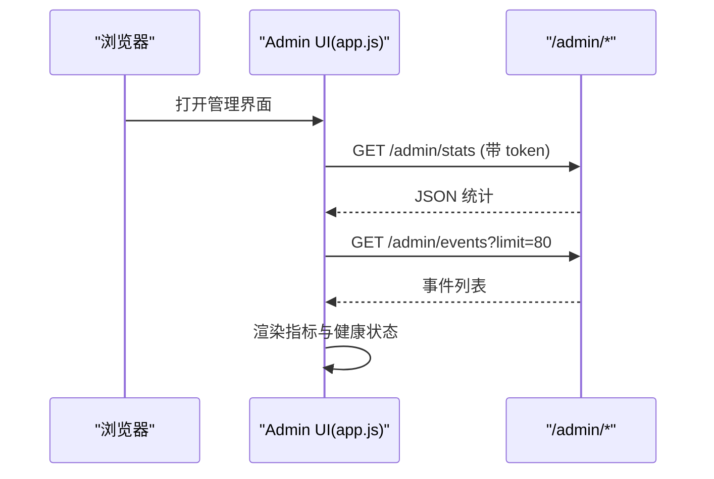
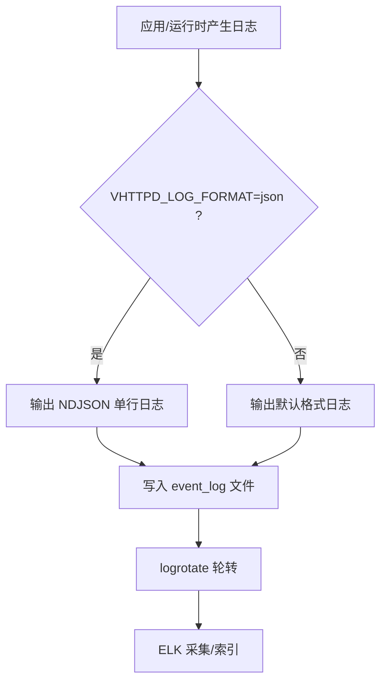
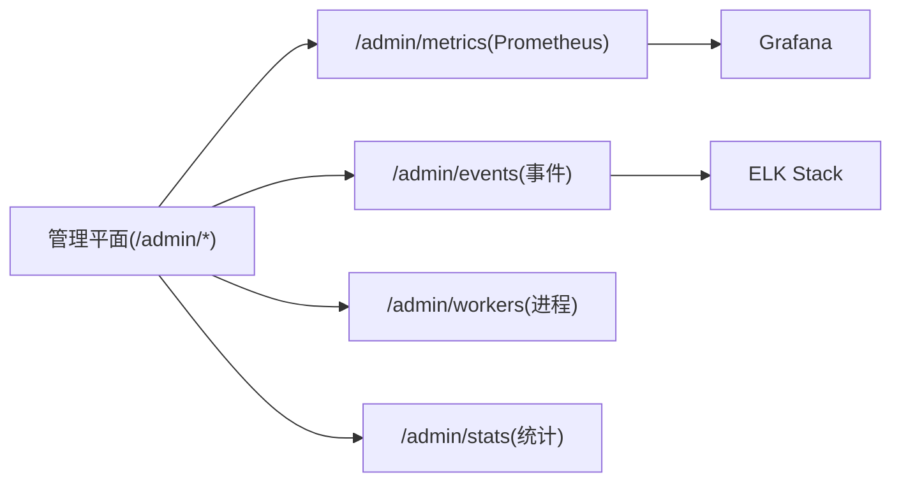

# 监控告警

<cite>
**本文引用的文件**   
- [src/http_stats.v](file://src/http_stats.v)
- [src/admin_runtime.v](file://src/admin_runtime.v)
- [src/admin_workers.v](file://src/admin_workers.v)
- [src/worker_backend_admin_runtime.v](file://src/worker_backend_admin_runtime.v)
- [admin/ui/app.js](file://admin/ui/app.js)
- [articles/11-observability.md](file://articles/11-observability.md)
- [config/vhttpd.example.toml](file://config/vhttpd.example.toml)
- [src/logging/runtime_logger.v](file://src/logging/runtime_logger.v)
- [docs/refactor_0601.md](file://docs/refactor_0601.md)
</cite>

## 目录
1. [简介](#简介)
2. [项目结构](#项目结构)
3. [核心组件](#核心组件)
4. [架构总览](#架构总览)
5. [详细组件分析](#详细组件分析)
6. [依赖关系分析](#依赖关系分析)
7. [性能与容量规划](#性能与容量规划)
8. [故障排查指南](#故障排查指南)
9. [结论](#结论)
10. [附录：配置与示例](#附录配置与示例)

## 简介
本指南面向生产环境，提供 vhttpd 的完整监控与告警方案。内容覆盖：
- 内置指标收集与导出机制（HTTP 请求统计、性能指标、资源使用情况）
- Prometheus 集成（抓取、查询、可视化仪表板）
- 日志聚合方案（结构化日志、轮转、集中式采集）
- 告警规则（服务可用性、性能阈值、错误率等）
- 自定义监控指标开发指南

## 项目结构
vhttpd 的可观测性由“管理平面 + 运行时统计 + 事件日志 + Admin UI”共同构成：
- 管理平面暴露 /admin/* 端点，用于获取运行时状态、统计、事件、工作进程信息等
- 运行时维护 HTTP 计数器、Worker 队列与内存等指标
- 事件日志以 NDJSON 格式输出，便于集中采集与分析
- Admin UI 通过前端拉取管理端点数据，进行可视化展示

图示来源
- [src/admin_runtime.v:37-73](file://src/admin_runtime.v#L37-L73)
- [src/admin_workers.v:1-44](file://src/admin_workers.v#L1-L44)
- [src/worker_backend_admin_runtime.v:1-40](file://src/worker_backend_admin_runtime.v#L1-L40)
- [src/http_stats.v:1-32](file://src/http_stats.v#L1-L32)
- [admin/ui/app.js:1-308](file://admin/ui/app.js#L1-L308)

章节来源
- [src/admin_runtime.v:37-73](file://src/admin_runtime.v#L37-L73)
- [src/admin_workers.v:1-44](file://src/admin_workers.v#L1-L44)
- [src/worker_backend_admin_runtime.v:1-40](file://src/worker_backend_admin_runtime.v#L1-L40)
- [src/http_stats.v:1-32](file://src/http_stats.v#L1-L32)
- [admin/ui/app.js:1-308](file://admin/ui/app.js#L1-L308)

## 核心组件
- HTTP 请求统计
  - 使用 HttpStats 维护请求总数、错误数、超时数、流式连接数、管理动作计数等，供上层统计与导出使用。
- 管理平面端点
  - /admin/stats：返回运行时统计快照（请求量、错误、延迟分位等）
  - /admin/workers：返回 Worker 池状态与每个进程的详细信息（PID、RSS、请求计数等）
  - /admin/events：返回最近的事件列表（限条数）
  - /admin/runtime/graph：返回运行时拓扑图数据
- 事件日志
  - 以 NDJSON 格式输出，包含 http.request、worker.request、upstream.*、error、mcp.* 等事件类型
- Admin UI
  - 前端通过 /admin/* 端点拉取数据，渲染仪表盘、健康状态、执行器分布等

章节来源
- [src/http_stats.v:1-32](file://src/http_stats.v#L1-L32)
- [src/admin_runtime.v:37-73](file://src/admin_runtime.v#L37-L73)
- [src/admin_workers.v:1-44](file://src/admin_workers.v#L1-L44)
- [src/worker_backend_admin_runtime.v:1-40](file://src/worker_backend_admin_runtime.v#L1-L40)
- [admin/ui/app.js:289-308](file://admin/ui/app.js#L289-L308)
- [admin/ui/app.js:656-675](file://admin/ui/app.js#L656-L675)
- [articles/11-observability.md:313-372](file://articles/11-observability.md#L313-L372)

## 架构总览
下图展示了从请求到指标、日志、告警与可视化的端到端链路。

图示来源
- [src/admin_runtime.v:37-73](file://src/admin_runtime.v#L37-L73)
- [src/admin_workers.v:1-44](file://src/admin_workers.v#L1-L44)
- [src/worker_backend_admin_runtime.v:1-40](file://src/worker_backend_admin_runtime.v#L1-L40)
- [src/http_stats.v:1-32](file://src/http_stats.v#L1-L32)
- [articles/11-observability.md:406-432](file://articles/11-observability.md#L406-L432)
- [articles/11-observability.md:313-372](file://articles/11-observability.md#L313-L372)

## 详细组件分析

### 组件一：HTTP 请求统计（HttpStats）
- 职责
  - 维护 per-request 计数器：请求总量、错误总量、超时总量、流式连接总量、管理动作总量
  - 为上层统计与管理端点提供基础数据
- 复杂度
  - 时间 O(1)，空间 O(1)
- 优化建议
  - 在高并发场景下，可考虑原子计数器或分段累加以降低锁竞争
  - 定期导出并重置累计值，避免整型溢出

图示来源
- [src/http_stats.v:1-32](file://src/http_stats.v#L1-L32)

章节来源
- [src/http_stats.v:1-32](file://src/http_stats.v#L1-L32)

### 组件二：管理平面端点（/admin/*）
- /admin/stats
  - 返回运行时统计快照，包括请求总量、错误、速率、延迟分位等
- /admin/workers
  - 返回 Worker 池状态与每个进程详情（PID、RSS、inflight/served 请求数、重启次数等）
- /admin/events
  - 返回最近事件列表（支持 limit 参数）
- /admin/runtime/graph
  - 返回运行时拓扑图数据，供 Admin UI 渲染

图示来源
- [src/admin_runtime.v:37-73](file://src/admin_runtime.v#L37-L73)
- [src/admin_workers.v:1-44](file://src/admin_workers.v#L1-L44)

章节来源
- [src/admin_runtime.v:37-73](file://src/admin_runtime.v#L37-L73)
- [src/admin_workers.v:1-44](file://src/admin_workers.v#L1-L44)

### 组件三：Worker 后端指标（进程级）
- 指标项
  - PID、是否存活、RSS 内存（KB）、draining 状态、inflight/served 请求数、重启次数、下次重试时间
- 实现要点
  - 通过系统命令获取 RSS（跨平台兼容），失败时回退为 0
  - 将进程指标映射为管理端点可消费的 WorkerAdminStatus

图示来源
- [src/worker_backend_admin_runtime.v:1-40](file://src/worker_backend_admin_runtime.v#L1-L40)

章节来源
- [src/worker_backend_admin_runtime.v:1-40](file://src/worker_backend_admin_runtime.v#L1-L40)

### 组件四：Admin UI 可视化
- 功能
  - 拉取 /admin/runtime、/admin/stats、/admin/events 等数据
  - 展示关键指标：HTTP 请求/错误、运行中路由、Relay 通道、WebSocket 会话、进程运行时长
  - 健康状态与执行器分布可视化
- 交互
  - 通过 x-vhttpd-admin-token 头进行认证访问

图示来源
- [admin/ui/app.js:1-308](file://admin/ui/app.js#L1-L308)
- [admin/ui/app.js:656-675](file://admin/ui/app.js#L656-L675)

章节来源
- [admin/ui/app.js:1-308](file://admin/ui/app.js#L1-L308)
- [admin/ui/app.js:656-675](file://admin/ui/app.js#L656-L675)

### 组件五：事件日志与结构化日志
- 事件日志
  - 路径与格式：NDJSON，包含 ts、kind、path、status、duration_ms 等字段
  - 常见 kind：http.request、worker.request、upstream.connect/close/message、error、mcp.session.*
- 结构化日志模式
  - 支持 VHTTPD_LOG_FORMAT=json 环境变量，输出单行 JSON（含 ts、level、module、msg 等）
  - 支持模块级日志级别控制（如 codex/debug、feishu/error）
- 日志级别配置
  - 通过 VHTTPD_LOG_LEVEL 设置全局级别（debug/info/warn/error/fatal）

图示来源
- [articles/11-observability.md:313-372](file://articles/11-observability.md#L313-L372)
- [docs/refactor_0601.md:366-379](file://docs/refactor_0601.md#L366-L379)
- [src/logging/runtime_logger.v:1-42](file://src/logging/runtime_logger.v#L1-L42)

章节来源
- [articles/11-observability.md:313-372](file://articles/11-observability.md#L313-L372)
- [docs/refactor_0601.md:366-379](file://docs/refactor_0601.md#L366-L379)
- [src/logging/runtime_logger.v:1-42](file://src/logging/runtime_logger.v#L1-L42)

## 依赖关系分析
- 管理平面与运行时
  - /admin/stats 与 /admin/workers 依赖运行时统计与 Worker 后端指标
  - /admin/events 依赖事件存储与查询
- 外部系统
  - Prometheus 抓取 /admin/metrics（文本格式）
  - ELK 采集 NDJSON 事件日志
  - Admin UI 依赖 /admin/* 端点进行可视化

图示来源
- [src/admin_runtime.v:37-73](file://src/admin_runtime.v#L37-L73)
- [src/admin_workers.v:1-44](file://src/admin_workers.v#L1-L44)
- [articles/11-observability.md:406-432](file://articles/11-observability.md#L406-L432)

章节来源
- [src/admin_runtime.v:37-73](file://src/admin_runtime.v#L37-L73)
- [src/admin_workers.v:1-44](file://src/admin_workers.v#L1-L44)
- [articles/11-observability.md:406-432](file://articles/11-observability.md#L406-L432)

## 性能与容量规划
- Worker 池
  - pool_size 建议为 CPU 核心数的 1~2 倍；max_requests 用于周期性重启以避免内存泄漏
- 超时与队列
  - read_timeout_ms 根据业务调整（普通请求较短，AI 流式较长）
  - queue_capacity 与 queue_timeout_ms 需结合峰值 QPS 评估
- MCP 与会话
  - max_sessions 与 session_ttl_seconds 需按预期并发会话规模设定
- 指标采样与导出
  - Prometheus scrape_interval 建议 15s；对高基数标签需谨慎，避免存储膨胀

[本节为通用指导，不直接分析具体文件]

## 故障排查指南
- Worker 无响应
  - 症状：请求堆积、响应缓慢
  - 步骤：查看 /admin/workers、检查 worker.log、过滤 events.ndjson 中的 worker.error、必要时重启问题 Worker
- 上游连接频繁断开
  - 症状：飞书/Ollama 连接不断重连
  - 步骤：查看 /admin/runtime/upstreams/websocket 及事件、测试上游连通性
- MCP 会话无法创建
  - 步骤：查看 /admin/runtime/mcp、检查 Worker 繁忙情况、过滤 mcp 相关事件
- 内存持续增长
  - 步骤：监控 memory_mb、检查各 Worker 内存、设置 max_requests 定期重启

章节来源
- [articles/11-observability.md:530-619](file://articles/11-observability.md#L530-L619)

## 结论
vhttpd 提供了完善的管理平面、事件日志与 Admin UI，配合 Prometheus 与 ELK 可实现端到端的监控与可观测性。在生产环境中，建议：
- 启用结构化日志与事件日志，统一采集至 ELK
- 配置 Prometheus 抓取 /admin/metrics，建立关键指标的仪表板与告警
- 合理设置 Worker 池、超时与队列容量，避免资源耗尽
- 基于错误率、队列积压、上游连接等维度制定告警策略

[本节为总结，不直接分析具体文件]

## 附录：配置与示例

### Prometheus 集成
- 抓取配置
  - targets 指向管理平面端口（例如 19981）
  - metrics_path 设置为 /admin/metrics
  - 通过 x-vhttpd-admin-token 头进行鉴权
- 自定义指标
  - 在 PHP Worker 中可通过 Metrics API 添加自定义指标（increment/gauge/histogram）

章节来源
- [articles/11-observability.md:406-432](file://articles/11-observability.md#L406-L432)

### 日志轮转与归档
- logrotate 配置
  - 针对 *.ndjson 每日轮转、压缩、保留 30 天
  - postrotate 发送 USR1 信号通知 vhttpd 重新打开日志文件
- 归档策略
  - 实时日志 7 天、压缩日志 30 天、统计摘要 90 天

章节来源
- [articles/11-observability.md:436-468](file://articles/11-observability.md#L436-L468)

### 告警规则示例
- 推荐规则
  - Worker 池耗尽（critical）
  - Worker 队列积压（warning）
  - 高错误率（warning）
  - 上游连接断开（critical）
  - MCP 会话接近上限（warning）

章节来源
- [articles/11-observability.md:469-526](file://articles/11-observability.md#L469-L526)

### 配置文件参考
- 管理平面与事件日志路径
  - admin.host/port/token
  - files.event_log 指定 NDJSON 事件日志路径
- Worker 与执行器
  - worker.pool_size、read_timeout_ms、max_requests
  - executor.kind、php.bin、extensions 等

章节来源
- [config/vhttpd.example.toml:1-67](file://config/vhttpd.example.toml#L1-L67)