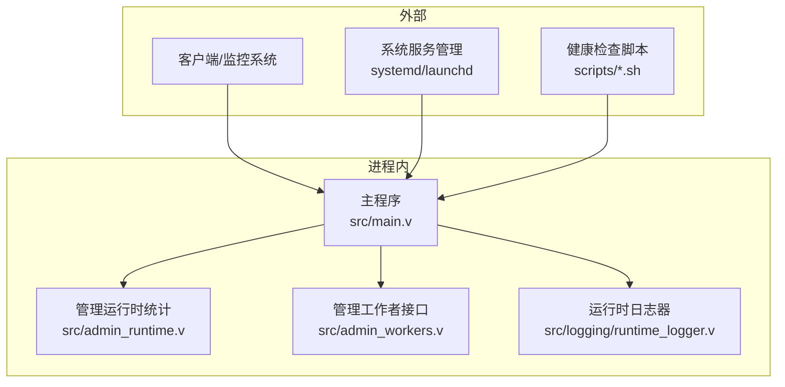
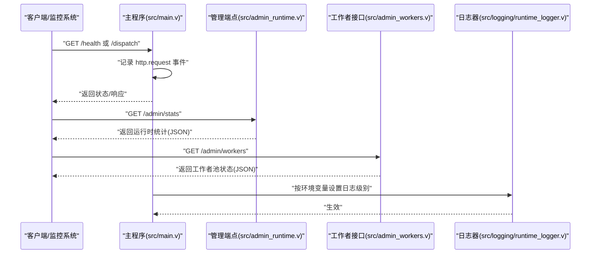
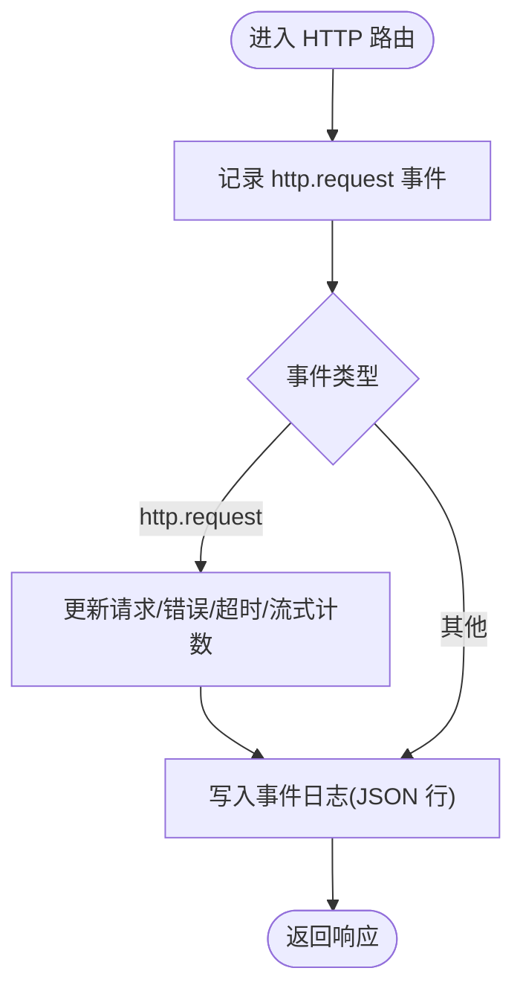
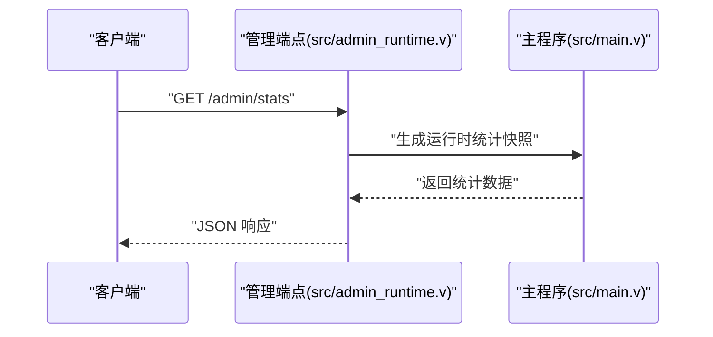
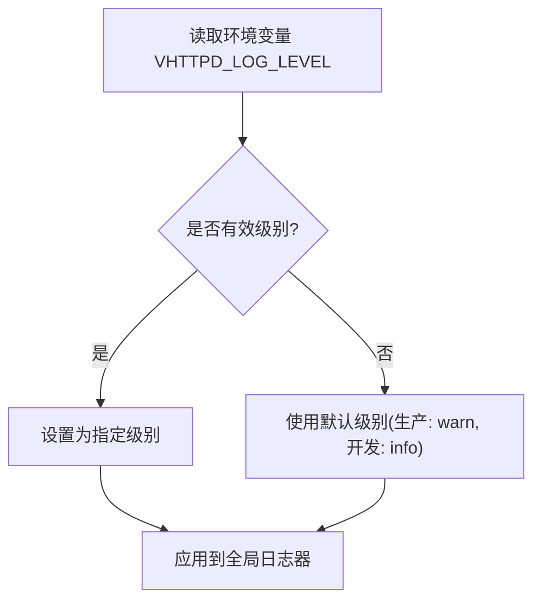
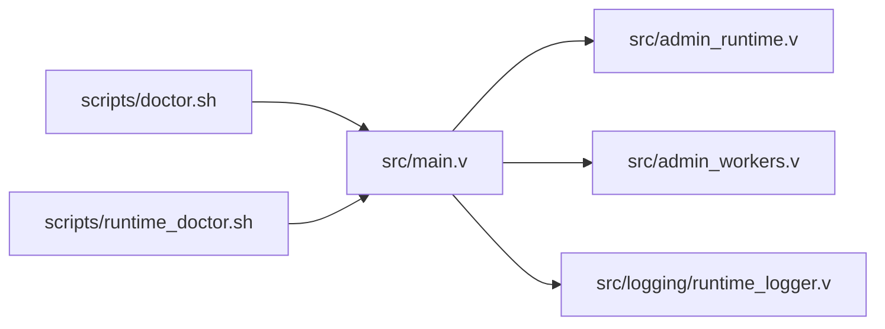

# 监控告警

<cite>
**本文引用的文件**   
- [src/main.v](file://src/main.v)
- [src/admin_runtime.v](file://src/admin_runtime.v)
- [src/admin_workers.v](file://src/admin_workers.v)
- [src/logging/runtime_logger.v](file://src/logging/runtime_logger.v)
- [scripts/doctor.sh](file://scripts/doctor.sh)
- [scripts/runtime_doctor.sh](file://scripts/runtime_doctor.sh)
- [README.md](file://README.md)
- [config/vhttpd.example.toml](file://config/vhttpd.example.toml)
</cite>

## 目录
1. [简介](#简介)
2. [项目结构](#项目结构)
3. [核心组件](#核心组件)
4. [架构总览](#架构总览)
5. [详细组件分析](#详细组件分析)
6. [依赖关系分析](#依赖关系分析)
7. [性能考量与基线建立](#性能考量与基线建立)
8. [故障排查指南](#故障排查指南)
9. [结论](#结论)
10. [附录](#附录)

## 简介
本文件面向运维团队，提供 vhttpd 的监控与告警实践指南。内容覆盖关键运行指标采集（CPU、内存、连接数、请求处理性能）、系统健康检查脚本使用（doctor.sh 与 runtime_doctor.sh）、日志级别配置与监控策略（info、warn、error 等），以及告警规则配置示例（阈值与通知机制）。同时给出性能基线建立与异常检测方法，帮助在生产环境中稳定运行与快速定位问题。

## 项目结构
vhttpd 提供了内置的可观测性端点与事件日志能力，并通过脚本进行系统级健康检查。关键位置如下：
- 运行时统计与事件日志：位于主程序模块中，暴露 HTTP 统计与事件流
- 管理端点：/admin/stats、/admin/runtime、/admin/workers 等
- 日志配置：支持通过环境变量控制日志级别
- 健康检查脚本：doctor.sh 与 runtime_doctor.sh

**图示来源**
- [src/main.v:996-1621](file://src/main.v#L996-L1621)
- [src/admin_runtime.v:16-61](file://src/admin_runtime.v#L16-L61)
- [src/admin_workers.v:67-87](file://src/admin_workers.v#L67-L87)
- [src/logging/runtime_logger.v:1-39](file://src/logging/runtime_logger.v#L1-L39)

**章节来源**
- [README.md:1091-1120](file://README.md#L1091-L1120)

## 核心组件
- 运行时事件与统计
  - 主程序负责记录 HTTP 请求事件、错误、超时、流式响应等，并写入事件日志文件
  - 管理端点提供运行时统计快照，包括请求总量、错误总量、超时总量、流式请求数、管理员操作次数等
- 日志级别控制
  - 支持通过环境变量设置日志级别，默认生产环境为 warn，开发环境为 info
- 健康检查脚本
  - doctor.sh：系统级健康检查
  - runtime_doctor.sh：运行时健康检查（结合管理端点）

**章节来源**
- [src/main.v:996-1033](file://src/main.v#L996-L1033)
- [src/admin_runtime.v:16-61](file://src/admin_runtime.v#L16-L61)
- [src/logging/runtime_logger.v:6-39](file://src/logging/runtime_logger.v#L6-L39)
- [scripts/doctor.sh](file://scripts/doctor.sh)
- [scripts/runtime_doctor.sh](file://scripts/runtime_doctor.sh)

## 架构总览
下图展示从客户端到管理端点与事件日志的整体流程，以及健康检查脚本如何与主程序交互。

**图示来源**
- [src/main.v:1537-1575](file://src/main.v#L1537-L1575)
- [src/main.v:1577-1621](file://src/main.v#L1577-L1621)
- [src/admin_runtime.v:16-61](file://src/admin_runtime.v#L16-L61)
- [src/admin_workers.v:67-87](file://src/admin_workers.v#L67-L87)
- [src/logging/runtime_logger.v:34-39](file://src/logging/runtime_logger.v#L34-L39)

## 详细组件分析

### 运行时统计与事件日志
- 指标采集
  - 请求总量、错误总量（>=400）、超时总量、流式请求数、管理员操作次数
  - 事件日志字段包含类型、时间戳、请求方法、路径、状态码、耗时等
- 端点
  - /admin/stats 返回当前运行时统计快照
  - /events/stream 可用于观测事件流（SSE）
- 写入策略
  - 事件以 JSON 行形式追加到事件日志文件

**图示来源**
- [src/main.v:996-1033](file://src/main.v#L996-L1033)
- [src/main.v:1537-1575](file://src/main.v#L1537-L1575)
- [src/main.v:1577-1621](file://src/main.v#L1577-L1621)

**章节来源**
- [src/main.v:996-1033](file://src/main.v#L996-L1033)
- [src/admin_workers.v:67-87](file://src/admin_workers.v#L67-L87)
- [README.md:1091-1120](file://README.md#L1091-L1120)

### 管理端点与运行时快照
- /admin/stats
  - 返回启动时间、运行时长、HTTP 统计、工作者队列统计、上游会话统计、MCP 统计、管理员操作总数等
- /admin/runtime
  - 返回运行时能力标志、活跃 WebSocket/Upstream/MCP 数量等
- /admin/workers
  - 返回工作者池状态（存活/降载/处理中/重启次数等）

**图示来源**
- [src/admin_runtime.v:16-61](file://src/admin_runtime.v#L16-L61)
- [src/admin_workers.v:67-87](file://src/admin_workers.v#L67-L87)

**章节来源**
- [src/admin_runtime.v:16-61](file://src/admin_runtime.v#L16-L61)
- [src/admin_workers.v:67-87](file://src/admin_workers.v#L67-L87)
- [README.md:1091-1120](file://README.md#L1091-L1120)

### 日志级别配置与监控策略
- 默认级别
  - 生产环境默认 warn；开发环境默认 info
- 环境变量
  - 通过 VHTTPD_LOG_LEVEL 设置日志级别，支持 debug、info、warn/warning、error、fatal
- 监控策略建议
  - info：常规运行信息，适合日常巡检
  - warn：潜在问题或异常行为，建议触发预警
  - error：错误事件，建议触发告警
  - fatal：致命错误，立即告警并触发自动恢复

**图示来源**
- [src/logging/runtime_logger.v:6-39](file://src/logging/runtime_logger.v#L6-L39)

**章节来源**
- [src/logging/runtime_logger.v:6-39](file://src/logging/runtime_logger.v#L6-L39)

### 健康检查脚本使用指南
- doctor.sh
  - 执行系统级健康检查，验证依赖、端口、权限等
- runtime_doctor.sh
  - 结合管理端点进行运行时健康检查，如访问 /admin/stats、/admin/runtime、/health 等
- 执行方式
  - 在目标主机上赋予可执行权限后直接运行
  - 建议纳入定时任务或运维编排系统

**章节来源**
- [scripts/doctor.sh](file://scripts/doctor.sh)
- [scripts/runtime_doctor.sh](file://scripts/runtime_doctor.sh)
- [README.md:1091-1120](file://README.md#L1091-L1120)

## 依赖关系分析
- 主程序对管理端点与日志器存在直接依赖
- 管理端点依赖主程序的运行时统计快照生成逻辑
- 健康检查脚本依赖主程序提供的健康与管理端点

**图示来源**
- [src/main.v:996-1621](file://src/main.v#L996-L1621)
- [src/admin_runtime.v:16-61](file://src/admin_runtime.v#L16-L61)
- [src/admin_workers.v:67-87](file://src/admin_workers.v#L67-L87)
- [src/logging/runtime_logger.v:1-39](file://src/logging/runtime_logger.v#L1-L39)
- [scripts/doctor.sh](file://scripts/doctor.sh)
- [scripts/runtime_doctor.sh](file://scripts/runtime_doctor.sh)

**章节来源**
- [src/main.v:996-1621](file://src/main.v#L996-L1621)
- [src/admin_runtime.v:16-61](file://src/admin_runtime.v#L16-L61)
- [src/admin_workers.v:67-87](file://src/admin_workers.v#L67-L87)
- [src/logging/runtime_logger.v:1-39](file://src/logging/runtime_logger.v#L1-L39)
- [scripts/doctor.sh](file://scripts/doctor.sh)
- [scripts/runtime_doctor.sh](file://scripts/runtime_doctor.sh)

## 性能考量与基线建立
- 关键指标
  - QPS（每秒请求数）：基于 /admin/stats 中的 requests_total 变化率
  - 错误率：errors_total 变化率 / requests_total
  - 超时率：timeouts_total 变化率 / requests_total
  - 流式请求占比：streams_total / requests_total
  - 工作者队列等待/拒绝/超时：worker waits/rejected/timeouts 计数变化率
- 基线建立步骤
  1) 在稳定期采集一段时间的指标序列（如 15–60 分钟）
  2) 统计均值与标准差，设定正常波动范围
  3) 定义告警阈值（例如均值 ± 2σ）
  4) 将阈值固化为监控策略的一部分
- 异常检测方法
  - 移动平均与指数平滑识别趋势突变
  - 周期性模式（如业务高峰）需单独建模
  - 对比历史同时间段指标，避免误报

[本节为通用性能建议，不直接分析具体文件，故无“章节来源”]

## 故障排查指南
- 快速自检
  - 使用 doctor.sh 检查系统依赖与运行环境
  - 使用 runtime_doctor.sh 访问 /health、/admin/stats、/admin/runtime 等端点，确认服务可用与统计正常
- 日志级别调整
  - 临时提升日志级别至 debug，捕获更细粒度信息
  - 通过 VHTTPD_LOG_LEVEL 设置，重启服务后生效
- 常见问题定位
  - 高错误率：关注 /admin/stats 中 errors_total 增长速率与错误类字段
  - 高超时率：关注 timeouts_total 增长速率与 /dispatch 的 duration_ms 字段
  - 工作者积压：关注 worker waits/rejected/timeouts 计数变化

**章节来源**
- [scripts/doctor.sh](file://scripts/doctor.sh)
- [scripts/runtime_doctor.sh](file://scripts/runtime_doctor.sh)
- [src/logging/runtime_logger.v:25-39](file://src/logging/runtime_logger.v#L25-L39)
- [src/main.v:1537-1575](file://src/main.v#L1537-L1575)
- [src/main.v:1577-1621](file://src/main.v#L1577-L1621)

## 结论
通过结合内置管理端点与事件日志，配合健康检查脚本与日志级别控制，vhttpd 提供了完善的监控与告警基础。建议运维团队以 /admin/stats 为核心指标源，建立性能基线与异常检测模型，并根据业务场景配置合理的告警阈值与通知机制，确保系统稳定与快速恢复。

[本节为总结性内容，不直接分析具体文件，故无“章节来源”]

## 附录

### 告警规则配置示例（模板思路）
- 规则维度
  - 指标：requests_total、errors_total、timeouts_total、streams_total、admin_actions_total
  - 时间窗口：5 分钟滚动
  - 条件：变化率超过阈值或绝对值超过阈值
- 通知机制
  - warn：邮件/IM 提醒
  - error：短信/电话告警
  - fatal：自动重启/隔离与人工介入
- 参考端点
  - /admin/stats：获取运行时统计
  - /health：健康检查
  - /events/stream：事件流观测

**章节来源**
- [src/admin_runtime.v:16-61](file://src/admin_runtime.v#L16-L61)
- [README.md:1091-1120](file://README.md#L1091-L1120)

### 日志级别与环境变量
- 环境变量：VHTTPD_LOG_LEVEL
- 支持级别：debug、info、warn/warning、error、fatal
- 默认级别：生产环境 warn，开发环境 info

**章节来源**
- [src/logging/runtime_logger.v:6-39](file://src/logging/runtime_logger.v#L6-L39)

### 配置文件参考
- 示例配置文件：config/vhttpd.example.toml
- 建议在配置中明确日志输出路径与事件日志文件位置，便于采集与归档

**章节来源**
- [config/vhttpd.example.toml](file://config/vhttpd.example.toml)