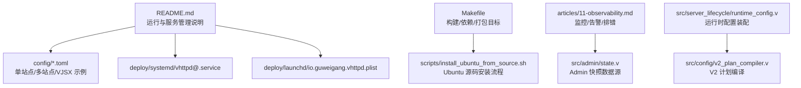
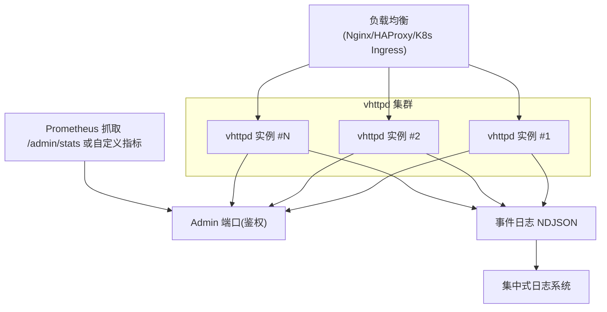
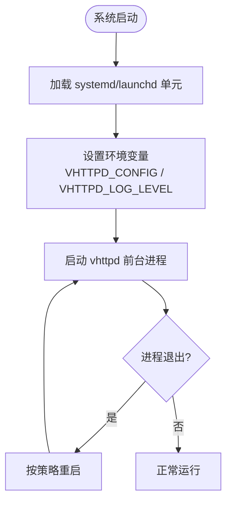
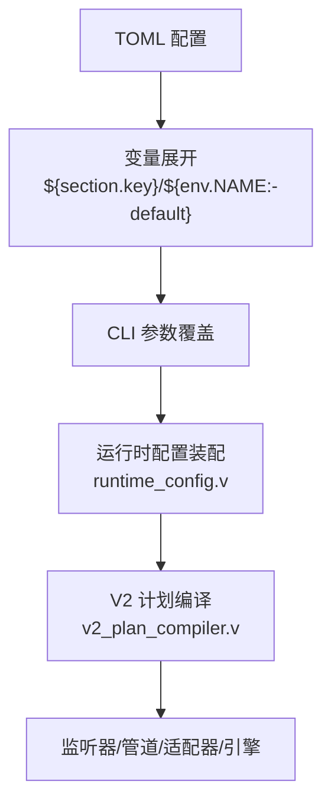
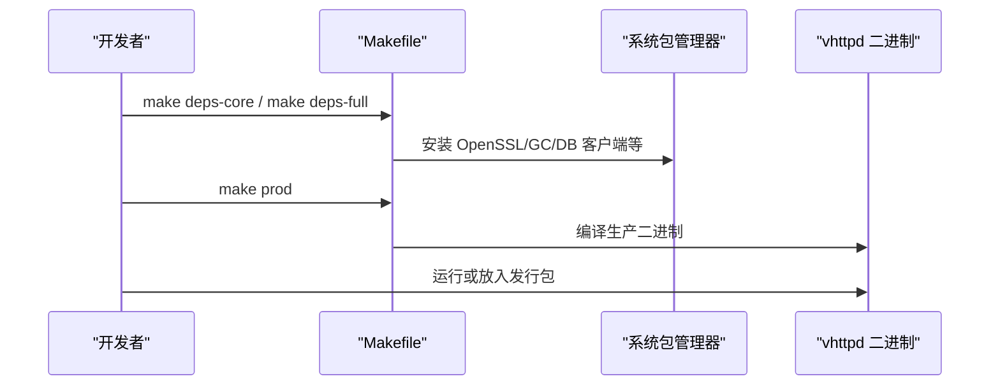
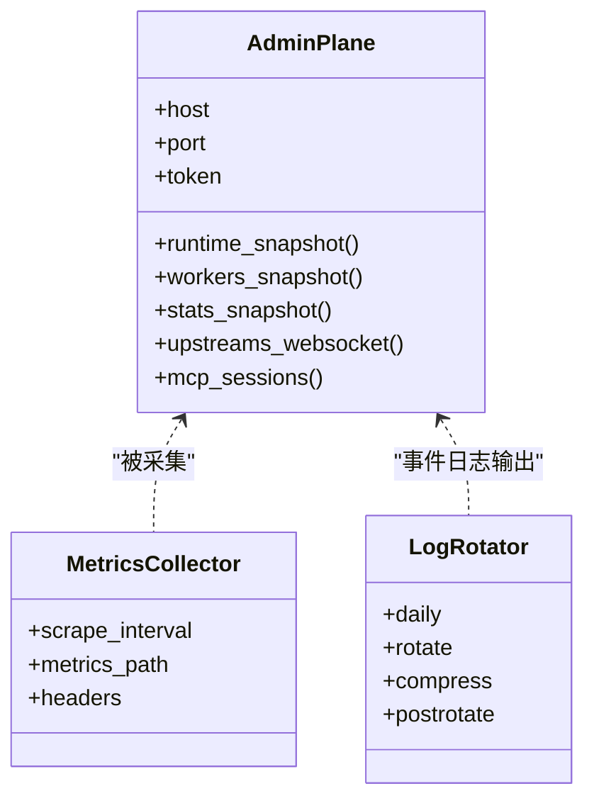
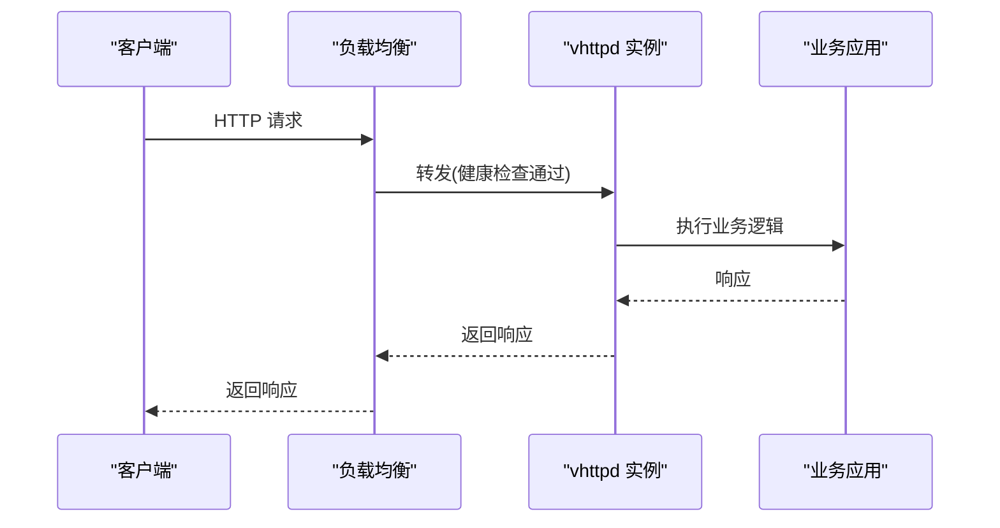
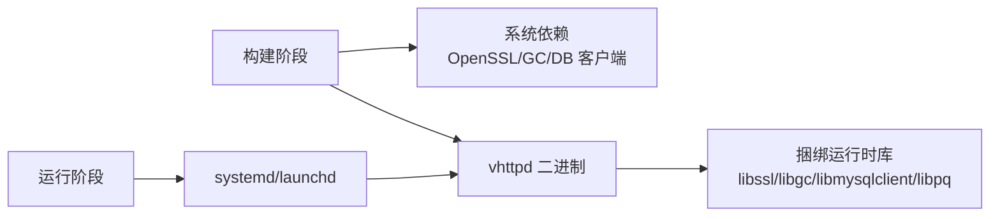

# 部署运维

<cite>
**本文引用的文件**   
- [README.md](file://README.md)
- [vhttpd.example.toml](file://config/vhttpd.example.toml)
- [vhttpd.multi.example.toml](file://config/vhttpd.multi.example.toml)
- [vhttpd.vjsx.example.toml](file://config/vhttpd.vjsx.example.toml)
- [vhttpd@.service](file://deploy/systemd/vhttpd@.service)
- [io.guweigang.vhttpd.plist](file://deploy/launchd/io.guweigang.vhttpd.plist)
- [11-observability.md](file://articles/11-observability.md)
- [Makefile](file://Makefile)
- [install_ubuntu_from_source.sh](file://scripts/install_ubuntu_from_source.sh)
- [runtime_config.v](file://src/server_lifecycle/runtime_config.v)
- [v2_plan_compiler.v](file://src/config/v2_plan_compiler.v)
- [admin_state.v](file://src/admin/state.v)
</cite>

## 目录
1. [简介](#简介)
2. [项目结构](#项目结构)
3. [核心组件](#核心组件)
4. [架构总览](#架构总览)
5. [详细组件分析](#详细组件分析)
6. [依赖关系分析](#依赖关系分析)
7. [性能考虑](#性能考虑)
8. [故障排查指南](#故障排查指南)
9. [结论](#结论)
10. [附录](#附录)

## 简介
本指南面向生产环境，提供 vhttpd 的容器化与编排、负载均衡、服务管理（systemd/launchd）、监控告警、日志聚合、备份恢复、灾难恢复、版本升级、故障诊断与性能调优等端到端运维方案。内容基于仓库内现有配置模板、示例与文档整理而成，确保可落地执行。

## 项目结构
与部署运维直接相关的目录与文件：
- 配置示例：config/*.toml
- 服务管理模板：deploy/systemd/*, deploy/launchd/*
- 构建与安装脚本：Makefile, scripts/*
- 可观测性与运维文章：articles/11-observability.md
- 运行时配置解析与计划编译：src/server_lifecycle/runtime_config.v, src/config/v2_plan_compiler.v
- 管理平面状态快照：src/admin/state.v

**图表来源** 
- [README.md](file://README.md)
- [vhttpd.example.toml](file://config/vhttpd.example.toml)
- [vhttpd.multi.example.toml](file://config/vhttpd.multi.example.toml)
- [vhttpd.vjsx.example.toml](file://config/vhttpd.vjsx.example.toml)
- [vhttpd@.service](file://deploy/systemd/vhttpd@.service)
- [io.guweigang.vhttpd.plist](file://deploy/launchd/io.guweigang.vhttpd.plist)
- [Makefile](file://Makefile)
- [install_ubuntu_from_source.sh](file://scripts/install_ubuntu_from_source.sh)
- [11-observability.md](file://articles/11-observability.md)
- [runtime_config.v](file://src/server_lifecycle/runtime_config.v)
- [v2_plan_compiler.v](file://src/config/v2_plan_compiler.v)
- [admin_state.v](file://src/admin/state.v)

**章节来源**
- [README.md](file://README.md)
- [vhttpd.example.toml](file://config/vhttpd.example.toml)
- [vhttpd.multi.example.toml](file://config/vhttpd.multi.example.toml)
- [vhttpd.vjsx.example.toml](file://config/vhttpd.vjsx.example.toml)
- [vhttpd@.service](file://deploy/systemd/vhttpd@.service)
- [io.guweigang.vhttpd.plist](file://deploy/launchd/io.guweigang.vhttpd.plist)
- [Makefile](file://Makefile)
- [install_ubuntu_from_source.sh](file://scripts/install_ubuntu_from_source.sh)
- [11-observability.md](file://articles/11-observability.md)
- [runtime_config.v](file://src/server_lifecycle/runtime_config.v)
- [v2_plan_compiler.v](file://src/config/v2_plan_compiler.v)
- [admin_state.v](file://src/admin/state.v)

## 核心组件
- 进程模型与入口
  - vhttpd 以前台模式运行，由外部服务管理器负责生命周期管理（systemd/launchd）。
  - 支持 TOML 配置与 CLI 参数叠加，CLI 优先级最高。
- 监听器与站点
  - 单站点与多站点（multi-listener）均受统一配置模型驱动；每个站点可独立选择执行器（php/vjsx）。
- 管理平面（Admin Plane）
  - 独立的控制端口暴露运行时快照、Worker 管理、上游连接与事件等能力，需 token 鉴权。
- 可观测性
  - 事件日志（NDJSON）、Admin 指标与统计、Prometheus 集成建议、logrotate 轮转策略。

**章节来源**
- [README.md](file://README.md)
- [vhttpd.example.toml](file://config/vhttpd.example.toml)
- [vhttpd.multi.example.toml](file://config/vhttpd.multi.example.toml)
- [vhttpd.vjsx.example.toml](file://config/vhttpd.vjsx.example.toml)
- [11-observability.md](file://articles/11-observability.md)

## 架构总览
下图展示生产环境典型部署拓扑：前端负载均衡将流量分发至多个 vhttpd 实例；各实例通过 Admin 端口暴露监控与管理接口；事件日志输出到本地或集中式日志系统；可选 Prometheus 抓取 Admin 指标。

[此图为概念性架构图，不直接映射具体源码文件]

## 详细组件分析

### 服务管理：systemd 与 launchd
- systemd 单元模板
  - 使用实例化单元 vhttpd@.service，通过 %i 区分不同站点配置（如 prod/staging）。
  - 设置工作目录、环境变量、重启策略、资源限制与安全加固选项。
- macOS launchd plist 模板
  - 通过 EnvironmentVariables 注入 VHTTPD_CONFIG 路径，指定标准输出/错误日志路径，设置文件描述符上限。
- 推荐实践
  - Linux 使用 systemd，macOS 使用 launchd；保持 vhttpd 前台运行，交由系统服务管理器接管。

**图表来源** 
- [vhttpd@.service](file://deploy/systemd/vhttpd@.service)
- [io.guweigang.vhttpd.plist](file://deploy/launchd/io.guweigang.vhttpd.plist)

**章节来源**
- [README.md](file://README.md)
- [vhttpd@.service](file://deploy/systemd/vhttpd@.service)
- [io.guweigang.vhttpd.plist](file://deploy/launchd/io.guweigang.vhttpd.plist)

### 配置模型与多站点部署
- 单站点示例：server、files、worker、executor、admin、assets、feishu 等段。
- 多站点示例：通过 [sites.<id>] 定义多个监听器与站点，各自选择 executor 与 worker 参数。
- VJSX 示例：在 in-proc 模式下启用 vjsx 执行器，无需外部 worker。
- 变量展开与环境注入
  - TOML 字符串字段支持 ${section.key}、${env.NAME:-default} 展开；[worker.env] 注入到子进程环境。

**图表来源** 
- [vhttpd.example.toml](file://config/vhttpd.example.toml)
- [vhttpd.multi.example.toml](file://config/vhttpd.multi.example.toml)
- [vhttpd.vjsx.example.toml](file://config/vhttpd.vjsx.example.toml)
- [runtime_config.v](file://src/server_lifecycle/runtime_config.v)
- [v2_plan_compiler.v](file://src/config/v2_plan_compiler.v)

**章节来源**
- [README.md](file://README.md)
- [vhttpd.example.toml](file://config/vhttpd.example.toml)
- [vhttpd.multi.example.toml](file://config/vhttpd.multi.example.toml)
- [vhttpd.vjsx.example.toml](file://config/vhttpd.vjsx.example.toml)
- [runtime_config.v](file://src/server_lifecycle/runtime_config.v)
- [v2_plan_compiler.v](file://src/config/v2_plan_compiler.v)

### 构建与安装
- Makefile 目标
  - deps-core/deps-vjsx/deps-db/deps-full：安装构建依赖与 vjsx/DB 支持。
  - build/prod/build-prod：构建开发/生产二进制；prod 默认日志级别 warn。
  - test/test-e2e：快速测试与端到端测试。
- Ubuntu 源码安装脚本
  - 自动拉取 V 编译器并安装系统依赖（OpenSSL、GC、MySQL/PostgreSQL/SQLite 客户端库等）。
- 打包与分发
  - README 中描述了打包产物结构与 runtime libs 捆绑策略（RPATH/@loader_path），便于在无系统依赖环境中运行。

**图表来源** 
- [Makefile](file://Makefile)
- [install_ubuntu_from_source.sh](file://scripts/install_ubuntu_from_source.sh)
- [README.md](file://README.md)

**章节来源**
- [Makefile](file://Makefile)
- [install_ubuntu_from_source.sh](file://scripts/install_ubuntu_from_source.sh)
- [README.md](file://README.md)

### 监控与告警
- Admin 平面
  - 独立端口 + token 鉴权；提供运行时摘要、Worker 列表、统计、上游连接与事件、MCP 会话等。
- 指标与采集
  - 可通过 Admin 统计端点或自定义指标暴露给 Prometheus；建议仅在内网访问。
- 事件日志
  - NDJSON 格式，包含 HTTP/Worker/Upstream/MCP 等事件；配合 logrotate 进行轮转归档。
- 告警规则
  - 针对 Worker 池耗尽、队列积压、错误率、上游断开、MCP 会话接近上限等场景给出阈值建议。

**图表来源** 
- [11-observability.md](file://articles/11-observability.md)
- [admin_state.v](file://src/admin/state.v)

**章节来源**
- [11-observability.md](file://articles/11-observability.md)
- [admin_state.v](file://src/admin/state.v)

### 负载均衡与健康检查
- 健康检查
  - 建议在业务层实现 /health 端点，返回应用与依赖（数据库等）状态；用于 K8s readiness/liveness 探针或 Nginx upstream 健康检查。
- 反向代理
  - 使用 Nginx/HAProxy/K8s Ingress 将流量分发到多个 vhttpd 实例；结合后端健康检查与重试策略提升可用性。
- 多站点路由
  - 利用 multi-listener 在不同 host:port 上承载不同站点，简化反向代理的路由复杂度。

[此图为概念性流程图，不直接映射具体源码文件]

### 容器化与 Kubernetes 编排
- 容器镜像
  - 参考 README 中的打包与分发说明，优先使用 CI 产出的二进制与 bundled runtime libs；可在镜像中复制二进制与必要依赖，避免运行时系统依赖缺失。
- 最小镜像建议
  - 使用 distroless/slim 基础镜像，仅拷贝 vhttpd 二进制与 runtime/libs；通过 RPATH/@loader_path 指向内置库。
- Kubernetes 部署要点
  - Deployment：副本数根据负载与 Worker 池大小设定；资源请求/限制合理分配 CPU/内存。
  - Service：ClusterIP 暴露内部服务；Ingress/Nginx 作为入口。
  - Probes：readinessProbe 调用 /health；livenessProbe 检测进程存活。
  - ConfigMap/Secret：挂载 TOML 配置与敏感信息（如 admin token、第三方密钥）。
  - Horizontal Pod Autoscaler：基于 CPU/内存或自定义指标（来自 Admin 统计）扩缩容。
  - 滚动更新：通过新版本镜像与配置替换，结合 drain 策略保证零停机。

[本节为通用编排建议，未直接引用具体源码文件]

### 备份恢复与灾难恢复
- 备份范围
  - 配置文件（/etc/vhttpd/*.toml）、事件日志（NDJSON）、应用数据（如 SQLite/MySQL/PostgreSQL 数据目录）。
- 恢复步骤
  - 停止服务 -> 恢复配置与数据 -> 校验配置与依赖 -> 启动服务 -> 验证健康检查与关键路径。
- 灾难恢复演练
  - 定期在隔离环境演练完整恢复流程，记录 RTO/RPO 指标并优化。

[本节为通用运维建议，未直接引用具体源码文件]

### 版本升级指南
- 灰度发布
  - 先升级部分实例，观察 Admin 指标与错误率，再全量升级。
- 配置变更
  - 使用 V2 计划模型，逐步迁移旧配置；通过兼容性编译与诊断提示定位问题。
- 回滚策略
  - 保留上一版本二进制与配置快照；若异常则快速回滚并恢复数据。

**章节来源**
- [README.md](file://README.md)
- [v2_plan_compiler.v](file://src/config/v2_plan_compiler.v)

## 依赖关系分析
- 构建期依赖
  - OpenSSL、Boehm GC、pkg-config、DB 客户端开发包（MySQL/PostgreSQL/SQLite）。
- 运行期依赖
  - 打包时捆绑 libssl/libcrypto/libgc/libmysqlclient/libpq 等，通过 RPATH/@loader_path 优先加载。
- 服务管理依赖
  - systemd/launchd 单元模板要求正确的用户/组、目录权限与文件描述符限制。

**图表来源** 
- [Makefile](file://Makefile)
- [install_ubuntu_from_source.sh](file://scripts/install_ubuntu_from_source.sh)
- [README.md](file://README.md)

**章节来源**
- [Makefile](file://Makefile)
- [install_ubuntu_from_source.sh](file://scripts/install_ubuntu_from_source.sh)
- [README.md](file://README.md)

## 性能考虑
- Worker 池
  - pool_size 建议为 CPU 核心数的 1~2 倍；max_requests 定期重启以避免内存泄漏。
- 超时与队列
  - read_timeout_ms 根据业务类型调整；queue_capacity/queue_timeout_ms 防止背压导致雪崩。
- 资源限制
  - systemd/launchd 中设置 LimitNOFILE 与软/硬限制，避免文件描述符耗尽。
- 缓存与静态资源
  - assets 开启缓存控制头，减少重复传输开销。

**章节来源**
- [vhttpd.example.toml](file://config/vhttpd.example.toml)
- [vhttpd.multi.example.toml](file://config/vhttpd.multi.example.toml)
- [vhttpd.vjsx.example.toml](file://config/vhttpd.vjsx.example.toml)
- [vhttpd@.service](file://deploy/systemd/vhttpd@.service)
- [io.guweigang.vhttpd.plist](file://deploy/launchd/io.guweigang.vhttpd.plist)

## 故障排查指南
- 常见问题
  - Worker 无响应：查看 Admin workers 快照与事件日志，必要时重启单个或全部 Worker。
  - 上游连接频繁断开：检查上游服务连通性与 Token 有效期，关注 upstream 事件。
  - MCP 会话无法创建：核对 MCP 状态与 Worker 繁忙情况，查看相关错误日志。
  - 内存持续增长：设置 max_requests 定期重启 Worker，优化应用内存占用。
- 工具链
  - Admin 端点：/admin/runtime、/admin/workers、/admin/stats、/admin/runtime/upstreams/websocket、/admin/runtime/mcp。
  - 事件日志：tail -f events.ndjson | jq .，筛选 error 与特定 kind。
  - Prometheus：抓取 /admin/stats 或自定义指标，配置告警规则。

**章节来源**
- [11-observability.md](file://articles/11-observability.md)
- [admin_state.v](file://src/admin/state.v)

## 结论
通过 systemd/launchd 管理服务、TOML 配置与多站点模型、Admin 平面与事件日志、以及 Prometheus 与 logrotate 的可观测性组合，vhttpd 在生产环境可实现高可用、易运维与可观测的目标。结合容器化与 Kubernetes 编排，可进一步获得弹性伸缩与自动化发布能力。

## 附录
- 快速命令参考
  - 构建与安装：make deps-core, make prod, bash scripts/install_ubuntu_from_source.sh
  - 服务管理：systemctl enable --now vhttpd@prod；launchctl bootstrap gui/$(id -u) ~/Library/LaunchAgents/io.guweigang.vhttpd.plist
  - 监控访问：curl -H 'x-vhttpd-admin-token: xxx' http://127.0.0.1:19981/admin/runtime
  - 日志轮转：配置 logrotate 并 postrotate 通知进程重新打开日志文件

**章节来源**
- [README.md](file://README.md)
- [vhttpd@.service](file://deploy/systemd/vhttpd@.service)
- [io.guweigang.vhttpd.plist](file://deploy/launchd/io.guweigang.vhttpd.plist)
- [11-observability.md](file://articles/11-observability.md)