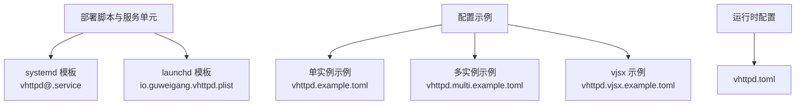
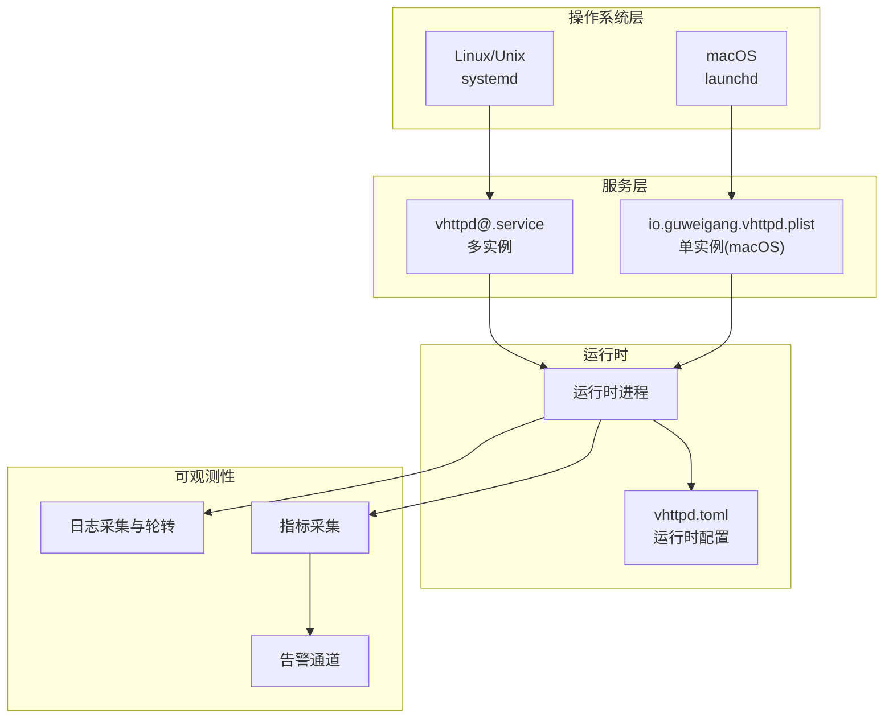
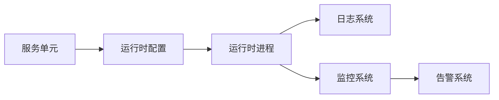

# 部署运维

<cite>
**本文引用的文件**
- [vhttpd.example.toml](file://config/vhttpd.example.toml)
- [vhttpd.multi.example.toml](file://config/vhttpd.multi.example.toml)
- [vhttpd.vjsx.example.toml](file://config/vhttpd.vjsx.example.toml)
- [vhttpd@.service](file://deploy/systemd/vhttpd@.service)
- [io.guweigang.vhttpd.plist](file://deploy/launchd/io.guweigang.vhttpd.plist)
- [README.md](file://README.md)
- [vhttpd.toml](file://vhttpd.toml)
</cite>

## 目录
1. [简介](#简介)
2. [项目结构](#项目结构)
3. [核心组件](#核心组件)
4. [架构总览](#架构总览)
5. [详细组件分析](#详细组件分析)
6. [依赖关系分析](#依赖关系分析)
7. [性能考虑](#性能考虑)
8. [故障排除指南](#故障排除指南)
9. [结论](#结论)
10. [附录](#附录)

## 简介
本运维文档面向系统管理员与运维工程师，提供 vhttpd 在生产环境中的部署与运维实践，覆盖服务管理（systemd 与 launchd）、配置管理、监控与告警、日志管理、性能调优、备份与恢复以及系统化故障排除流程。文档内容基于仓库中提供的示例配置与服务单元文件进行整理与扩展，帮助快速搭建稳定可靠的运行环境。

## 项目结构
vhttpd 提供了两类服务管理模板：systemd 单元与 launchd plist，分别用于 Linux 与 macOS 平台的服务托管；同时提供了多类示例配置文件，涵盖单实例、多实例与 vjsx 扩展场景。

图表来源
- [vhttpd@.service](file://deploy/systemd/vhttpd@.service)
- [io.guweigang.vhttpd.plist](file://deploy/launchd/io.guweigang.vhttpd.plist)
- [vhttpd.example.toml](file://config/vhttpd.example.toml)
- [vhttpd.multi.example.toml](file://config/vhttpd.multi.example.toml)
- [vhttpd.vjsx.example.toml](file://config/vhttpd.vjsx.example.toml)
- [vhttpd.toml](file://vhttpd.toml)

章节来源
- [vhttpd@.service](file://deploy/systemd/vhttpd@.service)
- [io.guweigang.vhttpd.plist](file://deploy/launchd/io.guweigang.vhttpd.plist)
- [vhttpd.example.toml](file://config/vhttpd.example.toml)
- [vhttpd.multi.example.toml](file://config/vhttpd.multi.example.toml)
- [vhttpd.vjsx.example.toml](file://config/vhttpd.vjsx.example.toml)
- [vhttpd.toml](file://vhttpd.toml)

## 核心组件
- 服务管理单元
  - systemd：通过参数化模板支持多实例运行，便于按端口或站点隔离。
  - launchd：macOS 上的用户态服务托管，适合开发与小规模生产。
- 配置体系
  - 单实例配置：适用于单一监听端口与路由规则。
  - 多实例配置：支持在同一主机上并行运行多个 vhttpd 实例。
  - vjsx 配置：启用内置 vjsx 执行能力，扩展应用逻辑。
- 运行时配置
  - 生产使用的最终配置文件，建议从示例迁移并最小化变更。

章节来源
- [vhttpd@.service](file://deploy/systemd/vhttpd@.service)
- [io.guweigang.vhttpd.plist](file://deploy/launchd/io.guweigang.vhttpd.plist)
- [vhttpd.example.toml](file://config/vhttpd.example.toml)
- [vhttpd.multi.example.toml](file://config/vhttpd.multi.example.toml)
- [vhttpd.vjsx.example.toml](file://config/vhttpd.vjsx.example.toml)
- [vhttpd.toml](file://vhttpd.toml)

## 架构总览
下图展示了 vhttpd 在生产环境中的典型部署形态：由 systemd 或 launchd 托管，加载运行时配置并启动服务；多实例模式可按需扩展；日志与监控独立于主进程以提升稳定性。

图表来源
- [vhttpd@.service](file://deploy/systemd/vhttpd@.service)
- [io.guweigang.vhttpd.plist](file://deploy/launchd/io.guweigang.vhttpd.plist)
- [vhttpd.toml](file://vhttpd.toml)

## 详细组件分析

### systemd 服务管理（多实例）
- 单元文件特性
  - 使用参数化模板，支持通过实例名传递配置路径或端口等参数。
  - 建议在 /etc/systemd/system 下放置定制化单元，并通过 systemctl 启用与管理。
- 推荐实践
  - 将运行时配置文件放置在受控目录（如 /etc/vhttpd/），并通过单元文件指向具体配置。
  - 使用 Restart=on-failure 与 RestartSec 控制重启策略，避免雪崩效应。
  - 限制资源（CPU/内存/FD）以保障宿主稳定性。
  - 使用 ProtectSystem=strict 与 PrivateTmp 等增强安全。
- 日志与审计
  - 结合 journald 的持久化与轮转策略，必要时配合 rsyslog 或外部日志系统。
- 可观测性集成
  - 通过 Exporter 或自定义指标端点接入 Prometheus/Grafana。
  - 将关键事件写入 structured log，便于集中检索与告警。

章节来源
- [vhttpd@.service](file://deploy/systemd/vhttpd@.service)

### launchd 服务管理（macOS）
- 单元文件特性
  - 适用于用户态或系统态服务托管，适合开发测试与小规模生产。
  - 建议使用 ProgramArguments 指向二进制，WorkingDirectory 指向工作目录。
- 推荐实践
  - 使用 StandardOutPath 与 StandardErrorPath 定位日志输出。
  - 设置 RunAtLoad 与 KeepAlive 控制启动与常驻行为。
  - 通过 LaunchEvents 与外部监控联动。
- 安全与隔离
  - 使用 RootDirectory 或 chroot（如适用）限制文件系统访问。
  - 以非特权用户运行，降低权限风险。

章节来源
- [io.guweigang.vhttpd.plist](file://deploy/launchd/io.guweigang.vhttpd.plist)

### 配置管理（单实例/多实例/vjsx）
- 单实例配置
  - 基于 vhttpd.example.toml，定义监听地址、路由、上游代理、认证与 TLS 等。
  - 建议将敏感信息放入环境变量或密钥管理器，避免硬编码。
- 多实例配置
  - 基于 vhttpd.multi.example.toml，定义多个实例的端口、路由与资源隔离策略。
  - 通过 systemd 实例后缀区分不同配置文件。
- vjsx 配置
  - 基于 vhttpd.vjsx.example.toml，启用内置执行能力与脚本化处理。
  - 注意版本兼容与性能影响，建议在独立实例中启用。
- 运行时配置
  - 生产使用 vhttpd.toml，建议从示例迁移，仅保留必要字段。
  - 对配置变更进行灰度发布与回滚预案。

章节来源
- [vhttpd.example.toml](file://config/vhttpd.example.toml)
- [vhttpd.multi.example.toml](file://config/vhttpd.multi.example.toml)
- [vhttpd.vjsx.example.toml](file://config/vhttpd.vjsx.example.toml)
- [vhttpd.toml](file://vhttpd.toml)

### 监控与告警（配置指南）
- 关键指标建议
  - 连接数与并发：当前连接、新建连接速率、队列长度。
  - 资源占用：CPU 使用率、内存 RSS、文件描述符数量。
  - 请求统计：QPS、P95/P99 延迟、错误码分布。
  - 上游健康：上游响应时间、失败率、重试次数。
- 指标采集
  - 自定义指标端点或使用 Exporter，统一暴露给 Prometheus。
  - 结合进程级监控（如 cgroups/ProcFS）与应用级埋点。
- 告警策略
  - 连接数阈值、延迟突增、错误率上升、资源耗尽等。
  - 分级告警：Warn（自动修复尝试）、Critical（人工介入）。
- 通知渠道
  - 邮件、IM（如飞书/企业微信）、Pager/Duty 等。
  - 建立值班与升级流程，记录处置过程与根因分析。

章节来源
- [vhttpd@.service](file://deploy/systemd/vhttpd@.service)
- [io.guweigang.vhttpd.plist](file://deploy/launchd/io.guweigang.vhttpd.plist)

### 日志管理（最佳实践）
- 日志轮转
  - systemd：使用 journald + logrotate 或 systemd-journald.conf 的持久化策略。
  - launchd：通过 ProgramArguments 与日志文件路径配合 logrotate。
- 集中存储与分析
  - 将 stdout/stderr 导出到集中式日志系统（如 ELK/Splunk/Vector/Fluent Bit）。
  - 对结构化日志进行索引与查询，建立常用查询模板。
- 日志分级与采样
  - Info/Warn/Error/Debug 分级，生产默认 Warn+。
  - 对高频日志进行采样，避免噪声掩盖关键信息。
- 安全与合规
  - 敏感字段脱敏（如 Token、密码、IP）。
  - 日志保留周期与删除策略符合法规要求。

章节来源
- [vhttpd@.service](file://deploy/systemd/vhttpd@.service)
- [io.guweigang.vhttpd.plist](file://deploy/launchd/io.guweigang.vhttpd.plist)

### 性能调优（内存/并发/网络）
- 内存使用
  - 合理设置最大并发与请求体大小，避免 OOM。
  - 使用对象池与零拷贝策略（如适用），减少 GC 压力。
- 并发控制
  - 限制每实例最大连接数与每连接最大请求数。
  - 使用连接复用与上游长连接，降低握手开销。
- 网络优化
  - 启用 TCP_NODELAY、调整内核参数（如 backlog、缓冲区）。
  - 上游代理链路优化，减少中间跳数与 TLS 握手。
- 实例规划
  - CPU 密集型与 IO 密集型业务分离，避免争抢。
  - 多实例按端口/站点隔离，便于限流与熔断。

章节来源
- [vhttpd@.service](file://deploy/systemd/vhttpd@.service)
- [vhttpd.example.toml](file://config/vhttpd.example.toml)

### 备份与恢复（策略与流程）
- 备份范围
  - 配置文件（含 vhttpd.toml 与各实例配置）。
  - 运行时状态与会话数据（如需要持久化）。
  - 证书与密钥材料（建议使用专用密钥管理系统）。
- 备份策略
  - 全量+增量结合，定期验证恢复流程。
  - 异地容灾与版本化管理，支持快速回滚。
- 恢复流程
  - 优先恢复配置文件，再启动服务。
  - 校验网络连通性与上游可用性，逐步放量。
  - 记录恢复时间线与变更点，沉淀知识库。

章节来源
- [vhttpd.toml](file://vhttpd.toml)
- [vhttpd.example.toml](file://config/vhttpd.example.toml)

## 依赖关系分析
- 组件耦合
  - 服务单元与运行时配置强耦合，需保持版本一致与变更同步。
  - 多实例通过实例名与配置文件路径解耦，便于横向扩展。
- 外部依赖
  - 系统服务（systemd/launchd）、日志系统（journald/logrotate/集中式日志）、监控系统（Prometheus/Grafana）。
- 潜在风险
  - 配置冲突、资源争用、日志风暴、监控盲点。
- 建议
  - 通过 CI/CD 管理配置变更，自动化校验与灰度发布。
  - 建立跨团队协作机制（运维/开发/安全部门）。

图表来源
- [vhttpd@.service](file://deploy/systemd/vhttpd@.service)
- [io.guweigang.vhttpd.plist](file://deploy/launchd/io.guweigang.vhttpd.plist)
- [vhttpd.toml](file://vhttpd.toml)

章节来源
- [vhttpd@.service](file://deploy/systemd/vhttpd@.service)
- [io.guweigang.vhttpd.plist](file://deploy/launchd/io.guweigang.vhttpd.plist)
- [vhttpd.toml](file://vhttpd.toml)

## 性能考虑
- 资源限制
  - 为每个实例设置 CPU/内存/FD 上限，防止资源枯竭。
- 并发与队列
  - 合理设置最大并发与等待队列长度，避免过载。
- I/O 优化
  - 使用异步 I/O 与连接池，减少阻塞。
- 网络栈
  - 调整内核参数与启用必要的 TCP 优化选项。
- 观测性
  - 以指标驱动优化，持续回归测试与 A/B 对比。

章节来源
- [vhttpd@.service](file://deploy/systemd/vhttpd@.service)
- [vhttpd.example.toml](file://config/vhttpd.example.toml)

## 故障排除指南
- 快速定位
  - 查看服务状态与最近日志（journalctl/system.log）。
  - 核对配置文件语法与权限，确认运行用户与工作目录。
- 常见问题
  - 无法启动：检查端口占用、配置解析、依赖库版本。
  - 高延迟/高错误：检查上游可用性、连接池与超时设置。
  - 内存增长：排查泄漏与缓存策略，必要时重启实例。
- 处置流程
  - 降载/熔断 -> 限流 -> 重启/切换实例 -> 回滚配置 -> 根因分析 -> 复盘闭环。
- 工具与命令
  - systemd：systemctl status/enable/start/stop/restart。
  - macOS：brew services、launchctl。
  - 日志：journalctl -u <unit> -f，tail -F。

章节来源
- [vhttpd@.service](file://deploy/systemd/vhttpd@.service)
- [io.guweigang.vhttpd.plist](file://deploy/launchd/io.guweigang.vhttpd.plist)

## 结论
通过规范化的服务管理、严格的配置治理、完善的监控告警与日志体系、系统性的性能调优与备份恢复策略，vhttpd 可在生产环境中实现高可用与可维护性。建议以多实例与最小化配置为原则，结合自动化与可观测性工具，持续改进运维效率与稳定性。

## 附录
- 参考文件
  - 服务单元与配置示例位于 deploy 与 config 目录。
  - 运行时配置文件 vhttpd.toml 为生产使用入口。
- 变更与升级
  - 采用灰度发布与回滚预案，确保变更可控。
- 文档维护
  - 定期更新部署清单与故障案例库，固化最佳实践。

章节来源
- [README.md](file://README.md)
- [vhttpd@.service](file://deploy/systemd/vhttpd@.service)
- [io.guweigang.vhttpd.plist](file://deploy/launchd/io.guweigang.vhttpd.plist)
- [vhttpd.example.toml](file://config/vhttpd.example.toml)
- [vhttpd.multi.example.toml](file://config/vhttpd.multi.example.toml)
- [vhttpd.vjsx.example.toml](file://config/vhttpd.vjsx.example.toml)
- [vhttpd.toml](file://vhttpd.toml)