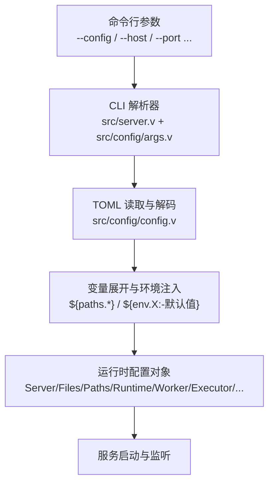
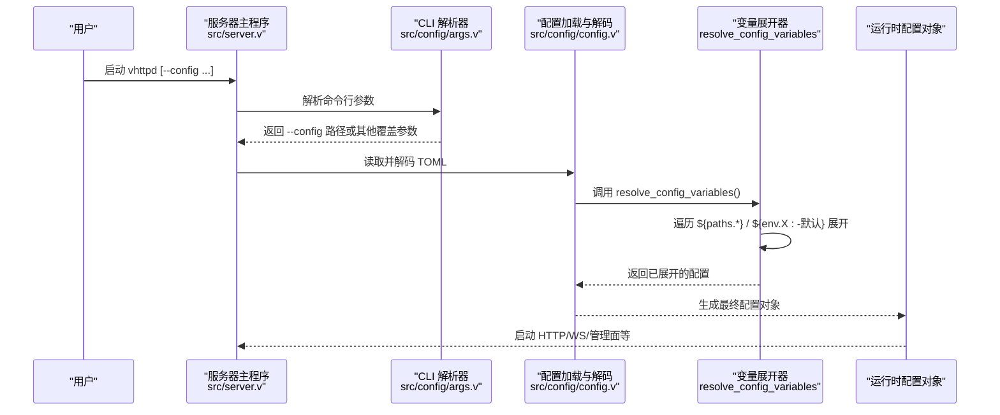
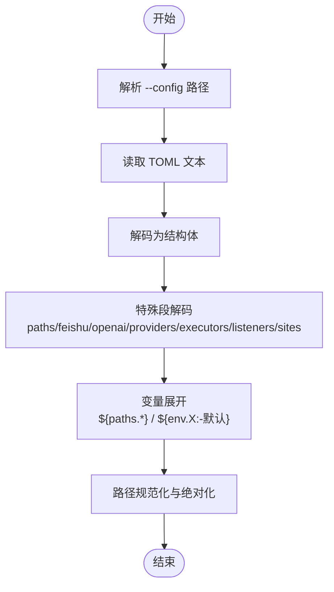

# 基础配置

<cite>
**本文引用的文件**   
- [config/vhttpd.example.toml](file://config/vhttpd.example.toml)
- [config/vhttpd.multi.example.toml](file://config/vhttpd.multi.example.toml)
- [config/vhttpd.vjsx.example.toml](file://config/vhttpd.vjsx.example.toml)
- [src/config/config.v](file://src/config/config.v)
- [src/config/args.v](file://src/config/args.v)
- [src/server.v](file://src/server.v)
- [README.md](file://README.md)
</cite>

## 目录
1. [简介](#简介)
2. [项目结构](#项目结构)
3. [核心组件](#核心组件)
4. [架构总览](#架构总览)
5. [详细组件分析](#详细组件分析)
6. [依赖关系分析](#依赖关系分析)
7. [性能与可用性建议](#性能与可用性建议)
8. [故障排查指南](#故障排查指南)
9. [结论](#结论)
10. [附录：常用模式与示例](#附录常用模式与示例)

## 简介
本章节面向初学者，系统化说明 VHTTPD 的基础 TOML 配置模型、变量扩展与环境变量集成方式、启动参数与命令行选项，并提供可直接运行的入门示例。文档内容严格基于仓库源码与示例配置文件整理，避免臆测。

## 项目结构
VHTTPD 的配置由 TOML 描述，并在启动时解析为内部配置对象。核心入口在服务器模块中完成 CLI 参数解析与配置加载；配置解析与变量展开逻辑集中在配置模块中。

图表来源
- [src/server.v:137-183](file://src/server.v#L137-L183)
- [src/config/args.v:1-90](file://src/config/args.v#L1-L90)
- [src/config/config.v:448-482](file://src/config/config.v#L448-L482)
- [src/config/config.v:1536-2064](file://src/config/config.v#L1536-L2064)

章节来源
- [src/server.v:137-183](file://src/server.v#L137-L183)
- [src/config/args.v:1-90](file://src/config/args.v#L1-L90)
- [src/config/config.v:448-482](file://src/config/config.v#L448-L482)

## 核心组件
本节概述 TOML 顶层段及其作用、默认值与数据类型。所有字段名均以代码中的结构体定义为准。

- paths（路径）
  - root: 字符串，默认 "."。作为相对路径的基准目录。
  - 其他键：任意字符串键值对，用于在配置中复用路径片段，如 php_app、php_worker、vslim_ext、web_root 等。
  - 用途：被其他段通过 ${paths.xxx} 引用。

- server（HTTP 服务器）
  - host: 字符串，默认 "127.0.0.1"。监听地址。
  - port: 整数，默认 18081。监听端口。
  - index: 字符串，默认 "index.php"。静态或应用入口索引。
  - ssl: 子段，包含 enabled/cert/cert_key 等 SSL 相关项。

- files（进程文件）
  - pid_file: 字符串，默认 "/tmp/vhttpd.pid"。进程 ID 文件路径。
  - event_log: 字符串，默认 "/tmp/vhttpd.events.ndjson"。事件日志路径。

- runtime（运行时）
  - timezone: 字符串，默认 "Asia/Shanghai"。进程时区。

- worker（工作进程池）
  - read_timeout_ms: 整数，默认 3000。
  - autostart: 布尔。是否自动启动工作进程。
  - cmd: 字符串。自定义命令。
  - stream_dispatch: 布尔。流式分发开关。
  - queue_capacity: 整数。队列容量。
  - queue_timeout_ms: 整数。队列超时。
  - restart_backoff_ms: 整数，默认 500。重启退避初始毫秒。
  - restart_backoff_max_ms: 整数，默认 8000。最大退避毫秒。
  - max_requests: 整数。单进程最大请求数。
  - socket: 字符串。Unix Socket 路径。
  - pool_size: 整数，默认 1。工作进程池大小。
  - websocket_dispatch: 布尔。WebSocket 分发开关。
  - socket_prefix: 字符串。Socket 前缀。
  - sockets: 字符串列表。多 Socket 绑定。
  - env: 字符串映射。注入到工作进程的环境变量。

- executor（执行器选择）
  - kind: 字符串。例如 "php" 或 "vjsx"。

- php（PHP 执行器）
  - bin: 字符串，默认 "php"。
  - worker_entry: 字符串。Worker 入口脚本。
  - app_entry: 字符串。应用入口脚本。
  - extensions: 字符串列表。扩展库路径。
  - args: 字符串列表。传递给 PHP 的参数。

- vjsx（VJSX 执行器）
  - app_entry: 字符串。应用入口。
  - module_root: 字符串。模块根目录。
  - build_root: 字符串。构建输出目录。
  - signature_root/include/exclude: 签名相关。
  - runtime_profile: 字符串，默认 "script"。
  - thread_count: 整数，默认 1。线程数。
  - max_requests: 整数。
  - enable_fs/process/network: 布尔。能力开关。

- admin（管理面板）
  - host: 字符串，默认 "127.0.0.1"。
  - port: 整数。
  - token: 字符串。鉴权令牌。

- assets（静态资源）
  - enabled: 布尔。
  - prefix: 字符串，默认 "/assets"。
  - root: 字符串。静态根目录。
  - cache_control: 字符串，默认 "public, max-age=3600"。

- feishu（飞书集成）
  - enabled: 布尔。
  - runtime_driver/plugin: 字符串。
  - open_base_url: 字符串，默认 "https://open.feishu.cn/open-apis"。
  - reconnect_delay_ms: 整数，默认 3000。
  - token_refresh_skew_seconds: 整数，默认 60。
  - recent_event_limit: 整数，默认 20。
  - apps: 多实例配置，每个实例含 app_id/app_secret/verification_token/encrypt_key。

- codex（AI 代理）
  - enabled: 布尔。
  - url: 字符串，默认 "ws://127.0.0.1:4500"。
  - model: 字符串，默认 "o4-mini"。
  - effort: 字符串，默认 "medium"。
  - cwd: 字符串。
  - approval_policy: 字符串，默认 "never"。
  - sandbox: 字符串，默认 "workspaceWrite"。
  - reconnect_delay_ms: 整数，默认 3000。
  - flush_interval_ms: 整数，默认 400。

- openai（OpenAI 网关）
  - enabled: 布尔。
  - base_path: 字符串，默认 "/v1"。
  - default_backend: 字符串。
  - plugin: 字符串。
  - endpoints: 端点开关集合。
  - backends: 后端配置映射。
  - routes: 路由映射。

- db/cache（数据库与缓存）
  - db.enabled/socket/driver/pool_name/mysql/pgsql 等。
  - cache.enabled/socket。

- listeners/sites（多站点/多监听）
  - listeners.<id>: 监听器，含 host/port/site/ssl。
  - sites.<id>: 站点，含 project_root/document_root/default_executor/host/port/index/app/worker/php/vjsx/plugins/providers/websocket_affinity/websocket_actor/assets/runtime/mcp/feishu/codex/openai/db/cache/routes/executors 等。

以上字段的数据类型与默认值均来源于配置结构体定义与解码函数。

章节来源
- [src/config/config.v:6-423](file://src/config/config.v#L6-L423)
- [src/config/config.v:708-795](file://src/config/config.v#L708-L795)
- [src/config/config.v:352-392](file://src/config/config.v#L352-L392)

## 架构总览
下图展示了从命令行到配置对象的完整流程，以及变量展开与环境变量的参与位置。

图表来源
- [src/server.v:137-183](file://src/server.v#L137-L183)
- [src/config/args.v:1-90](file://src/config/args.v#L1-L90)
- [src/config/config.v:448-482](file://src/config/config.v#L448-L482)
- [src/config/config.v:1536-2064](file://src/config/config.v#L1536-L2064)

## 详细组件分析

### 路径配置（paths）
- 作用：集中定义可复用的路径片段，供其他段引用。
- 关键行为：
  - root 作为相对路径基准。
  - 除 root 外的任意键值会被收集到 values 映射中，供 ${paths.xxx} 引用。
- 典型用法：
  - 将 php_app、php_worker、vslim_ext、web_root 等放在 paths 下，然后在其他段以 ${paths.xxx} 引用。

章节来源
- [src/config/config.v:27-31](file://src/config/config.v#L27-L31)
- [src/config/config.v:484-502](file://src/config/config.v#L484-L502)
- [config/vhttpd.example.toml:1-7](file://config/vhttpd.example.toml#L1-L7)

### 服务器配置（server）
- 作用：定义 HTTP 监听地址、端口、SSL 与索引页。
- 默认值：host="127.0.0.1"，port=18081，index="index.php"。
- 关联：files.pid_file/event_log 常使用 ${server.port} 进行动态命名。

章节来源
- [src/config/config.v:6-19](file://src/config/config.v#L6-L19)
- [config/vhttpd.example.toml:8-10](file://config/vhttpd.example.toml#L8-L10)
- [config/vhttpd.example.toml:12-14](file://config/vhttpd.example.toml#L12-L14)

### 文件配置（files）
- 作用：指定 PID 文件与事件日志路径。
- 默认值：pid_file="/tmp/vhttpd.pid"，event_log="/tmp/vhttpd.events.ndjson"。
- 常见模式：结合 ${server.port} 实现多实例隔离。

章节来源
- [src/config/config.v:21-25](file://src/config/config.v#L21-L25)
- [config/vhttpd.example.toml:12-14](file://config/vhttpd.example.toml#L12-L14)

### 运行时配置（runtime）
- 作用：设置进程级运行环境，如时区。
- 默认值：timezone="Asia/Shanghai"。

章节来源
- [src/config/config.v:167-170](file://src/config/config.v#L167-L170)
- [config/vhttpd.example.toml:16-17](file://config/vhttpd.example.toml#L16-L17)

### 工作进程与执行器（worker/executor/php/vjsx）
- worker：控制工作进程池、队列、超时、重启策略、Socket 与注入环境变量。
- executor.kind：选择执行器类型（如 "php" 或 "vjsx"）。
- php：指定 PHP 二进制、Worker/App 入口、扩展与参数。
- vjsx：指定应用入口、模块根、构建目录、线程数与能力开关。

章节来源
- [src/config/config.v:33-86](file://src/config/config.v#L33-L86)
- [config/vhttpd.example.toml:19-36](file://config/vhttpd.example.toml#L19-L36)
- [config/vhttpd.vjsx.example.toml:18-26](file://config/vhttpd.vjsx.example.toml#L18-L26)

### 管理面板（admin）
- 作用：提供本地管理接口，支持 host/port/token。
- 默认值：host="127.0.0.1"，port 未设默认值需显式配置。

章节来源
- [src/config/config.v:132-137](file://src/config/config.v#L132-L137)
- [config/vhttpd.example.toml:38-41](file://config/vhttpd.example.toml#L38-L41)
- [config/vhttpd.vjsx.example.toml:27-30](file://config/vhttpd.vjsx.example.toml#L27-L30)

### 静态资源（assets）
- 作用：启用静态文件服务，设置前缀、根目录与缓存头。
- 默认值：prefix="/assets"，cache_control="public, max-age=3600"。

章节来源
- [src/config/config.v:139-145](file://src/config/config.v#L139-L145)
- [config/vhttpd.example.toml:43-47](file://config/vhttpd.example.toml#L43-L47)

### 飞书集成（feishu）
- 作用：全局开关与连接参数，支持多应用实例（feishu.main、feishu.openclaw 等）。
- 默认值：open_base_url、reconnect_delay_ms、token_refresh_skew_seconds、recent_event_limit 均有默认值。
- 敏感信息：app_id/app_secret/verification_token/encrypt_key 推荐通过环境变量注入。

章节来源
- [src/config/config.v:181-214](file://src/config/config.v#L181-L214)
- [config/vhttpd.example.toml:49-66](file://config/vhttpd.example.toml#L49-L66)

### AI 代理（codex）
- 作用：配置 Codex 连接、模型、沙箱与刷新策略。
- 默认值：url、model、effort、approval_policy、sandbox、reconnect_delay_ms、flush_interval_ms 等。

章节来源
- [src/config/config.v:216-227](file://src/config/config.v#L216-L227)
- [config/vhttpd.multi.example.toml:23-32](file://config/vhttpd.multi.example.toml#L23-L32)

### OpenAI 网关（openai）
- 作用：统一对外暴露 OpenAI 兼容 API，支持多后端与路由。
- 默认值：base_path="/v1"，endpoints 各端点默认开启。

章节来源
- [src/config/config.v:229-264](file://src/config/config.v#L229-L264)

### 数据库与缓存（db/cache）
- 作用：配置数据库驱动、连接池与缓存 Socket。
- 默认值：driver="mysql"，pool_name="default"，socket 路径默认位于 tmp 目录。

章节来源
- [src/config/config.v:275-311](file://src/config/config.v#L275-L311)

### 多站点与多监听（listeners/sites）
- 作用：在同一进程中监听多个 host:port，并为每个站点独立配置应用与执行器。
- 约定：
  - 若省略 [listeners]，则根据 [sites.<id>] 的 host+port 合成监听器。
  - site.root 是 document_root 的别名。
  - executor 既可用简写 executor = "vjsx"，也可用展开形式 [sites.demo.executor] kind = "vjsx"。
  - 站点内可嵌套 worker、php、vjsx 等配置。

章节来源
- [README.md:533-589](file://README.md#L533-L589)
- [config/vhttpd.multi.example.toml:37-73](file://config/vhttpd.multi.example.toml#L37-L73)

## 依赖关系分析
- 配置加载顺序：
  - 先解析 CLI 参数获取 --config 路径。
  - 读取 TOML 文本并解码为结构体。
  - 特殊段（paths、feishu、openai、providers、executors、multi-listener、single-site）分别解码。
  - 最后执行变量展开与路径规范化。

图表来源
- [src/config/config.v:448-482](file://src/config/config.v#L448-L482)
- [src/config/config.v:1536-2064](file://src/config/config.v#L1536-L2064)

章节来源
- [src/config/config.v:448-482](file://src/config/config.v#L448-L482)
- [src/config/config.v:1536-2064](file://src/config/config.v#L1536-L2064)

## 性能与可用性建议
- 合理设置 worker.pool_size 与 max_requests，平衡吞吐与内存占用。
- 使用 ${env.VHTTPD_SOCKET_PREFIX:-...} 避免不同实例间 Socket 冲突。
- 为静态资源启用 assets 并设置合适的 cache_control，降低重复请求开销。
- 多站点场景下，按站点隔离 worker 与 executors，避免相互影响。

[本节为通用建议，不直接分析具体文件]

## 故障排查指南
- 变量展开错误
  - 现象：报错提示“无效变量表达式”或“缺少环境变量”。
  - 原因：使用了 ${env.X} 但未设置对应环境变量，且未提供默认值。
  - 处理：为 ${env.X:-默认值} 补充默认值，或在运行环境中设置该变量。
- 循环引用
  - 现象：报错“变量展开超过最大次数（可能存在循环引用）”。
  - 原因：配置中存在互相引用的路径或变量。
  - 处理：检查 ${paths.*} 与 ${site.*} 的引用链，消除环。
- 路径解析异常
  - 现象：找不到文件或目录。
  - 原因：相对路径未正确基于 paths.root 解析。
  - 处理：确保 paths.root 指向正确的项目根目录，并使用 ${paths.xxx} 引用。

章节来源
- [src/config/config.v:2307-2392](file://src/config/config.v#L2307-L2392)
- [src/config/config.v:2063-2064](file://src/config/config.v#L2063-L2064)

## 结论
VHTTPD 的基础配置围绕 paths/server/files/runtime 四大核心段展开，并通过变量扩展机制与 ${env.X:-默认值} 实现灵活的环境集成。配合多站点与多监听能力，可在单一进程中承载多种应用与协议。建议初学者从示例配置入手，逐步引入环境变量与高级特性。

[本节为总结性内容，不直接分析具体文件]

## 附录：常用模式与示例

### 最小可运行示例（PHP）
- 参考：config/vhttpd.example.toml
- 要点：
  - 在 [paths] 中声明 php_app、php_worker、vslim_ext、web_root。
  - [server] 设置 host/port。
  - [files] 使用 ${server.port} 区分多实例。
  - [runtime] 设置时区。
  - [worker] 配置池大小与 Socket 前缀。
  - [executor] 选择 "php"。
  - [php] 指定 bin、worker_entry、app_entry、extensions。
  - [admin]/[assets]/[feishu] 按需启用。

章节来源
- [config/vhttpd.example.toml:1-67](file://config/vhttpd.example.toml#L1-L67)

### VJSX 示例
- 参考：config/vhttpd.vjsx.example.toml
- 要点：
  - [paths] 声明 vjsx_app、vjsx_root、web_root。
  - [executor] 选择 "vjsx"。
  - [vjsx] 指定 app_entry、module_root、runtime_profile、thread_count。
  - [admin]/[assets] 按需启用。

章节来源
- [config/vhttpd.vjsx.example.toml:1-37](file://config/vhttpd.vjsx.example.toml#L1-L37)

### 多站点示例
- 参考：config/vhttpd.multi.example.toml
- 要点：
  - 共享 [paths]/[files]/[runtime]/[assets]/[codex]/[feishu]。
  - 在 [sites.php_demo] 与 [sites.codexbot] 分别定义 host/port/root/executor/app 等。
  - 站点内可嵌套 worker、php、vjsx 等配置。

章节来源
- [config/vhttpd.multi.example.toml:1-73](file://config/vhttpd.multi.example.toml#L1-L73)

### 环境变量与变量扩展
- 语法：
  - ${env.NAME}：读取环境变量 NAME。
  - ${env.NAME:-默认值}：若未设置则使用默认值。
  - ${paths.xxx}：引用 paths 下的路径片段。
  - ${server.port}：引用 server 段的字段。
- 示例：
  - socket_prefix = "${env.VHTTPD_SOCKET_PREFIX:-tmp/vslim_worker}"
  - app_id = "${env.FEISHU_APP_ID:-}"
  - url = "${env.CODEX_URL:-ws://127.0.0.1:4500}"

章节来源
- [config/vhttpd.example.toml:22-23](file://config/vhttpd.example.toml#L22-L23)
- [config/vhttpd.example.toml:56-66](file://config/vhttpd.example.toml#L56-L66)
- [config/vhttpd.multi.example.toml:24-28](file://config/vhttpd.multi.example.toml#L24-L28)
- [src/config/config.v:2307-2392](file://src/config/config.v#L2307-L2392)

### 启动参数与命令行选项
- 支持的长选项包括：
  - --help、--version、--config、--host、--port、--ssl-cert、--ssl-key、--event-log、--pid-file
  - --worker-read-timeout-ms、--worker-cmd、--worker-autostart、--worker-restart-backoff-ms、--worker-restart-backoff-max-ms、--worker-max-requests、--worker-queue-capacity、--worker-queue-timeout-ms
  - --worker-socket、--worker-sockets、--worker-pool-size、--worker-socket-prefix
  - --executor、--php-bin、--php-worker-entry、--php-app-entry、--php-extension、--php-arg
  - --vjsx-entry、--vjsx-module-root、--vjsx-build-root、--vjsx-signature-root、--vjsx-signature-include、--vjsx-signature-exclude、--vjsx-runtime-profile、--vjsx-thread-count
  - --admin-host、--admin-port、--admin-token
  - --feishu-enabled、--feishu-app-id、--feishu-app-secret、--feishu-open-base-url
  - --ollama-enabled
- 配置文件优先级：
  - 优先使用 --config 指定的路径；否则尝试环境变量 VHTTPD_CONFIG；否则取第一个 .toml 参数。

章节来源
- [src/server.v:137-183](file://src/server.v#L137-L183)
- [src/config/config.v:429-446](file://src/config/config.v#L429-L446)
- [README.md:447-531](file://README.md#L447-L531)