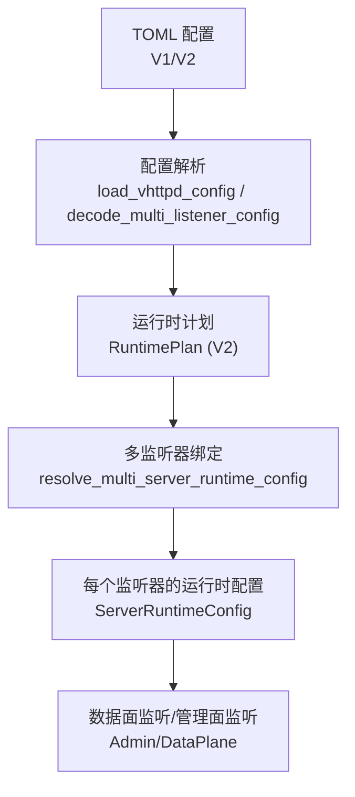
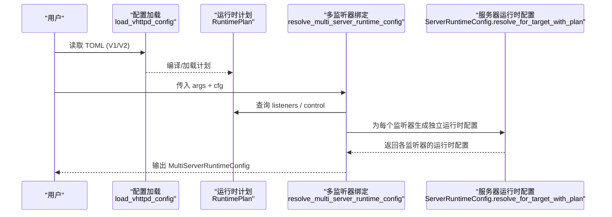
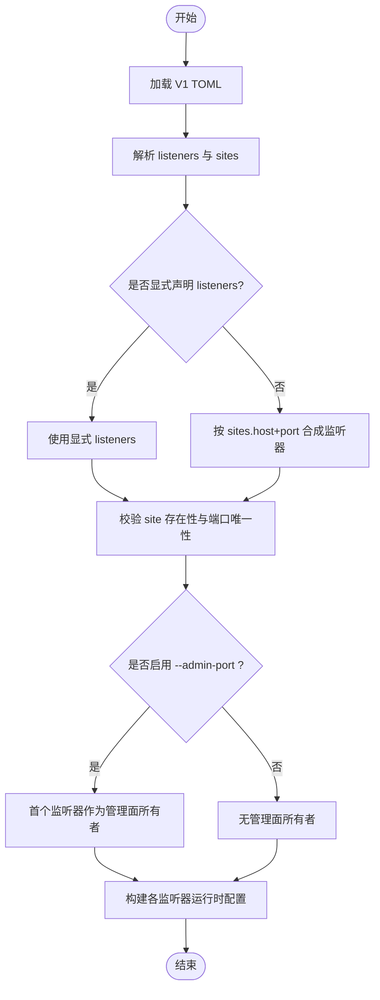
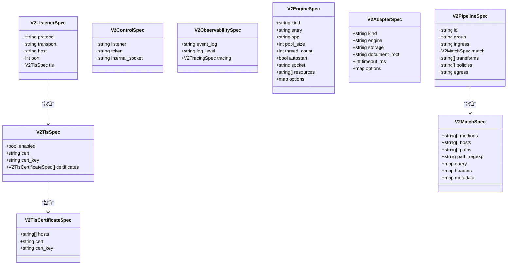
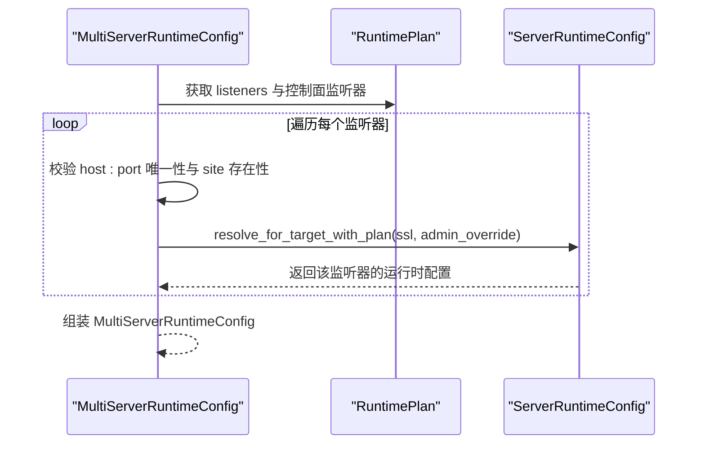
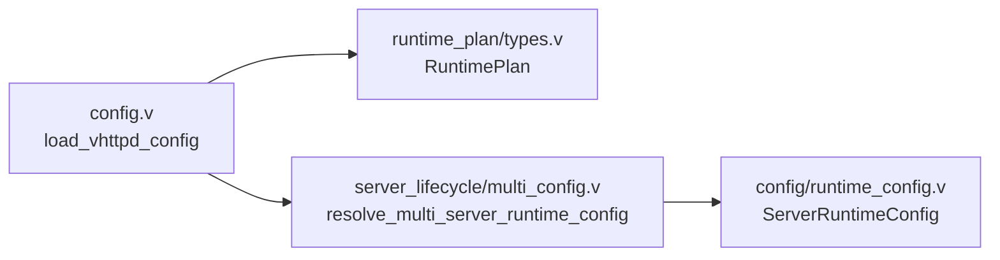

# 多监听器配置

<cite>
**本文引用的文件**   
- [config/vhttpd.multi.example.toml](file://config/vhttpd.multi.example.toml)
- [src/server_lifecycle/multi_config.v](file://src/server_lifecycle/multi_config.v)
- [src/config/runtime_config.v](file://src/config/runtime_config.v)
- [src/config/config.v](file://src/config/config.v)
- [src/config/v2_config.v](file://src/config/v2_config.v)
- [src/runtime_plan/types.v](file://src/runtime_plan/types.v)
- [README.md](file://README.md)
- [examples/config/hello-v2.toml](file://examples/config/hello-v2.toml)
- [examples/wordpress/vhttpd-v2.toml](file://examples/wordpress/vhttpd-v2.toml)
- [tests/e2e/config_acceptance_test.sh](file://tests/e2e/config_acceptance_test.sh)
</cite>

## 目录
1. [简介](#简介)
2. [项目结构](#项目结构)
3. [核心组件](#核心组件)
4. [架构总览](#架构总览)
5. [详细组件分析](#详细组件分析)
6. [依赖关系分析](#依赖关系分析)
7. [性能与生产建议](#性能与生产建议)
8. [故障排查指南](#故障排查指南)
9. [结论](#结论)
10. [附录：完整示例与最佳实践](#附录完整示例与最佳实践)

## 简介
本文件面向需要在单个 vhttpd 进程中运行多个不同监听器和应用实例的用户，系统阐述多监听器模式的配置方法、配置文件组织与引用机制、端口绑定与域名路由策略、协议切换（HTTP/TLS）、共享资源管理与进程间通信配置，以及负载均衡与高可用部署方案。文档同时提供生产环境下的最佳实践与性能调优建议。

## 项目结构
vhttpd 的多监听器能力由“V1 TOML 站点模型”和“V2 运行时计划模型”共同支撑：
- V1 模型通过 [listeners.<id>] 与 [sites.<id>] 建立一一对应关系，支持省略 listeners 时按站点 host:port 自动合成监听器。
- V2 模型以 version = 2 的 TOML 描述 listeners、engines、adapters、pipelines 等，实现更细粒度的协议、传输、匹配与处理管线编排。

图示来源
- [src/config/config.v:1487-1534](file://src/config/config.v#L1487-L1534)
- [src/server_lifecycle/multi_config.v:20-94](file://src/server_lifecycle/multi_config.v#L20-L94)
- [src/config/runtime_config.v:73-171](file://src/config/runtime_config.v#L73-L171)

章节来源
- [README.md:533-589](file://README.md#L533-L589)
- [src/config/config.v:1487-1534](file://src/config/config.v#L1487-L1534)
- [src/server_lifecycle/multi_config.v:20-94](file://src/server_lifecycle/multi_config.v#L20-L94)

## 核心组件
- 监听器与站点映射
  - ListenerConfig：定义 host、port、site、ssl 等，用于将监听器绑定到具体站点。
  - SiteConfig：站点级应用、执行器、工作进程、扩展、路径等配置。
  - VhttpdConfig：全局配置聚合，包含 listeners、sites、assets、admin、worker、php、vjsx 等。
- 运行时计划（V2）
  - RuntimePlan：编译后的不可变计划，包含 listeners、engines、adapters、pipelines、policies、relays 等。
  - ListenerPlan：监听器计划，含 protocol、transport、host、port、tls 等。
- 多监听器运行时绑定
  - MultiServerRuntimeConfig：单/多监听器模式标识与监听器列表。
  - ListenerRuntimeBinding：将监听器 id、站点 id、站点配置与运行时配置绑定。
- 服务器运行时配置
  - ServerRuntimeConfig：为每个监听器生成独立的运行时配置，包括 admin、pid_file、event_log、executor_plan、assets、provider_settings 等。

章节来源
- [src/config/config.v:350-423](file://src/config/config.v#L350-L423)
- [src/runtime_plan/types.v:54-198](file://src/runtime_plan/types.v#L54-L198)
- [src/server_lifecycle/multi_config.v:6-18](file://src/server_lifecycle/multi_config.v#L6-L18)
- [src/config/runtime_config.v:31-52](file://src/config/runtime_config.v#L31-L52)

## 架构总览
下图展示从配置加载到多监听器绑定的关键流程，以及 V1 与 V2 模型的协作方式。

图示来源
- [src/config/config.v:448-482](file://src/config/config.v#L448-L482)
- [src/server_lifecycle/multi_config.v:20-94](file://src/server_lifecycle/multi_config.v#L20-L94)
- [src/config/runtime_config.v:73-171](file://src/config/runtime_config.v#L73-L171)

## 详细组件分析

### 组件A：V1 多监听器与站点模型
- 解析入口
  - decode_multi_listener_config：解析根节点 listeners 与 sites 子表，填充 cfg.listeners 与 cfg.sites。
  - decode_single_site_config：兼容单站点 site 字段，合并到全局配置。
- 监听器合成
  - resolve_multi_listeners：若未显式声明 listeners，则根据 sites 中 host+port 自动生成监听器；要求每个站点必须提供 port。
- 绑定校验
  - 重复绑定检测：同一 host:port 仅允许一次。
  - 站点存在性校验：listener.site 必须在 cfg.sites 中存在。
- 管理面监听器归属
  - 当启用 --admin-port 且存在多个监听器时，默认将第一个监听器作为管理面所有者（可被 plan.control.listener 覆盖）。

图示来源
- [src/config/config.v:1487-1534](file://src/config/config.v#L1487-L1534)
- [src/config/runtime_config.v:626-649](file://src/config/runtime_config.v#L626-L649)
- [src/server_lifecycle/multi_config.v:20-94](file://src/server_lifecycle/multi_config.v#L20-L94)

章节来源
- [src/config/config.v:1487-1534](file://src/config/config.v#L1487-L1534)
- [src/config/runtime_config.v:626-649](file://src/config/runtime_config.v#L626-L649)
- [src/server_lifecycle/multi_config.v:20-94](file://src/server_lifecycle/multi_config.v#L20-L94)

### 组件B：V2 运行时计划与监听器
- 监听器计划
  - ListenerPlan：protocol、transport、host、port、tls 等。
  - TlsPlan/TlsCertificatePlan：TLS 开关、证书与私钥、按主机名的证书集合。
- 控制面与可观测性
  - ControlPlan：control.listener 指定管理面监听器（可为 listener 域），token、internal_socket。
  - ObservabilityPlan：event_log、log_level、tracing。
- 引擎与适配器
  - EngineSpec/AdapterSpec：定义执行器（如 php-worker、vjsx）、静态资源、上传等适配器。
- 管线与匹配
  - PipelineSpec：ingress、match、transforms、policies、egress。
  - MatchSpec：methods、hosts、paths、path_regexp、query、headers、metadata。

图示来源
- [src/config/v2_config.v:27-51](file://src/config/v2_config.v#L27-L51)
- [src/config/v2_config.v:52-72](file://src/config/v2_config.v#L52-L72)
- [src/config/v2_config.v:120-155](file://src/config/v2_config.v#L120-L155)
- [src/config/v2_config.v:157-182](file://src/config/v2_config.v#L157-L182)
- [src/config/v2_config.v:279-300](file://src/config/v2_config.v#L279-L300)

章节来源
- [src/runtime_plan/types.v:54-198](file://src/runtime_plan/types.v#L54-L198)
- [src/config/v2_config.v:27-51](file://src/config/v2_config.v#L27-L51)
- [src/config/v2_config.v:52-72](file://src/config/v2_config.v#L52-L72)
- [src/config/v2_config.v:120-155](file://src/config/v2_config.v#L120-L155)
- [src/config/v2_config.v:157-182](file://src/config/v2_config.v#L157-L182)
- [src/config/v2_config.v:279-300](file://src/config/v2_config.v#L279-L300)

### 组件C：多监听器运行时绑定与管理面
- 单/多模式判定
  - 若未启用多监听器但计划中存在多个监听器，则进入基于计划的绑定分支。
- 管理面监听器选择
  - 优先使用 plan.control.listener（domain=listener）；否则在存在监听器时选择第一个。
- SSL 配置合并
  - 监听器级 ssl 覆盖站点级 server.ssl；若未设置则回退到站点或全局默认。
- 运行时配置生成
  - 为每个监听器生成独立的 ServerRuntimeConfig，包含 pid_file、event_log、admin_host/port/token、assets、executor_plan、provider_settings 等。

图示来源
- [src/server_lifecycle/multi_config.v:20-94](file://src/server_lifecycle/multi_config.v#L20-L94)
- [src/server_lifecycle/multi_config.v:96-139](file://src/server_lifecycle/multi_config.v#L96-L139)
- [src/config/runtime_config.v:73-171](file://src/config/runtime_config.v#L73-L171)

章节来源
- [src/server_lifecycle/multi_config.v:20-94](file://src/server_lifecycle/multi_config.v#L20-L94)
- [src/server_lifecycle/multi_config.v:96-139](file://src/server_lifecycle/multi_config.v#L96-L139)
- [src/config/runtime_config.v:73-171](file://src/config/runtime_config.v#L73-L171)

## 依赖关系分析
- 配置层依赖
  - config.load_vhttpd_config 负责版本探测与 V1/V2 分流；V1 下调用 decode_multi_listener_config 与 decode_single_site_config。
- 计划层依赖
  - runtime_plan.RuntimePlan 承载 listeners、engines、adapters、pipelines 等；multi_config 依赖其进行监听器枚举与控制面选择。
- 运行时层依赖
  - ServerRuntimeConfig 依赖 executor、provider、admin、assets 等模块完成最终运行时装配。

图示来源
- [src/config/config.v:448-482](file://src/config/config.v#L448-L482)
- [src/server_lifecycle/multi_config.v:20-94](file://src/server_lifecycle/multi_config.v#L20-L94)
- [src/config/runtime_config.v:73-171](file://src/config/runtime_config.v#L73-L171)

章节来源
- [src/config/config.v:448-482](file://src/config/config.v#L448-L482)
- [src/server_lifecycle/multi_config.v:20-94](file://src/server_lifecycle/multi_config.v#L20-L94)
- [src/config/runtime_config.v:73-171](file://src/config/runtime_config.v#L73-L171)

## 性能与生产建议
- 进程与线程
  - PHP worker：合理设置 pool_size、queue_capacity、queue_timeout_ms、max_requests，避免队列积压与频繁重启。
  - VJSX：thread_count 与 runtime_profile 需结合 CPU 核数与 I/O 特征调整。
- 资源池与连接
  - DB/Cache 资源池大小与 idle_ping_ms 应与业务峰值与外部服务容量匹配。
- 超时与限流
  - read_timeout_ms、restart_backoff_ms/max_ms、max_body_bytes 等参数应在网关侧与引擎侧协同配置。
- 静态资源缓存
  - 针对静态资源设置合适的 cache_control，区分 immutable 与 short TTL，减少后端压力。
- 管理面隔离
  - 在多监听器模式下，将管理面绑定到独立监听器或内嵌于首个监听器，并限制访问来源与强口令。

[本节为通用指导，不直接分析具体文件]

## 故障排查指南
- 常见错误
  - multi_listener_missing_sites：未声明 listeners 且 sites 为空。
  - multi_listener_unknown_site：listener.site 指向的站点不存在。
  - multi_listener_duplicate_bind：同一 host:port 被多次绑定。
  - runtime_plan_listener_missing_port：V2 计划中监听器缺少端口。
- 定位步骤
  - 检查 listeners 与 sites 的对应关系与端口唯一性。
  - 确认 plan.control.listener 是否正确指向目标监听器。
  - 查看 event_log 与 pid_file 位置，确保目录存在且可写。
  - 验证 TLS 证书与私钥路径及权限。

章节来源
- [src/server_lifecycle/multi_config.v:20-94](file://src/server_lifecycle/multi_config.v#L20-L94)
- [src/server_lifecycle/multi_config.v:96-139](file://src/server_lifecycle/multi_config.v#L96-L139)
- [src/config/runtime_config.v:299-305](file://src/config/runtime_config.v#L299-L305)

## 结论
vhttpd 的多监听器模式通过 V1 站点模型与 V2 运行时计划相结合，实现了在一个进程内对多个 host:port 的灵活绑定与隔离。通过监听器级别的 SSL、管理面、资源与执行器配置，能够支撑复杂的生产场景。配合合理的性能调优与高可用部署策略，可在保证稳定性的同时获得良好的吞吐与延迟表现。

[本节为总结，不直接分析具体文件]

## 附录：完整示例与最佳实践

### 多监听器最小示例（V1）
- 要点
  - 使用 [paths] 集中管理路径变量。
  - 使用 [files] 配置 pid_file 与 event_log。
  - 使用 [sites.<id>] 定义站点，并在其中指定 host、port、executor、app、worker.entry 等。
  - 可选：显式声明 [listeners.<id>] 以覆盖站点 host:port 的合成逻辑。
- 参考
  - [config/vhttpd.multi.example.toml](file://config/vhttpd.multi.example.toml)
  - [README.md:533-589](file://README.md#L533-L589)

章节来源
- [config/vhttpd.multi.example.toml:1-73](file://config/vhttpd.multi.example.toml#L1-L73)
- [README.md:533-589](file://README.md#L533-L589)

### V2 监听器与管线示例
- 要点
  - version = 2 的 TOML 中声明 [listeners.web]，并可嵌套 [listeners.web.tls] 开启 HTTPS。
  - 使用 [engines.*] 定义执行器（如 php-worker、vjsx），并通过 [adapters.*] 组合静态、上传、固定响应等。
  - 使用 [[pipelines]] 将 ingress、match、transforms、policies、egress 串联成处理流水线。
- 参考
  - [examples/config/hello-v2.toml](file://examples/config/hello-v2.toml)
  - [examples/wordpress/vhttpd-v2.toml](file://examples/wordpress/vhttpd-v2.toml)

章节来源
- [examples/config/hello-v2.toml:1-31](file://examples/config/hello-v2.toml#L1-L31)
- [examples/wordpress/vhttpd-v2.toml:1-434](file://examples/wordpress/vhttpd-v2.toml#L1-L434)

### 端口绑定与域名路由
- 端口绑定
  - V1：在 [sites.<id>] 中设置 host 与 port，或通过 [listeners.<id>] 显式覆盖。
  - V2：在 [listeners.<id>] 中设置 host、port、protocol、transport。
- 域名路由
  - Phase 1 为基于监听器的路由（不同 host:port 分离），尚未支持同端口基于 Host 头的虚拟主机路由。
  - 如需按域名分流，建议使用反向代理（如 Nginx/Caddy）将不同域名转发至不同监听器。
- 参考
  - [README.md:533-589](file://README.md#L533-L589)

章节来源
- [README.md:533-589](file://README.md#L533-L589)

### 协议切换（HTTP/TLS）
- V1
  - 在站点或监听器级别设置 ssl.enabled、cert、cert_key。
- V2
  - 在 [listeners.<id>.tls] 中配置 enabled、cert、cert_key，或使用 certificates 数组按主机名选择证书。
- 参考
  - [examples/wordpress/vhttpd-v2.toml:9-18](file://examples/wordpress/vhttpd-v2.toml#L9-L18)
  - [src/config/v2_config.v:27-51](file://src/config/v2_config.v#L27-L51)

章节来源
- [examples/wordpress/vhttpd-v2.toml:9-18](file://examples/wordpress/vhttpd-v2.toml#L9-L18)
- [src/config/v2_config.v:27-51](file://src/config/v2_config.v#L27-L51)

### 共享资源管理与进程间通信
- 共享资源（V2）
  - [resources.db.*]、[resources.cache.*]、[resources.storage.*]、[resources.secret.*] 定义数据库、缓存、存储、密钥等资源。
  - 引擎通过 resources 引用这些资源，实现跨监听器/站点的资源共享。
- 进程间通信
  - PHP worker：通过 socket 或 TCP 与 vhttpd 通信，配置 socket/socket_prefix、pool_size、queue_* 等。
  - VJSX：通过线程池与事件循环，结合 module_root、build_root、runtime_profile 等参数。
- 参考
  - [examples/wordpress/vhttpd-v2.toml:20-100](file://examples/wordpress/vhttpd-v2.toml#L20-L100)
  - [src/config/v2_config.v:74-118](file://src/config/v2_config.v#L74-L118)
  - [src/config/v2_config.v:120-155](file://src/config/v2_config.v#L120-L155)

章节来源
- [examples/wordpress/vhttpd-v2.toml:20-100](file://examples/wordpress/vhttpd-v2.toml#L20-L100)
- [src/config/v2_config.v:74-118](file://src/config/v2_config.v#L74-L118)
- [src/config/v2_config.v:120-155](file://src/config/v2_config.v#L120-L155)

### 负载均衡与高可用多实例部署
- 多实例部署
  - 在同一主机上启动多个 vhttpd 进程，分别监听不同端口或不同 IP。
  - 使用 systemd 模板或 launchd plist 管理进程生命周期。
- 负载均衡
  - 在前置反向代理层（Nginx/Caddy/HAProxy）按权重或健康检查分发请求至多个 vhttpd 实例。
- 参考
  - [deploy/systemd/vhttpd@.service](file://deploy/systemd/vhttpd@.service)
  - [deploy/launchd/io.guweigang.vhttpd.plist](file://deploy/launchd/io.guweigang.vhttpd.plist)

章节来源
- [deploy/systemd/vhttpd@.service](file://deploy/systemd/vhttpd@.service)
- [deploy/launchd/io.guweigang.vhttpd.plist](file://deploy/launchd/io.guweigang.vhttpd.plist)

### 端到端验收与测试
- 多站点监听器端到端脚本
  - 通过 shell 脚本动态生成 V2 配置，创建 blog 与 shop 两个监听器，并使用固定响应适配器验证路由。
- 参考
  - [tests/e2e/config_acceptance_test.sh:833-883](file://tests/e2e/config_acceptance_test.sh#L833-L883)

章节来源
- [tests/e2e/config_acceptance_test.sh:833-883](file://tests/e2e/config_acceptance_test.sh#L833-L883)