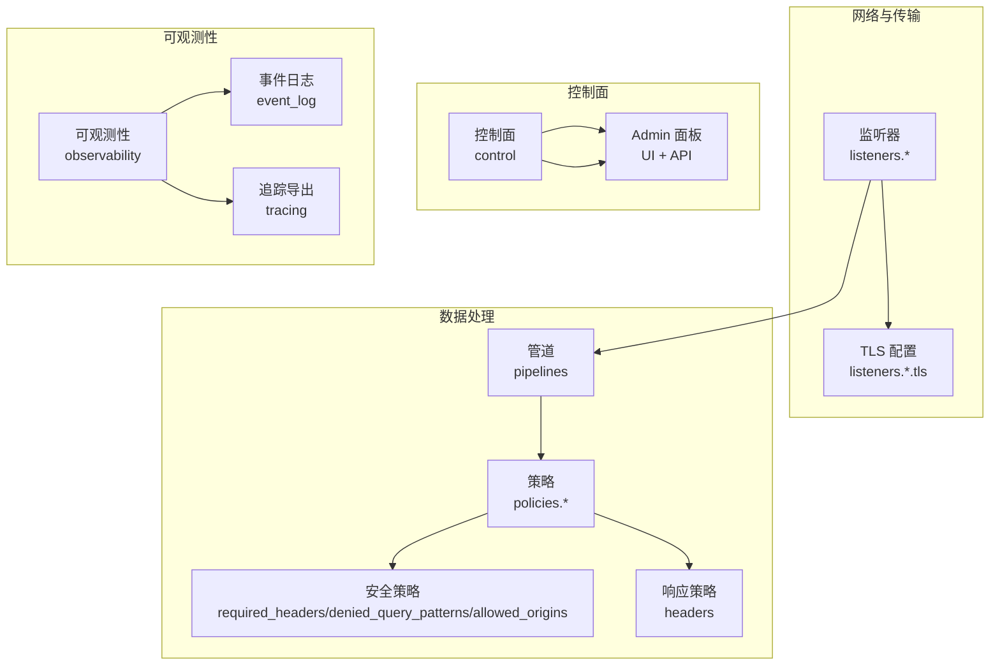
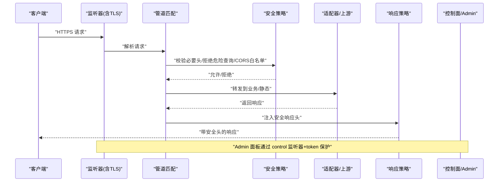
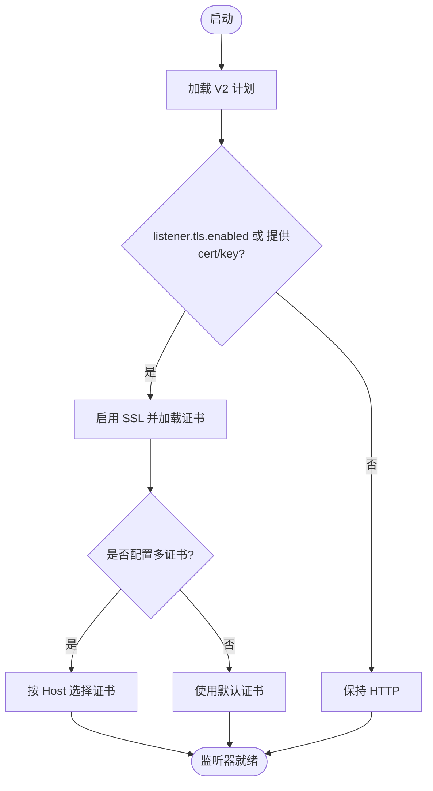
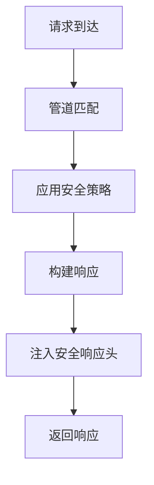
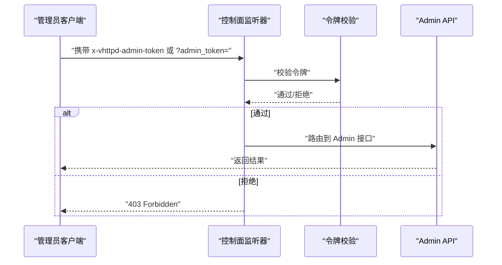
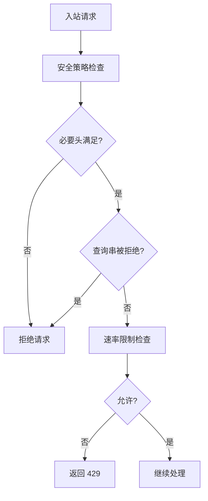
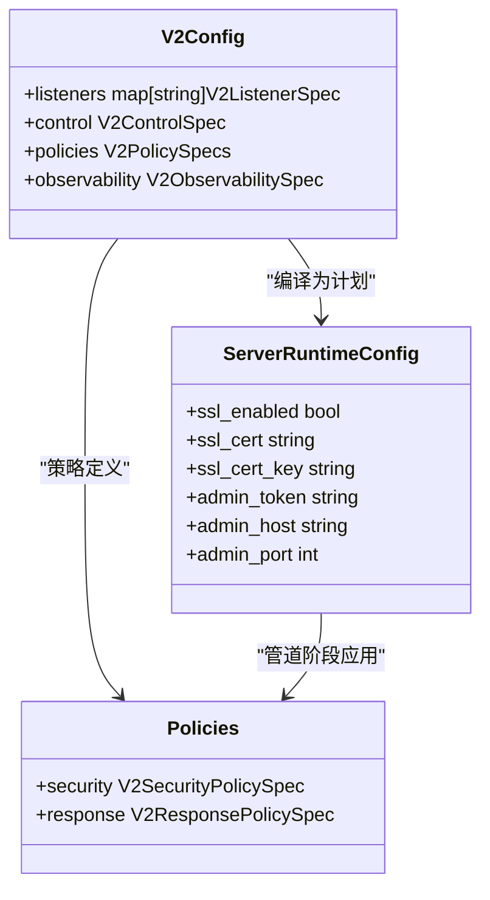

# 安全配置

<cite>
**本文引用的文件**   
- [src/config/v2_config.v](file://src/config/v2_config.v)
- [src/server_lifecycle/runtime_config.v](file://src/server_lifecycle/runtime_config.v)
- [admin/admin.toml](file://admin/admin.toml)
- [config/vhttpd.example.toml](file://config/vhttpd.example.toml)
- [README.md](file://README.md)
- [docs/CONFIGURATION_MODEL_V2.md](file://docs/CONFIGURATION_MODEL_V2.md)
- [php/package/src/VHttpd/WordPress/Profiler.php](file://php/package/src/VHttpd/WordPress/Profiler.php)
- [php/package/tests/profiler_test.php](file://php/package/tests/profiler_test.php)
- [articles/12-advanced-patterns.md](file://articles/12-advanced-patterns.md)
- [src/logging/runtime_logger.v](file://src/logging/runtime_logger.v)
- [src/route_rule_test.v](file://src/route_rule_test.v)
</cite>

## 目录
1. [简介](#简介)
2. [项目结构](#项目结构)
3. [核心组件](#核心组件)
4. [架构总览](#架构总览)
5. [详细组件分析](#详细组件分析)
6. [依赖关系分析](#依赖关系分析)
7. [性能与安全权衡](#性能与安全权衡)
8. [故障排查指南](#故障排查指南)
9. [结论](#结论)
10. [附录](#附录)

## 简介
本文件聚焦 vhttpd 的安全配置，覆盖以下主题：
- HTTPS/TLS 证书与监听器配置、SNI 多证书支持
- SSL 参数调优建议（结合监听器模型）
- HTTP 安全响应头设置与缺失检测
- 访问控制、身份验证与授权机制（Admin 面板令牌认证、端口暴露策略）
- Admin 面板安全：令牌、绑定地址、HTTPS 强制建议
- 输入校验、请求过滤、速率限制等防护能力
- 安全审计日志与可观测性（事件日志、追踪导出）
- 生产环境最佳实践与常见漏洞防护方案

## 项目结构
vhttpd 采用 V2 配置模型，将网络监听、TLS、控制面、可观测性、资源、引擎、适配器、变换、策略、管道和中继解耦为独立领域。安全相关能力主要分布在：
- 监听器与 TLS：listeners + listeners.*.tls
- 控制面与令牌认证：control
- 安全策略与响应头：policies.security / policies.response
- 可观测性与审计：observability.event_log / observability.tracing
- Admin 面板：通过 control 暴露的监听器承载

图表来源
- [docs/CONFIGURATION_MODEL_V2.md:218-275](file://docs/CONFIGURATION_MODEL_V2.md#L218-L275)
- [src/config/v2_config.v:28-57](file://src/config/v2_config.v#L28-L57)
- [src/config/v2_config.v:224-234](file://src/config/v2_config.v#L224-L234)
- [src/config/v2_config.v:59-72](file://src/config/v2_config.v#L59-L72)

章节来源
- [docs/CONFIGURATION_MODEL_V2.md:1-100](file://docs/CONFIGURATION_MODEL_V2.md#L1-L100)
- [src/config/v2_config.v:1-120](file://src/config/v2_config.v#L1-L120)

## 核心组件
- 监听器与 TLS
  - 在 listeners 中声明协议、传输、主机与端口；在 listeners.*.tls 中启用并配置证书与私钥，支持 SNI 多证书列表。
- 控制面与令牌认证
  - control 指定监听器引用与 token，用于 Admin 面板访问控制。
- 安全策略
  - policies.security 支持 required_headers、denied_query_patterns、allowed_origins；policies.response 支持统一添加响应头。
- 可观测性
  - observability 提供 event_log 与 tracing 导出，便于安全审计与告警。

章节来源
- [src/config/v2_config.v:28-57](file://src/config/v2_config.v#L28-L57)
- [src/config/v2_config.v:224-234](file://src/config/v2_config.v#L224-L234)
- [src/config/v2_config.v:59-72](file://src/config/v2_config.v#L59-L72)
- [docs/CONFIGURATION_MODEL_V2.md:218-275](file://docs/CONFIGURATION_MODEL_V2.md#L218-L275)

## 架构总览
下图展示了从客户端到应用的数据流与安全控制点：监听器终止 TLS，管道匹配后执行安全策略（必要头检查、查询串拒绝、CORS 白名单），再进入业务适配器或静态资源处理，最终由响应策略注入安全头。控制面独立监听，使用令牌认证。

图表来源
- [docs/CONFIGURATION_MODEL_V2.md:218-275](file://docs/CONFIGURATION_MODEL_V2.md#L218-L275)
- [src/config/v2_config.v:224-234](file://src/config/v2_config.v#L224-L234)
- [src/config/v2_config.v:59-72](file://src/config/v2_config.v#L59-L72)

## 详细组件分析

### HTTPS/TLS 证书与监听器配置
- 在 listeners 中定义协议、传输、host/port；在 listeners.*.tls 中启用 TLS 并配置 cert/cert_key。
- 支持 SNI 多证书：通过 certificates 列表按 hosts 选择不同证书。
- 运行时会将 listener.tls 合并到服务器 SSL 配置，若未显式启用但提供了证书路径，也会自动开启 SSL。

图表来源
- [docs/CONFIGURATION_MODEL_V2.md:251-275](file://docs/CONFIGURATION_MODEL_V2.md#L251-L275)
- [src/server_lifecycle/runtime_config.v:239-249](file://src/server_lifecycle/runtime_config.v#L239-L249)
- [src/server_lifecycle/runtime_config.v:118-121](file://src/server_lifecycle/runtime_config.v#L118-L121)

章节来源
- [docs/CONFIGURATION_MODEL_V2.md:251-275](file://docs/CONFIGURATION_MODEL_V2.md#L251-L275)
- [src/config/v2_config.v:28-50](file://src/config/v2_config.v#L28-L50)
- [src/server_lifecycle/runtime_config.v:239-249](file://src/server_lifecycle/runtime_config.v#L239-L249)

### SSL 参数调优建议
- 当前配置模型以“监听器 + TLS”为主，具体密码套件、最小版本等底层参数未在公开 TOML 字段中暴露。建议在反向代理层（如 Nginx/Cloudflare）集中管理 SSL 参数，vhttpd 仅负责证书与 SNI。
- 若需进程内调整，可在未来扩展 listener.tls.options 映射，以键值形式传入底层实现。

[本节为通用指导，不直接分析具体文件]

### HTTP 安全响应头设置与缺失检测
- 可通过 policies.response.headers 统一注入安全头，例如 Content-Security-Policy、X-Frame-Options、X-Content-Type-Options、Referrer-Policy、Permissions-Policy。
- WordPress Profiler 会检测站点响应头缺失情况，并在 UI 中提示，同时生成建议的 TOML 片段以便快速加固。

图表来源
- [src/config/v2_config.v:231-234](file://src/config/v2_config.v#L231-L234)
- [php/package/src/VHttpd/WordPress/Profiler.php:1176-1197](file://php/package/src/VHttpd/WordPress/Profiler.php#L1176-L1197)
- [php/package/tests/profiler_test.php:225-234](file://php/package/tests/profiler_test.php#L225-L234)

章节来源
- [src/config/v2_config.v:231-234](file://src/config/v2_config.v#L231-L234)
- [php/package/src/VHttpd/WordPress/Profiler.php:1176-1197](file://php/package/src/VHttpd/WordPress/Profiler.php#L1176-L1197)
- [php/package/tests/profiler_test.php:225-234](file://php/package/tests/profiler_test.php#L225-L234)

### 访问控制、身份验证与授权机制
- Admin 面板认证模型：
  - 当 admin token 为空时，Admin 端点在数据平面端口开放。
  - 当设置 token 后，需在请求头 x-vhttpd-admin-token 或查询参数 admin_token 携带该令牌，否则返回 403。
- 端口暴露模型：
  - 当 admin_port > 0 时，/admin/* 从数据平面移除，仅在控制面监听器上提供服务。
  - 当 admin_port = 0 时，/admin/* 仍在数据平面端口提供。

图表来源
- [README.md:1187-1203](file://README.md#L1187-L1203)
- [admin/admin.toml:21-24](file://admin/admin.toml#L21-L24)
- [src/server_lifecycle/runtime_config.v:103-117](file://src/server_lifecycle/runtime_config.v#L103-L117)

章节来源
- [README.md:1187-1203](file://README.md#L1187-L1203)
- [admin/admin.toml:21-24](file://admin/admin.toml#L21-L24)
- [src/server_lifecycle/runtime_config.v:103-117](file://src/server_lifecycle/runtime_config.v#L103-L117)

### Admin 面板安全配置要点
- 令牌认证：在 control.token 设置强随机令牌，或通过环境变量注入。
- 绑定地址：建议将控制面监听器绑定到 127.0.0.1，并通过反向代理或防火墙限制外部访问。
- HTTPS 强制：控制面监听器同样支持 TLS，可在 listeners.admin_ui.tls 中配置证书，强制 HTTPS。
- 内部通信：internal_socket 可用于进程间控制通道，避免网络暴露。

章节来源
- [admin/admin.toml:15-24](file://admin/admin.toml#L15-L24)
- [docs/CONFIGURATION_MODEL_V2.md:218-233](file://docs/CONFIGURATION_MODEL_V2.md#L218-L233)
- [src/config/v2_config.v:52-57](file://src/config/v2_config.v#L52-L57)

### 输入验证、请求过滤与速率限制
- 输入验证与请求过滤：
  - policies.security.required_headers：要求特定请求头存在且匹配模式。
  - policies.security.denied_query_patterns：拒绝包含敏感字段的查询串。
  - policies.security.allowed_origins：限制跨域来源。
- 速率限制：
  - 示例文章提供了基于 Redis 的速率限制中间件实现思路，可作为 Transform 或应用层中间件集成。
  - 也可在网关层（Nginx/云厂商 WAF）实施更高效的限流。

图表来源
- [src/config/v2_config.v:224-229](file://src/config/v2_config.v#L224-L229)
- [src/route_rule_test.v:247-278](file://src/route_rule_test.v#L247-L278)
- [articles/12-advanced-patterns.md:822-915](file://articles/12-advanced-patterns.md#L822-L915)

章节来源
- [src/config/v2_config.v:224-229](file://src/config/v2_config.v#L224-L229)
- [src/route_rule_test.v:247-278](file://src/route_rule_test.v#L247-L278)
- [articles/12-advanced-patterns.md:822-915](file://articles/12-advanced-patterns.md#L822-L915)

### 安全审计日志与监控告警
- 事件日志：observability.event_log 输出 NDJSON 格式事件，便于接入 SIEM 或日志平台进行安全审计。
- 追踪导出：observability.tracing 支持 OTLP 等导出器，可配合 Prometheus/Grafana 进行可视化与告警。
- 日志级别：RuntimeLogger 根据环境变量 VHTTPD_LOG_LEVEL 动态生效，生产环境默认 warn。

章节来源
- [docs/CONFIGURATION_MODEL_V2.md:235-249](file://docs/CONFIGURATION_MODEL_V2.md#L235-L249)
- [src/logging/runtime_logger.v:8-41](file://src/logging/runtime_logger.v#L8-L41)

## 依赖关系分析
- 配置模型与运行时：V2 配置经编译生成 RuntimePlan，运行时模块消费计划对象，不再直接解析 TOML。
- 监听器与 TLS：server_lifecycle 从 plan.listener 提取 TLS 信息，决定 ssl_enabled 与证书路径。
- 控制面与 Admin：control.listener 引用监听器，admin_token 作为认证凭据，admin_host/admin_port 决定暴露方式。
- 安全策略：policies.security 与 policies.response 在管道阶段生效，影响请求准入与响应头注入。

图表来源
- [src/config/v2_config.v:1-120](file://src/config/v2_config.v#L1-L120)
- [src/server_lifecycle/runtime_config.v:31-52](file://src/server_lifecycle/runtime_config.v#L31-L52)
- [src/config/v2_config.v:224-234](file://src/config/v2_config.v#L224-L234)

章节来源
- [src/config/v2_config.v:1-120](file://src/config/v2_config.v#L1-L120)
- [src/server_lifecycle/runtime_config.v:31-52](file://src/server_lifecycle/runtime_config.v#L31-L52)

## 性能与安全权衡
- TLS 握手开销：在高并发场景下，建议在前置反向代理层卸载 TLS，减少 vhttpd 的 CPU 压力。
- 安全头注入：policies.response.headers 在响应路径注入，开销极低，建议全局启用。
- 速率限制：应用层限流会增加后端负载，优先在网关层实现；若必须在应用层，建议使用高效数据结构与缓存（如 Redis）。
- 日志与追踪：高吞吐环境下适当降低采样率，避免 I/O 成为瓶颈。

[本节为通用指导，不直接分析具体文件]

## 故障排查指南
- Admin 面板 403：
  - 确认 control.token 已设置且请求携带正确令牌。
  - 确认控制面监听器绑定地址与端口可达。
- TLS 启动失败：
  - 检查 listeners.*.tls.cert 与 cert_key 路径是否正确。
  - 若未启用 tls.enabled 但未提供证书，不会自动开启 SSL。
- 安全头缺失：
  - 使用 WordPress Profiler 检测缺失项，并按建议添加 policies.response.headers。
- 速率限制触发：
  - 检查 X-RateLimit-* 响应头，确认限流阈值与窗口时间。

章节来源
- [README.md:1187-1203](file://README.md#L1187-L1203)
- [src/server_lifecycle/runtime_config.v:118-121](file://src/server_lifecycle/runtime_config.v#L118-L121)
- [php/package/src/VHttpd/WordPress/Profiler.php:1176-1197](file://php/package/src/VHttpd/WordPress/Profiler.php#L1176-L1197)
- [articles/12-advanced-patterns.md:822-915](file://articles/12-advanced-patterns.md#L822-L915)

## 结论
vhttpd 的安全配置围绕“监听器 + 控制面 + 策略 + 可观测性”展开。通过 V2 配置模型，可将 TLS、令牌认证、安全头、输入校验与限流等能力清晰分离与组合。生产环境建议：
- 前置反向代理卸载 TLS 并集中管理 SSL 参数
- 控制面仅本地绑定并强制 HTTPS
- 全局注入安全响应头
- 在网关层实施速率限制与 WAF 规则
- 启用事件日志与追踪导出，建立告警与审计流程

[本节为总结，不直接分析具体文件]

## 附录

### 生产环境安全配置清单
- 监听器与 TLS
  - 启用 listeners.*.tls，配置有效证书与私钥
  - 如需多域名，使用 certificates 列表按 hosts 配置
- 控制面与 Admin
  - control.token 设置为强随机值
  - 控制面监听器绑定 127.0.0.1，必要时启用 TLS
- 安全响应头
  - 在 policies.response.headers 注入 CSP、X-Frame-Options、X-Content-Type-Options、Referrer-Policy、Permissions-Policy
- 输入校验与过滤
  - 使用 policies.security.required_headers 与 denied_query_patterns
  - 使用 allowed_origins 限制跨域来源
- 速率限制
  - 优先在网关层实现；应用层可使用示例中间件思路
- 可观测性
  - 配置 observability.event_log 与 tracing 导出
  - 合理设置日志级别与采样率

章节来源
- [docs/CONFIGURATION_MODEL_V2.md:218-275](file://docs/CONFIGURATION_MODEL_V2.md#L218-L275)
- [src/config/v2_config.v:224-234](file://src/config/v2_config.v#L224-L234)
- [php/package/src/VHttpd/WordPress/Profiler.php:1176-1197](file://php/package/src/VHttpd/WordPress/Profiler.php#L1176-L1197)
- [src/logging/runtime_logger.v:8-41](file://src/logging/runtime_logger.v#L8-L41)