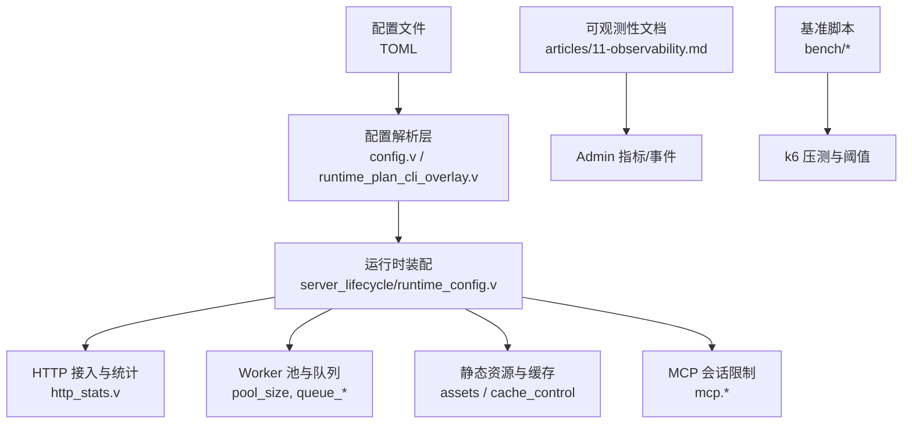
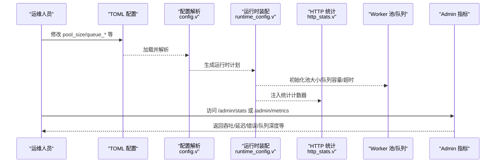
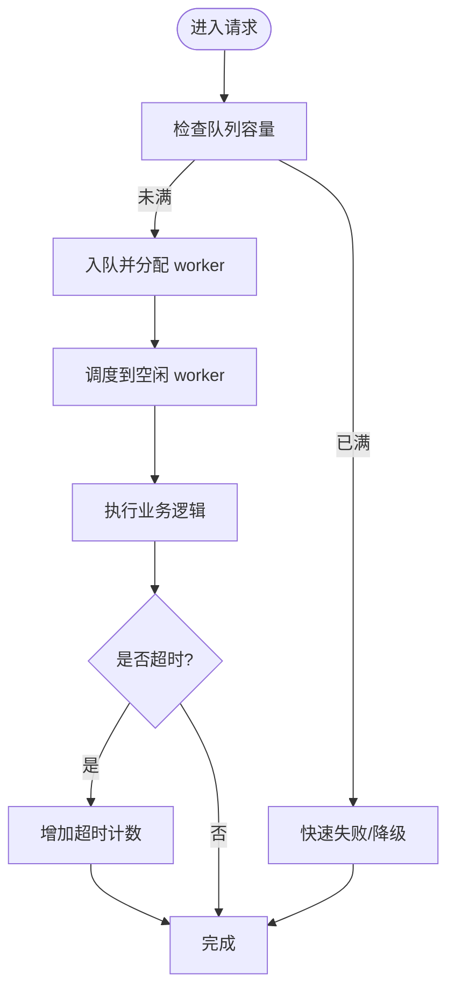
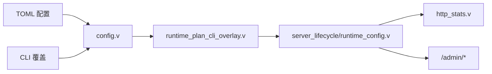

# 性能调优

<cite>
**本文引用的文件**   
- [README.md](file://README.md)
- [config/vhttpd.example.toml](file://config/vhttpd.example.toml)
- [src/config/config.v](file://src/config/config.v)
- [src/server_lifecycle/runtime_config.v](file://src/server_lifecycle/runtime_config.v)
- [src/config/runtime_plan_cli_overlay.v](file://src/config/runtime_plan_cli_overlay.v)
- [bench/README.md](file://bench/README.md)
- [bench/k6_short.js](file://bench/k6_short.js)
- [articles/11-observability.md](file://articles/11-observability.md)
- [src/http_stats.v](file://src/http_stats.v)
- [examples/config/mcp.toml](file://examples/config/mcp.toml)
- [tests/e2e/config_acceptance_test.sh](file://tests/e2e/config_acceptance_test.sh)
</cite>

## 目录
1. [简介](#简介)
2. [项目结构](#项目结构)
3. [核心组件](#核心组件)
4. [架构总览](#架构总览)
5. [详细组件分析](#详细组件分析)
6. [依赖关系分析](#依赖关系分析)
7. [性能考虑](#性能考虑)
8. [故障排查指南](#故障排查指南)
9. [结论](#结论)
10. [附录](#附录)

## 简介
本指南聚焦 vhttpd 在生产环境中的性能调优，覆盖以下关键主题：
- Worker 池配置优化（并发数、内存、请求处理队列）
- HTTP 服务器相关参数（连接、缓冲区、超时等）
- 静态资源服务与缓存策略、压缩传输
- 日志级别与监控指标对性能的影响及配置方法
- 数据库连接池与外部服务连接的优化
- 基准测试与监控指标的解读方法

## 项目结构
vhttpd 将“协议接入 + 运行时编排 + 执行器”解耦。与性能调优直接相关的配置集中在 TOML 配置与 V 源码的解析层；观测与基准能力由内置 admin 端点与 k6 脚本提供。

图表来源
- [src/config/config.v:33-50](file://src/config/config.v#L33-L50)
- [src/config/runtime_plan_cli_overlay.v:84-113](file://src/config/runtime_plan_cli_overlay.v#L84-L113)
- [src/server_lifecycle/runtime_config.v:89-112](file://src/server_lifecycle/runtime_config.v#L89-L112)
- [src/http_stats.v:1-32](file://src/http_stats.v#L1-L32)
- [config/vhttpd.example.toml:19-47](file://config/vhttpd.example.toml#L19-L47)
- [examples/config/mcp.toml:24-32](file://examples/config/mcp.toml#L24-L32)
- [bench/README.md:1-58](file://bench/README.md#L1-L58)

章节来源
- [README.md:428-525](file://README.md#L428-L525)
- [config/vhttpd.example.toml:1-67](file://config/vhttpd.example.toml#L1-L67)
- [src/config/config.v:33-50](file://src/config/config.v#L33-L50)

## 核心组件
- Worker 池与队列
  - pool_size：控制并发 worker 数量，直接影响吞吐与 CPU 利用率
  - queue_capacity / queue_timeout_ms：背压与排队等待上限，避免瞬时峰值导致雪崩
  - read_timeout_ms：worker 读超时，短请求建议较小值，流式场景需放大
  - max_requests：单 worker 生命周期内最大请求数，用于规避内存泄漏累积
  - restart_backoff_ms / restart_backoff_max_ms：重启退避，降低抖动
- 静态资源与缓存
  - assets.enabled/prefix/root/cache_control：开启静态资源路由与浏览器缓存
  - route.cache_control/response_cache_ttl_ms：按路由粒度设置响应缓存
- MCP 会话限制
  - mcp.max_sessions / session_ttl_seconds / max_pending_messages：保护长连接与会话资源
- Admin 与指标
  - admin.host/port/token：管理面端口与鉴权
  - /admin/stats、/admin/workers、/admin/metrics：运行态指标与 Prometheus 抓取
- 基准测试
  - bench/k6_short.js 与 README 中提供的 k6 用例与阈值

章节来源
- [src/config/config.v:33-50](file://src/config/config.v#L33-L50)
- [src/config/config.v:139-145](file://src/config/config.v#L139-L145)
- [src/config/config.v:172-179](file://src/config/config.v#L172-L179)
- [config/vhttpd.example.toml:38-47](file://config/vhttpd.example.toml#L38-L47)
- [examples/config/mcp.toml:24-32](file://examples/config/mcp.toml#L24-L32)
- [articles/11-observability.md:77-140](file://articles/11-observability.md#L77-L140)
- [bench/k6_short.js:11-30](file://bench/k6_short.js#L11-L30)

## 架构总览
下图展示从配置到运行时装配的关键路径，以及性能相关参数的生效位置。

图表来源
- [src/config/config.v:33-50](file://src/config/config.v#L33-L50)
- [src/server_lifecycle/runtime_config.v:89-112](file://src/server_lifecycle/runtime_config.v#L89-L112)
- [src/http_stats.v:1-32](file://src/http_stats.v#L1-L32)
- [articles/11-observability.md:77-140](file://articles/11-observability.md#L77-L140)

## 详细组件分析

### Worker 池与队列调优
- 并发与吞吐
  - pool_size 应与 CPU 核数匹配，I/O 密集可适当放大；结合 k6 压测观察 p95/p99 延迟与吞吐拐点
- 队列与背压
  - queue_capacity 决定瞬时峰值缓冲能力；queue_timeout_ms 控制入队等待上限，过大易堆积，过小易拒绝
- 超时与稳定性
  - read_timeout_ms 短请求建议 1~3s，AI 流式场景需放大至数十秒甚至分钟级
  - max_requests 定期重启 worker，缓解内存增长；配合 restart_backoff* 平滑重启
- CLI 覆盖
  - 支持通过 --worker-pool-size、--worker-queue-capacity、--worker-queue-timeout-ms、--worker-read-timeout-ms、--worker-max-requests 等临时覆盖

图表来源
- [src/config/config.v:33-50](file://src/config/config.v#L33-L50)
- [src/config/runtime_plan_cli_overlay.v:84-113](file://src/config/runtime_plan_cli_overlay.v#L84-L113)
- [src/http_stats.v:1-32](file://src/http_stats.v#L1-L32)

章节来源
- [src/config/config.v:33-50](file://src/config/config.v#L33-L50)
- [src/config/runtime_plan_cli_overlay.v:84-113](file://src/config/runtime_plan_cli_overlay.v#L84-L113)
- [src/server_lifecycle/runtime_config.v:89-112](file://src/server_lifecycle/runtime_config.v#L89-L112)
- [bench/README.md:24-58](file://bench/README.md#L24-L58)

### HTTP 服务器与连接/缓冲区/超时
- 监听与绑定
  - server.host/server.port 定义数据平面入口；admin.host/admin.port 定义管理面入口
- SSL/TLS
  - server.ssl.enabled/cert/cert_key 启用 HTTPS；生产建议前置反向代理或使用系统证书管理
- 缓冲区与超时
  - 底层基于 veb/http，vhttpd 保持薄封装；应用侧可通过 worker.read_timeout_ms 控制端到端读取超时
- 多监听模式
  - 支持多 listener/site 组合，不同站点可独立选择执行器与 worker 池

章节来源
- [src/config/config.v:6-19](file://src/config/config.v#L6-L19)
- [src/config/config.v:132-137](file://src/config/config.v#L132-L137)
- [README.md:533-603](file://README.md#L533-L603)

### 静态文件服务与缓存策略
- 静态资源
  - assets.enabled/prefix/root 启用静态资源路由；cache_control 设置浏览器缓存头
- 路由级缓存
  - routes[].cache_control/response_cache_ttl_ms 针对特定路径设置缓存策略
- 忽略/绕过 Cookie
  - cache_bypass_cookie_patterns / cache_ignore_cookie_patterns 精细化控制缓存命中

章节来源
- [config/vhttpd.example.toml:43-47](file://config/vhttpd.example.toml#L43-L47)
- [src/config/config.v:139-145](file://src/config/config.v#L139-L145)
- [src/config/config.v:321-341](file://src/config/config.v#L321-L341)

### 压缩传输
- 说明
  - 仓库未提供内置压缩开关；建议在 vhttpd 前使用反向代理（如 nginx/Caddy）进行 gzip/br 压缩，或在应用层按需输出压缩内容
- 建议
  - 文本类资源优先启用 br/gzip；图片/视频通常无需二次压缩

[本节为通用指导，不直接分析具体文件]

### 日志级别与监控指标
- 日志
  - files.event_log 指定事件日志路径；生产建议配合 logrotate 轮转
  - 结构化日志与模块级日志级别在规划中，可按需关注后续版本
- 指标
  - /admin/stats：请求总量、错误、速率、延迟分位、错误分类
  - /admin/workers：worker 状态、内存、请求计数
  - /admin/metrics：Prometheus text 格式，便于 Grafana 采集
- 自定义指标
  - 可在 PHP 应用中通过 Metrics API 上报业务指标

章节来源
- [src/config/config.v:21-25](file://src/config/config.v#L21-L25)
- [articles/11-observability.md:77-140](file://articles/11-observability.md#L77-L140)
- [articles/11-observability.md:406-468](file://articles/11-observability.md#L406-L468)
- [docs/refactor_0601.md:366-379](file://docs/refactor_0601.md#L366-L379)

### 数据库连接池与外部服务连接
- 数据库
  - db.mysql.pool_size/db.pgsql.pool_size 控制连接池大小；idle_ping_ms/init_sql 用于健康检查与初始化
  - 注意不同驱动的差异（例如 pgsql 的 idle_ping_ms 默认行为）
- 外部上游
  - feishu.reconnect_delay_ms 等参数影响重连频率与稳定性
  - codex.flush_interval_ms 等参数影响上游推送节奏

章节来源
- [src/config/config.v:275-305](file://src/config/config.v#L275-L305)
- [src/provider/config.v:205-229](file://src/provider/config.v#L205-L229)
- [src/config/config.v:181-192](file://src/config/config.v#L181-L192)
- [src/config/config.v:216-227](file://src/config/config.v#L216-L227)

### MCP 会话与消息限流
- mcp.max_sessions：最大并发会话数
- mcp.session_ttl_seconds：会话存活时间
- mcp.max_pending_messages：每会话待处理消息上限
- mcp.allowed_origins：跨域白名单

章节来源
- [src/config/config.v:172-179](file://src/config/config.v#L172-L179)
- [examples/config/mcp.toml:24-32](file://examples/config/mcp.toml#L24-L32)

### 基准测试与指标解读
- 短请求基准
  - 使用 bench/k6_short.js，阈值包含失败率、p95/p99 延迟
- 流式基准
  - 参考 bench/README.md 的 SSE/text 流式压测矩阵
- 一键回归
  - bench/run_host_regression.sh 自动构建、启动、压测与清理
- 指标解读
  - /admin/stats 的 rate_1m/rate_5m 反映吞吐趋势；latency_ms.p50/p95/p99 评估尾延迟
  - errors.worker_queue_full 指示队列过小或 worker 不足

章节来源
- [bench/README.md:1-58](file://bench/README.md#L1-L58)
- [bench/k6_short.js:11-30](file://bench/k6_short.js#L11-L30)
- [articles/11-observability.md:112-140](file://articles/11-observability.md#L112-L140)

## 依赖关系分析
- 配置到运行的链路
  - TOML -> config.v 解析 -> runtime_plan_cli_overlay.v CLI 覆盖 -> server_lifecycle/runtime_config.v 装配
- 指标与统计
  - http_stats.v 维护全局计数器，供 admin 暴露
- 示例与验证
  - e2e 测试脚本中包含 worker 队列与 socket 前缀等配置样例，可用于复现问题

图表来源
- [src/config/config.v:33-50](file://src/config/config.v#L33-L50)
- [src/config/runtime_plan_cli_overlay.v:84-113](file://src/config/runtime_plan_cli_overlay.v#L84-L113)
- [src/server_lifecycle/runtime_config.v:89-112](file://src/server_lifecycle/runtime_config.v#L89-L112)
- [src/http_stats.v:1-32](file://src/http_stats.v#L1-L32)

章节来源
- [tests/e2e/config_acceptance_test.sh:2229-2295](file://tests/e2e/config_acceptance_test.sh#L2229-L2295)

## 性能考虑
- 合理设置 pool_size 与 queue_capacity，使两者与 CPU 核数和磁盘/网络 IO 能力匹配
- 区分短请求与流式请求的超时策略，避免误杀长任务
- 使用 max_requests 周期性重启 worker，抑制内存泄漏
- 静态资源开启浏览器缓存，减少重复下载
- 利用 /admin/stats 与 /admin/metrics 持续跟踪吞吐、延迟与错误分布
- 在反向代理层启用压缩，减轻带宽压力

[本节为通用指导，不直接分析具体文件]

## 故障排查指南
- Worker 频繁重启或内存持续增长
  - 检查 /admin/workers 的 memory_mb 与 request_count，必要时调整 max_requests
- 队列积压与超时
  - 观察 /admin/stats 的 worker_queue_full 与 timeouts_total，适当增大 queue_capacity 或 pool_size
- 上游连接不稳定
  - 查看 /admin/runtime/upstreams/websocket 与 events，调整 reconnect_delay_ms 等参数
- 日志体积过大
  - 使用 logrotate 并按需降低日志级别，仅保留必要模块 debug 输出

章节来源
- [articles/11-observability.md:536-619](file://articles/11-observability.md#L536-L619)
- [articles/11-observability.md:406-468](file://articles/11-observability.md#L406-L468)

## 结论
通过对 Worker 池、队列、超时、静态资源缓存、指标与基准测试的系统化调优，可以在保证稳定性的前提下显著提升吞吐与降低尾延迟。建议以压测驱动迭代，结合 /admin/stats 与 /admin/metrics 持续校准参数。

[本节为总结性内容，不直接分析具体文件]

## 附录
- 常用 TOML 键位速查
  - worker.pool_size / worker.queue_capacity / worker.queue_timeout_ms / worker.read_timeout_ms / worker.max_requests
  - assets.enabled / assets.prefix / assets.root / assets.cache_control
  - mcp.max_sessions / mcp.session_ttl_seconds / mcp.max_pending_messages
  - db.mysql.pool_size / db.pgsql.pool_size / db.mysql.idle_ping_ms
- 环境变量与 CLI
  - VHTTPD_CONFIG、VHTTPD_LOG_LEVEL 等
  - --worker-pool-size、--worker-queue-capacity、--worker-queue-timeout-ms、--worker-read-timeout-ms、--worker-max-requests

章节来源
- [src/config/config.v:33-50](file://src/config/config.v#L33-L50)
- [src/config/config.v:139-145](file://src/config/config.v#L139-L145)
- [src/config/config.v:172-179](file://src/config/config.v#L172-L179)
- [src/config/config.v:275-305](file://src/config/config.v#L275-L305)
- [src/config/runtime_plan_cli_overlay.v:84-113](file://src/config/runtime_plan_cli_overlay.v#L84-L113)