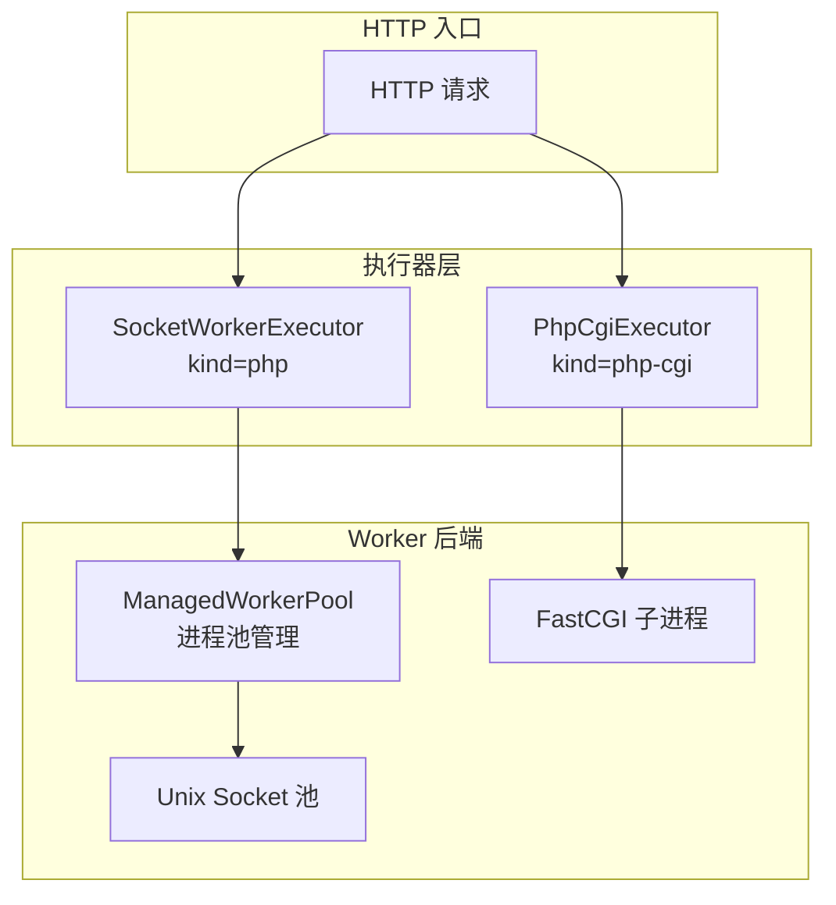
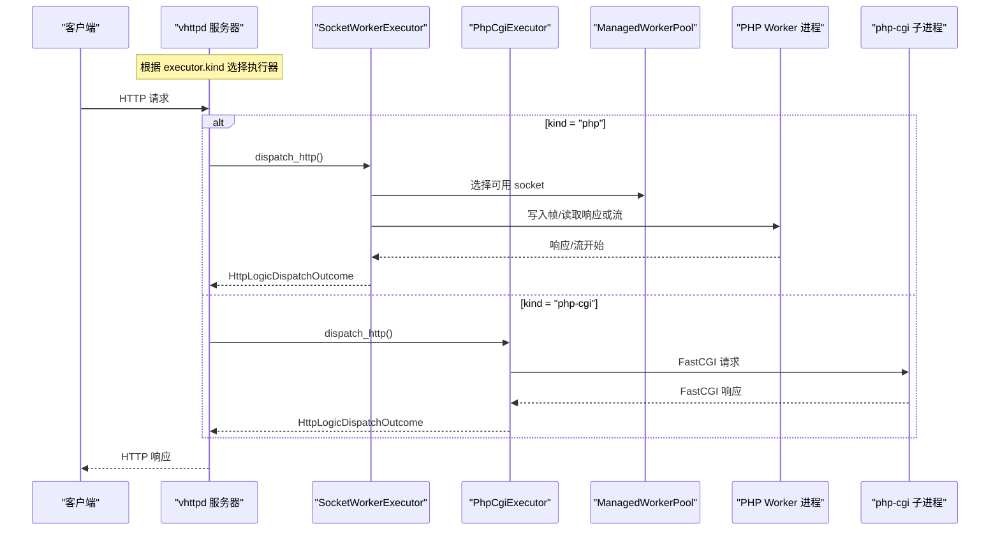
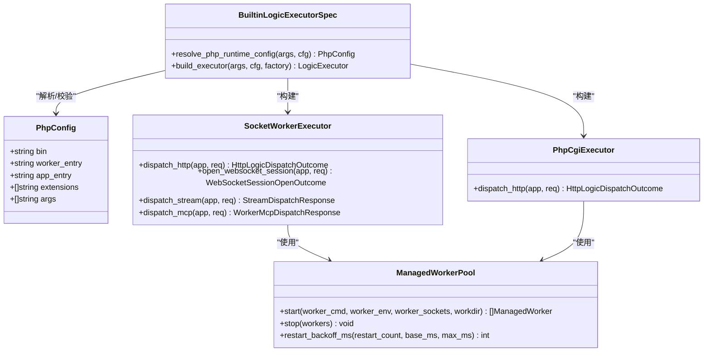

# PHP Worker 执行器

<cite>
**本文引用的文件列表**
- [config/vhttpd.example.toml](file://config/vhttpd.example.toml)
- [src/config/config.v](file://src/config/config.v)
- [src/executor/php_cgi_executor.v](file://src/executor/php_cgi_executor.v)
- [src/executor/socket_worker_executor.v](file://src/executor/socket_worker_executor.v)
- [src/executor/registry.v](file://src/executor/registry.v)
- [src/upstream/transport/worker_pool.v](file://src/upstream/transport/worker_pool.v)
- [src/server_logic_test.v](file://src/server_logic_test.v)
- [examples/wordpress/vhttpd-cgi.toml](file://examples/wordpress/vhttpd-cgi.toml)
- [docs/EXECUTOR_MODES.md](file://docs/EXECUTOR_MODES.md)
- [articles/11-observability.md](file://articles/11-observability.md)
</cite>

## 目录
1. [简介](#简介)
2. [项目结构](#项目结构)
3. [核心组件](#核心组件)
4. [架构总览](#架构总览)
5. [详细组件分析](#详细组件分析)
6. [依赖关系分析](#依赖关系分析)
7. [性能与容量规划](#性能与容量规划)
8. [故障排查指南](#故障排查指南)
9. [结论](#结论)
10. [附录：配置参考与最佳实践](#附录配置参考与最佳实践)

## 简介
本文件面向使用 vhttpd 的 PHP 应用开发者与运维人员，系统性说明 PHP Worker 执行器的配置、工作原理与架构。内容覆盖两种运行模式（CGI 模式与 Socket Worker 模式）、PHP 执行器核心配置项（php_binary、worker_entry、app_entry、extensions）、Worker 池管理（max_workers、max_requests、restart_strategy）以及连接超时、内存限制、错误处理等高级选项，并提供完整示例与最佳实践建议。

## 项目结构
vhttpd 将“执行器”抽象为可插拔的逻辑执行后端，其中 PHP 相关实现包括：
- Socket Worker 模式：通过 Unix Socket 与外部 PHP Worker 进程通信，支持 HTTP、流式、WebSocket、MCP 等多种协议。
- CGI 模式：通过 FastCGI 协议与 php-cgi 子进程交互，仅支持 HTTP 请求。

图表来源
- [src/executor/socket_worker_executor.v:1-157](file://src/executor/socket_worker_executor.v#L1-L157)
- [src/executor/php_cgi_executor.v:1-118](file://src/executor/php_cgi_executor.v#L1-L118)
- [src/upstream/transport/worker_pool.v:1-219](file://src/upstream/transport/worker_pool.v#L1-L219)

章节来源
- [src/executor/socket_worker_executor.v:1-157](file://src/executor/socket_worker_executor.v#L1-L157)
- [src/executor/php_cgi_executor.v:1-118](file://src/executor/php_cgi_executor.v#L1-L118)
- [src/upstream/transport/worker_pool.v:1-219](file://src/upstream/transport/worker_pool.v#L1-L219)

## 核心组件
- PhpConfig：定义 PHP 执行器相关配置，包含二进制路径、Worker 入口、应用入口、扩展列表与额外参数。
- SocketWorkerExecutor：Socket Worker 模式的执行器，负责选择 socket、设置超时、编码/解码请求与响应，并支持流式与 WebSocket。
- PhpCgiExecutor：CGI 模式的执行器，基于 FastCGI 协议与 php-cgi 子进程交互，仅支持 HTTP。
- ManagedWorkerPool：管理 Worker 进程生命周期、启动、优雅停止、重启退避与统计信息。

章节来源
- [src/config/config.v:52-86](file://src/config/config.v#L52-L86)
- [src/executor/socket_worker_executor.v:1-157](file://src/executor/socket_worker_executor.v#L1-L157)
- [src/executor/php_cgi_executor.v:1-118](file://src/executor/php_cgi_executor.v#L1-L118)
- [src/upstream/transport/worker_pool.v:1-219](file://src/upstream/transport/worker_pool.v#L1-L219)

## 架构总览
下图展示了两种 PHP 执行器在 vhttpd 中的角色与数据流向。Socket Worker 模式通过 Unix Socket 与持久化 Worker 进程通信；CGI 模式通过 FastCGI 与临时 php-cgi 子进程交互。

图表来源
- [src/executor/socket_worker_executor.v:43-95](file://src/executor/socket_worker_executor.v#L43-L95)
- [src/executor/php_cgi_executor.v:42-82](file://src/executor/php_cgi_executor.v#L42-L82)
- [src/upstream/transport/worker_pool.v:178-202](file://src/upstream/transport/worker_pool.v#L178-L202)

## 详细组件分析

### 配置模型与解析
- PhpConfig 字段
  - bin：PHP 二进制路径（默认 'php'）。
  - worker_entry：Worker 入口脚本（必需，用于 Socket Worker 模式）。
  - app_entry：应用入口脚本，注入环境变量 VHTTPD_APP。
  - extensions：扩展加载列表，按顺序以 -d extension=... 形式追加。
  - args：额外的 PHP CLI 参数。
- 运行时解析
  - 支持命令行覆盖：--php-bin、--php-worker-entry、--php-app-entry、--php-extension（可重复）、--php-arg（可重复）。
  - 启动前校验 worker_entry、app_entry 与 extensions 路径存在性。
- 命令生成
  - Socket Worker：由 bin + extensions + args + worker_entry 拼接成启动命令。
  - CGI：由 bin + extensions + args + -b {socket} 拼接，{socket} 占位符会被替换为实际 socket 路径。

章节来源
- [src/config/config.v:57-64](file://src/config/config.v#L57-L64)
- [src/executor/registry.v:176-195](file://src/executor/registry.v#L176-L195)
- [src/server_logic_test.v:1620-1663](file://src/server_logic_test.v#L1620-L1663)

### Socket Worker 模式
- 特点
  - 通过 Unix Socket 与外部 PHP Worker 进程通信。
  - 支持 HTTP、流式（Stream）、WebSocket、MCP 等能力。
  - 需要配置 worker_entry 与 socket 池（socket 或 socket_prefix），并由 ManagedWorkerPool 管理进程。
- 关键流程
  - 选择 socket：根据 kind 选择对应 socket。
  - 设置读超时：从后端配置中获取 read_timeout_ms。
  - 编码请求：使用 WorkerHttpRequestCodec 编码。
  - 处理响应：可能返回普通响应、流式开始帧或上游计划。
- 适用场景
  - 长连接、流式输出、WebSocket 会话、MCP 调度等高级特性。

章节来源
- [src/executor/socket_worker_executor.v:1-157](file://src/executor/socket_worker_executor.v#L1-L157)
- [src/upstream/transport/worker_pool.v:103-136](file://src/upstream/transport/worker_pool.v#L103-L136)

### CGI 模式
- 特点
  - 通过 FastCGI 协议与 php-cgi 子进程交互。
  - 仅支持 HTTP 请求，不支持 WebSocket、流式与 MCP。
  - 适合传统 PHP 应用快速接入，无需自定义 Worker 入口。
- 关键流程
  - 选择 socket：根据 kind 选择对应 socket。
  - 设置读超时：从后端配置中获取 read_timeout_ms。
  - 编码请求：使用 FastCgiCodec.encode_request。
  - 解码响应：使用 FastCgiCodec.decode_response。
- 适用场景
  - 无状态或短连接的 PHP 应用，如 WordPress、Laravel 等。

章节来源
- [src/executor/php_cgi_executor.v:1-118](file://src/executor/php_cgi_executor.v#L1-L118)
- [src/upstream/transport/fastcgi.v:311-385](file://src/upstream/transport/fastcgi.v#L311-L385)

### Worker 池管理与重启策略
- 进程管理
  - ManagedWorkerPool.start：为每个 socket 启动一个 ManagedWorker，等待 socket 就绪后返回。
  - stop：向进程组发送 SIGTERM，短暂等待后发送 SIGKILL，确保清理。
- 重启退避
  - restart_backoff_ms：基础退避时间。
  - restart_backoff_max_ms：最大退避上限。
  - 指数退避算法：每次重启延迟翻倍，直至达到上限。
- 请求计数与限流
  - max_requests：每个进程最大请求数，超过后触发重启，避免内存泄漏。
  - queue_capacity、queue_timeout_ms：队列容量与等待超时，控制背压。
- 自动启动
  - autostart：是否自动启动 Worker 进程。
  - pool_size：Worker 数量（即 socket 数量）。

章节来源
- [src/upstream/transport/worker_pool.v:178-219](file://src/upstream/transport/worker_pool.v#L178-L219)
- [src/server_lifecycle/runtime_config.v:89-112](file://src/server_lifecycle/runtime_config.v#L89-L112)

## 依赖关系分析
- 执行器注册表
  - 内置执行器规格包括 php、php-cgi、vjsx 等，分别映射到不同工厂与生命周期。
  - resolve_php_runtime_config：合并配置文件与命令行参数，生成最终 PhpConfig。
- 配置项暴露
  - 变量模板支持 ${cfg.worker.*}、${cfg.php.*} 等引用，便于跨段复用。
- 测试验证
  - 构建命令与环境变量优先级：确保 extensions 与 args 正确拼接，VHTTPD_APP 优先使用 php.app_entry。

图表来源
- [src/executor/registry.v:176-195](file://src/executor/registry.v#L176-L195)
- [src/executor/socket_worker_executor.v:1-157](file://src/executor/socket_worker_executor.v#L1-L157)
- [src/executor/php_cgi_executor.v:1-118](file://src/executor/php_cgi_executor.v#L1-L118)
- [src/upstream/transport/worker_pool.v:178-219](file://src/upstream/transport/worker_pool.v#L178-L219)

章节来源
- [src/executor/registry.v:100-130](file://src/executor/registry.v#L100-L130)
- [src/config/config.v:2213-2236](file://src/config/config.v#L2213-L2236)
- [src/server_logic_test.v:1665-1700](file://src/server_logic_test.v#L1665-L1700)

## 性能与容量规划
- Worker 池大小
  - 推荐 pool_size ≈ CPU 核心数 × 2，结合业务 I/O 特征调整。
- 请求上限与内存
  - 设置 max_requests 定期重启 Worker，避免长期运行的内存增长。
- 超时配置
  - read_timeout_ms：普通请求建议 3s，AI 流式请求建议 60s。
- 队列配置
  - queue_capacity 与 queue_timeout_ms：控制排队与拒绝策略，防止雪崩。
- 监控指标
  - 通过 admin 接口查看 workers 内存与状态，定位异常进程。

章节来源
- [articles/11-observability.md:602-666](file://articles/11-observability.md#L602-L666)

## 故障排查指南
- 常见错误
  - 缺少 worker_entry：构建命令时校验失败，需检查配置路径。
  - 扩展路径不存在：启动前校验失败，需确认 extensions 列表。
  - FastCGI 响应格式无效：检查 php-cgi 输出是否符合预期。
- 诊断步骤
  - 监控内存：admin.runtime 与 admin.workers 接口。
  - 检查日志：/tmp/vhttpd_php_worker_*.log 与 /tmp/vhttpd_php_cgi_*.log。
  - 调整 max_requests：周期性重启以降低内存占用风险。

章节来源
- [src/server_logic_test.v:1641-1663](file://src/server_logic_test.v#L1641-L1663)
- [src/upstream/transport/fastcgi.v:311-385](file://src/upstream/transport/fastcgi.v#L311-L385)

## 结论
vhttpd 的 PHP Worker 执行器提供了灵活的两种模式：Socket Worker 模式适用于高性能、长连接与多协议场景；CGI 模式适用于传统 PHP 应用的快速集成。通过合理的 Worker 池配置、超时与内存限制，以及完善的监控与排障手段，可以在生产环境中稳定高效地运行 PHP 应用。

## 附录：配置参考与最佳实践

### 配置项速查
- PHP 执行器核心配置（[php] 段）
  - bin：PHP 二进制路径（默认 'php'）。
  - worker_entry：Worker 入口脚本（Socket Worker 模式必需）。
  - app_entry：应用入口脚本，注入 VHTTPD_APP。
  - extensions：扩展加载列表，按顺序追加 -d extension=...。
  - args：额外的 PHP CLI 参数。
- Worker 池管理（[worker] 段）
  - socket 或 socket_prefix：Unix Socket 路径或前缀。
  - pool_size：Worker 数量。
  - max_requests：每个进程最大请求数。
  - restart_backoff_ms / restart_backoff_max_ms：重启退避策略。
  - read_timeout_ms：读超时毫秒。
  - autostart：是否自动启动。
  - queue_capacity / queue_timeout_ms：队列容量与等待超时。
- 命令行覆盖
  - --php-bin、--php-worker-entry、--php-app-entry、--php-extension（可重复）、--php-arg（可重复）。

章节来源
- [src/config/config.v:57-64](file://src/config/config.v#L57-L64)
- [src/executor/registry.v:176-195](file://src/executor/registry.v#L176-L195)
- [docs/EXECUTOR_MODES.md:58-80](file://docs/EXECUTOR_MODES.md#L58-L80)

### 完整配置示例
- Socket Worker 模式示例（[config/vhttpd.example.toml]）
  - 启用 executor.kind = "php"。
  - 配置 [php] 段的 bin、worker_entry、app_entry、extensions、args。
  - 配置 [worker] 段的 socket_prefix、pool_size、max_requests、read_timeout_ms、autostart。
- CGI 模式示例（[examples/wordpress/vhttpd-cgi.toml]）
  - 启用 executor.kind = "php-cgi"。
  - 配置 [worker] 段的 socket、pool_size、autostart。
  - 配置 [php] 段的 bin = "php-cgi"。

章节来源
- [config/vhttpd.example.toml:1-67](file://config/vhttpd.example.toml#L1-L67)
- [examples/wordpress/vhttpd-cgi.toml:1-17](file://examples/wordpress/vhttpd-cgi.toml#L1-L17)

### 最佳实践建议
- 选择模式
  - 需要流式、WebSocket、MCP：使用 Socket Worker 模式。
  - 传统 PHP 应用快速接入：使用 CGI 模式。
- 资源与稳定性
  - 合理设置 pool_size 与 max_requests，避免内存泄漏。
  - 针对 AI 流式请求调大 read_timeout_ms。
  - 使用队列容量与超时控制背压，防止过载。
- 监控与排障
  - 定期观察 admin.workers 与内存指标。
  - 关注日志文件，定位启动与运行期问题。
  - 利用重启退避策略平滑恢复。

章节来源
- [articles/11-observability.md:602-666](file://articles/11-observability.md#L602-L666)
- [docs/EXECUTOR_MODES.md:58-80](file://docs/EXECUTOR_MODES.md#L58-L80)