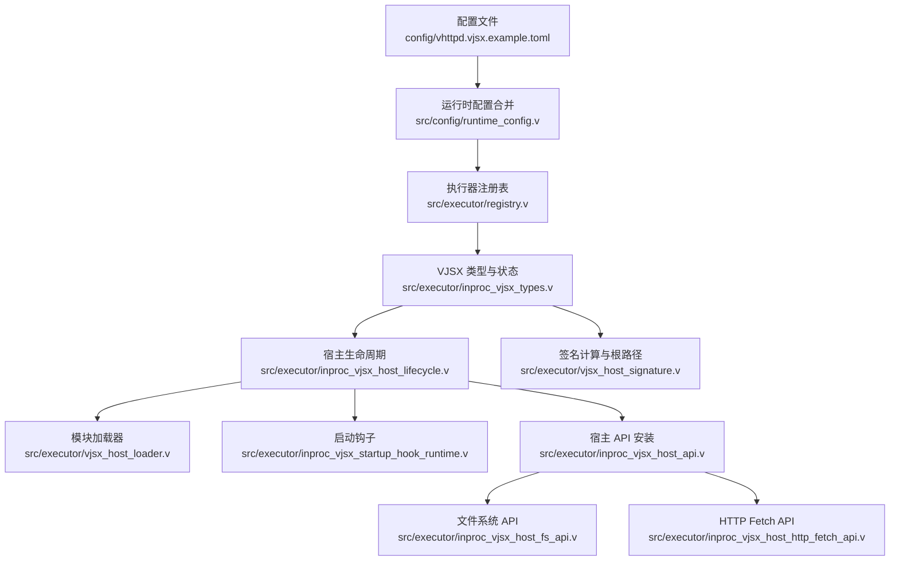
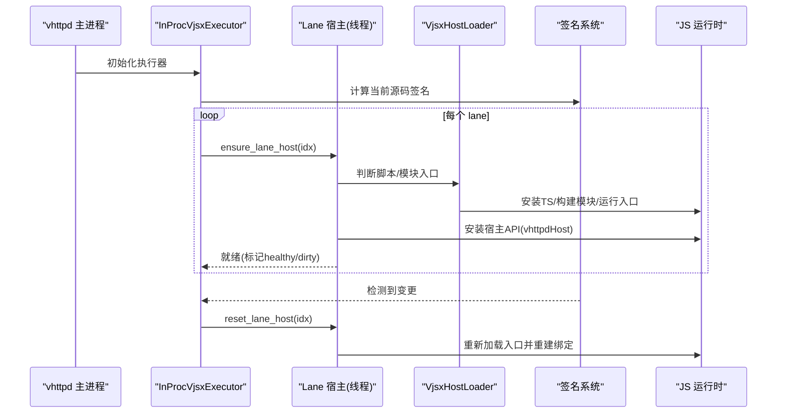
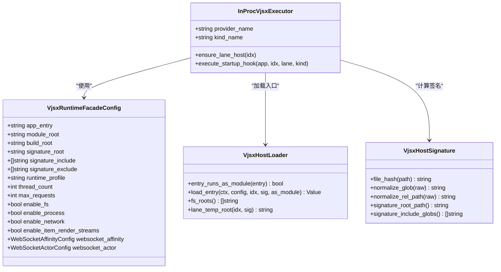
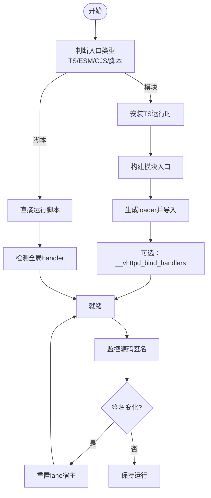

# VJSX 嵌入式执行器

<cite>
**本文引用的文件列表**
- [config/vhttpd.vjsx.example.toml](file://config/vhttpd.vjsx.example.toml)
- [src/executor/inproc_vjsx_types.v](file://src/executor/inproc_vjsx_types.v)
- [src/executor/vjsx_host_loader.v](file://src/executor/vjsx_host_loader.v)
- [src/executor/inproc_vjsx_host_lifecycle.v](file://src/executor/inproc_vjsx_host_lifecycle.v)
- [src/executor/inproc_vjsx_startup_hook_runtime.v](file://src/executor/inproc_vjsx_startup_hook_runtime.v)
- [src/executor/vjsx_host_signature.v](file://src/executor/vjsx_host_signature.v)
- [src/executor/registry.v](file://src/executor/registry.v)
- [src/config/runtime_config.v](file://src/config/runtime_config.v)
- [src/executor/inproc_vjsx_host_api.v](file://src/executor/inproc_vjsx_host_api.v)
- [src/executor/inproc_vjsx_host_fs_api.v](file://src/executor/inproc_vjsx_host_fs_api.v)
- [src/executor/inproc_vjsx_host_http_fetch_api.v](file://src/executor/inproc_vjsx_host_http_fetch_api.v)
- [src/inproc_vjsx_executor_test.v](file://src/inproc_vjsx_executor_test.v)
</cite>

## 目录
1. [简介](#简介)
2. [项目结构](#项目结构)
3. [核心组件](#核心组件)
4. [架构总览](#架构总览)
5. [详细组件分析](#详细组件分析)
6. [依赖关系分析](#依赖关系分析)
7. [性能与并发](#性能与并发)
8. [安全沙箱与权限控制](#安全沙箱与权限控制)
9. [模块加载与热重载](#模块加载与热重载)
10. [JavaScript 环境配置](#javascript-环境配置)
11. [调试与诊断](#调试与诊断)
12. [完整 TypeScript 应用部署示例](#完整-typescript-应用部署示例)
13. [故障排查指南](#故障排查指南)
14. [结论](#结论)

## 简介
VJSX 嵌入式执行器是 vhttpd 内置的 JavaScript/TypeScript 运行时，以“进程内”方式运行用户代码，提供 HTTP、WebSocket、插件等扩展点。它通过配置项控制模块根目录、构建输出目录、签名验证目录、并发线程数等关键参数，并提供文件系统访问开关、网络访问开关、进程能力开关等安全沙箱能力。同时支持基于源码指纹的热重载与启动钩子，便于在开发期快速迭代。

## 项目结构
围绕 VJSX 执行器的核心实现位于 executor 模块中，包含类型定义、宿主 API、生命周期管理、模块加载、签名计算、启动钩子等。配置文件示例位于 config 目录，演示了如何启用 vjsx 执行器并设置 module_root、runtime_profile、thread_count 等选项。

图表来源
- [config/vhttpd.vjsx.example.toml:1-37](file://config/vhttpd.vjsx.example.toml#L1-L37)
- [src/config/runtime_config.v:570-605](file://src/config/runtime_config.v#L570-L605)
- [src/executor/registry.v:102-128](file://src/executor/registry.v#L102-L128)
- [src/executor/inproc_vjsx_types.v:1-90](file://src/executor/inproc_vjsx_types.v#L1-L90)
- [src/executor/inproc_vjsx_host_lifecycle.v:1-193](file://src/executor/inproc_vjsx_host_lifecycle.v#L1-L193)
- [src/executor/vjsx_host_loader.v:1-112](file://src/executor/vjsx_host_loader.v#L1-L112)
- [src/executor/inproc_vjsx_startup_hook_runtime.v:1-141](file://src/executor/inproc_vjsx_startup_hook_runtime.v#L1-L141)
- [src/executor/inproc_vjsx_host_api.v:1-59](file://src/executor/inproc_vjsx_host_api.v#L1-L59)
- [src/executor/inproc_vjsx_host_fs_api.v:1-58](file://src/executor/inproc_vjsx_host_fs_api.v#L1-L58)
- [src/executor/inproc_vjsx_host_http_fetch_api.v:1-81](file://src/executor/inproc_vjsx_host_http_fetch_api.v#L1-L81)
- [src/executor/vjsx_host_signature.v:1-62](file://src/executor/vjsx_host_signature.v#L1-L62)

章节来源
- [config/vhttpd.vjsx.example.toml:1-37](file://config/vhttpd.vjsx.example.toml#L1-L37)
- [src/config/runtime_config.v:570-605](file://src/config/runtime_config.v#L570-L605)

## 核心组件
- 运行时配置结构：定义 app_entry、module_root、build_root、signature_root、signature_include/exclude、runtime_profile、thread_count、max_requests、enable_fs/process/network、websocket 相关配置等。
- 执行器生命周期：按 lane（线程）维护宿主实例，检测源签名变化后按需重置，确保热重载。
- 模块加载器：根据入口文件类型决定脚本或模块模式，自动安装 TS 运行时，生成临时构建目录并按 lane 隔离缓存。
- 宿主 API：向 JS 暴露 vhttpdHost 对象，包括 emit、snapshot、sessionStore、config、readTextFile、findCodexSessionPath、httpFetch、bridgeDispatch、websocketDispatch 等能力。
- 启动钩子：在应用启动阶段注入 runtime 元数据，调用 __vhttpd_create_runtime 和标准化结果，驱动上层命令执行。
- 签名系统：扫描指定根目录下的源代码，计算变更指纹，用于触发热重载。

章节来源
- [src/executor/inproc_vjsx_types.v:1-90](file://src/executor/inproc_vjsx_types.v#L1-L90)
- [src/executor/inproc_vjsx_host_lifecycle.v:1-193](file://src/executor/inproc_vjsx_host_lifecycle.v#L1-L193)
- [src/executor/vjsx_host_loader.v:1-112](file://src/executor/vjsx_host_loader.v#L1-L112)
- [src/executor/inproc_vjsx_host_api.v:1-59](file://src/executor/inproc_vjsx_host_api.v#L1-L59)
- [src/executor/inproc_vjsx_startup_hook_runtime.v:1-141](file://src/executor/inproc_vjsx_startup_hook_runtime.v#L1-L141)
- [src/executor/vjsx_host_signature.v:1-62](file://src/executor/vjsx_host_signature.v#L1-L62)

## 架构总览
VJSX 执行器作为嵌入式运行时，由 vhttpd 主进程直接创建和管理多个 lane（线程）。每个 lane 拥有独立的 JS 会话与上下文，负责加载用户入口、安装宿主 API、处理请求。签名系统定期探测源码变更，必要时重置 lane 宿主，实现热重载。

图表来源
- [src/executor/inproc_vjsx_host_lifecycle.v:1-193](file://src/executor/inproc_vjsx_host_lifecycle.v#L1-L193)
- [src/executor/vjsx_host_loader.v:1-112](file://src/executor/vjsx_host_loader.v#L1-L112)
- [src/executor/vjsx_host_signature.v:1-62](file://src/executor/vjsx_host_signature.v#L1-L62)

## 详细组件分析

### 配置结构与默认值
- 配置段：[vjsx]
- 关键字段：
  - app_entry：应用入口文件路径
  - module_root：模块根目录（影响模块解析与签名扫描）
  - build_root：构建输出目录（未设置则使用系统临时目录）
  - signature_root：签名验证目录（未设置时回退到 module_root 或 app_entry 所在目录）
  - runtime_profile：运行时性能剖析配置（如 node）
  - thread_count：并发线程数（即 lane 数量）
  - enable_fs / enable_process / enable_network：沙箱能力开关
  - websocket_affinity / websocket_actor：WebSocket 亲和性与 Actor 配置
- 默认行为：
  - 若未显式设置 module_root，将回退为全局 paths.root
  - 若未设置 build_root，默认使用系统临时目录下的 vhttpd_vjsx

章节来源
- [src/executor/inproc_vjsx_types.v:1-90](file://src/executor/inproc_vjsx_types.v#L1-L90)
- [src/config/runtime_config.v:570-605](file://src/config/runtime_config.v#L570-L605)
- [src/executor/vjsx_host_loader.v:74-91](file://src/executor/vjsx_host_loader.v#L74-L91)
- [src/executor/vjsx_host_signature.v:47-58](file://src/executor/vjsx_host_signature.v#L47-L58)

### 模块加载机制
- 入口类型判定：
  - TypeScript 文件或 .mts/.cts 视为模块
  - .mjs/.cjs 视为模块
  - .js 视为脚本
  - 其他扩展名报错
- 模块模式：
  - 自动安装 TS 运行时
  - 构建模块入口并生成 loader，统一导出 default 与命名导出
  - 支持 __vhttpd_bind_handlers 进行导出绑定
- 脚本模式：
  - 直接运行入口脚本
  - 支持 __vhttpd_handle、__vhttpd_websocket_handle、__vhttpd_plugin_handle、__vhttpd_openai_handle 等全局函数
- 临时构建目录：
  - 按 entry_name + source_signature + pid + lane 编号组织，避免跨 lane 污染

章节来源
- [src/executor/vjsx_host_loader.v:17-41](file://src/executor/vjsx_host_loader.v#L17-L41)
- [src/executor/vjsx_host_loader.v:93-112](file://src/executor/vjsx_host_loader.v#L93-L112)
- [src/executor/inproc_vjsx_host_lifecycle.v:59-173](file://src/executor/inproc_vjsx_host_lifecycle.v#L59-L173)

### 生命周期与热重载
- ensure_lane_host：
  - 校验 lane 索引有效性
  - 比较当前 source_signature 与上次记录，决定是否重置
  - 安装宿主 API、事件循环回调、诊断处理器
  - 导入模块或运行脚本，检测可用 handler
- 重置流程：
  - 关闭旧 session，清理临时目录
  - 重新创建 session 并加载入口
- 热重载触发：
  - 签名系统扫描 include/exclude 规则，计算文件哈希
  - 当签名变化时，调度 reset_lane_host

章节来源
- [src/executor/inproc_vjsx_host_lifecycle.v:8-34](file://src/executor/inproc_vjsx_host_lifecycle.v#L8-L34)
- [src/executor/inproc_vjsx_host_lifecycle.v:116-156](file://src/executor/inproc_vjsx_host_lifecycle.v#L116-L156)
- [src/executor/vjsx_host_signature.v:1-62](file://src/executor/vjsx_host_signature.v#L1-L62)

### 启动钩子与运行时元数据
- 启动钩子：
  - 构造 InProcVjsxRuntimeMeta，包含 provider、executor、dispatch_kind、lane_id、app_entry、module_root、build_root、runtime_profile、thread_count、enable_* 等
  - 调用 __vhttpd_create_runtime 获取运行时对象
  - 根据入口模式选择模块或脚本钩子函数
  - 标准化结果并转换为命令，交由上层执行
- 用途：
  - 在应用启动阶段完成资源初始化、路由注册、中间件挂载等

章节来源
- [src/executor/inproc_vjsx_startup_hook_runtime.v:6-35](file://src/executor/inproc_vjsx_startup_hook_runtime.v#L6-L35)
- [src/executor/inproc_vjsx_startup_hook_runtime.v:37-141](file://src/executor/inproc_vjsx_startup_hook_runtime.v#L37-L141)

### 宿主 API 与安全边界
- 全局对象：vhttpdHost
- 主要方法：
  - emit：事件发射
  - snapshot：快照读取
  - sessionStore：会话存储
  - config：配置读取
  - readTextFile：受限的文件读取（受 enable_fs 控制）
  - findCodexSessionPath：查找 Codex 会话路径（受 enable_fs 控制）
  - httpFetch：受限的网络请求（受 enable_network 控制）
  - bridgeDispatch / websocketDispatch：桥接与 WebSocket 分发
- 安全策略：
  - 所有敏感能力均通过配置开关控制
  - 未开启时返回空字符串或错误响应，不暴露底层实现

章节来源
- [src/executor/inproc_vjsx_host_api.v:18-59](file://src/executor/inproc_vjsx_host_api.v#L18-L59)
- [src/executor/inproc_vjsx_host_fs_api.v:6-34](file://src/executor/inproc_vjsx_host_fs_api.v#L6-L34)
- [src/executor/inproc_vjsx_host_http_fetch_api.v:7-81](file://src/executor/inproc_vjsx_host_http_fetch_api.v#L7-L81)

## 依赖关系分析
- 配置层：
  - 全局与站点级配置合并，vjsx.app_entry 可由 site.app 覆盖
  - vjsx.module_root 未设置时回退为 paths.root
- 执行器注册：
  - kind=vjsx 对应 embedded 模型，生命周期为 embedded_executor_lifecycle
  - CLI 标志映射：--vjsx-entry、--vjsx-module-root、--vjsx-build-root、--vjsx-signature-root、--vjsx-thread-count 等
- 运行时：
  - 每个 lane 独立会话，共享执行器状态
  - 签名系统依赖 file_hash 与 glob 规则

图表来源
- [src/executor/inproc_vjsx_types.v:1-90](file://src/executor/inproc_vjsx_types.v#L1-L90)
- [src/executor/vjsx_host_loader.v:1-112](file://src/executor/vjsx_host_loader.v#L1-L112)
- [src/executor/vjsx_host_signature.v:1-62](file://src/executor/vjsx_host_signature.v#L1-L62)
- [src/executor/registry.v:102-128](file://src/executor/registry.v#L102-L128)

章节来源
- [src/executor/registry.v:102-128](file://src/executor/registry.v#L102-L128)
- [src/config/runtime_config.v:570-605](file://src/config/runtime_config.v#L570-L605)

## 性能与并发
- 并发线程数（thread_count）：
  - 决定 lane 数量，直接影响并发处理能力
  - 建议根据 CPU 核数与应用 IO 特性调整
- 构建缓存：
  - 每个 lane 拥有独立临时构建目录，避免竞争
  - 可通过 build_root 自定义缓存位置，提升磁盘 I/O 性能
- 运行时剖析：
  - runtime_profile 可设置为 node 或其他剖析模式，便于定位热点
- 健康检查：
  - 每个 lane 维护 healthy/dirty 状态，便于监控与自愈

章节来源
- [src/executor/inproc_vjsx_types.v:1-90](file://src/executor/inproc_vjsx_types.v#L1-L90)
- [src/executor/vjsx_host_loader.v:74-91](file://src/executor/vjsx_host_loader.v#L74-L91)
- [src/executor/inproc_vjsx_host_lifecycle.v:175-193](file://src/executor/inproc_vjsx_host_lifecycle.v#L175-L193)

## 安全沙箱与权限控制
- 文件系统访问：
  - 通过 enable_fs 控制 readTextFile 与 findCodexSessionPath
  - 未开启时返回空字符串，避免泄露
- 网络访问：
  - 通过 enable_network 控制 httpFetch
  - 未开启时返回结构化错误响应
- 进程能力：
  - 通过 enable_process 控制是否允许进程相关操作（具体实现由宿主 API 决定）
- 最小权限原则：
  - 仅开放必要能力，且均可通过配置开关精细控制

章节来源
- [src/executor/inproc_vjsx_host_fs_api.v:6-34](file://src/executor/inproc_vjsx_host_fs_api.v#L6-L34)
- [src/executor/inproc_vjsx_host_http_fetch_api.v:7-81](file://src/executor/inproc_vjsx_host_http_fetch_api.v#L7-L81)
- [src/executor/inproc_vjsx_types.v:1-90](file://src/executor/inproc_vjsx_types.v#L1-L90)

## 模块加载与热重载
- 模块加载：
  - 自动识别 TS/ESM/CJS 入口，安装相应运行时
  - 生成 loader 统一导出，兼容不同入口风格
- 热重载：
  - 基于源码指纹（include/exclude 规则）检测变更
  - 变更时重置 lane 宿主，重新加载入口并恢复绑定
- 构建输出：
  - 默认使用系统临时目录，可按需自定义 build_root

图表来源
- [src/executor/vjsx_host_loader.v:17-41](file://src/executor/vjsx_host_loader.v#L17-L41)
- [src/executor/vjsx_host_loader.v:93-112](file://src/executor/vjsx_host_loader.v#L93-L112)
- [src/executor/inproc_vjsx_host_lifecycle.v:8-34](file://src/executor/inproc_vjsx_host_lifecycle.v#L8-L34)
- [src/executor/vjsx_host_signature.v:1-62](file://src/executor/vjsx_host_signature.v#L1-L62)

章节来源
- [src/executor/vjsx_host_loader.v:1-112](file://src/executor/vjsx_host_loader.v#L1-L112)
- [src/executor/inproc_vjsx_host_lifecycle.v:1-193](file://src/executor/inproc_vjsx_host_lifecycle.v#L1-L193)
- [src/executor/vjsx_host_signature.v:1-62](file://src/executor/vjsx_host_signature.v#L1-L62)

## JavaScript 环境配置
- Node.js 兼容性：
  - 通过 runtime_profile=node 启用 Node 兼容模式
  - 自动安装 TS 运行时，支持 .ts/.mts/.cts
- 全局对象注入：
  - 安装 vhttpdHost 全局对象，提供宿主能力
  - 支持 __vhttpd_create_runtime、__vhttpd_normalize_startup_result 等钩子
- 文件系统访问权限：
  - 通过 enable_fs 控制 readTextFile 与 findCodexSessionPath
  - 未开启时返回空字符串
- 网络访问权限：
  - 通过 enable_network 控制 httpFetch
  - 未开启时返回结构化错误响应

章节来源
- [src/executor/inproc_vjsx_host_api.v:18-59](file://src/executor/inproc_vjsx_host_api.v#L18-L59)
- [src/executor/inproc_vjsx_host_fs_api.v:6-34](file://src/executor/inproc_vjsx_host_fs_api.v#L6-L34)
- [src/executor/inproc_vjsx_host_http_fetch_api.v:7-81](file://src/executor/inproc_vjsx_host_http_fetch_api.v#L7-L81)
- [src/executor/inproc_vjsx_startup_hook_runtime.v:6-35](file://src/executor/inproc_vjsx_startup_hook_runtime.v#L6-L35)

## 调试与诊断
- 诊断处理器：
  - 在 ensure_lane_host 中安装诊断处理器，便于收集运行时信息
- 日志输出：
  - 大量 debug 日志，包含 lane_id、idx、source_signature、temp_root 等
- 测试用例：
  - 验证 lane 临时目录路径、签名刷新等待、资产根环境变量覆盖等行为

章节来源
- [src/executor/inproc_vjsx_host_lifecycle.v:38-49](file://src/executor/inproc_vjsx_host_lifecycle.v#L38-L49)
- [src/inproc_vjsx_executor_test.v:29-76](file://src/inproc_vjsx_executor_test.v#L29-L76)

## 完整 TypeScript 应用部署示例
以下示例展示如何在 vhttpd 中启用 VJSX 执行器并配置关键选项。请根据实际项目路径调整。

- 基本配置要点：
  - [executor].kind = "vjsx"
  - [vjsx].app_entry：指向你的 TypeScript 入口（如 hello-handler.mts）
  - [vjsx].module_root：模块根目录（通常与项目根一致）
  - [vjsx].runtime_profile：设为 "node" 以获得 Node 兼容
  - [vjsx].thread_count：并发线程数（建议等于或略小于 CPU 核数）
  - 可选：[vjsx].build_root 自定义构建缓存目录
  - 可选：[vjsx].signature_root 指定签名扫描根目录
  - 可选：[vjsx].enable_fs / enable_network / enable_process 控制沙箱能力

- 参考示例文件：
  - [config/vhttpd.vjsx.example.toml](file://config/vhttpd.vjsx.example.toml)

章节来源
- [config/vhttpd.vjsx.example.toml:1-37](file://config/vhttpd.vjsx.example.toml#L1-L37)

## 故障排查指南
- 常见错误与定位：
  - 入口不支持：当入口扩展名不被识别时会报错，确认是否为 .js/.mjs/.cjs/.ts/.mts/.cts
  - 缺少 handler：脚本模式下必须提供至少一个全局 handler（如 __vhttpd_handle），否则启动失败
  - 模块导入失败：检查模块路径与导出是否正确，确认 __vhttpd_bind_handlers 是否可用
  - 签名刷新失败：检查 signature_root 与 include/exclude 规则，确认文件可被扫描
- 验证步骤：
  - 查看 debug 日志中的 lane_id、idx、source_signature、temp_root
  - 使用测试用例验证 lane 临时目录路径与签名刷新等待逻辑
  - 通过环境变量 VJSX_ASSET_ROOT 覆盖静态资源根目录

章节来源
- [src/executor/inproc_vjsx_host_lifecycle.v:167-173](file://src/executor/inproc_vjsx_host_lifecycle.v#L167-L173)
- [src/executor/vjsx_host_loader.v:17-29](file://src/executor/vjsx_host_loader.v#L17-L29)
- [src/inproc_vjsx_executor_test.v:29-76](file://src/inproc_vjsx_executor_test.v#L29-L76)

## 结论
VJSX 嵌入式执行器为 vhttpd 提供了高性能、可扩展的 JavaScript/TypeScript 运行时。通过清晰的配置项与严格的沙箱控制，开发者可以在安全可控的环境中快速构建 Web 应用与服务。结合热重载与启动钩子，开发与运维体验得到显著提升。建议在生产环境中合理设置 thread_count、build_root、signature_root 与沙箱开关，以获得最佳性能与安全性。