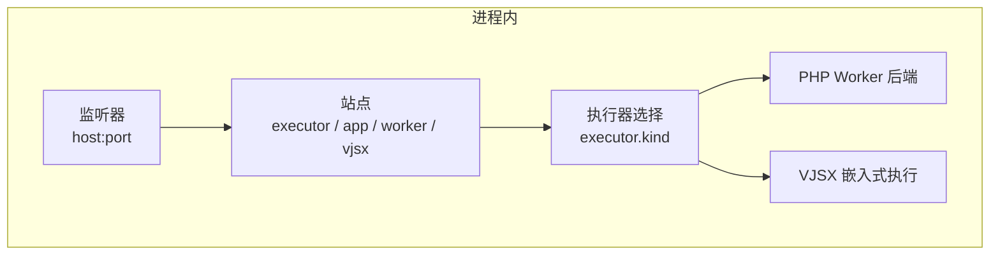
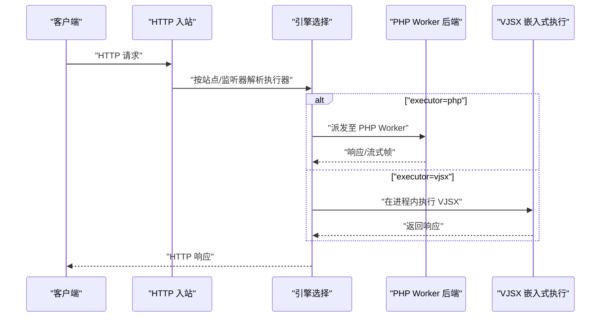
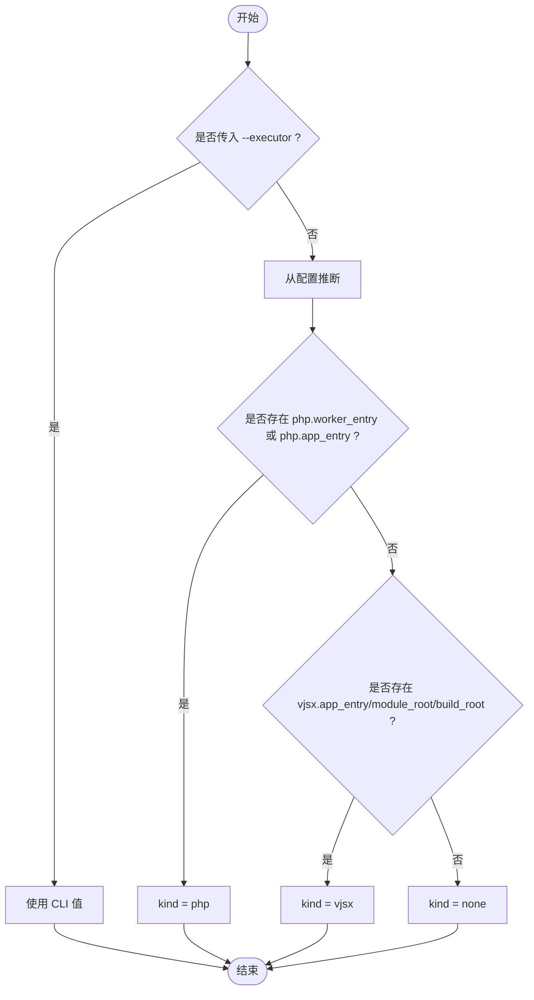
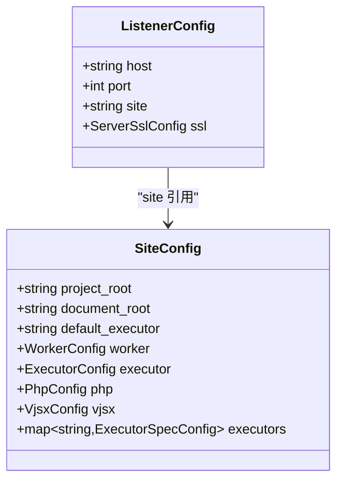
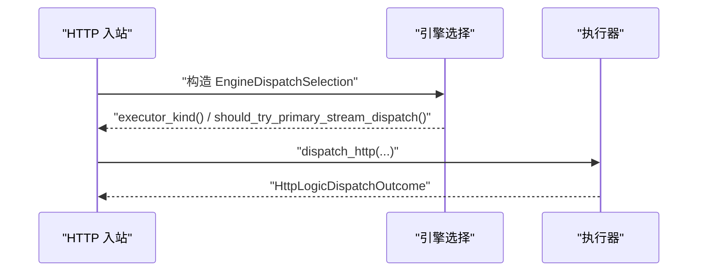
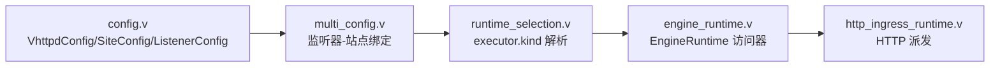

# 多执行器混合部署

<cite>
**本文引用的文件**   
- [README.md](file://README.md)
- [vhttpd.multi.example.toml](file://config/vhttpd.multi.example.toml)
- [EXECUTOR_MODES.md](file://docs/EXECUTOR_MODES.md)
- [INPROC_VJSX_RUNBOOK.md](file://docs/INPROC_VJSX_RUNBOOK.md)
- [runtime_selection.v](file://src/executor/runtime_selection.v)
- [config.v](file://src/config/config.v)
- [multi_config.v](file://src/server_lifecycle/multi_config.v)
- [engine_runtime.v](file://src/engine_runtime.v)
- [http_ingress_runtime.v](file://src/http_ingress_runtime.v)
</cite>

## 目录
1. [简介](#简介)
2. [项目结构](#项目结构)
3. [核心组件](#核心组件)
4. [架构总览](#架构总览)
5. [详细组件分析](#详细组件分析)
6. [依赖关系分析](#依赖关系分析)
7. [性能与容量规划](#性能与容量规划)
8. [故障隔离与降级策略](#故障隔离与降级策略)
9. [负载均衡与高可用](#负载均衡与高可用)
10. [通信、数据共享与状态同步](#通信数据共享与状态同步)
11. [配置示例与迁移指南](#配置示例与迁移指南)
12. [排障指南](#排障指南)
13. [结论](#结论)

## 简介
本指南面向在同一 vhttpd 进程中同时运行多种执行器的场景，重点说明如何组合使用 PHP Worker 与 VJSX 执行器，并给出执行器选择机制（executor.kind）、站点级路由规则、跨执行器通信与数据共享方案，以及微服务、前后端分离、API 网关等典型架构模式下的部署建议。文档还包含负载均衡、故障隔离与降级的实践要点，并提供完整的混合部署配置示例和迁移步骤。

## 项目结构
vhttpd 通过“监听器-站点-执行器”的层次化配置实现多执行器共存：
- 监听器（Listener）绑定 host:port，决定入口协议与 TLS
- 站点（Site）定义应用根路径、执行器类型及运行时参数
- 执行器（Executor）负责将请求调度到具体逻辑实现（php 或 vjsx）

图表来源
- [multi_config.v:58-94](file://src/server_lifecycle/multi_config.v#L58-L94)
- [config.v:340-423](file://src/config/config.v#L340-L423)
- [runtime_selection.v:1-31](file://src/executor/runtime_selection.v#L1-L31)

章节来源
- [README.md:533-603](file://README.md#L533-L603)
- [config.v:340-423](file://src/config/config.v#L340-L423)
- [multi_config.v:58-94](file://src/server_lifecycle/multi_config.v#L58-L94)

## 核心组件
- 执行器选择与解析
  - executor.kind 支持 php 与 vjsx；当未显式设置时，会根据配置自动推断
  - 站点级可覆盖全局 executor 选择
- 多监听器与站点映射
  - 一个进程可监听多个 host:port，每个监听器绑定到一个站点
  - 站点可独立配置 executor、worker、vjsx 等参数
- HTTP 入站分发
  - 根据引擎选择结果调用对应执行器进行请求处理
  - 暴露 executor_kind 用于日志与观测

章节来源
- [runtime_selection.v:1-31](file://src/executor/runtime_selection.v#L1-L31)
- [engine_runtime.v:86-134](file://src/engine_runtime.v#L86-L134)
- [http_ingress_runtime.v:121-139](file://src/http_ingress_runtime.v#L121-L139)
- [README.md:533-603](file://README.md#L533-L603)

## 架构总览
下图展示同一进程内 PHP Worker 与 VJSX 执行器并存时的请求流与资源边界。

图表来源
- [http_ingress_runtime.v:121-139](file://src/http_ingress_runtime.v#L121-L139)
- [engine_runtime.v:86-134](file://src/engine_runtime.v#L86-L134)
- [runtime_selection.v:1-31](file://src/executor/runtime_selection.v#L1-L31)

## 详细组件分析

### 执行器选择机制（executor.kind）
- 优先级顺序
  - CLI 参数 --executor 最高
  - 其次为站点或全局配置中的 executor.kind
  - 若均未设置，则基于配置字段自动推断：存在 php.worker_entry/php.app_entry 则选 php；存在 vjsx.app_entry/module_root/build_root 则选 vjsx；否则 none
- 行为差异
  - php：启用 worker 套接字、自动启动、队列与池管理
  - vjsx：禁用 worker 套接字与自动启动，当前范围支持 HTTP 与 websocket_upstream 分发

图表来源
- [runtime_selection.v:12-30](file://src/executor/runtime_selection.v#L12-L30)

章节来源
- [runtime_selection.v:1-31](file://src/executor/runtime_selection.v#L1-L31)
- [EXECUTOR_MODES.md:1-136](file://docs/EXECUTOR_MODES.md#L1-L136)

### 站点与监听器映射（多监听器模式）
- 一个进程可绑定多个 host:port，每个监听器指向一个站点
- 站点可独立配置 executor、worker、vjsx 等参数
- 若未显式声明 listeners，系统会从 sites 中推导监听器

图表来源
- [config.v:340-423](file://src/config/config.v#L340-L423)
- [multi_config.v:58-94](file://src/server_lifecycle/multi_config.v#L58-L94)

章节来源
- [README.md:533-603](file://README.md#L533-L603)
- [multi_config.v:58-94](file://src/server_lifecycle/multi_config.v#L58-L94)
- [config.v:340-423](file://src/config/config.v#L340-L423)

### HTTP 入站与执行器派发
- 入站层根据引擎选择结果调用对应执行器
- 暴露 executor_kind 便于日志与观测
- 对主池且开启 stream_dispatch 的请求优先尝试流式派发

图表来源
- [http_ingress_runtime.v:121-139](file://src/http_ingress_runtime.v#L121-L139)
- [engine_runtime.v:86-134](file://src/engine_runtime.v#L86-L134)

章节来源
- [http_ingress_runtime.v:121-139](file://src/http_ingress_runtime.v#L121-L139)
- [engine_runtime.v:86-134](file://src/engine_runtime.v#L86-L134)

## 依赖关系分析
- 配置层
  - VhttpdConfig/SiteConfig/ListenerConfig 提供站点与监听器模型
  - ExecutorSpecConfig 聚合 worker/php/vjsx/executor 子配置
- 生命周期层
  - multi_config 将监听器与站点绑定，生成运行时配置
- 执行层
  - runtime_selection 解析 executor.kind 并返回具体执行器实例
  - engine_runtime 提供 kind/env/read_timeout 等访问方法
  - http_ingress 完成最终派发

图表来源
- [config.v:340-423](file://src/config/config.v#L340-L423)
- [multi_config.v:58-94](file://src/server_lifecycle/multi_config.v#L58-L94)
- [runtime_selection.v:1-31](file://src/executor/runtime_selection.v#L1-L31)
- [engine_runtime.v:86-134](file://src/engine_runtime.v#L86-L134)
- [http_ingress_runtime.v:121-139](file://src/http_ingress_runtime.v#L121-L139)

章节来源
- [config.v:340-423](file://src/config/config.v#L340-L423)
- [multi_config.v:58-94](file://src/server_lifecycle/multi_config.v#L58-L94)
- [runtime_selection.v:1-31](file://src/executor/runtime_selection.v#L1-L31)
- [engine_runtime.v:86-134](file://src/engine_runtime.v#L86-L134)
- [http_ingress_runtime.v:121-139](file://src/http_ingress_runtime.v#L121-L139)

## 性能与容量规划
- PHP Worker
  - 合理设置 pool_size、read_timeout_ms、queue_capacity、max_requests、restart_backoff_* 等参数以平衡吞吐与稳定性
- VJSX
  - thread_count 控制嵌入执行并发度；build_root 可用于稳定构建产物以便调试
- 统一观测
  - 通过 executor_kind、pool、backend_mode 等指标区分不同执行器负载

章节来源
- [EXECUTOR_MODES.md:1-136](file://docs/EXECUTOR_MODES.md#L1-L136)
- [INPROC_VJSX_RUNBOOK.md:1-52](file://docs/INPROC_VJSX_RUNBOOK.md#L1-L52)
- [engine_runtime.v:98-134](file://src/engine_runtime.v#L98-L134)

## 故障隔离与降级策略
- 进程内隔离
  - 不同站点使用各自执行器与运行时环境，避免相互影响
- 超时与重试
  - 针对 PHP Worker 的 read_timeout_ms、队列超时等参数进行差异化配置
- 回退路径
  - 在 API 网关层对特定路由做降级（如返回缓存或默认响应），或在站点侧实现快速失败
- 健康检查
  - 结合 admin 接口与事件日志监控执行器状态，异常时触发重启或摘除

章节来源
- [README.md:533-603](file://README.md#L533-L603)
- [EXECUTOR_MODES.md:1-136](file://docs/EXECUTOR_MODES.md#L1-L136)

## 负载均衡与高可用
- 进程外负载均衡
  - 使用反向代理（如 Nginx/Traefik）对多个 vhttpd 实例进行轮询或加权分配
- 会话亲和
  - 对于需要亲和的场景，可在上游按 session_id 或用户标识做一致性哈希
- 滚动升级
  - 配合编排平台对实例分批重启，确保流量平滑切换

[本节为通用指导，不直接分析具体文件]

## 通信、数据共享与状态同步
- 进程内通信
  - VJSX 与 PHP 在同一进程的不同执行器中运行，彼此无共享内存；可通过外部存储（数据库、缓存、消息总线）交换数据
- 外部状态
  - 推荐将业务状态置于外部持久化或分布式存储，保证多执行器一致性与可恢复性
- 事件驱动
  - 利用上游/下游通道（如 WebSocket upstream、MCP、OpenAI 流式通道）进行异步通知与事件分发

[本节为通用指导，不直接分析具体文件]

## 配置示例与迁移指南

### 完整混合部署配置示例
- 单进程多监听器，分别承载 PHP 与 VJSX 站点
- 关键要点
  - 使用 [sites.<id>] 定义站点，并在站点内指定 executor
  - 通过 [paths] 复用路径别名
  - 为 PHP 站点配置 worker.entry、app、extensions
  - 为 VJSX 站点配置 app、module_root、build_root、thread_count

参考示例文件
- [config/vhttpd.multi.example.toml:1-73](file://config/vhttpd.multi.example.toml#L1-L73)

章节来源
- [vhttpd.multi.example.toml:1-73](file://config/vhttpd.multi.example.toml#L1-L73)
- [README.md:533-603](file://README.md#L533-L603)

### 迁移指南（从单一执行器到混合部署）
- 步骤
  1) 引入多监听器与站点结构，将现有站点迁移到 [sites.<id>]
  2) 在站点级别设置 executor.kind（php 或 vjsx）
  3) 为 PHP 站点补充 worker 与 php 相关配置
  4) 为 VJSX 站点补充 vjsx 相关配置
  5) 验证各站点路由与执行器选择是否符合预期
- 注意事项
  - 保持公共配置（server/files/runtime/admin/assets）在顶层，站点仅覆盖差异部分
  - 使用 paths 别名减少硬编码路径
  - 通过 admin 与事件日志确认执行器选择与后端状态

章节来源
- [README.md:533-603](file://README.md#L533-L603)
- [EXECUTOR_MODES.md:1-136](file://docs/EXECUTOR_MODES.md#L1-L136)

## 排障指南
- 常见问题
  - 执行器未生效：检查 CLI 参数与站点 executor.kind 优先级
  - PHP Worker 无法启动：确认 worker_entry/app_entry/extensions 路径有效
  - VJSX 构建失败：检查 build_root 权限与 module_root 路径
- 定位手段
  - 查看事件日志与 admin 接口，关注 executor_kind、pool、backend_mode
  - 对比站点配置与全局配置的覆盖关系

章节来源
- [README.md:533-603](file://README.md#L533-L603)
- [EXECUTOR_MODES.md:1-136](file://docs/EXECUTOR_MODES.md#L1-L136)
- [INPROC_VJSX_RUNBOOK.md:1-52](file://docs/INPROC_VJSX_RUNBOOK.md#L1-L52)

## 结论
通过“监听器-站点-执行器”的层次化设计，vhttpd 能够在同一进程中灵活组合 PHP Worker 与 VJSX 执行器，满足复杂业务场景下的多语言、多运行时需求。结合外部负载均衡、健康检查与降级策略，可实现高可用与弹性伸缩。建议在迁移过程中逐步拆分站点、明确执行器边界，并通过外部存储与事件通道实现跨执行器数据共享与状态同步。