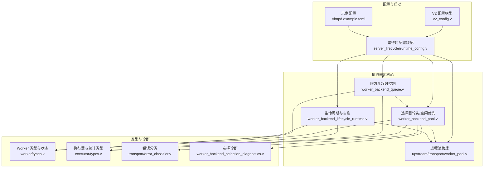
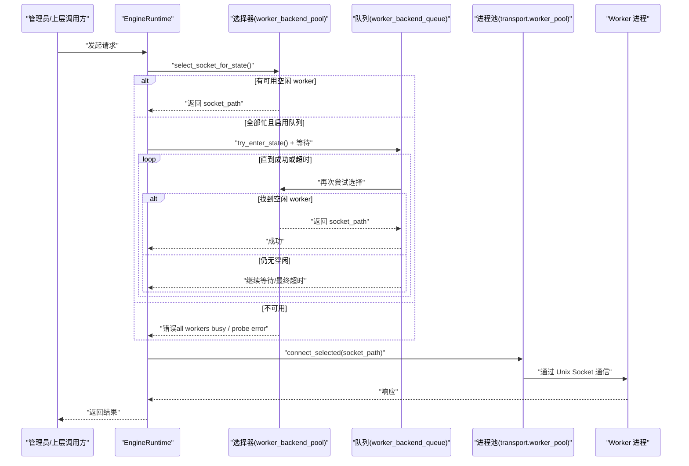
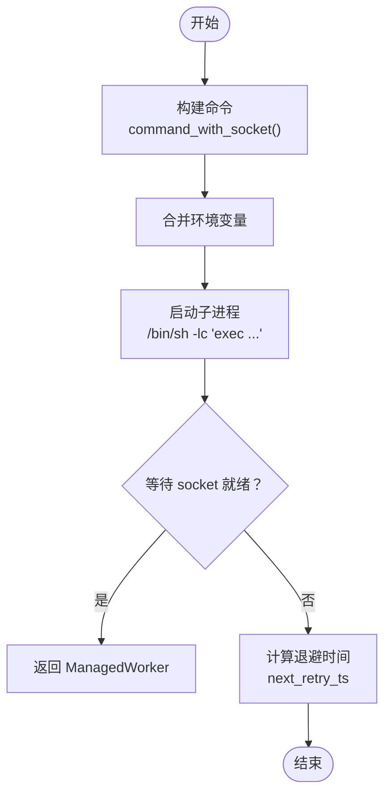
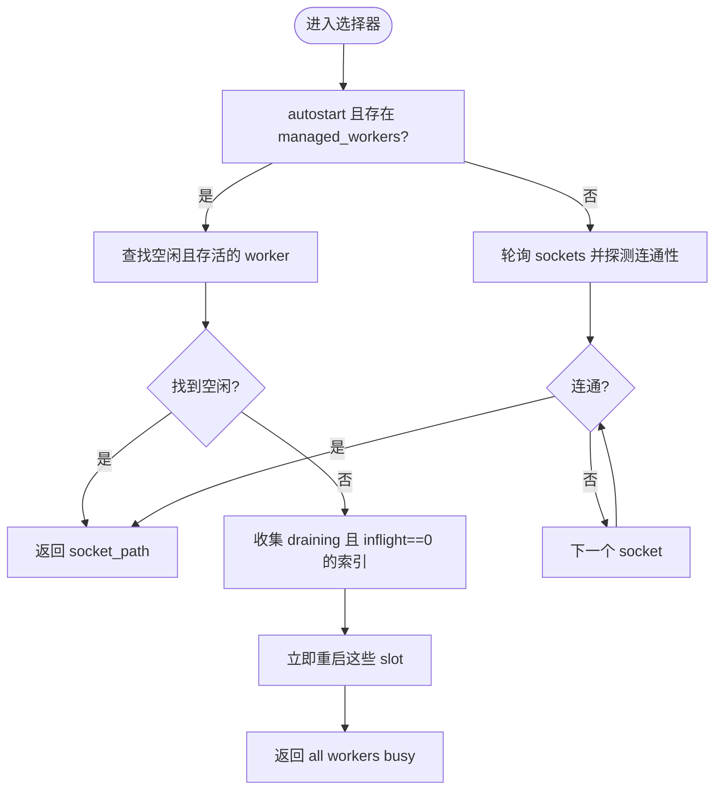
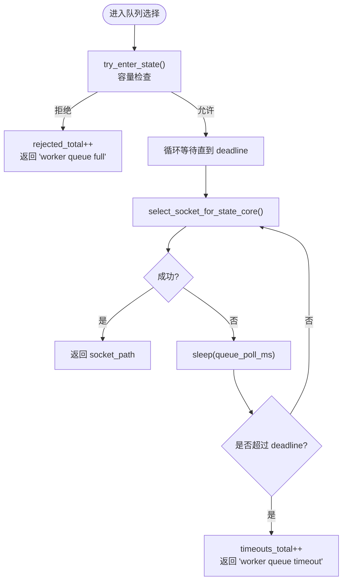
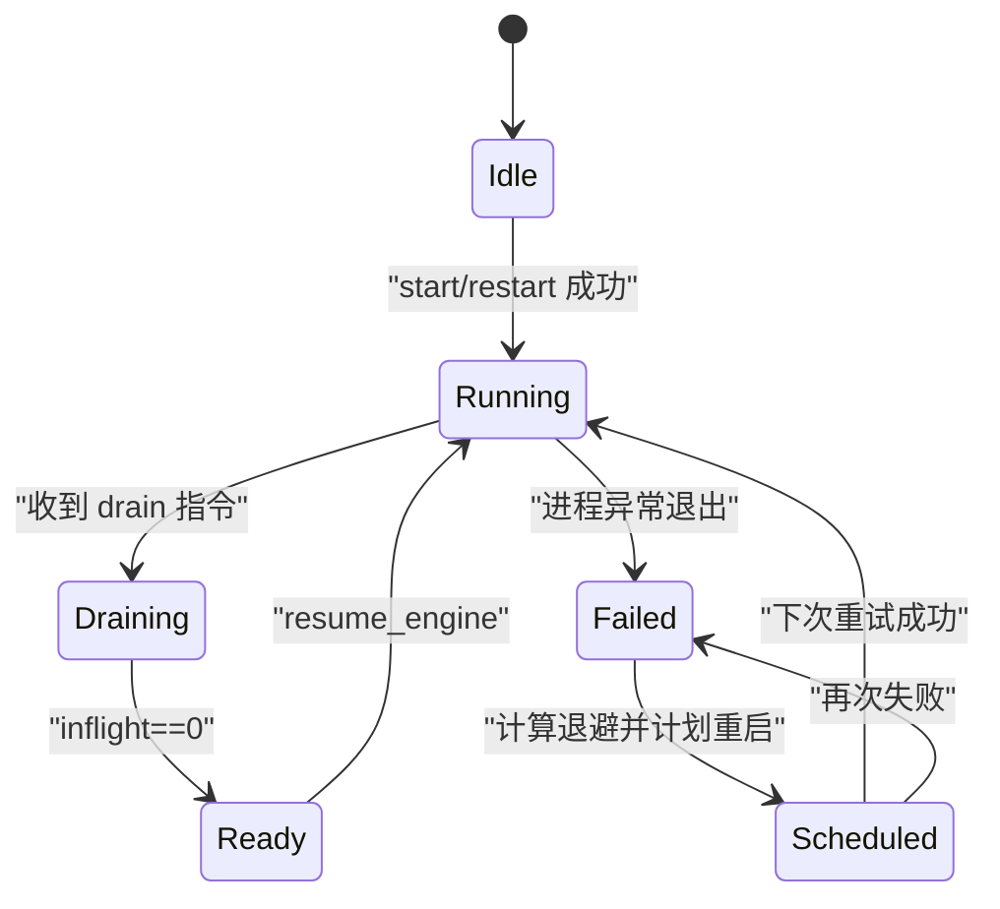
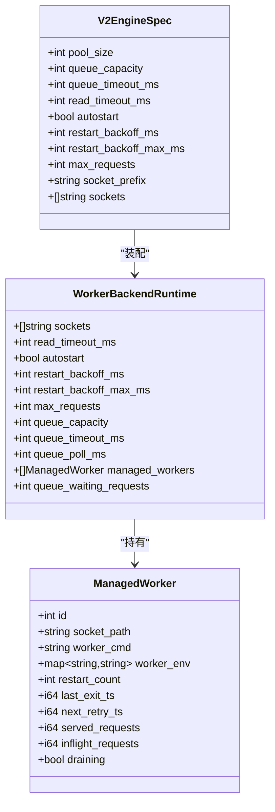

# 执行器池管理

<cite>
**本文引用的文件**   
- [worker_pool.v](file://src/upstream/transport/worker_pool.v)
- [worker_backend_pool.v](file://src/worker_backend_pool.v)
- [worker_backend_queue.v](file://src/worker_backend_queue.v)
- [worker_backend_lifecycle_runtime.v](file://src/worker_backend_lifecycle_runtime.v)
- [v2_config.v](file://src/config/v2_config.v)
- [types.v（worker）](file://src/worker/types.v)
- [types.v（executor）](file://src/executor/types.v)
- [error_classifier.v](file://src/upstream/transport/error_classifier.v)
- [runtime_config.v（server_lifecycle）](file://src/server_lifecycle/runtime_config.v)
- [vhttpd.example.toml](file://config/vhttpd.example.toml)
- [config_acceptance_test.sh](file://tests/e2e/config_acceptance_test.sh)
- [worker_backend_runtime_test.v](file://src/worker_backend_runtime_test.v)
</cite>

## 目录
1. [简介](#简介)
2. [项目结构](#项目结构)
3. [核心组件](#核心组件)
4. [架构总览](#架构总览)
5. [详细组件分析](#详细组件分析)
6. [依赖关系分析](#依赖关系分析)
7. [性能与容量规划](#性能与容量规划)
8. [监控、告警与故障转移](#监控告警与故障转移)
9. [配置项详解](#配置项详解)
10. [排障指南](#排障指南)
11. [结论](#结论)

## 简介
本文件面向运维与平台工程师，系统性说明 vhttpd 的执行器池（Worker 进程池）的架构、工作原理与配置方法。重点覆盖：
- Worker 进程的创建、选择、健康检查、自动重启与优雅退出
- 池化关键参数：pool_size、queue_capacity、queue_timeout_ms、backend_mode
- 负载均衡策略与健康检查机制
- 监控指标、告警规则与故障转移策略
- 性能调优与容量规划建议，以及不同负载场景下的优化示例

## 项目结构
执行器池相关代码主要分布在以下模块：
- 传输层进程管理：src/upstream/transport/worker_pool.v
- 引擎运行时选择与队列：src/worker_backend_pool.v、src/worker_backend_queue.v
- 生命周期与自愈：src/worker_backend_lifecycle_runtime.v
- 配置模型与加载：src/config/v2_config.v、src/server_lifecycle/runtime_config.v
- 类型定义与统计：src/worker/types.v、src/executor/types.v
- 错误分类与诊断：src/upstream/transport/error_classifier.v、src/worker_backend_selection_diagnostics.v
- 示例与测试：config/vhttpd.example.toml、tests/e2e/config_acceptance_test.sh、src/worker_backend_runtime_test.v

图表来源
- [v2_config.v:1-318](file://src/config/v2_config.v#L1-L318)
- [runtime_config.v（server_lifecycle）:89-112](file://src/server_lifecycle/runtime_config.v#L89-L112)
- [worker_pool.v:1-219](file://src/upstream/transport/worker_pool.v#L1-L219)
- [worker_backend_pool.v:1-137](file://src/worker_backend_pool.v#L1-L137)
- [worker_backend_queue.v:1-130](file://src/worker_backend_queue.v#L1-L130)
- [worker_backend_lifecycle_runtime.v:1-157](file://src/worker_backend_lifecycle_runtime.v#L1-L157)
- [types.v（worker）:1-61](file://src/worker/types.v#L1-L61)
- [types.v（executor）:1-449](file://src/executor/types.v#L1-L449)
- [error_classifier.v:1-18](file://src/upstream/transport/error_classifier.v#L1-L18)

章节来源
- [v2_config.v:1-318](file://src/config/v2_config.v#L1-L318)
- [runtime_config.v（server_lifecycle）:89-112](file://src/server_lifecycle/runtime_config.v#L89-L112)
- [worker_pool.v:1-219](file://src/upstream/transport/worker_pool.v#L1-L219)
- [worker_backend_pool.v:1-137](file://src/worker_backend_pool.v#L1-L137)
- [worker_backend_queue.v:1-130](file://src/worker_backend_queue.v#L1-L130)
- [worker_backend_lifecycle_runtime.v:1-157](file://src/worker_backend_lifecycle_runtime.v#L1-L157)
- [types.v（worker）:1-61](file://src/worker/types.v#L1-L61)
- [types.v（executor）:1-449](file://src/executor/types.v#L1-L449)
- [error_classifier.v:1-18](file://src/upstream/transport/error_classifier.v#L1-L18)

## 核心组件
- 进程池管理（ManagedWorker/ManagedWorkerPool）
  - 负责子进程生命周期、命令拼装、环境变量合并、进程组信号、等待 socket 就绪等
- 选择器（Select Socket）
  - 在 autostart 模式下优先选择空闲 worker；否则回退到轮询并探测 socket 连通性
- 队列与超时（Queue & Timeout）
  - 当所有 worker 忙时，按 queue_capacity 和 queue_timeout_ms 进行排队重试，失败则返回明确错误
- 生命周期与自愈（Lifecycle & Self-healing）
  - 检测进程存活、指数退避重启、drain 后恢复、请求计数与 in-flight 跟踪
- 错误分类与诊断（Error Classification & Diagnostics）
  - 将内部错误映射为 HTTP 语义（503/504），并提供每个 slot 的诊断信息

章节来源
- [worker_pool.v:1-219](file://src/upstream/transport/worker_pool.v#L1-L219)
- [worker_backend_pool.v:1-137](file://src/worker_backend_pool.v#L1-L137)
- [worker_backend_queue.v:1-130](file://src/worker_backend_queue.v#L1-L130)
- [worker_backend_lifecycle_runtime.v:1-157](file://src/worker_backend_lifecycle_runtime.v#L1-L157)
- [error_classifier.v:1-18](file://src/upstream/transport/error_classifier.v#L1-L18)

## 架构总览
下图展示了从配置到运行时的端到端流程：配置解析 → 池初始化 → 请求选择 → 队列等待 → 连接建立 → 执行与回收。

图表来源
- [worker_backend_pool.v:1-137](file://src/worker_backend_pool.v#L1-L137)
- [worker_backend_queue.v:1-130](file://src/worker_backend_queue.v#L1-L130)
- [worker_pool.v:1-219](file://src/upstream/transport/worker_pool.v#L1-L219)

## 详细组件分析

### 进程池管理（ManagedWorker/ManagedWorkerPool）
- 功能要点
  - 构建 worker 命令：支持 {socket} 占位符与 --socket 注入；pool_size > 1 时禁止显式 --socket
  - 启动子进程：使用 /bin/sh 包装，设置工作目录与环境变量，加入进程组
  - 等待 socket 就绪：轮询 connect_stream，直至成功或超时
  - 停止与清理：先 SIGTERM 再 SIGKILL，确保进程组退出
  - 重启退避：基于 restart_count 的指数退避，限制最大延迟
- 复杂度与性能
  - 启动/停止为 O(1)，等待 socket 为 O(N) 次系统调用（N 取决于超时与间隔）
  - 进程组信号可快速终止后代进程，避免僵尸进程
- 错误处理
  - 空命令或缺少 socket 直接报错
  - 启动失败记录 next_retry_ts，避免频繁重试风暴

图表来源
- [worker_pool.v:76-136](file://src/upstream/transport/worker_pool.v#L76-L136)
- [worker_pool.v:204-218](file://src/upstream/transport/worker_pool.v#L204-L218)

章节来源
- [worker_pool.v:1-219](file://src/upstream/transport/worker_pool.v#L1-L219)

### 选择器（负载均衡与健康检查）
- 策略
  - autostart=true 且存在已管理 worker：优先选择 idle 且 alive 的 worker（lease_idle_worker_socket_for_state）
  - 否则：轮询 sockets 列表并通过 connect_stream 探测可用性
  - 若发现 draining 且 inflight=0 的 worker，触发立即重启以加速恢复
- 健康检查
  - 每次选择前会检查进程存活、inflight_requests、draining 标志
  - 探测失败会记录诊断信息并上报事件
- 并发安全
  - 对 sockets 与 managed_workers 的访问均加锁保护

图表来源
- [worker_backend_pool.v:16-124](file://src/worker_backend_pool.v#L16-L124)

章节来源
- [worker_backend_pool.v:1-137](file://src/worker_backend_pool.v#L1-L137)
- [worker_backend_selection_diagnostics.v:1-64](file://src/worker_backend_selection_diagnostics.v#L1-L64)

### 队列与超时控制（Queue & Timeout）
- 行为
  - 当选择器返回“all workers busy”时，进入队列模式
  - try_enter_state 校验 queue_capacity 与当前 waiting 数，超限则拒绝
  - 在 queue_timeout_ms 内周期性重试选择（poll 间隔由 queue_poll_ms 控制）
  - 成功则返回 socket；失败则返回 timeout 错误
- 指标
  - stat_queue_waits_total、stat_queue_rejected_total、stat_queue_timeouts_total
- 适用场景
  - 短时突发流量削峰，避免瞬时 503

图表来源
- [worker_backend_queue.v:11-119](file://src/worker_backend_queue.v#L11-L119)

章节来源
- [worker_backend_queue.v:1-130](file://src/worker_backend_queue.v#L1-L130)

### 生命周期与自愈（Lifecycle & Self-healing）
- 保活
  - ensure_workers_alive_for_state 遍历 managed_workers，必要时启动新进程
  - 启动失败记录 restart_count、last_exit_ts、next_retry_ts，并上报 worker.restart_scheduled
- 重启
  - restart_worker_slot_now_for_state 主动杀死旧进程并重建，成功后重置计数与状态
- 优雅退出与恢复
  - drain 标记后，当 inflight_requests==0 即视为 ready，可被重新调度
- 指标
  - served_requests、inflight_requests、draining 标志用于选择器与统计

图表来源
- [worker_backend_lifecycle_runtime.v:8-134](file://src/worker_backend_lifecycle_runtime.v#L8-L134)

章节来源
- [worker_backend_lifecycle_runtime.v:1-157](file://src/worker_backend_lifecycle_runtime.v#L1-L157)

### 错误分类与诊断
- 错误分类
  - all workers busy → 503 worker_pool_exhausted
  - worker queue full → 503 worker_queue_full
  - worker queue timeout → 504 worker_queue_timeout
  - 其他超时/错误 → 504/502
- 诊断
  - 输出每个 socket 的 proc_alive、draining、inflight_requests、probe_error，便于定位问题

章节来源
- [error_classifier.v:1-18](file://src/upstream/transport/error_classifier.v#L1-L18)
- [worker_backend_selection_diagnostics.v:1-64](file://src/worker_backend_selection_diagnostics.v#L1-L64)

## 依赖关系分析
- 配置到运行时
  - V2 配置模型提供 engine 级别的 pool_size、queue_capacity、queue_timeout_ms、read_timeout_ms、restart_backoff_*、max_requests、autostart 等字段
  - server_lifecycle/runtime_config.v 将这些值装配到 WorkerState 中
- 运行时到组件
  - EngineRuntime 组合选择器、队列、生命周期模块
  - 选择器依赖 transport.ManagedWorker 与 worker.WorkerState
  - 队列维护等待计数与指标
  - 生命周期维护进程与状态，并与选择器协作

图表来源
- [v2_config.v:120-155](file://src/config/v2_config.v#L120-L155)
- [types.v（worker）:21-39](file://src/worker/types.v#L21-L39)
- [worker_pool.v:37-60](file://src/upstream/transport/worker_pool.v#L37-L60)

章节来源
- [v2_config.v:1-318](file://src/config/v2_config.v#L1-L318)
- [types.v（worker）:1-61](file://src/worker/types.v#L1-L61)
- [worker_pool.v:1-219](file://src/upstream/transport/worker_pool.v#L1-L219)

## 性能与容量规划
- 关键指标
  - 并发度 ≈ pool_size × 单进程并发能力
  - 吞吐受限于 queue_capacity 与 queue_timeout_ms 的组合
  - 平均响应时间受 read_timeout_ms 与后端处理能力影响
- 容量规划建议
  - 基准压测确定单进程稳定吞吐与 CPU/内存占用
  - 根据目标 P95/P99 延迟与吞吐，估算所需 pool_size
  - 将 queue_capacity 设置为峰值突增的缓冲（例如 1–3 倍瞬时峰值），queue_timeout_ms 控制在可接受的用户感知阈值内
- 调优方向
  - 降低 queue_poll_ms 可减少排队抖动但增加系统调用开销
  - 合理设置 restart_backoff_ms 与 max，避免雪崩
  - 针对长尾任务，适当增大 read_timeout_ms 并配合上游限流

[本节为通用指导，不直接分析具体文件]

## 监控、告警与故障转移
- 监控指标
  - 队列：stat_queue_waits_total、stat_queue_rejected_total、stat_queue_timeouts_total
  - 进程：served_requests、inflight_requests、draining、restart_count、next_retry_ts
  - 选择诊断：proc_alive、probe_error、socket_path
- 告警规则建议
  - worker_queue_rejected_total 增长率突增 → 扩容或限流
  - worker_queue_timeouts_total 持续上升 → 提升 queue_capacity/timeout 或扩容
  - process_not_alive 出现 → 检查 worker 日志与资源
  - worker_draining 长期未归零 → 排查慢请求与优雅退出逻辑
- 故障转移策略
  - 自动重启：指数退避，避免风暴
  - 优雅下线：drain 后等待 inflight 清零，再 resume
  - 错误降级：503/504 明确区分池耗尽与队列超时，便于客户端重试策略差异化

章节来源
- [types.v（executor）:103-155](file://src/executor/types.v#L103-L155)
- [worker_backend_selection_diagnostics.v:1-64](file://src/worker_backend_selection_diagnostics.v#L1-L64)
- [worker_backend_lifecycle_runtime.v:1-157](file://src/worker_backend_lifecycle_runtime.v#L1-L157)

## 配置项详解
- pool_size（池大小）
  - 含义：worker 进程数量（对应 sockets 数量）
  - 位置：V2EngineSpec.pool_size 或 legacy [worker].pool_size
  - 参考：示例与文档多处使用该字段
- queue_capacity（队列容量）
  - 含义：允许排队等待的请求上限
  - 位置：V2EngineSpec.queue_capacity 或 legacy [worker].queue_capacity
  - 行为：达到上限时直接拒绝（503）
- queue_timeout_ms（队列超时时间）
  - 含义：排队等待的最长时间
  - 位置：V2EngineSpec.queue_timeout_ms 或 legacy [worker].queue_timeout_ms
  - 行为：超时返回 504
- backend_mode（后端模式）
  - 含义：required/disabled，决定是否需要外部 worker 后端
  - 位置：executor.WorkerBackendMode
  - 作用：用于替换验证与运行时决策
- 其他重要选项
  - read_timeout_ms：与 worker 读超时相关
  - restart_backoff_ms / restart_backoff_max_ms：重启退避基线与上限
  - max_requests：单进程最大请求数（用于平滑重启）
  - autostart：是否自动拉起与管理 worker 进程
  - socket_prefix / sockets：Unix Socket 路径生成或指定

章节来源
- [v2_config.v:120-155](file://src/config/v2_config.v#L120-L155)
- [types.v（executor）:72-75](file://src/executor/types.v#L72-L75)
- [vhttpd.example.toml:19-26](file://config/vhttpd.example.toml#L19-L26)
- [runtime_config.v（server_lifecycle）:89-112](file://src/server_lifecycle/runtime_config.v#L89-L112)
- [config_acceptance_test.sh:2229-2295](file://tests/e2e/config_acceptance_test.sh#L2229-L2295)

## 排障指南
- 常见问题
  - “all workers busy”：检查 pool_size 是否过小、是否存在慢请求导致 in-flight 堆积
  - “worker queue full”：提高 queue_capacity 或引入上游限流
  - “worker queue timeout”：评估 queue_timeout_ms 是否过短，或扩容/优化后端
  - “process_not_alive”：查看 /tmp/vhttpd_php_worker_*.log 或 php-cgi 日志
  - “worker_draining”：确认 drain 后是否有残留请求，必要时延长观察窗口
- 诊断步骤
  - 使用选择诊断输出定位具体 socket 的状态与探针错误
  - 结合事件日志与统计指标判断是否为瞬时尖峰或持续过载
  - 通过 admin 接口获取 runtime snapshot 与 worker 快照

章节来源
- [worker_backend_selection_diagnostics.v:1-64](file://src/worker_backend_selection_diagnostics.v#L1-L64)
- [worker_pool.v:108-114](file://src/upstream/transport/worker_pool.v#L108-L114)
- [worker_backend_runtime_test.v:111-211](file://src/worker_backend_runtime_test.v#L111-L211)

## 结论
vhttpd 的执行器池通过“选择器 + 队列 + 生命周期自愈”的协同设计，实现了高可用的外部分发与弹性伸缩能力。正确配置 pool_size、queue_capacity、queue_timeout_ms 与 backend_mode，并结合监控与告警，可在不同负载场景下获得稳定的吞吐与低延迟表现。建议在上线前完成基准压测与容量规划，并在生产环境持续观测队列与进程健康指标，及时调整策略。