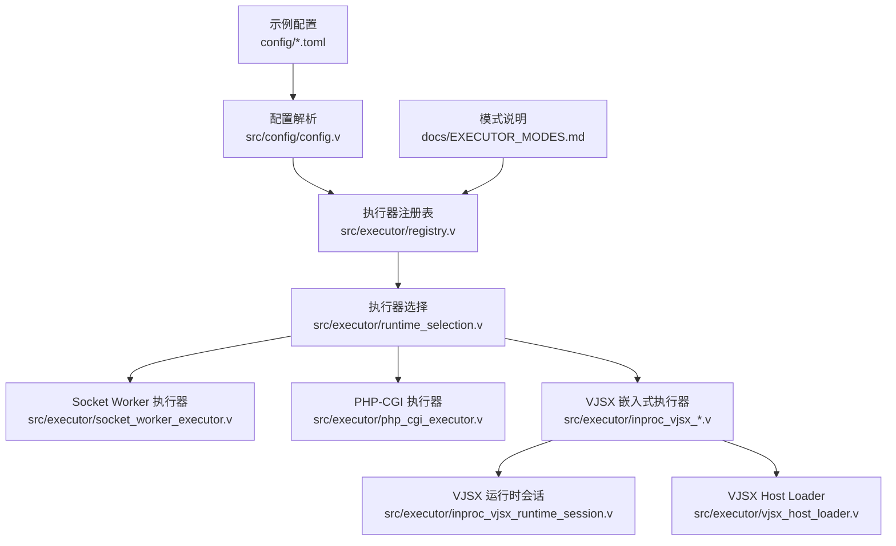
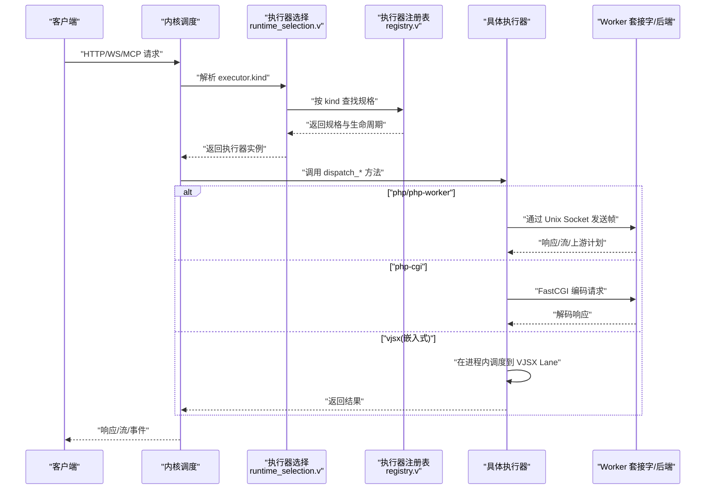
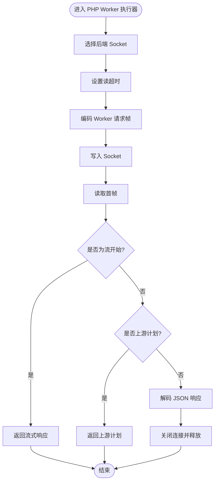
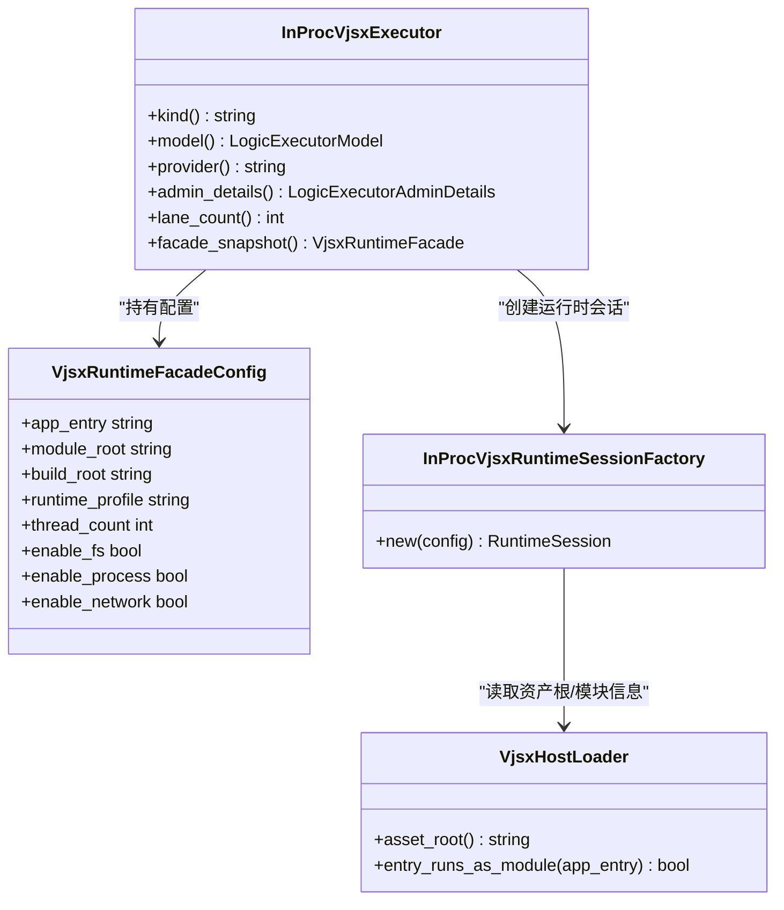
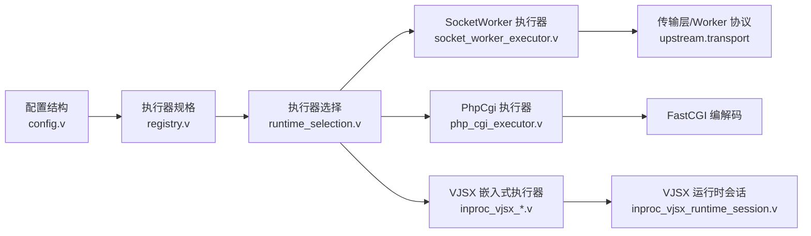

# 执行器配置

<cite>
**本文引用的文件**
- [src/executor/types.v](file://src/executor/types.v)
- [src/executor/registry.v](file://src/executor/registry.v)
- [src/executor/runtime_selection.v](file://src/executor/runtime_selection.v)
- [src/executor/socket_worker_executor.v](file://src/executor/socket_worker_executor.v)
- [src/executor/php_cgi_executor.v](file://src/executor/php_cgi_executor.v)
- [src/executor/inproc_vjsx_lifecycle.v](file://src/executor/inproc_vjsx_lifecycle.v)
- [src/executor/inproc_vjsx_types.v](file://src/executor/inproc_vjsx_types.v)
- [src/executor/inproc_vjsx_runtime_session.v](file://src/executor/inproc_vjsx_runtime_session.v)
- [src/executor/vjsx_host_loader.v](file://src/executor/vjsx_host_loader.v)
- [src/config/config.v](file://src/config/config.v)
- [config/vhttpd.example.toml](file://config/vhttpd.example.toml)
- [config/vhttpd.vjsx.example.toml](file://config/vhttpd.vjsx.example.toml)
- [config/vhttpd.multi.example.toml](file://config/vhttpd.multi.example.toml)
- [docs/EXECUTOR_MODES.md](file://docs/EXECUTOR_MODES.md)
</cite>

## 目录
1. [简介](#简介)
2. [项目结构](#项目结构)
3. [核心组件](#核心组件)
4. [架构总览](#架构总览)
5. [详细组件分析](#详细组件分析)
6. [依赖关系分析](#依赖关系分析)
7. [性能与高级配置](#性能与高级配置)
8. [故障排查指南](#故障排查指南)
9. [结论](#结论)
10. [附录：多执行器混合部署示例](#附录多执行器混合部署示例)

## 简介
本文件系统性说明 vhttpd 的执行器配置模型，覆盖 PHP Worker 执行器、VJSX 嵌入式执行器等内置执行器的选择机制、配置项、运行时行为与高级选项。重点包括：
- executor.kind 的选择与推断规则
- PHP 执行器的二进制路径、Worker 入口、应用入口、扩展加载等配置
- VJSX 执行器的 TypeScript/JavaScript 环境配置（模块根、构建根、运行时 profile、线程数等）
- 执行器池管理、连接超时、重启策略等高级配置
- 多执行器混合部署的配置要点与示例

## 项目结构
执行器相关代码主要位于 src/executor 与 src/config 下，示例配置位于 config 目录，模式说明文档位于 docs/EXECUTOR_MODES.md。

图表来源
- [src/config/config.v:52-86](file://src/config/config.v#L52-L86)
- [src/executor/registry.v:65-127](file://src/executor/registry.v#L65-L127)
- [src/executor/runtime_selection.v:12-31](file://src/executor/runtime_selection.v#L12-L31)
- [src/executor/socket_worker_executor.v:1-157](file://src/executor/socket_worker_executor.v#L1-L157)
- [src/executor/php_cgi_executor.v:1-118](file://src/executor/php_cgi_executor.v#L1-L118)
- [src/executor/inproc_vjsx_lifecycle.v:1-155](file://src/executor/inproc_vjsx_lifecycle.v#L1-L155)
- [src/executor/inproc_vjsx_runtime_session.v:1-46](file://src/executor/inproc_vjsx_runtime_session.v#L1-L46)
- [src/executor/vjsx_host_loader.v:1-41](file://src/executor/vjsx_host_loader.v#L1-L41)
- [config/vhttpd.example.toml:1-67](file://config/vhttpd.example.toml#L1-L67)
- [config/vhttpd.vjsx.example.toml:1-37](file://config/vhttpd.vjsx.example.toml#L1-L37)
- [docs/EXECUTOR_MODES.md:1-136](file://docs/EXECUTOR_MODES.md#L1-L136)

章节来源
- [src/config/config.v:52-86](file://src/config/config.v#L52-L86)
- [src/executor/registry.v:65-127](file://src/executor/registry.v#L65-L127)
- [src/executor/runtime_selection.v:12-31](file://src/executor/runtime_selection.v#L12-L31)
- [docs/EXECUTOR_MODES.md:1-136](file://docs/EXECUTOR_MODES.md#L1-L136)

## 核心组件
- 执行器类型与模型
  - LogicExecutorModel：worker 或 embedded
  - WorkerBackendMode：required 或 disabled
  - 这些枚举用于描述执行器的工作方式与是否依赖外部 worker 后端
- 内置执行器规格
  - none/noop：禁用逻辑执行
  - php / php-worker：基于 Unix Socket 的 PHP Worker 执行器
  - php-cgi：通过 FastCGI 与 PHP CGI 进程通信
  - vjsx：内嵌 VJSX 运行时的嵌入式执行器
- 执行器选择流程
  - 优先从 CLI 参数 --executor 读取 kind
  - 若未提供，则根据配置自动推断（存在 php.* 或 vjsx.* 字段）
  - 根据 kind 查找内置规格并构造对应执行器实例

章节来源
- [src/executor/types.v:67-75](file://src/executor/types.v#L67-L75)
- [src/executor/registry.v:65-127](file://src/executor/registry.v#L65-L127)
- [src/executor/runtime_selection.v:12-31](file://src/executor/runtime_selection.v#L12-L31)

## 架构总览
下图展示请求进入后如何根据执行器类型进行分发与处理。

图表来源
- [src/executor/runtime_selection.v:23-31](file://src/executor/runtime_selection.v#L23-L31)
- [src/executor/registry.v:263-286](file://src/executor/registry.v#L263-L286)
- [src/executor/socket_worker_executor.v:43-95](file://src/executor/socket_worker_executor.v#L43-L95)
- [src/executor/php_cgi_executor.v:42-82](file://src/executor/php_cgi_executor.v#L42-L82)
- [src/executor/inproc_vjsx_lifecycle.v:89-118](file://src/executor/inproc_vjsx_lifecycle.v#L89-L118)

## 详细组件分析

### PHP Worker 执行器（socket_worker）
- 工作模式
  - 使用 Unix Socket 与外部 PHP Worker 进程通信
  - 支持 HTTP 响应、流式响应、上游计划转发
  - 支持 WebSocket 会话打开、MCP、WebSocket 事件等（由后端实现）
- 关键配置项
  - [executor].kind = "php"
  - [php].bin：PHP 可执行文件路径（默认 php）
  - [php].worker_entry：Worker 引导脚本（必填）
  - [php].app_entry：应用入口，注入环境变量 VHTTPD_APP
  - [php].extensions[]：扩展列表，生成 -d extension=... 参数
  - [php].args[]：额外 CLI 参数
  - [worker]：pool_size、socket_prefix、read_timeout_ms、max_requests、restart_backoff_ms、restart_backoff_max_ms、autostart 等
- 启动命令生成
  - 当 [worker].cmd 为空时，系统根据 [php] 自动生成启动命令
  - 启动前校验 worker_entry、app_entry、extensions 是否存在
- 运行时行为
  - 设置读超时；将请求编码为 Worker 帧写入 socket
  - 首帧可能为响应、流开始或上游计划，后续按协议处理

图表来源
- [src/executor/socket_worker_executor.v:43-95](file://src/executor/socket_worker_executor.v#L43-L95)
- [src/executor/registry.v:325-360](file://src/executor/registry.v#L325-L360)

章节来源
- [src/executor/socket_worker_executor.v:1-157](file://src/executor/socket_worker_executor.v#L1-L157)
- [src/executor/registry.v:300-360](file://src/executor/registry.v#L300-L360)
- [config/vhttpd.example.toml:19-36](file://config/vhttpd.example.toml#L19-L36)
- [docs/EXECUTOR_MODES.md:25-81](file://docs/EXECUTOR_MODES.md#L25-L81)

### PHP-CGI 执行器（php-cgi）
- 工作模式
  - 通过 FastCGI 与 php-cgi 进程通信
  - 仅支持 HTTP 响应；不支持 WebSocket、MCP、流式
- 关键配置项
  - [executor].kind = "php-cgi"
  - [php].bin：若为空或为 php，则自动替换为 php-cgi
  - [php].extensions[]、[php].args[]：同上
- 启动命令生成
  - 使用 -b {socket} 绑定监听地址
- 运行时行为
  - 将请求编码为 FastCGI 帧，读取并解码响应

章节来源
- [src/executor/php_cgi_executor.v:1-118](file://src/executor/php_cgi_executor.v#L1-L118)
- [src/executor/registry.v:362-386](file://src/executor/registry.v#L362-L386)

### VJSX 嵌入式执行器（vjsx）
- 工作模式
  - 在 vhttpd 进程内嵌入 VJSX 运行时，无需外部 worker
  - 支持 HTTP 与 websocket_upstream 调度；默认关闭流/WS 会话 worker 模式与 MCP
- 关键配置项
  - [executor].kind = "vjsx"
  - [vjsx].app_entry：TS/JS 入口文件
  - [vjsx].module_root：模块解析根
  - [vjsx].build_root：可选构建产物根（默认 /tmp/vhttpd_vjsx）
  - [vjsx].runtime_profile：script 或 node
  - [vjsx].thread_count：并发 Lane 数量
  - [vjsx].signature_root/include/exclude：签名与热重载相关
  - [vjsx].enable_fs/process/network：能力开关
- 运行时会话
  - 根据 runtime_profile 创建 script 或 node 运行时会话
  - 传入 fs_roots、process_args、asset_root 等上下文
- 生命周期
  - 初始化 lane 与 host，维护状态、会话存储、任务队列等
  - admin_details 暴露运行时 profile、lane_count、module_root、build_root、能力开关等

图表来源
- [src/executor/inproc_vjsx_lifecycle.v:16-87](file://src/executor/inproc_vjsx_lifecycle.v#L16-L87)
- [src/executor/inproc_vjsx_types.v:7-24](file://src/executor/inproc_vjsx_types.v#L7-L24)
- [src/executor/inproc_vjsx_runtime_session.v:11-36](file://src/executor/inproc_vjsx_runtime_session.v#L11-L36)
- [src/executor/vjsx_host_loader.v:13-29](file://src/executor/vjsx_host_loader.v#L13-L29)

章节来源
- [src/executor/inproc_vjsx_lifecycle.v:1-155](file://src/executor/inproc_vjsx_lifecycle.v#L1-L155)
- [src/executor/inproc_vjsx_types.v:1-42](file://src/executor/inproc_vjsx_types.v#L1-L42)
- [src/executor/inproc_vjsx_runtime_session.v:1-46](file://src/executor/inproc_vjsx_runtime_session.v#L1-L46)
- [src/executor/vjsx_host_loader.v:1-41](file://src/executor/vjsx_host_loader.v#L1-L41)
- [config/vhttpd.vjsx.example.toml:18-25](file://config/vhttpd.vjsx.example.toml#L18-L25)
- [docs/EXECUTOR_MODES.md:82-124](file://docs/EXECUTOR_MODES.md#L82-L124)

### 执行器选择机制（executor.kind）
- 优先级
  - CLI 参数 --executor 最高优先
  - 否则根据配置推断：若存在 php.worker_entry/app_entry 则为 php；若存在 vjsx.app_entry/module_root/build_root 则为 vjsx
- 规格匹配
  - 支持 kind 与别名（如 php-worker、php-cgi 等），内部归一化比较
- 运行时选择
  - 根据规格返回执行器实例、worker_backend_mode 与生命周期标签

章节来源
- [src/executor/runtime_selection.v:12-31](file://src/executor/runtime_selection.v#L12-L31)
- [src/executor/registry.v:138-162](file://src/executor/registry.v#L138-L162)
- [docs/EXECUTOR_MODES.md:126-136](file://docs/EXECUTOR_MODES.md#L126-L136)

## 依赖关系分析
- 配置结构
  - ExecutorConfig：包含 kind
  - PhpConfig/VjsxConfig：各自执行器专属配置
  - SiteConfig/ExecutorSpecConfig：站点级与执行器规格级聚合
- 执行器与后端
  - php/php-worker：依赖 Unix Socket 后端与 Worker 协议
  - php-cgi：依赖 FastCGI 协议
  - vjsx：依赖内嵌 VJSX 运行时与 Lane 调度

图表来源
- [src/config/config.v:52-86](file://src/config/config.v#L52-L86)
- [src/executor/registry.v:65-127](file://src/executor/registry.v#L65-L127)
- [src/executor/runtime_selection.v:23-31](file://src/executor/runtime_selection.v#L23-L31)
- [src/executor/socket_worker_executor.v:1-157](file://src/executor/socket_worker_executor.v#L1-L157)
- [src/executor/php_cgi_executor.v:1-118](file://src/executor/php_cgi_executor.v#L1-L118)
- [src/executor/inproc_vjsx_runtime_session.v:1-46](file://src/executor/inproc_vjsx_runtime_session.v#L1-L46)

章节来源
- [src/config/config.v:52-86](file://src/config/config.v#L52-L86)
- [src/executor/registry.v:65-127](file://src/executor/registry.v#L65-L127)

## 性能与高级配置
- 执行器池与队列
  - pool_size：控制 PHP Worker 并发数量
  - queue_capacity/queue_timeout_ms：队列容量与等待超时（影响拒绝与延迟）
- 连接与读超时
  - read_timeout_ms：对 Worker 连接的读超时，避免阻塞
- 重启与退避
  - max_requests：单进程最大请求数后重启
  - restart_backoff_ms/restart_backoff_max_ms：重启退避区间
- 自动启动
  - autostart：是否在启动时拉起 Worker
- 嵌入式并发
  - vjsx.thread_count：Lane 并发度，提升吞吐但增加内存占用
- 能力与安全
  - vjsx.enable_fs/process/network：按需开启文件系统、子进程、网络访问

章节来源
- [config/vhttpd.example.toml:19-26](file://config/vhttpd.example.toml#L19-L26)
- [src/executor/inproc_vjsx_types.v:7-24](file://src/executor/inproc_vjsx_types.v#L7-L24)
- [docs/EXECUTOR_MODES.md:25-81](file://docs/EXECUTOR_MODES.md#L25-L81)

## 故障排查指南
- 常见错误定位
  - php_worker_entry_missing / php_app_entry_not_found / php_extension_not_found：检查 [php] 配置路径是否正确
  - inproc_vjsx_executor_unsupported_entry：确认入口文件后缀（.ts/.mts/.mjs/.cjs/.cts/.js）
  - inproc_vjsx_executor_unsupported_runtime_profile：确认 runtime_profile 为 script 或 node
  - transport_error：Worker/FastCGI 编解码失败，检查后端进程与协议一致性
- 快速验证
  - 查看 /admin/executors 获取当前执行器规格与生命周期标签
  - 观察事件日志与 PID 文件位置，确认进程存活与端口/Socket 可用性

章节来源
- [src/executor/registry.v:300-323](file://src/executor/registry.v#L300-L323)
- [src/executor/vjsx_host_loader.v:17-29](file://src/executor/vjsx_host_loader.v#L17-L29)
- [src/executor/inproc_vjsx_runtime_session.v:28-31](file://src/executor/inproc_vjsx_runtime_session.v#L28-L31)
- [src/executor/socket_worker_executor.v:63-88](file://src/executor/socket_worker_executor.v#L63-L88)
- [src/executor/php_cgi_executor.v:69-73](file://src/executor/php_cgi_executor.v#L69-L73)
- [docs/EXECUTOR_MODES.md:17-21](file://docs/EXECUTOR_MODES.md#L17-L21)

## 结论
- 通过 executor.kind 统一抽象不同执行器，结合配置与 CLI 灵活切换
- PHP 执行器适合已有 PHP 生态与 Worker 模式的应用；VJSX 执行器适合 TS/JS 内嵌场景
- 高级配置围绕池大小、超时、重启策略与能力开关展开，可按业务需求调优
- 多执行器可在多站点模式下并行运行，各站点独立选择执行器与资源

## 附录：多执行器混合部署示例
- 多站点示例
  - sites.php_demo：使用 php 执行器，配置 worker.entry、php.bin、app、extensions 等
  - sites.codexbot：使用 vjsx 执行器，配置 app、module_root（默认站点根）、build_root、runtime_profile、thread_count 等
- 关键点
  - 每个站点可独立指定 executor 与对应执行器配置
  - 共享全局配置（如 [paths]、[assets]、[feishu] 等）
  - 注意区分 worker 与 vjsx 的行为差异（例如 vjsx 自动禁用 worker sockets）

章节来源
- [config/vhttpd.multi.example.toml:44-73](file://config/vhttpd.multi.example.toml#L44-L73)
- [docs/EXECUTOR_MODES.md:126-136](file://docs/EXECUTOR_MODES.md#L126-L136)