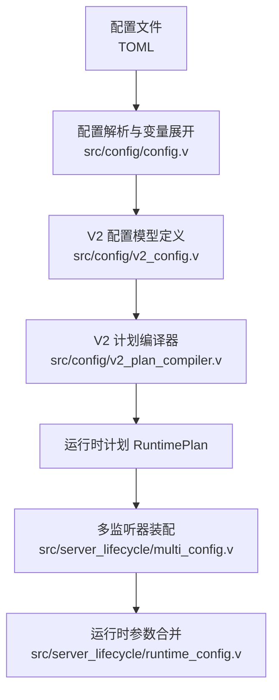
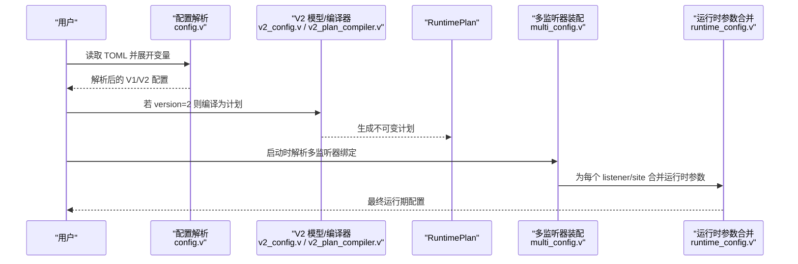
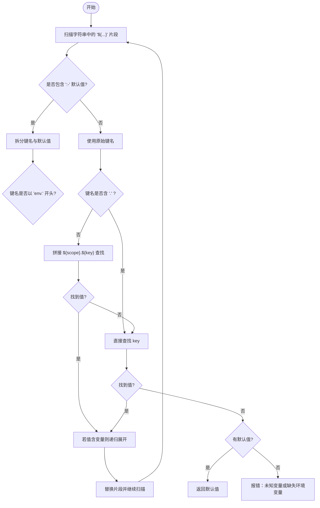
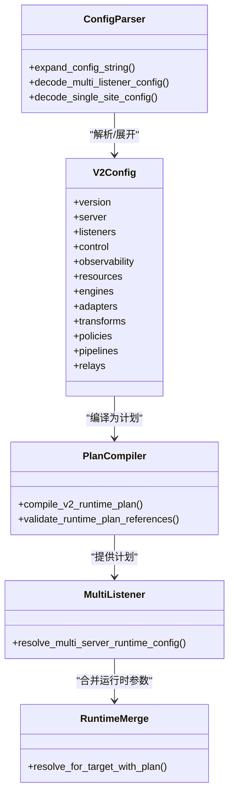

# 配置指南

<cite>
**本文引用的文件**   
- [config/vhttpd.example.toml](file://config/vhttpd.example.toml)
- [config/vhttpd.multi.example.toml](file://config/vhttpd.multi.example.toml)
- [config/vhttpd.vjsx.example.toml](file://config/vhttpd.vjsx.example.toml)
- [src/config/config.v](file://src/config/config.v)
- [src/config/v2_config.v](file://src/config/v2_config.v)
- [src/config/v2_plan_compiler.v](file://src/config/v2_plan_compiler.v)
- [src/config/runtime_plan_loader.v](file://src/config/runtime_plan_loader.v)
- [src/server_lifecycle/multi_config.v](file://src/server_lifecycle/multi_config.v)
- [src/server_lifecycle/runtime_config.v](file://src/server_lifecycle/runtime_config.v)
- [docs/CONFIGURATION_MODEL_V2.md](file://docs/CONFIGURATION_MODEL_V2.md)
- [docs/SITE_CONFIG_DSL.md](file://docs/SITE_CONFIG_DSL.md)
- [README.md](file://README.md)
</cite>

## 目录
1. [简介](#简介)
2. [项目结构](#项目结构)
3. [核心组件](#核心组件)
4. [架构总览](#架构总览)
5. [详细组件分析](#详细组件分析)
6. [依赖关系分析](#依赖关系分析)
7. [性能考虑](#性能考虑)
8. [故障排查指南](#故障排查指南)
9. [结论](#结论)
10. [附录：完整配置参考与示例](#附录完整配置参考与示例)

## 简介
本指南面向生产环境用户，系统化说明 VHTTPD 的 TOML 配置语法、优先级规则、变量扩展与环境变量集成方式，覆盖全局配置、站点（Site）配置、执行器（Executor）配置、多监听器模式、安全、性能调优与日志等主题。文档同时提供 V1 兼容 DSL 与 V2 资源模型对照，帮助在迁移期平滑过渡。

## 项目结构
VHTTPD 的配置解析与编译位于 src/config 模块，运行时装配与多监听器绑定在 server_lifecycle 模块；示例配置位于 config 目录；V2 目标架构说明见 docs。

图表来源
- [src/config/config.v:1487-1591](file://src/config/config.v#L1487-L1591)
- [src/config/v2_config.v:1-318](file://src/config/v2_config.v#L1-L318)
- [src/config/v2_plan_compiler.v:1-203](file://src/config/v2_plan_compiler.v#L1-L203)
- [src/server_lifecycle/multi_config.v:1-94](file://src/server_lifecycle/multi_config.v#L1-L94)
- [src/server_lifecycle/runtime_config.v:89-171](file://src/server_lifecycle/runtime_config.v#L89-L171)

章节来源
- [README.md:447-531](file://README.md#L447-L531)
- [docs/CONFIGURATION_MODEL_V2.md:1-216](file://docs/CONFIGURATION_MODEL_V2.md#L1-L216)

## 核心组件
- 配置加载与变量展开：支持 ${paths.*}、${server.*}、${env.VAR:-默认值} 等表达式，按作用域解析并递归展开。
- V1 兼容 DSL：[sites.<id>] 简写、自动合成 listener、app 别名、worker.entry 别名、vjsx.module_root 默认跟随 root。
- V2 资源模型：以 version=2 声明，将 server/listeners/control/observability/resources/engines/adapters/transforms/policies/pipelines/relays 作为稳定领域，由编译器生成不可变 RuntimePlan。
- 多监听器模式：一个进程可绑定多个 host:port，每个 listener 指向一个 site，各自拥有独立应用运行环境与执行器选择。

章节来源
- [src/config/config.v:2307-2392](file://src/config/config.v#L2307-L2392)
- [docs/SITE_CONFIG_DSL.md:1-184](file://docs/SITE_CONFIG_DSL.md#L1-L184)
- [docs/CONFIGURATION_MODEL_V2.md:132-216](file://docs/CONFIGURATION_MODEL_V2.md#L132-L216)
- [src/server_lifecycle/multi_config.v:20-94](file://src/server_lifecycle/multi_config.v#L20-L94)

## 架构总览
下图展示从 TOML 到运行时计划的编译链路，以及多监听器如何映射到站点与执行器。

图表来源
- [src/config/config.v:1487-1591](file://src/config/config.v#L1487-L1591)
- [src/config/v2_plan_compiler.v:1-203](file://src/config/v2_plan_compiler.v#L1-L203)
- [src/server_lifecycle/multi_config.v:20-94](file://src/server_lifecycle/multi_config.v#L20-L94)
- [src/server_lifecycle/runtime_config.v:89-171](file://src/server_lifecycle/runtime_config.v#L89-L171)

## 详细组件分析

### 全局配置（V1 兼容）
- paths：根路径与工作区路径，供 ${paths.*} 引用。
- server：监听地址与端口、索引页、SSL 等。
- files：PID 文件、事件日志路径。
- runtime：时区等进程级设置。
- worker：工作进程池、超时、重启退避、队列容量、环境变量等。
- executor：执行器类型（php/vjsx 等）。
- php/vjsx：执行器专属参数（入口、扩展、构建目录、线程数等）。
- admin：管理平面主机、端口、令牌。
- assets：静态资源前缀、根目录、缓存控制。
- feishu/codex/mcp 等：协议/提供者相关开关与连接参数。

章节来源
- [config/vhttpd.example.toml:1-67](file://config/vhttpd.example.toml#L1-L67)
- [README.md:447-531](file://README.md#L447-L531)

### 站点配置（V1 兼容 DSL）
- [sites.<id>]：host/port/root/executor 等基础信息。
- 快捷别名：
  - root = project_root
  - app = php.app_entry 或 vjsx.app_entry
  - worker.entry = php.worker_entry
  - vjsx.module_root 默认等于 site root
- 省略 listeners 时，系统根据 sites 的 host+port 自动合成监听器。

章节来源
- [docs/SITE_CONFIG_DSL.md:1-184](file://docs/SITE_CONFIG_DSL.md#L1-L184)
- [config/vhttpd.multi.example.toml:37-73](file://config/vhttpd.multi.example.toml#L37-L73)

### 执行器配置（V1 兼容）
- executor.kind：选择执行器（如 php、vjsx）。
- php：bin、worker_entry、app_entry、extensions、args 等。
- vjsx：app_entry、module_root、build_root、runtime_profile、thread_count 等。
- worker：autostart、pool_size、socket/socket_prefix、read_timeout_ms、max_requests、restart_backoff_* 等。

章节来源
- [config/vhttpd.example.toml:19-36](file://config/vhttpd.example.toml#L19-L36)
- [config/vhttpd.vjsx.example.toml:18-26](file://config/vhttpd.vjsx.example.toml#L18-L26)
- [config/vhttpd.multi.example.toml:44-55](file://config/vhttpd.multi.example.toml#L44-L55)

### 多监听器模式
- 显式 listeners：<id> 指定 host/port/site 绑定。
- 隐式 listeners：未定义 listeners 时，按每个 sites.<id> 的 host+port 自动生成。
- 校验：同一 host:port 重复绑定会报错；listener 必须指向存在的 site。
- 每站点隔离：每个 listener/site 拥有独立的运行环境与执行器选择。

章节来源
- [src/server_lifecycle/multi_config.v:20-94](file://src/server_lifecycle/multi_config.v#L20-L94)
- [README.md:533-589](file://README.md#L533-L589)
- [config/vhttpd.multi.example.toml:44-73](file://config/vhttpd.multi.example.toml#L44-L73)

### 变量扩展机制与环境变量集成
- 语法：${key} 与 ${key:-默认值}。
- 作用域：当 key 不含点号且当前作用域非空时，优先尝试 ${scope}.${key}。
- 环境变量：${env.VAR} 读取进程环境变量；缺失且无默认值时报错。
- 递归展开：被引用的值若仍含变量，会继续展开。
- 路径解析：部分字段在加载阶段进行相对路径解析。

图表来源
- [src/config/config.v:2307-2392](file://src/config/config.v#L2307-L2392)
- [src/config/runtime_plan_loader.v:495-503](file://src/config/runtime_plan_loader.v#L495-L503)

章节来源
- [src/config/config.v:2307-2392](file://src/config/config.v#L2307-L2392)
- [src/config/runtime_plan_loader.v:470-503](file://src/config/runtime_plan_loader.v#L470-L503)

### 配置项优先级与继承
- 全局 → 站点层叠加：with_site 会将站点配置合并到全局，覆盖同名项。
- 路径与文档根：若站点未显式 document_root，则回落到 paths.root；并在 worker.env 中注入 DOCUMENT_ROOT。
- SSL 合并：站点 ssl 与全局 server.ssl 合并。
- 执行器与 PHP/VJSX 配置：分别合并，站点覆盖全局。
- CLI 参数覆盖：运行时参数合并阶段，命令行参数可覆盖配置与计划中的值（例如 worker 队列、超时、admin 端口等）。

章节来源
- [src/config/runtime_config.v:540-571](file://src/config/runtime_config.v#L540-L571)
- [src/server_lifecycle/runtime_config.v:89-171](file://src/server_lifecycle/runtime_config.v#L89-L171)

### V2 资源模型（目标架构）
- 顶层领域：version、server、listeners、control、observability、resources、engines、adapters、transforms、policies、pipelines、relays。
- 版本化：version=2 启用严格校验；未知字段报错；废弃别名不接受。
- 资源引用：通过 ID 引用，避免重复配置。
- 计划编译：TOML → 解码为 V2Config → 编译为不可变 RuntimePlan → 运行时消费。

章节来源
- [docs/CONFIGURATION_MODEL_V2.md:1-216](file://docs/CONFIGURATION_MODEL_V2.md#L1-L216)
- [src/config/v2_config.v:1-318](file://src/config/v2_config.v#L1-L318)
- [src/config/v2_plan_compiler.v:1-203](file://src/config/v2_plan_compiler.v#L1-L203)

### 安全配置
- TLS/证书：可在 listener 或站点级别配置 cert/cert_key/enabled；V2 中由 listeners.tls 统一管理。
- 响应头与安全策略：V2 policies.security 支持 required_headers、allowed_origins、denied_query_patterns 等。
- 上传限制：V2 policies.limits 支持 max_body_bytes、timeout_ms、queue_capacity。
- 建议：生产环境开启必要的安全响应头，限制请求体大小，合理设置 allowed_origins。

章节来源
- [src/config/v2_config.v:224-234](file://src/config/v2_config.v#L224-L234)
- [src/config/v2_config.v:217-222](file://src/config/v2_config.v#L217-L222)
- [src/config/v2_plan_compiler.v:549-578](file://src/config/v2_plan_compiler.v#L549-L578)

### 性能调优
- Worker 池与队列：pool_size、queue_capacity、queue_timeout_ms、read_timeout_ms、max_requests、restart_backoff_*。
- 线程与并发：vjsx.thread_count、concurrency 策略（affinity/actor、max_in_flight、per-key 队列上限等）。
- 资源池：DB pool_size、idle_ping_ms；Cache socket/url/namespace；Storage root/bucket。
- 超时与重试：retry.max_attempts/backoff/max_backoff。

章节来源
- [src/config/v2_config.v:120-155](file://src/config/v2_config.v#L120-L155)
- [src/config/v2_config.v:243-259](file://src/config/v2_config.v#L243-L259)
- [src/config/v2_config.v:82-94](file://src/config/v2_config.v#L82-L94)
- [src/config/v2_config.v:96-103](file://src/config/v2_config.v#L96-L103)
- [src/config/v2_config.v:236-241](file://src/config/v2_config.v#L236-L241)

### 日志与可观测性
- 事件日志：files.event_log（V1）或 observability.event_log（V2）。
- 日志级别：observability.log_level。
- 追踪导出：observability.tracing.enabled/exporter/endpoint/sample_rate。

章节来源
- [config/vhttpd.example.toml:12-17](file://config/vhttpd.example.toml#L12-L17)
- [src/config/v2_config.v:59-72](file://src/config/v2_config.v#L59-L72)

## 依赖关系分析
- 配置解析依赖 toml 库与路径解析工具。
- V2 编译器依赖 runtime_plan 类型，产出不可变计划。
- 多监听器装配依赖已编译的计划与站点配置，确保 listener→site 绑定唯一且有效。
- 运行时参数合并阶段引入 CLI 覆盖与路径规范化。

图表来源
- [src/config/config.v:1487-1591](file://src/config/config.v#L1487-L1591)
- [src/config/v2_config.v:1-318](file://src/config/v2_config.v#L1-L318)
- [src/config/v2_plan_compiler.v:1-203](file://src/config/v2_plan_compiler.v#L1-L203)
- [src/server_lifecycle/multi_config.v:20-94](file://src/server_lifecycle/multi_config.v#L20-L94)
- [src/server_lifecycle/runtime_config.v:89-171](file://src/server_lifecycle/runtime_config.v#L89-L171)

章节来源
- [src/config/config.v:1487-1591](file://src/config/config.v#L1487-L1591)
- [src/config/v2_plan_compiler.v:638-701](file://src/config/v2_plan_compiler.v#L638-L701)

## 性能考虑
- 合理设置 worker.pool_size 与 queue_capacity，结合 read_timeout_ms 与 max_requests 平衡吞吐与内存占用。
- 对长连接/流式场景，调整 queue_timeout_ms 与 restart_backoff_*，避免雪崩。
- 数据库连接池 pool_size 与 idle_ping_ms 需匹配后端能力与网络延迟。
- 使用 concurrency 策略限制并发度与 per-key 队列上限，配合 affinity/actor 提升局部性。
- 静态资源启用缓存控制，减少后端压力。

## 故障排查指南
- 变量展开错误：检查 ${...} 语法是否正确、是否存在缺失的环境变量或未定义的变量键。
- 多监听器冲突：确认不同 listener 的 host:port 不重复，且 site 存在。
- 计划引用无效：V2 模式下，所有引用（engine/adapter/transform/policy/pipeline/relay/provider）必须存在且类型正确。
- 管理员端口冲突：在多监听器模式下，admin 端口可能绑定到首个 listener，注意端口占用。

章节来源
- [src/config/config.v:2307-2392](file://src/config/config.v#L2307-L2392)
- [src/server_lifecycle/multi_config.v:40-68](file://src/server_lifecycle/multi_config.v#L40-L68)
- [src/config/v2_plan_compiler.v:638-701](file://src/config/v2_plan_compiler.v#L638-L701)

## 结论
VHTTPD 在保持 V1 兼容的同时，提供了清晰的 V2 资源模型与严格的计划编译流程。通过变量扩展、站点 DSL 与多监听器模式，用户可以在单一进程中灵活部署多种应用。生产环境应重点关注安全策略、性能参数与可观测性配置，并结合 CLI 覆盖实现灵活的部署策略。

## 附录：完整配置参考与示例

### V1 示例（单站点）
- 路径、服务器、文件、运行时、Worker、执行器、PHP/VJSX、Admin、Assets、Feishu 等段齐全。

章节来源
- [config/vhttpd.example.toml:1-67](file://config/vhttpd.example.toml#L1-L67)

### V1 示例（多监听器/多站点）
- 使用 [sites.<id>] 定义多个站点，省略 [listeners] 时自动合成。
- 各站点可独立选择执行器与运行参数。

章节来源
- [config/vhttpd.multi.example.toml:1-73](file://config/vhttpd.multi.example.toml#L1-L73)
- [README.md:533-589](file://README.md#L533-L589)

### V1 示例（VJSX 站点）
- 指定 vjsx 执行器、入口、模块根、线程数等。

章节来源
- [config/vhttpd.vjsx.example.toml:1-37](file://config/vhttpd.vjsx.example.toml#L1-L37)

### V2 资源模型要点
- 声明 version=2，使用 listeners、engines、adapters、transforms、policies、pipelines、relays 等稳定领域。
- 通过 ID 引用资源，避免重复配置。
- 计划编译后，运行时仅消费不可变计划。

章节来源
- [docs/CONFIGURATION_MODEL_V2.md:132-216](file://docs/CONFIGURATION_MODEL_V2.md#L132-L216)
- [src/config/v2_config.v:1-318](file://src/config/v2_config.v#L1-L318)
- [src/config/v2_plan_compiler.v:1-203](file://src/config/v2_plan_compiler.v#L1-L203)