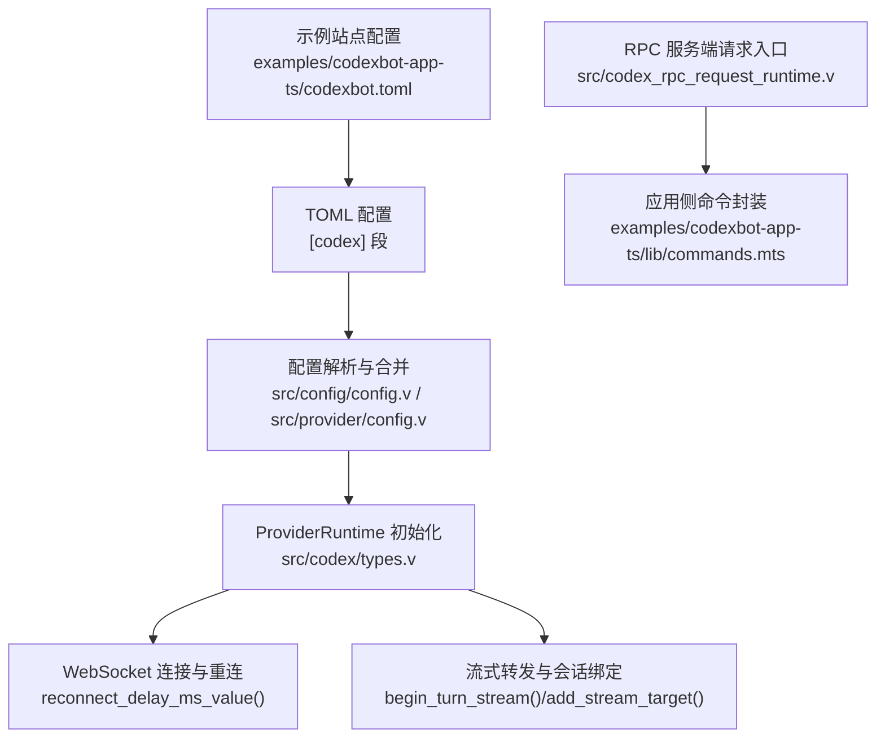
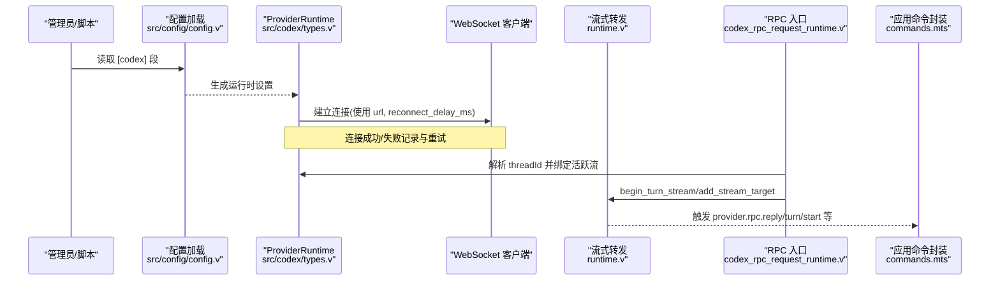
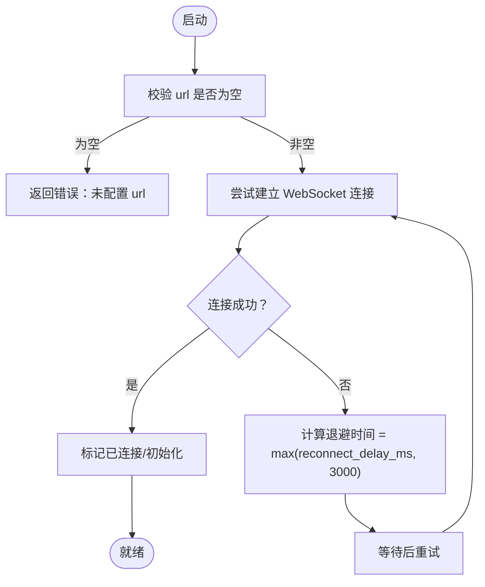
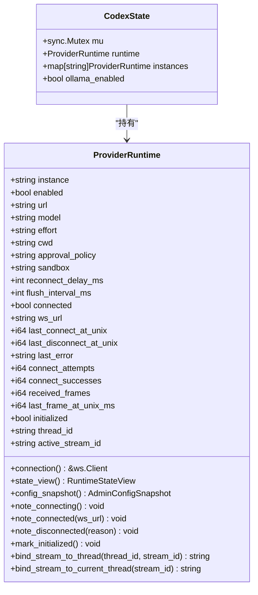
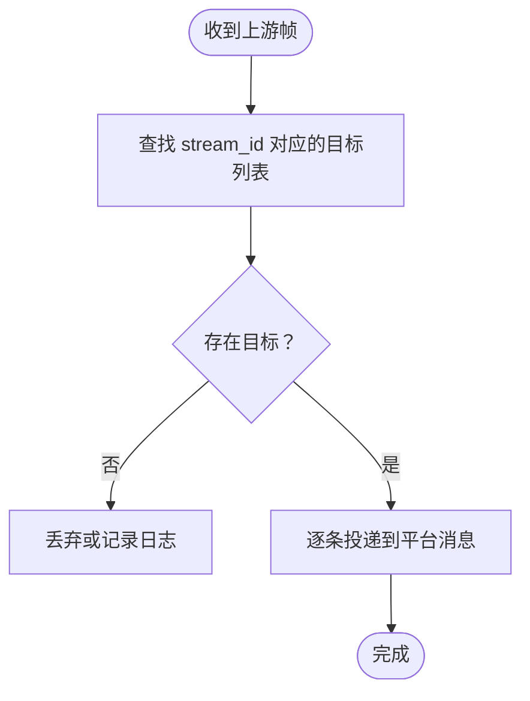
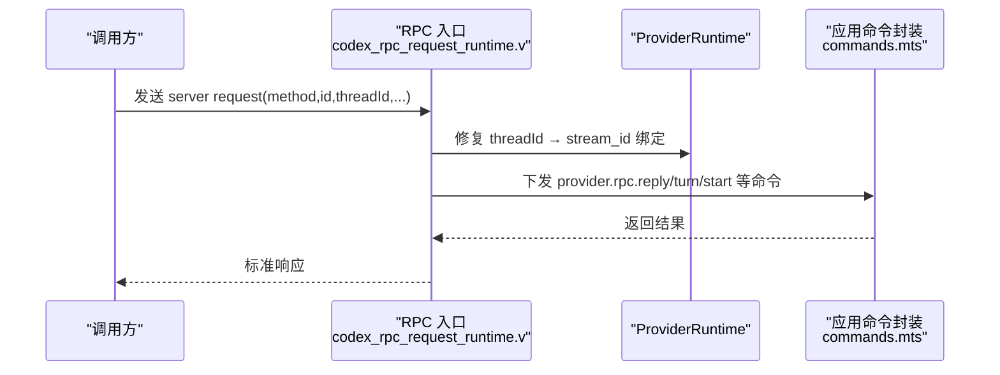
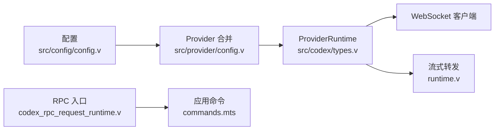

# Codex AI 服务集成配置

<cite>
**本文引用的文件**
- [src/config/config.v](file://src/config/config.v)
- [src/provider/config.v](file://src/provider/config.v)
- [src/codex/types.v](file://src/codex/types.v)
- [src/upstream/provider/codex/runtime.v](file://src/upstream/provider/codex/runtime.v)
- [src/codex_rpc_request_runtime.v](file://src/codex_rpc_request_runtime.v)
- [examples/codexbot-app-ts/lib/commands.mts](file://examples/codexbot-app-ts/lib/commands.mts)
- [examples/codexbot-app-ts/codexbot.toml](file://examples/codexbot-app-ts/codexbot.toml)
- [config/vhttpd.example.toml](file://config/vhttpd.example.toml)
- [README.md](file://README.md)
</cite>

## 目录
1. [简介](#简介)
2. [项目结构](#项目结构)
3. [核心组件](#核心组件)
4. [架构总览](#架构总览)
5. [详细组件分析](#详细组件分析)
6. [依赖关系分析](#依赖关系分析)
7. [性能考虑](#性能考虑)
8. [故障排除指南](#故障排除指南)
9. [结论](#结论)
10. [附录：完整配置示例与字段说明](#附录完整配置示例与字段说明)

## 简介
本文件面向在 vhttpd 中集成 Codex AI 服务的运维与开发者，聚焦以下目标：
- API 密钥与服务端点设置（Codex WebSocket 地址、模型、工作目录等）
- 连接池与重连策略（最大连接数、超时、重试退避）
- 会话管理（会话生命周期、状态同步、断线恢复）
- 流式响应（增量输出、背压控制、错误处理）
- RPC 通信（请求格式、响应解析、协议版本兼容）
- 性能调优（并发限制、内存优化、日志级别）
- 提供完整配置示例与故障排除指引

## 项目结构
vhttpd 通过 TOML 配置加载 Codex 运行时参数，并在运行时维护 ProviderRuntime 状态。关键位置如下：
- 配置定义与合并：[src/config/config.v](file://src/config/config.v)、[src/provider/config.v](file://src/provider/config.v)
- 运行时状态与快照：[src/codex/types.v](file://src/codex/types.v)
- 流式转发与会话绑定：[src/upstream/provider/codex/runtime.v](file://src/upstream/provider/codex/runtime.v)
- 服务端 RPC 入口与路由：[src/codex_rpc_request_runtime.v](file://src/codex_rpc_request_runtime.v)
- 应用侧命令封装（turn/start、session.clear 等）：[examples/codexbot-app-ts/lib/commands.mts](file://examples/codexbot-app-ts/lib/commands.mts)
- 示例站点配置（含 codex 段）：[examples/codexbot-app-ts/codexbot.toml](file://examples/codexbot-app-ts/codexbot.toml)
- 通用示例配置（不含 codex）：[config/vhttpd.example.toml](file://config/vhttpd.example.toml)
- 运行与多监听模式说明：[README.md](file://README.md)

**图表来源**
- [src/config/config.v:216-227](file://src/config/config.v#L216-L227)
- [src/provider/config.v:157-189](file://src/provider/config.v#L157-L189)
- [src/codex/types.v:104-119](file://src/codex/types.v#L104-L119)
- [src/upstream/provider/codex/runtime.v:7-19](file://src/upstream/provider/codex/runtime.v#L7-L19)
- [src/codex_rpc_request_runtime.v:1-39](file://src/codex_rpc_request_runtime.v#L1-L39)
- [examples/codexbot-app-ts/lib/commands.mts:118-167](file://examples/codexbot-app-ts/lib/commands.mts#L118-L167)
- [examples/codexbot-app-ts/codexbot.toml:25-36](file://examples/codexbot-app-ts/codexbot.toml#L25-L36)

**章节来源**
- [src/config/config.v:216-227](file://src/config/config.v#L216-L227)
- [src/provider/config.v:157-189](file://src/provider/config.v#L157-L189)
- [src/codex/types.v:104-119](file://src/codex/types.v#L104-L119)
- [src/upstream/provider/codex/runtime.v:7-19](file://src/upstream/provider/codex/runtime.v#L7-L19)
- [src/codex_rpc_request_runtime.v:1-39](file://src/codex_rpc_request_runtime.v#L1-L39)
- [examples/codexbot-app-ts/lib/commands.mts:118-167](file://examples/codexbot-app-ts/lib/commands.mts#L118-L167)
- [examples/codexbot-app-ts/codexbot.toml:25-36](file://examples/codexbot-app-ts/codexbot.toml#L25-L36)

## 核心组件
- 配置结构体 CodexConfig：包含启用开关、URL、模型、努力等级、工作目录、审批策略、沙箱、重连延迟、刷新间隔等字段。
- ProviderRuntime：维护连接状态、线程/流映射、RPC 待应答、错误风暴与读回退队列等运行时信息。
- 流式转发器：负责将上游帧按 stream_id 分发到平台消息目标，支持开始新 turn、清理目标等。
- RPC 入口：接收服务端请求，根据 threadId 修复并绑定到当前活跃流，再下发到应用层。

**章节来源**
- [src/config/config.v:216-227](file://src/config/config.v#L216-L227)
- [src/codex/types.v:67-102](file://src/codex/types.v#L67-L102)
- [src/upstream/provider/codex/runtime.v:7-62](file://src/upstream/provider/codex/runtime.v#L7-L62)
- [src/codex_rpc_request_runtime.v:1-39](file://src/codex_rpc_request_runtime.v#L1-L39)

## 架构总览
下图展示从配置到运行时、再到 RPC 与应用层的整体链路。

**图表来源**
- [src/config/config.v:216-227](file://src/config/config.v#L216-L227)
- [src/codex/types.v:104-119](file://src/codex/types.v#L104-L119)
- [src/upstream/provider/codex/runtime.v:7-19](file://src/upstream/provider/codex/runtime.v#L7-L19)
- [src/codex_rpc_request_runtime.v:1-39](file://src/codex_rpc_request_runtime.v#L1-L39)
- [examples/codexbot-app-ts/lib/commands.mts:118-167](file://examples/codexbot-app-ts/lib/commands.mts#L118-L167)

## 详细组件分析

### 配置项与默认值
- 关键字段
  - enabled：是否启用 Codex 提供者
  - url：Codex WebSocket 服务端点（必填校验）
  - model：模型名称
  - effort：推理努力等级
  - cwd：工作目录
  - approval_policy：审批策略
  - sandbox：沙箱策略
  - reconnect_delay_ms：重连退避毫秒
  - flush_interval_ms：刷新间隔毫秒
- 默认值与合并
  - 若未显式设置，provider 层会回填默认值（如 model=“o4-mini”、effort=“medium”、approval_policy=“never”、sandbox=“workspaceWrite”、reconnect_delay_ms=3000、flush_interval_ms=400）。
- 环境变量与路径展开
  - 示例配置中使用 ${env.CODEX_URL:-ws://127.0.0.1:4500} 等形式进行变量替换。

**章节来源**
- [src/config/config.v:216-227](file://src/config/config.v#L216-L227)
- [src/provider/config.v:157-189](file://src/provider/config.v#L157-L189)
- [examples/codexbot-app-ts/codexbot.toml:25-36](file://examples/codexbot-app-ts/codexbot.toml#L25-L36)

### 连接池与重连策略
- 连接对象
  - ProviderRuntime 持有 ws.Client 引用，维护 connected、initialized、last_error 等指标。
- 重连退避
  - reconnect_delay_ms_value() 返回实际退避时间；当配置为 <=0 时回退到默认 3000ms。
- 连接生命周期
  - note_connecting/note_connected/note_disconnected/mark_initialized 等方法更新状态与统计。
- 最大连接数
  - 当前 ProviderRuntime 为单实例连接；如需多实例，可通过多进程或外部负载均衡实现。

**图表来源**
- [src/codex/types.v:104-119](file://src/codex/types.v#L104-L119)
- [src/codex/types.v:153-177](file://src/codex/types.v#L153-L177)

**章节来源**
- [src/codex/types.v:104-119](file://src/codex/types.v#L104-L119)
- [src/codex/types.v:153-177](file://src/codex/types.v#L153-L177)

### 会话管理与状态同步
- 线程与流绑定
  - current_thread_id()/current_stream_id() 暴露当前线程与活跃流。
  - bind_stream_to_current_thread()/bind_stream_to_thread() 用于将流绑定到线程，并维护 thread_stream_map。
- 流目标管理
  - add_stream_target/remove_stream_target/clear_stream_targets 管理下游平台消息投递目标。
  - begin_turn_stream 开始新的 turn 流，并将旧目标清理。
- 状态快照
  - state_view()/config_snapshot() 对外暴露连接、初始化、最近错误、计数器等指标。

**图表来源**
- [src/codex/types.v:67-102](file://src/codex/types.v#L67-L102)
- [src/codex/types.v:242-272](file://src/codex/types.v#L242-L272)

**章节来源**
- [src/codex/types.v:129-209](file://src/codex/types.v#L129-L209)
- [src/upstream/provider/codex/runtime.v:7-62](file://src/upstream/provider/codex/runtime.v#L7-L62)
- [src/codex/types.v:211-240](file://src/codex/types.v#L211-L240)

### 流式响应配置
- 增量输出
  - 通过 begin_turn_stream/add_stream_target 将上游帧定向到具体平台消息目标，实现增量推送。
- 背压控制
  - 当前代码未显式实现背压限流；建议在上游发送端结合 flush_interval_ms 与业务逻辑控制速率。
- 错误处理
  - note_disconnected 记录 last_error 并重置连接与读回退队列；可配合 admin 快照观察错误趋势。

**图表来源**
- [src/upstream/provider/codex/runtime.v:17-48](file://src/upstream/provider/codex/runtime.v#L17-L48)

**章节来源**
- [src/upstream/provider/codex/runtime.v:7-62](file://src/upstream/provider/codex/runtime.v#L7-L62)

### RPC 通信配置
- 请求格式
  - 服务端入口解析 method/id_raw/threadId 等字段，并根据 threadId 修复与活跃流的绑定。
- 响应解析
  - 应用侧通过 codexRpcReply 构造 provider.rpc.reply 命令，携带 id 与 result。
- 协议版本兼容
  - 当前以字符串方法名与 JSON 载荷为主；建议在变更时保持向后兼容的字段识别与容错。

**图表来源**
- [src/codex_rpc_request_runtime.v:1-39](file://src/codex_rpc_request_runtime.v#L1-L39)
- [examples/codexbot-app-ts/lib/commands.mts:118-167](file://examples/codexbot-app-ts/lib/commands.mts#L118-L167)

**章节来源**
- [src/codex_rpc_request_runtime.v:1-39](file://src/codex_rpc_request_runtime.v#L1-L39)
- [examples/codexbot-app-ts/lib/commands.mts:118-167](file://examples/codexbot-app-ts/lib/commands.mts#L118-L167)

## 依赖关系分析
- 配置到运行时
  - TOML 中的 [codex] 段被解析为 CodexConfig，随后由 provider 层合并默认值，构建 ProviderRuntime。
- 运行时到网络
  - ProviderRuntime 使用 net.websocket 客户端发起连接，并通过状态方法维护连接生命周期。
- 运行时到应用
  - 通过 RPC 入口与应用命令封装协作，完成 turn/start、session.clear 等操作。

**图表来源**
- [src/config/config.v:216-227](file://src/config/config.v#L216-L227)
- [src/provider/config.v:157-189](file://src/provider/config.v#L157-L189)
- [src/codex/types.v:67-102](file://src/codex/types.v#L67-L102)
- [src/upstream/provider/codex/runtime.v:7-62](file://src/upstream/provider/codex/runtime.v#L7-L62)
- [src/codex_rpc_request_runtime.v:1-39](file://src/codex_rpc_request_runtime.v#L1-L39)
- [examples/codexbot-app-ts/lib/commands.mts:118-167](file://examples/codexbot-app-ts/lib/commands.mts#L118-L167)

**章节来源**
- [src/config/config.v:216-227](file://src/config/config.v#L216-L227)
- [src/provider/config.v:157-189](file://src/provider/config.v#L157-L189)
- [src/codex/types.v:67-102](file://src/codex/types.v#L67-L102)
- [src/upstream/provider/codex/runtime.v:7-62](file://src/upstream/provider/codex/runtime.v#L7-L62)
- [src/codex_rpc_request_runtime.v:1-39](file://src/codex_rpc_request_runtime.v#L1-L39)
- [examples/codexbot-app-ts/lib/commands.mts:118-167](file://examples/codexbot-app-ts/lib/commands.mts#L118-L167)

## 性能考虑
- 并发限制
  - ProviderRuntime 为单连接模型；如需更高吞吐，可在进程级扩展或使用外部负载均衡。
- 内存使用优化
  - 合理设置 flush_interval_ms，避免过多小帧堆积；及时清理不再使用的 stream 目标。
- 日志级别
  - 生产环境建议使用 warn 及以上级别；开发调试时可开启 debug 以便定位问题。
- 监控与观测
  - 通过 state_view()/config_snapshot() 暴露的连接与错误指标，结合事件日志进行观测。

[本节为通用指导，不直接分析具体文件]

## 故障排除指南
- 常见问题
  - 未配置 url：pull_url() 会返回错误，检查 [codex].url 是否正确。
  - 频繁断线：查看 last_error/connect_attempts/received_frames 等指标，调整 reconnect_delay_ms。
  - 流未到达目标：确认 stream_id 与目标列表是否存在，必要时调用 clear_stream_targets 清理。
- 诊断步骤
  - 检查配置合并后的最终值（model/effort/approval_policy/sandbox 等）。
  - 观察 ProviderRuntime.state_view() 与 config_snapshot() 的输出。
  - 核对 RPC 入口日志与方法名，确保应用侧命令正确构造与返回。

**章节来源**
- [src/codex/types.v:104-119](file://src/codex/types.v#L104-L119)
- [src/codex/types.v:211-240](file://src/codex/types.v#L211-L240)
- [src/upstream/provider/codex/runtime.v:50-62](file://src/upstream/provider/codex/runtime.v#L50-L62)
- [src/codex_rpc_request_runtime.v:1-39](file://src/codex_rpc_request_runtime.v#L1-L39)

## 结论
通过在 vhttpd 中集中配置 Codex 提供者，并结合 ProviderRuntime 的状态管理与流式转发能力，可实现稳定可靠的 AI 服务集成。建议在生产环境中完善监控与告警，结合合理的重连与刷新策略，保障高可用与低延迟。

[本节为总结性内容，不直接分析具体文件]

## 附录：完整配置示例与字段说明
- 示例站点配置（含 codex 段）
  - 参考：[examples/codexbot-app-ts/codexbot.toml](file://examples/codexbot-app-ts/codexbot.toml)
  - 关键字段：enabled/url/model/effort/cwd/approval_policy/sandbox/reconnect_delay_ms/flush_interval_ms
- 通用示例配置（不含 codex）
  - 参考：[config/vhttpd.example.toml](file://config/vhttpd.example.toml)
- 运行与多监听模式
  - 参考：[README.md](file://README.md)

**章节来源**
- [examples/codexbot-app-ts/codexbot.toml:25-36](file://examples/codexbot-app-ts/codexbot.toml#L25-L36)
- [config/vhttpd.example.toml:1-67](file://config/vhttpd.example.toml#L1-L67)
- [README.md:437-525](file://README.md#L437-L525)