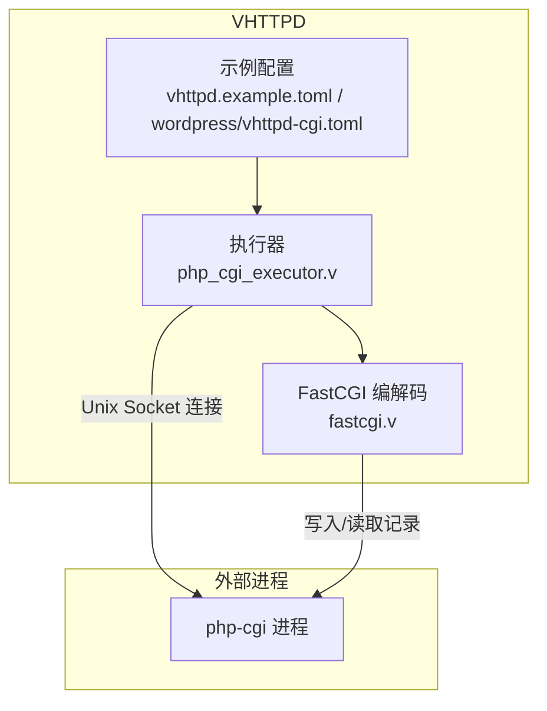
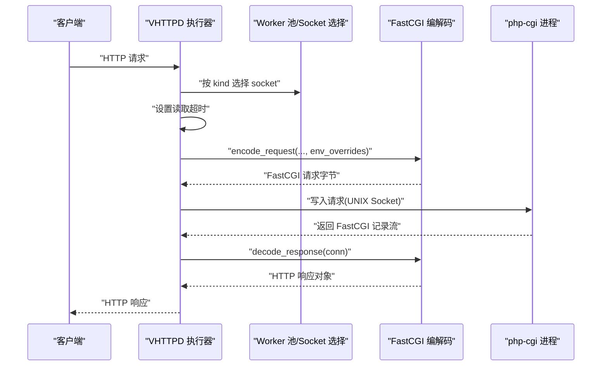
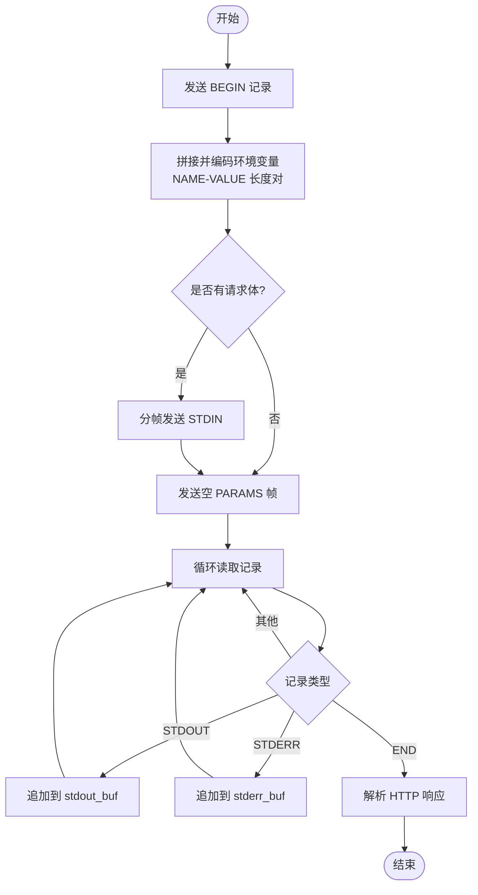
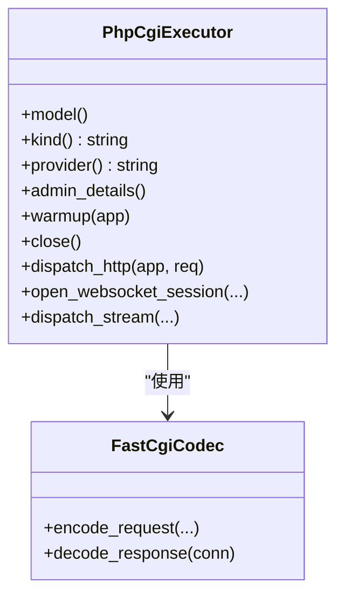
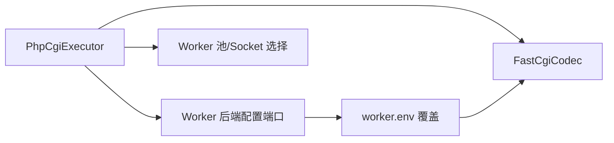

# FastCGI 执行器配置

<cite>
**本文引用的文件**   
- [src/executor/php_cgi_executor.v](file://src/executor/php_cgi_executor.v)
- [src/upstream/transport/fastcgi.v](file://src/upstream/transport/fastcgi.v)
- [config/vhttpd.example.toml](file://config/vhttpd.example.toml)
- [examples/wordpress/vhttpd-cgi.toml](file://examples/wordpress/vhttpd-cgi.toml)
- [examples/laravel/app.php](file://examples/laravel/app.php)
- [examples/wordpress/app.php](file://examples/wordpress/app.php)
- [src/server_logic_test.v](file://src/server_logic_test.v)
- [tests/e2e/config_acceptance_test.sh](file://tests/e2e/config_acceptance_test.sh)
</cite>

## 目录
1. [简介](#简介)
2. [项目结构](#项目结构)
3. [核心组件](#核心组件)
4. [架构总览](#架构总览)
5. [详细组件分析](#详细组件分析)
6. [依赖关系分析](#依赖关系分析)
7. [性能考虑](#性能考虑)
8. [故障排除指南](#故障排除指南)
9. [结论](#结论)
10. [附录](#附录)

## 简介
本文件面向在 VHTTPD 中使用 FastCGI 执行器的用户与运维人员，系统阐述 FastCGI 协议工作原理、VHTTPD 中的实现机制与配置方法。内容覆盖：
- FastCGI 请求编码与响应解码流程
- 进程池与连接管理（worker 数量、超时、空闲回收）
- 环境变量传递（系统继承、自定义覆盖、敏感信息保护）
- 请求处理参数（最大请求数、超时、错误重试）
- PHP 应用集成示例（Laravel、WordPress）
- 性能调优建议（并发、内存、吞吐）
- 常见问题的诊断与解决方案

## 项目结构
FastCGI 执行器相关代码主要分布在以下模块：
- 执行器入口：负责选择后端 socket、设置读取超时、组装并发送 FastCGI 请求、解析响应
- FastCGI 编解码：负责构造 FCGI_BEGIN_REQUEST、FCGI_PARAMS、FCGI_STDIN、FCGI_STDOUT、FCGI_END_REQUEST 等记录，以及将 CGI 输出解析为 HTTP 响应
- 配置示例：提供 WordPress 的 FastCGI 运行示例与通用 vhttpd 示例配置

图表来源
- [src/executor/php_cgi_executor.v:42-82](file://src/executor/php_cgi_executor.v#L42-L82)
- [src/upstream/transport/fastcgi.v:78-249](file://src/upstream/transport/fastcgi.v#L78-L249)
- [config/vhttpd.example.toml:19-26](file://config/vhttpd.example.toml#L19-L26)
- [examples/wordpress/vhttpd-cgi.toml:8-17](file://examples/wordpress/vhttpd-cgi.toml#L8-L17)

章节来源
- [src/executor/php_cgi_executor.v:42-82](file://src/executor/php_cgi_executor.v#L42-L82)
- [src/upstream/transport/fastcgi.v:78-249](file://src/upstream/transport/fastcgi.v#L78-L249)
- [config/vhttpd.example.toml:19-26](file://config/vhttpd.example.toml#L19-L26)
- [examples/wordpress/vhttpd-cgi.toml:8-17](file://examples/wordpress/vhttpd-cgi.toml#L8-L17)

## 核心组件
- PhpCgiExecutor：对外暴露“php-cgi”执行器类型，负责通过 Unix Socket 与 php-cgi 通信，按 kind 选择对应 worker 池与 socket，设置读取超时，调用 FastCGI 编解码完成一次请求往返。
- FastCgiCodec：实现 FastCGI 协议的请求编码与响应解码，包括 BEGIN/PARAMS/STDIN/STDOUT/END 帧的构建与解析，并将 CGI 标准输出解析为标准 HTTP 响应。

章节来源
- [src/executor/php_cgi_executor.v:1-118](file://src/executor/php_cgi_executor.v#L1-L118)
- [src/upstream/transport/fastcgi.v:1-386](file://src/upstream/transport/fastcgi.v#L1-L386)

## 架构总览
下图展示从 HTTP 请求进入 VHTTPD 到 FastCGI 子进程的完整调用链与数据流。

图表来源
- [src/executor/php_cgi_executor.v:42-82](file://src/executor/php_cgi_executor.v#L42-L82)
- [src/upstream/transport/fastcgi.v:78-249](file://src/upstream/transport/fastcgi.v#L78-L249)
- [src/upstream/transport/fastcgi.v:266-317](file://src/upstream/transport/fastcgi.v#L266-L317)

## 详细组件分析

### FastCGI 协议与实现要点
- 请求构建
  - 发送 FCGI_BEGIN_REQUEST（角色为 responder，无 KEEP_CONN）
  - 发送 FCGI_PARAMS：包含标准 CGI 环境变量（如 REQUEST_METHOD、SCRIPT_FILENAME、DOCUMENT_ROOT、REQUEST_URI、QUERY_STRING、REMOTE_ADDR、HTTP_*、CONTENT_TYPE、CONTENT_LENGTH 等），并按 Name-Value 长度对编码；支持分帧发送以规避单次过大限制
  - 发送 FCGI_STDIN：当存在请求体时，按 65535 字节分帧发送
  - 发送空 FCGI_PARAMS 与空 FCGI_STDIN 帧表示结束
- 响应解析
  - 循环读取记录头与内容，聚合 STDOUT 与 STDERR
  - 遇到 FCGI_END_REQUEST 终止读取
  - 将 STDOUT 中 CGI 输出的 HTTP 头部与 Body 解析为标准响应对象

图表来源
- [src/upstream/transport/fastcgi.v:78-249](file://src/upstream/transport/fastcgi.v#L78-L249)
- [src/upstream/transport/fastcgi.v:266-317](file://src/upstream/transport/fastcgi.v#L266-L317)

章节来源
- [src/upstream/transport/fastcgi.v:78-249](file://src/upstream/transport/fastcgi.v#L78-L249)
- [src/upstream/transport/fastcgi.v:266-317](file://src/upstream/transport/fastcgi.v#L266-L317)

### 执行器工作流（PhpCgiExecutor）
- 选择后端 socket：根据执行器 kind 从 worker 池中选择对应 socket
- 设置读取超时：从后端配置获取 kind 对应的 read_timeout_ms，并应用到连接
- 获取环境覆盖：按 kind 获取 worker_env_for_kind 的环境覆盖映射
- 编码请求：调用 FastCgiCodec.encode_request 生成完整 FastCGI 请求
- 发送与接收：写入连接后解码响应，关闭连接并释放 socket
- 非支持能力：明确不支持 WebSocket、Stream、MCP 等

图表来源
- [src/executor/php_cgi_executor.v:1-118](file://src/executor/php_cgi_executor.v#L1-L118)
- [src/upstream/transport/fastcgi.v:78-249](file://src/upstream/transport/fastcgi.v#L78-L249)

章节来源
- [src/executor/php_cgi_executor.v:42-82](file://src/executor/php_cgi_executor.v#L42-L82)

### 环境变量传递与敏感信息保护
- 自动注入的标准变量
  - 请求相关：REQUEST_METHOD、REQUEST_URI、QUERY_STRING、REMOTE_ADDR、HTTP_HOST、SERVER_NAME、SERVER_PORT、SERVER_PROTOCOL、REQUEST_SCHEME、HTTPS
  - 脚本路径：SCRIPT_FILENAME、DOCUMENT_ROOT、SCRIPT_NAME、DOCUMENT_URI
  - 请求体：CONTENT_TYPE、CONTENT_LENGTH（POST/PUT 时由请求体长度推导）
  - 追踪标识：VHTTPD_TRACE_ID、VHTTPD_REQUEST_ID 及其 HTTP_ 前缀版本
- 自定义覆盖与环境合并
  - 通过 worker.env 或站点 executors 下的 worker.env 传入覆盖键值
  - 特殊键说明：VPHP_WP_ROOT 用于 WordPress 场景下解析物理 SCRIPT_FILENAME；VHTTPD_INDEX 指定默认入口文件名
  - 过滤规则：HTTP_* 与特定内部键不会重复覆盖
- 敏感信息保护建议
  - 避免在配置文件中明文存放密钥，优先使用系统环境变量注入
  - 仅向 php-cgi 进程传递必要的环境变量，减少泄露面
  - 结合操作系统权限控制 socket 文件访问

章节来源
- [src/upstream/transport/fastcgi.v:97-182](file://src/upstream/transport/fastcgi.v#L97-L182)
- [examples/wordpress/vhttpd-cgi.toml:13-14](file://examples/wordpress/vhttpd-cgi.toml#L13-L14)

### 进程池与连接管理
- Worker 数量
  - 通过 worker.pool_size 控制并发 worker 数量
  - 针对多执行器场景，可在站点 executors 下为不同 kind 分别配置 pool_size
- 启动与自动拉起
  - autostart=true 时，服务启动后自动拉起 worker 进程
- 连接与超时
  - worker.read_timeout_ms 控制读取超时
  - executor 层会按 kind 获取后端读超时并应用到连接
- 空闲回收与重启策略
  - max_requests：单 worker 生命周期内最大请求数，达到阈值后触发优雅重启
  - restart_backoff_ms/restart_backoff_max_ms：重启退避时间范围，避免雪崩

章节来源
- [config/vhttpd.example.toml:19-26](file://config/vhttpd.example.toml#L19-L26)
- [src/executor/php_cgi_executor.v:51-54](file://src/executor/php_cgi_executor.v#L51-L54)
- [src/server_logic_test.v:1438-1476](file://src/server_logic_test.v#L1438-L1476)
- [tests/e2e/config_acceptance_test.sh:2233-2246](file://tests/e2e/config_acceptance_test.sh#L2233-L2246)

### 请求处理配置
- 最大请求数与重启
  - max_requests 控制单 worker 最大请求数，配合退避策略进行平滑重启
- 超时设置
  - worker.read_timeout_ms 影响 FastCGI 读取超时
- 错误重试机制
  - 当前执行器未内置显式重试逻辑；建议在网关或上游调度层实现重试策略

章节来源
- [config/vhttpd.example.toml:24-26](file://config/vhttpd.example.toml#L24-L26)
- [src/executor/php_cgi_executor.v:51-54](file://src/executor/php_cgi_executor.v#L51-L54)

### PHP 应用集成示例
- WordPress（FastCGI 模式）
  - 使用独立的 php-cgi 进程，通过 Unix Socket 通信
  - 关键配置项：
    - executor.kind = "php-cgi"
    - worker.socket 指向本地 sock 文件
    - worker.env.VPHP_WP_ROOT 指向 WordPress 根目录
    - php.bin = "php-cgi"
  - 运行时行为：FastCGI 编码器会根据 VPHP_WP_ROOT 与 VHTTPD_INDEX 计算 SCRIPT_FILENAME 与 DOCUMENT_ROOT，确保 WordPress 正确解析入口
- Laravel（PSR-7 适配）
  - 示例应用通过 PSR-7 桥接 Symfony HttpFoundation 与 Laravel Request/Response
  - 可复用同一 FastCGI 执行器通道，将 HTTP 请求转换为框架可识别的请求对象

章节来源
- [examples/wordpress/vhttpd-cgi.toml:1-17](file://examples/wordpress/vhttpd-cgi.toml#L1-L17)
- [src/upstream/transport/fastcgi.v:105-127](file://src/upstream/transport/fastcgi.v#L105-L127)
- [examples/laravel/app.php:1-55](file://examples/laravel/app.php#L1-L55)

## 依赖关系分析
- 执行器依赖
  - PhpCgiExecutor 依赖 worker 池与后端配置端口，按 kind 选择 socket 与读取超时
  - 依赖 FastCgiCodec 完成协议级编解码
- 配置依赖
  - worker.* 与 executor.* 共同决定执行模型与资源上限
  - worker.env 提供 per-kind 的环境覆盖

图表来源
- [src/executor/php_cgi_executor.v:42-82](file://src/executor/php_cgi_executor.v#L42-L82)
- [src/upstream/transport/fastcgi.v:78-182](file://src/upstream/transport/fastcgi.v#L78-L182)

章节来源
- [src/executor/php_cgi_executor.v:42-82](file://src/executor/php_cgi_executor.v#L42-L82)
- [src/upstream/transport/fastcgi.v:78-182](file://src/upstream/transport/fastcgi.v#L78-L182)

## 性能考虑
- 进程池大小优化
  - 依据 CPU 核数与 I/O 特征调整 worker.pool_size；CPU 密集型可适当降低，I/O 密集可适当提高
  - 多执行器场景下，为 php-cgi 单独分配独立池，避免与其他执行器争抢资源
- 内存使用控制
  - 合理设置 max_requests，定期重启 worker 防止内存泄漏累积
  - 避免向 php-cgi 传递不必要的大体积环境变量
- 并发处理能力
  - 增大 worker.pool_size 提升并发度，但需监控磁盘 I/O 与网络延迟
  - 调整 read_timeout_ms 避免长尾请求占用过多连接
- 日志与观测
  - 关注 FastCGI 的 stderr 输出，便于定位 PHP 侧异常
  - 结合 VHTTPD 事件日志与 admin 面板观察 worker 状态与队列指标

[本节为通用指导，不直接分析具体文件]

## 故障排除指南
- 连接问题
  - 现象：无法连接到 php-cgi 或返回 transport_error
  - 排查：检查 worker.socket 是否存在且权限正确；确认 autostart 已启用；核对 executor.kind 与后端配置一致
- 环境变量缺失
  - 现象：WordPress 无法解析入口文件或路径不正确
  - 排查：确认 VPHP_WP_ROOT 与 VHTTPD_INDEX 是否设置；查看 FastCGI 编码阶段的环境日志
- 超时与慢请求
  - 现象：read timeout 或请求长时间挂起
  - 排查：增大 worker.read_timeout_ms；检查 php-cgi 进程负载与数据库/外部依赖响应时间
- 权限问题
  - 现象：无法读写 socket 文件或 PHP 进程无权访问站点目录
  - 排查：校验 socket 文件属主与权限；确保 php-cgi 运行用户具备站点目录读取权限
- 性能瓶颈
  - 现象：吞吐低、CPU 或内存占用高
  - 排查：调整 worker.pool_size 与 max_requests；监控 GC 与扩展加载开销；必要时拆分站点与执行器

章节来源
- [src/executor/php_cgi_executor.v:47-54](file://src/executor/php_cgi_executor.v#L47-L54)
- [src/upstream/transport/fastcgi.v:311-317](file://src/upstream/transport/fastcgi.v#L311-L317)
- [examples/wordpress/vhttpd-cgi.toml:8-17](file://examples/wordpress/vhttpd-cgi.toml#L8-L17)

## 结论
FastCGI 执行器为 VHTTPD 提供了与 php-cgi 进程的高效通信通道。通过合理的进程池与超时配置、精细化的环境变量管理与安全实践，可以在保证稳定性的同时获得良好的吞吐表现。对于 WordPress 与 Laravel 等主流 PHP 框架，均可基于该执行器快速集成与部署。

[本节为总结性内容，不直接分析具体文件]

## 附录
- 常用配置项速查
  - server.host/port：监听地址与端口
  - worker.autostart/pool_size/read_timeout_ms/max_requests/restart_backoff_ms/restart_backoff_max_ms：worker 生命周期与资源控制
  - executor.kind：执行器类型（php-cgi）
  - worker.socket：Unix Socket 路径
  - worker.env.*：按 kind 的环境覆盖（如 VPHP_WP_ROOT、VHTTPD_INDEX）
  - php.bin：php-cgi 可执行文件路径

章节来源
- [config/vhttpd.example.toml:19-26](file://config/vhttpd.example.toml#L19-L26)
- [examples/wordpress/vhttpd-cgi.toml:1-17](file://examples/wordpress/vhttpd-cgi.toml#L1-L17)