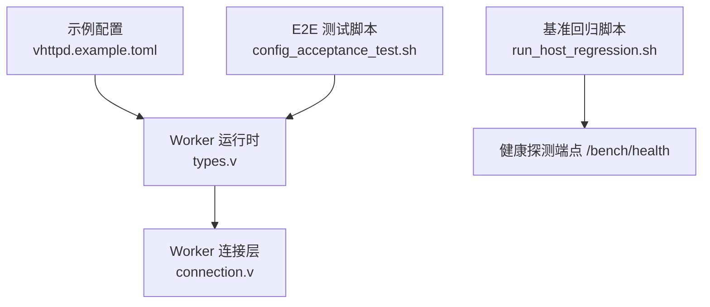
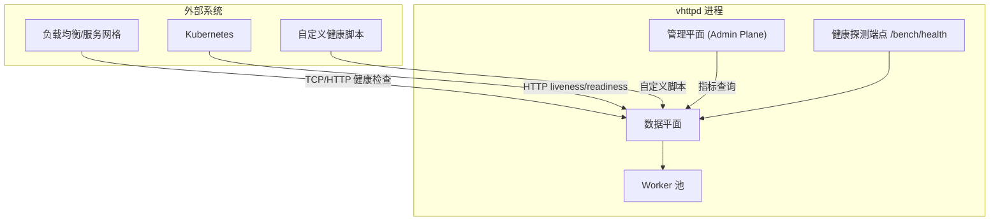
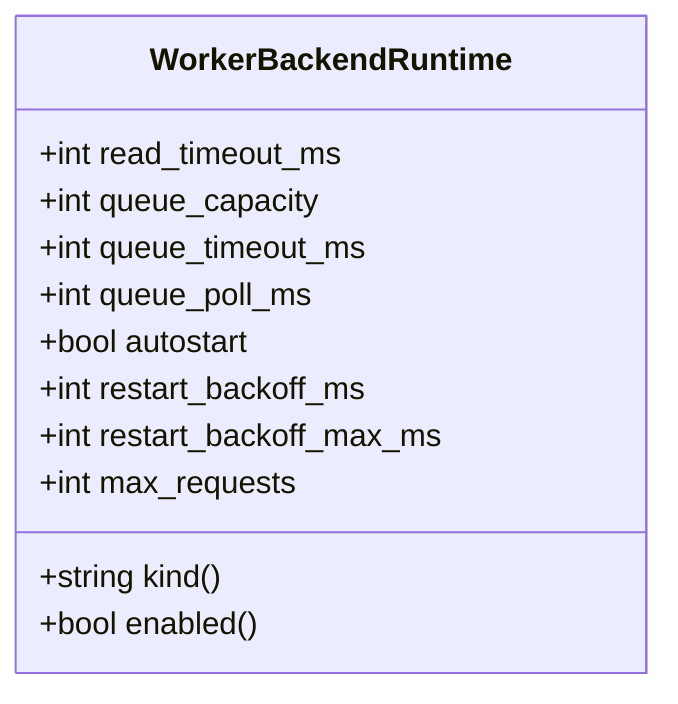
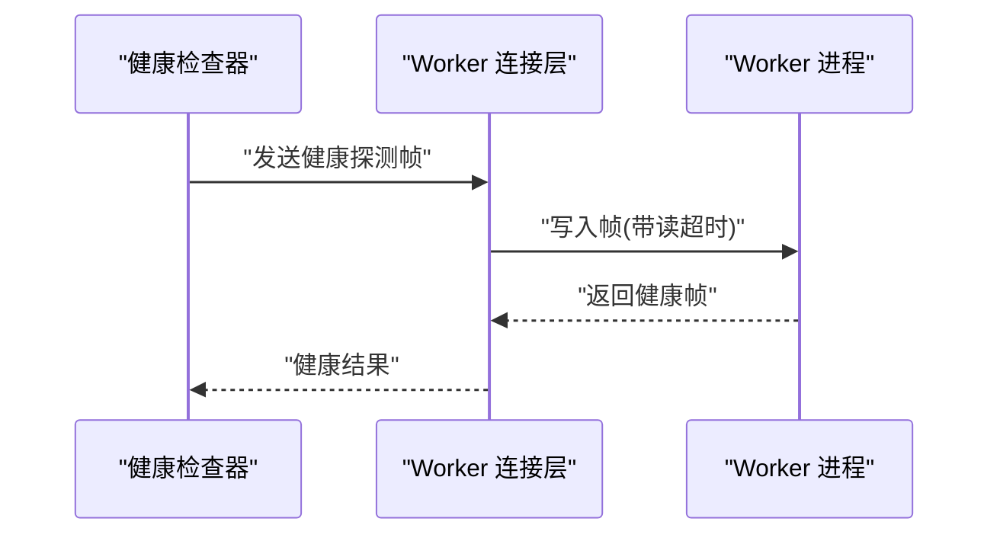
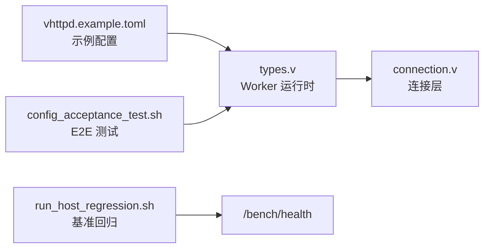

# Worker 健康监控

<cite>
**本文引用的文件**   
- [src/worker/types.v](file://src/worker/types.v)
- [src/worker/connection.v](file://src/worker/connection.v)
- [config/vhttpd.example.toml](file://config/vhttpd.example.toml)
- [tests/e2e/config_acceptance_test.sh](file://tests/e2e/config_acceptance_test.sh)
- [bench/run_host_regression.sh](file://bench/run_host_regression.sh)
- [articles/11-observability.md](file://articles/11-observability.md)
- [README.md](file://README.md)
</cite>

## 目录
1. [简介](#简介)
2. [项目结构](#项目结构)
3. [核心组件](#核心组件)
4. [架构总览](#架构总览)
5. [详细组件分析](#详细组件分析)
6. [依赖关系分析](#依赖关系分析)
7. [性能考量](#性能考量)
8. [故障诊断指南](#故障诊断指南)
9. [结论](#结论)
10. [附录](#附录)

## 简介
本文件面向 vhttpd 的 Worker 健康监控，提供从配置到指标、告警与排障的完整说明。内容覆盖：
- 健康检查配置（端点、间隔、超时）
- 健康检查类型（TCP 端口、HTTP 端点、自定义脚本）
- 健康状态判定（成功阈值、失败阈值、连续失败次数、恢复条件）
- 健康检查告警（级别、通知渠道、抑制规则）
- 健康监控指标（存活、响应时间、错误率、资源使用）
- 完整配置示例与故障诊断流程

## 项目结构
vhttpd 的 Worker 子系统由运行时结构与连接层组成，并通过配置驱动启动与行为。与健康监控相关的要点包括：
- Worker 后端运行时结构体定义了读超时、队列容量/超时、轮询间隔等关键参数
- Worker 连接层支持设置读超时并读写帧式协议数据
- 示例配置展示了 worker 相关字段的使用方式
- 端到端测试脚本演示了 queue_timeout_ms、queue_poll_ms 等参数的组合效果
- 基准回归脚本通过 /bench/health 路径进行健康探测

图表来源
- [src/worker/types.v:20-39](file://src/worker/types.v#L20-L39)
- [src/worker/connection.v:15-19](file://src/worker/connection.v#L15-L19)
- [config/vhttpd.example.toml:19-26](file://config/vhttpd.example.toml#L19-L26)
- [tests/e2e/config_acceptance_test.sh:2233-2295](file://tests/e2e/config_acceptance_test.sh#L2233-L2295)
- [bench/run_host_regression.sh:90-102](file://bench/run_host_regression.sh#L90-L102)

章节来源
- [src/worker/types.v:20-39](file://src/worker/types.v#L20-L39)
- [src/worker/connection.v:15-19](file://src/worker/connection.v#L15-L19)
- [config/vhttpd.example.toml:19-26](file://config/vhttpd.example.toml#L19-L26)
- [tests/e2e/config_acceptance_test.sh:2233-2295](file://tests/e2e/config_acceptance_test.sh#L2233-L2295)
- [bench/run_host_regression.sh:90-102](file://bench/run_host_regression.sh#L90-L102)

## 核心组件
- Worker 运行时结构
  - 包含读超时、自动重启退避、最大请求数、队列容量/超时/轮询间隔等字段，这些是健康监控与稳定性控制的关键参数
- Worker 连接层
  - 提供读超时设置与帧式读写能力，用于与外部 Worker 进程通信
- 示例配置
  - 展示 worker 相关字段的典型取值与命名约定
- 端到端测试
  - 演示 queue_timeout_ms 与 queue_poll_ms 的组合对队列等待与超时的影响
- 健康探测端点
  - 基准回归脚本通过 /bench/health 进行健康探测，可作为 HTTP 健康检查端点的参考

章节来源
- [src/worker/types.v:20-39](file://src/worker/types.v#L20-L39)
- [src/worker/connection.v:15-19](file://src/worker/connection.v#L15-L19)
- [config/vhttpd.example.toml:19-26](file://config/vhttpd.example.toml#L19-L26)
- [tests/e2e/config_acceptance_test.sh:2233-2295](file://tests/e2e/config_acceptance_test.sh#L2233-L2295)
- [bench/run_host_regression.sh:90-102](file://bench/run_host_regression.sh#L90-L102)

## 架构总览
下图展示了健康监控在 vhttpd 中的位置与交互关系：外部系统通过 TCP/HTTP 或脚本探测 Worker 健康；Admin Plane 暴露运行时指标；基准回归脚本调用 /bench/health 作为健康探针。

图表来源
- [README.md:1122-1145](file://README.md#L1122-L1145)
- [bench/run_host_regression.sh:90-102](file://bench/run_host_regression.sh#L90-L102)

## 详细组件分析

### Worker 运行时结构（健康相关字段）
- 关键字段
  - read_timeout_ms：Worker 读超时（毫秒），直接影响健康检查的响应时延与超时判定
  - queue_capacity：队列容量，决定健康状态下可缓冲的请求上限
  - queue_timeout_ms：队列等待超时（毫秒），当队列满或繁忙时影响健康判定
  - queue_poll_ms：队列轮询间隔（毫秒），影响健康检查频率与开销
  - autostart：是否自动启动 Worker，影响进程级健康状态
  - restart_backoff_ms / restart_backoff_max_ms：重启退避策略，避免频繁重启导致抖动
  - max_requests：单 Worker 最大请求数，触发平滑重启，影响长期健康

图表来源
- [src/worker/types.v:20-39](file://src/worker/types.v#L20-L39)

章节来源
- [src/worker/types.v:20-39](file://src/worker/types.v#L20-L39)

### Worker 连接层（读超时与帧式通信）
- 读超时设置
  - apply_read_timeout(read_timeout_ms) 将超时应用于底层 Unix Socket 连接
- 帧式读写
  - 写 JSON/二进制帧，读取流式响应、MCP 响应、WebSocket 上游响应等

图表来源
- [src/worker/connection.v:15-19](file://src/worker/connection.v#L15-L19)
- [src/worker/connection.v:25-39](file://src/worker/connection.v#L25-L39)

章节来源
- [src/worker/connection.v:15-19](file://src/worker/connection.v#L15-L19)
- [src/worker/connection.v:25-39](file://src/worker/connection.v#L25-L39)

### 健康检查类型与配置建议
- TCP 端口检查
  - 适用场景：确认 Worker 进程监听端口可达
  - 建议：结合 read_timeout_ms 与队列超时，确保快速失败
- HTTP 端点检查
  - 适用场景：应用层健康（如 /health 或 /bench/health）
  - 建议：端点应轻量且幂等，避免引入额外 I/O
- 自定义脚本检查
  - 适用场景：复杂依赖校验（数据库、缓存、第三方服务）
  - 建议：脚本需具备超时保护与幂等性

章节来源
- [bench/run_host_regression.sh:90-102](file://bench/run_host_regression.sh#L90-L102)

### 健康状态判定（阈值与恢复）
- 成功阈值：连续 N 次健康检查成功
- 失败阈值：连续 M 次健康检查失败
- 连续失败次数：超过阈值后标记为不健康
- 恢复条件：达到成功阈值后恢复健康
- 注意：当前仓库未提供内建的健康检查调度器实现，上述阈值为通用实践建议，可在外部编排系统（如 Kubernetes、Envoy、Nginx）中配置

章节来源
- [articles/12-advanced-patterns.md:467-475](file://articles/12-advanced-patterns.md#L467-L475)

### 健康检查告警配置
- 告警级别
  - critical：Worker 池耗尽、上游断开
  - warning：队列积压、高错误率、会话接近上限
- 通知渠道
  - 可通过 Prometheus Alertmanager 对接邮件、Slack、企业微信等
- 告警抑制规则
  - 针对维护窗口或已知问题临时抑制
  - 基于标签匹配（如 severity、instance）进行抑制

章节来源
- [articles/11-observability.md:469-526](file://articles/11-observability.md#L469-L526)

### 健康监控指标
- 存活状态
  - admin/runtime 返回 worker_available、uptime_seconds 等
- 响应时间
  - 通过 /bench/health 或业务 /health 端点测量
- 错误率
  - http_requests_error 比率
- 资源使用情况
  - memory_mb、活跃连接数、队列长度等

章节来源
- [articles/11-observability.md:35-66](file://articles/11-observability.md#L35-L66)
- [README.md:1122-1145](file://README.md#L1122-L1145)

### 完整配置示例
- 示例配置片段（worker 相关）
  - 包含 read_timeout_ms、autostart、pool_size、socket_prefix、max_requests、restart_backoff_* 等
- E2E 测试中的队列参数
  - queue_capacity、queue_timeout_ms、queue_poll_ms 的组合示例

章节来源
- [config/vhttpd.example.toml:19-26](file://config/vhttpd.example.toml#L19-L26)
- [tests/e2e/config_acceptance_test.sh:2233-2295](file://tests/e2e/config_acceptance_test.sh#L2233-L2295)

## 依赖关系分析
- Worker 运行时依赖连接层进行 IO 操作
- 示例配置驱动运行时初始化
- 端到端测试验证队列与超时行为
- 基准回归脚本通过 /bench/health 进行健康探测

图表来源
- [src/worker/types.v:20-39](file://src/worker/types.v#L20-L39)
- [src/worker/connection.v:15-19](file://src/worker/connection.v#L15-L19)
- [config/vhttpd.example.toml:19-26](file://config/vhttpd.example.toml#L19-L26)
- [tests/e2e/config_acceptance_test.sh:2233-2295](file://tests/e2e/config_acceptance_test.sh#L2233-L2295)
- [bench/run_host_regression.sh:90-102](file://bench/run_host_regression.sh#L90-L102)

章节来源
- [src/worker/types.v:20-39](file://src/worker/types.v#L20-L39)
- [src/worker/connection.v:15-19](file://src/worker/connection.v#L15-L19)
- [config/vhttpd.example.toml:19-26](file://config/vhttpd.example.toml#L19-L26)
- [tests/e2e/config_acceptance_test.sh:2233-2295](file://tests/e2e/config_acceptance_test.sh#L2233-L2295)
- [bench/run_host_regression.sh:90-102](file://bench/run_host_regression.sh#L90-L102)

## 性能考量
- 合理设置 read_timeout_ms，避免健康检查阻塞主循环
- 调整 queue_capacity 与 queue_timeout_ms，平衡吞吐与延迟
- 使用 queue_poll_ms 控制轮询开销，避免过高 CPU 占用
- 利用 max_requests 与重启退避策略，实现平滑重启与内存稳定

[本节为通用指导，无需引用具体文件]

## 故障诊断指南
- Worker 无响应
  - 症状：请求堆积、响应缓慢
  - 排查：检查 worker_available、队列长度、read_timeout_ms 与 queue_timeout_ms
- 健康检查失败
  - 症状：外部系统标记实例不健康
  - 排查：确认 /bench/health 或 /health 端点可用性、网络连通性与超时配置
- 队列积压
  - 症状：queue_length 持续增长
  - 排查：提升 pool_size、优化业务逻辑、调整 queue_capacity 与 queue_timeout_ms
- 频繁重启
  - 症状：Worker 频繁退出与重启
  - 排查：检查 max_requests、崩溃日志、重启退避策略

章节来源
- [articles/11-observability.md:469-534](file://articles/11-observability.md#L469-L534)
- [bench/run_host_regression.sh:90-102](file://bench/run_host_regression.sh#L90-L102)

## 结论
vhttpd 的 Worker 健康监控依赖于合理的超时与队列配置、稳定的健康探测端点以及完善的指标与告警体系。通过示例配置与端到端测试，可以快速搭建健康检查与告警闭环，并结合外部编排系统进行阈值与恢复策略的管理。

[本节为总结，无需引用具体文件]

## 附录
- Admin Plane 访问与认证
  - 独立端口与 token 配置，便于安全访问运行时信息
- 健康探测端点
  - /bench/health 可用于基准回归与健康检查

章节来源
- [README.md:1122-1145](file://README.md#L1122-L1145)
- [bench/run_host_regression.sh:90-102](file://bench/run_host_regression.sh#L90-L102)