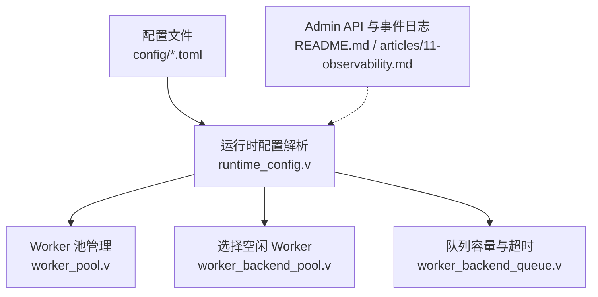
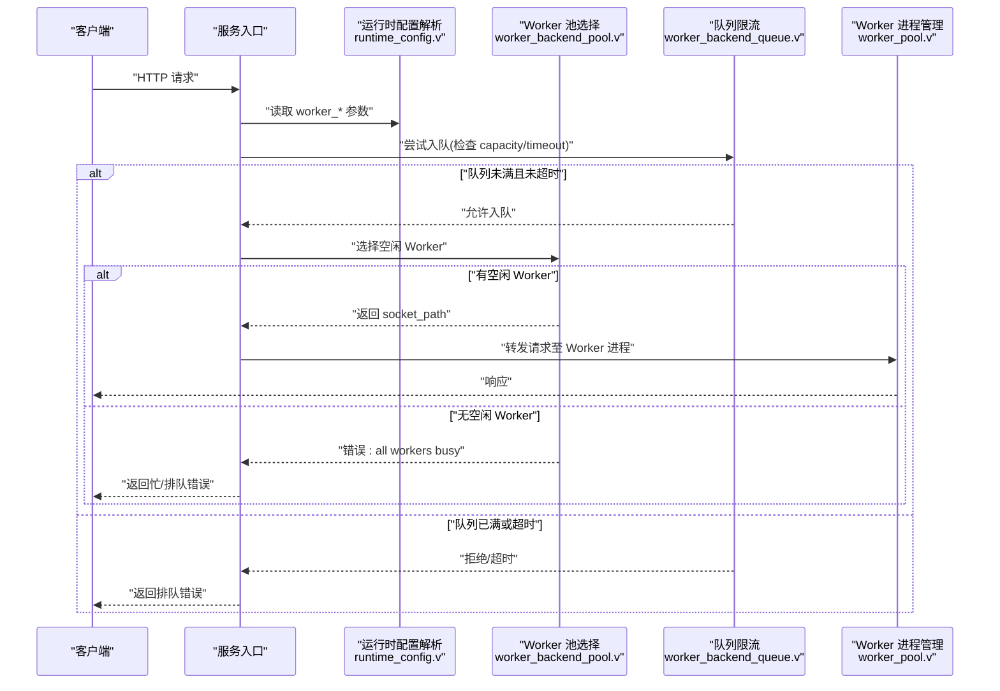
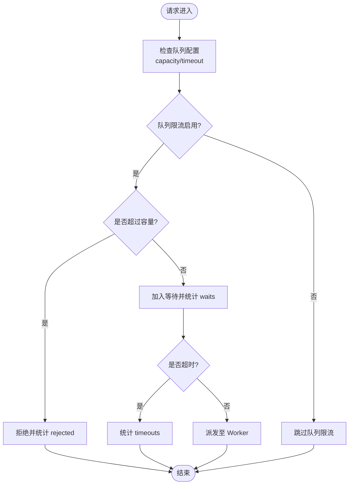
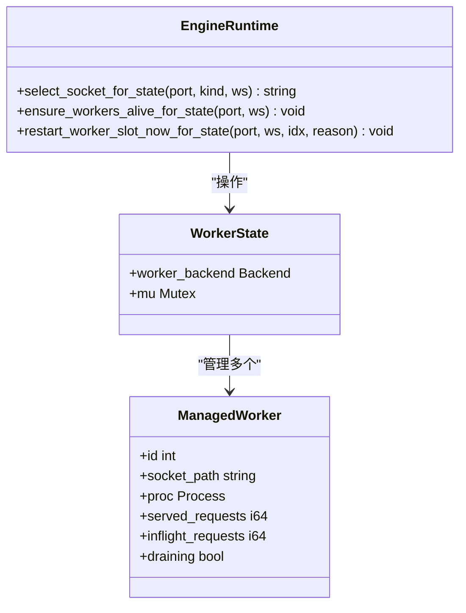
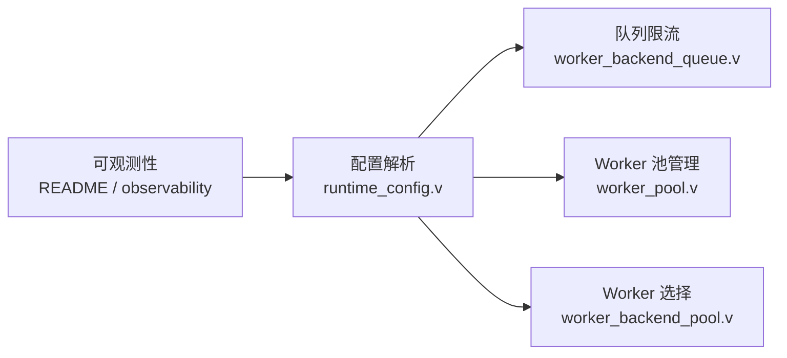

# Worker 扩缩容配置

<cite>
**本文引用的文件**   
- [config/vhttpd.example.toml](file://config/vhttpd.example.toml)
- [config/vhttpd.multi.example.toml](file://config/vhttpd.multi.example.toml)
- [src/server_lifecycle/runtime_config.v](file://src/server_lifecycle/runtime_config.v)
- [src/worker_backend_queue.v](file://src/worker_backend_queue.v)
- [src/upstream/transport/worker_pool.v](file://src/upstream/transport/worker_pool.v)
- [src/worker_backend_pool.v](file://src/worker_backend_pool.v)
- [README.md](file://README.md)
- [articles/11-observability.md](file://articles/11-observability.md)
</cite>

## 目录
1. [简介](#简介)
2. [项目结构](#项目结构)
3. [核心组件](#核心组件)
4. [架构总览](#架构总览)
5. [详细组件分析](#详细组件分析)
6. [依赖关系分析](#依赖关系分析)
7. [性能考量](#性能考量)
8. [故障排查指南](#故障排查指南)
9. [结论](#结论)
10. [附录：配置示例与最佳实践](#附录配置示例与最佳实践)

## 简介
本文件聚焦于 vhttpd 的 Worker 扩缩容相关配置与行为，覆盖静态扩缩容（最小/最大/初始实例数）、动态扩缩容触发条件（CPU、内存、队列长度、响应延迟）、冷却时间策略、扩缩容策略（渐进式、批量、滚动更新），以及监控与可观测性。需要特别说明的是：当前仓库未实现自动化的动态扩缩容控制器；动态扩缩容由外部进程管理器负责，vhttpd 提供静态池管理与队列限流能力，并通过 Admin API 暴露运行时指标以支撑外部决策。

## 项目结构
与 Worker 扩缩容相关的代码与配置主要分布在以下位置：
- 配置示例：config/*.toml
- 运行时配置解析：src/server_lifecycle/runtime_config.v
- Worker 池与生命周期：src/upstream/transport/worker_pool.v、src/worker_backend_pool.v
- 队列与等待限流：src/worker_backend_queue.v
- 文档与示例：README.md、articles/11-observability.md

图表来源
- [src/server_lifecycle/runtime_config.v:73-171](file://src/server_lifecycle/runtime_config.v#L73-L171)
- [src/upstream/transport/worker_pool.v:178-202](file://src/upstream/transport/worker_pool.v#L178-L202)
- [src/worker_backend_pool.v:60-124](file://src/worker_backend_pool.v#L60-L124)
- [src/worker_backend_queue.v:1-58](file://src/worker_backend_queue.v#L1-L58)

章节来源
- [config/vhttpd.example.toml:19-26](file://config/vhttpd.example.toml#L19-L26)
- [config/vhttpd.multi.example.toml:44-55](file://config/vhttpd.multi.example.toml#L44-L55)
- [src/server_lifecycle/runtime_config.v:73-171](file://src/server_lifecycle/runtime_config.v#L73-L171)

## 核心组件
- 运行时配置解析器：从 TOML 与 CLI 参数合并得到 worker 相关参数（如 pool_size、max_requests、queue_capacity、queue_timeout_ms、read_timeout_ms、重启退避等）。
- Worker 池启动与管理：根据 socket 列表启动子进程，维护进程状态、请求计数、draining 标志、重试退避等。
- Worker 选择与复用：优先选择空闲 Worker，否则回退到轮询或探测可用 socket。
- 队列限流：在入队前检查 queue_capacity 与 queue_timeout_ms，统计等待、拒绝、超时次数。

章节来源
- [src/server_lifecycle/runtime_config.v:84-95](file://src/server_lifecycle/runtime_config.v#L84-L95)
- [src/upstream/transport/worker_pool.v:178-202](file://src/upstream/transport/worker_pool.v#L178-L202)
- [src/worker_backend_pool.v:60-124](file://src/worker_backend_pool.v#L60-L124)
- [src/worker_backend_queue.v:11-58](file://src/worker_backend_queue.v#L11-L58)

## 架构总览
下图展示一次请求进入后，如何经过配置解析、Worker 选择、队列限流与执行的生命周期。

图表来源
- [src/server_lifecycle/runtime_config.v:84-95](file://src/server_lifecycle/runtime_config.v#L84-L95)
- [src/worker_backend_queue.v:11-58](file://src/worker_backend_queue.v#L11-L58)
- [src/worker_backend_pool.v:60-124](file://src/worker_backend_pool.v#L60-L124)
- [src/upstream/transport/worker_pool.v:178-202](file://src/upstream/transport/worker_pool.v#L178-L202)

## 详细组件分析

### 静态扩缩容配置（最小/最大/初始实例数）
- 初始实例数：通过 pool_size 控制，表示启动时创建的 Worker 数量。
- 最大实例数：当前版本未提供“最大实例数”配置项；pool_size 即为上限。
- 最小实例数：若 autostart=true，则系统会尽量保持已配置的 Worker 存活；当所有 Worker 均忙或 draining 时，不会自动扩容。
- 关键配置项与来源：
  - pool_size：TOML 中 [worker].pool_size 或 sites.*.worker.pool_size
  - autostart：是否自动启动并维持 Worker
  - max_requests：每个 Worker 处理请求数上限，达到后按退避策略重启
  - restart_backoff_ms / restart_backoff_max_ms：重启退避基线与上限
  - read_timeout_ms：Worker 读超时
  - queue_capacity / queue_timeout_ms：队列容量与等待超时

章节来源
- [config/vhttpd.example.toml:19-26](file://config/vhttpd.example.toml#L19-L26)
- [config/vhttpd.multi.example.toml:44-55](file://config/vhttpd.multi.example.toml#L44-L55)
- [src/server_lifecycle/runtime_config.v:84-95](file://src/server_lifecycle/runtime_config.v#L84-L95)
- [README.md:1065-1089](file://README.md#L1065-L1089)

### 动态扩缩容触发条件
- 现状说明：仓库未内置基于 CPU、内存、队列长度、响应时间的自动扩缩容控制器；动态扩缩容由外部进程管理器负责。
- 可观测性支撑：
  - Admin API 暴露 runtime 与 workers 指标，便于外部监控系统采集。
  - 事件日志（event_log）记录运行期事件，可用于离线分析与告警。
- 建议的外部触发指标：
  - CPU 使用率阈值
  - 内存占用上限
  - 请求队列长度（queue_waiting_requests、stat_queue_rejected_total、stat_queue_timeouts_total）
  - 响应时间延迟（P95/P99）

章节来源
- [README.md:1144](file://README.md#L1144)
- [articles/11-observability.md:602-666](file://articles/11-observability.md#L602-L666)

### 扩容冷却时间与避免频繁伸缩
- 重启退避：restart_backoff_ms 与 restart_backoff_max_ms 用于 Worker 异常退出后的指数退避，避免频繁重启风暴。
- 观察期与冷却：
  - 外部扩缩容控制器应结合队列深度、拒绝/超时计数、inflight 数量设置冷却窗口，避免抖动。
  - 可在 draining 完成后才进行下一轮扩缩容决策。

章节来源
- [src/upstream/transport/worker_pool.v:204-218](file://src/upstream/transport/worker_pool.v#L204-L218)
- [src/worker_backend_pool.v:72-90](file://src/worker_backend_pool.v#L72-L90)

### 扩缩容策略（渐进式、批量、滚动更新）
- 渐进式扩容：外部控制器可按步长逐步增加 pool_size，每次扩容后观察队列深度与拒绝/超时指标再决定是否继续。
- 批量扩缩容：在流量突增时一次性扩容 N 个实例，配合队列限流降低瞬时冲击。
- 滚动更新模式：利用 max_requests 与重启退避，分批替换旧 Worker；结合 draining 完成后再替换下一个槽位，保证平滑过渡。

章节来源
- [src/worker_backend_pool.v:72-90](file://src/worker_backend_pool.v#L72-L90)
- [src/upstream/transport/worker_pool.v:204-218](file://src/upstream/transport/worker_pool.v#L204-L218)

### 队列限流与背压
- 入队判断：当 queue_capacity <= 0 或 queue_timeout_ms <= 0 时不启用队列限流。
- 等待计数：queue_waiting_requests 记录当前等待中的请求数。
- 指标统计：stat_queue_waits_total、stat_queue_rejected_total、stat_queue_timeouts_total 分别统计等待、拒绝、超时次数。

图表来源
- [src/worker_backend_queue.v:11-58](file://src/worker_backend_queue.v#L11-L58)

章节来源
- [src/worker_backend_queue.v:11-58](file://src/worker_backend_queue.v#L11-L58)

### Worker 选择与空闲复用
- 优先选择空闲 Worker：遍历 sockets，跳过 draining 或 inflight > 0 的 Worker。
- 回退策略：若无空闲，尝试重启已完成 draining 的槽位；否则返回“全部忙碌”错误。
- 诊断信息：失败时会输出 worker_selection_diagnostics_for_state 的诊断 JSON。

图表来源
- [src/worker_backend_pool.v:60-124](file://src/worker_backend_pool.v#L60-L124)
- [src/upstream/transport/worker_pool.v:37-58](file://src/upstream/transport/worker_pool.v#L37-L58)

章节来源
- [src/worker_backend_pool.v:60-124](file://src/worker_backend_pool.v#L60-L124)

## 依赖关系分析
- 配置层：TOML 与 CLI 参数经 runtime_config.v 解析为 AppRuntimeBuildConfig，包含 worker_* 系列字段。
- 执行层：worker_pool.v 负责子进程生命周期与命令拼装；worker_backend_pool.v 负责选择与调度；worker_backend_queue.v 负责队列限流与统计。
- 可观测性：Admin API 与 event_log 提供运行时快照与事件轨迹，供外部监控与排障。

图表来源
- [src/server_lifecycle/runtime_config.v:73-171](file://src/server_lifecycle/runtime_config.v#L73-L171)
- [src/worker_backend_queue.v:1-58](file://src/worker_backend_queue.v#L1-L58)
- [src/upstream/transport/worker_pool.v:178-202](file://src/upstream/transport/worker_pool.v#L178-L202)
- [src/worker_backend_pool.v:60-124](file://src/worker_backend_pool.v#L60-L124)

章节来源
- [src/server_lifecycle/runtime_config.v:73-171](file://src/server_lifecycle/runtime_config.v#L73-L171)

## 性能考量
- pool_size 建议：参考 CPU 核心数 * 2 作为起点，结合业务 I/O 特性调整。
- max_requests：定期重启 Worker 以避免内存泄漏累积。
- 队列容量与超时：合理设置 queue_capacity 与 queue_timeout_ms，避免长时间排队导致用户体验下降。
- 读超时：短连接与普通请求使用较小超时；AI 流式场景需增大超时。

章节来源
- [articles/11-observability.md:622-666](file://articles/11-observability.md#L622-L666)

## 故障排查指南
- 查看运行时与 Worker 指标：
  - /admin/runtime：整体运行时指标
  - /admin/workers：各 Worker 的内存、请求计数等
- 关注队列指标：
  - stat_queue_waits_total、stat_queue_rejected_total、stat_queue_timeouts_total
- 常见症状与建议：
  - 大量 rejected/timeouts：提高 pool_size 或优化业务耗时
  - 内存持续增长：降低 max_requests 或修复内存泄漏
  - 频繁重启：检查崩溃原因并调大退避上限

章节来源
- [articles/11-observability.md:602-666](file://articles/11-observability.md#L602-L666)

## 结论
- vhttpd 当前提供稳定的静态 Worker 池与队列限流能力，适合与外部扩缩容控制器协同工作。
- 通过合理的 pool_size、max_requests、队列与超时配置，并结合 Admin API 与事件日志，可实现高可用的生产部署。
- 动态扩缩容应由外部系统驱动，依据队列深度、拒绝/超时计数与延迟指标进行渐进式扩容与冷却控制。

## 附录：配置示例与最佳实践

### 单站点 PHP Worker 示例
- 关键配置项：
  - [worker].pool_size：初始实例数
  - [worker].autostart：自动启动
  - [worker].max_requests：重启阈值
  - [worker].restart_backoff_ms / restart_backoff_max_ms：退避策略
  - [worker].read_timeout_ms：读超时
  - [worker].queue_capacity / queue_timeout_ms：队列限流
- 参考路径：
  - [config/vhttpd.example.toml:19-26](file://config/vhttpd.example.toml#L19-L26)

### 多站点示例（PHP 与 VJSX）
- 不同站点可独立配置 worker.pool_size 与 executor 类型。
- 参考路径：
  - [config/vhttpd.multi.example.toml:44-55](file://config/vhttpd.multi.example.toml#L44-L55)

### 命令行参数补充
- 常用参数：
  - --worker-pool-size N
  - --worker-max-requests N
  - --worker-restart-backoff-ms / --worker-restart-backoff-max-ms
  - --worker-read-timeout-ms
  - --worker-queue-capacity / --worker-queue-timeout-ms
- 参考路径：
  - [README.md:1065-1089](file://README.md#L1065-L1089)

### 动态扩缩容外部策略建议
- 触发条件：
  - 队列长度超过阈值持续一段时间
  - 拒绝/超时比率上升
  - 平均/分位延迟升高
- 冷却策略：
  - 扩容后等待至少一个观察窗口（例如 1-3 分钟）再评估
  - 缩容前确保 draining 完成且 inflight 降为零
- 渐进式扩容：
  - 每次扩容固定步长（如 2 或 4），避免一次性放大过多
- 滚动更新：
  - 借助 max_requests 分批重启，结合退避避免雪崩

[本节为概念性指导，无需源码引用]