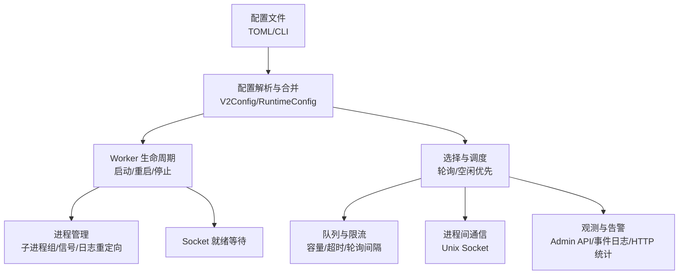
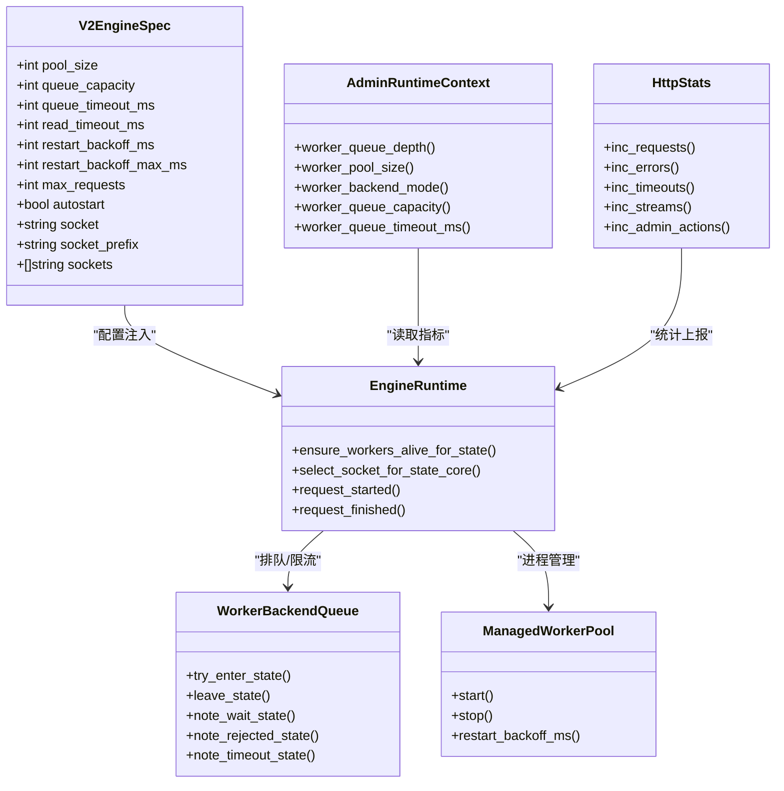

# Worker 池管理配置

<cite>
**本文引用的文件列表**
- [config/vhttpd.example.toml](file://config/vhttpd.example.toml)
- [src/config/v2_config.v](file://src/config/v2_config.v)
- [src/server_lifecycle/runtime_config.v](file://src/server_lifecycle/runtime_config.v)
- [src/upstream/transport/worker_pool.v](file://src/upstream/transport/worker_pool.v)
- [src/worker_backend_pool.v](file://src/worker_backend_pool.v)
- [src/worker_backend_queue.v](file://src/worker_backend_queue.v)
- [src/worker_backend_lifecycle_runtime.v](file://src/worker_backend_lifecycle_runtime.v)
- [src/worker_backend_admin_runtime.v](file://src/worker_backend_admin_runtime.v)
- [src/admin_runtime_context.v](file://src/admin_runtime_context.v)
- [src/http_stats.v](file://src/http_stats.v)
- [README.md](file://README.md)
- [tests/e2e/config_acceptance_test.sh](file://tests/e2e/config_acceptance_test.sh)
- [examples/wordpress/vhttpd.toml](file://examples/wordpress/vhttpd.toml)
- [articles/11-observability.md](file://articles/11-observability.md)
</cite>

## 目录
1. [简介](#简介)
2. [项目结构](#项目结构)
3. [核心组件](#核心组件)
4. [架构总览](#架构总览)
5. [详细组件分析](#详细组件分析)
6. [依赖关系分析](#依赖关系分析)
7. [性能与容量规划](#性能与容量规划)
8. [故障排查指南](#故障排查指南)
9. [结论](#结论)
10. [附录：完整配置示例与最佳实践](#附录完整配置示例与最佳实践)

## 简介
本文件面向运维与平台工程师，系统化说明 vhttpd 的 Worker 池管理配置与运行机制，覆盖以下主题：
- 动态扩缩容配置（最小/最大实例数、自动扩缩容触发条件、扩容冷却时间）
- 健康检查机制（检查间隔、失败阈值、恢复策略）
- 负载均衡策略（轮询、最少连接、权重分配）
- 进程间通信（Unix Socket 路径、消息队列大小、超时设置）
- 监控指标（活跃连接数、请求处理时间、错误率统计）
- 资源限制（CPU、内存、文件描述符）
- 完整配置示例与不同负载场景下的优化建议

## 项目结构
vhttpd 的 Worker 池相关能力由“配置解析 + 生命周期管理 + 选择与调度 + 队列与限流 + 观测与告警”等模块共同实现。关键源码位置如下：
- 配置模型与加载：V2 配置结构体、运行时参数合并
- 进程管理与启动：子进程组、Socket 就绪等待、重启退避
- 选择与调度：轮询与空闲优先、排队与拒绝
- 队列与限流：容量、等待超时、轮询间隔
- 观测与告警：Admin API、事件日志、HTTP 统计



图表来源
- [src/config/v2_config.v:120-155](file://src/config/v2_config.v#L120-L155)
- [src/server_lifecycle/runtime_config.v:89-171](file://src/server_lifecycle/runtime_config.v#L89-L171)
- [src/upstream/transport/worker_pool.v:103-136](file://src/upstream/transport/worker_pool.v#L103-L136)
- [src/worker_backend_pool.v:16-58](file://src/worker_backend_pool.v#L16-L58)
- [src/worker_backend_queue.v:60-119](file://src/worker_backend_queue.v#L60-L119)
- [src/admin_runtime_context.v:78-104](file://src/admin_runtime_context.v#L78-L104)
- [src/http_stats.v:1-31](file://src/http_stats.v#L1-L31)

章节来源
- [src/config/v2_config.v:120-155](file://src/config/v2_config.v#L120-L155)
- [src/server_lifecycle/runtime_config.v:89-171](file://src/server_lifecycle/runtime_config.v#L89-L171)
- [src/upstream/transport/worker_pool.v:103-136](file://src/upstream/transport/worker_pool.v#L103-L136)
- [src/worker_backend_pool.v:16-58](file://src/worker_backend_pool.v#L16-L58)
- [src/worker_backend_queue.v:60-119](file://src/worker_backend_queue.v#L60-L119)
- [src/admin_runtime_context.v:78-104](file://src/admin_runtime_context.v#L78-L104)
- [src/http_stats.v:1-31](file://src/http_stats.v#L1-L31)

## 核心组件
- 配置模型与运行时参数
  - V2 引擎规格包含 worker 相关字段：pool_size、queue_capacity、queue_timeout_ms、read_timeout_ms、restart_backoff_ms、restart_backoff_max_ms、max_requests、autostart、socket/socket_prefix/sockets 等
  - 运行时从 CLI 与配置中合并 worker 参数（如 --worker-pool-size、--worker-max-requests、--worker-restart-backoff-ms 等）
- 进程管理与健康
  - 通过子进程组启动 worker，按 socket 路径等待就绪；支持指数退避重启
  - 提供立即重启与后台重试两种路径，并记录 restart_count、next_retry_ts 等状态
- 选择与调度
  - 默认轮询；当 autostart 且存在空闲 worker 时优先选择空闲（最少连接语义）
  - 当所有 worker 忙时进入队列等待或拒绝
- 队列与限流
  - 可配置 queue_capacity、queue_timeout_ms、queue_poll_ms；满队直接拒绝，超时返回错误
- 观测与告警
  - Admin API 暴露 worker 状态、队列深度、池大小、后端模式等
  - HTTP 统计计数 requests/errors/timeouts/streams/admin_actions
  - 事件日志输出 worker 生命周期事件与选择失败诊断

章节来源
- [src/config/v2_config.v:120-155](file://src/config/v2_config.v#L120-L155)
- [src/server_lifecycle/runtime_config.v:89-171](file://src/server_lifecycle/runtime_config.v#L89-L171)
- [src/upstream/transport/worker_pool.v:103-136](file://src/upstream/transport/worker_pool.v#L103-L136)
- [src/worker_backend_pool.v:16-58](file://src/worker_backend_pool.v#L16-L58)
- [src/worker_backend_queue.v:60-119](file://src/worker_backend_queue.v#L60-L119)
- [src/admin_runtime_context.v:78-104](file://src/admin_runtime_context.v#L78-L104)
- [src/http_stats.v:1-31](file://src/http_stats.v#L1-L31)

## 架构总览
下图展示 Worker 池在请求处理中的关键交互：选择器、队列、进程管理与观测点。

```mermaid
sequenceDiagram
participant Client as "客户端"
participant Server as "vhttpd 服务"
participant Selector as "选择器(轮询/空闲优先)"
participant Queue as "队列(容量/超时)"
participant Pool as "Worker 池(进程管理)"
participant W as "具体 Worker 进程(Unix Socket)"
Client->>Server : "HTTP 请求"
Server->>Selector : "select_socket_for_state_core()"
alt 有可用空闲 Worker
Selector-->>Server : "返回 socket_path"
else 全部忙
Server->>Queue : "try_enter_state() 判断容量"
alt 队列未满
Queue-->>Server : "允许等待"
loop 轮询直到超时
Server->>Selector : "再次尝试选择"
alt 出现空闲
Selector-->>Server : "返回 socket_path"
break
end
end
alt 超时仍未获得
Queue-->>Server : "返回 'worker queue timeout'"
end
else 队列已满
Queue-->>Server : "返回 'worker queue full'"
end
end
Server->>W : "通过 Unix Socket 转发请求"
W-->>Server : "响应"
Server-->>Client : "返回结果"
```

图表来源
- [src/worker_backend_pool.v:60-124](file://src/worker_backend_pool.v#L60-L124)
- [src/worker_backend_queue.v:60-119](file://src/worker_backend_queue.v#L60-L119)
- [src/upstream/transport/worker_pool.v:63-74](file://src/upstream/transport/worker_pool.v#L63-L74)

## 详细组件分析

### 配置模型与运行时参数
- V2 引擎规格（worker 相关）
  - pool_size：初始池大小
  - queue_capacity / queue_timeout_ms / queue_poll_ms：队列容量、等待超时、轮询间隔
  - read_timeout_ms：读取超时
  - restart_backoff_ms / restart_backoff_max_ms：重启退避基值与上限
  - max_requests：单实例最大请求数（用于周期性重启）
  - autostart：是否自动拉起 worker
  - socket / socket_prefix / sockets：指定单个 socket 或前缀生成多个 socket，或直接指定列表
- 运行时参数合并
  - CLI 参数优先级高于配置项，例如 --worker-pool-size、--worker-max-requests、--worker-restart-backoff-ms、--worker-restart-backoff-max-ms、--worker-queue-capacity、--worker-queue-timeout-ms 等

章节来源
- [src/config/v2_config.v:120-155](file://src/config/v2_config.v#L120-L155)
- [src/server_lifecycle/runtime_config.v:89-171](file://src/server_lifecycle/runtime_config.v#L89-L171)
- [README.md:1065-1089](file://README.md#L1065-L1089)

### 进程管理与健康检查
- 启动流程
  - 使用子进程组启动 worker，自动注入 --socket 或使用 {socket} 占位符
  - 等待 socket 就绪（带超时），失败则记录 next_retry_ts 并延迟重试
- 健康检查与恢复
  - 定期检查进程存活；若退出则按指数退避重启
  - 支持立即重启（SIGTERM/SIGKILL 整进程组）与后台定时重启
  - 记录 restart_count、last_exit_ts、next_retry_ts 等状态
- 优雅退出与排空
  - draining 标记用于平滑下线；当 inflight_requests 为 0 时可安全重启

章节来源
- [src/upstream/transport/worker_pool.v:103-136](file://src/upstream/transport/worker_pool.v#L103-L136)
- [src/upstream/transport/worker_pool.v:155-176](file://src/upstream/transport/worker_pool.v#L155-L176)
- [src/worker_backend_lifecycle_runtime.v:8-70](file://src/worker_backend_lifecycle_runtime.v#L8-L70)
- [src/worker_backend_lifecycle_runtime.v:72-134](file://src/worker_backend_lifecycle_runtime.v#L72-L134)
- [src/worker_backend_lifecycle_runtime.v:149-156](file://src/worker_backend_lifecycle_runtime.v#L149-L156)

### 负载均衡策略
- 轮询（Round Robin）
  - 基础策略：rr_index 循环选择下一个 socket
- 空闲优先（Least Connections 近似）
  - 当 autostart 且存在空闲 worker（draining=false 且 inflight_requests=0）时优先选择
- 权重分配
  - 当前未实现显式权重；可通过多套独立池（不同 socket 集合）+ 路由分流实现等效效果

章节来源
- [src/worker_backend_pool.v:16-58](file://src/worker_backend_pool.v#L16-L58)
- [src/worker_backend_pool.v:60-124](file://src/worker_backend_pool.v#L60-L124)

### 进程间通信（IPC）
- 传输介质：Unix Domain Socket
- 路径配置
  - 单 socket：socket
  - 前缀生成：socket_prefix（结合 pool_size 生成 _0.sock, _1.sock ...）
  - 显式列表：sockets
- 命令注入
  - 当 pool_size > 1 且 worker_cmd 不含 --socket 时自动注入；若含 {socket} 占位符则替换
- 队列与超时
  - queue_capacity：队列容量
  - queue_timeout_ms：等待超时
  - queue_poll_ms：轮询间隔（默认 10ms）

章节来源
- [src/upstream/transport/worker_pool.v:76-93](file://src/upstream/transport/worker_pool.v#L76-L93)
- [src/worker_backend_queue.v:60-119](file://src/worker_backend_queue.v#L60-L119)
- [README.md:1065-1089](file://README.md#L1065-L1089)

### 监控指标与观测
- Admin API
  - /admin/workers：worker 状态（alive/draining/inflight/restarts）
  - /admin/stats：运行时计数器（total/error/timeout/stream/admin actions）
  - /admin/runtime：运行时能力标志与活跃会话数，包含 worker 队列设置与计数
- HTTP 统计
  - requests_total、errors_total、timeouts_total、streams_total、admin_actions_total
- 事件日志
  - worker.started / worker.restarted / worker.restart_scheduled / worker.select.failed 等事件

章节来源
- [src/admin_runtime_context.v:78-104](file://src/admin_runtime_context.v#L78-L104)
- [src/http_stats.v:1-31](file://src/http_stats.v#L1-L31)
- [README.md:1091-1120](file://README.md#L1091-L1120)
- [src/worker_backend_lifecycle_runtime.v:45-70](file://src/worker_backend_lifecycle_runtime.v#L45-L70)
- [src/worker_backend_lifecycle_runtime.v:127-134](file://src/worker_backend_lifecycle_runtime.v#L127-L134)
- [src/worker_backend_pool.v:126-136](file://src/worker_backend_pool.v#L126-L136)

### 动态扩缩容
- 最小/最大实例数
  - 当前版本未内置基于指标的自动扩缩容控制器；最小/最大需通过外部编排（如 systemd/kubernetes）或自定义脚本驱动
- 自动扩缩容触发条件（建议）
  - 队列积压超过阈值持续 N 分钟
  - 空闲 worker 数为 0 持续 M 分钟
  - 错误率或超时率超过阈值
- 扩容冷却时间（建议）
  - 基于重启退避策略（指数退避）避免抖动；可在外部扩缩容逻辑中加入冷却期（如 2-5 分钟）

章节来源
- [src/worker_backend_queue.v:60-119](file://src/worker_backend_queue.v#L60-L119)
- [src/worker_backend_lifecycle_runtime.v:8-70](file://src/worker_backend_lifecycle_runtime.v#L8-L70)
- [src/upstream/transport/worker_pool.v:204-218](file://src/upstream/transport/worker_pool.v#L204-L218)

### 健康检查机制
- 检查间隔
  - 内部通过 ensure_workers_alive_for_state 周期检查；Socket 就绪等待带固定超时
- 失败阈值
  - 连续失败次数通过 restart_count 体现；next_retry_ts 控制下次重试时间
- 恢复策略
  - 指数退避重启；支持立即 SIGTERM/SIGKILL 整进程组后重启；draining 完成后自动恢复

章节来源
- [src/worker_backend_lifecycle_runtime.v:8-70](file://src/worker_backend_lifecycle_runtime.v#L8-L70)
- [src/worker_backend_lifecycle_runtime.v:72-134](file://src/worker_backend_lifecycle_runtime.v#L72-L134)
- [src/upstream/transport/worker_pool.v:63-74](file://src/upstream/transport/worker_pool.v#L63-L74)

### 资源限制
- CPU/内存/文件描述符
  - 当前代码未内建针对 worker 进程的 CPU/内存/FD 限制；建议在容器化或系统层（cgroups/systemd）进行限制
- 建议
  - 使用 cgroup v2 限制 CPU quota、memory.max、tasks.max（FD 通过 LimitNOFILE 或 ulimit）
  - 结合 max_requests 定期重启以缓解内存泄漏风险

章节来源
- [src/config/v2_config.v:120-155](file://src/config/v2_config.v#L120-L155)
- [articles/11-observability.md:622-666](file://articles/11-observability.md#L622-L666)

## 依赖关系分析
- 配置到运行时的映射
  - V2Config.EngineSpec -> RuntimeConfig -> EngineRuntime
- 选择器与队列
  - select_socket_for_state_core -> WorkerBackendQueue.try_enter_state/select_socket_queued_for_state
- 进程管理
  - ManagedWorkerPool.start/stop -> ensure_worker_slot_for_state/restart_worker_slot_now_for_state
- 观测
  - admin_runtime_context 聚合 metrics；http_stats 维护全局计数



图表来源
- [src/config/v2_config.v:120-155](file://src/config/v2_config.v#L120-L155)
- [src/worker_backend_pool.v:60-124](file://src/worker_backend_pool.v#L60-L124)
- [src/worker_backend_queue.v:60-119](file://src/worker_backend_queue.v#L60-L119)
- [src/upstream/transport/worker_pool.v:178-218](file://src/upstream/transport/worker_pool.v#L178-L218)
- [src/admin_runtime_context.v:78-104](file://src/admin_runtime_context.v#L78-L104)
- [src/http_stats.v:1-31](file://src/http_stats.v#L1-L31)

## 性能与容量规划
- 并发与吞吐
  - pool_size 建议参考 CPU 核数与 IO 特性；IO 密集可适当放大
  - queue_capacity 与 queue_timeout_ms 决定拥塞缓冲能力与用户体验
- 超时与稳定性
  - read_timeout_ms 需区分普通请求与长耗时流式请求
  - max_requests 用于周期性重启，防止内存泄漏累积
- 观测与告警
  - 关注队列长度、错误率、超时率、空闲 worker 数
  - 结合事件日志快速定位问题

章节来源
- [articles/11-observability.md:622-666](file://articles/11-observability.md#L622-L666)
- [README.md:1091-1120](file://README.md#L1091-L1120)

## 故障排查指南
- 常见症状
  - 请求堆积、响应缓慢：可能因 worker 忙或队列溢出
  - 频繁重启：可能因崩溃或启动失败，关注 next_retry_ts 与 restart_count
- 排查步骤
  - 查看 /admin/workers 与 /admin/runtime 获取实时状态
  - 观察事件日志中的 worker.* 事件
  - 检查队列指标（waiting、rejected、timeout）
- 解决方案
  - 调整 pool_size、queue_capacity、read_timeout_ms
  - 设置合理的 max_requests 定期重启
  - 对异常 worker 执行单独重启

章节来源
- [src/worker_backend_admin_runtime.v:42-82](file://src/worker_backend_admin_runtime.v#L42-L82)
- [src/admin_runtime_context.v:78-104](file://src/admin_runtime_context.v#L78-L104)
- [src/worker_backend_lifecycle_runtime.v:45-70](file://src/worker_backend_lifecycle_runtime.v#L45-L70)
- [src/worker_backend_pool.v:126-136](file://src/worker_backend_pool.v#L126-L136)

## 结论
vhttpd 的 Worker 池提供了稳定的进程管理、灵活的负载均衡与完善的观测能力。当前版本未内置自动扩缩容控制器，但通过队列与退避机制已具备良好弹性基础。生产环境建议结合外部编排系统与资源限制策略，配合监控告警实现高可用与高性能。

## 附录：完整配置示例与最佳实践

### 配置示例（TOML）
- 基础示例
  - 参见 [config/vhttpd.example.toml](file://config/vhttpd.example.toml)
- WordPress 站点示例（含 executor.worker 配置）
  - 参见 [examples/wordpress/vhttpd.toml](file://examples/wordpress/vhttpd.toml)
- e2e 测试用例（队列与超时）
  - 参见 [tests/e2e/config_acceptance_test.sh](file://tests/e2e/config_acceptance_test.sh)

章节来源
- [config/vhttpd.example.toml:19-26](file://config/vhttpd.example.toml#L19-L26)
- [examples/wordpress/vhttpd.toml:90-106](file://examples/wordpress/vhttpd.toml#L90-L106)
- [tests/e2e/config_acceptance_test.sh:2229-2295](file://tests/e2e/config_acceptance_test.sh#L2229-L2295)

### 最佳实践建议
- 动态扩缩容
  - 最小实例数：至少保留 1 个空闲 worker 保障冷启动体验
  - 最大实例数：根据 CPU 核数与业务峰值设定上限，避免过度扩张
  - 触发条件：队列长度 > 阈值、空闲 worker = 0、错误率 > 阈值
  - 冷却时间：扩容后冷却 2-5 分钟，避免抖动
- 健康检查
  - 检查间隔：利用现有 ensure_workers_alive_for_state 机制
  - 失败阈值：结合 restart_count 与 next_retry_ts 评估
  - 恢复策略：指数退避 + 立即重启组合
- 负载均衡
  - 默认轮询 + 空闲优先；如需权重，采用多池 + 路由分流
- IPC 配置
  - 明确 socket 路径与前缀策略；确保权限正确
  - 合理设置 queue_capacity 与 queue_timeout_ms，避免雪崩
- 监控与告警
  - 关注 /admin/workers、/admin/stats、/admin/runtime
  - 建立告警规则：无空闲 worker、队列积压、高错误率、上游断开
- 资源限制
  - 使用 cgroup/systemd 限制 CPU、内存、FD
  - 设置 max_requests 定期重启，降低内存泄漏影响

章节来源
- [src/worker_backend_queue.v:60-119](file://src/worker_backend_queue.v#L60-L119)
- [src/worker_backend_lifecycle_runtime.v:8-70](file://src/worker_backend_lifecycle_runtime.v#L8-L70)
- [src/worker_backend_pool.v:16-58](file://src/worker_backend_pool.v#L16-L58)
- [src/admin_runtime_context.v:78-104](file://src/admin_runtime_context.v#L78-L104)
- [articles/11-observability.md:469-526](file://articles/11-observability.md#L469-L526)