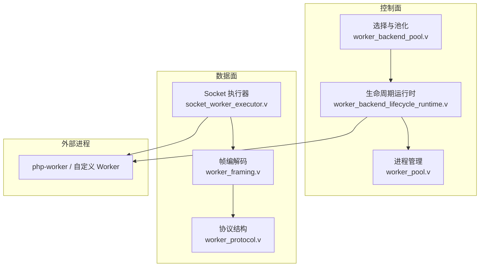
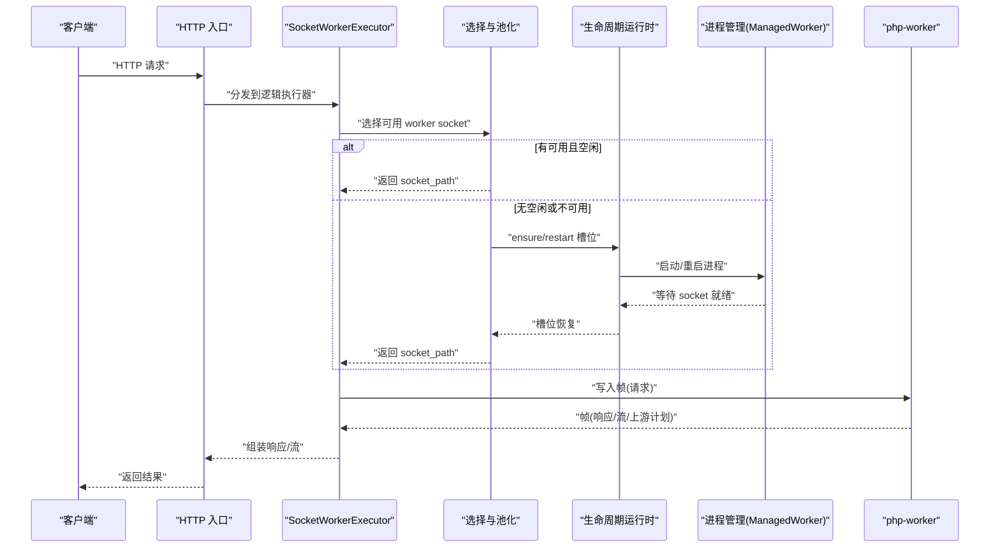
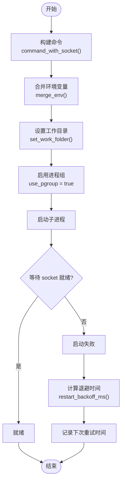
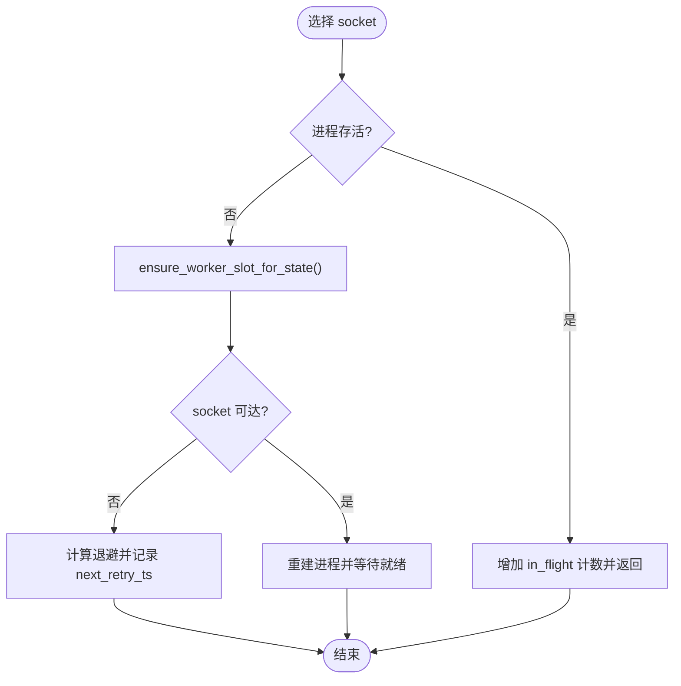
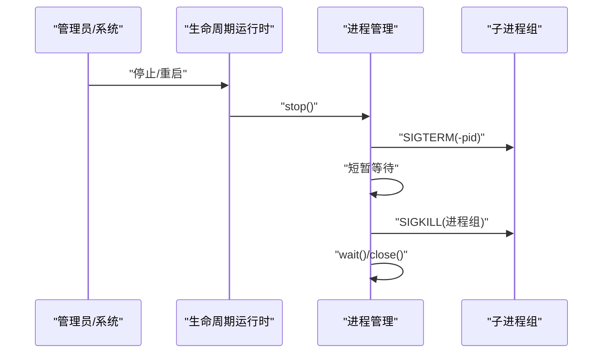
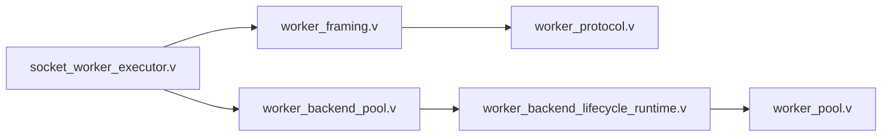

# Worker 生命周期管理

<cite>
**本文引用的文件**
- [src/upstream/transport/worker_pool.v](file://src/upstream/transport/worker_pool.v)
- [src/worker_backend_lifecycle_runtime.v](file://src/worker_backend_lifecycle_runtime.v)
- [src/worker_backend_pool.v](file://src/worker_backend_pool.v)
- [src/executor/socket_worker_executor.v](file://src/executor/socket_worker_executor.v)
- [src/upstream/transport/worker_framing.v](file://src/upstream/transport/worker_framing.v)
- [src/upstream/transport/worker_protocol.v](file://src/upstream/transport/worker_protocol.v)
- [README.md](file://README.md)
- [articles/11-observability.md](file://articles/11-observability.md)
- [tests/e2e/config_acceptance_test.sh](file://tests/e2e/config_acceptance_test.sh)
</cite>

## 目录
1. [简介](#简介)
2. [项目结构](#项目结构)
3. [核心组件](#核心组件)
4. [架构总览](#架构总览)
5. [详细组件分析](#详细组件分析)
6. [依赖关系分析](#依赖关系分析)
7. [性能与容量规划](#性能与容量规划)
8. [故障排除指南](#故障排除指南)
9. [结论](#结论)
10. [附录：配置示例](#附录配置示例)

## 简介
本文件聚焦 vhttpd 的 Worker 生命周期管理，覆盖进程启动、监控与健康检查、优雅关闭、进程组管理、状态监控与可观测性，并提供完整配置示例与常见故障排查方案。目标是帮助运维与开发者稳定地部署和调优基于外部 Worker（如 php-worker）的应用。

## 项目结构
vhttpd 将“Worker 进程如何存活”的职责集中在 transport 层与生命周期运行时中；协议与帧编解码位于 transport 子模块；执行器通过 Unix Socket 与 Worker 通信。

图表来源
- [src/worker_backend_lifecycle_runtime.v:1-157](file://src/worker_backend_lifecycle_runtime.v#L1-L157)
- [src/worker_backend_pool.v:1-137](file://src/worker_backend_pool.v#L1-L137)
- [src/upstream/transport/worker_pool.v:1-219](file://src/upstream/transport/worker_pool.v#L1-L219)
- [src/executor/socket_worker_executor.v:1-157](file://src/executor/socket_worker_executor.v#L1-L157)
- [src/upstream/transport/worker_framing.v:1-231](file://src/upstream/transport/worker_framing.v#L1-L231)
- [src/upstream/transport/worker_protocol.v:1-277](file://src/upstream/transport/worker_protocol.v#L1-L277)

章节来源
- [README.md:430-520](file://README.md#L430-L520)

## 核心组件
- 进程管理与重启策略：负责命令构建、环境变量注入、工作目录设置、进程组使用、健康等待与退避重启。
- 生命周期运行时：在请求路径上确保 Worker 槽位存活，处理失败重试与事件上报。
- 选择与池化：空闲/忙闲探测、轮询选择、Drain 后自动重启。
- Socket 执行器：按 kind 选择 socket，编码请求并发送，解析响应或流式帧。
- 帧与协议：二进制帧长度头 + JSON 负载；定义 HTTP/Stream/UpstreamPlan/WebSocket/MCP 等消息结构。

章节来源
- [src/upstream/transport/worker_pool.v:76-136](file://src/upstream/transport/worker_pool.v#L76-L136)
- [src/worker_backend_lifecycle_runtime.v:8-70](file://src/worker_backend_lifecycle_runtime.v#L8-L70)
- [src/worker_backend_pool.v:60-124](file://src/worker_backend_pool.v#L60-L124)
- [src/executor/socket_worker_executor.v:43-95](file://src/executor/socket_worker_executor.v#L43-L95)
- [src/upstream/transport/worker_framing.v:10-60](file://src/upstream/transport/worker_framing.v#L10-L60)
- [src/upstream/transport/worker_protocol.v:4-93](file://src/upstream/transport/worker_protocol.v#L4-L93)

## 架构总览
下图展示一次 HTTP 请求从入口到 Worker 的端到端流程，以及 Worker 异常时的自动重启路径。

图表来源
- [src/executor/socket_worker_executor.v:43-95](file://src/executor/socket_worker_executor.v#L43-L95)
- [src/worker_backend_pool.v:60-124](file://src/worker_backend_pool.v#L60-L124)
- [src/worker_backend_lifecycle_runtime.v:8-70](file://src/worker_backend_lifecycle_runtime.v#L8-L70)
- [src/upstream/transport/worker_pool.v:103-136](file://src/upstream/transport/worker_pool.v#L103-L136)

## 详细组件分析

### 进程启动流程
- 命令构建
  - 若未显式提供 cmd，则根据 [php] 段自动生成；支持 {socket} 占位符或在缺少 --socket 时自动追加。
  - 当 pool_size > 1 且命令包含 --socket 时会报错，避免多实例冲突。
- 环境变量注入
  - 合并系统环境与 [worker.env]，并注入 VHTTPD_PARENT_PID 供子进程识别父进程。
  - 当存在 [php].app_entry 时，VHTTPD_APP 会被自动填充。
- 工作目录设置
  - 通过 workdir 参数设置子进程工作目录，便于应用相对路径解析。
- 进程组与日志重定向
  - 使用进程组（pgroup）以便统一信号传播；对特定命令（如 vphp-worker/php-cgi）附加标准输出重定向。
- 健康等待
  - 启动后轮询连接 worker_socket，超时则视为启动失败并进入退避重启。

图表来源
- [src/upstream/transport/worker_pool.v:76-136](file://src/upstream/transport/worker_pool.v#L76-L136)
- [src/worker_backend_lifecycle_runtime.v:27-44](file://src/worker_backend_lifecycle_runtime.v#L27-L44)

章节来源
- [src/upstream/transport/worker_pool.v:76-136](file://src/upstream/transport/worker_pool.v#L76-L136)
- [README.md:605-617](file://README.md#L605-L617)

### 进程监控与健康检查
- 健康检查间隔
  - 启动阶段：等待 socket 就绪的超时窗口（默认数秒级）。
  - 运行期：在每次请求选择 socket 前，会遍历槽位并确保存活；若进程已退出或无法连接，触发重启。
- 失败检测策略
  - 进程存活判断：is_alive() 与 socket 连通性探测。
  - 退避重启：基于 restart_count 指数退避，上限受 max 限制。
- 自动重启逻辑
  - 在 ensure_worker_slot_for_state 中按需重启；draining 完成后立即尝试重启以恢复容量。

图表来源
- [src/worker_backend_pool.v:60-124](file://src/worker_backend_pool.v#L60-L124)
- [src/worker_backend_lifecycle_runtime.v:8-70](file://src/worker_backend_lifecycle_runtime.v#L8-L70)
- [src/upstream/transport/worker_pool.v:204-218](file://src/upstream/transport/worker_pool.v#L204-L218)

章节来源
- [src/worker_backend_pool.v:60-124](file://src/worker_backend_pool.v#L60-L124)
- [src/worker_backend_lifecycle_runtime.v:8-70](file://src/worker_backend_lifecycle_runtime.v#L8-L70)
- [src/upstream/transport/worker_pool.v:204-218](file://src/upstream/transport/worker_pool.v#L204-L218)

### 优雅关闭与强制终止
- SIGTERM 处理
  - 停止时向整个子进程组发送 SIGTERM，允许后代进程完成收尾。
- 请求完成等待
  - 短暂休眠后仍存活的进程组将被 SIGKILL 强制终止，防止僵尸残留。
- 资源清理
  - 调用 wait/close 释放句柄，重置状态。

图表来源
- [src/upstream/transport/worker_pool.v:155-169](file://src/upstream/transport/worker_pool.v#L155-L169)

章节来源
- [src/upstream/transport/worker_pool.v:155-169](file://src/upstream/transport/worker_pool.v#L155-L169)

### 进程组管理
- 父子进程关系
  - 通过 use_pgroup 启用进程组，所有子进程及其后代共享同一进程组 ID。
- 信号传播
  - 对负 PID 发送 SIGTERM/SIGKILL，确保整组进程收到信号。
- 资源清理
  - 统一 wait/close，避免孤儿进程与资源泄漏。

章节来源
- [src/upstream/transport/worker_pool.v:117-123](file://src/upstream/transport/worker_pool.v#L117-L123)
- [src/upstream/transport/worker_pool.v:155-169](file://src/upstream/transport/worker_pool.v#L155-L169)

### 请求路由与队列语义
- 空闲优先选择
  - 优先选择 inflight_requests == 0 且非 draining 的 worker；否则回退为轮询。
- Drain 语义
  - 处于 draining 且无 in-flight 的 worker 会被立即重启以恢复容量。
- 队列能力
  - 通过 queue_capacity/queue_timeout 等配置控制排队行为（见附录示例）。

章节来源
- [src/worker_backend_pool.v:30-58](file://src/worker_backend_pool.v#L30-L58)
- [src/worker_backend_pool.v:72-91](file://src/worker_backend_pool.v#L72-L91)
- [tests/e2e/config_acceptance_test.sh:2233-2295](file://tests/e2e/config_acceptance_test.sh#L2233-L2295)

### 协议与帧传输
- 帧格式
  - 4 字节大端长度头 + JSON 负载；读取时校验大小范围。
- 请求编码
  - 标准化 path/query，合并 headers/cookies/server 信息，注入 x-request-id/x-vhttpd-trace-id。
- 响应类型
  - 普通响应、流式 start/chunk/end、UpstreamPlan 等由不同结构体承载。

章节来源
- [src/upstream/transport/worker_framing.v:10-60](file://src/upstream/transport/worker_framing.v#L10-L60)
- [src/upstream/transport/worker_framing.v:169-203](file://src/upstream/transport/worker_framing.v#L169-L203)
- [src/upstream/transport/worker_protocol.v:4-93](file://src/upstream/transport/worker_protocol.v#L4-L93)

## 依赖关系分析
- 低耦合高内聚
  - 进程管理（worker_pool.v）仅关注进程生命周期与信号；生命周期运行时（worker_backend_lifecycle_runtime.v）编排健康检查与重启；选择与池化（worker_backend_pool.v）负责调度；执行器（socket_worker_executor.v）专注协议交互。
- 关键依赖链
  - 执行器 -> 帧编解码 -> 协议结构 -> Worker 进程
  - 生命周期运行时 -> 进程管理 -> 操作系统进程 API
- 潜在循环
  - 当前模块间单向依赖，未见循环引用。

图表来源
- [src/executor/socket_worker_executor.v:1-157](file://src/executor/socket_worker_executor.v#L1-L157)
- [src/upstream/transport/worker_framing.v:1-231](file://src/upstream/transport/worker_framing.v#L1-L231)
- [src/upstream/transport/worker_protocol.v:1-277](file://src/upstream/transport/worker_protocol.v#L1-L277)
- [src/worker_backend_pool.v:1-137](file://src/worker_backend_pool.v#L1-L137)
- [src/worker_backend_lifecycle_runtime.v:1-157](file://src/worker_backend_lifecycle_runtime.v#L1-L157)
- [src/upstream/transport/worker_pool.v:1-219](file://src/upstream/transport/worker_pool.v#L1-L219)

## 性能与容量规划
- 并发与池大小
  - pool_size 建议与 CPU 核数匹配或略高；结合 read_timeout_ms 评估吞吐。
- 队列与背压
  - queue_capacity 与 queue_timeout_ms 决定最大排队与等待时长，避免雪崩。
- 内存与长驻
  - 通过 max_requests 定期重启 Worker，缓解内存增长。
- 超时与流式
  - 流式场景适当提高 read_timeout_ms，保障长连接稳定性。

[本节为通用指导，不直接分析具体文件]

## 故障排除指南
- 启动失败
  - 症状：socket 未就绪、命令缺失、路径不存在。
  - 排查：检查 [worker.cmd]/[php.worker_entry]/[php.app_entry] 是否存在；确认 {socket} 占位符或 --socket 注入是否正确；查看临时日志输出。
- 频繁重启
  - 症状：next_retry_ts 不断推迟、restart_count 上升。
  - 排查：观察 worker.error 事件；检查应用崩溃堆栈；调整退避参数或修复根因。
- 无空闲 Worker
  - 症状：all workers busy/drain。
  - 排查：增大 pool_size；优化业务耗时；检查是否长时间占用连接。
- 优雅关闭残留
  - 症状：进程组未完全退出。
  - 排查：确认子进程是否正确捕获 SIGTERM；必要时延长等待或调整 kill 策略。

章节来源
- [articles/11-observability.md:333-405](file://articles/11-observability.md#L333-L405)
- [tests/e2e/config_acceptance_test.sh:2089-2115](file://tests/e2e/config_acceptance_test.sh#L2089-L2115)

## 结论
vhttpd 的 Worker 生命周期管理围绕“健壮启动、快速自愈、可控关闭、可观测”的目标设计。通过进程组、退避重启、空闲优先选择与统一的帧/协议抽象，既保证了高可用，也提供了丰富的运维接口与排障手段。合理配置池大小、超时与队列参数，并结合事件日志与 admin 快照，可实现稳定的生产运行。

## 附录：配置示例
以下示例来自测试脚本与文档，涵盖 autostart、read_timeout_ms、pool_size、queue_*、socket、cmd、env 等关键字段。

- 基础 Worker 配置（含 env 注入）
  - 参考：[tests/e2e/config_acceptance_test.sh:2089-2115](file://tests/e2e/config_acceptance_test.sh#L2089-L2115)
- 带队列能力的 Worker 配置
  - 参考：[tests/e2e/config_acceptance_test.sh:2233-2295](file://tests/e2e/config_acceptance_test.sh#L2233-L2295)
- TOML 全局示例（含 [worker]、[worker.env]、[php] 等）
  - 参考：[README.md:449-517](file://README.md#L449-L517)

章节来源
- [tests/e2e/config_acceptance_test.sh:2089-2115](file://tests/e2e/config_acceptance_test.sh#L2089-L2115)
- [tests/e2e/config_acceptance_test.sh:2233-2295](file://tests/e2e/config_acceptance_test.sh#L2233-L2295)
- [README.md:449-517](file://README.md#L449-L517)