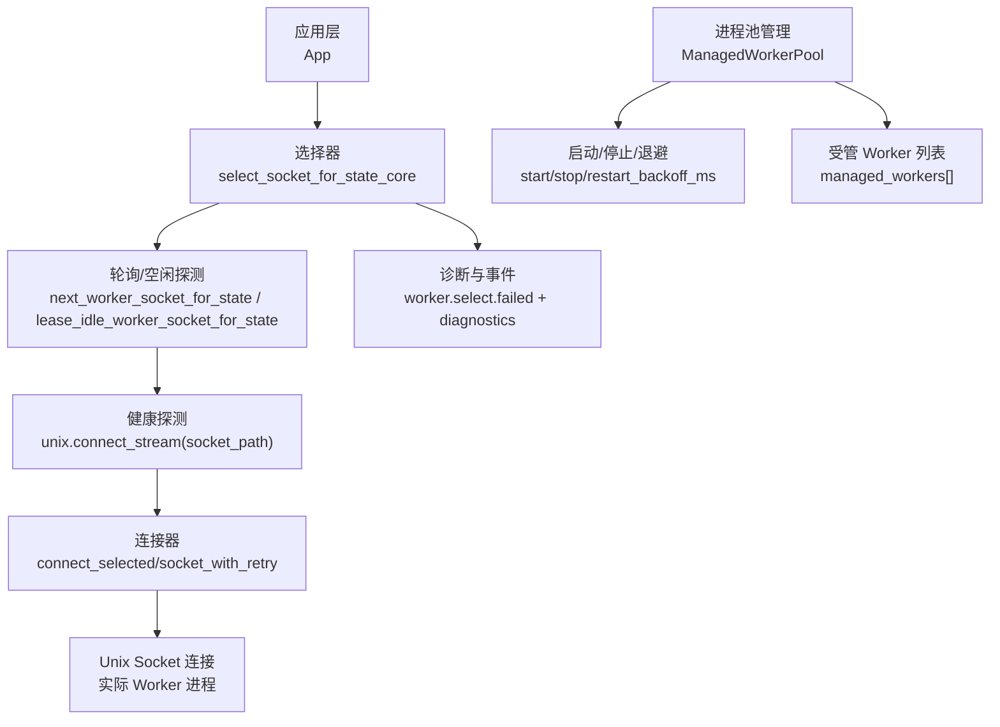
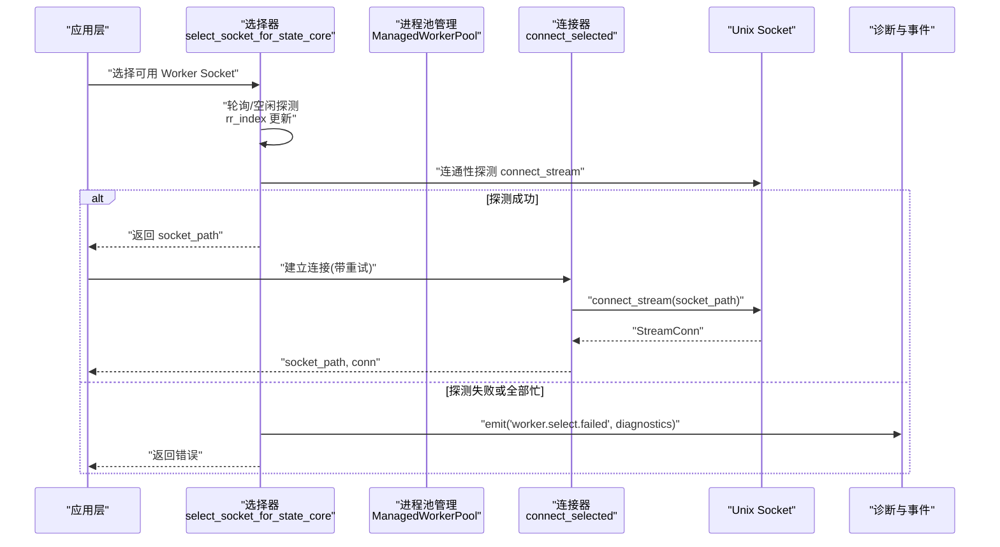
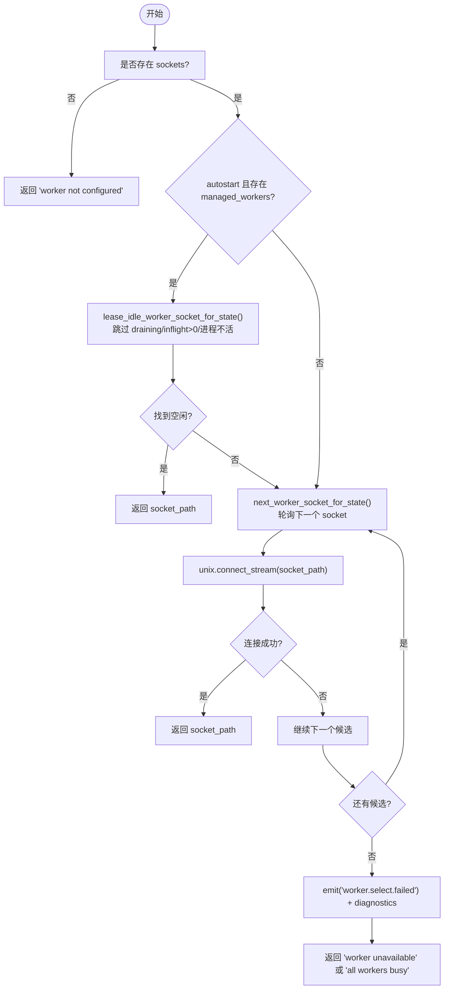
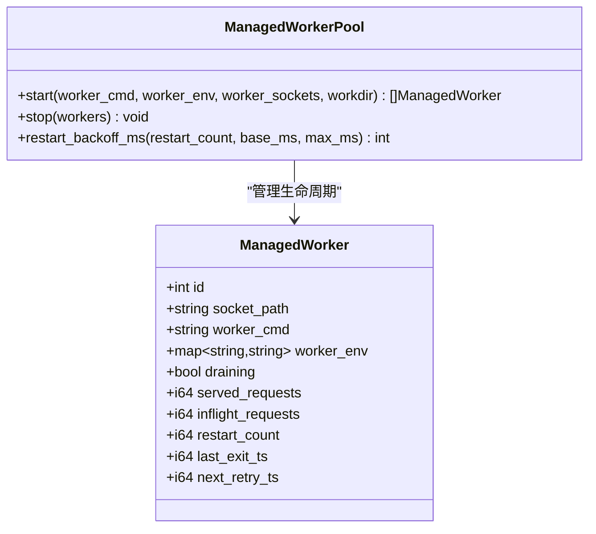
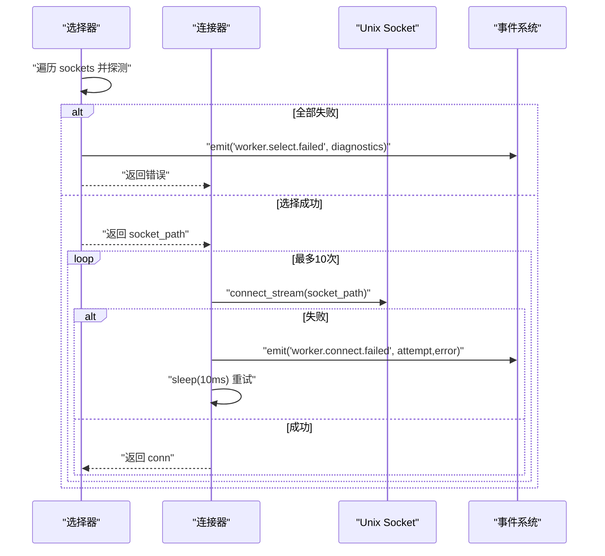
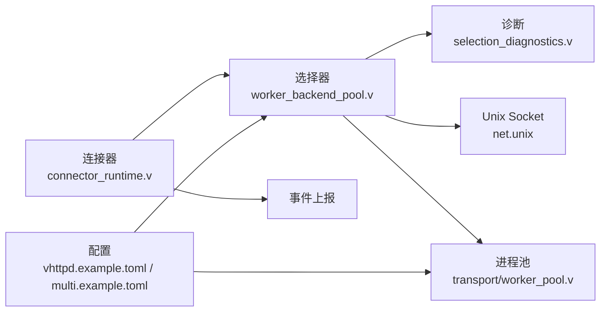

# Worker 连接路由

<cite>
**本文引用的文件**   
- [src/worker_backend_pool.v](file://src/worker_backend_pool.v)
- [src/upstream/transport/worker_pool.v](file://src/upstream/transport/worker_pool.v)
- [src/worker_backend_connector_runtime.v](file://src/worker_backend_connector_runtime.v)
- [src/worker_backend_selection_diagnostics.v](file://src/worker_backend_selection_diagnostics.v)
- [config/vhttpd.example.toml](file://config/vhttpd.example.toml)
- [config/vhttpd.multi.example.toml](file://config/vhttpd.multi.example.toml)
- [articles/11-observability.md](file://articles/11-observability.md)
</cite>

## 目录
1. [简介](#简介)
2. [项目结构](#项目结构)
3. [核心组件](#核心组件)
4. [架构总览](#架构总览)
5. [详细组件分析](#详细组件分析)
6. [依赖关系分析](#依赖关系分析)
7. [性能考虑](#性能考虑)
8. [故障排查指南](#故障排查指南)
9. [结论](#结论)
10. [附录：配置示例与调优建议](#附录配置示例与调优建议)

## 简介
本文件聚焦于 vhttpd 的 Worker 连接路由能力，围绕负载均衡算法、连接选择机制、连接池管理、故障转移策略以及监控指标进行系统化说明。文档面向运维与开发者，既提供高层设计概览，也给出代码级实现路径与可操作的配置示例，帮助在高并发场景下稳定、高效地调度请求到后端 Worker。

## 项目结构
Worker 连接路由涉及以下关键模块与配置：
- 连接选择与轮询：基于 Unix Socket 列表的轮询与空闲探测
- 连接池与进程管理：受管 Worker 进程的启动、停止、重启退避
- 连接器与重试：带重试的连接建立与释放回调
- 诊断与事件：选择失败时的诊断信息与事件上报
- 配置项：Worker 池大小、超时、自动启动、Socket 前缀等

图示来源
- [src/worker_backend_pool.v:60-124](file://src/worker_backend_pool.v#L60-L124)
- [src/worker_backend_connector_runtime.v:47-94](file://src/worker_backend_connector_runtime.v#L47-L94)
- [src/upstream/transport/worker_pool.v:178-218](file://src/upstream/transport/worker_pool.v#L178-L218)

章节来源
- [src/worker_backend_pool.v:1-137](file://src/worker_backend_pool.v#L1-L137)
- [src/upstream/transport/worker_pool.v:1-219](file://src/upstream/transport/worker_pool.v#L1-L219)
- [src/worker_backend_connector_runtime.v:1-105](file://src/worker_backend_connector_runtime.v#L1-L105)
- [src/worker_backend_selection_diagnostics.v:1-64](file://src/worker_backend_selection_diagnostics.v#L1-L64)

## 核心组件
- 连接选择器（选择器）
  - 负责在多个 Worker Socket 中选择一个可用的目标，支持轮询与空闲优先策略，并在需要时进行连通性探测。
- 进程池管理（池化）
  - 负责受管 Worker 进程的启动、停止、重启退避计算与生命周期管理。
- 连接器（连接器）
  - 封装了“选择 Socket + 建立连接”的流程，包含重试与错误上报。
- 诊断与事件（观测）
  - 在选择失败时输出每个候选 Worker 的诊断信息，并触发事件上报。

章节来源
- [src/worker_backend_pool.v:16-58](file://src/worker_backend_pool.v#L16-L58)
- [src/upstream/transport/worker_pool.v:37-50](file://src/upstream/transport/worker_pool.v#L37-L50)
- [src/worker_backend_connector_runtime.v:27-45](file://src/worker_backend_connector_runtime.v#L27-L45)
- [src/worker_backend_selection_diagnostics.v:7-63](file://src/worker_backend_selection_diagnostics.v#L7-L63)

## 架构总览
下图展示了从请求进入内核到最终连接到具体 Worker 的完整流程，包括选择、探测、连接、重试与诊断上报。

图示来源
- [src/worker_backend_pool.v:60-124](file://src/worker_backend_pool.v#L60-L124)
- [src/worker_backend_connector_runtime.v:47-94](file://src/worker_backend_connector_runtime.v#L47-L94)
- [src/worker_backend_selection_diagnostics.v:7-63](file://src/worker_backend_selection_diagnostics.v#L7-L63)

## 详细组件分析

### 负载均衡算法与连接选择机制
- 轮询（Round-Robin）
  - 通过维护一个索引 rr_index 对 sockets 列表进行循环选择，每次选择后递增索引，保证均匀分布。
- 空闲优先（Idle-First）
  - 当启用 autostart 且存在 managed_workers 时，优先尝试已存在的空闲 Worker（无 inflight_requests、非 draining、进程存活），减少冷启动开销。
- 健康检查与负载评估
  - 选择过程中会对候选 Socket 执行 connect_stream 探测；同时结合进程状态（是否存活）、draining 标记、inflight_requests 计数进行综合判断。
- 亲和性与权重
  - 当前实现未提供显式的亲和性或权重分配策略；如需扩展，可在选择逻辑中加入亲和键映射与权重排序。

图示来源
- [src/worker_backend_pool.v:16-58](file://src/worker_backend_pool.v#L16-L58)
- [src/worker_backend_pool.v:60-124](file://src/worker_backend_pool.v#L60-L124)
- [src/worker_backend_selection_diagnostics.v:7-63](file://src/worker_backend_selection_diagnostics.v#L7-L63)

章节来源
- [src/worker_backend_pool.v:16-58](file://src/worker_backend_pool.v#L16-L58)
- [src/worker_backend_pool.v:60-124](file://src/worker_backend_pool.v#L60-L124)
- [src/worker_backend_selection_diagnostics.v:7-63](file://src/worker_backend_selection_diagnostics.v#L7-L63)

### 连接池管理（复用、回收、上限）
- 连接复用
  - 当前实现以“按请求建立 Unix Socket 连接”为主，未在代码层体现长连接复用；可通过上层保持连接或在 Worker 侧做复用。
- 空闲连接回收
  - 通过 drain 流程与进程退出检测，将 draining 且无 in-flight 的 Worker 重新拉起，避免资源长期占用。
- 最大连接数限制
  - pool_size 控制受管 Worker 数量；rr_index 与 sockets 长度共同决定并发上限。
- 进程生命周期与重启退避
  - ManagedWorkerPool.start/stop 管理子进程组；restart_backoff_ms 使用指数退避防止风暴。

图示来源
- [src/upstream/transport/worker_pool.v:37-50](file://src/upstream/transport/worker_pool.v#L37-L50)
- [src/upstream/transport/worker_pool.v:178-218](file://src/upstream/transport/worker_pool.v#L178-L218)

章节来源
- [src/upstream/transport/worker_pool.v:178-218](file://src/upstream/transport/worker_pool.v#L178-L218)
- [src/worker_backend_pool.v:72-91](file://src/worker_backend_pool.v#L72-L91)

### 故障转移与重试策略
- 选择失败处理
  - 当所有候选不可用时，选择器会发出 worker.select.failed 事件，附带每个候选的诊断信息（进程存活、draining、inflight、probe_error）。
- 备用 Worker 选择
  - 通过轮询遍历 sockets，并结合空闲优先策略，自动切换到其他可用 Worker。
- 连接重试
  - 连接器在 select_socket 与 connect_stream 两处均内置最多 10 次重试，间隔固定短延时；队列满/超时错误立即返回，不进行重试。

图示来源
- [src/worker_backend_connector_runtime.v:47-94](file://src/worker_backend_connector_runtime.v#L47-L94)
- [src/worker_backend_pool.v:126-136](file://src/worker_backend_pool.v#L126-L136)
- [src/worker_backend_selection_diagnostics.v:7-63](file://src/worker_backend_selection_diagnostics.v#L7-L63)

章节来源
- [src/worker_backend_connector_runtime.v:47-94](file://src/worker_backend_connector_runtime.v#L47-L94)
- [src/worker_backend_pool.v:126-136](file://src/worker_backend_pool.v#L126-L136)

### 连接监控指标与观测
- 管理员接口
  - /admin/workers：查看各 Worker 的状态、内存、请求计数等
  - /admin/stats：查看总体请求量、错误数、延迟分位等
- 推荐告警规则
  - 无空闲 Worker、队列积压、高错误率、上游断开、MCP 会话接近上限等
- 事件日志
  - worker.select.failed、worker.connect.failed 等事件可用于定位问题

章节来源
- [articles/11-observability.md:77-140](file://articles/11-observability.md#L77-L140)
- [articles/11-observability.md:469-526](file://articles/11-observability.md#L469-L526)

## 依赖关系分析
- 选择器依赖
  - 进程池管理（获取 managed_workers 列表与状态）
  - Unix Socket 网络库（连通性探测）
  - 诊断模块（生成每个候选的诊断条目）
- 连接器依赖
  - 选择器（提供 socket_path）
  - 事件系统（上报连接失败）
- 配置依赖
  - worker.pool_size、worker.autostart、worker.socket_prefix、worker.read_timeout_ms 等影响选择与行为

图示来源
- [src/worker_backend_pool.v:60-124](file://src/worker_backend_pool.v#L60-L124)
- [src/worker_backend_connector_runtime.v:47-94](file://src/worker_backend_connector_runtime.v#L47-L94)
- [config/vhttpd.example.toml:19-26](file://config/vhttpd.example.toml#L19-L26)
- [config/vhttpd.multi.example.toml:44-55](file://config/vhttpd.multi.example.toml#L44-L55)

章节来源
- [src/worker_backend_pool.v:60-124](file://src/worker_backend_pool.v#L60-L124)
- [src/worker_backend_connector_runtime.v:47-94](file://src/worker_backend_connector_runtime.v#L47-L94)
- [config/vhttpd.example.toml:19-26](file://config/vhttpd.example.toml#L19-L26)
- [config/vhttpd.multi.example.toml:44-55](file://config/vhttpd.multi.example.toml#L44-L55)

## 性能考虑
- 合理设置 pool_size
  - 通常建议为 CPU 核心数的 1~2 倍，结合业务 IO/CPU 特征调整。
- 启用 autostart 与空闲优先
  - 可减少冷启动开销，提升吞吐；但需关注进程管理与重启退避。
- 超时与队列参数
  - read_timeout_ms 针对普通请求与流式请求分别调优；队列容量与等待超时影响背压与拒绝策略。
- 重启退避
  - 指数退避避免雪崩，base_ms 与 max_ms 需根据环境稳定性设定。
- 连接复用
  - 若上层能复用连接，可降低握手与探测成本；否则保持短连接+快速重试亦可满足多数场景。

[本节为通用指导，无需特定文件引用]

## 故障排查指南
- 常见症状
  - 请求堆积、响应缓慢、频繁重连、内存持续增长
- 排查步骤
  - 查看 /admin/workers 与 /admin/stats
  - 观察事件日志中的 worker.select.failed、worker.connect.failed
  - 检查 Worker 进程状态与日志
  - 必要时手动重启问题 Worker
- 解决方案
  - 调整 pool_size、read_timeout_ms、max_requests
  - 优化应用内存占用与数据库连接
  - 增加 Worker 池规模分担压力

章节来源
- [articles/11-observability.md:536-600](file://articles/11-observability.md#L536-L600)
- [articles/11-observability.md:602-666](file://articles/11-observability.md#L602-L666)

## 结论
vhttpd 的 Worker 连接路由以“轮询 + 空闲优先 + 连通性探测”为核心，配合进程池管理与指数退避，提供了稳定的高并发调度能力。通过管理员接口与事件日志可实现完善的观测与排障。对于更高阶的亲和性与权重策略，可在现有选择器基础上扩展。

[本节为总结，无需特定文件引用]

## 附录：配置示例与调优建议
- 基础配置要点
  - worker.pool_size：控制受管 Worker 数量
  - worker.autostart：是否自动启动与管理 Worker
  - worker.socket_prefix：Socket 命名前缀
  - worker.read_timeout_ms：读超时
  - worker.max_requests：单 Worker 最大请求数（用于定期重启）
  - worker.restart_backoff_ms / restart_backoff_max_ms：重启退避
- 多站点示例
  - sites.* 下可为不同站点配置独立的 executor、worker.entry、pool_size、socket_prefix 等

章节来源
- [config/vhttpd.example.toml:19-26](file://config/vhttpd.example.toml#L19-L26)
- [config/vhttpd.multi.example.toml:44-55](file://config/vhttpd.multi.example.toml#L44-L55)
- [articles/11-observability.md:622-666](file://articles/11-observability.md#L622-L666)