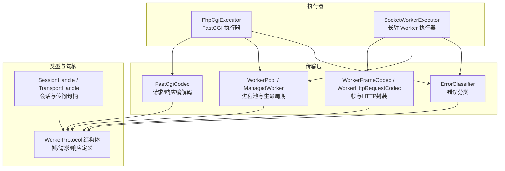
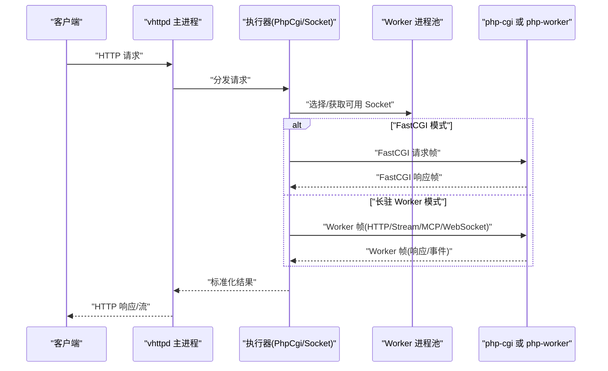
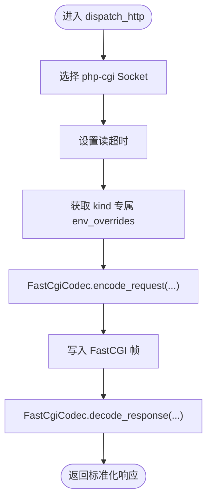
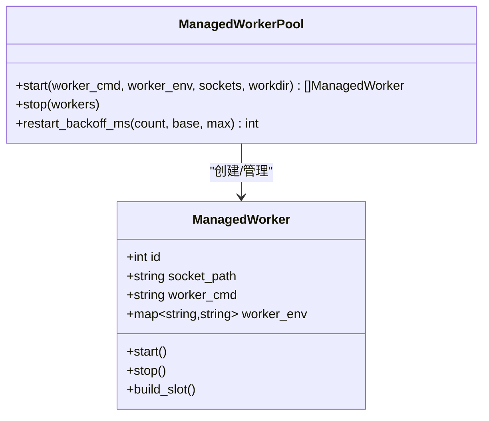
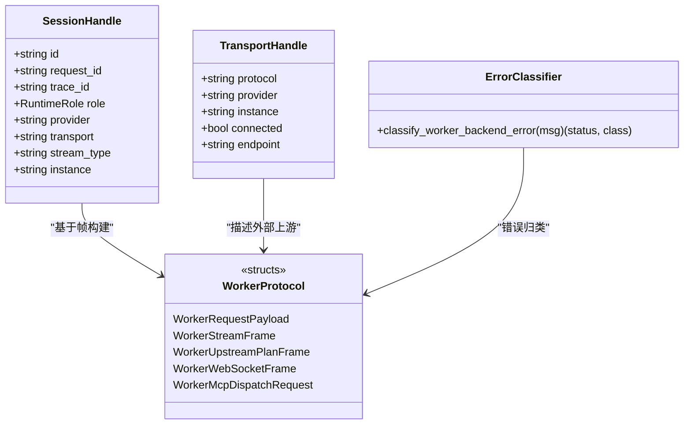
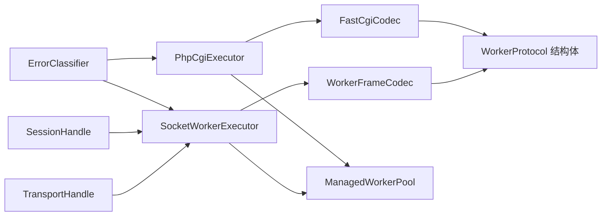

# 上游服务集成配置

<cite>
**本文引用的文件**   
- [src/upstream/transport/fastcgi.v](file://src/upstream/transport/fastcgi.v)
- [src/executor/php_cgi_executor.v](file://src/executor/php_cgi_executor.v)
- [src/executor/socket_worker_executor.v](file://src/executor/socket_worker_executor.v)
- [src/upstream/transport/worker_pool.v](file://src/upstream/transport/worker_pool.v)
- [src/upstream/transport/worker_protocol.v](file://src/upstream/transport/worker_protocol.v)
- [src/upstream/transport/worker_framing.v](file://src/upstream/transport/worker_framing.v)
- [src/upstream/transport/error_classifier.v](file://src/upstream/transport/error_classifier.v)
- [src/upstream/transport/session_handle.v](file://src/upstream/transport/session_handle.v)
- [src/upstream/transport/transport_handle.v](file://src/upstream/transport/transport_handle.v)
- [README.md](file://README.md)
</cite>

## 目录
1. [简介](#简介)
2. [项目结构](#项目结构)
3. [核心组件](#核心组件)
4. [架构总览](#架构总览)
5. [详细组件分析](#详细组件分析)
6. [依赖关系分析](#依赖关系分析)
7. [性能与容量规划](#性能与容量规划)
8. [故障排查指南](#故障排查指南)
9. [结论](#结论)
10. [附录：配置示例与最佳实践](#附录配置示例与最佳实践)

## 简介
本文件面向“上游服务集成”的配置与实现，聚焦以下主题：
- FastCGI 执行器配置（进程池、超时、环境变量传递）
- Worker 池管理（动态扩缩容、健康检查、负载均衡策略）
- 自定义上游提供者开发（接口、连接管理、错误处理）
- 传输层配置（协议选择、数据编码、压缩设置）
- 连接池配置（复用、空闲回收、资源清理）
- 监控与诊断（指标、日志、调试信息）
- 完整配置示例与最佳实践

## 项目结构
与上游集成相关的核心代码位于 upstream 与 executor 模块中，FastCGI 编解码、Worker 帧协议、进程池管理与执行器共同构成端到端链路。

图示来源
- [src/executor/php_cgi_executor.v:1-118](file://src/executor/php_cgi_executor.v#L1-L118)
- [src/executor/socket_worker_executor.v:1-157](file://src/executor/socket_worker_executor.v#L1-L157)
- [src/upstream/transport/fastcgi.v:1-386](file://src/upstream/transport/fastcgi.v#L1-L386)
- [src/upstream/transport/worker_framing.v:1-231](file://src/upstream/transport/worker_framing.v#L1-L231)
- [src/upstream/transport/worker_pool.v:1-219](file://src/upstream/transport/worker_pool.v#L1-L219)
- [src/upstream/transport/error_classifier.v:1-19](file://src/upstream/transport/error_classifier.v#L1-L19)
- [src/upstream/transport/worker_protocol.v:1-277](file://src/upstream/transport/worker_protocol.v#L1-L277)
- [src/upstream/transport/session_handle.v:1-90](file://src/upstream/transport/session_handle.v#L1-L90)
- [src/upstream/transport/transport_handle.v:1-21](file://src/upstream/transport/transport_handle.v#L1-L21)

章节来源
- [README.md:1065-1145](file://README.md#L1065-L1145)

## 核心组件
- PhpCgiExecutor：通过 Unix Socket 调用 php-cgi，使用 FastCGI 协议进行请求/响应交换；支持按 kind 读取超时与环境覆盖变量。
- SocketWorkerExecutor：通过 Unix Socket 与长驻 worker 通信，采用自定义帧协议，支持 HTTP、流式、WebSocket、MCP 等场景。
- FastCgiCodec：实现 FastCGI 记录编码与解析，组装 CGI 环境变量并分帧发送参数与输入流。
- WorkerFrameCodec/WorkerHttpRequestCodec：实现 4 字节长度前缀的帧读写、HTTP 请求到 JSON 负载的转换。
- ManagedWorker/ManagedWorkerPool：负责子进程启动、等待 socket 就绪、优雅停止、重启退避等。
- ErrorClassifier：将底层错误映射为 HTTP 状态码与错误类别，便于上层统一处理。
- SessionHandle/TransportHandle：抽象会话与传输句柄，用于追踪 trace_id、request_id、角色与实例。

章节来源
- [src/executor/php_cgi_executor.v:1-118](file://src/executor/php_cgi_executor.v#L1-L118)
- [src/executor/socket_worker_executor.v:1-157](file://src/executor/socket_worker_executor.v#L1-L157)
- [src/upstream/transport/fastcgi.v:1-386](file://src/upstream/transport/fastcgi.v#L1-L386)
- [src/upstream/transport/worker_framing.v:1-231](file://src/upstream/transport/worker_framing.v#L1-L231)
- [src/upstream/transport/worker_pool.v:1-219](file://src/upstream/transport/worker_pool.v#L1-L219)
- [src/upstream/transport/error_classifier.v:1-19](file://src/upstream/transport/error_classifier.v#L1-L19)
- [src/upstream/transport/session_handle.v:1-90](file://src/upstream/transport/session_handle.v#L1-L90)
- [src/upstream/transport/transport_handle.v:1-21](file://src/upstream/transport/transport_handle.v#L1-L21)

## 架构总览
下图展示从 Web 请求进入，经执行器选择后端 Worker，再到 FastCGI 或长驻 Worker 的完整路径。

图示来源
- [src/executor/php_cgi_executor.v:42-82](file://src/executor/php_cgi_executor.v#L42-L82)
- [src/executor/socket_worker_executor.v:43-95](file://src/executor/socket_worker_executor.v#L43-L95)
- [src/upstream/transport/fastcgi.v:79-249](file://src/upstream/transport/fastcgi.v#L79-L249)
- [src/upstream/transport/worker_framing.v:14-60](file://src/upstream/transport/worker_framing.v#L14-L60)

## 详细组件分析

### FastCGI 执行器配置
- 进程模型与选择
  - PhpCgiExecutor 以 kind='php-cgi' 标识，通过 worker_socket_port 选择对应 Unix Socket。
  - 读超时通过 worker_backend_read_timeout_ms_for_kind(kind) 注入到连接。
- 环境变量传递
  - 通过 worker_env_for_kind(kind) 获取环境覆盖，合并后作为 FastCGI Params 发送。
  - FastCgiCodec 会构造标准 CGI 环境变量（如 REQUEST_METHOD、SCRIPT_FILENAME、QUERY_STRING、HTTP_* 等），并将 VHTTPD_TRACE_ID/VHTTPD_REQUEST_ID 注入。
- 请求/响应流程
  - encode_request 组装 BEGIN_REQUEST、PARAMS、STDIN 帧；decode_response 循环读取 STDOUT/STDERR/END_REQUEST 并解析 HTTP 头与 Body。

图示来源
- [src/executor/php_cgi_executor.v:42-82](file://src/executor/php_cgi_executor.v#L42-L82)
- [src/upstream/transport/fastcgi.v:79-249](file://src/upstream/transport/fastcgi.v#L79-L249)

章节来源
- [src/executor/php_cgi_executor.v:42-82](file://src/executor/php_cgi_executor.v#L42-L82)
- [src/upstream/transport/fastcgi.v:79-249](file://src/upstream/transport/fastcgi.v#L79-L249)
- [src/upstream/transport/fastcgi.v:266-317](file://src/upstream/transport/fastcgi.v#L266-L317)

### Worker 池管理配置
- 进程启动与命令拼装
  - command_with_socket 自动注入 --socket 或使用 {socket} 占位符；pool_size > 1 时禁止显式 --socket。
  - start 使用 /bin/sh -lc 执行命令，设置工作目录、进程组、环境变量，并等待 socket 就绪。
- 优雅停止与重启退避
  - stop 先向进程组发 SIGTERM，再 SIGKILL，确保清理。
  - restart_backoff_ms 指数退避，限制最大延迟。
- 运行期观测
  - README 提供 /admin/workers、/admin/stats 等端点，可观察队列超时、满队列等事件。

图示来源
- [src/upstream/transport/worker_pool.v:76-136](file://src/upstream/transport/worker_pool.v#L76-L136)
- [src/upstream/transport/worker_pool.v:155-176](file://src/upstream/transport/worker_pool.v#L155-L176)
- [src/upstream/transport/worker_pool.v:178-219](file://src/upstream/transport/worker_pool.v#L178-L219)

章节来源
- [src/upstream/transport/worker_pool.v:76-136](file://src/upstream/transport/worker_pool.v#L76-L136)
- [src/upstream/transport/worker_pool.v:155-176](file://src/upstream/transport/worker_pool.v#L155-L176)
- [src/upstream/transport/worker_pool.v:178-219](file://src/upstream/transport/worker_pool.v#L178-L219)
- [README.md:1065-1145](file://README.md#L1065-L1145)

### 自定义上游提供者开发
- 接口与协议
  - 长驻 Worker 侧通过 WorkerProtocol 定义的帧结构进行交互：WorkerRequestPayload、WorkerStreamFrame、WorkerUpstreamPlanFrame、WorkerWebSocketFrame、WorkerMcpDispatchRequest 等。
  - 执行器侧通过 SocketWorkerExecutor 发起请求，并根据首帧判断是普通响应、流式开始还是上游计划。
- 连接与会话
  - SessionHandle 抽象了不同入口（stream/mcp/websocket_upstream）的会话上下文，包含 role、provider、transport、stream_type、instance 等字段。
  - TransportHandle 描述 WebSocket 等外部上游的连接元信息。
- 错误处理
  - ErrorClassifier 将底层错误映射为 502/503/504 及错误类名，便于上层统一告警与降级。

图示来源
- [src/upstream/transport/worker_protocol.v:1-277](file://src/upstream/transport/worker_protocol.v#L1-L277)
- [src/upstream/transport/session_handle.v:1-90](file://src/upstream/transport/session_handle.v#L1-L90)
- [src/upstream/transport/transport_handle.v:1-21](file://src/upstream/transport/transport_handle.v#L1-L21)
- [src/upstream/transport/error_classifier.v:1-19](file://src/upstream/transport/error_classifier.v#L1-L19)

章节来源
- [src/executor/socket_worker_executor.v:43-95](file://src/executor/socket_worker_executor.v#L43-L95)
- [src/upstream/transport/worker_protocol.v:1-277](file://src/upstream/transport/worker_protocol.v#L1-L277)
- [src/upstream/transport/session_handle.v:1-90](file://src/upstream/transport/session_handle.v#L1-L90)
- [src/upstream/transport/transport_handle.v:1-21](file://src/upstream/transport/transport_handle.v#L1-L21)
- [src/upstream/transport/error_classifier.v:1-19](file://src/upstream/transport/error_classifier.v#L1-L19)

### 传输层配置（协议、编码、压缩）
- 协议选择
  - FastCGI：由 PhpCgiExecutor 驱动，走 Unix Socket，使用 FastCgiCodec 编解码。
  - 长驻 Worker：由 SocketWorkerExecutor 驱动，使用 4 字节长度前缀帧协议。
- 数据编码
  - FastCGI：BEGIN_REQUEST、PARAMS、STDIN、STDOUT/STDERR、END_REQUEST 记录序列。
  - Worker：JSON 化的 WorkerRequestPayload，以及 Stream/UpstreamPlan/WebSocket/MCP 帧。
- 压缩
  - 当前实现未内置压缩；如需启用，应在应用层（php-cgi 或 php-worker）对 body 进行压缩并在接收端解压。

章节来源
- [src/executor/php_cgi_executor.v:42-82](file://src/executor/php_cgi_executor.v#L42-L82)
- [src/executor/socket_worker_executor.v:43-95](file://src/executor/socket_worker_executor.v#L43-L95)
- [src/upstream/transport/fastcgi.v:79-249](file://src/upstream/transport/fastcgi.v#L79-L249)
- [src/upstream/transport/worker_framing.v:14-60](file://src/upstream/transport/worker_framing.v#L14-L60)
- [src/upstream/transport/worker_protocol.v:1-277](file://src/upstream/transport/worker_protocol.v#L1-L277)

### 连接池配置（复用、空闲回收、资源清理）
- 连接复用
  - 每个 Kind 对应一个或多个 Unix Socket；执行器每次请求选择可用 Socket，完成后释放。
- 空闲回收
  - 无显式空闲回收逻辑；建议通过 worker-max-requests 触发 Worker 进程重启，达到资源清理目的。
- 资源清理
  - ManagedWorker.stop 使用进程组信号确保彻底清理；父进程在启动时注册子进程 PID 快照以便审计。

章节来源
- [src/executor/php_cgi_executor.v:42-82](file://src/executor/php_cgi_executor.v#L42-L82)
- [src/executor/socket_worker_executor.v:43-95](file://src/executor/socket_worker_executor.v#L43-L95)
- [src/upstream/transport/worker_pool.v:155-176](file://src/upstream/transport/worker_pool.v#L155-L176)
- [README.md:1065-1145](file://README.md#L1065-L1145)

### 监控与诊断配置
- 运行时观测
  - /admin/workers：查看 Worker 存活/ draining/inflight/restarts 等状态。
  - /admin/stats：统计 total/error/timeout/stream/admin actions 等计数。
  - /events/stream：SSE 事件流，可用于调试与排障。
- 错误分类与事件
  - ErrorClassifier 将错误映射为 502/503/504 与错误类名，便于统计与告警。
  - e2e 测试验证 worker_queue_full/timeout 等事件可被事件日志捕获。

章节来源
- [README.md:1065-1145](file://README.md#L1065-L1145)
- [src/upstream/transport/error_classifier.v:1-19](file://src/upstream/transport/error_classifier.v#L1-L19)

## 依赖关系分析
- 执行器依赖传输层编解码与 Worker 池选择。
- FastCGI 与 Worker 帧协议相互独立，但共享统一的错误分类与会话句柄抽象。
- 进程池管理贯穿所有执行器，提供统一的启停与退避策略。

图示来源
- [src/executor/php_cgi_executor.v:1-118](file://src/executor/php_cgi_executor.v#L1-L118)
- [src/executor/socket_worker_executor.v:1-157](file://src/executor/socket_worker_executor.v#L1-L157)
- [src/upstream/transport/fastcgi.v:1-386](file://src/upstream/transport/fastcgi.v#L1-L386)
- [src/upstream/transport/worker_framing.v:1-231](file://src/upstream/transport/worker_framing.v#L1-L231)
- [src/upstream/transport/worker_pool.v:1-219](file://src/upstream/transport/worker_pool.v#L1-L219)
- [src/upstream/transport/error_classifier.v:1-19](file://src/upstream/transport/error_classifier.v#L1-L19)
- [src/upstream/transport/session_handle.v:1-90](file://src/upstream/transport/session_handle.v#L1-L90)
- [src/upstream/transport/transport_handle.v:1-21](file://src/upstream/transport/transport_handle.v#L1-L21)

## 性能与容量规划
- 并发与吞吐
  - 合理设置 worker-pool-size，使并发度与后端处理能力匹配；结合 worker-max-requests 控制单进程生命周期。
- 超时与重试
  - 针对 FastCGI 与 Worker 分别设置 read timeout；结合 ErrorClassifier 的错误类进行重试或降级。
- 背压与限流
  - 关注 worker_queue_full/timeout 事件，必要时降低入站流量或扩容 Worker。
- 资源清理
  - 利用进程组优雅停止与重启退避，避免僵尸进程与资源泄漏。

[本节为通用指导，不直接分析具体文件]

## 故障排查指南
- 常见问题定位
  - 无法连接 Worker：检查 Unix Socket 是否就绪、权限与路径是否正确。
  - 503/504 错误：根据 ErrorClassifier 的错误类区分“队列满/超时”，调整 pool size 或优化后端处理耗时。
  - FastCGI 解析失败：确认 PHP 输出符合 CGI 规范，检查 STDERR 日志。
- 观测手段
  - 使用 /admin/workers 与 /admin/stats 观察队列与错误计数。
  - 订阅 /events/stream 跟踪关键事件（如 worker_queue_full）。

章节来源
- [src/upstream/transport/error_classifier.v:1-19](file://src/upstream/transport/error_classifier.v#L1-L19)
- [README.md:1065-1145](file://README.md#L1065-L1145)

## 结论
通过 FastCGI 与长驻 Worker 双通道，配合进程池管理、错误分类与运行时观测，系统实现了稳定可靠的上游服务集成。建议在生产环境中结合队列与超时指标进行容量规划，并通过事件流与管理员接口持续监控。

[本节为总结性内容，不直接分析具体文件]

## 附录：配置示例与最佳实践
- 启动参数（参考）
  - --worker-pool-size N：设置 Worker 数量
  - --worker-socket /tmp/vslim_worker.sock：指定 Worker Socket 路径
  - --worker-autostart 1：自动拉起 Worker
  - --worker-max-requests N：单进程最大请求数后重启
  - --worker-restart-backoff-ms / --worker-restart-backoff-max-ms：重启退避策略
- 环境变量与覆盖
  - 通过 kind 专属 env_overrides 注入 FastCGI 环境变量（如 VPHP_WP_ROOT、VHTTPD_APP 等）
- 最佳实践
  - 为不同 Kind 配置独立的 Socket 与超时，避免互相影响
  - 开启事件日志与 SSE 事件流，建立可观测性基线
  - 结合 worker-max-requests 与优雅停止，保障长期运行的稳定性

章节来源
- [README.md:1065-1145](file://README.md#L1065-L1145)
- [src/executor/php_cgi_executor.v:56-61](file://src/executor/php_cgi_executor.v#L56-L61)
- [src/upstream/transport/fastcgi.v:173-179](file://src/upstream/transport/fastcgi.v#L173-L179)