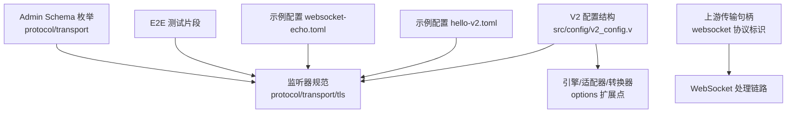
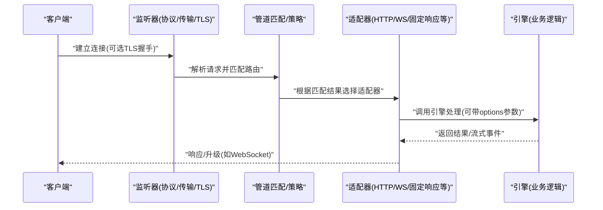
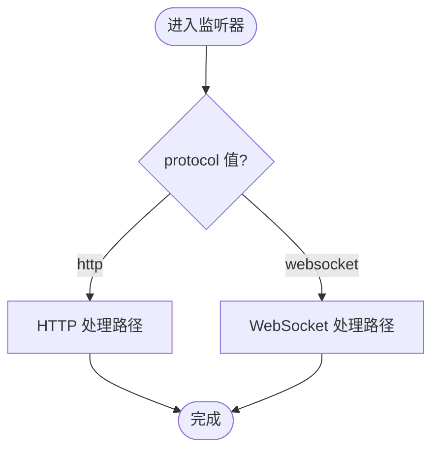
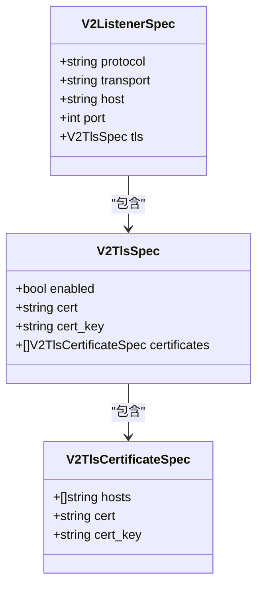
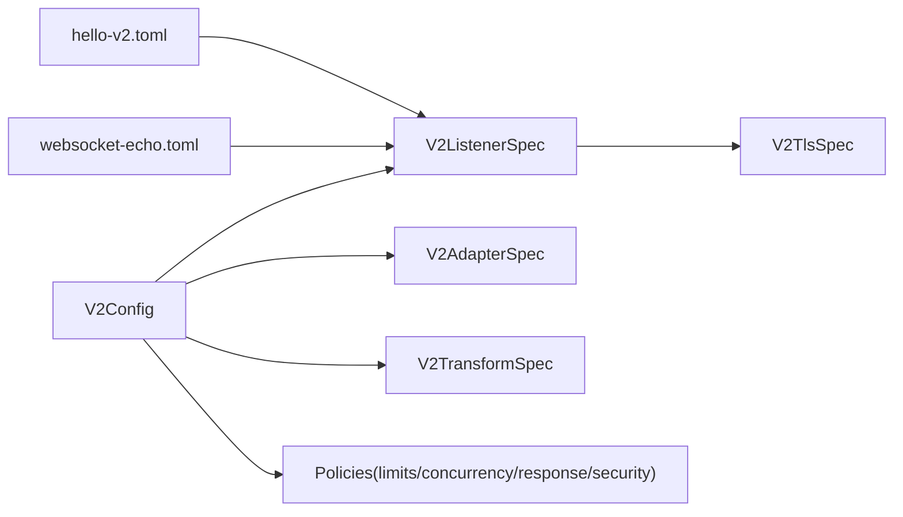

# 传输层配置

<cite>
**本文引用的文件**   
- [src/config/v2_config.v](file://src/config/v2_config.v)
- [examples/config/hello-v2.toml](file://examples/config/hello-v2.toml)
- [examples/config/websocket-echo.toml](file://examples/config/websocket-echo.toml)
- [tests/e2e/config_acceptance_test.sh](file://tests/e2e/config_acceptance_test.sh)
- [src/admin_schema_runtime.v](file://src/admin_schema_runtime.v)
- [src/upstream/transport/transport_handle.v](file://src/upstream/transport/transport_handle.v)
- [src/executor/runtime_plan_bridge_test.v](file://src/executor/runtime_plan_bridge_test.v)
</cite>

## 目录
1. [简介](#简介)
2. [项目结构](#项目结构)
3. [核心组件](#核心组件)
4. [架构总览](#架构总览)
5. [详细组件分析](#详细组件分析)
6. [依赖关系分析](#依赖关系分析)
7. [性能考虑](#性能考虑)
8. [故障排查指南](#故障排查指南)
9. [结论](#结论)
10. [附录：场景化配置模板与优化建议](#附录：场景化配置模板与优化建议)

## 简介
本文件聚焦于 vhttpd 的“传输层配置”，围绕以下目标展开：
- 协议选择与切换：HTTP/1.1、HTTP/2、WebSocket 的启用方式与监听器配置。
- 数据编码：JSON、Protobuf、MessagePack 等格式的选择与参数设置（通过适配器/转换器的 options 扩展点）。
- 压缩传输：gzip、br 等压缩算法的选择与级别控制（通过策略或适配器选项）。
- 连接复用：Keep-Alive、连接池大小、空闲连接回收（HTTP 层默认行为与资源池配置）。
- TLS/SSL：证书管理、加密套件与协议版本控制（基于监听器 TLS 配置）。
- 性能调优：缓冲区、超时、并发限制等关键参数。
- 不同场景下的配置模板与优化建议。

说明：
- 本项目采用 V2 配置模型，监听器通过 listeners.* 定义协议与传输；TLS 在监听器内配置；WebSocket 作为独立协议值支持；通用扩展能力通过 adapters/transforms/options 提供。
- 对于未在仓库中显式暴露的配置项（如 HTTP/2 开关、具体压缩级别），文档将给出可操作的扩展路径与最佳实践。

## 项目结构
与传输层相关的核心位置：
- V2 配置结构体定义：src/config/v2_config.v
- 示例 V2 配置：examples/config/hello-v2.toml
- WebSocket 示例配置：examples/config/websocket-echo.toml
- E2E 测试中的 V2 配置片段：tests/e2e/config_acceptance_test.sh
- 管理员 Schema 中对 protocol/transport 枚举的定义：src/admin_schema_runtime.v
- 上游传输句柄（含 websocket 协议标识）：src/upstream/transport/transport_handle.v
- WebSocket 调度相关策略投影测试（体现并发/队列/亲和性）：src/executor/runtime_plan_bridge_test.v

图表来源
- [src/config/v2_config.v:28-50](file://src/config/v2_config.v#L28-L50)
- [examples/config/hello-v2.toml:10-14](file://examples/config/hello-v2.toml#L10-L14)
- [examples/config/websocket-echo.toml:1-28](file://examples/config/websocket-echo.toml#L1-L28)
- [tests/e2e/config_acceptance_test.sh:1710-1714](file://tests/e2e/config_acceptance_test.sh#L1710-L1714)
- [src/admin_schema_runtime.v:82-108](file://src/admin_schema_runtime.v#L82-L108)
- [src/upstream/transport/transport_handle.v:1-20](file://src/upstream/transport/transport_handle.v#L1-L20)

章节来源
- [src/config/v2_config.v:28-50](file://src/config/v2_config.v#L28-L50)
- [examples/config/hello-v2.toml:10-14](file://examples/config/hello-v2.toml#L10-L14)
- [examples/config/websocket-echo.toml:1-28](file://examples/config/websocket-echo.toml#L1-L28)
- [tests/e2e/config_acceptance_test.sh:1710-1714](file://tests/e2e/config_acceptance_test.sh#L1710-L1714)
- [src/admin_schema_runtime.v:82-108](file://src/admin_schema_runtime.v#L82-L108)
- [src/upstream/transport/transport_handle.v:1-20](file://src/upstream/transport/transport_handle.v#L1-L20)

## 核心组件
- 监听器规范（V2ListenerSpec）
  - protocol：协议类型，例如 http、websocket。
  - transport：网络传输，例如 tcp。
  - host/port：绑定地址与端口。
  - tls：TLS 配置块。
- TLS 规范（V2TlsSpec）
  - enabled：是否启用 TLS。
  - cert/cert_key：证书与私钥路径。
  - certificates：多域名证书列表（SNI 场景）。
- 引擎/适配器/转换器（V2EngineSpec/V2AdapterSpec/V2TransformSpec）
  - 通过 options/int_options/bool_options/list_options/map_options/record_options 等扩展字段注入协议细节（如编码、压缩、头部策略等）。
- 策略（Policies）
  - limits：最大请求体、超时、队列容量。
  - concurrency：并发上限、队列容量、超时、亲和性与 Actor 模式等。
  - response/security/cache/retry：响应头、安全校验、缓存、重试等。

章节来源
- [src/config/v2_config.v:28-50](file://src/config/v2_config.v#L28-L50)
- [src/config/v2_config.v:120-182](file://src/config/v2_config.v#L120-L182)
- [src/config/v2_config.v:199-259](file://src/config/v2_config.v#L199-L259)

## 架构总览
下图展示了从客户端到应用处理的关键路径，以及传输层配置的作用点。

图表来源
- [examples/config/hello-v2.toml:10-31](file://examples/config/hello-v2.toml#L10-L31)
- [src/config/v2_config.v:279-300](file://src/config/v2_config.v#L279-L300)
- [src/config/v2_config.v:157-182](file://src/config/v2_config.v#L157-L182)

## 详细组件分析

### 协议选择与切换（HTTP/1.1、HTTP/2、WebSocket）
- HTTP/1.1
  - 使用 listeners.* 的 protocol = "http"，transport = "tcp"，host/port 指定监听端点。
  - 示例参考：hello-v2.toml 中的 listeners.web。
- WebSocket
  - 使用 listeners.* 的 protocol = "websocket"，并通过管道将入站映射到相应适配器/处理器。
  - 示例参考：websocket-echo.toml 及 E2E 测试片段中的 provider websocket upstream 配置。
- HTTP/2
  - 当前仓库未直接暴露独立的 HTTP/2 开关字段。若需启用 HTTP/2，通常由底层实现或运行时环境决定（例如依赖底层库对 ALPN 的支持）。建议在现有 http 监听器上结合运行环境与部署方案评估，或通过自定义适配器/转换器扩展。

图表来源
- [examples/config/hello-v2.toml:10-14](file://examples/config/hello-v2.toml#L10-L14)
- [examples/config/websocket-echo.toml:1-28](file://examples/config/websocket-echo.toml#L1-L28)
- [tests/e2e/config_acceptance_test.sh:1710-1714](file://tests/e2e/config_acceptance_test.sh#L1710-L1714)
- [src/admin_schema_runtime.v:82-108](file://src/admin_schema_runtime.v#L82-L108)

章节来源
- [examples/config/hello-v2.toml:10-14](file://examples/config/hello-v2.toml#L10-L14)
- [examples/config/websocket-echo.toml:1-28](file://examples/config/websocket-echo.toml#L1-L28)
- [tests/e2e/config_acceptance_test.sh:1710-1714](file://tests/e2e/config_acceptance_test.sh#L1710-L1714)
- [src/admin_schema_runtime.v:82-108](file://src/admin_schema_runtime.v#L82-L108)

### 数据编码配置（JSON、Protobuf、MessagePack）
- 通过适配器和转换器的 options 扩展点注入序列化/反序列化策略。
- 常见做法：
  - 在适配器 options 中声明 content-type 与编码器名称（如 json、protobuf、msgpack）。
  - 在转换器中按路径/前缀选择不同编码器。
  - 使用 int_options/bool_options 传递数值/布尔型参数（如最大消息长度、严格模式等）。
- 注意：仓库未限定具体编码器名，实际可用编码器取决于已实现的适配器/转换器。

章节来源
- [src/config/v2_config.v:157-182](file://src/config/v2_config.v#L157-L182)
- [src/config/v2_config.v:184-197](file://src/config/v2_config.v#L184-L197)

### 压缩传输配置（gzip、br 等）
- 可通过以下方式启用压缩：
  - 在适配器/转换器的 options 中开启压缩开关与算法选择（如 gzip、br）。
  - 在策略层（response/security）添加必要的响应头（如 Content-Encoding、Vary）。
  - 使用 int_options 设置压缩级别（如 1-9）。
- 带宽优化建议：
  - 文本类内容优先启用 gzip/br；二进制大对象按需压缩。
  - 合理设置压缩级别与阈值，避免 CPU 占用过高。

章节来源
- [src/config/v2_config.v:157-182](file://src/config/v2_config.v#L157-L182)
- [src/config/v2_config.v:184-197](file://src/config/v2_config.v#L184-L197)
- [src/config/v2_config.v:231-234](file://src/config/v2_config.v#L231-L234)

### 连接复用配置（Keep-Alive、连接池、空闲回收）
- HTTP Keep-Alive
  - 通常由底层 HTTP 实现默认启用；可在策略层通过 limits.timeout_ms 控制整体超时。
- 连接池与空闲回收
  - 资源池（数据库/缓存）通过 resources.* 配置 pool_size、idle_ping_ms 等。
  - 工作进程池（engine）通过 engines.* 配置 pool_size、thread_count、queue_capacity、read_timeout_ms 等。
- 建议：
  - 根据 QPS 与后端能力调整 pool_size 与 queue_capacity。
  - 为长连接场景（如 WebSocket）关注队列超时与亲和性策略。

章节来源
- [src/config/v2_config.v:74-118](file://src/config/v2_config.v#L74-L118)
- [src/config/v2_config.v:120-155](file://src/config/v2_config.v#L120-L155)
- [src/config/v2_config.v:217-222](file://src/config/v2_config.v#L217-L222)
- [src/config/v2_config.v:243-259](file://src/config/v2_config.v#L243-L259)

### TLS/SSL 配置（证书、加密套件、协议版本）
- 监听器级 TLS
  - 在 listeners.*.tls 中启用并配置 cert/cert_key。
  - 支持 certificates 列表用于多域名 SNI。
- 加密套件与协议版本
  - 当前配置结构未暴露加密套件与最低协议版本字段。如需精细控制，建议：
    - 通过底层实现或部署代理（如反向代理）统一管控。
    - 在适配器/转换器的 options 中透传必要的安全策略（仅当实现支持时）。
- 建议：
  - 生产环境强制 HTTPS，关闭不安全的旧协议版本。
  - 定期轮换证书，使用自动化签发工具。

章节来源
- [src/config/v2_config.v:28-50](file://src/config/v2_config.v#L28-L50)

### 性能调优参数（缓冲区、超时、并发）
- 超时
  - limits.timeout_ms：全局/策略级超时。
  - engines.read_timeout_ms：读取超时。
- 并发与队列
  - engines.pool_size/thread_count：线程/协程并行度。
  - engines.queue_capacity/queue_timeout_ms：任务队列容量与等待时间。
  - policies.concurrency.max_in_flight/max_queue_per_key：并发上限与每键排队限制。
- 缓冲与内存
  - 通过适配器/转换器的 options 控制最大请求体、分片大小等（具体字段取决于实现）。
- 建议：
  - 先压测确定瓶颈（CPU/IO/锁竞争），再逐步放大 pool_size 与并发上限。
  - 对高延迟后端适当增大 queue_timeout_ms，避免过早拒绝。

章节来源
- [src/config/v2_config.v:120-155](file://src/config/v2_config.v#L120-L155)
- [src/config/v2_config.v:217-222](file://src/config/v2_config.v#L217-L222)
- [src/config/v2_config.v:243-259](file://src/config/v2_config.v#L243-L259)

### WebSocket 专项配置与调度
- 监听器
  - protocol = "websocket"，配合管道将入站映射到对应适配器/处理器。
- 调度与亲和性
  - 通过策略与运行时计划，可启用 WebSocket 亲和性（affinity）与 Actor 模式，提升会话粘性与吞吐。
- 事件与命令
  - 支持 open/message/close 等事件分发与 send/broadcast/join 等命令执行（详见内部计划文档）。

图表来源
- [src/config/v2_config.v:28-50](file://src/config/v2_config.v#L28-L50)

章节来源
- [examples/config/websocket-echo.toml:1-28](file://examples/config/websocket-echo.toml#L1-L28)
- [tests/e2e/config_acceptance_test.sh:1710-1714](file://tests/e2e/config_acceptance_test.sh#L1710-L1714)
- [src/upstream/transport/transport_handle.v:1-20](file://src/upstream/transport/transport_handle.v#L1-L20)
- [src/executor/runtime_plan_bridge_test.v:135-153](file://src/executor/runtime_plan_bridge_test.v#L135-L153)

## 依赖关系分析
- 配置结构到运行时
  - V2Config -> V2ListenerSpec -> V2TlsSpec：监听器与 TLS 配置驱动传输层初始化。
  - V2AdapterSpec/V2TransformSpec：通过 options 注入协议细节（编码、压缩、头部等）。
  - Policies：limits/concurrency/response/security 影响请求处理与资源使用。
- 示例与测试
  - hello-v2.toml 展示标准 HTTP 监听器与管道装配。
  - websocket-echo.toml 与 E2E 测试片段展示 WebSocket 监听器与提供者上游。

图表来源
- [src/config/v2_config.v:28-50](file://src/config/v2_config.v#L28-L50)
- [src/config/v2_config.v:157-197](file://src/config/v2_config.v#L157-L197)
- [src/config/v2_config.v:199-259](file://src/config/v2_config.v#L199-L259)
- [examples/config/hello-v2.toml:10-31](file://examples/config/hello-v2.toml#L10-L31)
- [examples/config/websocket-echo.toml:1-28](file://examples/config/websocket-echo.toml#L1-L28)

章节来源
- [src/config/v2_config.v:28-50](file://src/config/v2_config.v#L28-L50)
- [src/config/v2_config.v:157-197](file://src/config/v2_config.v#L157-L197)
- [src/config/v2_config.v:199-259](file://src/config/v2_config.v#L199-L259)
- [examples/config/hello-v2.toml:10-31](file://examples/config/hello-v2.toml#L10-L31)
- [examples/config/websocket-echo.toml:1-28](file://examples/config/websocket-echo.toml#L1-L28)

## 性能考虑
- 连接复用
  - 保持 HTTP Keep-Alive，减少握手开销；对 WebSocket 长连接关注队列与亲和性。
- 并发与队列
  - 依据 CPU 核数与后端延迟调整 engines.thread_count/pool_size；在高并发下提高 queue_capacity 并设置合理的 queue_timeout_ms。
- 超时与限流
  - 使用 limits.timeout_ms 保护系统不被慢请求拖垮；必要时结合 security/response 策略进行快速失败。
- 压缩与编码
  - 文本内容启用 gzip/br，二进制按需压缩；合理设置压缩级别与最小压缩阈值。
- 资源池
  - 数据库/缓存池 size 与 idle_ping_ms 需与后端能力匹配，避免连接耗尽或频繁重建。

[本节为通用指导，无需特定文件引用]

## 故障排查指南
- 监听器无法启动
  - 检查 listeners.* 的 host/port 是否冲突；确认 TLS 证书路径是否正确。
- WebSocket 连接不稳定
  - 检查管道匹配与适配器是否正确；查看队列超时与亲和性策略是否导致重定向或拒绝。
- 压缩无效
  - 确认适配器/转换器 options 是否开启压缩；检查响应头是否被覆盖。
- 超时频繁
  - 调整 limits.timeout_ms 与 engines.read_timeout_ms；观察下游延迟与队列积压情况。

章节来源
- [src/config/v2_config.v:28-50](file://src/config/v2_config.v#L28-L50)
- [src/config/v2_config.v:217-222](file://src/config/v2_config.v#L217-L222)
- [src/config/v2_config.v:243-259](file://src/config/v2_config.v#L243-L259)

## 结论
vhttpd 的传输层以 V2 配置为核心，通过监听器、TLS、适配器/转换器与策略的组合，灵活支持 HTTP/1.1、WebSocket 等协议，并提供丰富的扩展点用于编码与压缩控制。在生产环境中，应结合业务特征与资源约束，合理设置并发、队列、超时与压缩策略，以获得稳定且高效的传输性能。

[本节为总结，无需特定文件引用]

## 附录：场景化配置模板与优化建议

- 纯 HTTP API 服务
  - 使用 listeners.web 的 protocol = "http"，transport = "tcp"。
  - 通过 adapters.http-handler 接入业务引擎；在 options 中设置 content-type 与编码策略。
  - 参考：examples/config/hello-v2.toml。

- WebSocket 实时通信
  - 使用 listeners.web 的 protocol = "websocket"，并在管道中将入站映射到 WebSocket 适配器/处理器。
  - 结合 policies.concurrency 的 affinity/actor 特性提升会话粘性。
  - 参考：examples/config/websocket-echo.toml 与 tests/e2e/config_acceptance_test.sh。

- 多协议混合
  - 在同一实例中定义多个 listeners（http 与 websocket 并存），通过管道 match 规则区分路径与协议。
  - 针对不同路径使用不同的适配器/转换器，实现差异化编码与压缩。

- 安全与合规
  - 启用 TLS，配置证书与多域名证书；在策略层添加安全头与来源白名单。
  - 对敏感接口启用认证与限流策略。

- 性能调优清单
  - 并发：engines.thread_count/pool_size、policies.concurrency.max_in_flight。
  - 队列：engines.queue_capacity/queue_timeout_ms、max_queue_per_key。
  - 超时：limits.timeout_ms、engines.read_timeout_ms。
  - 压缩：在适配器/转换器 options 中启用 gzip/br，设置级别与阈值。
  - 编码：在 options 中指定 JSON/Protobuf/MessagePack 等编码器与参数。

[本节为模板与建议，无需特定文件引用]