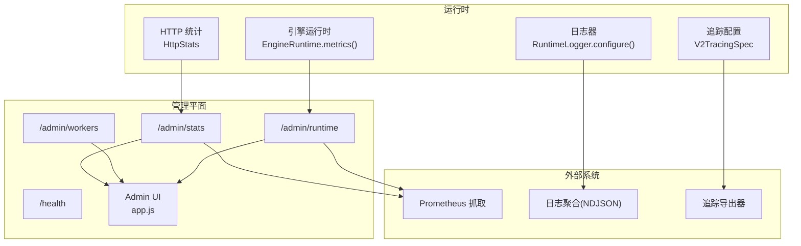
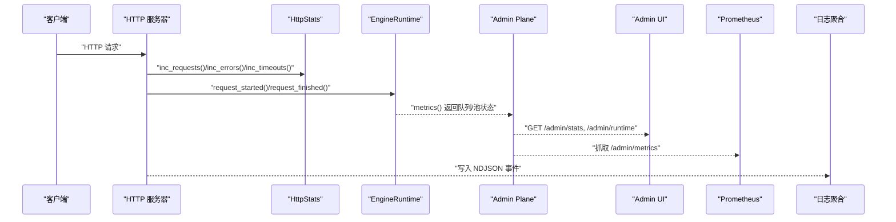
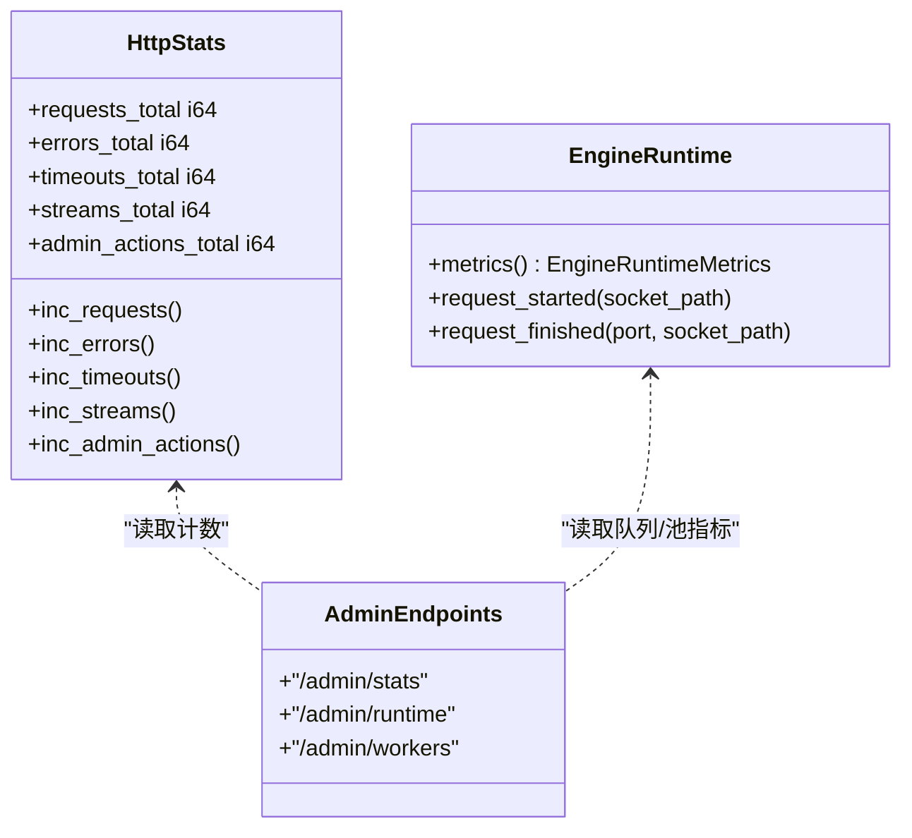
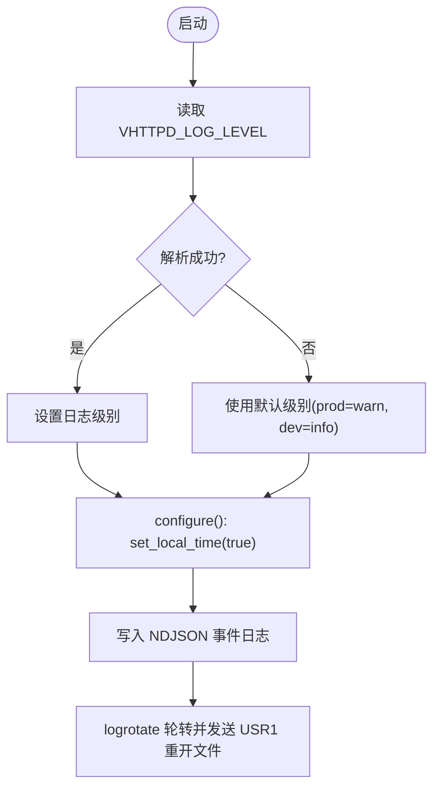
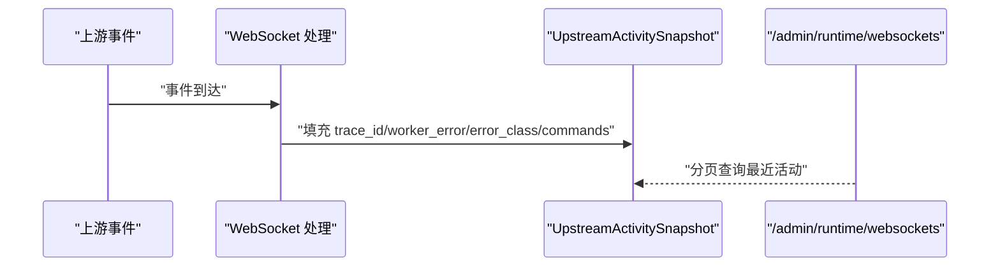
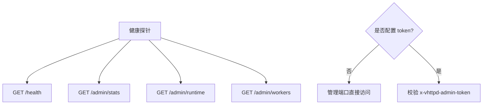
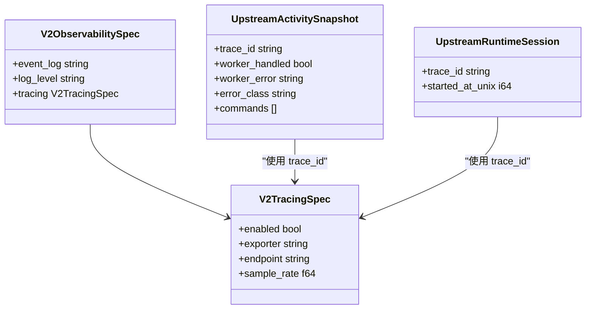
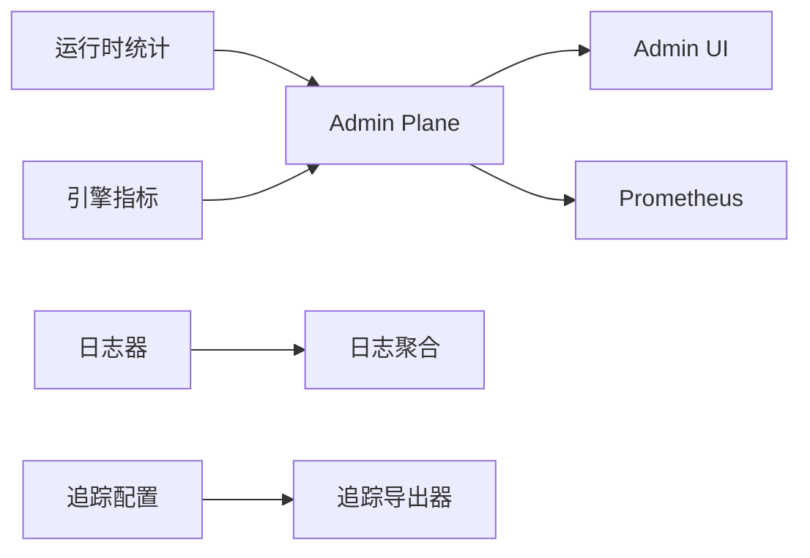

# 监控和诊断配置

<cite>
**本文引用的文件**
- [src/logging/runtime_logger.v](file://src/logging/runtime_logger.v)
- [src/http_stats.v](file://src/http_stats.v)
- [src/config/v2_config.v](file://src/config/v2_config.v)
- [src/config/v2_plan_compiler.v](file://src/config/v2_plan_compiler.v)
- [src/engine_runtime.v](file://src/engine_runtime.v)
- [src/admin/context.v](file://src/admin/context.v)
- [admin/ui/app.js](file://admin/ui/app.js)
- [README.md](file://README.md)
- [articles/11-observability.md](file://articles/11-observability.md)
- [src/ws/types.v](file://src/ws/types.v)
- [src/upstream/types.v](file://src/upstream/types.v)
- [src/codex/rpc.v](file://src/codex/rpc.v)
- [src/upstream/provider/codex/rpc.v](file://src/upstream/provider/codex/rpc.v)
</cite>

## 目录
1. [简介](#简介)
2. [项目结构](#项目结构)
3. [核心组件](#核心组件)
4. [架构总览](#架构总览)
5. [详细组件分析](#详细组件分析)
6. [依赖关系分析](#依赖关系分析)
7. [性能考量](#性能考量)
8. [故障排查指南](#故障排查指南)
9. [结论](#结论)
10. [附录](#附录)

## 简介
本文件面向生产环境的可观测性与运维，系统化说明 vhttpd 的监控与诊断配置方法，覆盖以下方面：
- 性能指标采集与导出（请求延迟、吞吐量、错误率）
- 日志记录配置（级别、输出格式、轮转策略）
- 调试信息输出（堆栈跟踪、变量快照、性能分析数据）
- 健康检查端点（服务状态、依赖可用性、资源使用）
- 告警规则（阈值、通知渠道、升级策略）
- 分布式追踪（Trace ID 传播、Span 收集、链路分析）
- 监控仪表板与可视化展示方案

## 项目结构
vhttpd 的可观测性由“运行时统计 + Admin Plane 暴露 + 事件日志 + 可选追踪”构成。关键位置如下：
- 运行时计数器与统计：HTTP 层计数、引擎队列与池状态
- Admin Plane 接口：/health、/admin/stats、/admin/workers、/admin/runtime 等
- 事件日志：NDJSON 事件流，便于外部采集与分析
- 追踪配置：V2 配置模型中的 tracing 子项
- 管理界面：Admin UI 聚合展示运行态与拓扑

图表来源
- [src/http_stats.v:1-32](file://src/http_stats.v#L1-L32)
- [src/engine_runtime.v:234-271](file://src/engine_runtime.v#L234-L271)
- [src/logging/runtime_logger.v:1-42](file://src/logging/runtime_logger.v#L1-L42)
- [src/config/v2_config.v:59-72](file://src/config/v2_config.v#L59-L72)
- [README.md:1147-1346](file://README.md#L1147-L1346)
- [admin/ui/app.js:265-290](file://admin/ui/app.js#L265-L290)

章节来源
- [src/http_stats.v:1-32](file://src/http_stats.v#L1-L32)
- [src/engine_runtime.v:234-271](file://src/engine_runtime.v#L234-L271)
- [src/logging/runtime_logger.v:1-42](file://src/logging/runtime_logger.v#L1-L42)
- [src/config/v2_config.v:59-72](file://src/config/v2_config.v#L59-L72)
- [README.md:1147-1346](file://README.md#L1147-L1346)
- [admin/ui/app.js:265-290](file://admin/ui/app.js#L265-L290)

## 核心组件
- 运行时计数器
  - HTTP 层计数器：请求总数、错误数、超时数、流式响应数、管理动作数
  - 引擎层指标：队列等待/拒绝/超时、当前队列深度、池大小、后端模式、容量与超时
- Admin Plane 端点
  - /health：存活探针
  - /admin/stats：进程级统计（含队列相关累计值）
  - /admin/workers：工作池快照
  - /admin/runtime：能力与活跃连接/会话计数，内嵌 stats
- 事件日志
  - NDJSON 事件流，包含 http.request、worker.*、upstream.*、error 等类型
- 追踪配置
  - V2 配置中 observability.tracing 支持启用、导出器、端点与采样率
- 管理界面
  - Admin UI 聚合展示应用、监听器、流水线、Relay、运行态与健康状态

章节来源
- [src/http_stats.v:1-32](file://src/http_stats.v#L1-L32)
- [src/engine_runtime.v:234-271](file://src/engine_runtime.v#L234-L271)
- [README.md:1147-1346](file://README.md#L1147-L1346)
- [articles/11-observability.md:313-371](file://articles/11-observability.md#L313-L371)
- [src/config/v2_config.v:59-72](file://src/config/v2_config.v#L59-L72)
- [admin/ui/app.js:265-290](file://admin/ui/app.js#L265-L290)

## 架构总览
下图展示了从请求进入、统计计数、到对外暴露与外部采集的整体流程。

图表来源
- [src/http_stats.v:1-32](file://src/http_stats.v#L1-L32)
- [src/engine_runtime.v:234-271](file://src/engine_runtime.v#L234-L271)
- [README.md:1147-1346](file://README.md#L1147-L1346)
- [articles/11-observability.md:406-433](file://articles/11-observability.md#L406-L433)

## 详细组件分析

### 性能指标采集与导出
- 指标定义与更新
  - HTTP 层通过 HttpStats 维护请求、错误、超时、流式与管理动作计数
  - 引擎层通过 EngineRuntime.metrics() 暴露队列等待/拒绝/超时、当前深度、池大小、后端模式、容量与超时等
- 对外暴露
  - /admin/stats 提供进程级统计（含 worker_queue_* 累计值）
  - /admin/runtime 提供能力与活跃连接/会话计数，并内嵌 stats
  - Admin UI 聚合展示这些指标
- 外部采集
  - 文档示例给出 Prometheus 抓取路径与自定义 Metrics 注入方式（在 Worker 侧）

图表来源
- [src/http_stats.v:1-32](file://src/http_stats.v#L1-L32)
- [src/engine_runtime.v:234-271](file://src/engine_runtime.v#L234-L271)
- [README.md:1147-1346](file://README.md#L1147-L1346)

章节来源
- [src/http_stats.v:1-32](file://src/http_stats.v#L1-L32)
- [src/engine_runtime.v:234-271](file://src/engine_runtime.v#L234-L271)
- [README.md:1147-1346](file://README.md#L1147-L1346)
- [admin/ui/app.js:265-290](file://admin/ui/app.js#L265-L290)
- [articles/11-observability.md:406-433](file://articles/11-observability.md#L406-L433)

### 日志记录配置
- 日志级别
  - 默认级别按构建模式决定；可通过环境变量 VHTTPD_LOG_LEVEL 动态设置（debug/info/warn/error/fatal）
  - 初始化时调用 configure() 设置全局 logger 级别与本地时间
- 输出格式与事件日志
  - 事件日志以 NDJSON 形式输出，包含多种 kind（http.request、worker.*、upstream.*、error 等）
  - 建议配合 logrotate 进行轮转，并通过信号通知进程重新打开文件句柄
- 归档策略
  - 实时日志、压缩日志、统计摘要分别采用不同保留期

图表来源
- [src/logging/runtime_logger.v:1-42](file://src/logging/runtime_logger.v#L1-L42)
- [articles/11-observability.md:436-467](file://articles/11-observability.md#L436-L467)
- [articles/11-observability.md:313-371](file://articles/11-observability.md#L313-L371)

章节来源
- [src/logging/runtime_logger.v:1-42](file://src/logging/runtime_logger.v#L1-L42)
- [articles/11-observability.md:313-371](file://articles/11-observability.md#L313-L371)
- [articles/11-observability.md:436-467](file://articles/11-observability.md#L436-L467)

### 调试信息输出配置
- 调试开关
  - 非 prod 模式下启用 debug_log 输出带标签的调试片段（限制长度），用于 RPC/协议调试
- 堆栈与变量快照
  - 上游活动快照包含 trace_id、worker_error、error_class、commands 等字段，便于定位问题
  - 示例 PHP Profiler 捕获外部请求调用栈与耗时
- 性能分析数据
  - 引擎运行时 metrics 提供队列与池维度指标，辅助性能分析

图表来源
- [src/ws/types.v:311-359](file://src/ws/types.v#L311-L359)
- [src/upstream/types.v:223-265](file://src/upstream/types.v#L223-L265)
- [src/codex/rpc.v:291-317](file://src/codex/rpc.v#L291-L317)
- [src/upstream/provider/codex/rpc.v:259-281](file://src/upstream/provider/codex/rpc.v#L259-L281)

章节来源
- [src/codex/rpc.v:291-317](file://src/codex/rpc.v#L291-L317)
- [src/upstream/provider/codex/rpc.v:259-281](file://src/upstream/provider/codex/rpc.v#L259-L281)
- [src/ws/types.v:311-359](file://src/ws/types.v#L311-L359)
- [src/upstream/types.v:223-265](file://src/upstream/types.v#L223-L265)

### 健康检查端点配置
- 内置端点
  - GET /health：管理平面存活检查，返回 200 OK
  - GET /admin/stats：进程级统计（含 uptime_seconds、各类累计计数）
  - GET /admin/runtime：能力与活跃连接/会话计数，内嵌 stats
  - GET /admin/workers：工作池快照（含 alive、inflight_requests、served_requests 等）
- 访问控制
  - 当未设置 token 时，管理端口开放；否则需携带 x-vhttpd-admin-token 或 admin_token 查询参数
- 端口暴露模型
  - admin-port=0：/admin/* 在服务数据面端口提供
  - admin-port>0：/admin/* 仅在服务管理面端口提供

图表来源
- [README.md:1147-1346](file://README.md#L1147-L1346)

章节来源
- [README.md:1147-1346](file://README.md#L1147-L1346)

### 告警规则配置
- 推荐规则（基于文档示例）
  - Worker 池耗尽：无空闲 Worker 持续一定时间
  - Worker 队列积压：队列长度超过阈值持续一段时间
  - 高错误率：单位时间内错误率超阈
  - 上游连接断开：上游连接数为 0
  - MCP 会话接近上限：会话数接近配置上限
- 通知渠道与升级策略
  - 通过 Prometheus Alertmanager 将告警路由至邮件、IM、电话等渠道
  - 根据 severity 标签进行升级（warning -> critical）

章节来源
- [articles/11-observability.md:469-526](file://articles/11-observability.md#L469-L526)

### 分布式追踪配置
- 配置项
  - observability.tracing.enabled：是否启用
  - observability.tracing.exporter：导出器名称
  - observability.tracing.endpoint：导出端点
  - observability.tracing.sample_rate：采样率
- Trace ID 传播
  - 上游活动与运行时会话均包含 trace_id 字段，便于跨组件关联
- Span 收集与链路分析
  - 结合外部追踪后端（如 Jaeger/Zipkin/OpenTelemetry Collector）进行收集与可视化

图表来源
- [src/config/v2_config.v:59-72](file://src/config/v2_config.v#L59-L72)
- [src/config/v2_plan_compiler.v:182-203](file://src/config/v2_plan_compiler.v#L182-L203)
- [src/ws/types.v:311-359](file://src/ws/types.v#L311-L359)
- [src/upstream/types.v:223-265](file://src/upstream/types.v#L223-L265)

章节来源
- [src/config/v2_config.v:59-72](file://src/config/v2_config.v#L59-L72)
- [src/config/v2_plan_compiler.v:182-203](file://src/config/v2_plan_compiler.v#L182-L203)
- [src/ws/types.v:311-359](file://src/ws/types.v#L311-L359)
- [src/upstream/types.v:223-265](file://src/upstream/types.v#L223-L265)

### 监控仪表板与可视化
- Admin UI
  - 聚合显示应用数量、监听器、流水线、Relay、运行态指标、健康状态等
- Prometheus + Grafana
  - 抓取 /admin/metrics（参考文档示例），在 Grafana 中创建面板展示 QPS、错误率、延迟分位、队列深度、池大小等
- 事件日志分析
  - 使用 jq 对 NDJSON 进行过滤、聚合与导出，快速定位异常与趋势

章节来源
- [admin/ui/app.js:265-290](file://admin/ui/app.js#L265-L290)
- [admin/ui/app.js:289-295](file://admin/ui/app.js#L289-L295)
- [admin/ui/app.js:656-675](file://admin/ui/app.js#L656-L675)
- [articles/11-observability.md:406-433](file://articles/11-observability.md#L406-L433)
- [articles/11-observability.md:313-371](file://articles/11-observability.md#L313-L371)

## 依赖关系分析
- 组件耦合
  - Admin Plane 依赖运行时统计与引擎指标，向 UI 与外部采集器暴露
  - 事件日志与追踪配置独立于业务逻辑，便于扩展
- 外部依赖
  - Prometheus 抓取管理端点
  - 日志聚合系统消费 NDJSON
  - 追踪导出器接收 Span/Trace 数据

图表来源
- [README.md:1147-1346](file://README.md#L1147-L1346)
- [src/engine_runtime.v:234-271](file://src/engine_runtime.v#L234-L271)
- [src/logging/runtime_logger.v:1-42](file://src/logging/runtime_logger.v#L1-L42)
- [src/config/v2_config.v:59-72](file://src/config/v2_config.v#L59-L72)

章节来源
- [README.md:1147-1346](file://README.md#L1147-L1346)
- [src/engine_runtime.v:234-271](file://src/engine_runtime.v#L234-L271)
- [src/logging/runtime_logger.v:1-42](file://src/logging/runtime_logger.v#L1-L42)
- [src/config/v2_config.v:59-72](file://src/config/v2_config.v#L59-L72)

## 性能考量
- 指标粒度与开销
  - 计数器为原子累加，开销低；建议在热点路径避免频繁字符串拼接
- 队列与池
  - 关注 worker_queue_depth、pool_size、queue_capacity、queue_timeout_ms，合理调优以避免拥塞
- 日志与追踪
  - 在高吞吐场景下，谨慎开启高详细度日志与高采样率追踪，避免 I/O 与序列化瓶颈

[本节为通用指导，不直接分析具体文件]

## 故障排查指南
- Worker 无响应
  - 查看 /admin/workers 与 /admin/stats，确认 inflight_requests 与累计错误
  - 重启单个或全部 Worker（POST /admin/workers/restart）
- 上游连接频繁断开
  - 查看 /admin/runtime/upstreams 与事件日志，定位 provider/instance 状态
- MCP 会话无法创建
  - 查看 /admin/runtime/mcp 与事件日志，检查 max_sessions 与 pending 丢弃计数
- 内存持续增长
  - 监控 memory_mb 与 per-worker 指标，考虑设置 max_requests 定期重启

章节来源
- [README.md:1147-1346](file://README.md#L1147-L1346)
- [articles/11-observability.md:530-619](file://articles/11-observability.md#L530-L619)

## 结论
vhttpd 提供了完善的监控与诊断能力：通过运行时计数器与引擎指标、Admin Plane 端点、NDJSON 事件日志以及可选的分布式追踪，形成从采集、存储到可视化的完整闭环。结合合理的告警规则与日志轮转策略，可在生产环境中实现高效的问题定位与稳定性保障。

[本节为总结性内容，不直接分析具体文件]

## 附录
- 常用命令与示例
  - 查看运行时统计与 Worker 状态
  - 抓取 Prometheus 指标
  - 分析 NDJSON 事件日志
- 配置参考
  - observability.event_log、observability.log_level、observability.tracing.*
  - 管理平面端口与认证模型

章节来源
- [README.md:1147-1346](file://README.md#L1147-L1346)
- [articles/11-observability.md:406-433](file://articles/11-observability.md#L406-L433)
- [articles/11-observability.md:313-371](file://articles/11-observability.md#L313-L371)
- [src/config/v2_config.v:59-72](file://src/config/v2_config.v#L59-L72)