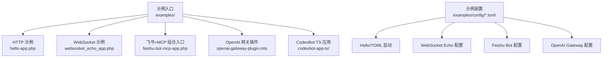
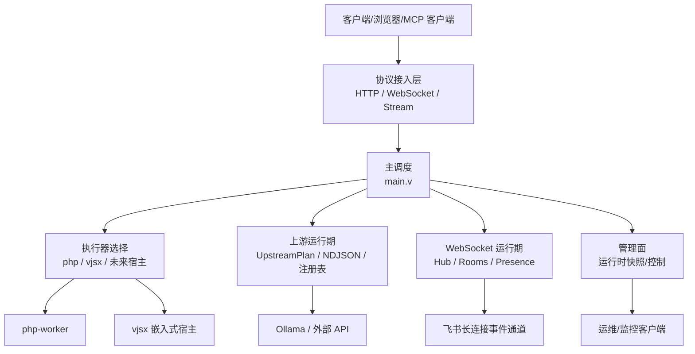
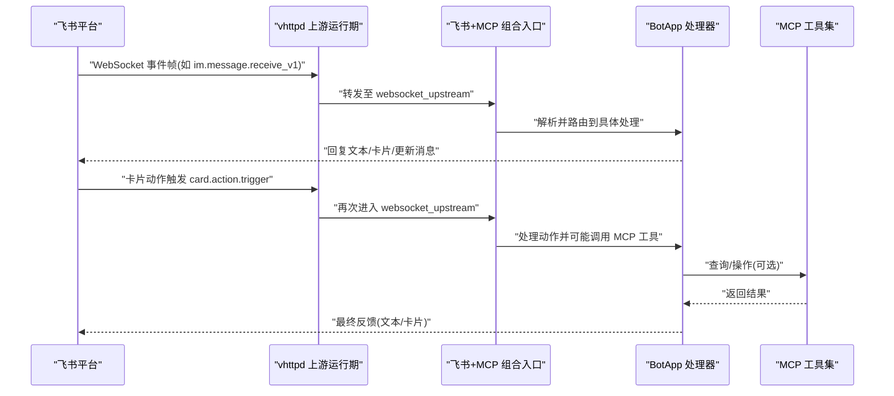
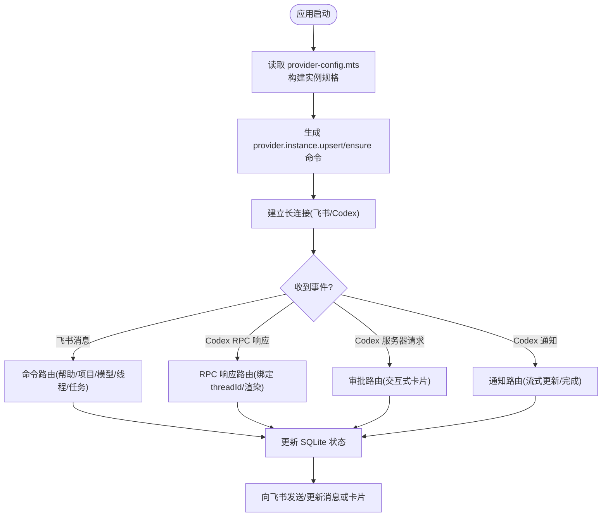
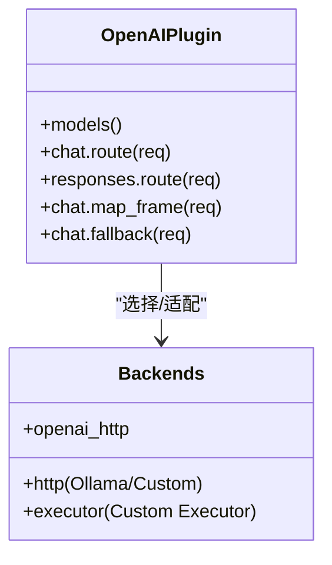
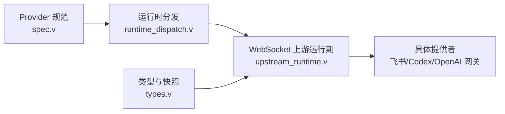

# 开发示例

<cite>
**本文引用的文件**   
- [README.md](file://README.md)
- [examples/README.md](file://examples/README.md)
- [examples/config/hello.toml](file://examples/config/hello.toml)
- [examples/config/websocket-echo.toml](file://examples/config/websocket-echo.toml)
- [examples/config/feishu-bot.toml](file://examples/config/feishu-bot.toml)
- [examples/config/openai-gateway.toml](file://examples/config/openai-gateway.toml)
- [examples/hello-app.php](file://examples/hello-app.php)
- [examples/websocket_echo_app.php](file://examples/websocket_echo_app.php)
- [examples/feishu-bot-mcp-app.php](file://examples/feishu-bot-mcp-app.php)
- [examples/vjsx/openai-gateway-plugin.mts](file://examples/vjsx/openai-gateway-plugin.mts)
- [examples/codexbot-app-ts/app.mts](file://examples/codexbot-app-ts/app.mts)
- [examples/codexbot-app-ts/lib/bot-runtime.mjs](file://examples/codexbot-app-ts/lib/bot-runtime.mjs)
- [examples/codexbot-app-ts/lib/provider-runtime.mjs](file://examples/codexbot-app-ts/lib/provider-runtime.mjs)
- [examples/codexbot-app-ts/config/provider-config.mts](file://examples/codexbot-app-ts/config/provider-config.mts)
- [src/ws/types.v](file://src/ws/types.v)
- [src/provider/spec.v](file://src/provider/spec.v)
- [src/provider/runtime_dispatch.v](file://src/provider/runtime_dispatch.v)
- [src/ws/upstream_runtime.v](file://src/ws/upstream_runtime.v)
</cite>

## 目录
1. [简介](#简介)
2. [项目结构](#项目结构)
3. [核心组件](#核心组件)
4. [架构总览](#架构总览)
5. [详细组件分析](#详细组件分析)
6. [依赖关系分析](#依赖关系分析)
7. [性能与流式特性](#性能与流式特性)
8. [故障排查指南](#故障排查指南)
9. [结论](#结论)
10. [附录：配置与部署要点](#附录配置与部署要点)

## 简介
本文件面向“自定义上游提供者”开发者，提供从基础 HTTP 到复杂 WebSocket、流式响应与多协议适配的完整示例集合。内容覆盖：
- 基础 HTTP 提供者（PHP）
- WebSocket 回显提供者（PHP）
- 飞书机器人提供者（真实业务场景：消息收发、卡片交互、事件订阅）
- Codex AI 服务提供者（长连接、流式对话、状态同步）
- OpenAI 网关提供者（协议适配与数据转换）

每个示例均包含：配置文件路径、入口实现、关键逻辑说明、测试与验证方式、部署说明与常见问题。

## 项目结构
仓库提供了丰富的示例与配置，便于快速上手与扩展：
- 示例应用与脚本位于 examples/ 下，按功能划分（HTTP、WebSocket、AI 代理、MCP、框架集成等）
- 示例 TOML 配置集中在 examples/config/ 下，可直接用于启动不同模式
- vjsx 插件与 TS 应用示例位于 examples/vjsx 与 examples/codexbot-app-ts
- 运行时与上游提供者相关核心代码位于 src/ 下的 provider、ws、upstream 等模块

图表来源
- [examples/README.md:1-120](file://examples/README.md#L1-L120)
- [examples/config/hello.toml:1-22](file://examples/config/hello.toml#L1-L22)
- [examples/config/websocket-echo.toml:1-28](file://examples/config/websocket-echo.toml#L1-L28)
- [examples/config/feishu-bot.toml:1-40](file://examples/config/feishu-bot.toml#L1-L40)
- [examples/config/openai-gateway.toml:1-65](file://examples/config/openai-gateway.toml#L1-L65)

章节来源
- [examples/README.md:1-120](file://examples/README.md#L1-L120)
- [README.md:428-525](file://README.md#L428-L525)

## 核心组件
- 上游提供者抽象与分发
  - 提供通用接口与运行时指标聚合，支持多实例、可观测性与命令执行桥接
- WebSocket 上游运行期
  - 负责长连接生命周期管理、自动重连、事件回调与错误处理
- 类型与快照
  - 定义上游连接快照、发送请求/结果结构，支撑管理与调试端点

章节来源
- [src/provider/spec.v:1-40](file://src/provider/spec.v#L1-L40)
- [src/ws/upstream_runtime.v:64-106](file://src/ws/upstream_runtime.v#L64-L106)
- [src/ws/types.v:198-259](file://src/ws/types.v#L198-L259)

## 架构总览
vhttpd 作为传输与运行时层，统一承载 HTTP/WebSocket/流式协议，并将业务逻辑委派给可插拔的执行器与上游提供者。

图表来源
- [README.md:84-126](file://README.md#L84-L126)

## 详细组件分析

### 基础 HTTP 提供者（PHP）
- 目标：最小化 HTTP 路由与响应，展示 vhttpd + php-worker 的基础用法
- 配置要点
  - 监听端口、进程 PID 与事件日志路径
  - worker 自启动、读超时、socket 路径与命令模板
  - 环境变量注入 VHTTPD_APP 指向应用入口
- 入口实现
  - 使用 VSlim 构建路由组与命名路由，返回结构化响应体
- 验证方式
  - 通过 curl 访问 /hello/:name、/go/:name、/api/meta

章节来源
- [examples/config/hello.toml:1-22](file://examples/config/hello.toml#L1-L22)
- [examples/hello-app.php:1-49](file://examples/hello-app.php#L1-L49)
- [examples/README.md:1-40](file://examples/README.md#L1-L40)

### WebSocket 回显提供者（PHP）
- 目标：演示 WebSocket 升级与帧处理在 PHP 侧的实现
- 配置要点
  - 独立端口与 admin 面板
  - 较长的 worker 读超时以匹配 WS 长连接
  - 静态资源托管前端页面与脚本
- 入口实现
  - 提供 HTTP 页面与健康检查
  - 定义 onOpen/onMessage/onClose 回调，完成 echo 与主动关闭
- 验证方式
  - 打开本地页面，连接 ws://127.0.0.1:19888/ws，发送文本并观察回显

章节来源
- [examples/config/websocket-echo.toml:1-28](file://examples/config/websocket-echo.toml#L1-L28)
- [examples/websocket_echo_app.php:1-240](file://examples/websocket_echo_app.php#L1-L240)
- [examples/README.md:117-146](file://examples/README.md#L117-L146)

### 飞书机器人提供者（真实业务场景）
- 目标：实现消息收发、卡片交互、事件订阅，并与 MCP 工具集结合
- 配置要点
  - 启用 feishu 模块，设置 open_base_url、重连延迟、最近事件限制
  - 为实例 main 配置 app_id、app_secret、verification_token、encrypt_key
- 入口实现
  - 组合 HTTP 路由、飞书 Bot 适配器与 MCP 工具集
  - 暴露调试端点用于发送文本/图片（本地或远程）
  - 将 websocket_upstream 事件交由 BotApp 处理
- 关键流程
  - 事件订阅：im.message.receive_v1 等事件进入 websocket_upstream
  - 卡片交互：card.action.trigger 由同一通道处理
  - MCP 工具：通过 McpToolset 注册，供外部调用

图表来源
- [examples/feishu-bot-mcp-app.php:1-157](file://examples/feishu-bot-mcp-app.php#L1-L157)
- [examples/config/feishu-bot.toml:1-40](file://examples/config/feishu-bot.toml#L1-L40)
- [README.md:674-731](file://README.md#L674-L731)

章节来源
- [examples/config/feishu-bot.toml:1-40](file://examples/config/feishu-bot.toml#L1-L40)
- [examples/feishu-bot-mcp-app.php:1-157](file://examples/feishu-bot-mcp-app.php#L1-L157)
- [README.md:674-731](file://README.md#L674-L731)

### Codex AI 服务提供者（TS/vjsx）
- 目标：实现长连接、流式对话、状态同步，并在飞书环境中渲染与交互
- 配置要点
  - 站点级 vjsx 配置，指定 app_entry、module_root、build_root、runtime_profile、thread_count
  - 通过 provider-config.mts 声明多个 Codex 实例与默认项
- 入口实现
  - app.mts 导出 startup/app_startup/http/websocket_upstream 钩子
  - bot-runtime.mjs 组装命令路由、通知路由、RPC 路由、审批路由、会话协调器等
  - provider-runtime.mjs 负责实例规格构建、启动编排与预检
- 关键流程
  - 启动阶段：根据 provider-config 生成 provider.instance.upsert/ensure 命令
  - 事件处理：
    - 飞书事件：im.message.receive_v1、card.action.trigger -> 路由到命令处理器
    - Codex 事件：codex.rpc.response、codex.server_request、codex.notification -> 分别路由到对应处理器
  - 状态同步：SQLite 持久化 chat/stream/settings/project 等状态，驱动 UI 与后续交互

图表来源
- [examples/codexbot-app-ts/app.mts:1-35](file://examples/codexbot-app-ts/app.mts#L1-L35)
- [examples/codexbot-app-ts/lib/bot-runtime.mjs:1-634](file://examples/codexbot-app-ts/lib/bot-runtime.mjs#L1-L634)
- [examples/codexbot-app-ts/lib/provider-runtime.mjs:1-181](file://examples/codexbot-app-ts/lib/provider-runtime.mjs#L1-L181)
- [examples/codexbot-app-ts/config/provider-config.mts:1-33](file://examples/codexbot-app-ts/config/provider-config.mts#L1-L33)

章节来源
- [examples/codexbot-app-ts/app.mts:1-35](file://examples/codexbot-app-ts/app.mts#L1-L35)
- [examples/codexbot-app-ts/lib/bot-runtime.mjs:1-634](file://examples/codexbot-app-ts/lib/bot-runtime.mjs#L1-L634)
- [examples/codexbot-app-ts/lib/provider-runtime.mjs:1-181](file://examples/codexbot-app-ts/lib/provider-runtime.mjs#L1-L181)
- [examples/codexbot-app-ts/config/provider-config.mts:1-33](file://examples/codexbot-app-ts/config/provider-config.mts#L1-L33)

### OpenAI 网关提供者（协议适配与数据转换）
- 目标：将 OpenAI 标准接口适配到多种后端（OpenAI、Ollama、自定义、执行器），并支持流式映射与回退策略
- 配置要点
  - 启用 openai 模块，设置 base_path、默认后端与插件
  - 定义多个后端（openai_http、http、executor）及路由规则（按模型名）
- 插件实现
  - 路由决策：chat.route/responses.route 根据 model 选择后端与 stream_mode
  - 帧映射：chat.map_frame 将下游帧转换为 OpenAI 兼容格式
  - 回退：chat.fallback 在特定失败条件下切换到备用后端
- 验证方式
  - 通过 /v1/chat/completions 与 /v1/responses 发起请求，观察路由与映射行为

图表来源
- [examples/config/openai-gateway.toml:1-65](file://examples/config/openai-gateway.toml#L1-L65)
- [examples/vjsx/openai-gateway-plugin.mts:1-213](file://examples/vjsx/openai-gateway-plugin.mts#L1-L213)

章节来源
- [examples/config/openai-gateway.toml:1-65](file://examples/config/openai-gateway.toml#L1-L65)
- [examples/vjsx/openai-gateway-plugin.mts:1-213](file://examples/vjsx/openai-gateway-plugin.mts#L1-L213)

## 依赖关系分析
- 上游提供者抽象与分发
  - 提供 ProviderCommandHandler 接口与 Noop 默认实现，避免空指针
  - RuntimeDispatchContext 封装实例枚举、启用判断、拉取 URL 等能力
  - upstream_provider_names 与 upstream_launches 汇总可用提供者与启动项
- WebSocket 上游运行期
  - run_provider 循环拉取 URL、创建客户端、注册回调、监听消息、错误与关闭处理
  - 自动重连策略基于 reconnect_delay_ms
- 类型与快照
  - UpstreamSnapshot/UpstreamRuntimeSnapshot 提供连接与统计信息
  - UpstreamSendRequest/UpstreamSendResult/UpstreamUpdateResult 定义发送与结果结构

图表来源
- [src/provider/spec.v:1-40](file://src/provider/spec.v#L1-L40)
- [src/provider/runtime_dispatch.v:1-153](file://src/provider/runtime_dispatch.v#L1-L153)
- [src/ws/upstream_runtime.v:64-106](file://src/ws/upstream_runtime.v#L64-L106)
- [src/ws/types.v:198-259](file://src/ws/types.v#L198-L259)

章节来源
- [src/provider/spec.v:1-40](file://src/provider/spec.v#L1-L40)
- [src/provider/runtime_dispatch.v:1-153](file://src/provider/runtime_dispatch.v#L1-L153)
- [src/ws/upstream_runtime.v:64-106](file://src/ws/upstream_runtime.v#L64-L106)
- [src/ws/types.v:198-259](file://src/ws/types.v#L198-L259)

## 性能与流式特性
- 流式阶段
  - Phase 1：worker 拥有活流（简单 StreamResponse）
  - Phase 2：vhttpd 拥有下游，worker 处理 open/next/close（可回放或合成 SSE/text）
  - Phase 3：vhttpd 拥有下游与上游（例如 Ollama token 流）
- 优势
  - 统一的流式契约，降低跨层缓冲与时延调优复杂度
  - 可观测性集中于 worker 边界，便于定位问题
- 建议
  - 合理设置 worker 读超时与队列容量
  - 对长连接与流式场景，优先采用 phase 2/3 模式解耦连接与 worker 占用

章节来源
- [README.md:191-208](file://README.md#L191-L208)
- [README.md:175-189](file://README.md#L175-L189)

## 故障排查指南
- 常见症状
  - 上游连接频繁断开：检查 reconnect_delay_ms 与网络稳定性
  - 事件未到达应用：确认 websocket_upstream 路由是否匹配 eventType
  - 卡片交互无响应：检查 card.action.trigger 分支与参数解析
  - OpenAI 路由异常：核对 model 与 routes 配置、后端可达性与鉴权
- 诊断手段
  - 查看 /admin/runtime/upstreams/websocket 与 events 快照
  - 使用 provider-specific 端点（如 /admin/runtime/feishu）获取连接与聊天快照
  - 通过 gateway 发送 API 进行端到端验证
- 参考文档
  - README 中关于 WebSocket 上游与飞书回调入口的说明

章节来源
- [README.md:674-731](file://README.md#L674-L731)

## 结论
本示例集合覆盖了从基础 HTTP 到复杂 WebSocket 与多协议适配的上游提供者开发路径。借助 vhttpd 的统一传输与运行时能力，开发者可以专注于业务逻辑与协议适配，同时获得一致的流式体验与可观测性。

## 附录：配置与部署要点
- 一键启动
  - 使用 examples/config/*.toml 直接启动不同示例
- 多监听模式
  - 一个进程监听多个 host:port，每个 site 隔离运行环境与执行器
- 环境变量
  - 通过 [worker.env] 注入，PHP 侧可通过 getenv 读取
- 服务管理
  - Linux 推荐 systemd，macOS 推荐 launchd；保持前台运行并由系统管理器接管

章节来源
- [examples/README.md:1-52](file://examples/README.md#L1-L52)
- [README.md:533-603](file://README.md#L533-L603)
- [README.md:367-411](file://README.md#L367-L411)