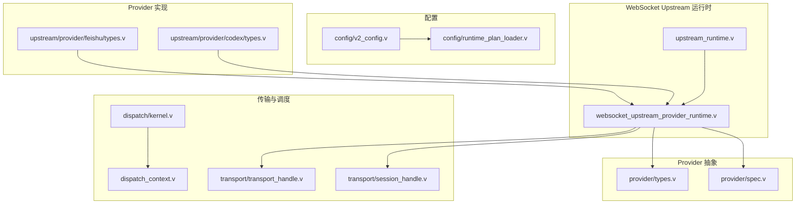
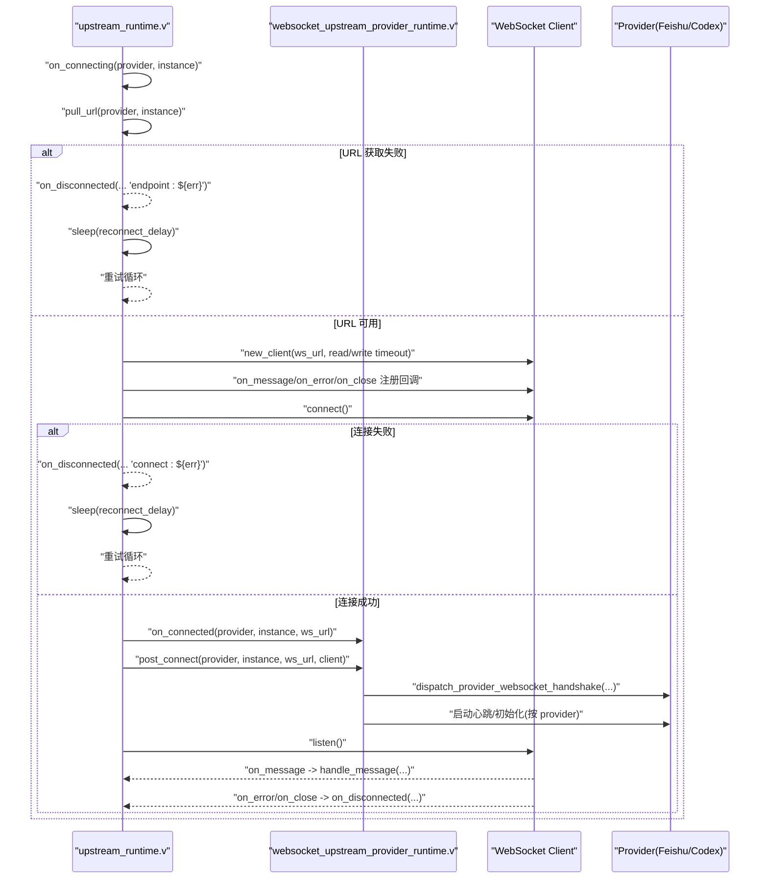
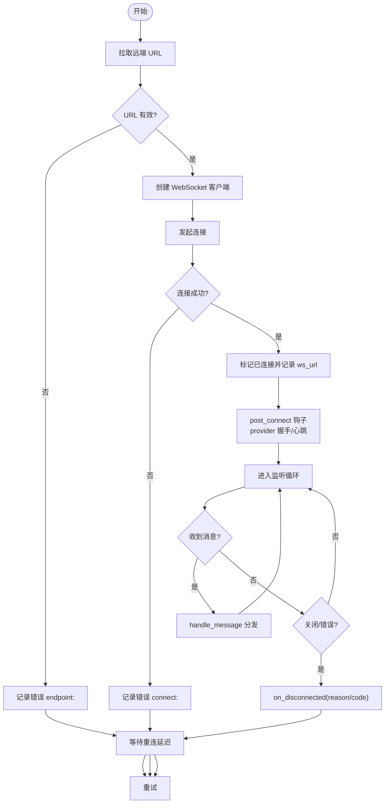
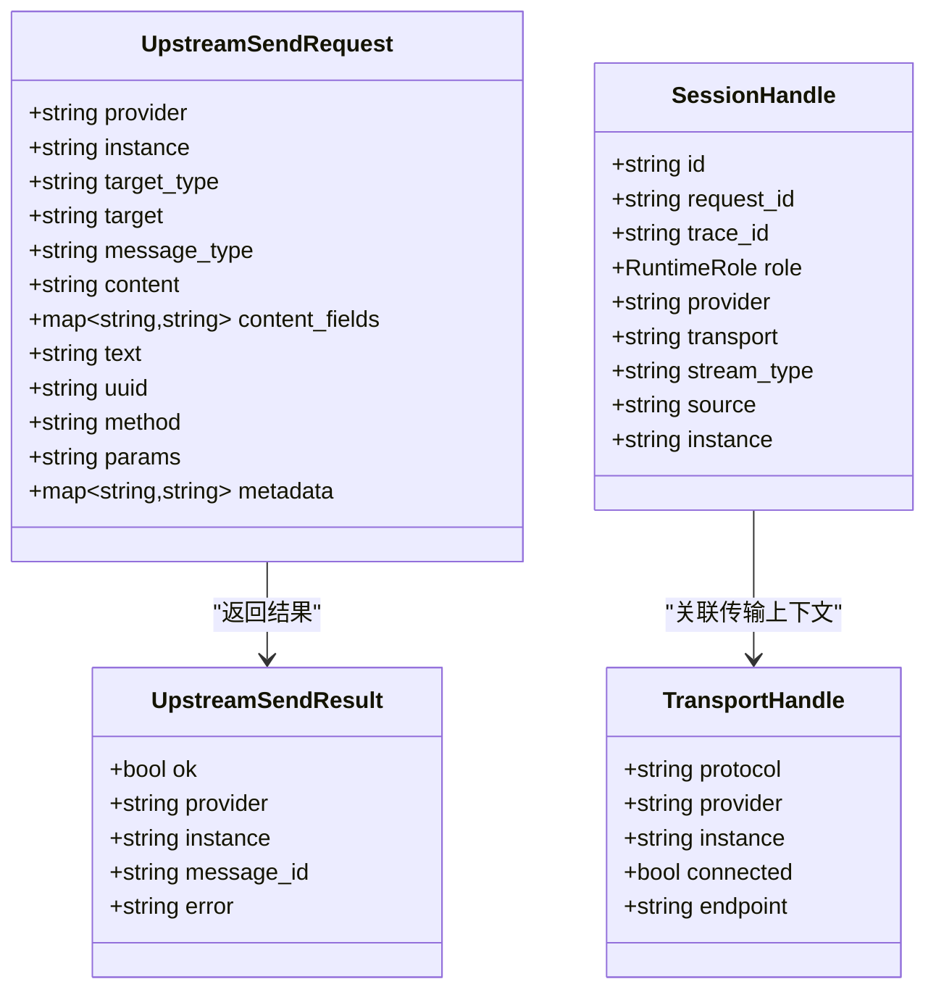
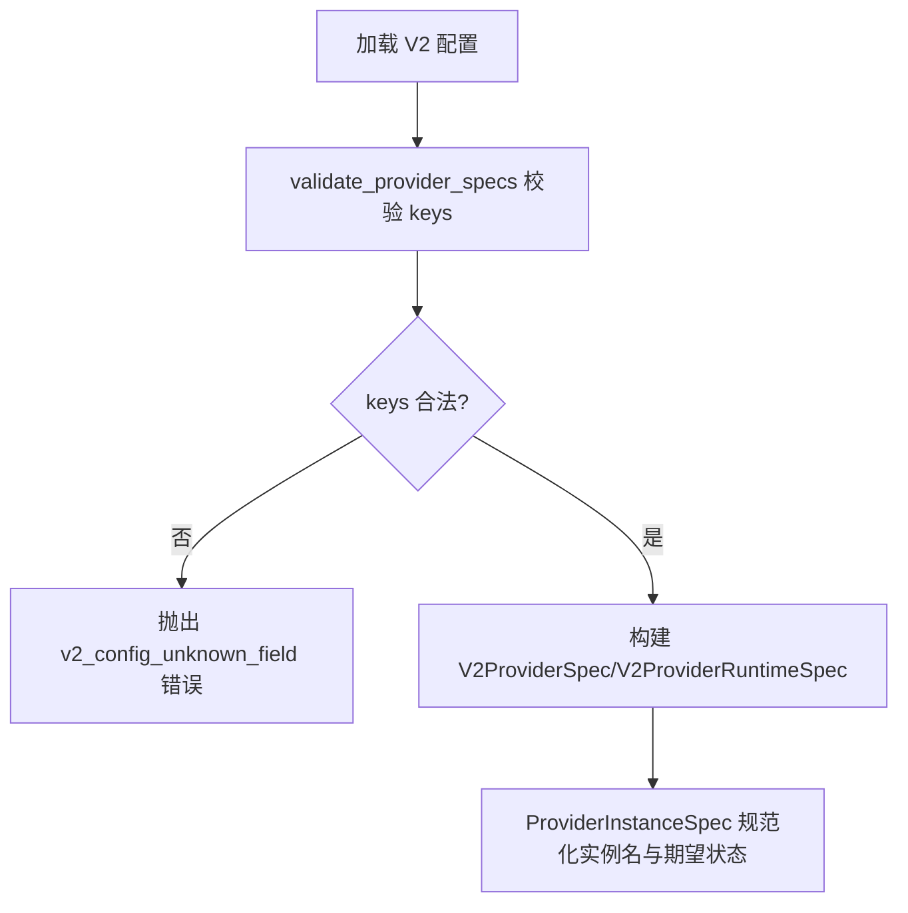
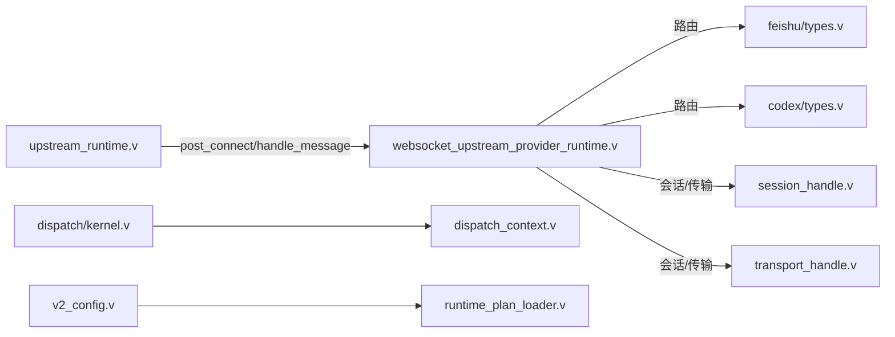

# 提供者接口设计

<cite>
**本文引用的文件**   
- [src/ws/upstream_runtime.v](file://src/ws/upstream_runtime.v)
- [src/websocket_upstream_provider_runtime.v](file://src/websocket_upstream_provider_runtime.v)
- [src/provider/spec.v](file://src/provider/spec.v)
- [src/provider/types.v](file://src/provider/types.v)
- [src/upstream/transport/session_handle.v](file://src/upstream/transport/session_handle.v)
- [src/upstream/transport/transport_handle.v](file://src/upstream/transport/transport_handle.v)
- [src/dispatch/kernel.v](file://src/dispatch/kernel.v)
- [src/dispatch_context.v](file://src/dispatch_context.v)
- [src/upstream/types.v](file://src/upstream/types.v)
- [src/config/v2_config.v](file://src/config/v2_config.v)
- [src/config/runtime_plan_loader.v](file://src/config/runtime_plan_loader.v)
- [src/provider_instance_runtime.v](file://src/provider_instance_runtime.v)
- [src/provider_registry.v](file://src/provider_registry.v)
- [src/upstream/provider/feishu/types.v](file://src/upstream/provider/feishu/types.v)
- [src/upstream/provider/codex/types.v](file://src/upstream/provider/codex/types.v)
</cite>

## 目录
1. [简介](#简介)
2. [项目结构](#项目结构)
3. [核心组件](#核心组件)
4. [架构总览](#架构总览)
5. [详细组件分析](#详细组件分析)
6. [依赖关系分析](#依赖关系分析)
7. [性能考量](#性能考量)
8. [故障排查指南](#故障排查指南)
9. [结论](#结论)
10. [附录](#附录)

## 简介
本文件围绕“自定义上游提供者（UpstreamProvider）”的接口设计与实现要求，系统化阐述：
- UpstreamProvider 接口的生命周期方法、消息处理方法与状态管理方法
- 连接建立与断开流程（含认证机制、握手协议、连接参数配置）
- 消息发送与接收的接口规范（消息格式、异步处理模式、错误返回机制）
- 提供者规格 ProviderSpec 的结构与使用方式（字段校验、默认值、环境变量支持）
- 完整实现示例与异常处理要点

该设计以 WebSocket 为传输层抽象，将通用 upstream 运行时与 provider 专属逻辑解耦，便于扩展新的上游提供方。

## 项目结构
本项目采用分层与按功能域组织的方式：
- ws/upstream_runtime.v：WebSocket upstream 运行时，负责建连、重连、监听、回调分发
- websocket_upstream_provider_runtime.v：应用侧对上游运行时的桥接，提供 post_connect 钩子与 provider 路由
- provider/spec.v 与 provider/types.v：命令处理器接口、运行时指标、实例规格等
- upstream/transport/*：会话句柄、传输句柄等跨模块共享类型
- dispatch/*：调度上下文构建与请求构建
- config/*：V2 配置模型与校验
- upstream/provider/*：具体 provider 运行时状态与快照（如 feishu、codex）

图表来源
- [src/ws/upstream_runtime.v:64-121](file://src/ws/upstream_runtime.v#L64-L121)
- [src/websocket_upstream_provider_runtime.v:37-80](file://src/websocket_upstream_provider_runtime.v#L37-L80)
- [src/provider/spec.v:1-41](file://src/provider/spec.v#L1-L41)
- [src/provider/types.v:1-118](file://src/provider/types.v#L1-L118)
- [src/upstream/transport/session_handle.v:1-90](file://src/upstream/transport/session_handle.v#L1-L90)
- [src/upstream/transport/transport_handle.v:1-21](file://src/upstream/transport/transport_handle.v#L1-L21)
- [src/dispatch/kernel.v:100-121](file://src/dispatch/kernel.v#L100-L121)
- [src/dispatch_context.v:1-35](file://src/dispatch_context.v#L1-L35)
- [src/config/v2_config.v:261-318](file://src/config/v2_config.v#L261-L318)
- [src/config/runtime_plan_loader.v:535-583](file://src/config/runtime_plan_loader.v#L535-L583)
- [src/upstream/provider/feishu/types.v:1-333](file://src/upstream/provider/feishu/types.v#L1-L333)
- [src/upstream/provider/codex/types.v:1-251](file://src/upstream/provider/codex/types.v#L1-L251)

章节来源
- [src/ws/upstream_runtime.v:64-121](file://src/ws/upstream_runtime.v#L64-L121)
- [src/websocket_upstream_provider_runtime.v:37-80](file://src/websocket_upstream_provider_runtime.v#L37-L80)
- [src/provider/spec.v:1-41](file://src/provider/spec.v#L1-L41)
- [src/provider/types.v:1-118](file://src/provider/types.v#L1-L118)
- [src/upstream/transport/session_handle.v:1-90](file://src/upstream/transport/session_handle.v#L1-L90)
- [src/upstream/transport/transport_handle.v:1-21](file://src/upstream/transport/transport_handle.v#L1-L21)
- [src/dispatch/kernel.v:100-121](file://src/dispatch/kernel.v#L100-L121)
- [src/dispatch_context.v:1-35](file://src/dispatch_context.v#L1-L35)
- [src/config/v2_config.v:261-318](file://src/config/v2_config.v#L261-L318)
- [src/config/runtime_plan_loader.v:535-583](file://src/config/runtime_plan_loader.v#L535-L583)
- [src/upstream/provider/feishu/types.v:1-333](file://src/upstream/provider/feishu/types.v#L1-L333)
- [src/upstream/provider/codex/types.v:1-251](file://src/upstream/provider/codex/types.v#L1-L251)

## 核心组件
- UpstreamProvider 接口（概念性定义）
  - 生命周期方法：Initialize、Connect、Disconnect
  - 消息处理：SendMessage、ReceiveMessage
  - 状态管理：is_connected、last_error、connect_attempts 等
- WebSocket Upstream 运行时
  - 负责 URL 拉取、客户端创建、连接、监听、错误与关闭回调、重连循环
  - 在连接成功后调用 post_connect 钩子，交由 provider 完成握手与心跳
- Provider 命令处理器
  - ProviderCommandHandler.execute 用于将标准化命令映射到 provider 特定执行逻辑
- 传输与会话句柄
  - TransportHandle：描述当前连接的协议、provider、instance、endpoint、connected 状态
  - SessionHandle：从上游调度请求构造统一会话上下文，包含 role、provider、transport、stream_type、source、instance 等
- 配置与规格
  - V2ProviderSpec/V2ProviderRuntimeSpec：声明 provider 运行时驱动、插件、协议、引擎及选项
  - runtime_plan_loader 提供字段白名单校验
  - ProviderInstanceSpec：存储 provider 实例的配置 JSON、期望状态、时间戳等

章节来源
- [src/provider/spec.v:1-41](file://src/provider/spec.v#L1-L41)
- [src/provider/types.v:1-118](file://src/provider/types.v#L1-L118)
- [src/upstream/transport/session_handle.v:1-90](file://src/upstream/transport/session_handle.v#L1-L90)
- [src/upstream/transport/transport_handle.v:1-21](file://src/upstream/transport/transport_handle.v#L1-L21)
- [src/config/v2_config.v:261-318](file://src/config/v2_config.v#L261-L318)
- [src/config/runtime_plan_loader.v:535-583](file://src/config/runtime_plan_loader.v#L535-L583)
- [src/provider_instance_runtime.v:1-46](file://src/provider_instance_runtime.v#L1-L46)

## 架构总览
下图展示了 WebSocket upstream 的运行期主流程：运行时循环拉取 URL、创建客户端、注册回调、连接成功触发 post_connect，随后进入 listen 循环；错误与关闭事件统一上报并触发重连。

图表来源
- [src/ws/upstream_runtime.v:64-121](file://src/ws/upstream_runtime.v#L64-L121)
- [src/websocket_upstream_provider_runtime.v:37-80](file://src/websocket_upstream_provider_runtime.v#L37-L80)

章节来源
- [src/ws/upstream_runtime.v:64-121](file://src/ws/upstream_runtime.v#L64-L121)
- [src/websocket_upstream_provider_runtime.v:37-80](file://src/websocket_upstream_provider_runtime.v#L37-L80)

## 详细组件分析

### UpstreamProvider 接口定义与实现要求
- 生命周期方法
  - Initialize：provider 初始化（加载配置、准备资源），应在 Connect 之前或首次连接时调用
  - Connect：建立底层连接（例如 WebSocket），进行认证与握手，记录连接状态与元数据
  - Disconnect：清理连接与资源，重置状态，确保可安全重连
- 消息处理
  - SendMessage：向远端发送消息，需支持异步模式与错误返回（如返回 message_id 或错误信息）
  - ReceiveMessage：接收远端消息，解析后转换为内部事件，必要时 ack
- 状态管理
  - is_connected：是否已连接
  - last_error/connect_attempts/connect_successes/received_frames/metrics：用于观测与诊断
- 实现约束
  - 线程安全：并发访问状态需加锁或使用不可变快照
  - 幂等性：重连与重复消息应幂等处理
  - 超时与背压：读写超时、队列容量与丢弃策略需明确
  - 可观测性：关键路径埋点（连接、发送、接收、错误分类）

章节来源
- [src/provider/spec.v:1-41](file://src/provider/spec.v#L1-L41)
- [src/provider/types.v:1-118](file://src/provider/types.v#L1-L118)

### 连接建立与断开流程（认证、握手、参数）
- 连接参数
  - URL 由运行时通过 pull_url 动态获取，失败则记录错误并重试
  - 读/写超时固定为 60s（可在 provider 层覆盖）
- 认证与握手
  - 连接成功后，post_connect 钩子中调用 provider 的 handshake 与心跳
  - Feishu：启动心跳循环，维护 ping_interval
  - Codex：执行初始化握手，绑定 thread/stream 等上下文
- 断开处理
  - error/close 回调统一转为 on_disconnected，携带 reason 与 code
  - 重连延迟 configurable，避免风暴

图表来源
- [src/ws/upstream_runtime.v:64-121](file://src/ws/upstream_runtime.v#L64-L121)
- [src/websocket_upstream_provider_runtime.v:37-80](file://src/websocket_upstream_provider_runtime.v#L37-L80)

章节来源
- [src/ws/upstream_runtime.v:64-121](file://src/ws/upstream_runtime.v#L64-L121)
- [src/websocket_upstream_provider_runtime.v:37-80](file://src/websocket_upstream_provider_runtime.v#L37-L80)

### 消息发送与接收接口规范
- 发送接口
  - 输入：provider、instance、target_type、target、message_type、content/text、metadata 等
  - 输出：UpstreamSendResult（ok、message_id、error）
  - 异步模式：上层可非阻塞提交，provider 内部排队/缓冲，必要时限流
- 接收接口
  - 输入：WebSocket frame（text/binary）
  - 处理：provider 解码为内部事件，填充 trace_id、event_type、message_id、payload、metadata
  - 反馈：根据 provider 协议决定是否 ack
- 错误返回
  - 发送失败：UpstreamSendResult.failure(error)
  - 接收异常：记录 received_frames 不增，更新 last_error，必要时触发重连

图表来源
- [src/upstream/types.v:82-130](file://src/upstream/types.v#L82-L130)
- [src/upstream/transport/session_handle.v:1-90](file://src/upstream/transport/session_handle.v#L1-L90)
- [src/upstream/transport/transport_handle.v:1-21](file://src/upstream/transport/transport_handle.v#L1-L21)

章节来源
- [src/upstream/types.v:82-130](file://src/upstream/types.v#L82-L130)
- [src/upstream/transport/session_handle.v:1-90](file://src/upstream/transport/session_handle.v#L1-L90)
- [src/upstream/transport/transport_handle.v:1-21](file://src/upstream/transport/transport_handle.v#L1-L21)

### 提供者规格 ProviderSpec 结构与使用
- V2ProviderSpec
  - runtime：V2ProviderRuntimeSpec（driver、protocol、plugin、engine）
  - hooks/capabilities/options：扩展能力与运行时选项
  - runtime_driver/runtime_plugin：兼容旧版字段
- 字段校验
  - runtime_plan_loader.validate_provider_specs 仅允许指定键，未知键报错
- 实例规格
  - ProviderInstanceSpec：provider、instance、config_json、desired_state、时间戳
  - normalize_instance_name：空或 default 归一化为 main
  - desired_state_or_default：未设置时默认为 connected
- 环境变量支持
  - 建议在 V2EngineSpec.env 或 options 中注入敏感信息，provider 启动时读取并缓存

图表来源
- [src/config/v2_config.v:261-318](file://src/config/v2_config.v#L261-L318)
- [src/config/runtime_plan_loader.v:535-583](file://src/config/runtime_plan_loader.v#L535-L583)
- [src/provider/types.v:37-100](file://src/provider/types.v#L37-L100)

章节来源
- [src/config/v2_config.v:261-318](file://src/config/v2_config.v#L261-L318)
- [src/config/runtime_plan_loader.v:535-583](file://src/config/runtime_plan_loader.v#L535-L583)
- [src/provider/types.v:37-100](file://src/provider/types.v#L37-L100)

### 完整实现示例（步骤化）
以下为正确实现 UpstreamProvider 的步骤与注意事项（不含代码片段，仅提供路径参考）：
- 初始化
  - 在 Initialize 中解析 V2ProviderSpec 与 ProviderInstanceSpec，加载 env 与 options
  - 预校验必填字段（如 URL、鉴权凭据）
  - 参考路径：[src/config/v2_config.v:261-318](file://src/config/v2_config.v#L261-L318)、[src/provider/types.v:37-100](file://src/provider/types.v#L37-L100)
- 连接
  - Connect 中创建 WebSocket 客户端，设置超时，注册 on_message/on_error/on_close
  - 成功后调用 post_connect 完成握手与心跳
  - 参考路径：[src/ws/upstream_runtime.v:64-121](file://src/ws/upstream_runtime.v#L64-L121)、[src/websocket_upstream_provider_runtime.v:37-80](file://src/websocket_upstream_provider_runtime.v#L37-L80)
- 断开
  - 在 on_error/on_close 中记录 last_error、更新时间戳、清空连接引用
  - 参考路径：[src/ws/upstream_runtime.v:108-121](file://src/ws/upstream_runtime.v#L108-L121)
- 发送消息
  - 将 UpstreamSendRequest 标准化后投递至 provider 发送通道，返回 UpstreamSendResult
  - 参考路径：[src/upstream/types.v:82-130](file://src/upstream/types.v#L82-L130)
- 接收消息
  - 在 handle_message 中将 frame 解码为内部事件，填充 trace_id、event_type、message_id、payload、metadata
  - 参考路径：[src/ws/upstream_runtime.v:108-111](file://src/ws/upstream_runtime.v#L108-L111)、[src/dispatch/kernel.v:100-121](file://src/dispatch/kernel.v#L100-L121)
- 状态管理
  - 暴露 is_connected、metrics 快照，供 admin 与监控消费
  - 参考路径：[src/provider/types.v:1-118](file://src/provider/types.v#L1-L118)

章节来源
- [src/config/v2_config.v:261-318](file://src/config/v2_config.v#L261-L318)
- [src/provider/types.v:37-100](file://src/provider/types.v#L37-L100)
- [src/ws/upstream_runtime.v:64-121](file://src/ws/upstream_runtime.v#L64-L121)
- [src/websocket_upstream_provider_runtime.v:37-80](file://src/websocket_upstream_provider_runtime.v#L37-L80)
- [src/upstream/types.v:82-130](file://src/upstream/types.v#L82-L130)
- [src/dispatch/kernel.v:100-121](file://src/dispatch/kernel.v#L100-L121)

### Provider 运行时状态与快照（Feishu/Codex）
- Feishu
  - ProviderRuntime：维护连接状态、ping 间隔、最近事件列表、计数器等
  - RuntimeAppSnapshot：对外暴露启用/连接/统计信息
  - 参考路径：[src/upstream/provider/feishu/types.v:89-214](file://src/upstream/provider/feishu/types.v#L89-L214)
- Codex
  - ProviderRuntime：维护 initialized、thread/stream 绑定、pending RPC、read fallback 等
  - AdminConfigSnapshot/AdminRuntimeSnapshot：对外暴露配置与运行态
  - 参考路径：[src/upstream/provider/codex/types.v:67-177](file://src/upstream/provider/codex/types.v#L67-L177)

章节来源
- [src/upstream/provider/feishu/types.v:89-214](file://src/upstream/provider/feishu/types.v#L89-L214)
- [src/upstream/provider/codex/types.v:67-177](file://src/upstream/provider/codex/types.v#L67-L177)

## 依赖关系分析
- 运行时耦合
  - upstream_runtime 与 provider 通过 post_connect 与 handle_message 松耦合
  - provider 通过 ProviderCommandHandler 与命令系统对接
- 外部依赖
  - WebSocket 客户端库（net.websocket）
  - 配置加载与校验（v2_config、runtime_plan_loader）
  - 调度上下文构建（dispatch.kernel、dispatch_context）

图表来源
- [src/ws/upstream_runtime.v:64-121](file://src/ws/upstream_runtime.v#L64-L121)
- [src/websocket_upstream_provider_runtime.v:37-80](file://src/websocket_upstream_provider_runtime.v#L37-L80)
- [src/upstream/provider/feishu/types.v:1-333](file://src/upstream/provider/feishu/types.v#L1-L333)
- [src/upstream/provider/codex/types.v:1-251](file://src/upstream/provider/codex/types.v#L1-L251)
- [src/upstream/transport/session_handle.v:1-90](file://src/upstream/transport/session_handle.v#L1-L90)
- [src/upstream/transport/transport_handle.v:1-21](file://src/upstream/transport/transport_handle.v#L1-L21)
- [src/dispatch/kernel.v:100-121](file://src/dispatch/kernel.v#L100-L121)
- [src/dispatch_context.v:1-35](file://src/dispatch_context.v#L1-L35)
- [src/config/v2_config.v:261-318](file://src/config/v2_config.v#L261-L318)
- [src/config/runtime_plan_loader.v:535-583](file://src/config/runtime_plan_loader.v#L535-L583)

章节来源
- [src/ws/upstream_runtime.v:64-121](file://src/ws/upstream_runtime.v#L64-L121)
- [src/websocket_upstream_provider_runtime.v:37-80](file://src/websocket_upstream_provider_runtime.v#L37-L80)
- [src/upstream/transport/session_handle.v:1-90](file://src/upstream/transport/session_handle.v#L1-L90)
- [src/upstream/transport/transport_handle.v:1-21](file://src/upstream/transport/transport_handle.v#L1-L21)
- [src/dispatch/kernel.v:100-121](file://src/dispatch/kernel.v#L100-L121)
- [src/dispatch_context.v:1-35](file://src/dispatch_context.v#L1-L35)
- [src/config/v2_config.v:261-318](file://src/config/v2_config.v#L261-L318)
- [src/config/runtime_plan_loader.v:535-583](file://src/config/runtime_plan_loader.v#L535-L583)

## 性能考量
- 连接池与复用：同一 provider/instance 尽量复用连接，减少握手开销
- 心跳与保活：合理设置 ping_interval，避免频繁断线
- 背压与限流：发送队列容量与丢弃策略，防止内存暴涨
- 批处理与合并：批量发送与聚合响应，降低网络往返
- 可观测性：连接尝试/成功、帧计数、错误分类、耗时分布

## 故障排查指南
- 常见问题定位
  - URL 拉取失败：检查 endpoint 配置与权限
  - 连接失败：查看 last_error 与 connect_attempts，确认网络与证书
  - 频繁断开：关注 close code 与 reason，调整心跳与超时
  - 发送失败：检查 UpstreamSendResult.error 与 send_errors 计数
- 日志与快照
  - 使用 ProviderRuntimeMetrics 与 RuntimeAppSnapshot/AdminRuntimeSnapshot 观察状态
  - 参考路径：
    - [src/provider/types.v:22-31](file://src/provider/types.v#L22-L31)
    - [src/upstream/provider/feishu/types.v:131-214](file://src/upstream/provider/feishu/types.v#L131-L214)
    - [src/upstream/provider/codex/types.v:141-177](file://src/upstream/provider/codex/types.v#L141-L177)

章节来源
- [src/provider/types.v:22-31](file://src/provider/types.v#L22-L31)
- [src/upstream/provider/feishu/types.v:131-214](file://src/upstream/provider/feishu/types.v#L131-L214)
- [src/upstream/provider/codex/types.v:141-177](file://src/upstream/provider/codex/types.v#L141-L177)

## 结论
通过将 WebSocket upstream 运行时与 provider 解耦，结合统一的会话/传输句柄与配置校验，UpstreamProvider 接口能够以一致的方式接入多种上游服务。实现时应重点关注连接健壮性、消息可靠性与可观测性，并通过 ProviderCommandHandler 将命令语义与 provider 行为清晰分离。

## 附录
- 相关常量与内置 provider 名称
  - codex 常量：[src/codex_provider_types.v:1-3](file://src/codex_provider_types.v#L1-L3)
- 运行时注册与发现
  - provider_registry 注册 spec 与 runtime：[src/provider_registry.v:48-104](file://src/provider_registry.v#L48-L104)
- 实例运行时上下文
  - ProviderInstanceRuntimeContext 提供 snapshot/source/static specs/apply/enabled 钩子：[src/provider_instance_runtime.v:1-46](file://src/provider_instance_runtime.v#L1-L46)