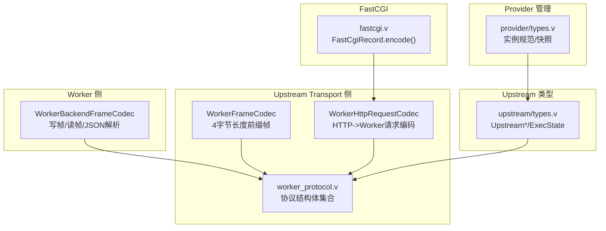
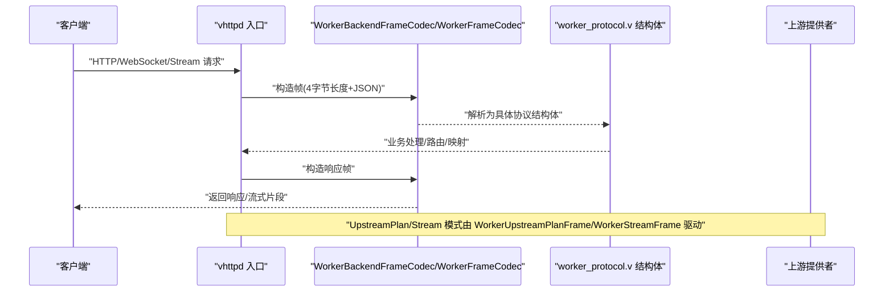
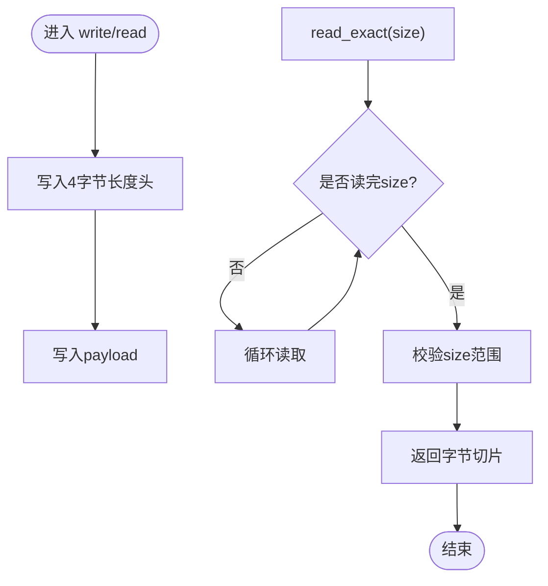
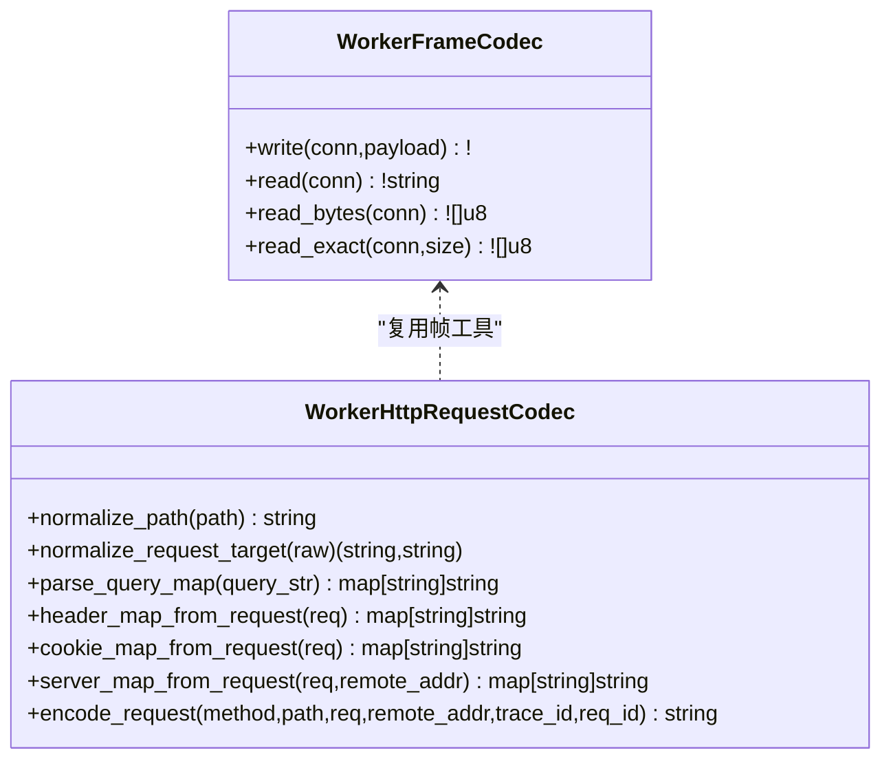
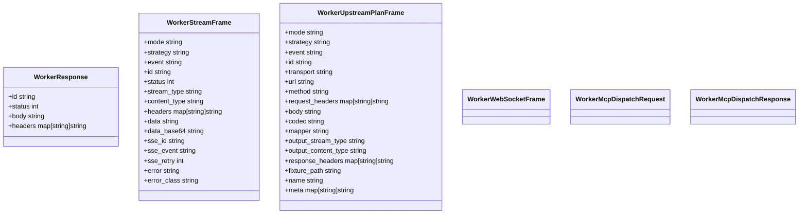
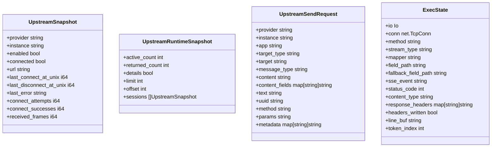
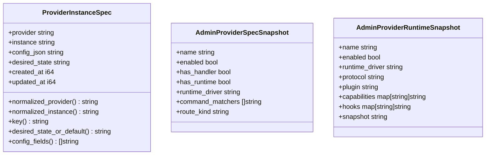
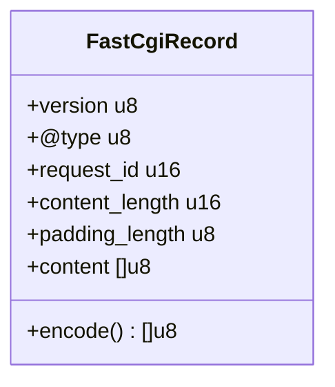
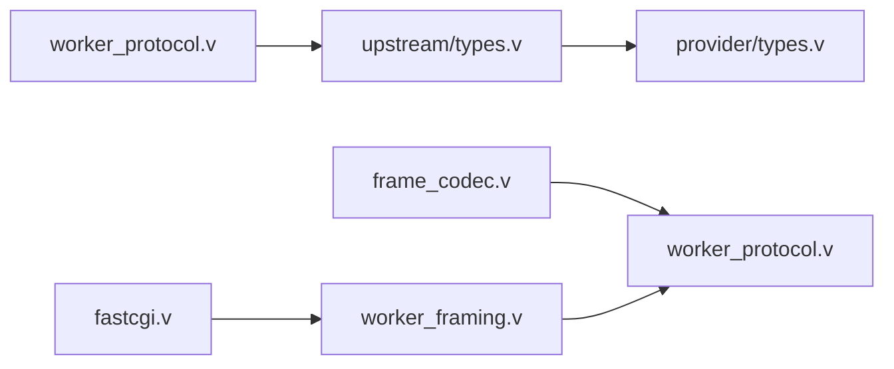

# 数据编解码

<cite>
**本文引用的文件**   
- [src/worker/frame_codec.v](file://src/worker/frame_codec.v)
- [src/upstream/transport/worker_framing.v](file://src/upstream/transport/worker_framing.v)
- [src/upstream/transport/worker_protocol.v](file://src/upstream/transport/worker_protocol.v)
- [src/upstream/types.v](file://src/upstream/types.v)
- [src/provider/types.v](file://src/provider/types.v)
- [src/upstream/transport/fastcgi.v](file://src/upstream/transport/fastcgi.v)
</cite>

## 目录
1. [简介](#简介)
2. [项目结构](#项目结构)
3. [核心组件](#核心组件)
4. [架构总览](#架构总览)
5. [详细组件分析](#详细组件分析)
6. [依赖关系分析](#依赖关系分析)
7. [性能考虑](#性能考虑)
8. [故障排查指南](#故障排查指南)
9. [结论](#结论)
10. [附录](#附录)

## 简介
本指南聚焦于“自定义上游提供者”的数据编解码实现，覆盖协议格式定义、消息帧与流式传输、序列化配置（JSON/XML）、压缩与分块传输、数据验证与清洗、以及性能优化技巧。文档以仓库中已有的 Worker 帧编解码、HTTP/Stream/UpstreamPlan/WebSocket/MCP 等协议结构为基础，给出可落地的实现路径与最佳实践，帮助你在不破坏现有运行时契约的前提下扩展新的上游提供者。

## 项目结构
围绕数据编解码的关键代码主要分布在以下模块：
- worker 帧编解码：WorkerBackendFrameCodec
- upstream transport 帧与请求编码：WorkerFrameCodec、WorkerHttpRequestCodec
- upstream 协议结构体：WorkerResponse、WorkerStreamFrame、WorkerUpstreamPlanFrame、WorkerWebSocketFrame、WorkerMcpDispatchRequest/Response 等
- upstream 类型与执行状态：UpstreamSnapshot、ExecState 等
- provider 管理快照与实例规范：ProviderInstanceSpec、AdminProvider*Snapshot
- FastCGI 记录编码（用于 PHP-FPM 场景）

图示来源
- [src/worker/frame_codec.v:1-73](file://src/worker/frame_codec.v#L1-L73)
- [src/upstream/transport/worker_framing.v:1-231](file://src/upstream/transport/worker_framing.v#L1-L231)
- [src/upstream/transport/worker_protocol.v:1-277](file://src/upstream/transport/worker_protocol.v#L1-L277)
- [src/upstream/types.v:1-328](file://src/upstream/types.v#L1-L238)
- [src/provider/types.v:1-118](file://src/provider/types.v#L1-L118)
- [src/upstream/transport/fastcgi.v:1-74](file://src/upstream/transport/fastcgi.v#L1-L74)

章节来源
- [src/worker/frame_codec.v:1-73](file://src/worker/frame_codec.v#L1-L73)
- [src/upstream/transport/worker_framing.v:1-231](file://src/upstream/transport/worker_framing.v#L1-L231)
- [src/upstream/transport/worker_protocol.v:1-277](file://src/upstream/transport/worker_protocol.v#L1-L277)
- [src/upstream/types.v:1-328](file://src/upstream/types.v#L1-L328)
- [src/provider/types.v:1-118](file://src/provider/types.v#L1-L118)
- [src/upstream/transport/fastcgi.v:1-74](file://src/upstream/transport/fastcgi.v#L1-L74)

## 核心组件
- WorkerBackendFrameCodec：负责与外部 Worker 进程通过 Unix Stream 进行二进制帧读写，并基于 JSON 将载荷解析为具体响应结构体（如 StreamDispatchResponse、MCP 响应、WebSocket 帧等）。
- WorkerFrameCodec：通用 4 字节大端长度前缀的帧编解码器，提供 read/write/read_bytes/read_exact 等基础能力。
- WorkerHttpRequestCodec：将 HTTP 请求标准化为 Worker 可读的 JSON 负载（包含 path/query/headers/cookies/server 等），并支持路径规范化与查询参数解析。
- worker_protocol.v：集中定义所有跨进程协议的结构体，包括 HTTP 响应、Stream 帧、UpstreamPlan 启动帧、WebSocket 事件帧、MCP 调度请求/响应等。
- upstream/types.v：上游运行期快照、发送命令、活动记录、执行状态 ExecState 等。
- provider/types.v：提供者实例规范与管理员可见的快照。
- fastcgi.v：FastCGI Record 编码（面向 PHP-FPM 场景）。

章节来源
- [src/worker/frame_codec.v:1-73](file://src/worker/frame_codec.v#L1-L73)
- [src/upstream/transport/worker_framing.v:1-231](file://src/upstream/transport/worker_framing.v#L1-L231)
- [src/upstream/transport/worker_protocol.v:1-277](file://src/upstream/transport/worker_protocol.v#L1-L277)
- [src/upstream/types.v:1-328](file://src/upstream/types.v#L1-L328)
- [src/provider/types.v:1-118](file://src/provider/types.v#L1-L118)
- [src/upstream/transport/fastcgi.v:1-74](file://src/upstream/transport/fastcgi.v#L1-L74)

## 架构总览
下图展示了从客户端到上游提供者的端到端编解码链路，涵盖 HTTP/Stream/UpstreamPlan/WebSocket/MCP 等多类协议在 vhttpd 内部的流转与转换。

图示来源
- [src/worker/frame_codec.v:1-73](file://src/worker/frame_codec.v#L1-L73)
- [src/upstream/transport/worker_framing.v:1-231](file://src/upstream/transport/worker_framing.v#L1-L231)
- [src/upstream/transport/worker_protocol.v:1-277](file://src/upstream/transport/worker_protocol.v#L1-L277)

## 详细组件分析

### 组件一：Worker 帧编解码（WorkerBackendFrameCodec）
- 职责
  - 写入：先写 4 字节大端长度头，再写 payload 字符串。
  - 读取：固定长度读取，校验大小范围，返回字节或字符串；并提供多种 JSON 反序列化为具体响应类型的便捷方法。
- 关键点
  - 帧大小上限保护，避免超大帧导致内存压力。
  - 统一使用 JSON 作为载荷格式，便于跨语言/跨进程协作。
- 典型用法
  - 读取 StreamDispatchResponse、WorkerMcpDispatchResponse、WorkerWebSocketFrame 等。

图示来源
- [src/worker/frame_codec.v:9-43](file://src/worker/frame_codec.v#L9-L43)

章节来源
- [src/worker/frame_codec.v:1-73](file://src/worker/frame_codec.v#L1-L73)

### 组件二：通用帧与 HTTP 请求编码（WorkerFrameCodec + WorkerHttpRequestCodec）
- 帧编解码
  - 与 WorkerBackendFrameCodec 一致的 4 字节长度前缀帧格式，提供 read/write/read_bytes/read_exact 等工具函数。
- HTTP 请求编码
  - 规范化路径与查询串，合并多值 Header（Cookie 特殊拼接），提取 server 信息，注入 x-request-id/x-vhttpd-trace-id。
  - 输出统一的 WorkerRequestPayload JSON，供下游 Worker 消费。

图示来源
- [src/upstream/transport/worker_framing.v:14-60](file://src/upstream/transport/worker_framing.v#L14-L60)
- [src/upstream/transport/worker_framing.v:64-203](file://src/upstream/transport/worker_framing.v#L64-L203)

章节来源
- [src/upstream/transport/worker_framing.v:1-231](file://src/upstream/transport/worker_framing.v#L1-L231)

### 组件三：协议结构体（worker_protocol.v）
- 关键结构体
  - WorkerResponse：标准 HTTP 响应封装。
  - WorkerStreamFrame：流式事件帧，支持 start/chunk/end/error 等事件，携带 SSE 相关字段。
  - WorkerUpstreamPlanFrame：上游计划启动帧，指定 transport/url/method/codec/mapper/output_stream_type 等。
  - WorkerWebSocketFrame / WorkerWebSocketDispatchResponse：WebSocket 事件与调度响应。
  - WorkerMcpDispatchRequest/Response：MCP 调度请求与响应。
- 设计要点
  - 使用 json tag 控制字段名映射（例如 stream_type、content_type、error_class 等）。
  - 通过 mode/strategy/event 等枚举型字段区分不同阶段与策略。

图示来源
- [src/upstream/transport/worker_protocol.v:4-277](file://src/upstream/transport/worker_protocol.v#L4-L277)

章节来源
- [src/upstream/transport/worker_protocol.v:1-277](file://src/upstream/transport/worker_protocol.v#L1-L277)

### 组件四：上游类型与执行状态（upstream/types.v）
- 上游快照与列表：UpstreamSnapshot、UpstreamRuntimeSnapshot、UpstreamEventListSnapshot、UpstreamActivityListSnapshot。
- 发送命令与结果：UpstreamSendRequest、UpstreamSendResult、UpstreamUpdateResult。
- 执行状态：ExecState 维护单次上游流执行的上下文（连接、SSE 事件、状态码、内容类型、响应头、缓冲等）。

图示来源
- [src/upstream/types.v:22-164](file://src/upstream/types.v#L22-L164)
- [src/upstream/types.v:82-130](file://src/upstream/types.v#L82-L130)
- [src/upstream/types.v:309-328](file://src/upstream/types.v#L309-L328)

章节来源
- [src/upstream/types.v:1-328](file://src/upstream/types.v#L1-L328)

### 组件五：提供者实例与快照（provider/types.v）
- ProviderInstanceSpec：存储提供者实例的期望配置、期望状态、创建/更新时间等。
- AdminProvider*Snapshot：向管理员暴露的运行时可见性快照（能力、钩子、URL、连接状态等）。

图示来源
- [src/provider/types.v:37-118](file://src/provider/types.v#L37-L118)

章节来源
- [src/provider/types.v:1-118](file://src/provider/types.v#L1-L118)

### 组件六：FastCGI 记录编码（fastcgi.v）
- 用途：面向 PHP-FPM 场景，按 FastCGI 协议编码 Record（版本、类型、请求ID、内容长度、填充、内容等）。
- 关键点：16 位大端序、Name-Value 长度对编码、填充字节。

图示来源
- [src/upstream/transport/fastcgi.v:22-74](file://src/upstream/transport/fastcgi.v#L22-L74)

章节来源
- [src/upstream/transport/fastcgi.v:1-74](file://src/upstream/transport/fastcgi.v#L1-L74)

## 依赖关系分析
- 编解码层依赖
  - WorkerBackendFrameCodec 依赖 json 与 unix.StreamConn，直接操作底层 I/O。
  - WorkerFrameCodec/WorkerHttpRequestCodec 依赖 http.Request、net.unix、urllib 等标准库。
  - worker_protocol.v 仅定义结构体，被上层编排逻辑引用。
- 运行时依赖
  - upstream/types.v 依赖 executor/command/net 等模块，承载运行期状态与命令。
  - provider/types.v 依赖 command 与 x.json2，用于实例管理与配置解析。
- 外部集成点
  - FastCGI 编码用于与 PHP-FPM 通信。
  - WebSocket/MCP/Stream 等协议通过同一帧通道与 Worker 交互。

图示来源
- [src/worker/frame_codec.v:1-73](file://src/worker/frame_codec.v#L1-L73)
- [src/upstream/transport/worker_framing.v:1-231](file://src/upstream/transport/worker_framing.v#L1-L231)
- [src/upstream/transport/worker_protocol.v:1-277](file://src/upstream/transport/worker_protocol.v#L1-L277)
- [src/upstream/types.v:1-328](file://src/upstream/types.v#L1-L328)
- [src/provider/types.v:1-118](file://src/provider/types.v#L1-L118)
- [src/upstream/transport/fastcgi.v:1-74](file://src/upstream/transport/fastcgi.v#L1-L74)

章节来源
- [src/worker/frame_codec.v:1-73](file://src/worker/frame_codec.v#L1-L73)
- [src/upstream/transport/worker_framing.v:1-231](file://src/upstream/transport/worker_framing.v#L1-L231)
- [src/upstream/transport/worker_protocol.v:1-277](file://src/upstream/transport/worker_protocol.v#L1-L277)
- [src/upstream/types.v:1-328](file://src/upstream/types.v#L1-L328)
- [src/provider/types.v:1-118](file://src/provider/types.v#L1-L118)
- [src/upstream/transport/fastcgi.v:1-74](file://src/upstream/transport/fastcgi.v#L1-L74)

## 性能考虑
- 帧大小限制与内存安全
  - 当前实现限制单帧最大 16MB，防止异常大帧导致 OOM。建议在上游计划或应用层进一步细化阈值，结合业务峰值评估。
- JSON 编解码开销
  - 全链路采用 JSON，适合跨语言与调试，但存在额外 CPU 与内存分配。对于高频小帧场景，可考虑：
    - 批量聚合：将多个小事件合并为一次帧发送。
    - 对象池：复用字节缓冲区，减少分配。
    - 零拷贝思路：尽量传递 []u8 而非频繁 to_string()/bytestr() 转换。
- 流式传输优化
  - 使用 read_exact 确保完整读取，避免半包导致的重复解析。
  - 对 SSE/文本流，优先使用 line_buf 与 token_index 逐步解析，降低整行复制成本。
- 压缩与分块
  - 当前未内置 gzip/deflate 压缩。若需启用，建议在帧层之上增加可选压缩包装：
    - 协商：在 UpstreamPlanFrame 中新增 codec=“gzip”/“deflate”。
    - 分块：保持 4 字节长度前缀不变，payload 为压缩后的字节流。
    - 流式压缩：使用增量压缩器，边读边压，避免一次性加载大对象。
- 并发与锁
  - 上游执行状态 ExecState 应尽量避免共享可变状态，必要时加细粒度锁，遵循全局锁顺序约定，避免死锁。

[本节为通用指导，无需特定文件来源]

## 故障排查指南
- 常见错误
  - “unexpected EOF”：读取不足 size 字节即断开，检查对端是否提前关闭或网络异常。
  - “invalid frame size”：帧大小超出允许范围或为负数，检查发送端是否正确写入长度头。
  - JSON 解析失败：确认结构体 json tag 与对端一致，字段名/类型匹配。
- 定位手段
  - 开启 trace_id/request_id 透传，关联上下游日志。
  - 打印帧原始字节与解析后结构体，快速比对差异。
  - 针对 WebSocket/MCP/Stream 分别查看对应响应结构体的 error/error_class 字段。

章节来源
- [src/worker/frame_codec.v:17-43](file://src/worker/frame_codec.v#L17-L43)
- [src/upstream/transport/worker_framing.v:22-60](file://src/upstream/transport/worker_framing.v#L22-L60)
- [src/upstream/transport/worker_protocol.v:118-277](file://src/upstream/transport/worker_protocol.v#L118-L277)

## 结论
本指南基于仓库现有实现，系统梳理了自定义上游提供者的数据编解码方案：以 4 字节长度前缀帧为载体、JSON 为载荷、结构化协议体为契约，配合 UpstreamPlan/Stream/WebSocket/MCP 等模式，形成可扩展、可观测、可运维的统一编解码体系。在此基础上，可按需引入压缩、分块与批量化优化，并通过严格的输入校验与清洗保障健壮性。

[本节为总结，无需特定文件来源]

## 附录

### 协议格式速查表
- 帧格式
  - 头部：4 字节大端整数表示 payload 长度
  - 载荷：JSON 字符串
- 关键结构体
  - WorkerRequestPayload：HTTP 请求标准化负载
  - WorkerStreamFrame：流式事件帧（start/chunk/end/error）
  - WorkerUpstreamPlanFrame：上游计划启动帧（transport/url/codec/mapper 等）
  - WorkerWebSocketFrame：WebSocket 事件帧
  - WorkerMcpDispatchRequest/Response：MCP 调度请求/响应
- 字段映射规则
  - 使用 json tag 指定字段名（如 stream_type、content_type、error_class 等）
  - 多值 Header 合并为逗号分隔字符串，Cookie 特殊拼接为分号分隔
- 类型转换处理
  - 数值/布尔/字符串/Map/数组等原生类型直接映射
  - 复杂对象通过嵌套结构体表达，注意空值与默认值处理

章节来源
- [src/upstream/transport/worker_framing.v:14-60](file://src/upstream/transport/worker_framing.v#L14-L60)
- [src/upstream/transport/worker_framing.v:169-203](file://src/upstream/transport/worker_framing.v#L169-L203)
- [src/upstream/transport/worker_protocol.v:95-277](file://src/upstream/transport/worker_protocol.v#L95-L277)