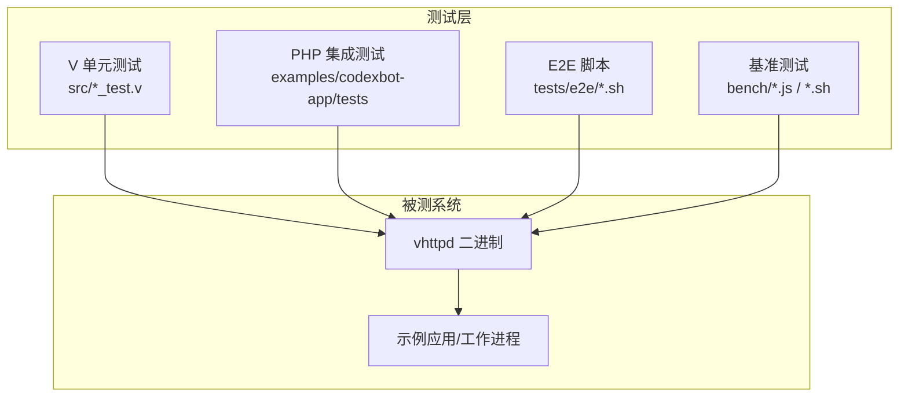
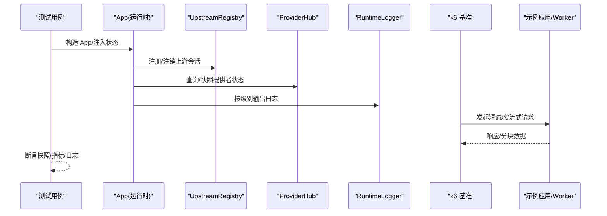
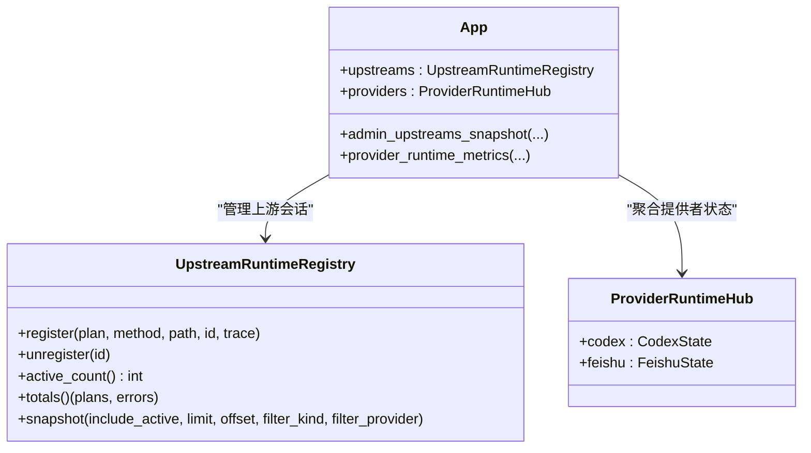
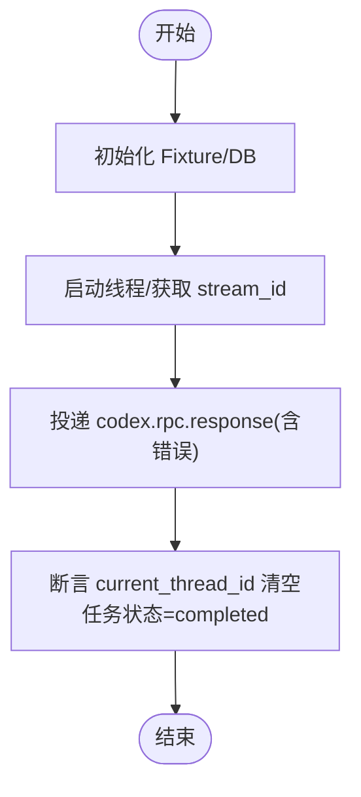
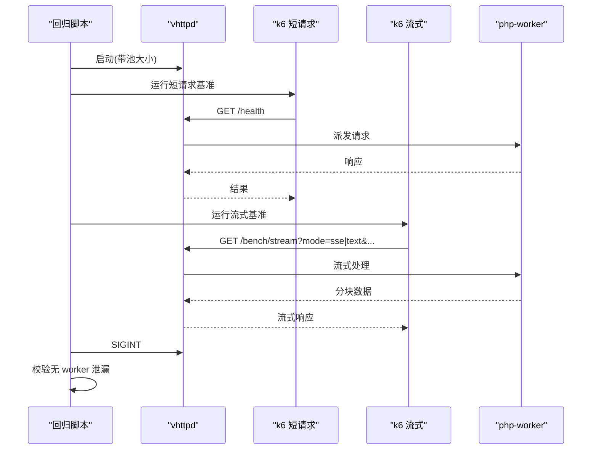
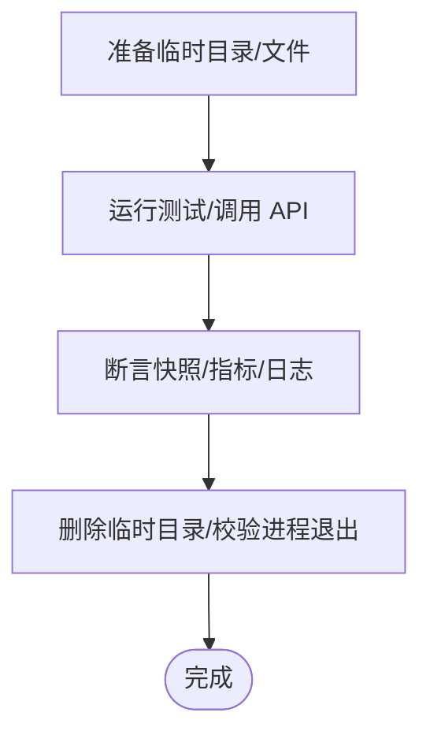
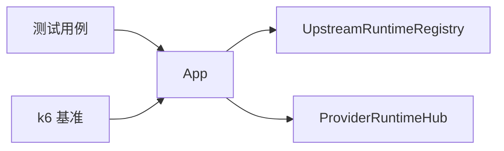

# 测试和调试

<cite>
**本文引用的文件**   
- [README.md](file://README.md)
- [tests/README.md](file://tests/README.md)
- [src/logging/runtime_logger.v](file://src/logging/runtime_logger.v)
- [src/websocket_upstream_runtime_test.v](file://src/websocket_upstream_runtime_test.v)
- [src/provider_registry_test.v](file://src/provider_registry_test.v)
- [src/server_logic_test.v](file://src/server_logic_test.v)
- [bench/README.md](file://bench/README.md)
- [bench/run_host_regression.sh](file://bench/run_host_regression.sh)
- [bench/k6_stream.js](file://bench/k6_stream.js)
- [examples/codexbot-app/tests/Feature/CodexBotAppFlowTest.php](file://examples/codexbot-app/tests/Feature/CodexBotAppFlowTest.php)
- [src/upstream/provider/feishu/state.v](file://src/upstream/provider/feishu/state.v)
</cite>

## 目录
1. [简介](#简介)
2. [项目结构](#项目结构)
3. [核心组件](#核心组件)
4. [架构总览](#架构总览)
5. [详细组件分析](#详细组件分析)
6. [依赖关系分析](#依赖关系分析)
7. [性能考量](#性能考量)
8. [故障排查指南](#故障排查指南)
9. [结论](#结论)
10. [附录](#附录)

## 简介
本指南面向需要为自定义上游提供者编写测试与进行调试的开发者，覆盖单元测试、集成测试、端到端测试、性能基准、调试技巧与工具、以及测试数据管理。文档基于仓库现有实现与测试基础设施，提供可操作的步骤、示例路径与可视化图示，帮助快速定位问题并提升质量保障效率。

## 项目结构
vhttpd 的测试体系分为三层：
- 单元测试：与源码同目录的 V 语言测试（*_test.v），由 Makefile 自动发现与执行
- 集成测试：PHP 应用侧使用 Pest 框架的端到端流程测试
- E2E 测试：shell 脚本驱动的二进制级冒烟与配置验收测试
- 性能基准：k6 脚本 + 回归脚本，覆盖短请求与流式场景

**章节来源**
- [tests/README.md:1-38](file://tests/README.md#L1-L38)
- [README.md:256-271](file://README.md#L256-L271)

## 核心组件
- 日志与级别控制：通过环境变量动态设置日志级别，便于在测试中开启 debug 信息
- 上游运行时注册与快照：用于验证上游连接、事件与指标
- 提供者注册与快照：用于验证提供者能力、实例与运行态
- 生命周期与清理：确保测试后资源释放、无泄漏
- 基准测试套件：短请求与流式场景的可重复压测

**章节来源**
- [src/logging/runtime_logger.v:1-42](file://src/logging/runtime_logger.v#L1-L42)
- [src/websocket_upstream_runtime_test.v:1-83](file://src/websocket_upstream_runtime_test.v#L1-L83)
- [src/provider_registry_test.v:1-47](file://src/provider_registry_test.v#L1-L47)
- [src/server_logic_test.v:3402-3472](file://src/server_logic_test.v#L3402-L3472)
- [bench/README.md:1-158](file://bench/README.md#L1-L158)

## 架构总览
下图展示测试与调试在 vhttpd 中的关键交互点：测试入口、上游/提供者运行时、日志与事件输出、以及基准测试对服务的影响。

**图表来源**
- [src/websocket_upstream_runtime_test.v:1-83](file://src/websocket_upstream_runtime_test.v#L1-L83)
- [src/provider_registry_test.v:1-47](file://src/provider_registry_test.v#L1-L47)
- [src/logging/runtime_logger.v:1-42](file://src/logging/runtime_logger.v#L1-L42)
- [bench/k6_stream.js:1-51](file://bench/k6_stream.js#L1-L51)

## 详细组件分析

### 单元测试：自定义上游提供者
目标：在不启动真实外部服务的条件下，验证上游注册、重连策略、错误计数、快照与指标等。

- 模拟对象创建
  - 在测试中直接构造 App 与 ProviderRuntimeHub，填充 provider 的 runtime 字段以模拟已连接状态
  - 参考路径：[src/provider_registry_test.v:1-47](file://src/provider_registry_test.v#L1-L47)

- 接口 Mock
  - 通过 UpstreamRuntimeRegistry 注册/注销上游会话，模拟 HTTP 上游或 WebSocket 上游的生命周期
  - 参考路径：[src/websocket_upstream_runtime_test.v:33-83](file://src/websocket_upstream_runtime_test.v#L33-L83)

- 断言验证
  - 校验 active_count、totals() 返回的计划数与错误数、snapshot 中的 session 字段
  - 校验重连延迟默认值与配置覆盖
  - 参考路径：[src/websocket_upstream_runtime_test.v:1-32](file://src/websocket_upstream_runtime_test.v#L1-L32)

**图表来源**
- [src/websocket_upstream_runtime_test.v:1-83](file://src/websocket_upstream_runtime_test.v#L1-L83)
- [src/provider_registry_test.v:1-47](file://src/provider_registry_test.v#L1-L47)

**章节来源**
- [src/websocket_upstream_runtime_test.v:1-83](file://src/websocket_upstream_runtime_test.v#L1-L83)
- [src/provider_registry_test.v:1-47](file://src/provider_registry_test.v#L1-L47)

### 集成测试：端到端流程
目标：在真实 vhttpd 进程下，验证从客户端到上游/工作进程的完整链路，包括错误处理与状态清理。

- 测试环境搭建
  - 使用 PHP 集成测试框架（Pest）组织用例，配合 fixtures 初始化数据库与应用状态
  - 参考路径：[examples/codexbot-app/tests/Feature/CodexBotAppFlowTest.php:985-1012](file://examples/codexbot-app/tests/Feature/CodexBotAppFlowTest.php#L985-L1012)

- 依赖服务模拟
  - 通过 websocket_upstream 模式向 vhttpd 投递模拟事件，触发下游处理逻辑
  - 参考路径：同上

- 端到端流程
  - 启动线程 -> 发送 RPC 响应（含错误）-> 断言当前线程被清理、任务状态更新
  - 参考路径：同上

**图表来源**
- [examples/codexbot-app/tests/Feature/CodexBotAppFlowTest.php:985-1012](file://examples/codexbot-app/tests/Feature/CodexBotAppFlowTest.php#L985-L1012)

**章节来源**
- [examples/codexbot-app/tests/Feature/CodexBotAppFlowTest.php:985-1012](file://examples/codexbot-app/tests/Feature/CodexBotAppFlowTest.php#L985-L1012)

### 性能基准测试
目标：评估短请求与流式传输的性能表现，识别瓶颈并进行对比分析。

- 压力测试脚本
  - k6 短请求脚本：通过环境变量配置目标路径与并发
  - k6 流式脚本：支持 SSE/text 两种模式，阈值包含失败率、P95 时延与检查通过率
  - 参考路径：[bench/k6_stream.js:1-51](file://bench/k6_stream.js#L1-L51)、[bench/README.md:59-100](file://bench/README.md#L59-L100)

- 一键回归流程
  - 构建 vhttpd -> 启动 -> 运行短请求与流式基准 -> 发送 SIGINT -> 校验无 worker 泄漏
  - 参考路径：[bench/run_host_regression.sh:90-129](file://bench/run_host_regression.sh#L90-L129)

- 性能指标收集与分析
  - 关注 http_req_failed、http_req_duration(p95)、checks rate
  - 通过 Group A/B 矩阵隔离传输开销与可扩展性
  - 参考路径：[bench/README.md:102-158](file://bench/README.md#L102-L158)

**图表来源**
- [bench/run_host_regression.sh:90-129](file://bench/run_host_regression.sh#L90-L129)
- [bench/k6_stream.js:1-51](file://bench/k6_stream.js#L1-L51)
- [bench/README.md:59-100](file://bench/README.md#L59-L100)

**章节来源**
- [bench/README.md:1-158](file://bench/README.md#L1-L158)
- [bench/run_host_regression.sh:90-129](file://bench/run_host_regression.sh#L90-L129)
- [bench/k6_stream.js:1-51](file://bench/k6_stream.js#L1-L51)

### 调试技巧与工具
- 日志级别配置
  - 通过环境变量 VHTTPD_LOG_LEVEL 设置 debug/info/warn/error/fatal；生产默认 warn，开发默认 info
  - 参考路径：[src/logging/runtime_logger.v:1-42](file://src/logging/runtime_logger.v#L1-L42)

- 追踪 ID 使用
  - 在测试中注入 trace_id/request_id，结合 admin 快照与事件日志进行关联分析
  - 参考路径：[src/inproc_vjsx_executor_test.v:369-387](file://src/inproc_vjsx_executor_test.v#L369-L387)

- 网络抓包分析
  - 结合 k6 标签与 vhttpd 事件日志，定位慢请求与丢包
  - 参考路径：[bench/k6_stream.js:1-51](file://bench/k6_stream.js#L1-L51)

- 事件与快照
  - 使用 admin 快照查看上游会话、提供者连接状态与指标
  - 参考路径：[src/websocket_upstream_runtime_test.v:33-83](file://src/websocket_upstream_runtime_test.v#L33-L83)

**章节来源**
- [src/logging/runtime_logger.v:1-42](file://src/logging/runtime_logger.v#L1-L42)
- [src/inproc_vjsx_executor_test.v:369-387](file://src/inproc_vjsx_executor_test.v#L369-L387)
- [src/websocket_upstream_runtime_test.v:33-83](file://src/websocket_upstream_runtime_test.v#L33-L83)

### 测试数据管理
- 测试用例设计
  - 针对上游重连、错误分类、快照一致性、指标累计等维度设计用例
  - 参考路径：[src/websocket_upstream_runtime_test.v:1-83](file://src/websocket_upstream_runtime_test.v#L1-L83)

- 数据准备
  - 使用临时目录与文件写入模拟事件日志、pid 文件、内部 socket 等
  - 参考路径：[src/server_logic_test.v:3402-3472](file://src/server_logic_test.v#L3402-L3472)

- 清理策略
  - 测试结束后删除临时目录、校验进程退出与资源释放
  - 参考路径：同上

**图表来源**
- [src/server_logic_test.v:3402-3472](file://src/server_logic_test.v#L3402-L3472)

**章节来源**
- [src/server_logic_test.v:3402-3472](file://src/server_logic_test.v#L3402-L3472)

## 依赖关系分析
- 模块耦合
  - App 聚合 UpstreamRuntimeRegistry 与 ProviderRuntimeHub，对外暴露 admin 快照与指标方法
  - 测试通过直接构造 App 与内部状态，避免启动完整服务
- 外部依赖
  - k6 作为压测工具，通过环境变量与脚本参数控制行为
  - PHP 集成测试依赖数据库与示例应用

**图表来源**
- [src/websocket_upstream_runtime_test.v:1-83](file://src/websocket_upstream_runtime_test.v#L1-L83)
- [src/provider_registry_test.v:1-47](file://src/provider_registry_test.v#L1-L47)

**章节来源**
- [src/websocket_upstream_runtime_test.v:1-83](file://src/websocket_upstream_runtime_test.v#L1-L83)
- [src/provider_registry_test.v:1-47](file://src/provider_registry_test.v#L1-L47)

## 性能考量
- 流式传输优化
  - 通过 Group A/B 矩阵区分传输开销与可扩展性，定位瓶颈
- 阈值与稳定性
  - 设置失败率与 P95 时延阈值，保证回归稳定
- 资源清理
  - 回归脚本校验无 worker 泄漏，防止长期运行的资源累积

[本节为通用指导，不直接分析具体文件]

## 故障排查指南
- 常见问题
  - 上游未连接：检查 ProviderRuntimeHub 的 connected 标志与 ws_url
  - 事件丢失：核对 recent_events 与 acked_events 指标
  - 会话泄漏：确认 unregister 是否被调用，active_count 是否为 0
- 定位手段
  - 提高日志级别至 debug，结合事件日志与 admin 快照
  - 使用 k6 标签过滤特定端点与模式，缩小范围
- 参考路径
  - 提供者状态与指标：[src/upstream/provider/feishu/state.v:1-346](file://src/upstream/provider/feishu/state.v#L1-L346)
  - 上游快照与指标：[src/websocket_upstream_runtime_test.v:33-83](file://src/websocket_upstream_runtime_test.v#L33-L83)
  - 生命周期与清理：[src/server_logic_test.v:3402-3472](file://src/server_logic_test.v#L3402-L3472)

**章节来源**
- [src/upstream/provider/feishu/state.v:1-346](file://src/upstream/provider/feishu/state.v#L1-L346)
- [src/websocket_upstream_runtime_test.v:33-83](file://src/websocket_upstream_runtime_test.v#L33-L83)
- [src/server_logic_test.v:3402-3472](file://src/server_logic_test.v#L3402-L3472)

## 结论
通过统一的测试分层与基准套件，vhttpd 为自定义上游提供者提供了完善的验证与调试基础。建议在新提供者接入时：
- 优先编写单元与集成测试，覆盖注册/注销、错误分类、快照一致性
- 使用 k6 建立回归基线，持续监控 P95 与失败率
- 利用日志级别与事件快照快速定位问题，确保资源清理与无泄漏

[本节为总结，不直接分析具体文件]

## 附录
- 运行说明
  - 单元测试：make test-fast / make test-inproc / make test-codexbot
  - E2E：bash tests/e2e/run.sh
  - 基准：参考 bench/README.md 的步骤与环境变量
- 参考路径
  - 测试布局与入口：[tests/README.md:1-38](file://tests/README.md#L1-L38)
  - 基准说明：[bench/README.md:1-158](file://bench/README.md#L1-L158)

**章节来源**
- [tests/README.md:1-38](file://tests/README.md#L1-L38)
- [bench/README.md:1-158](file://bench/README.md#L1-L158)