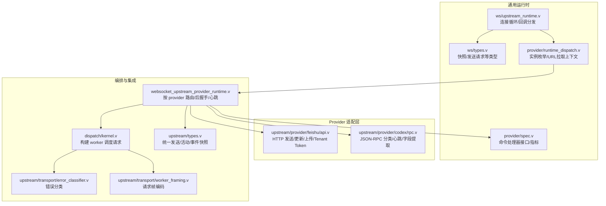
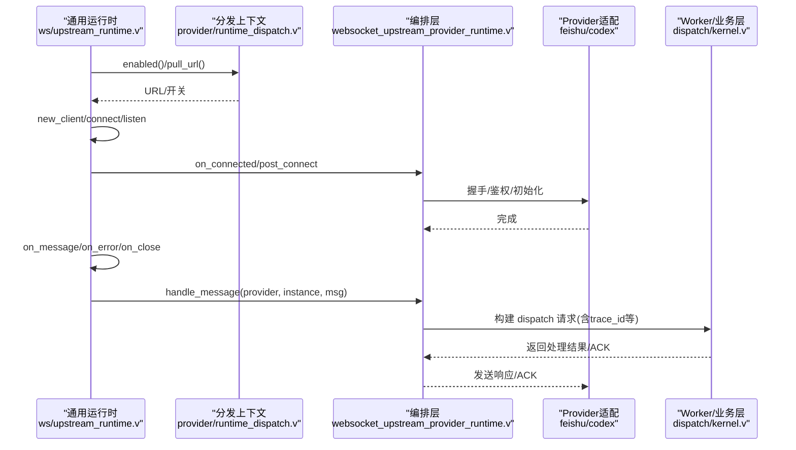
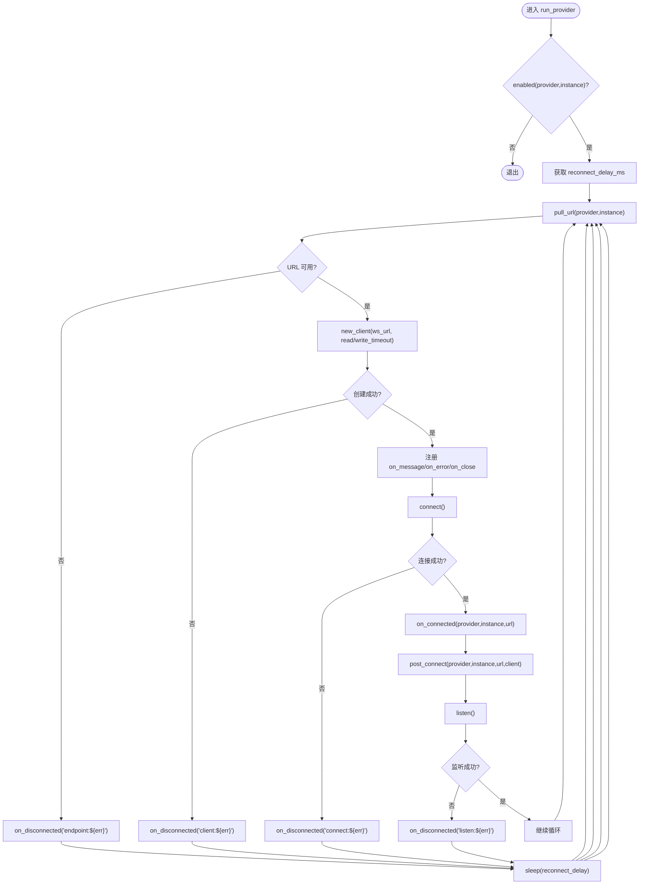
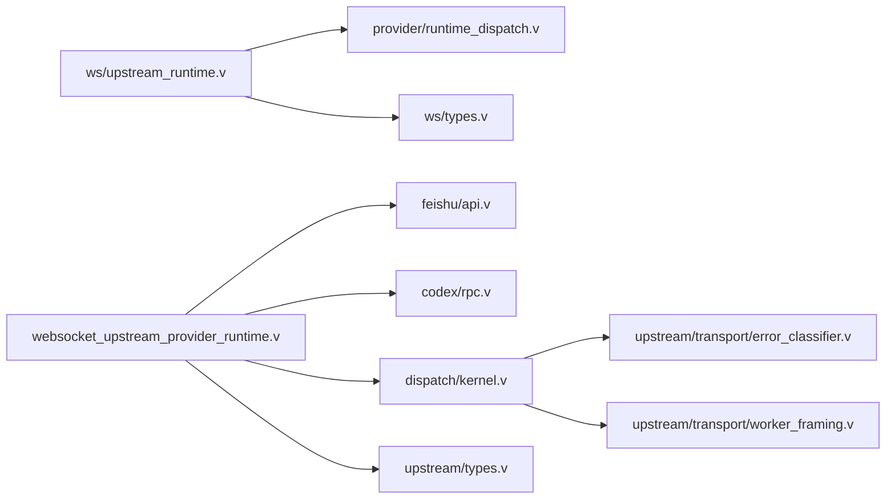

# 自定义上游提供者开发

<cite>
**本文引用的文件**   
- [src/ws/upstream_runtime.v](file://src/ws/upstream_runtime.v)
- [src/provider/spec.v](file://src/provider/spec.v)
- [src/provider/runtime_dispatch.v](file://src/provider/runtime_dispatch.v)
- [src/websocket_upstream_provider_runtime.v](file://src/websocket_upstream_provider_runtime.v)
- [src/codex_provider_types.v](file://src/codex_provider_types.v)
- [src/upstream/types.v](file://src/upstream/types.v)
- [src/upstream/transport/error_classifier.v](file://src/upstream/transport/error_classifier.v)
- [src/dispatch/kernel.v](file://src/dispatch/kernel.v)
- [src/upstream/transport/worker_framing.v](file://src/upstream/transport/worker_framing.v)
- [src/ws/types.v](file://src/ws/types.v)
- [src/upstream/provider/feishu/api.v](file://src/upstream/provider/feishu/api.v)
- [src/upstream/provider/codex/rpc.v](file://src/upstream/provider/codex/rpc.v)
- [docs/WEBSOCKET_UPSTREAM_PLAN.md](file://docs/WEBSOCKET_UPSTREAM_PLAN.md)
- [docs/UPSTREAM_PLAN_PHASE3.md](file://docs/UPSTREAM_PLAN_PHASE3.md)
- [tests/e2e/config_acceptance_test.sh](file://tests/e2e/config_acceptance_test.sh)
</cite>

## 目录
1. [简介](#简介)
2. [项目结构](#项目结构)
3. [核心组件](#核心组件)
4. [架构总览](#架构总览)
5. [详细组件分析](#详细组件分析)
6. [依赖关系分析](#依赖关系分析)
7. [性能与可扩展性](#性能与可扩展性)
8. [故障排查指南](#故障排查指南)
9. [结论](#结论)
10. [附录：开发与测试、部署运维](#附录开发与测试部署运维)

## 简介
本指南面向需要在 vhttpd 中实现“自定义上游提供者”的开发者，围绕 WebSocket 长连接上游（如飞书、Codex）的通用运行时与 Provider 适配层展开。内容覆盖：
- 提供者接口定义与生命周期管理
- 连接建立、消息收发与重连策略
- 错误处理模式与降级策略
- 数据编码/解码与协议格式
- 从基础到复杂业务逻辑的实现步骤
- 测试与调试方法
- 部署与运维建议

## 项目结构
vhttpd 将“上游”抽象为 transport 无关的运行时，WebSocket 上游由通用运行时负责连接循环与事件分发，Provider 适配器负责鉴权、帧编解码与发送 API。

图表来源
- [src/ws/upstream_runtime.v:1-122](file://src/ws/upstream_runtime.v#L1-L122)
- [src/ws/types.v:198-259](file://src/ws/types.v#L198-L259)
- [src/provider/spec.v:1-41](file://src/provider/spec.v#L1-L41)
- [src/provider/runtime_dispatch.v:1-56](file://src/provider/runtime_dispatch.v#L1-L56)
- [src/websocket_upstream_provider_runtime.v:37-80](file://src/websocket_upstream_provider_runtime.v#L37-L80)
- [src/upstream/provider/feishu/api.v:1-170](file://src/upstream/provider/feishu/api.v#L1-L170)
- [src/upstream/provider/codex/rpc.v:1-295](file://src/upstream/provider/codex/rpc.v#L1-L295)
- [src/dispatch/kernel.v:100-121](file://src/dispatch/kernel.v#L100-L121)
- [src/upstream/transport/error_classifier.v:1-19](file://src/upstream/transport/error_classifier.v#L1-L19)
- [src/upstream/transport/worker_framing.v:173-209](file://src/upstream/transport/worker_framing.v#L173-L209)
- [src/upstream/types.v:82-164](file://src/upstream/types.v#L82-L164)

章节来源
- [docs/WEBSOCKET_UPSTREAM_PLAN.md:1-67](file://docs/WEBSOCKET_UPSTREAM_PLAN.md#L1-L67)
- [docs/UPSTREAM_PLAN_PHASE3.md:1-66](file://docs/UPSTREAM_PLAN_PHASE3.md#L1-L66)

## 核心组件
- 通用 WebSocket 上游运行时
  - 负责每个 provider/instance 的连接循环、URL 拉取、错误/关闭回调、消息分发、连接后钩子（post_connect）。
- Provider 命令处理器接口
  - 提供 ProviderCommandHandler 接口与默认空实现，用于桥接 provider 专属命令执行。
- 运行时分发上下文
  - 提供 instances/pull_url/enabled 等函数式上下文，供上层按 provider 动态发现与配置。
- Provider 适配层
  - 飞书：REST 发送/更新/图片上传/Tenant Token 解析。
  - Codex：轻量 JSON-RPC 分类、字段提取、心跳。
- 错误分类与 Worker 帧编码
  - 将后端错误映射为 HTTP 状态码与错误类；构造 worker 请求帧并注入追踪信息。
- 统一数据类型
  - 统一的发送请求/结果、事件/活动快照、运行期快照等。

章节来源
- [src/ws/upstream_runtime.v:1-122](file://src/ws/upstream_runtime.v#L1-L122)
- [src/provider/spec.v:1-41](file://src/provider/spec.v#L1-L41)
- [src/provider/runtime_dispatch.v:1-56](file://src/provider/runtime_dispatch.v#L1-L56)
- [src/upstream/provider/feishu/api.v:1-170](file://src/upstream/provider/feishu/api.v#L1-L170)
- [src/upstream/provider/codex/rpc.v:1-295](file://src/upstream/provider/codex/rpc.v#L1-L295)
- [src/upstream/transport/error_classifier.v:1-19](file://src/upstream/transport/error_classifier.v#L1-L19)
- [src/upstream/transport/worker_framing.v:173-209](file://src/upstream/transport/worker_framing.v#L173-L209)
- [src/upstream/types.v:82-164](file://src/upstream/types.v#L82-L164)

## 架构总览
下图展示了“通用运行时 + Provider 适配 + 编排集成”的分层协作方式。

图表来源
- [src/ws/upstream_runtime.v:64-106](file://src/ws/upstream_runtime.v#L64-L106)
- [src/provider/runtime_dispatch.v:11-38](file://src/provider/runtime_dispatch.v#L11-L38)
- [src/websocket_upstream_provider_runtime.v:37-80](file://src/websocket_upstream_provider_runtime.v#L37-L80)
- [src/dispatch/kernel.v:100-121](file://src/dispatch/kernel.v#L100-L121)

## 详细组件分析

### 组件一：通用 WebSocket 上游运行时
职责
- 按 provider/instance 启动独立连接循环
- 拉取连接 URL、创建客户端、注册回调、监听消息
- 在连接成功/失败/断开时更新状态并触发 post_connect 钩子
- 将收到的消息转发给具体 provider 的处理函数

关键流程
- 启用检查 -> 获取重连延迟 -> 拉取 URL -> 创建客户端 -> 注册回调 -> 连接 -> 标记已连接 -> 执行 post_connect -> listen -> 异常则记录原因并重试

图表来源
- [src/ws/upstream_runtime.v:64-106](file://src/ws/upstream_runtime.v#L64-L106)

章节来源
- [src/ws/upstream_runtime.v:1-122](file://src/ws/upstream_runtime.v#L1-L122)

### 组件二：Provider 命令处理器接口与指标
- ProviderCommandHandler.execute：桥接 provider 特定命令执行，返回是否消费及可选错误信息。
- NoopProviderCommandHandler：默认空实现，保证向后兼容。
- ProviderRuntimeMetrics：聚合连接级计数（尝试/成功/收到帧/已ACK/发送数/发送错误）。

使用场景
- 在 provider 适配层实现 execute，处理来自网关或内部调度的命令（例如 provider.rpc.call、provider.message.send 等）。

章节来源
- [src/provider/spec.v:1-41](file://src/provider/spec.v#L1-L41)

### 组件三：运行时分发上下文
- RuntimeDispatchContext：以函数式闭包暴露 instances、upstream_enabled、bootstrap_enabled、ready、pull_url 等能力。
- gateway_count：统计启用的 provider 实例数量。

用途
- 解耦“如何发现实例/URL”与“如何建连”，便于不同 provider 按需实现。

章节来源
- [src/provider/runtime_dispatch.v:1-56](file://src/provider/runtime_dispatch.v#L1-L56)

### 组件四：编排层（按 provider 路由与后握手）
- 根据 provider 名称选择对应处理路径（如 feishu/codex）。
- 在 post_connect 阶段执行握手、鉴权、心跳等初始化任务。
- 维护 started_key 去重与运行态标记。

章节来源
- [src/websocket_upstream_provider_runtime.v:37-80](file://src/websocket_upstream_provider_runtime.v#L37-L80)
- [src/codex_provider_types.v:1-3](file://src/codex_provider_types.v#L1-L3)

### 组件五：Provider 适配层

#### 飞书（Feishu）
- 发送消息：参数校验、URL 拼接、JSON 载荷构建。
- 更新消息：支持 message_id 与 token 两种目标类型，区分交互卡片与非交互。
- 上传图片：Base64 校验、大小限制、multipart 表单构建。
- Tenant Token：请求体构建与响应解析。

章节来源
- [src/upstream/provider/feishu/api.v:1-170](file://src/upstream/provider/feishu/api.v#L1-L170)

#### Codex
- JSON-RPC 轻量分类：识别 request/notification/response，避免全量解析。
- 字段提取：method/id/threadId/turnId/itemId/itemType 等关键字段快速抽取。
- 心跳：周期性 ping，保持连接活跃。

章节来源
- [src/upstream/provider/codex/rpc.v:1-295](file://src/upstream/provider/codex/rpc.v#L1-L295)

### 组件六：错误分类与 Worker 帧编码
- 错误分类：将后端错误文本映射为 HTTP 状态码与错误类（如 503/504/502）。
- Worker 帧编码：构造标准化请求帧，注入 x-request-id、x-vhttpd-trace-id、server 信息等。

章节来源
- [src/upstream/transport/error_classifier.v:1-19](file://src/upstream/transport/error_classifier.v#L1-L19)
- [src/upstream/transport/worker_framing.v:173-209](file://src/upstream/transport/worker_framing.v#L173-L209)

### 组件七：统一数据类型与快照
- UpstreamSendRequest/UpstreamSendResult/UpstreamUpdateResult：统一的发送请求与结果。
- UpstreamEventSnapshot/UpstreamActivitySnapshot：事件与活动快照，便于观测与回放。
- UpstreamSnapshot/UpstreamRuntimeSnapshot：连接级运行态快照。

章节来源
- [src/upstream/types.v:82-164](file://src/upstream/types.v#L82-L164)
- [src/ws/types.v:198-259](file://src/ws/types.v#L198-L259)

## 依赖关系分析
- ws/upstream_runtime.v 依赖 provider/runtime_dispatch.v 提供的上下文函数，以及 ws/types.v 的数据结构。
- websocket_upstream_provider_runtime.v 作为编排层，组合 provider 适配（feishu/codex），并通过 dispatch/kernel.v 构建 worker 调度请求。
- upstream/transport/* 提供错误分类与帧编码，被上层调用以规范化错误与请求。

图表来源
- [src/ws/upstream_runtime.v:1-122](file://src/ws/upstream_runtime.v#L1-L122)
- [src/provider/runtime_dispatch.v:1-56](file://src/provider/runtime_dispatch.v#L1-L56)
- [src/websocket_upstream_provider_runtime.v:37-80](file://src/websocket_upstream_provider_runtime.v#L37-L80)
- [src/upstream/provider/feishu/api.v:1-170](file://src/upstream/provider/feishu/api.v#L1-L170)
- [src/upstream/provider/codex/rpc.v:1-295](file://src/upstream/provider/codex/rpc.v#L1-L295)
- [src/dispatch/kernel.v:100-121](file://src/dispatch/kernel.v#L100-L121)
- [src/upstream/transport/error_classifier.v:1-19](file://src/upstream/transport/error_classifier.v#L1-L19)
- [src/upstream/transport/worker_framing.v:173-209](file://src/upstream/transport/worker_framing.v#L173-L209)
- [src/upstream/types.v:82-164](file://src/upstream/types.v#L82-L164)

## 性能与可扩展性
- 连接池与复用
  - 当前实现为每个 provider/instance 一个长连接，适合多租户/多应用隔离场景。如需更高吞吐，可在 provider 适配层引入本地队列与批量发送。
- 重连策略
  - 基于可配置的固定延迟重试，建议在 provider 侧实现指数退避与抖动，避免雪崩。
- 心跳保活
  - Codex 提供周期性 ping；飞书可按需实现类似机制。
- 背压与限流
  - 在 post_connect 与 handle_message 处增加令牌桶/滑动窗口控制，防止下游拥塞。
- 序列化与压缩
  - 当前以 JSON/文本为主，若带宽敏感，可在 provider 适配层对 payload 进行 gzip/br 压缩，并在接收端解压。

[本节为通用指导，不直接分析具体文件]

## 故障排查指南
- 连接问题
  - 观察 on_disconnected(reason) 中的 reason 前缀（endpoint/client/connect/listen/error/close），定位失败阶段。
- 错误分类
  - 通过 classify_worker_backend_error 将后端错误映射为 503/504/502 与错误类，便于前端与监控告警。
- 事件与活动
  - 使用 UpstreamEventSnapshot/UpstreamActivitySnapshot 查看最近事件与处理轨迹，结合 trace_id 做端到端追踪。
- 示例配置
  - e2e 脚本中包含 provider websocket upstream 的最小配置片段，可用于复现与验证。

章节来源
- [src/ws/upstream_runtime.v:113-121](file://src/ws/upstream_runtime.v#L113-L121)
- [src/upstream/transport/error_classifier.v:1-19](file://src/upstream/transport/error_classifier.v#L1-L19)
- [src/upstream/types.v:132-164](file://src/upstream/types.v#L132-L164)
- [tests/e2e/config_acceptance_test.sh:1695-1753](file://tests/e2e/config_acceptance_test.sh#L1695-L1753)

## 结论
通过“通用运行时 + Provider 适配 + 编排层”的分层设计，vhttpd 为自定义上游提供者提供了清晰的扩展点：
- 在 provider 适配层实现鉴权、帧编解码与发送 API
- 利用通用运行时获得健壮的连接管理与错误处理
- 借助统一的数据结构与快照能力，实现可观测性与可回溯性

[本节为总结，不直接分析具体文件]

## 附录：开发与测试、部署运维

### 开发步骤（从基础到复杂）
- 基础提供者
  - 实现 pull_url/enabled 等上下文函数
  - 在 post_connect 完成握手与鉴权
  - 在 handle_message 中解析帧并回写 ACK/响应
- 复杂业务逻辑
  - 实现 ProviderCommandHandler.execute 处理 provider.rpc.call 等命令
  - 接入统一发送 API（UpstreamSendRequest）
  - 增加心跳、重试、限流与压缩

章节来源
- [src/provider/spec.v:1-41](file://src/provider/spec.v#L1-L41)
- [src/upstream/types.v:82-164](file://src/upstream/types.v#L82-L164)
- [docs/WEBSOCKET_UPSTREAM_PLAN.md:69-89](file://docs/WEBSOCKET_UPSTREAM_PLAN.md#L69-L89)

### 测试与调试
- 单元测试
  - 针对 RPC 分类、字段提取、错误分类、帧编码编写单测
- 集成测试
  - 使用 e2e 配置片段启动最小环境，验证 provider 连接与事件流转
- 性能基准
  - 在高并发下评估重连风暴、心跳开销与消息吞吐

章节来源
- [src/upstream/provider/codex/rpc.v:1-295](file://src/upstream/provider/codex/rpc.v#L1-L295)
- [src/upstream/transport/error_classifier.v:1-19](file://src/upstream/transport/error_classifier.v#L1-L19)
- [src/upstream/transport/worker_framing.v:173-209](file://src/upstream/transport/worker_framing.v#L173-L209)
- [tests/e2e/config_acceptance_test.sh:1695-1753](file://tests/e2e/config_acceptance_test.sh#L1695-L1753)

### 部署与运维
- 版本管理
  - 通过 CI 打包二进制与运行时库，发布至制品库
- 灰度发布
  - 多实例（systemd@unit）并行运行不同配置，逐步切换流量
- 回滚策略
  - 保留上一版本配置与二进制，快速回切
- 可观测性
  - 开启 event_log，结合 admin 快照与上游事件列表进行排障

章节来源
- [README.md:367-410](file://README.md#L367-L410)
- [README.md:428-525](file://README.md#L428-L525)