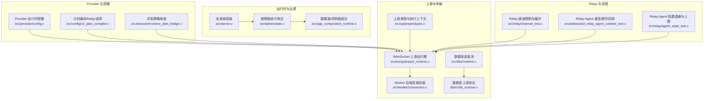
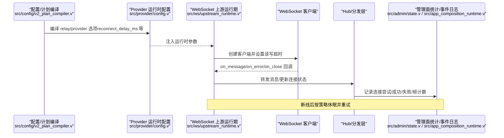
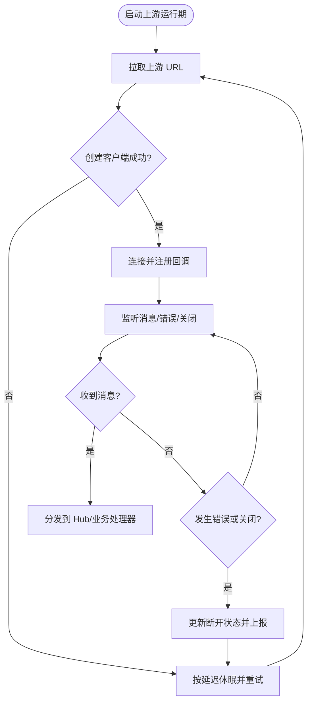
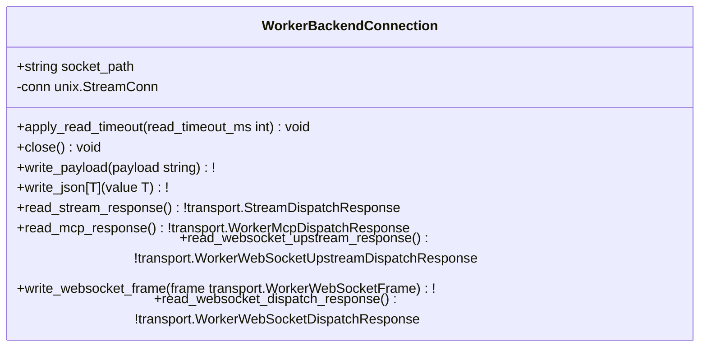
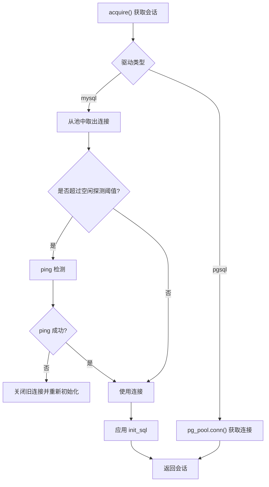
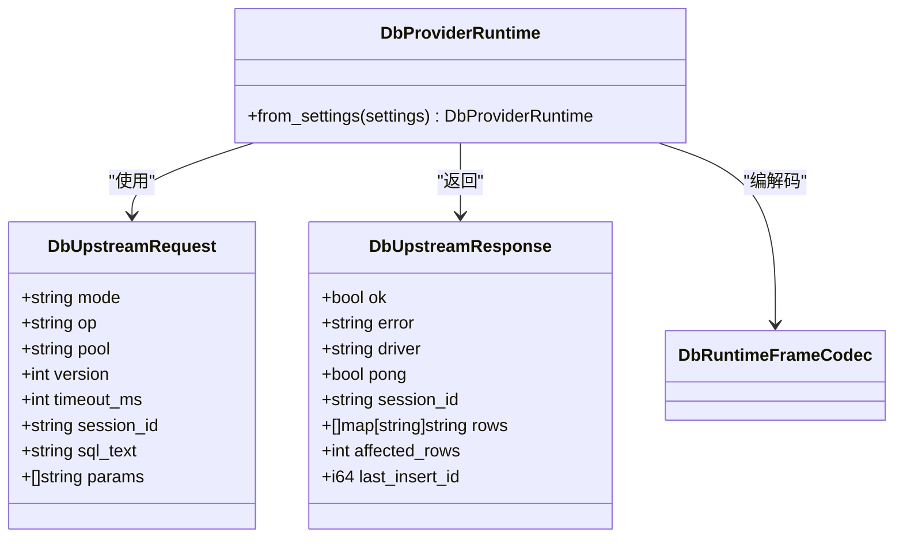
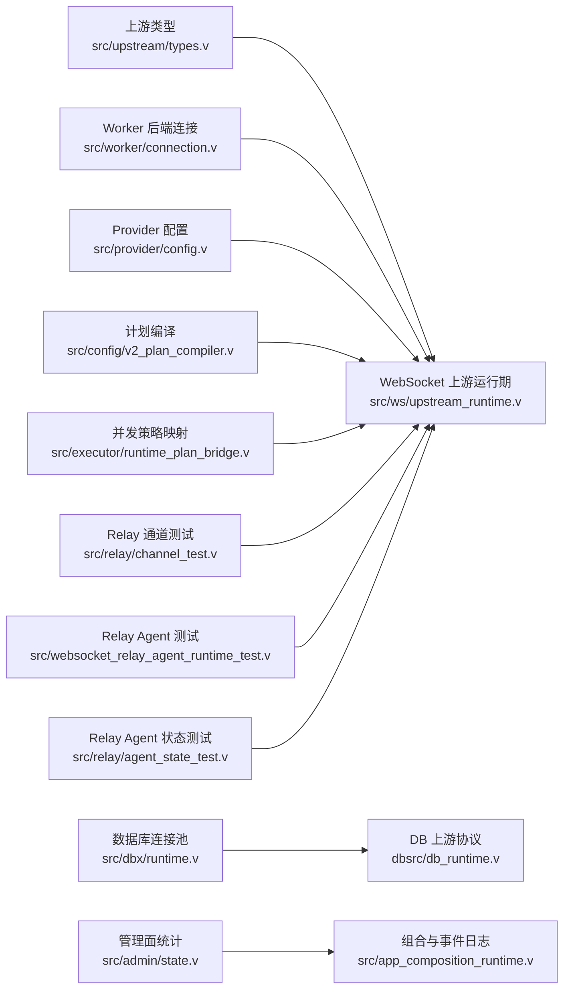

# 连接管理机制

<cite>
**本文引用的文件**   
- [src/upstream/types.v](file://src/upstream/types.v)
- [src/ws/upstream_runtime.v](file://src/ws/upstream_runtime.v)
- [src/worker/connection.v](file://src/worker/connection.v)
- [src/dbx/runtime.v](file://src/dbx/runtime.v)
- [dbsrc/db_runtime.v](file://dbsrc/db_runtime.v)
- [src/provider/config.v](file://src/provider/config.v)
- [src/server.v](file://src/server.v)
- [src/admin/state.v](file://src/admin/state.v)
- [src/app_composition_runtime.v](file://src/app_composition_runtime.v)
- [src/config/v2_plan_compiler.v](file://src/config/v2_plan_compiler.v)
- [src/executor/runtime_plan_bridge.v](file://src/executor/runtime_plan_bridge.v)
- [src/relay/channel_test.v](file://src/relay/channel_test.v)
- [src/websocket_relay_agent_runtime_test.v](file://src/websocket_relay_agent_runtime_test.v)
- [src/relay/agent_state_test.v](file://src/relay/agent_state_test.v)
- [examples/codexbot-app/lib/Upstream/CodexNotificationRouter.php](file://examples/codexbot-app/lib/Upstream/CodexNotificationRouter.php)
</cite>

## 目录
1. [引言](#引言)
2. [项目结构](#项目结构)
3. [核心组件](#核心组件)
4. [架构总览](#架构总览)
5. [详细组件分析](#详细组件分析)
6. [依赖关系分析](#依赖关系分析)
7. [性能考量](#性能考量)
8. [故障排查指南](#故障排查指南)
9. [结论](#结论)
10. [附录](#附录)

## 引言
本指南聚焦“自定义上游提供者连接管理”，围绕连接池实现原理、连接状态监控、生命周期管理、并发安全、配置选项与故障恢复等维度，结合仓库中上游（upstream）与 WebSocket 上游运行时、数据库连接池、Worker 后端连接、中继（Relay）重连策略等相关源码进行系统化说明。文档旨在帮助读者在 vhttpd 生态下构建高可用、可观测、可扩展的上游连接管理能力。

## 项目结构
与“上游连接管理”相关的代码主要分布在以下模块：
- 上游类型与执行上下文：src/upstream/types.v
- WebSocket 上游运行期（客户端循环、重连、事件回调）：src/ws/upstream_runtime.v
- Worker 后端连接封装（Unix Socket、超时、帧编解码）：src/worker/connection.v
- 数据库连接池（MySQL/PostgreSQL）：src/dbx/runtime.v
- 数据库上游协议定义（请求/响应/帧编解码）：dbsrc/db_runtime.v
- Provider 运行时配置（含 reconnect_delay_ms、flush_interval_ms 等）：src/provider/config.v
- 全局锁层级与并发约束：src/server.v
- 管理面统计聚合（包含 provider 连接指标）：src/admin/state.v
- 数据面/控制面组合与事件日志：src/app_composition_runtime.v
- 计划编译（Relay 选项如 reconnect_delay_ms、max_channels 等）：src/config/v2_plan_compiler.v
- 并发策略映射（队列超时、每键最大队列长度等）：src/executor/runtime_plan_bridge.v
- Relay 通道限制与缓冲测试用例：src/relay/channel_test.v
- Relay Agent 重连与断开回调测试：src/websocket_relay_agent_runtime_test.v
- Relay Agent 指数退避与上限测试：src/relay/agent_state_test.v
- 业务侧错误恢复示例（Codex 通知路由）：examples/codexbot-app/lib/Upstream/CodexNotificationRouter.php

图表来源
- [src/upstream/types.v:1-328](file://src/upstream/types.v#L1-L328)
- [src/ws/upstream_runtime.v:64-121](file://src/ws/upstream_runtime.v#L64-L121)
- [src/worker/connection.v:1-59](file://src/worker/connection.v#L1-L59)
- [src/dbx/runtime.v:518-588](file://src/dbx/runtime.v#L518-L588)
- [dbsrc/db_runtime.v:64-108](file://dbsrc/db_runtime.v#L64-L108)
- [src/provider/config.v:157-210](file://src/provider/config.v#L157-L210)
- [src/config/v2_plan_compiler.v:142-184](file://src/config/v2_plan_compiler.v#L142-L184)
- [src/executor/runtime_plan_bridge.v:139-185](file://src/executor/runtime_plan_bridge.v#L139-L185)
- [src/server.v:1-22](file://src/server.v#L1-L22)
- [src/admin/state.v:38-54](file://src/admin/state.v#L38-L54)
- [src/app_composition_runtime.v:1-87](file://src/app_composition_runtime.v#L1-L87)
- [src/relay/channel_test.v:1-45](file://src/relay/channel_test.v#L1-L45)
- [src/websocket_relay_agent_runtime_test.v:50-80](file://src/websocket_relay_agent_runtime_test.v#L50-L80)
- [src/relay/agent_state_test.v:49-88](file://src/relay/agent_state_test.v#L49-L88)

章节来源
- [src/upstream/types.v:1-328](file://src/upstream/types.v#L1-L328)
- [src/ws/upstream_runtime.v:64-121](file://src/ws/upstream_runtime.v#L64-L121)
- [src/worker/connection.v:1-59](file://src/worker/connection.v#L1-L59)
- [src/dbx/runtime.v:518-588](file://src/dbx/runtime.v#L518-L588)
- [dbsrc/db_runtime.v:64-108](file://dbsrc/db_runtime.v#L64-L108)
- [src/provider/config.v:157-210](file://src/provider/config.v#L157-L210)
- [src/config/v2_plan_compiler.v:142-184](file://src/config/v2_plan_compiler.v#L142-L184)
- [src/executor/runtime_plan_bridge.v:139-185](file://src/executor/runtime_plan_bridge.v#L139-L185)
- [src/server.v:1-22](file://src/server.v#L1-L22)
- [src/admin/state.v:38-54](file://src/admin/state.v#L38-L54)
- [src/app_composition_runtime.v:1-87](file://src/app_composition_runtime.v#L1-L87)
- [src/relay/channel_test.v:1-45](file://src/relay/channel_test.v#L1-L45)
- [src/websocket_relay_agent_runtime_test.v:50-80](file://src/websocket_relay_agent_runtime_test.v#L50-L80)
- [src/relay/agent_state_test.v:49-88](file://src/relay/agent_state_test.v#L49-L88)

## 核心组件
- 上游类型与执行上下文：定义上游快照、会话、发送请求/结果、NDJSON 流式处理执行状态等，为 HTTP/NDJSON 流输出提供统一抽象。
- WebSocket 上游运行期：负责按 provider/instance 启动长连接客户端循环，处理消息、错误、关闭回调，并触发连接状态变更与上报。
- Worker 后端连接封装：对 Unix Socket 连接进行读写封装，支持读超时设置、帧编解码、多种响应读取方法。
- 数据库连接池：基于 MySQL/PostgreSQL 的连接池实现，支持空闲探测、初始化 SQL、获取会话等。
- 数据库上游协议：定义 DB 上游请求/响应结构与帧编解码接口，用于进程内或跨进程调用。
- Provider 运行时配置：解析 provider 相关参数（如 reconnect_delay_ms、flush_interval_ms），注入到上游运行期。
- 计划编译与并发策略：将配置项编译为运行时计划，包括 Relay 的 reconnect_delay_ms、max_channels、channel_buffer 以及并发策略（队列超时、每键最大队列长度等）。
- 管理面统计与事件日志：聚合 provider 连接指标（连接尝试、成功、接收帧、发送消息、错误等），并写入事件日志。
- 全局锁层级：明确多锁获取顺序，避免死锁与竞态条件。
- Relay 通道与 Agent 重连：通过测试用例体现通道限制、缓冲、断开回调与指数退避上限等关键行为。

章节来源
- [src/upstream/types.v:1-328](file://src/upstream/types.v#L1-L328)
- [src/ws/upstream_runtime.v:64-121](file://src/ws/upstream_runtime.v#L64-L121)
- [src/worker/connection.v:1-59](file://src/worker/connection.v#L1-L59)
- [src/dbx/runtime.v:518-588](file://src/dbx/runtime.v#L518-L588)
- [dbsrc/db_runtime.v:64-108](file://dbsrc/db_runtime.v#L64-L108)
- [src/provider/config.v:157-210](file://src/provider/config.v#L157-L210)
- [src/config/v2_plan_compiler.v:142-184](file://src/config/v2_plan_compiler.v#L142-L184)
- [src/executor/runtime_plan_bridge.v:139-185](file://src/executor/runtime_plan_bridge.v#L139-L185)
- [src/server.v:1-22](file://src/server.v#L1-L22)
- [src/admin/state.v:38-54](file://src/admin/state.v#L38-L54)
- [src/app_composition_runtime.v:1-87](file://src/app_composition_runtime.v#L1-L87)
- [src/relay/channel_test.v:1-45](file://src/relay/channel_test.v#L1-L45)
- [src/websocket_relay_agent_runtime_test.v:50-80](file://src/websocket_relay_agent_runtime_test.v#L50-L80)
- [src/relay/agent_state_test.v:49-88](file://src/relay/agent_state_test.v#L49-L88)

## 架构总览
下图展示“自定义上游提供者连接管理”的关键路径：从配置编译到运行时连接建立、消息收发、状态监控与重连闭环。

图表来源
- [src/config/v2_plan_compiler.v:142-184](file://src/config/v2_plan_compiler.v#L142-L184)
- [src/provider/config.v:157-210](file://src/provider/config.v#L157-L210)
- [src/ws/upstream_runtime.v:64-121](file://src/ws/upstream_runtime.v#L64-L121)
- [src/admin/state.v:38-54](file://src/admin/state.v#L38-L54)
- [src/app_composition_runtime.v:1-87](file://src/app_composition_runtime.v#L1-L87)

## 详细组件分析

### WebSocket 上游连接管理与重连
- 连接循环：按 provider/instance 拉取 URL，创建 WebSocket 客户端，注册消息/错误/关闭回调，进入监听循环。
- 健康检查与超时：客户端设置读/写超时；错误与关闭回调触发断开事件。
- 自动重连：断开后按配置的延迟休眠并重试，形成稳定自愈能力。
- 状态上报：连接建立/断开时更新内部状态，供管理面快照与事件日志采集。

图表来源
- [src/ws/upstream_runtime.v:64-121](file://src/ws/upstream_runtime.v#L64-L121)

章节来源
- [src/ws/upstream_runtime.v:64-121](file://src/ws/upstream_runtime.v#L64-L121)

### Worker 后端连接封装与超时
- 连接对象：封装 Unix StreamConn，暴露写 JSON/负载、读多种响应的方法。
- 超时控制：支持设置读超时，保障长时间阻塞场景可控。
- 帧编解码：统一读写帧格式，适配不同调度场景（流式、MCP、WebSocket 上游等）。

图表来源
- [src/worker/connection.v:1-59](file://src/worker/connection.v#L1-L59)

章节来源
- [src/worker/connection.v:1-59](file://src/worker/connection.v#L1-L59)

### 数据库连接池实现与空闲探测
- 驱动支持：MySQL 与 PostgreSQL 两种驱动。
- 最大连接数：通过 PoolConfig.max_open_conns 控制。
- 空闲探测：MySQL 在获取连接时若超过 idle_ping_ms 阈值则 ping 检测，失败则重建连接。
- 会话初始化：获取会话后应用 init_sql，确保连接就绪。

图表来源
- [src/dbx/runtime.v:518-588](file://src/dbx/runtime.v#L518-L588)

章节来源
- [src/dbx/runtime.v:518-588](file://src/dbx/runtime.v#L518-L588)

### 数据库上游协议与帧编解码
- 请求/响应结构：定义 DbUpstreamRequest/DbUpstreamResponse，包含模式、操作、池名、超时、会话 ID、SQL 文本与参数等字段。
- 帧编解码：提供 DbRuntimeFrameCodec 用于序列化/反序列化。
- 运行时构造：DbProviderRuntime.from_settings 根据设置填充连接信息、池大小、事务会话表等。

图表来源
- [dbsrc/db_runtime.v:64-108](file://dbsrc/db_runtime.v#L64-L108)

章节来源
- [dbsrc/db_runtime.v:64-108](file://dbsrc/db_runtime.v#L64-L108)

### Provider 运行时配置与上游参数注入
- 关键参数：reconnect_delay_ms、flush_interval_ms 等，默认值与覆盖逻辑清晰。
- 桥接配置：bridge.enabled、ws_url、client_id、token、target_id 等。
- 数据库配置：enabled、socket、driver、pool_name、host/port/user/password/database/pool_size 等。

章节来源
- [src/provider/config.v:157-210](file://src/provider/config.v#L157-L210)

### 计划编译与并发策略映射
- Relay 选项：max_channels、channel_buffer、reconnect_delay_ms、autostart 等。
- 并发策略：affinity_enabled/source/key/scope/fallback、actor_enabled/fallback、queue_timeout_ms、max_queue_per_key、events 列表等。

章节来源
- [src/config/v2_plan_compiler.v:142-184](file://src/config/v2_plan_compiler.v#L142-L184)
- [src/executor/runtime_plan_bridge.v:139-185](file://src/executor/runtime_plan_bridge.v#L139-L185)

### 管理面统计与事件日志
- Provider 指标：connect_attempts、connect_successes、received_frames、acked_events、messages_sent、send_errors。
- 事件日志：控制面将统计写入事件日志，便于审计与告警。

章节来源
- [src/admin/state.v:38-54](file://src/admin/state.v#L38-L54)
- [src/app_composition_runtime.v:1-87](file://src/app_composition_runtime.v#L1-L87)

### 并发安全与锁层级
- 锁层级：主锁 > worker 后端池/队列 > WebSocket hub > upstream > MCP > provider 状态等。
- 规则：先获取高层级锁，再获取低层级锁；使用 defer 确保释放。

章节来源
- [src/server.v:1-22](file://src/server.v#L1-L22)

### Relay 通道限制与缓冲
- 通道限制：open_channel 受 max_channels 限制，超出时报错。
- 缓冲与排空：enqueue 入队，drain_returned_for 返回已处理帧，drain 清理剩余帧。
- 关闭清理：close_channel 清空缓冲与关联映射，后续入队报错。

章节来源
- [src/relay/channel_test.v:1-45](file://src/relay/channel_test.v#L1-L45)
- [src/relay/channel_test.v:126-151](file://src/relay/channel_test.v#L126-L151)

### Relay Agent 重连与断开回调
- 重连策略：指数退避且上限封顶，closed 状态为终态。
- 回调上报：error/close 回调上报断开原因，触发重连调度。

章节来源
- [src/websocket_relay_agent_runtime_test.v:50-80](file://src/websocket_relay_agent_runtime_test.v#L50-L80)
- [src/relay/agent_state_test.v:49-88](file://src/relay/agent_state_test.v#L49-L88)

### 业务侧错误恢复示例（Codex 通知路由）
- 错误恢复：当缺少 streamId 时，尝试从持久化存储恢复上下文，生成错误卡片或恢复消息。
- 最佳实践：幂等性、重试与降级提示。

章节来源
- [examples/codexbot-app/lib/Upstream/CodexNotificationRouter.php:143-170](file://examples/codexbot-app/lib/Upstream/CodexNotificationRouter.php#L143-L170)

## 依赖关系分析
- 上游类型与执行上下文被 WebSocket 上游运行期与 NDJSON 流式处理使用。
- Worker 后端连接封装被上游运行期与调度层复用。
- 数据库连接池与上游协议共同支撑 DB 上游能力。
- Provider 配置与计划编译为上游运行期提供参数与策略。
- 管理面统计与事件日志贯穿连接生命周期，提供可观测性。
- Relay 通道与 Agent 重连策略增强整体健壮性与弹性。

图表来源
- [src/upstream/types.v:1-328](file://src/upstream/types.v#L1-L328)
- [src/ws/upstream_runtime.v:64-121](file://src/ws/upstream_runtime.v#L64-L121)
- [src/worker/connection.v:1-59](file://src/worker/connection.v#L1-L59)
- [src/dbx/runtime.v:518-588](file://src/dbx/runtime.v#L518-L588)
- [dbsrc/db_runtime.v:64-108](file://dbsrc/db_runtime.v#L64-L108)
- [src/provider/config.v:157-210](file://src/provider/config.v#L157-L210)
- [src/config/v2_plan_compiler.v:142-184](file://src/config/v2_plan_compiler.v#L142-L184)
- [src/executor/runtime_plan_bridge.v:139-185](file://src/executor/runtime_plan_bridge.v#L139-L185)
- [src/admin/state.v:38-54](file://src/admin/state.v#L38-L54)
- [src/app_composition_runtime.v:1-87](file://src/app_composition_runtime.v#L1-L87)
- [src/relay/channel_test.v:1-45](file://src/relay/channel_test.v#L1-L45)
- [src/websocket_relay_agent_runtime_test.v:50-80](file://src/websocket_relay_agent_runtime_test.v#L50-L80)
- [src/relay/agent_state_test.v:49-88](file://src/relay/agent_state_test.v#L49-L88)

## 性能考量
- 连接池大小：数据库连接池通过 max_open_conns 控制并发上限，需结合业务 QPS 与下游容量调优。
- 空闲探测：MySQL 空闲探测避免僵尸连接，但需平衡 ping 频率与开销。
- 队列与缓冲：Relay channel_buffer 与并发策略 queue_timeout_ms/max_queue_per_key 影响吞吐与延迟。
- 超时与重试：读/写超时与重连延迟需合理设置，避免雪崩与抖动。
- 锁层级：遵循锁顺序，减少持锁时间，提升并发度。

[本节为通用指导，不直接分析具体文件]

## 故障排查指南
- 上游频繁断开：查看上游连接状态与事件日志，确认网络与 Token 有效性。
- 连接无响应：检查 Worker 状态、队列积压与超时设置。
- 数据库连接异常：观察空闲探测与连接重建日志，确认驱动与认证。
- 管理面指标：关注 connect_attempts/connect_successes/received_frames/messages_sent/send_errors 等指标变化。

章节来源
- [src/admin/state.v:38-54](file://src/admin/state.v#L38-L54)
- [src/app_composition_runtime.v:1-87](file://src/app_composition_runtime.v#L1-L87)

## 结论
通过统一的类型抽象、运行期连接循环、Worker 后端连接封装、数据库连接池与 Relay 重连策略，vhttpd 提供了完善的上游连接管理能力。配合管理面统计与事件日志，可实现端到端可观测与快速定位问题。建议在生产环境中依据业务特征调优连接池大小、超时与重连策略，并严格遵循锁层级规范，确保系统在高并发下的稳定性与可维护性。

[本节为总结，不直接分析具体文件]

## 附录
- 配置参考：Relay 与 Provider 的重连延迟、通道限制、缓冲、并发策略等均可通过计划编译与运行时配置注入。
- 最佳实践：
  - 合理设置 read/write 超时与重连延迟，避免风暴。
  - 使用空闲探测与连接初始化 SQL 保证连接可用性。
  - 利用管理面指标与事件日志进行告警与排障。
  - 业务侧实现幂等与错误恢复，提升用户体验。

章节来源
- [src/config/v2_plan_compiler.v:142-184](file://src/config/v2_plan_compiler.v#L142-L184)
- [src/provider/config.v:157-210](file://src/provider/config.v#L157-L210)
- [src/executor/runtime_plan_bridge.v:139-185](file://src/executor/runtime_plan_bridge.v#L139-L185)
- [src/dbx/runtime.v:518-588](file://src/dbx/runtime.v#L518-L588)
- [src/admin/state.v:38-54](file://src/admin/state.v#L38-L54)
- [examples/codexbot-app/lib/Upstream/CodexNotificationRouter.php:143-170](file://examples/codexbot-app/lib/Upstream/CodexNotificationRouter.php#L143-L170)