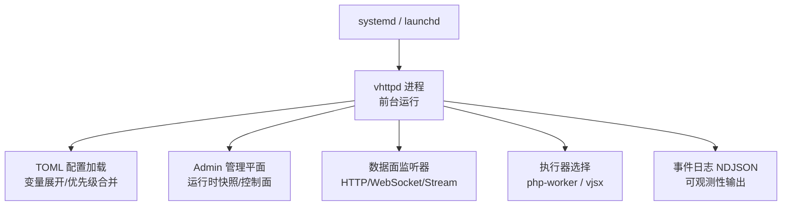
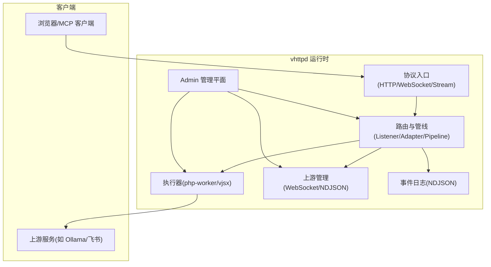
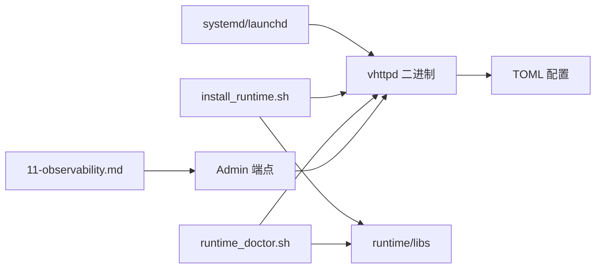

# 部署和运维

<cite>
**本文引用的文件**   
- [README.md](file://README.md)
- [vhttpd@.service](file://deploy/systemd/vhttpd@.service)
- [io.guweigang.vhttpd.plist](file://deploy/launchd/io.guweigang.vhttpd.plist)
- [install_runtime.sh](file://scripts/install_runtime.sh)
- [runtime_doctor.sh](file://scripts/runtime_doctor.sh)
- [11-observability.md](file://articles/11-observability.md)
- [runtime_config.v](file://src/server_lifecycle/runtime_config.v)
- [v2_plan_compiler.v](file://src/config/v2_plan_compiler.v)
- [runtime_logger.v](file://src/logging/runtime_logger.v)
- [admin/state.v](file://src/admin/state.v)
</cite>

## 目录
1. [简介](#简介)
2. [项目结构](#项目结构)
3. [核心组件](#核心组件)
4. [架构总览](#架构总览)
5. [详细组件分析](#详细组件分析)
6. [依赖关系分析](#依赖关系分析)
7. [性能与容量规划](#性能与容量规划)
8. [故障诊断指南](#故障诊断指南)
9. [版本管理与灰度发布](#版本管理与灰度发布)
10. [监控告警与日志管理](#监控告警与日志管理)
11. [生产环境最佳实践](#生产环境最佳实践)
12. [结论](#结论)

## 简介
本文件面向“自定义上游提供者”的部署与运维，围绕 vhttpd 作为协议与执行宿主的能力，提供从安装、配置、运行到可观测性、故障排查与灰度发布的完整指南。重点覆盖：
- 版本管理策略（版本号规范、兼容性检查、升级回滚）
- 灰度发布方案（流量切分、A/B 测试、渐进式部署）
- 监控告警（关键指标、阈值、通知渠道）
- 日志管理（轮转、聚合、查询分析）
- 故障诊断（常见问题、性能调优、容量规划）
- 生产部署最佳实践与自动化脚本示例

## 项目结构
vhttpd 采用“进程前台 + 外部服务管理器”的部署模型，配合 TOML 配置与多监听器能力，支持 PHP Worker 与内嵌 VJSX 等多种执行器。系统级服务模板包含 systemd 与 launchd 两种，便于在 Linux 与 macOS 上标准化部署。

图表来源
- [README.md](file://README.md)
- [vhttpd@.service](file://deploy/systemd/vhttpd@.service)
- [io.guweigang.vhttpd.plist](file://deploy/launchd/io.guweigang.vhttpd.plist)

章节来源
- [README.md](file://README.md)
- [vhttpd@.service](file://deploy/systemd/vhttpd@.service)
- [io.guweigang.vhttpd.plist](file://deploy/launchd/io.guweigang.vhttpd.plist)

## 核心组件
- 服务管理模板
  - systemd 单元模板：定义用户、工作目录、环境变量、重启策略、资源限制等
  - launchd plist 模板：定义程序参数、环境变量、日志路径、资源限制等
- 安装与自检脚本
  - install_runtime.sh：按 profile 安装二进制与运行时库，并执行自检
  - runtime_doctor.sh：检查动态库解析、sqlite3/mysql_config/pg_config 等依赖
- 运行时配置与编译
  - runtime_config.v：将计划与 CLI 参数合并为最终构建配置（含 worker、admin、assets 等）
  - v2_plan_compiler.v：V2 配置编译为运行时计划（listeners/adapters/pipelines/relays 等）
- 日志与可观测性
  - runtime_logger.v：日志级别解析与默认值（prod 下 warn）
  - admin/state.v：Admin 运行时快照（worker、upstreams、mcp、relay 等）
  - 11-observability.md：Prometheus 集成、告警规则、日志轮转与排障建议

章节来源
- [vhttpd@.service](file://deploy/systemd/vhttpd@.service)
- [io.guweigang.vhttpd.plist](file://deploy/launchd/io.guweigang.vhttpd.plist)
- [install_runtime.sh](file://scripts/install_runtime.sh)
- [runtime_doctor.sh](file://scripts/runtime_doctor.sh)
- [runtime_config.v](file://src/server_lifecycle/runtime_config.v)
- [v2_plan_compiler.v](file://src/config/v2_plan_compiler.v)
- [runtime_logger.v](file://src/logging/runtime_logger.v)
- [admin/state.v](file://src/admin/state.v)
- [11-observability.md](file://articles/11-observability.md)

## 架构总览
vhttpd 作为 HTTP 家族网关/运行时，负责终止连接、编排 Worker、管理上游流生命周期，并通过 Admin 暴露运行时状态。

图表来源
- [README.md](file://README.md)
- [v2_plan_compiler.v](file://src/config/v2_plan_compiler.v)
- [admin/state.v](file://src/admin/state.v)

## 详细组件分析

### 服务管理模板（systemd/launchd）
- systemd 单元要点
  - Type=simple，前台运行
  - Environment=VHTTPD_CONFIG 指向实例化 TOML
  - Restart=on-failure，RestartSec 控制重试间隔
  - LimitNOFILE 提升文件描述符上限
  - ProtectSystem/ProtectHome 安全加固，ReadWritePaths 限定写路径
- launchd plist 要点
  - ProgramArguments 通过 shell 注入 VHTTPD_CONFIG
  - StandardOutPath/StandardErrorPath 指定日志路径
  - Soft/HardResourceLimits.NumberOfFiles 设置文件句柄上限

章节来源
- [vhttpd@.service](file://deploy/systemd/vhttpd@.service)
- [io.guweigang.vhttpd.plist](file://deploy/launchd/io.guweigang.vhttpd.plist)

### 安装与自检脚本
- install_runtime.sh
  - 支持 profile：core/db/full/none
  - 安装二进制与 bundled runtime libs（RPATH/@loader_path 重写）
  - 安装后调用 runtime_doctor.sh 进行自检
- runtime_doctor.sh
  - Linux：ldd 检查未解析依赖
  - macOS：otool 解析 @loader_path/@executable_path
  - 检查 sqlite3/mysql_config/mariadb_config/pg_config 可用性
  - 提示 vjsx 嵌入资源与旧版兼容符号链接状态

章节来源
- [install_runtime.sh](file://scripts/install_runtime.sh)
- [runtime_doctor.sh](file://scripts/runtime_doctor.sh)

### 运行时配置与计划编译
- runtime_config.v
  - 合并 CLI 与 TOML 配置，生成 AppRuntimeBuildConfig
  - 关键项：event_log、admin_enabled/token、worker_*、queue_*、workdir 等
- v2_plan_compiler.v
  - 将 V2 TOML 编译为 RuntimePlan（listeners/adapters/engines/transforms/relays/policies/pipelines）
  - 支持 options 字符串/整型/布尔/列表/映射扩展

章节来源
- [runtime_config.v](file://src/server_lifecycle/runtime_config.v)
- [v2_plan_compiler.v](file://src/config/v2_plan_compiler.v)

### 日志与可观测性
- runtime_logger.v
  - 默认级别：prod=warn，dev/info；支持 debug/info/warn/error/fatal
  - 通过环境变量 VHTTPD_LOG_LEVEL 覆盖
- admin/state.v
  - 提供运行时快照：逻辑执行器模型、管道、监听器、活跃连接数、MCP 会话、Relay 等
- 11-observability.md
  - Prometheus 抓取端点 /admin/metrics
  - 推荐告警规则（Worker 池耗尽、队列积压、错误率、上游断开、MCP 会话接近上限）
  - 日志轮转（logrotate + USR1 重开日志）
  - 常见故障排查流程（Worker、上游、MCP、内存）

章节来源
- [runtime_logger.v](file://src/logging/runtime_logger.v)
- [admin/state.v](file://src/admin/state.v)
- [11-observability.md](file://articles/11-observability.md)

## 依赖关系分析
- 服务模板依赖 vhttpd 二进制与 TOML 配置
- 安装脚本依赖平台工具（ldd/otool/brew/apt/sudo）
- 运行时依赖 DB/TLS/GC 等原生库（打包时随包分发）
- 可观测性依赖 Admin 端口与 Token 鉴权

图表来源
- [vhttpd@.service](file://deploy/systemd/vhttpd@.service)
- [io.guweigang.vhttpd.plist](file://deploy/launchd/io.guweigang.vhttpd.plist)
- [install_runtime.sh](file://scripts/install_runtime.sh)
- [runtime_doctor.sh](file://scripts/runtime_doctor.sh)
- [11-observability.md](file://articles/11-observability.md)

章节来源
- [README.md](file://README.md)
- [install_runtime.sh](file://scripts/install_runtime.sh)
- [runtime_doctor.sh](file://scripts/runtime_doctor.sh)

## 性能与容量规划
- Worker 池
  - pool_size：建议 CPU 核数×2（根据业务 IO/CPU 特征调整）
  - max_requests：定期重启避免内存泄漏
  - queue_capacity/queue_timeout_ms：背压与超时保护
- 超时
  - read_timeout_ms：普通请求短超时；AI 流式场景适当放大
- MCP 与会话
  - max_sessions/session_ttl_seconds/max_pending_messages：结合峰值并发与延迟目标设定
- 资源限制
  - LimitNOFILE/NumberOfFiles：提高文件描述符上限以支撑高并发连接

章节来源
- [11-observability.md](file://articles/11-observability.md)
- [runtime_config.v](file://src/server_lifecycle/runtime_config.v)

## 故障诊断指南
- Worker 无响应
  - 查看 Admin 的 workers 快照与事件日志中的 worker.error
  - 必要时重启单个或全部 Worker
- 上游频繁断开
  - 查看 upstreams/websocket 状态与 events
  - 校验网络连通性与认证令牌有效期
- MCP 会话无法创建
  - 检查 mcp 快照与 busy 状态的 Worker
  - 关注事件日志中 mcp 相关错误
- 内存持续增长
  - 监控 memory_mb 与每个 Worker 的内存
  - 合理设置 max_requests 与优化应用内存占用

章节来源
- [11-observability.md](file://articles/11-observability.md)
- [admin/state.v](file://src/admin/state.v)

## 版本管理与灰度发布

### 版本号规范
- 使用语义化版本：主版本.次版本.修订号（MAJOR.MINOR.PATCH）
  - MAJOR：破坏性变更（例如配置 schema 不兼容、API 行为变化）
  - MINOR：向后兼容的新功能（新增适配器/引擎/选项）
  - PATCH：缺陷修复与内部优化
- 标签与制品
  - 通过 Git Tag 触发 CI 构建多平台制品（Linux/macOS），并附带 README、安装脚本与运行时库

章节来源
- [README.md](file://README.md)

### 兼容性检查
- 配置版本
  - V2 配置需显式 version = 2，并在编译期记录 source.schema_version 与 compatibility 标记
- 运行时计划校验
  - 编译阶段对 listeners/adapters/pipelines 进行能力匹配与诊断报告（capability_mismatch 等）
- 二进制自检
  - runtime_doctor.sh 检查动态库解析与可选命令可用性，确保运行环境满足依赖

章节来源
- [v2_plan_compiler.v](file://src/config/v2_plan_compiler.v)
- [runtime_doctor.sh](file://scripts/runtime_doctor.sh)

### 升级与回滚流程
- 升级步骤
  - 准备新版本的二进制与 TOML 配置（保留原配置备份）
  - 使用服务管理器平滑替换（systemd reload 或重新加载单元）
  - 观察 Admin 快照与事件日志，确认健康
- 回滚步骤
  - 恢复上一版本的二进制与 TOML 配置
  - 重启服务单元，验证关键指标与业务链路
- 注意事项
  - 升级前导出当前配置与数据库（若使用）
  - 灰度期间并行运行新旧实例，逐步切换流量

章节来源
- [README.md](file://README.md)
- [vhttpd@.service](file://deploy/systemd/vhttpd@.service)
- [io.guweigang.vhttpd.plist](file://deploy/launchd/io.guweigang.vhttpd.plist)

### 灰度发布方案
- 多监听器与多站点
  - 使用多监听器模式，将不同站点绑定到不同 host:port，实现同进程隔离
  - 各站点独立 executor 与 app 入口，便于 A/B 对比
- 流量切分
  - 在负载均衡层按权重分流到新/旧实例
  - 或使用域名/路径路由至不同监听器
- A/B 测试
  - 针对同一业务的不同实现（如 php vs vjsx）分别部署站点，基于用户维度或随机比例分流
- 渐进式部署
  - 先小流量灰度，逐步扩大比例，同时监控错误率与延迟
  - 出现异常立即回滚并缩小流量

章节来源
- [README.md](file://README.md)

## 监控告警与日志管理

### 监控指标与阈值
- 关键指标
  - worker_available、worker_queue_length、http_requests_error、websocket_connections、mcp_sessions
- 推荐阈值
  - worker_available < 1 持续一段时间 → 严重
  - worker_queue_length > 10 持续一段时间 → 警告
  - http_requests_error 比率升高 → 警告
  - upstream_connected == 0 → 严重
  - mcp_sessions 接近上限 → 警告

章节来源
- [11-observability.md](file://articles/11-observability.md)

### 告警规则与通知渠道
- 在 Prometheus 中定义告警组与规则（示例见参考文档）
- 接入通知渠道（企业微信/钉钉/邮件/短信等），按 severity 分级推送

章节来源
- [11-observability.md](file://articles/11-observability.md)

### 日志管理与分析
- 日志轮转
  - 使用 logrotate 每日轮转，压缩归档，postrotate 发送 USR1 信号让 vhttpd 重开日志文件
- 日志格式
  - NDJSON 事件日志，包含 http.request、worker.*、upstream.*、error、mcp.* 等类型
- 聚合与查询
  - 将 NDJSON 汇聚到集中式日志系统（如 ELK/Loki），按 kind/path/request_id 检索
  - 常用分析：错误统计、慢请求、上游连接事件、时间范围导出

章节来源
- [11-observability.md](file://articles/11-observability.md)

## 生产环境最佳实践
- 部署模型
  - 前台运行 + 服务管理器（systemd/launchd），统一日志与重启策略
- 安全加固
  - 最小权限用户与组，ProtectSystem/ProtectHome，仅开放必要端口
- 资源限制
  - LimitNOFILE/NumberOfFiles 提升文件句柄上限，防止连接风暴导致失败
- 配置管理
  - 使用 TOML 集中管理，变量展开与环境注入，区分 dev/staging/prod
- 可观测性
  - 启用 Admin 端口与 Token，采集 /admin/metrics，配置告警与可视化
- 备份与恢复
  - 定时备份配置文件与数据库，保留最近 N 天

章节来源
- [vhttpd@.service](file://deploy/systemd/vhttpd@.service)
- [io.guweigang.vhttpd.plist](file://deploy/launchd/io.guweigang.vhttpd.plist)
- [11-observability.md](file://articles/11-observability.md)

## 结论
通过标准化的服务模板、安装与自检脚本、V2 配置编译与运行时计划、以及完善的可观测性与告警体系，vhttpd 能够稳定承载多种执行器与上游集成。结合版本管理、灰度发布与容量规划，可在生产环境中实现可控、可观测、可回滚的持续交付与运维。