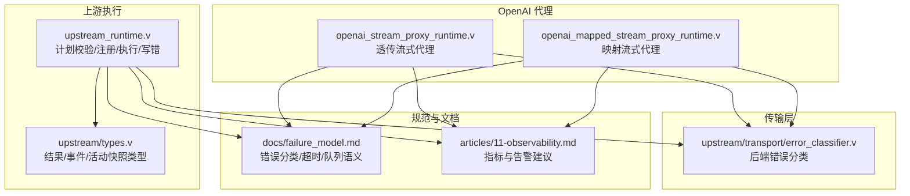
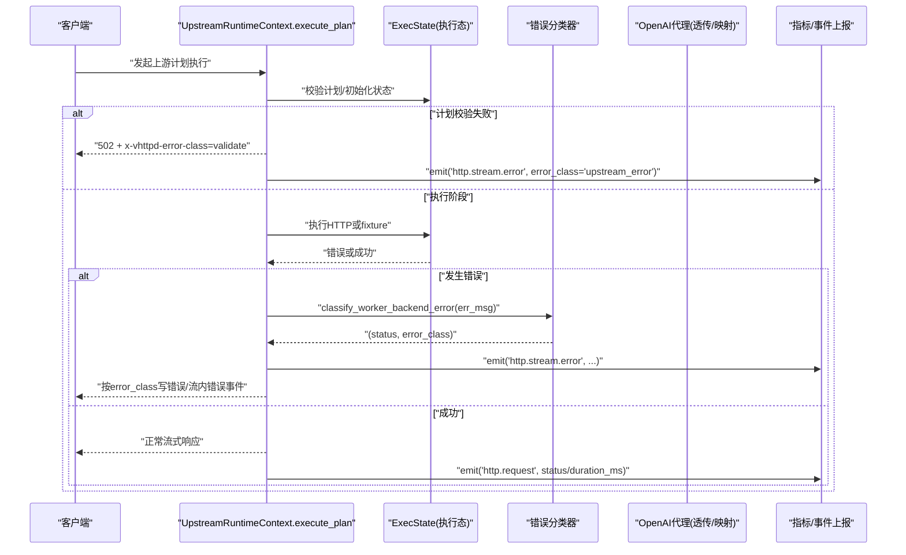
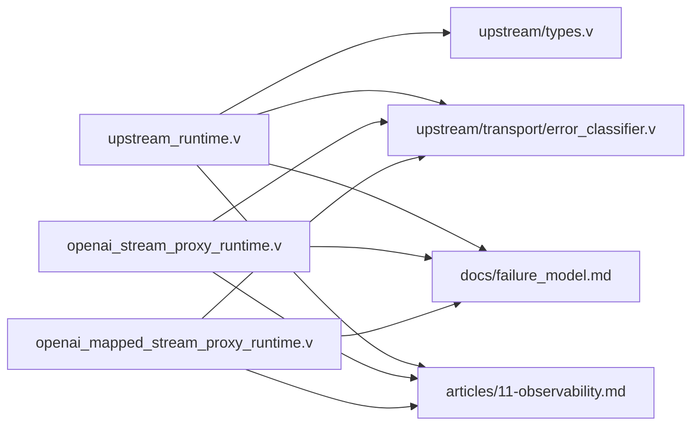

# 错误处理模式

<cite>
**本文引用的文件**   
- [src/upstream/transport/error_classifier.v](file://src/upstream/transport/error_classifier.v)
- [src/upstream/types.v](file://src/upstream/types.v)
- [src/upstream_runtime.v](file://src/upstream_runtime.v)
- [src/openai_stream_proxy_runtime.v](file://src/openai_stream_proxy_runtime.v)
- [src/openai_mapped_stream_proxy_runtime.v](file://src/openai_mapped_stream_proxy_runtime.v)
- [docs/failure_model.md](file://docs/failure_model.md)
- [articles/11-observability.md](file://articles/11-observability.md)
</cite>

## 目录
1. [简介](#简介)
2. [项目结构](#项目结构)
3. [核心组件](#核心组件)
4. [架构总览](#架构总览)
5. [详细组件分析](#详细组件分析)
6. [依赖关系分析](#依赖关系分析)
7. [性能与可观测性](#性能与可观测性)
8. [故障排查指南](#故障排查指南)
9. [结论](#结论)
10. [附录：错误分类与响应约定](#附录错误分类与响应约定)

## 简介
本文件围绕“自定义上游提供者”的错误处理模式，系统化阐述错误分类体系、错误恢复机制（重试、退避、熔断）、错误传播与包装（上下文保留、错误链、日志规范）、降级策略（备用服务切换、缓存返回、默认响应），以及监控告警集成。文档以仓库现有实现为依据，结合失败模型与可观测性实践，给出面向生产落地的指导与示例路径。

## 项目结构
与上游错误处理密切相关的代码集中在 upstream 运行时、OpenAI 流式代理、传输层错误分类器，以及失败模型与可观测性文档中。下图展示关键模块与职责边界。

图表来源
- [src/upstream_runtime.v:58-162](file://src/upstream_runtime.v#L58-L162)
- [src/upstream/types.v:100-130](file://src/upstream/types.v#L100-L130)
- [src/upstream/transport/error_classifier.v:3-18](file://src/upstream/transport/error_classifier.v#L3-L18)
- [src/openai_stream_proxy_runtime.v:112-245](file://src/openai_stream_proxy_runtime.v#L112-L245)
- [src/openai_mapped_stream_proxy_runtime.v:63-197](file://src/openai_mapped_stream_proxy_runtime.v#L63-L197)
- [docs/failure_model.md:1-133](file://docs/failure_model.md#L1-L133)
- [articles/11-observability.md:469-534](file://articles/11-observability.md#L469-L534)

章节来源
- [src/upstream_runtime.v:58-162](file://src/upstream_runtime.v#L58-L162)
- [src/upstream/types.v:100-130](file://src/upstream/types.v#L100-L130)
- [src/upstream/transport/error_classifier.v:3-18](file://src/upstream/transport/error_classifier.v#L3-L18)
- [src/openai_stream_proxy_runtime.v:112-245](file://src/openai_stream_proxy_runtime.v#L112-L245)
- [src/openai_mapped_stream_proxy_runtime.v:63-197](file://src/openai_mapped_stream_proxy_runtime.v#L63-L197)
- [docs/failure_model.md:1-133](file://docs/failure_model.md#L1-L133)
- [articles/11-observability.md:469-534](file://articles/11-observability.md#L469-L534)

## 核心组件
- 传输层错误分类器：将底层 worker 后端错误消息归一为 HTTP 状态码与错误类，便于上层统一处理与告警。
- Upstream 运行时：负责上游计划校验、连接接管、流式写出、错误写入与指标上报。
- OpenAI 代理（透传/映射）：在流式场景中对上游错误进行解析、降级与回退，并维持 trace_id 等上下文。
- 失败模型与可观测性：定义错误分类、响应信封、超时与队列语义，并提供指标与告警建议。

章节来源
- [src/upstream/transport/error_classifier.v:3-18](file://src/upstream/transport/error_classifier.v#L3-L18)
- [src/upstream_runtime.v:58-162](file://src/upstream_runtime.v#L58-L162)
- [src/openai_stream_proxy_runtime.v:112-245](file://src/openai_stream_proxy_runtime.v#L112-L245)
- [src/openai_mapped_stream_proxy_runtime.v:63-197](file://src/openai_mapped_stream_proxy_runtime.v#L63-L197)
- [docs/failure_model.md:1-133](file://docs/failure_model.md#L1-L133)
- [articles/11-observability.md:469-534](file://articles/11-observability.md#L469-L534)

## 架构总览
下图展示了上游请求从进入运行时的端到端流程，包括错误分类、错误传播、降级与指标上报。

图表来源
- [src/upstream_runtime.v:58-162](file://src/upstream_runtime.v#L58-L162)
- [src/upstream/transport/error_classifier.v:3-18](file://src/upstream/transport/error_classifier.v#L3-L18)
- [src/openai_stream_proxy_runtime.v:112-245](file://src/openai_stream_proxy_runtime.v#L112-L245)
- [src/openai_mapped_stream_proxy_runtime.v:63-197](file://src/openai_mapped_stream_proxy_runtime.v#L63-L197)

## 详细组件分析

### 错误分类体系（网络/业务/系统）
- 传输层错误分类器根据错误消息关键字，将底层错误映射为标准 HTTP 状态码与错误类，例如：
  - 工作池耗尽 -> 503 / worker_pool_exhausted
  - 队列满 -> 503 / worker_queue_full
  - 队列等待超时 -> 504 / worker_queue_timeout
  - 通用超时 -> 504 / timeout
  - 其他传输错误 -> 502 / transport_error
- 失败模型进一步定义了 Worker 运行时错误、应用契约错误、上游错误等类别及默认返回码，确保跨链路一致。

章节来源
- [src/upstream/transport/error_classifier.v:3-18](file://src/upstream/transport/error_classifier.v#L3-L18)
- [docs/failure_model.md:1-133](file://docs/failure_model.md#L1-L133)

### 错误恢复机制（重试、退避、熔断）
- 当前阶段不自动重试非幂等请求，避免副作用；对幂等场景可在上层策略中引入带指数退避的重试。
- 在 OpenAI 代理中实现了“备用后端切换”的降级能力：当主上游失败或返回 4xx/5xx 时，尝试调用 fallback plan 的备用后端，并以相同 stream_mode 继续输出。
- 熔断器模式可作为扩展：基于错误率/延迟阈值动态禁用不稳定上游，并在窗口期后试探恢复。

章节来源
- [docs/failure_model.md:127-133](file://docs/failure_model.md#L127-L133)
- [src/openai_stream_proxy_runtime.v:158-203](file://src/openai_stream_proxy_runtime.v#L158-L203)
- [src/openai_mapped_stream_proxy_runtime.v:102-149](file://src/openai_mapped_stream_proxy_runtime.v#L102-L149)

### 错误传播与包装（上下文保留、错误链、日志规范）
- 上下文保留：所有错误路径均携带 request_id 与 trace_id，并通过响应头 x-vhttpd-trace-id 透出，便于追踪。
- 错误链构建：上游错误经 OpenAIErrorParser 解析为 code/message/type，再包装为统一的错误信封返回。
- 日志规范：失败路径 emit http.stream.error，包含 method/path/request_id/trace_id/error_class/error 等字段；成功路径 emit http.request，包含 status/duration_ms/stream_strategy 等。

章节来源
- [src/upstream_runtime.v:110-136](file://src/upstream_runtime.v#L110-L136)
- [src/openai_stream_proxy_runtime.v:174-226](file://src/openai_stream_proxy_runtime.v#L174-L226)
- [src/openai_mapped_stream_proxy_runtime.v:117-163](file://src/openai_mapped_stream_proxy_runtime.v#L117-L163)
- [docs/failure_model.md:114-126](file://docs/failure_model.md#L114-L126)

### 降级策略（备用服务切换、缓存数据返回、默认响应）
- 备用服务切换：OpenAI 代理在 fetch 失败或 4xx/5xx 时，若配置了 fallback plan 且 stream_mode 匹配，则重置状态并切换到备用后端继续流式输出。
- 缓存数据返回：可在 fallback 逻辑中读取本地缓存或静态兜底内容，作为临时响应体。
- 默认响应处理：当无法生成有效响应时，返回最小错误信封（含 x-vhttpd-error-class），保证下游可观测。

章节来源
- [src/openai_stream_proxy_runtime.v:158-203](file://src/openai_stream_proxy_runtime.v#L158-L203)
- [src/openai_mapped_stream_proxy_runtime.v:102-149](file://src/openai_mapped_stream_proxy_runtime.v#L102-L149)
- [docs/failure_model.md:37-65](file://docs/failure_model.md#L37-L65)

### 监控与告警集成（指标收集、异常上报、性能分析）
- 指标收集：通过 emit('http.request' | 'http.stream.error') 输出结构化事件，包含方法、路径、状态、耗时、错误类等，便于聚合统计。
- 异常上报：错误事件包含 error_class 与脱敏后的 error_message，可用于异常平台采集。
- 性能分析：duration_ms 字段支持 P95/P99 分位计算；结合上游名称、stream_type 维度定位瓶颈。
- 告警规则：参考可观测性文档中的推荐告警，覆盖 worker 池耗尽、队列积压、高错误率、上游断开等。

章节来源
- [src/upstream_runtime.v:145-161](file://src/upstream_runtime.v#L145-L161)
- [src/openai_stream_proxy_runtime.v:233-243](file://src/openai_stream_proxy_runtime.v#L233-L243)
- [src/openai_mapped_stream_proxy_runtime.v:184-195](file://src/openai_mapped_stream_proxy_runtime.v#L184-L195)
- [articles/11-observability.md:469-534](file://articles/11-observability.md#L469-L534)

### 具体错误处理示例（路径引用）
- 上游计划校验失败：返回 502，设置 x-vhttpd-error-class=validate，并记录 http.stream.error。
  - 参考路径：[src/upstream_runtime.v:58-73](file://src/upstream_runtime.v#L58-L73)
- 执行阶段错误（fixture/http）：记录 http.stream.error，并按流类型写出错误事件或文本。
  - 参考路径：[src/upstream_runtime.v:110-136](file://src/upstream_runtime.v#L110-L136)
- OpenAI 透传代理：fetch 失败或 4xx/5xx 时尝试 fallback plan，最终写出错误信封或完成流。
  - 参考路径：[src/openai_stream_proxy_runtime.v:158-226](file://src/openai_stream_proxy_runtime.v#L158-L226)
- OpenAI 映射代理：在映射过程中捕获 mapper_error 并写出 SSE 错误事件，或在失败时走 fallback。
  - 参考路径：[src/openai_mapped_stream_proxy_runtime.v:102-174](file://src/openai_mapped_stream_proxy_runtime.v#L102-L174)
- 传输层错误分类：依据错误消息关键字映射到标准状态码与错误类。
  - 参考路径：[src/upstream/transport/error_classifier.v:3-18](file://src/upstream/transport/error_classifier.v#L3-L18)

## 依赖关系分析
- upstream_runtime 依赖 upstream.types 提供结果与快照类型，并调用 transport 错误分类器进行归类。
- OpenAI 代理依赖上游 HTTP 客户端与错误解析器，同时复用 transport 错误分类器用于统一错误类。
- 失败模型与可观测性文档为上述实现提供契约与指标约定。

图表来源
- [src/upstream_runtime.v:58-162](file://src/upstream_runtime.v#L58-L162)
- [src/upstream/types.v:100-130](file://src/upstream/types.v#L100-L130)
- [src/upstream/transport/error_classifier.v:3-18](file://src/upstream/transport/error_classifier.v#L3-L18)
- [src/openai_stream_proxy_runtime.v:112-245](file://src/openai_stream_proxy_runtime.v#L112-L245)
- [src/openai_mapped_stream_proxy_runtime.v:63-197](file://src/openai_mapped_stream_proxy_runtime.v#L63-L197)
- [docs/failure_model.md:1-133](file://docs/failure_model.md#L1-L133)
- [articles/11-observability.md:469-534](file://articles/11-observability.md#L469-L534)

## 性能与可观测性
- 指标维度：method、path、status、duration_ms、stream_strategy、stream_type、upstream_name、provider、backend、mapper 等，有助于分层定位问题。
- 告警建议：worker 池耗尽、队列积压、高错误率、上游断开、MCP 会话接近上限等。
- 优化方向：
  - 对高频错误类（如 worker_queue_full、timeout）做容量扩容或限流。
  - 针对上游慢响应启用自适应超时与熔断。
  - 使用缓存/默认响应降低热点路径压力。

章节来源
- [src/upstream_runtime.v:145-161](file://src/upstream_runtime.v#L145-L161)
- [src/openai_stream_proxy_runtime.v:233-243](file://src/openai_stream_proxy_runtime.v#L233-L243)
- [src/openai_mapped_stream_proxy_runtime.v:184-195](file://src/openai_mapped_stream_proxy_runtime.v#L184-L195)
- [articles/11-observability.md:469-534](file://articles/11-observability.md#L469-L534)

## 故障排查指南
- 快速定位：
  - 检查响应头 x-vhttpd-error-class 与 x-vhttpd-trace-id，确认错误类与追踪 ID。
  - 查看 http.stream.error 事件，关注 error_class 与 error_message。
- 常见场景：
  - worker_pool_exhausted / worker_queue_full：扩容 worker 或调整队列容量/超时。
  - timeout / worker_queue_timeout：检查上游响应时间与队列等待时间。
  - upstream_error：核对上游 URL、鉴权、协议与映射配置。
- 工具与接口：
  - 使用 admin 运行时快照与事件列表观察活跃会话与最近事件。
  - 结合 Prometheus/Grafana 可视化错误率与延迟分布。

章节来源
- [docs/failure_model.md:37-95](file://docs/failure_model.md#L37-L95)
- [src/upstream_runtime.v:110-136](file://src/upstream_runtime.v#L110-L136)
- [articles/11-observability.md:469-534](file://articles/11-observability.md#L469-L534)

## 结论
本错误处理模式以“分类清晰、传播完整、可观测完备、降级可控”为核心目标。通过传输层错误分类器与失败模型，统一了错误语义；通过 OpenAI 代理的 fallback 机制，实现了稳定的降级策略；通过 emit 事件与告警建议，构建了完善的监控闭环。建议在后续迭代中补充显式的重试/退避/熔断策略，并结合业务幂等性设计完善自动化恢复。

## 附录：错误分类与响应约定
- 错误分类与默认返回码：
  - Transport Error -> 502
  - Worker Runtime Error -> 500
  - App Contract Error -> 500
  - Timeout -> 504
  - Worker Queue Full -> 503
  - Worker Queue Timeout -> 504
  - Upstream Error -> 502（未开始写出）或流内错误事件（已开始写出）
- 响应信封约定：
  - 至少包含 status、content_type、headers（x-vhttpd-error-class、x-vhttpd-trace-id）、body。
- 可观测字段：
  - trace_id、request_id、method、path、status、error_class、error_message、duration_ms。

章节来源
- [docs/failure_model.md:1-133](file://docs/failure_model.md#L1-L133)