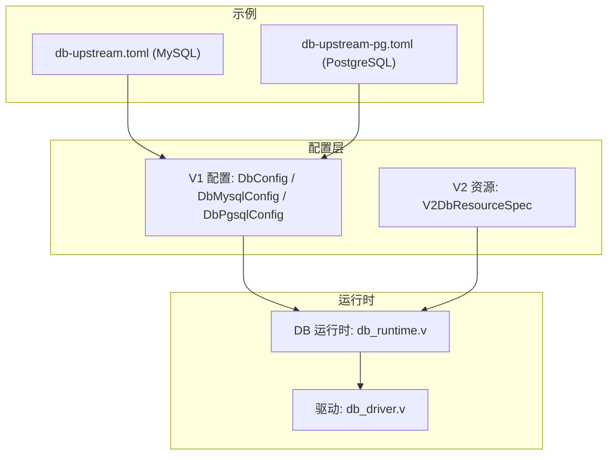
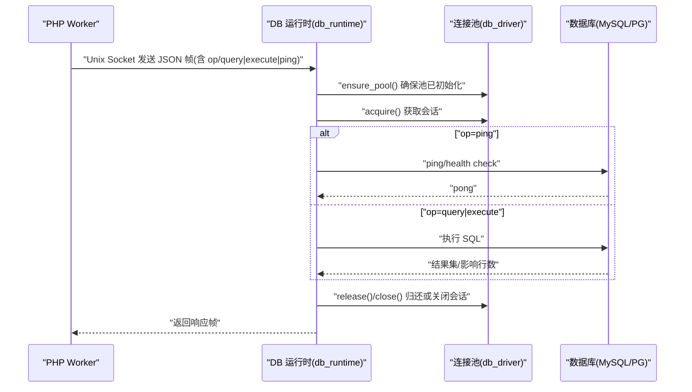
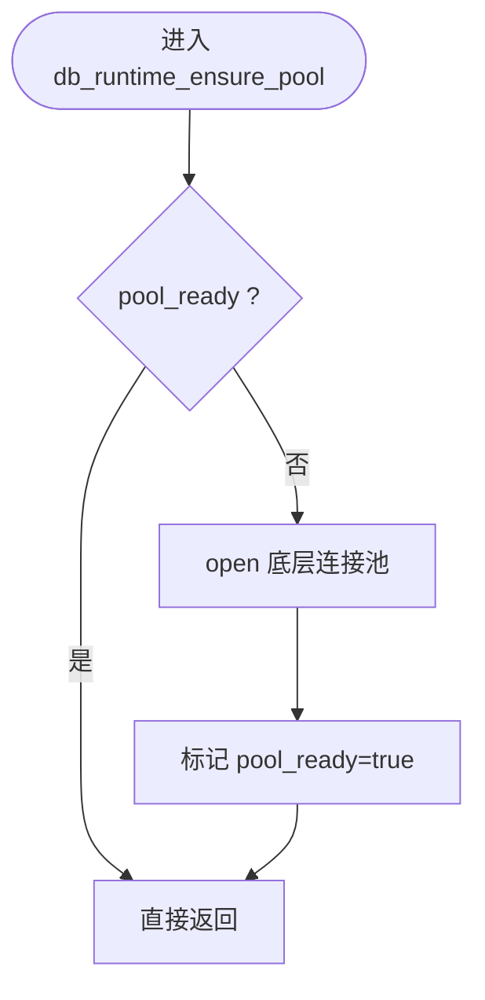
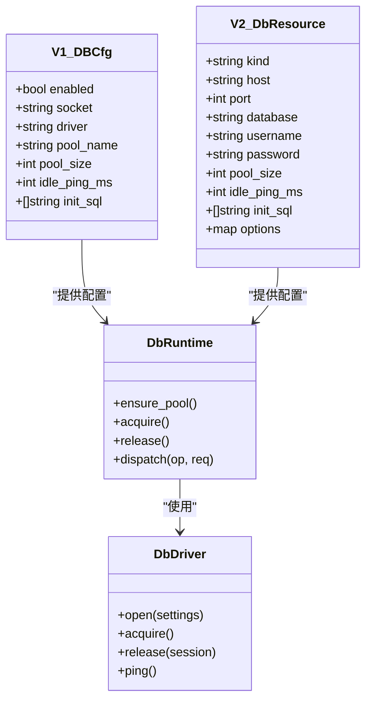

# 连接池配置

<cite>
**本文引用的文件**   
- [src/config/config.v](file://src/config/config.v)
- [src/config/v2_config.v](file://src/config/v2_config.v)
- [dbsrc/db_driver.v](file://dbsrc/db_driver.v)
- [dbsrc/db_runtime.v](file://dbsrc/db_runtime.v)
- [src/provider/config.v](file://src/provider/config.v)
- [examples/config/db-upstream.toml](file://examples/config/db-upstream.toml)
- [examples/config/db-upstream-pg.toml](file://examples/config/db-upstream-pg.toml)
- [php/package/README.md](file://php/package/README.md)
</cite>

## 目录
1. [简介](#简介)
2. [项目结构](#项目结构)
3. [核心组件](#核心组件)
4. [架构总览](#架构总览)
5. [详细组件分析](#详细组件分析)
6. [依赖关系分析](#依赖关系分析)
7. [性能与容量规划](#性能与容量规划)
8. [故障排查指南](#故障排查指南)
9. [结论](#结论)
10. [附录：场景化配置模板](#附录场景化配置模板)

## 简介
本文件聚焦于 vhttpd 中的“连接池”能力，围绕数据库连接池的配置、生命周期管理、空闲回收、健康检查、泄漏防护以及分布式共享等主题进行系统化说明。文档同时给出面向不同应用场景（数据库、缓存、外部 API）的配置模板与最佳实践建议，帮助读者在本地开发、生产部署与多实例共享环境下正确调优。

## 项目结构
vhttpd 的连接池相关实现主要分布在以下位置：
- 配置模型定义：V1/V2 两套配置结构体，涵盖数据库、缓存等资源描述
- 运行时服务：提供 Unix Socket 的 DB 运行时，负责连接池创建、获取、释放与健康探测
- 驱动层：封装 MySQL/PostgreSQL 底层连接池与会话操作
- 示例配置：MySQL/PG 的独立上游进程示例

图表来源
- [src/config/config.v:275-311](file://src/config/config.v#L275-L311)
- [src/config/v2_config.v:82-94](file://src/config/v2_config.v#L82-L94)
- [dbsrc/db_runtime.v:1-120](file://dbsrc/db_runtime.v#L1-L120)
- [dbsrc/db_driver.v:1-132](file://dbsrc/db_driver.v#L1-L132)
- [examples/config/db-upstream.toml:15-28](file://examples/config/db-upstream.toml#L15-L28)
- [examples/config/db-upstream-pg.toml:15-28](file://examples/config/db-upstream-pg.toml#L15-L28)

章节来源
- [src/config/config.v:275-311](file://src/config/config.v#L275-L311)
- [src/config/v2_config.v:82-94](file://src/config/v2_config.v#L82-L94)
- [dbsrc/db_runtime.v:1-120](file://dbsrc/db_runtime.v#L1-L120)
- [dbsrc/db_driver.v:1-132](file://dbsrc/db_driver.v#L1-L132)
- [examples/config/db-upstream.toml:15-28](file://examples/config/db-upstream.toml#L15-L28)
- [examples/config/db-upstream-pg.toml:15-28](file://examples/config/db-upstream-pg.toml#L15-L28)

## 核心组件
- 配置模型
  - V1 配置：包含全局 [db] 与 [db.mysql]/[db.pgsql] 子段，支持 pool_size、idle_ping_ms、init_sql 等
  - V2 资源：resources.db 下以命名资源方式声明连接池参数
- 运行时服务
  - 通过 Unix Socket 暴露 DB 协议，接收请求后从连接池获取会话执行 SQL，并返回结果
  - 提供 ping、事务 begin/commit/rollback、query/execute 等操作
- 驱动层
  - 封装 MySQL 与 PostgreSQL 的连接池创建、会话获取、释放、重置与基本操作

章节来源
- [src/config/config.v:275-311](file://src/config/config.v#L275-L311)
- [src/config/v2_config.v:82-94](file://src/config/v2_config.v#L82-L94)
- [dbsrc/db_runtime.v:397-609](file://dbsrc/db_runtime.v#L397-L609)
- [dbsrc/db_driver.v:89-180](file://dbsrc/db_driver.v#L89-L180)

## 架构总览
下图展示了 PHP Worker 通过 vhttpd 提供的 DB 运行时访问数据库连接池的整体流程。

图表来源
- [dbsrc/db_runtime.v:643-704](file://dbsrc/db_runtime.v#L643-L704)
- [dbsrc/db_driver.v:146-180](file://dbsrc/db_driver.v#L146-L180)

## 详细组件分析

### 配置模型与字段说明
- V1 配置（[db] 与 [db.mysql]/[db.pgsql]）
  - 关键参数
    - enabled：是否启用 DB 运行时
    - socket：Unix Socket 路径
    - driver：驱动名（mysql/pg）
    - pool_name：池名称（用于标识）
    - pool_size：最大并发连接数
    - idle_ping_ms：空闲连接健康探测间隔（毫秒），仅对 MySQL 生效
    - init_sql：连接建立后执行的初始化 SQL 列表（仅对 MySQL 生效）
- V2 资源（resources.db.<name>）
  - 关键参数
    - kind：资源类型（如 mysql/pg）
    - host/port/database/username/password：连接信息
    - pool_size：最大连接数
    - idle_ping_ms：空闲探测间隔
    - init_sql：初始化 SQL 列表
    - options：扩展选项（透传）

章节来源
- [src/config/config.v:275-311](file://src/config/config.v#L275-L311)
- [src/config/v2_config.v:82-94](file://src/config/v2_config.v#L82-L94)
- [src/provider/config.v:205-229](file://src/provider/config.v#L205-L229)

### 连接池基本配置
- 初始连接数
  - 当前实现未显式暴露“初始连接数”配置项；连接通常在首次被需要时按需创建
- 最大连接数
  - 由 pool_size 控制，分别作用于 MySQL 与 PostgreSQL 后端
- 最小空闲连接数
  - 当前实现未暴露“最小空闲连接数”配置项；空闲连接由底层库与运行时策略管理

章节来源
- [dbsrc/db_driver.v:100-132](file://dbsrc/db_driver.v#L100-L132)
- [src/config/config.v:275-311](file://src/config/config.v#L275-L311)

### 连接生命周期管理
- 创建时机
  - 首次调用 ensure_pool 时根据配置打开底层连接池
- 复用策略
  - 非事务请求：acquire -> 执行 -> release 归还到池中
  - 事务请求：begin 后绑定 session_id，后续 query/execute 使用同一连接，commit/rollback 后按可重用策略决定是否归还
- 销毁策略
  - 进程退出时统一关闭池与会话；异常路径会尝试替换坏连接或丢弃不可用会话

图表来源
- [dbsrc/db_runtime.v:233-267](file://dbsrc/db_runtime.v#L233-L267)

章节来源
- [dbsrc/db_runtime.v:233-395](file://dbsrc/db_runtime.v#L233-L395)
- [dbsrc/db_driver.v:146-180](file://dbsrc/db_driver.v#L146-L180)

### 空闲连接回收与清理
- 空闲探测
  - MySQL：当 idle_ping_ms > 0 且自上次使用时间超过阈值时，获取前执行 ping，失败则重建连接
  - PostgreSQL：不启用空闲探测（idle_ping_ms 强制为 0）
- 定期清理
  - 进程停止时清理所有事务会话并关闭池
- 资源释放策略
  - 正常路径：release 归还到池
  - 异常路径：discard_conn 尝试用新连接替换旧连接，失败则关闭

章节来源
- [src/provider/config.v:216-225](file://src/provider/config.v#L216-L225)
- [dbsrc/db_runtime.v:371-395](file://dbsrc/db_runtime.v#L371-L395)
- [dbsrc/db_driver.v:254-266](file://dbsrc/db_driver.v#L254-L266)

### 连接验证机制
- 健康检查
  - 提供 ping 操作，内部对 MySQL 调用 ping，对 PG 执行 select 1
- 连接测试
  - 可通过 admin 或监控端点拉取快照，观察 pool_ready、last_error、failed_queries 等指标
- 故障检测
  - 错误计数与 last_error 记录；异常路径触发连接替换或丢弃

章节来源
- [dbsrc/db_driver.v:196-209](file://dbsrc/db_driver.v#L196-L209)
- [dbsrc/db_runtime.v:110-157](file://dbsrc/db_runtime.v#L110-L157)
- [dbsrc/db_runtime.v:397-440](file://dbsrc/db_runtime.v#L397-L440)

### 连接泄漏防护
- 最大等待时间
  - 当前实现未在 DB 运行时暴露“最大等待时间”配置项；超时控制更多体现在上层 worker 队列与读超时
- 超时告警
  - 可通过事件日志与快照指标进行观测与告警
- 资源监控
  - 快照包含 total_queries、total_executes、failed_queries、active_transactions 等

章节来源
- [dbsrc/db_runtime.v:110-157](file://dbsrc/db_runtime.v#L110-L157)
- [php/package/README.md:563-605](file://php/package/README.md#L563-L605)

### 分布式连接池配置
- Redis 共享
  - 当前仓库未提供内置 Redis 连接池实现；应用层可按需自行集成
- 一致性保证
  - 基于 Unix Socket 的 DB 运行时在同一进程内提供连接复用；跨进程/跨主机需通过外部中间件或应用层协调
- 故障转移
  - 当前实现未提供自动故障转移；可在上层做重试与降级策略

章节来源
- [php/package/README.md:563-605](file://php/package/README.md#L563-L605)

### 不同应用场景的配置模板
- 数据库连接（MySQL）
  - 参考示例：[examples/config/db-upstream.toml:15-28](file://examples/config/db-upstream.toml#L15-L28)
  - 要点：设置 driver=mysql、pool_size、socket、认证信息与数据库名
- 数据库连接（PostgreSQL）
  - 参考示例：[examples/config/db-upstream-pg.toml:15-28](file://examples/config/db-upstream-pg.toml#L15-L28)
  - 要点：设置 driver=pgsql、pool_size、socket、认证信息与数据库名
- 缓存连接
  - 当前仓库未提供内置缓存连接池；可通过环境变量与 drop-in 接入外部缓存（见 README 中 WordPress Object Cache 说明）
- 外部 API 调用
  - 当前仓库未提供通用 HTTP 客户端连接池配置；建议在应用层使用具备连接池能力的 SDK 或框架

章节来源
- [examples/config/db-upstream.toml:15-28](file://examples/config/db-upstream.toml#L15-L28)
- [examples/config/db-upstream-pg.toml:15-28](file://examples/config/db-upstream-pg.toml#L15-L28)
- [php/package/README.md:563-605](file://php/package/README.md#L563-L605)

## 依赖关系分析
- 配置到运行时的映射
  - V1/V2 配置经 provider 层合并后传入运行时，决定驱动、地址、池大小与空闲探测策略
- 运行时到驱动的依赖
  - db_runtime 依赖 db_driver 完成连接池创建与会话管理
- 示例到配置的依赖
  - 示例 toml 直接体现 V1 配置项的使用方式

图表来源
- [src/config/config.v:275-311](file://src/config/config.v#L275-L311)
- [src/config/v2_config.v:82-94](file://src/config/v2_config.v#L82-L94)
- [dbsrc/db_runtime.v:233-395](file://dbsrc/db_runtime.v#L233-L395)
- [dbsrc/db_driver.v:89-180](file://dbsrc/db_driver.v#L89-L180)

章节来源
- [src/config/config.v:275-311](file://src/config/config.v#L275-L311)
- [src/config/v2_config.v:82-94](file://src/config/v2_config.v#L82-L94)
- [dbsrc/db_runtime.v:233-395](file://dbsrc/db_runtime.v#L233-L395)
- [dbsrc/db_driver.v:89-180](file://dbsrc/db_driver.v#L89-L180)

## 性能与容量规划
- 并发与吞吐
  - pool_size 应与业务 QPS、平均延迟及下游数据库上限相匹配；过高会导致上下文切换与锁竞争，过低会成为瓶颈
- 空闲探测
  - 对 MySQL 开启 idle_ping_ms 可有效避免长空闲导致的连接失效；PG 默认不探测
- 事务与会话
  - 长事务会占用连接更久，应评估 active_transactions 峰值，必要时拆分事务或提高池大小
- 监控与告警
  - 关注 failed_queries、last_error、active_transactions 等指标，结合事件日志定位问题

[本节为通用指导，无需特定文件引用]

## 故障排查指南
- 常见问题
  - 连接无法建立：检查 socket 路径、driver、host/port/用户名密码是否正确
  - 频繁断开：确认 idle_ping_ms 是否合理，网络是否存在丢包或防火墙策略
  - 事务泄漏：检查应用是否在 commit/rollback 后归还连接
- 诊断手段
  - 使用快照接口查看 pool_ready、failed_queries、active_transactions
  - 使用 ping 操作快速验证连通性
  - 查看事件日志与错误码定位根因

章节来源
- [dbsrc/db_runtime.v:110-157](file://dbsrc/db_runtime.v#L110-L157)
- [dbsrc/db_runtime.v:397-440](file://dbsrc/db_runtime.v#L397-L440)

## 结论
vhttpd 的数据库连接池以“按需创建 + 固定上限”的方式工作，并通过 Unix Socket 向应用提供统一的 DB 运行时。其特性包括：
- 明确的配置入口（V1/V2）
- 针对 MySQL 的空闲探测与初始化 SQL
- 完善的会话管理与事务支持
- 基础的健康检查与错误统计

在生产环境中，建议结合业务负载与数据库能力合理设置 pool_size，并在 MySQL 上启用 idle_ping_ms 以提升健壮性。对于 Redis 共享、一致性保证与故障转移等高级需求，当前仓库未内置实现，需在应用层或外部中间件中补充。

[本节为总结性内容，无需特定文件引用]

## 附录：场景化配置模板
以下为可直接参考的最小可用片段（请根据实际环境调整值）：

- MySQL 数据库连接池（V1）
  - 参考：[examples/config/db-upstream.toml:15-28](file://examples/config/db-upstream.toml#L15-L28)
  - 关键字段：enabled、socket、driver、pool_name、[db.mysql].host/port/username/password/database/pool_size

- PostgreSQL 数据库连接池（V1）
  - 参考：[examples/config/db-upstream-pg.toml:15-28](file://examples/config/db-upstream-pg.toml#L15-L28)
  - 关键字段：enabled、socket、driver、pool_name、[db.pgsql].host/port/username/password/database/pool_size

- 缓存连接（概念）
  - 当前仓库未提供内置缓存连接池；可参考 README 中关于 WordPress Object Cache 的环境变量与 drop-in 说明进行集成

- 外部 API 调用（概念）
  - 建议使用具备连接池能力的 HTTP 客户端 SDK 或框架，并在应用层配置连接池参数

章节来源
- [examples/config/db-upstream.toml:15-28](file://examples/config/db-upstream.toml#L15-L28)
- [examples/config/db-upstream-pg.toml:15-28](file://examples/config/db-upstream-pg.toml#L15-L28)
- [php/package/README.md:563-605](file://php/package/README.md#L563-L605)