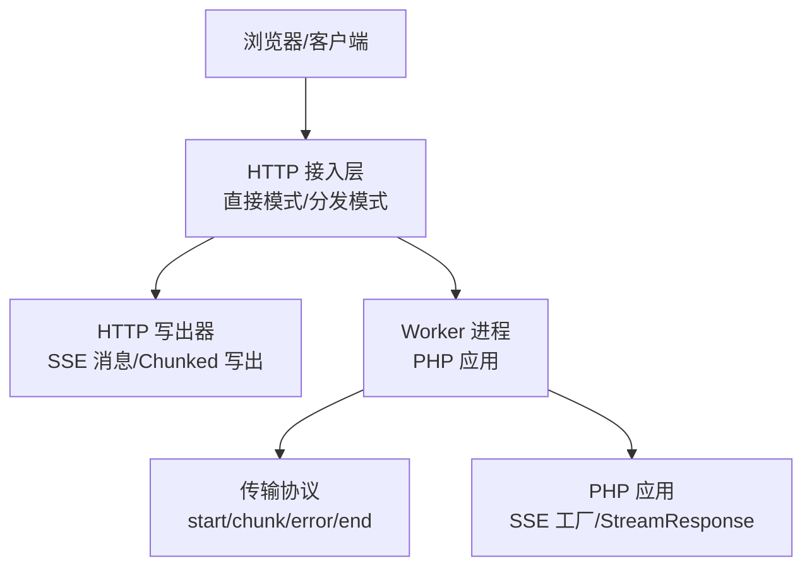
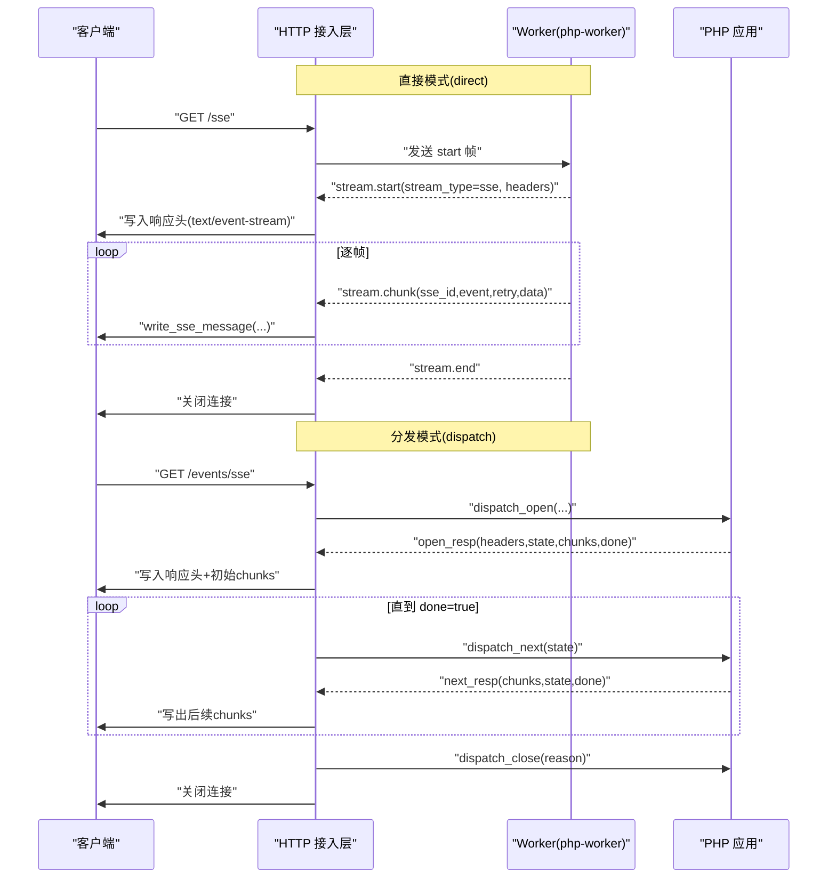
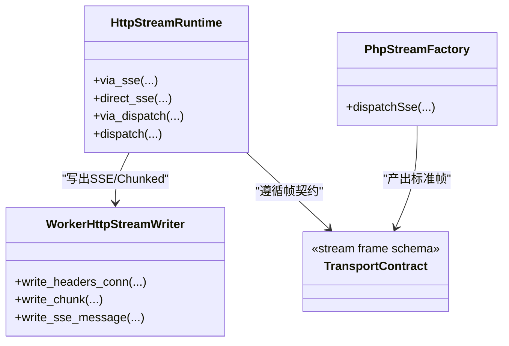

# SSE 流式配置

<cite>
**本文引用的文件**   
- [src/stream_direct_runtime.v](file://src/stream_direct_runtime.v)
- [src/stream_dispatch_runtime.v](file://src/stream_dispatch_runtime.v)
- [src/worker/http_writer.v](file://src/worker/http_writer.v)
- [docs/transport_contract.md](file://docs/transport_contract.md)
- [php/package/src/VHttpd/PhpWorker/Server.php](file://php/package/src/VHttpd/PhpWorker/Server.php)
- [php/package/src/VSlim/Stream/Factory.php](file://php/package/src/VSlim/Stream/Factory.php)
- [examples/stream-dispatch-app.php](file://examples/stream-dispatch-app.php)
- [config/vhttpd.example.toml](file://config/vhttpd.example.toml)
- [bench/k6_stream.js](file://bench/k6_stream.js)
- [README.md](file://README.md)
</cite>

## 目录
1. [简介](#简介)
2. [项目结构](#项目结构)
3. [核心组件](#核心组件)
4. [架构总览](#架构总览)
5. [详细组件分析](#详细组件分析)
6. [依赖关系分析](#依赖关系分析)
7. [性能与容量规划](#性能与容量规划)
8. [错误处理与恢复](#错误处理与恢复)
9. [背压与流量控制](#背压与流量控制)
10. [连接保持、重试与断线重连](#连接保持重试与断线重连)
11. [数据分块、压缩与编码](#数据分块压缩与编码)
12. [完整配置示例](#完整配置示例)
13. [调试与排障指南](#调试与排障指南)
14. [结论](#结论)

## 简介
本文件面向使用 vhttpd 的开发者与运维人员，系统化说明 Server-Sent Events（SSE）流式响应的端到端配置与最佳实践。内容覆盖：
- 连接生命周期与事件缓冲
- 流式数据处理（分块大小、压缩、编码）
- 断线重连策略（指数退避、状态恢复）
- 背压控制（流量限制、队列管理、丢弃策略）
- 错误处理与恢复（异常捕获、降级、健康检查）
- 性能优化参数（并发连接数、内存、CPU）
- 完整配置示例与调试工具使用方法

## 项目结构
vhttpd 的 SSE 能力由“HTTP 接入层 + Worker 传输协议 + PHP 应用侧”共同实现：
- HTTP 接入层负责接管 TCP 连接、写入响应头、按帧驱动下游 worker 并写回客户端
- Worker 传输协议定义 start/chunk/error/end 帧格式与 SSE 扩展字段
- PHP 应用侧通过工厂方法构造 SSE 序列或基于 StreamResponse 的流式输出

图表来源
- [src/stream_direct_runtime.v:17-70](file://src/stream_direct_runtime.v#L17-L70)
- [src/stream_dispatch_runtime.v:39-148](file://src/stream_dispatch_runtime.v#L39-L148)
- [src/worker/http_writer.v:81-97](file://src/worker/http_writer.v#L81-L97)
- [docs/transport_contract.md:99-166](file://docs/transport_contract.md#L99-L166)
- [php/package/src/VSlim/Stream/Factory.php:61-77](file://php/package/src/VSlim/Stream/Factory.php#L61-L77)

章节来源
- [src/stream_direct_runtime.v:17-70](file://src/stream_direct_runtime.v#L17-L70)
- [src/stream_dispatch_runtime.v:39-148](file://src/stream_dispatch_runtime.v#L39-L148)
- [src/worker/http_writer.v:81-97](file://src/worker/http_writer.v#L81-L97)
- [docs/transport_contract.md:99-166](file://docs/transport_contract.md#L99-L166)
- [php/package/src/VSlim/Stream/Factory.php:61-77](file://php/package/src/VSlim/Stream/Factory.php#L61-L77)

## 核心组件
- 直接模式 SSE 处理器：接管连接、写入 SSE 响应头、循环读取 worker 帧并按需写出 SSE 消息
- 分发模式 SSE 处理器：先 open 再 next/close 轮询，聚合 chunks 写出，支持 HEAD 请求跳过 body
- HTTP 写出器：统一封装 SSE 消息写出与 Chunked 写出
- 传输协议：定义 stream_type=sse 时的 SSE 扩展字段（id/event/retry/data）
- PHP 应用侧：提供 dispatchSse 工厂方法与 StreamResponse 标准化输出

章节来源
- [src/stream_direct_runtime.v:17-70](file://src/stream_direct_runtime.v#L17-L70)
- [src/stream_dispatch_runtime.v:39-148](file://src/stream_dispatch_runtime.v#L39-L148)
- [src/worker/http_writer.v:81-97](file://src/worker/http_writer.v#L81-L97)
- [docs/transport_contract.md:126-166](file://docs/transport_contract.md#L126-L166)
- [php/package/src/VSlim/Stream/Factory.php:61-77](file://php/package/src/VSlim/Stream/Factory.php#L61-L77)

## 架构总览
下图展示两种 SSE 路径：direct（直出）与 dispatch（分发）。两者均遵循 transport contract 的 stream_type=sse 约定，并在响应头中注入追踪与模式标识。

图表来源
- [src/stream_direct_runtime.v:17-70](file://src/stream_direct_runtime.v#L17-L70)
- [src/stream_dispatch_runtime.v:39-148](file://src/stream_dispatch_runtime.v#L39-L148)
- [docs/transport_contract.md:99-166](file://docs/transport_contract.md#L99-L166)

## 详细组件分析

### 直接模式 SSE 处理器
- 接管连接后根据 start 帧决定 status/content-type，默认 text/event-stream
- 自动注入 x-request-id、x-vhttpd-trace-id、x-accel-buffering=no、x-vhttpd-stream-mode=direct
- 循环读取 worker 帧：chunk 时调用 write_sse_message；error 时记录 http.stream.error；end 时结束
- HEAD 请求不写出 body

章节来源
- [src/stream_direct_runtime.v:17-70](file://src/stream_direct_runtime.v#L17-L70)
- [src/worker/http_writer.v:81-97](file://src/worker/http_writer.v#L81-L97)
- [docs/transport_contract.md:126-166](file://docs/transport_contract.md#L126-L166)

### 分发模式 SSE 处理器
- 先 dispatch_open 获取 initial state、headers、initial chunks
- 非 HEAD 情况下立即写出初始 chunks
- 循环 dispatch_next 直至 done=true，期间将 chunks 写出
- 结束时 best_effort_close 通知上游，非 SSE 类型会补写 chunked 终止帧
- 为 SSE 设置 x-accel-buffering=no，避免反向代理缓冲

章节来源
- [src/stream_dispatch_runtime.v:39-148](file://src/stream_dispatch_runtime.v#L39-L148)
- [src/worker/http_writer.v:81-97](file://src/worker/http_writer.v#L81-L97)

### HTTP 写出器
- write_headers_conn：统一写入 HTTP/1.1 响应头，支持 chunked 与 Connection: close
- write_chunk：以长度前缀写出 chunked body
- write_sse_message：按 SSE 规范写出 id/event/data/retry 字段并以空行分隔

章节来源
- [src/worker/http_writer.v:34-97](file://src/worker/http_writer.v#L34-L97)

### 传输协议与 SSE 扩展
- stream_type=sse 时，chunk 帧可携带 sse_id、sse_event、sse_retry、data
- error 帧携带 error_class、error；end 帧表示终端
- 行为约定：HEAD 不写 body；其他 stream_type 走 passthrough chunked

章节来源
- [docs/transport_contract.md:99-166](file://docs/transport_contract.md#L99-L166)

### PHP 应用侧 SSE 工厂
- dispatchSse(events, status, headers, batchSize, delayMs) 生成 SSE 流
- 内部通过 StreamApp::fromSequence 指定 'sse' 类型与 content-type=text/event-stream
- 支持批量与延迟控制，便于调节吞吐与前端渲染节奏

章节来源
- [php/package/src/VSlim/Stream/Factory.php:61-77](file://php/package/src/VSlim/Stream/Factory.php#L61-L77)

### 示例应用（分发模式）
- 页面通过 EventSource 订阅 /events/sse
- PHP 侧返回 HTML 与 stream 路由，stream 回调委托给 StreamFactory::dispatchSse
- 演示了 open/next/close 的生命周期与合成 tick/done 事件

章节来源
- [examples/stream-dispatch-app.php:81-105](file://examples/stream-dispatch-app.php#L81-L105)

## 依赖关系分析
- HTTP 接入层依赖写出器进行底层 I/O
- 分发模式依赖 dispatch 接口完成 open/next/close 三阶段
- 传输协议约束了 start/chunk/error/end 的语义与 SSE 扩展字段
- PHP 应用通过工厂方法或 StreamResponse 产出标准帧

图表来源
- [src/stream_direct_runtime.v:17-70](file://src/stream_direct_runtime.v#L17-L70)
- [src/stream_dispatch_runtime.v:39-148](file://src/stream_dispatch_runtime.v#L39-L148)
- [src/worker/http_writer.v:34-97](file://src/worker/http_writer.v#L34-L97)
- [docs/transport_contract.md:99-166](file://docs/transport_contract.md#L99-L166)
- [php/package/src/VSlim/Stream/Factory.php:61-77](file://php/package/src/VSlim/Stream/Factory.php#L61-L77)

## 性能与容量规划
- 并发连接数
  - 通过 worker pool_size 控制后端处理能力，结合监听端口 backlog 与系统 fd 限制
  - 参考示例与 README 中的启动参数
- 内存与 CPU
  - 控制单帧大小（传输协议最大帧 16 MiB），避免超大 chunk
  - 合理设置 batchSize 与 delayMs，降低频繁序列化与网络抖动
- 观测指标
  - 使用 event_log 与 admin 接口观察 active_connections、duration_ms、stream_strategy、stream_type

章节来源
- [config/vhttpd.example.toml:19-26](file://config/vhttpd.example.toml#L19-L26)
- [README.md:1065-1089](file://README.md#L1065-L1089)
- [docs/transport_contract.md:40-42](file://docs/transport_contract.md#L40-L42)

## 错误处理与恢复
- 错误分类
  - 传输层错误：timeout、transport_error
  - 应用层错误：worker_runtime_error、upstream_error
- 日志与告警
  - 通过 http.stream.error 事件记录 method/path/request_id/trace_id/error_class/error
  - 生产建议对 x-vhttpd-error-class 进行分类告警
- 降级策略
  - 当 open 失败时返回 500 并附带错误类与阶段信息
  - 非 SSE 类型在结束时补写 chunked 终止帧，确保客户端正常收尾

章节来源
- [src/stream_direct_runtime.v:42-56](file://src/stream_direct_runtime.v#L42-L56)
- [src/stream_dispatch_runtime.v:100-134](file://src/stream_dispatch_runtime.v#L100-L134)
- [docs/transport_contract.md:168-189](file://docs/transport_contract.md#L168-L189)

## 背压与流量控制
- 应用侧节流
  - 使用 dispatchSse 的 batchSize 与 delayMs 控制推送频率与批大小
- 服务端限流
  - 通过 worker pool_size 与 queue_capacity/queue_timeout_ms 限制入队与等待时间
  - 队列满时返回 503 并附带 x-vhttpd-error-class=worker_queue_full
- 丢弃策略
  - 对于长尾慢消费场景，可在应用层选择丢弃低优先级事件或合并批次

章节来源
- [php/package/src/VSlim/Stream/Factory.php:61-77](file://php/package/src/VSlim/Stream/Factory.php#L61-L77)
- [tests/e2e/config_acceptance_test.sh:2229-2295](file://tests/e2e/config_acceptance_test.sh#L2229-L2295)
- [tests/e2e/config_acceptance_test.sh:3123-3163](file://tests/e2e/config_acceptance_test.sh#L3123-L3163)

## 连接保持、重试与断线重连
- 连接保持
  - SSE 使用 keep-alive，服务器设置 x-accel-buffering=no 避免中间件缓冲
  - 可通过心跳事件维持链路活跃（应用层自行产生周期性事件）
- 重试机制
  - 客户端依据 SSE retry 字段执行重连；服务端在 chunk 帧中携带 sse_retry
- 指数退避
  - 建议在客户端实现指数退避与抖动，避免雪崩
- 状态恢复
  - 利用 sse_id 与 server-side state（如 cursor）实现断点续传

章节来源
- [src/stream_direct_runtime.v:24-26](file://src/stream_direct_runtime.v#L24-L26)
- [docs/transport_contract.md:126-138](file://docs/transport_contract.md#L126-L138)
- [src/stream_dispatch_runtime.v:14-27](file://src/stream_dispatch_runtime.v#L14-L27)

## 数据分块、压缩与编码
- 分块大小
  - 应用侧通过 batchSize 控制每批事件数量；传输协议限制单帧不超过 16 MiB
- 压缩选项
  - 推荐在反向代理层启用 gzip/br，但注意 SSE 实时性要求，谨慎权衡
- 编码格式
  - SSE 文本采用 UTF-8；二进制数据可使用 base64 包装后再作为 data 字段传输

章节来源
- [docs/transport_contract.md:40-42](file://docs/transport_contract.md#L40-L42)
- [php/package/src/VSlim/Stream/Factory.php:61-77](file://php/package/src/VSlim/Stream/Factory.php#L61-L77)

## 完整配置示例
以下示例展示了最小可用的 SSE 运行环境，包含 worker 池、超时、事件日志与 admin 面板。

- 基础配置要点
  - server.host/port：监听地址与端口
  - files.pid_file/files.event_log：进程与事件日志
  - worker.read_timeout_ms/pool_size/socket/cmd：worker 行为
  - admin.host/port/token：管理面访问

- 基准测试脚本
  - k6 脚本通过环境变量控制 BASE_URL、STREAM_PATH、MODE，验证 SSE/text 两种模式

章节来源
- [config/vhttpd.example.toml:1-67](file://config/vhttpd.example.toml#L1-L67)
- [bench/k6_stream.js:1-51](file://bench/k6_stream.js#L1-L51)

## 调试与排障指南
- 关键响应头
  - x-request-id/x-vhttpd-trace-id：用于全链路追踪
  - x-vhttpd-stream-mode：direct/dispatch/upstream_plan
  - x-accel-buffering：SSE 应设为 no
- 事件日志
  - 使用 --event-log 持久化 NDJSON 事件，配合 grep/awk 快速定位问题
- 常见错误类
  - timeout/transport_error/worker_queue_full：分别对应超时、传输错误与队列满载
- 实用命令
  - curl -N 查看实时 SSE 输出
  - 使用 admin 接口查看 active_connections、queue_depth、inflight_requests

章节来源
- [src/stream_direct_runtime.v:21-26](file://src/stream_direct_runtime.v#L21-L26)
- [src/stream_dispatch_runtime.v:68-74](file://src/stream_dispatch_runtime.v#L68-L74)
- [docs/transport_contract.md:168-189](file://docs/transport_contract.md#L168-L189)
- [tests/e2e/config_acceptance_test.sh:3123-3163](file://tests/e2e/config_acceptance_test.sh#L3123-L3163)

## 结论
vhttpd 的 SSE 能力建立在清晰的传输契约与稳健的 HTTP 写出器之上。通过 direct 与 dispatch 两种模式，既能满足简单直出场景，也能支撑复杂的状态管理与批处理需求。结合合理的背压、重试与错误处理策略，以及完善的观测手段，可以在高并发与长连接环境下稳定交付实时数据。