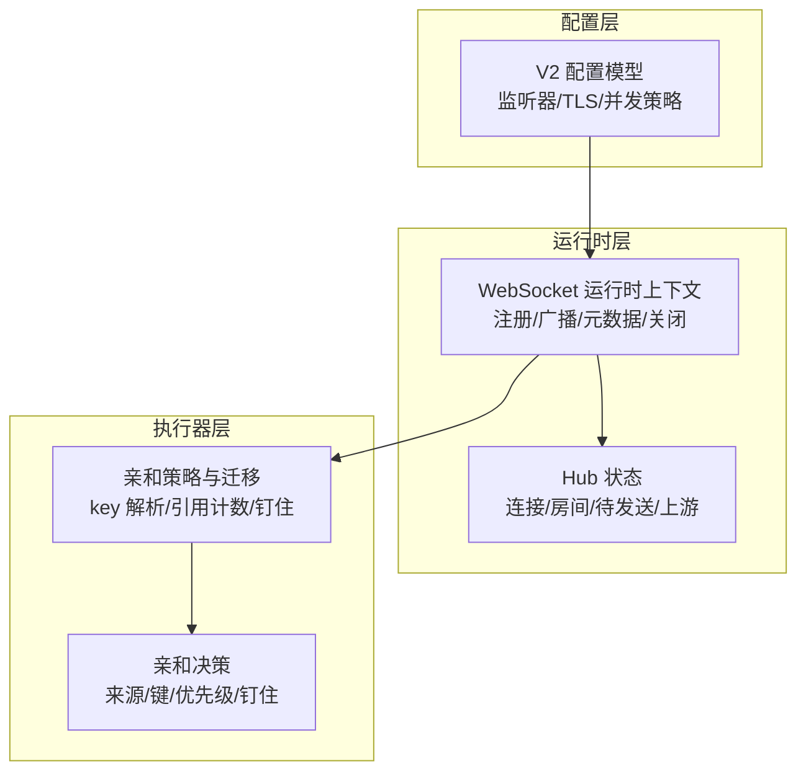
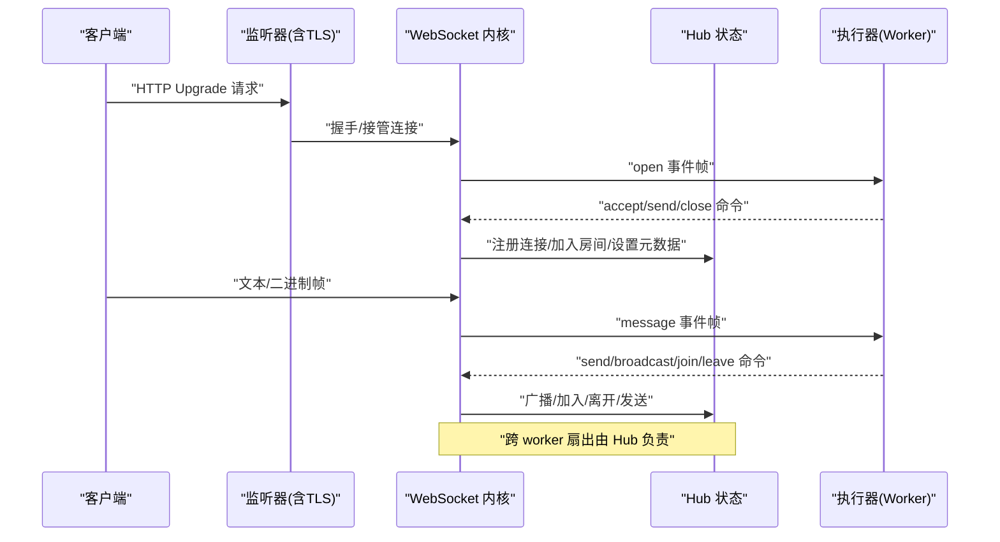
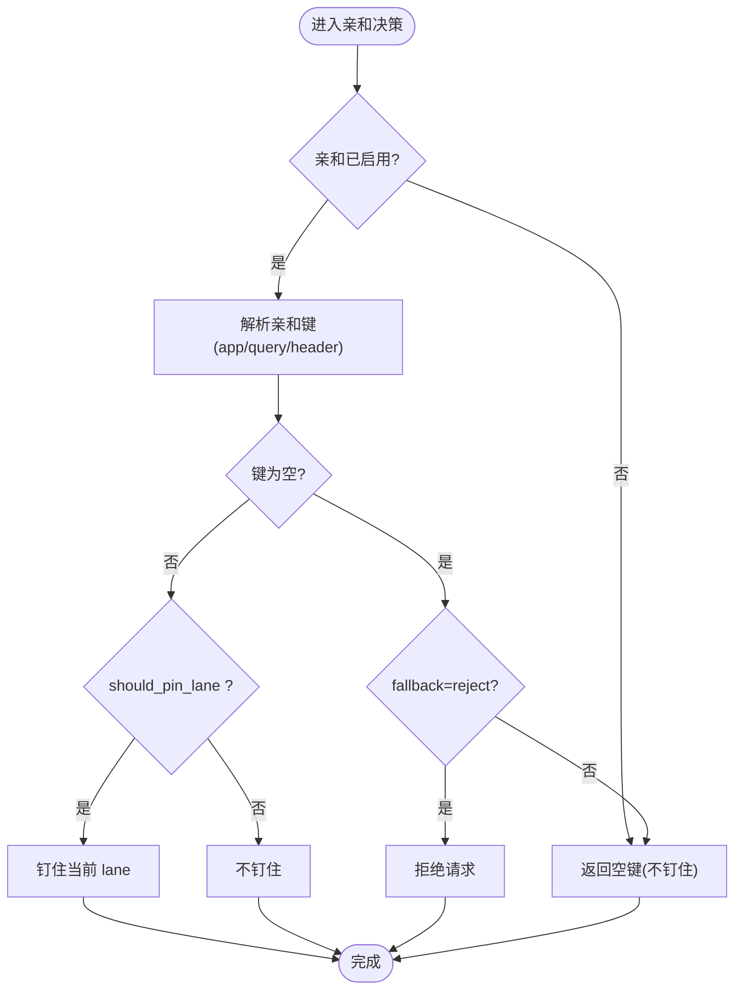
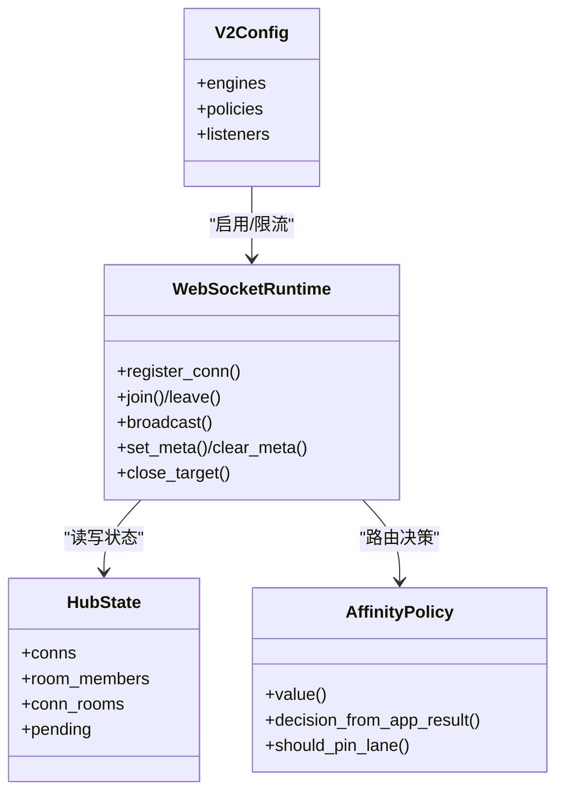

# WebSocket 配置

<cite>
**本文引用的文件**   
- [src/config/v2_config.v](file://src/config/v2_config.v)
- [src/ws/types.v](file://src/ws/types.v)
- [src/websocket_runtime.v](file://src/websocket_runtime.v)
- [src/executor/inproc_vjsx_websocket_affinity_state.v](file://src/executor/inproc_vjsx_websocket_affinity_state.v)
- [src/executor/inproc_vjsx_websocket_policy.v](file://src/executor/inproc_vjsx_websocket_policy.v)
- [src/executor/inproc_vjsx_websocket_lane_query_runtime.v](file://src/executor/inproc_vjsx_websocket_lane_query_runtime.v)
- [examples/config/websocket-echo.toml](file://examples/config/websocket-echo.toml)
- [config/vhttpd.example.toml](file://config/vhttpd.example.toml)
- [docs/WEBSOCKET_MVP_PLAN.md](file://docs/WEBSOCKET_MVP_PLAN.md)
- [docs/WEBSOCKET_EVENT_BUS_PLAN.md](file://docs/WEBSOCKET_EVENT_BUS_PLAN.md)
- [docs/WEBSOCKET_MESSAGE_DISPATCH_PLAN.md](file://docs/WEBSOCKET_MESSAGE_DISPATCH_PLAN.md)
</cite>

## 目录
1. [简介](#简介)
2. [项目结构](#项目结构)
3. [核心组件](#核心组件)
4. [架构总览](#架构总览)
5. [详细组件分析](#详细组件分析)
6. [依赖关系分析](#依赖关系分析)
7. [性能与调优](#性能与调优)
8. [故障排查指南](#故障排查指南)
9. [结论](#结论)
10. [附录：配置示例与监控指标](#附录配置示例与监控指标)

## 简介
本文件面向 vhttpd 的 WebSocket 能力，聚焦“可配置”的维度，覆盖连接管理、房间系统、消息处理、会话亲和性、安全、性能调优以及监控指标。文档以仓库中的实现与计划为依据，给出可直接落地的配置项说明、行为约定与最佳实践，帮助读者在不深入源码的情况下完成生产级部署与优化。

## 项目结构
WebSocket 相关能力在 vhttpd 中由“运行时上下文 + Hub 状态 + 执行器亲和策略 + 配置模型”共同构成：
- 配置模型：V2 配置定义了监听器、TLS、并发策略等通用能力；WebSocket 通过引擎开关与并发策略进行启用与约束。
- 运行时上下文：封装了注册连接、加入/离开房间、广播、元数据读写、关闭目标等能力。
- Hub 状态：维护连接、房间成员、待发送队列、上游快照等。
- 执行器亲和策略：决定请求路由到哪个 lane（线程/进程槽位），支持从应用或查询参数解析亲和键。

图表来源
- [src/config/v2_config.v:120-155](file://src/config/v2_config.v#L120-L155)
- [src/websocket_runtime.v:26-94](file://src/websocket_runtime.v#L26-L94)
- [src/ws/types.v:361-377](file://src/ws/types.v#L361-L377)
- [src/executor/inproc_vjsx_websocket_affinity_state.v:76-123](file://src/executor/inproc_vjsx_websocket_affinity_state.v#L76-L123)
- [src/executor/inproc_vjsx_websocket_policy.v:51-111](file://src/executor/inproc_vjsx_websocket_policy.v#L51-L111)

章节来源
- [src/config/v2_config.v:120-155](file://src/config/v2_config.v#L120-L155)
- [src/websocket_runtime.v:26-94](file://src/websocket_runtime.v#L26-L94)
- [src/ws/types.v:361-377](file://src/ws/types.v#L361-L377)
- [src/executor/inproc_vjsx_websocket_affinity_state.v:76-123](file://src/executor/inproc_vjsx_websocket_affinity_state.v#L76-L123)
- [src/executor/inproc_vjsx_websocket_policy.v:51-111](file://src/executor/inproc_vjsx_websocket_policy.v#L51-L111)

## 核心组件
- 运行时上下文（RuntimeContext）
  - 提供注册连接、打开/关闭生命周期、加入/离开房间、设置/清除元数据、广播、向指定连接发送、构建帧并派发事件等函数指针。
- Hub 状态（HubState）
  - 维护连接表、房间成员映射、连接房间集合、连接元数据、待发送队列、分发模式开关、最近分发限制、动态上游自动启动、活动记录等。
- 亲和策略（Affinity Policy）
  - 支持从应用回调或查询参数解析亲和键，支持优先级与是否钉住 lane 的策略，并在连接迁移时更新引用计数与映射。
- 配置模型（V2Config）
  - 通过 engines.websocket_dispatch、policies.concurrency.* 等字段控制 WebSocket 分发与并发限流、队列、超时、亲和与 Actor 行为。

章节来源
- [src/websocket_runtime.v:26-94](file://src/websocket_runtime.v#L26-L94)
- [src/ws/types.v:361-377](file://src/ws/types.v#L361-L377)
- [src/executor/inproc_vjsx_websocket_policy.v:51-111](file://src/executor/inproc_vjsx_websocket_policy.v#L51-L111)
- [src/config/v2_config.v:120-155](file://src/config/v2_config.v#L120-L155)

## 架构总览
vhttpd 作为本地 WebSocket Hub，负责连接生命周期与房间扇出；PHP/JS 执行器仅处理业务逻辑并返回命令列表。当前默认是“连接托管模式”，未来演进为“消息分发模式”。

图表来源
- [docs/WEBSOCKET_MVP_PLAN.md:123-224](file://docs/WEBSOCKET_MVP_PLAN.md#L123-L224)
- [docs/WEBSOCKET_EVENT_BUS_PLAN.md:205-270](file://docs/WEBSOCKET_EVENT_BUS_PLAN.md#L205-L270)
- [src/websocket_runtime.v:26-94](file://src/websocket_runtime.v#L26-L94)
- [src/ws/types.v:361-377](file://src/ws/types.v#L361-L377)

## 详细组件分析

### 连接管理与超时
- 最大连接数
  - 未在 V2 配置中暴露全局上限字段；可通过并发策略的 in-flight/队列容量间接限制瞬时压力。
- 连接超时
  - 读取超时通过引擎/worker 的 read_timeout_ms 控制；WebSocket 升级后由 net.websocket 内部 ping/pong 与 close 生命周期驱动。
- 心跳检测间隔
  - 复用底层 net.websocket 的心跳机制；上层未暴露独立配置项。

建议
- 使用 policies.limits.timeout_ms 与 engines.read_timeout_ms 组合保护长连接。
- 结合 observability.event_log 观察连接建立/关闭事件。

章节来源
- [src/config/v2_config.v:120-155](file://src/config/v2_config.v#L120-L155)
- [src/config/v2_config.v:217-222](file://src/config/v2_config.v#L217-L222)
- [docs/WEBSOCKET_MVP_PLAN.md:36-48](file://docs/WEBSOCKET_MVP_PLAN.md#L36-L48)

### 房间系统与广播
- 房间创建策略
  - 隐式创建：首次 join 即存在；未知房间广播无操作。
- 成员管理
  - HubState 维护 room_members 与 conn_rooms 双向映射；支持 set_meta/clear_meta。
- 广播机制
  - 支持按房间广播并可排除特定连接；跨 worker 扇出由 Hub 统一处理。

章节来源
- [src/ws/types.v:361-377](file://src/ws/types.v#L361-L377)
- [docs/WEBSOCKET_EVENT_BUS_PLAN.md:205-270](file://docs/WEBSOCKET_EVENT_BUS_PLAN.md#L205-L270)

### 消息处理配置（帧格式、opcode、二进制）
- 帧格式
  - vhttpd -> worker：open/message/close 事件帧；worker -> vhttpd：accept/send/close/error 命令帧。
- opcode 类型
  - 支持 text 与 binary；binary 采用 base64 编码传输。
- 二进制支持
  - 测试用例验证 text/binary 支持，拒绝控制帧（如 ping/pong）。

章节来源
- [docs/WEBSOCKET_MVP_PLAN.md:149-224](file://docs/WEBSOCKET_MVP_PLAN.md#L149-L224)
- [src/websocket_binary_support_test.v:1-62](file://src/websocket_binary_support_test.v#L1-L62)

### 会话亲和性与路由
- 亲和键来源
  - 支持 app 回调或 query/header 解析；支持优先级字符串/数字。
- 路由与钉住
  - 根据 should_pin_lane 决定是否将 key 钉在当前 lane；迁移时维护引用计数与映射。
- 缺失键处理
  - 当 enabled 且 fallback=reject 时，缺失亲和键直接拒绝。

图表来源
- [src/executor/inproc_vjsx_websocket_policy.v:51-111](file://src/executor/inproc_vjsx_websocket_policy.v#L51-L111)
- [src/executor/inproc_vjsx_websocket_affinity_state.v:76-123](file://src/executor/inproc_vjsx_websocket_affinity_state.v#L76-L123)
- [src/executor/inproc_vjsx_websocket_lane_query_runtime.v:44-75](file://src/executor/inproc_vjsx_websocket_lane_query_runtime.v#L44-L75)

章节来源
- [src/executor/inproc_vjsx_websocket_policy.v:51-111](file://src/executor/inproc_vjsx_websocket_policy.v#L51-L111)
- [src/executor/inproc_vjsx_websocket_affinity_state.v:76-123](file://src/executor/inproc_vjsx_websocket_affinity_state.v#L76-L123)
- [src/executor/inproc_vjsx_websocket_lane_query_runtime.v:44-75](file://src/executor/inproc_vjsx_websocket_lane_query_runtime.v#L44-L75)

### 安全配置（认证、ACL、TLS）
- TLS
  - 监听器级别支持 TLS 证书与多证书 SNI；可在 listeners.*.tls 下配置。
- 访问控制
  - 安全策略支持 required_headers、denied_query_patterns、allowed_origins。
- 身份认证
  - 认证逻辑由应用侧实现；vhttpd 提供框架能力（如 allowed_origins、required_headers）辅助鉴权前置校验。

章节来源
- [src/config/v2_config.v:28-50](file://src/config/v2_config.v#L28-L50)
- [src/config/v2_config.v:224-229](file://src/config/v2_config.v#L224-L229)

### 性能调优参数
- 连接池大小
  - engines.pool_size 控制执行器实例数量；WebSocket 模式下建议按消息吞吐而非连接数估算。
- 内存限制
  - 未暴露显式内存上限；可通过 max_body_bytes、queue_capacity 控制单请求与队列规模。
- 网络缓冲区
  - 未暴露独立缓冲配置；受限于操作系统与底层 net.websocket 实现。
- 并发与队列
  - policies.concurrency.max_in_flight、queue_capacity、queue_timeout_ms、max_queue_per_key 用于背压与限流。
- 超时与重启
  - engines.read_timeout_ms、restart_backoff_ms/max_requests 等影响稳定性与资源回收。

章节来源
- [src/config/v2_config.v:120-155](file://src/config/v2_config.v#L120-L155)
- [src/config/v2_config.v:217-222](file://src/config/v2_config.v#L217-L222)
- [src/config/v2_config.v:243-259](file://src/config/v2_config.v#L243-L259)

## 依赖关系分析
- 配置到运行时
  - V2 配置中的 engines.websocket_dispatch 与 policies.concurrency.* 被运行时上下文与执行器加载，驱动 WebSocket 分发与限流。
- 运行时到 Hub
  - RuntimeContext 调用 HubState 方法完成注册、房间、广播、元数据等操作。
- 执行器到亲和策略
  - 执行器在分发前解析亲和键，必要时迁移连接到目标 lane，并维护引用计数。

图表来源
- [src/config/v2_config.v:120-155](file://src/config/v2_config.v#L120-L155)
- [src/websocket_runtime.v:26-94](file://src/websocket_runtime.v#L26-L94)
- [src/ws/types.v:361-377](file://src/ws/types.v#L361-L377)
- [src/executor/inproc_vjsx_websocket_policy.v:51-111](file://src/executor/inproc_vjsx_websocket_policy.v#L51-L111)

章节来源
- [src/config/v2_config.v:120-155](file://src/config/v2_config.v#L120-L155)
- [src/websocket_runtime.v:26-94](file://src/websocket_runtime.v#L26-L94)
- [src/ws/types.v:361-377](file://src/ws/types.v#L361-L377)
- [src/executor/inproc_vjsx_websocket_policy.v:51-111](file://src/executor/inproc_vjsx_websocket_policy.v#L51-L111)

## 性能与调优
- 连接托管 vs 消息分发
  - 当前默认“连接托管模式”：每个连接绑定一个 worker；未来“消息分发模式”可将连接与 worker 解耦，提升吞吐。
- 关键参数
  - engines.pool_size、policies.concurrency.queue_capacity、queue_timeout_ms、max_queue_per_key、read_timeout_ms。
- 建议
  - 以消息吞吐为目标评估 pool_size；对热点房间使用亲和键减少跨 lane 开销；开启 event_log 观测广播延迟与失败率。

章节来源
- [docs/WEBSOCKET_MESSAGE_DISPATCH_PLAN.md:359-412](file://docs/WEBSOCKET_MESSAGE_DISPATCH_PLAN.md#L359-L412)
- [src/config/v2_config.v:243-259](file://src/config/v2_config.v#L243-L259)

## 故障排查指南
- 常见问题
  - 亲和键缺失导致拒绝：检查 enabled/fallback 与 key 来源（app/query/header）。
  - 广播无效：确认房间是否存在、目标连接是否在线。
  - 二进制异常：确保 opcode 为 'binary' 且 payload 为 base64。
- 定位手段
  - 使用 observability.event_log 查看 open/message/close 事件与错误类。
  - 通过 admin 接口或内置快照查看活跃连接、房间成员与元数据。

章节来源
- [src/executor/inproc_vjsx_websocket_policy.v:51-111](file://src/executor/inproc_vjsx_websocket_policy.v#L51-L111)
- [src/ws/types.v:361-377](file://src/ws/types.v#L361-L377)
- [docs/WEBSOCKET_MVP_PLAN.md:123-224](file://docs/WEBSOCKET_MVP_PLAN.md#L123-L224)

## 结论
vhttpd 的 WebSocket 能力以“连接托管模式”为基础，逐步向“消息分发模式”演进。通过 V2 配置模型、Hub 状态与亲和策略，可实现跨 worker 的房间广播、稳定的路由与可扩展的吞吐。生产环境应结合并发策略、队列与超时参数进行调优，并通过事件日志与快照进行观测与排障。

## 附录：配置示例与监控指标

### 最小可用示例（WebSocket Echo）
- 监听器与文件
  - server.host/port、files.pid_file/event_log
- Worker 与执行器
  - worker.autostart/read_timeout_ms/socket/cmd、executor.kind、php.worker_entry/app_entry
- 静态资源与管理员
  - assets.enabled/prefix/root/cache_control、admin.host/port/token

参考路径
- [examples/config/websocket-echo.toml:1-28](file://examples/config/websocket-echo.toml#L1-L28)
- [config/vhttpd.example.toml:1-67](file://config/vhttpd.example.toml#L1-L67)

### 关键配置项速查
- 引擎与分发
  - engines[*].websocket_dispatch：启用 WebSocket 分发
  - engines[*].pool_size：执行器实例数
  - engines[*].read_timeout_ms：读取超时
- 并发与限流
  - policies.concurrency[*].max_in_flight
  - policies.concurrency[*].queue_capacity
  - policies.concurrency[*].queue_timeout_ms
  - policies.concurrency[*].max_queue_per_key
- 安全
  - listeners[*].tls.enabled/cert/cert_key/certificates
  - policies.security[*].required_headers/denied_query_patterns/allowed_origins

参考路径
- [src/config/v2_config.v:120-155](file://src/config/v2_config.v#L120-L155)
- [src/config/v2_config.v:217-222](file://src/config/v2_config.v#L217-L222)
- [src/config/v2_config.v:224-229](file://src/config/v2_config.v#L224-L229)
- [src/config/v2_config.v:28-50](file://src/config/v2_config.v#L28-L50)

### 监控指标收集方法
- 事件日志
  - observability.event_log：记录 open/message/close、错误类、trace_id 等，便于离线分析与告警。
- 运行时快照
  - 通过 ws.RuntimeSnapshot/ConnSnapshot/RoomSnapshot 获取活跃连接、房间成员与元数据。
- 上游活动
  - UpstreamActivitySnapshot 记录事件处理链路、worker 处理结果与错误类。

参考路径
- [src/config/v2_config.v:59-72](file://src/config/v2_config.v#L59-L72)
- [src/ws/types.v:166-196](file://src/ws/types.v#L166-L196)
- [src/ws/types.v:311-337](file://src/ws/types.v#L311-L337)