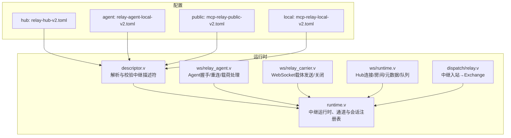
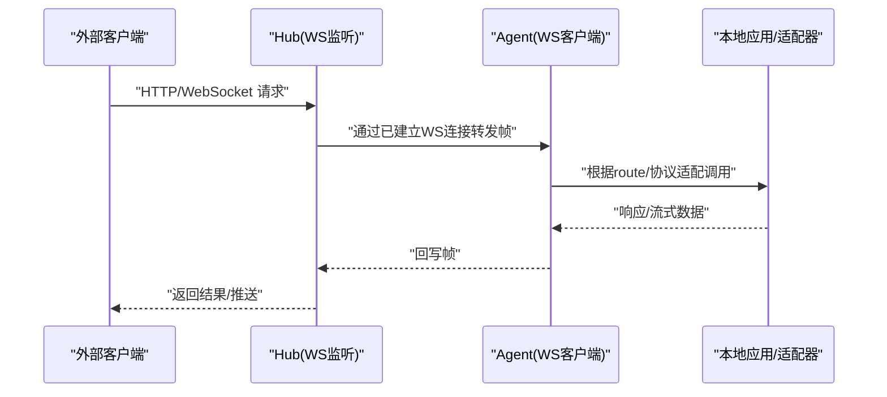
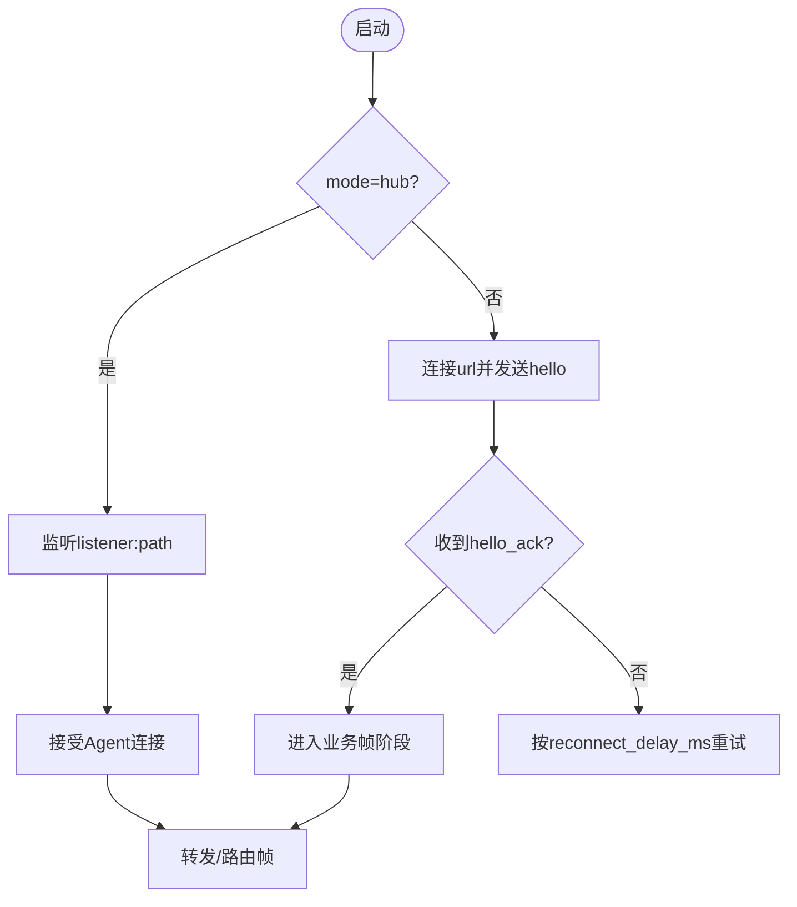
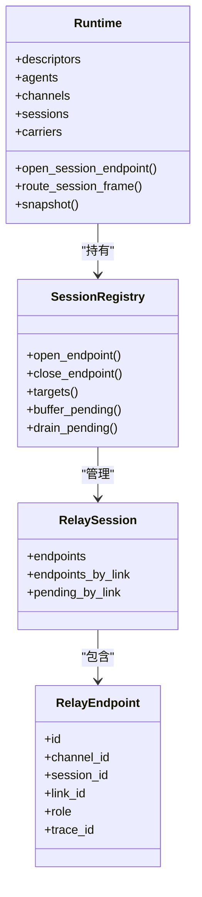
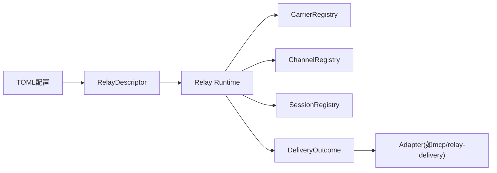

# 中继服务配置

<cite>
**本文引用的文件**
- [examples/config/relay-hub-v2.toml](file://examples/config/relay-hub-v2.toml)
- [examples/config/relay-agent-local-v2.toml](file://examples/config/relay-agent-local-v2.toml)
- [examples/config/mcp-relay-public-v2.toml](file://examples/config/mcp-relay-public-v2.toml)
- [examples/config/mcp-relay-local-v2.toml](file://examples/config/mcp-relay-local-v2.toml)
- [src/relay/descriptor.v](file://src/relay/descriptor.v)
- [src/relay/runtime.v](file://src/relay/runtime.v)
- [src/ws/relay_agent.v](file://src/ws/relay_agent.v)
- [src/ws/relay_carrier.v](file://src/ws/relay_carrier.v)
- [src/ws/runtime.v](file://src/ws/runtime.v)
- [src/dispatch/relay.v](file://src/dispatch/relay.v)
- [tests/e2e/config_acceptance_test.sh](file://tests/e2e/config_acceptance_test.sh)
</cite>

## 目录
1. [简介](#简介)
2. [项目结构](#项目结构)
3. [核心组件](#核心组件)
4. [架构总览](#架构总览)
5. [详细组件分析](#详细组件分析)
6. [依赖关系分析](#依赖关系分析)
7. [性能与容量规划](#性能与容量规划)
8. [故障排查指南](#故障排查指南)
9. [结论](#结论)
10. [附录：完整配置示例与高可用部署](#附录完整配置示例与高可用部署)

## 简介
本文件面向“中继服务（Relay Service）”的配置与部署，覆盖以下主题：
- 中继节点配置：节点发现、集群通信、状态同步
- 会话管理配置：会话生命周期、状态持久化、故障恢复
- 负载均衡配置：请求分发、健康检查、故障转移
- 协议转换配置：协议适配、数据映射、格式转换
- 安全配置选项：认证授权、加密传输、访问控制
- 扩展性配置：水平扩展、插件机制、动态加载
- 完整配置示例与高可用部署架构说明

## 项目结构
仓库中与中继相关的配置与实现主要分布在如下位置：
- 示例配置：examples/config 下的 relay-* 与 mcp-relay-* 配置文件
- 运行时与描述符：src/relay 下的 descriptor、runtime、session、carrier_runtime 等
- WebSocket 载体与代理：src/ws 下的 relay_agent、relay_carrier、runtime 等
- 调度入口：src/dispatch/relay.v 将中继帧转换为内部交换对象

图表来源
- [examples/config/relay-hub-v2.toml:1-25](file://examples/config/relay-hub-v2.toml#L1-L25)
- [examples/config/relay-agent-local-v2.toml:1-29](file://examples/config/relay-agent-local-v2.toml#L1-L29)
- [examples/config/mcp-relay-public-v2.toml:1-46](file://examples/config/mcp-relay-public-v2.toml#L1-L46)
- [examples/config/mcp-relay-local-v2.toml:1-36](file://examples/config/mcp-relay-local-v2.toml#L1-L36)
- [src/relay/descriptor.v:1-126](file://src/relay/descriptor.v#L1-L126)
- [src/relay/runtime.v:1-187](file://src/relay/runtime.v#L1-L187)
- [src/ws/relay_agent.v:1-187](file://src/ws/relay_agent.v#L1-L187)
- [src/ws/relay_carrier.v:1-70](file://src/ws/relay_carrier.v#L1-L70)
- [src/ws/runtime.v:1-343](file://src/ws/runtime.v#L1-L343)
- [src/dispatch/relay.v:1-60](file://src/dispatch/relay.v#L1-L60)

章节来源
- [examples/config/relay-hub-v2.toml:1-25](file://examples/config/relay-hub-v2.toml#L1-L25)
- [examples/config/relay-agent-local-v2.toml:1-29](file://examples/config/relay-agent-local-v2.toml#L1-L29)
- [examples/config/mcp-relay-public-v2.toml:1-46](file://examples/config/mcp-relay-public-v2.toml#L1-L46)
- [examples/config/mcp-relay-local-v2.toml:1-36](file://examples/config/mcp-relay-local-v2.toml#L1-L36)
- [src/relay/descriptor.v:1-126](file://src/relay/descriptor.v#L1-L126)
- [src/relay/runtime.v:1-187](file://src/relay/runtime.v#L1-L187)
- [src/ws/relay_agent.v:1-187](file://src/ws/relay_agent.v#L1-L187)
- [src/ws/relay_carrier.v:1-70](file://src/ws/relay_carrier.v#L1-L70)
- [src/ws/runtime.v:1-343](file://src/ws/runtime.v#L1-L343)
- [src/dispatch/relay.v:1-60](file://src/dispatch/relay.v#L1-L60)

## 核心组件
- 中继描述符（Descriptor）：从配置中解析出中继模式（hub/agent）、载体（websocket）、监听器或远端URL、路径、节点ID、令牌、并发与缓冲限制等。包含严格的参数校验。
- 中继运行时（Runtime）：维护 Agent 状态机、通道注册表、会话注册表、载体注册表；提供帧转发、会话路由、载体附加/分离、快照导出等能力。
- Agent 代理（ws/relay_agent）：负责向 Hub 发起握手、处理握手应答、错误帧、以及后续业务帧的收发；封装重连策略与事件字段。
- 载体（ws/relay_carrier）：基于 WebSocket 的载体实现，负责编码/解码帧、发送、关闭通道与连接。
- Hub 运行时（ws/runtime）：管理连接、房间、元数据、消息队列与清理流程。
- 调度入口（dispatch/relay）：将中继入站帧转换为内部 Exchange，注入协议与中继上下文元数据。

章节来源
- [src/relay/descriptor.v:1-126](file://src/relay/descriptor.v#L1-L126)
- [src/relay/runtime.v:1-187](file://src/relay/runtime.v#L1-L187)
- [src/ws/relay_agent.v:1-187](file://src/ws/relay_agent.v#L1-L187)
- [src/ws/relay_carrier.v:1-70](file://src/ws/relay_carrier.v#L1-L70)
- [src/ws/runtime.v:1-343](file://src/ws/runtime.v#L1-L343)
- [src/dispatch/relay.v:1-60](file://src/dispatch/relay.v#L1-L60)

## 架构总览
中继服务采用 Hub-Agent 拓扑：
- Hub（中心）：暴露 WebSocket 监听器，接收来自多个 Agent 的连接，进行帧转发与会话路由。
- Agent（边缘）：以客户端方式连接 Hub，承载本地应用（如 MCP 适配器），将本地请求经 Hub 转发至目标 Agent。

图表来源
- [examples/config/relay-hub-v2.toml:10-25](file://examples/config/relay-hub-v2.toml#L10-L25)
- [examples/config/relay-agent-local-v2.toml:10-29](file://examples/config/relay-agent-local-v2.toml#L10-L29)
- [src/ws/relay_agent.v:70-130](file://src/ws/relay_agent.v#L70-L130)
- [src/ws/relay_carrier.v:27-49](file://src/ws/relay_carrier.v#L27-L49)
- [src/dispatch/relay.v:24-59](file://src/dispatch/relay.v#L24-L59)

## 详细组件分析

### 中继节点配置（Hub/Agent）
- 模式与载体
  - mode：hub 或 agent（支持 server/client 别名）
  - carrier：当前仅支持 websocket
- Hub 必需项
  - listener：引用一个已定义的监听器资源
  - path：匹配的路径（默认 /vhttpd/relay）
- Agent 必需项
  - url：Hub 的 ws/wss 地址
  - node_id：节点标识（未显式设置时回退到 relays.<id>）
- 通用参数
  - token：用于握手鉴权
  - max_channels：最大并发通道数
  - channel_buffer：单通道缓冲上限
  - reconnect_delay_ms：初始重连延迟（指数退避由策略计算）

章节来源
- [src/relay/descriptor.v:27-90](file://src/relay/descriptor.v#L27-L90)
- [examples/config/relay-hub-v2.toml:16-25](file://examples/config/relay-hub-v2.toml#L16-L25)
- [examples/config/relay-agent-local-v2.toml:10-18](file://examples/config/relay-agent-local-v2.toml#L10-L18)

### 节点发现与集群通信
- 节点发现
  - Hub 侧通过监听器与 path 匹配接入；Agent 侧通过 url 直连。
  - 支持多 relays 定义，按 id 区分不同集群/租户。
- 集群通信
  - 基于 WebSocket 文本帧承载 WireFrame；Agent 先发送 hello 完成握手，随后进入业务帧阶段。
  - Hub 维护连接、房间与会话，Agent 通过载体发送/关闭通道。

图表来源
- [src/ws/relay_agent.v:70-130](file://src/ws/relay_agent.v#L70-L130)
- [src/ws/relay_carrier.v:27-49](file://src/ws/relay_carrier.v#L27-L49)
- [src/ws/runtime.v:24-101](file://src/ws/runtime.v#L24-L101)

章节来源
- [src/ws/relay_agent.v:70-130](file://src/ws/relay_agent.v#L70-L130)
- [src/ws/runtime.v:24-101](file://src/ws/runtime.v#L24-L101)

### 状态同步与会话管理
- 会话模型
  - SessionRegistry 维护 session_id → endpoints 映射，支持 link_id 聚合与角色过滤。
  - 支持 pending 缓冲与限流，避免背压导致内存膨胀。
- 生命周期
  - open_endpoint/close_endpoint 增删端点；当无端点且无待处理帧时自动清理会话。
- 路由
  - route_session_frame 根据 link_id 与 role 选择目标端点，支持广播/定向。

图表来源
- [src/relay/runtime.v:6-41](file://src/relay/runtime.v#L6-L41)
- [src/relay/session.v:3-142](file://src/relay/session.v#L3-L142)

章节来源
- [src/relay/runtime.v:112-127](file://src/relay/runtime.v#L112-L127)
- [src/relay/session.v:33-123](file://src/relay/session.v#L33-L123)

### 会话持久化与故障恢复
- 持久化
  - 当前实现以进程内内存为主（SessionRegistry、ChannelRegistry、CarrierRegistry）。
  - 可通过 snapshot 导出运行时快照用于观测与诊断。
- 故障恢复
  - Agent 具备重连策略：mark_failed 后依据 reconnect_policy_from_descriptor 计算下次尝试时间。
  - Hub 侧对连接断开进行清理与元数据回收。

章节来源
- [src/relay/runtime.v:72-98](file://src/relay/runtime.v#L72-L98)
- [src/ws/runtime.v:244-257](file://src/ws/runtime.v#L244-L257)
- [src/relay/runtime.v:169-178](file://src/relay/runtime.v#L169-L178)

### 负载均衡配置
- 请求分发
  - 通过 pipelines 将 HTTP 请求路由到 relay-delivery 适配器，再由其写入对应 relay 的载体。
  - 可结合 match.methods/match.paths 做细粒度分流。
- 健康检查
  - 可在 Agent 侧暴露固定健康接口（fixed-response），供上游探测。
- 故障转移
  - 若某 Agent 不可用，上层可切换至其他 Agent 实例（多 relays 定义+不同 url）。

章节来源
- [examples/config/mcp-relay-public-v2.toml:32-46](file://examples/config/mcp-relay-public-v2.toml#L32-L46)
- [examples/config/relay-agent-local-v2.toml:20-29](file://examples/config/relay-agent-local-v2.toml#L20-L29)
- [tests/e2e/config_acceptance_test.sh:688-693](file://tests/e2e/config_acceptance_test.sh#L688-L693)

### 协议转换配置
- 协议适配
  - 使用 adapters.mcp 将中继帧转换为 MCP 协议，交由指定 engine 执行。
- 数据映射
  - dispatch/relay 将中继帧转为 Exchange，注入 protocol=relay 及中继上下文元数据。
- 格式转换
  - 载体层统一使用文本帧承载 WireFrame；二进制场景由上层应用自行编解码。

章节来源
- [examples/config/mcp-relay-local-v2.toml:28-36](file://examples/config/mcp-relay-local-v2.toml#L28-L36)
- [src/dispatch/relay.v:24-59](file://src/dispatch/relay.v#L24-L59)

### 安全配置选项
- 认证授权
  - token：在握手阶段用于鉴权，需确保 Hub 与 Agent 一致。
  - auth：描述符支持可选的 auth 资源引用（可用于扩展鉴权逻辑）。
- 加密传输
  - 建议 Agent 使用 wss:// 连接 Hub，启用 TLS。
- 访问控制
  - 通过 listeners.relay.path 限定接入路径；结合上游网关/反向代理做 IP 白名单与速率限制。

章节来源
- [src/relay/descriptor.v:10-47](file://src/relay/descriptor.v#L10-L47)
- [examples/config/relay-agent-local-v2.toml:13-15](file://examples/config/relay-agent-local-v2.toml#L13-L15)
- [examples/config/relay-hub-v2.toml:16-22](file://examples/config/relay-hub-v2.toml#L16-L22)

### 扩展性配置
- 水平扩展
  - 多 Agent 实例指向同一 Hub，按业务域拆分 relays.id 与 path/url。
- 插件机制
  - 通过 adapters.* 组合不同引擎（如 mcp、php-worker），复用 pipeline 编排。
- 动态加载
  - 运行时通过 descriptors_from_plan 动态构建中继描述符集合，支持热更新（配合配置重载机制）。

章节来源
- [examples/config/mcp-relay-local-v2.toml:10-17](file://examples/config/mcp-relay-local-v2.toml#L10-L17)
- [src/relay/descriptor.v:49-57](file://src/relay/descriptor.v#L49-L57)

## 依赖关系分析
- 配置到运行时
  - TOML 中的 relays.* 被解析为 RelayDescriptor，再构建 Runtime。
- 运行时到载体
  - Runtime 通过 CarrierRegistry 绑定具体载体（WebSocket），完成帧发送/关闭。
- 运行时到调度
  - 入站帧经 receive_from_carrier → handle_inbound_frame → route_session_frame，最终产出 DeliveryOutcome 并由适配器投递。

图表来源
- [src/relay/descriptor.v:49-57](file://src/relay/descriptor.v#L49-L57)
- [src/relay/runtime.v:121-135](file://src/relay/runtime.v#L121-L135)
- [src/dispatch/relay.v:24-59](file://src/dispatch/relay.v#L24-L59)

章节来源
- [src/relay/descriptor.v:49-57](file://src/relay/descriptor.v#L49-L57)
- [src/relay/runtime.v:121-135](file://src/relay/runtime.v#L121-L135)
- [src/dispatch/relay.v:24-59](file://src/dispatch/relay.v#L24-L59)

## 性能与容量规划
- 关键参数
  - max_channels：决定 Hub 可同时维护的通道数量，影响内存占用与调度开销。
  - channel_buffer：单通道缓冲上限，过大易造成背压放大。
  - reconnect_delay_ms：初始重连延迟，结合退避策略避免雪崩。
- 建议
  - 根据峰值 QPS 与平均消息大小估算 max_channels 与 buffer。
  - 在 Agent 侧开启 autostart 并合理设置重连延迟，提升可用性。
  - 使用 wss 并在反向代理层启用连接复用与超时保护。

章节来源
- [src/relay/descriptor.v:40-43](file://src/relay/descriptor.v#L40-L43)
- [examples/config/relay-agent-local-v2.toml:16-18](file://examples/config/relay-agent-local-v2.toml#L16-L18)

## 故障排查指南
- 常见问题
  - 握手失败：检查 token 是否一致、url/path 是否正确、TLS 证书是否有效。
  - 频繁重连：观察 reconnect_delay_ms 与网络抖动，必要时调整退避策略。
  - 通道堆积：降低 channel_buffer 或扩容 max_channels，定位慢消费者。
- 观测手段
  - 使用 observability.event_log 输出事件日志，结合 snapshot 查看运行时状态。
  - 在 Agent 侧暴露 /health 固定响应，便于探针探测。

章节来源
- [examples/config/relay-hub-v2.toml:7-8](file://examples/config/relay-hub-v2.toml#L7-L8)
- [examples/config/relay-agent-local-v2.toml:20-29](file://examples/config/relay-agent-local-v2.toml#L20-L29)
- [src/relay/runtime.v:169-178](file://src/relay/runtime.v#L169-L178)

## 结论
中继服务通过 Hub-Agent 拓扑与统一的 WebSocket 载体，实现了跨进程/跨主机的可靠通信与灵活路由。借助描述符驱动的配置模型、会话与通道注册表、以及载体抽象，系统具备良好的可扩展性与可观测性。在生产环境中，建议结合 wss、健康检查与多 Agent 部署，以获得高可用与弹性伸缩能力。

## 附录：完整配置示例与高可用部署

### 示例一：Hub 节点（公开接入）
- 要点
  - 暴露 WS 监听器与可选的 HTTP 监听器
  - relays.edge.mode=hub，绑定 listener 与 path
  - 设置 token、max_channels、channel_buffer
- 参考文件
  - [examples/config/relay-hub-v2.toml](file://examples/config/relay-hub-v2.toml)
  - [examples/config/mcp-relay-public-v2.toml](file://examples/config/mcp-relay-public-v2.toml)

章节来源
- [examples/config/relay-hub-v2.toml:10-25](file://examples/config/relay-hub-v2.toml#L10-L25)
- [examples/config/mcp-relay-public-v2.toml:10-31](file://examples/config/mcp-relay-public-v2.toml#L10-L31)

### 示例二：Agent 节点（本地应用）
- 要点
  - relays.edge.mode=agent，指向 Hub 的 ws/wss 地址
  - 配置 autostart、reconnect_delay_ms、channel_buffer
  - 通过 pipelines 将 relay:edge 流量路由到本地适配器
- 参考文件
  - [examples/config/relay-agent-local-v2.toml](file://examples/config/relay-agent-local-v2.toml)
  - [examples/config/mcp-relay-local-v2.toml](file://examples/config/mcp-relay-local-v2.toml)

章节来源
- [examples/config/relay-agent-local-v2.toml:10-18](file://examples/config/relay-agent-local-v2.toml#L10-L18)
- [examples/config/mcp-relay-local-v2.toml:18-26](file://examples/config/mcp-relay-local-v2.toml#L18-L26)

### 示例三：端到端测试脚本片段
- 用途
  - 自动生成 public/relay 与 agent 配置，验证链路连通与健康检查
- 参考文件
  - [tests/e2e/config_acceptance_test.sh](file://tests/e2e/config_acceptance_test.sh)

章节来源
- [tests/e2e/config_acceptance_test.sh:643-747](file://tests/e2e/config_acceptance_test.sh#L643-L747)

### 高可用部署架构建议
- 拓扑
  - 多 Hub 实例（可置于不同可用区），前端由负载均衡器按地域就近接入
  - 多 Agent 实例按业务域划分，各自连接就近 Hub
- 容灾
  - Agent 侧启用 autostart 与合理的重连退避
  - 使用 wss 保障传输安全，结合反向代理的超时与熔断策略
- 观测
  - 集中采集 observability.event_log，结合 snapshot 监控通道与会话指标

[本节为概念性说明，不直接分析具体文件]