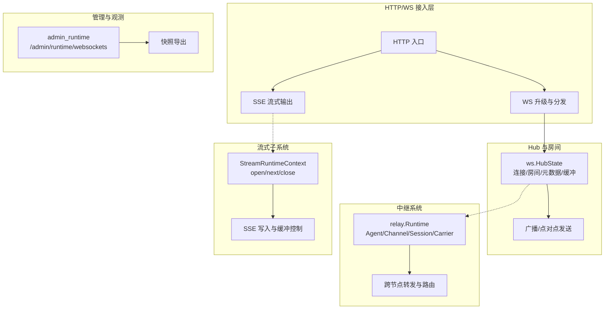
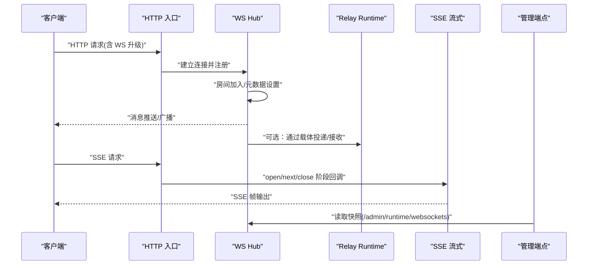
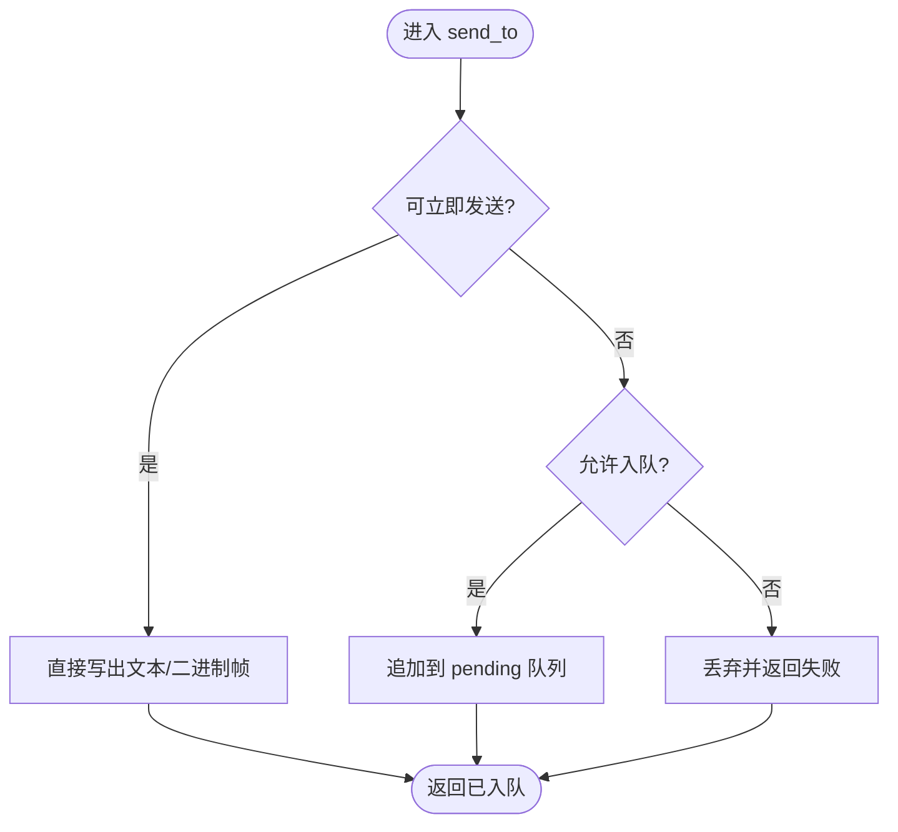
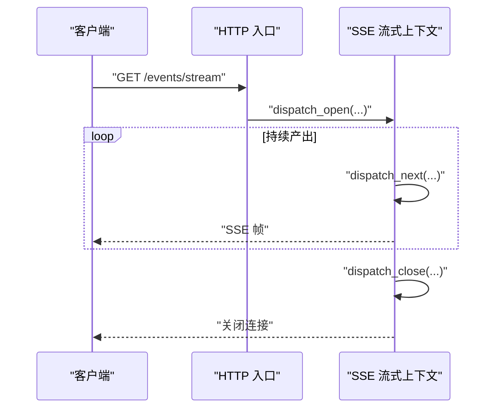
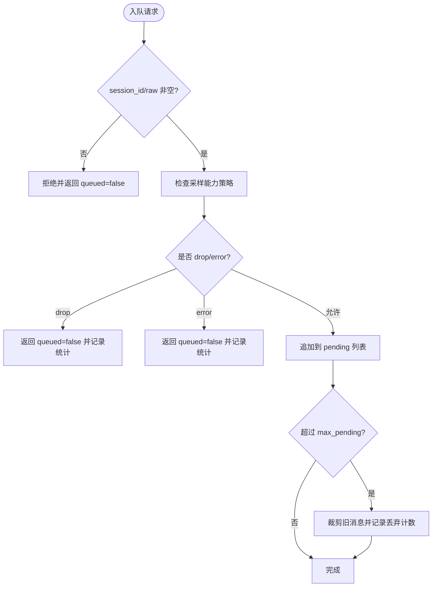
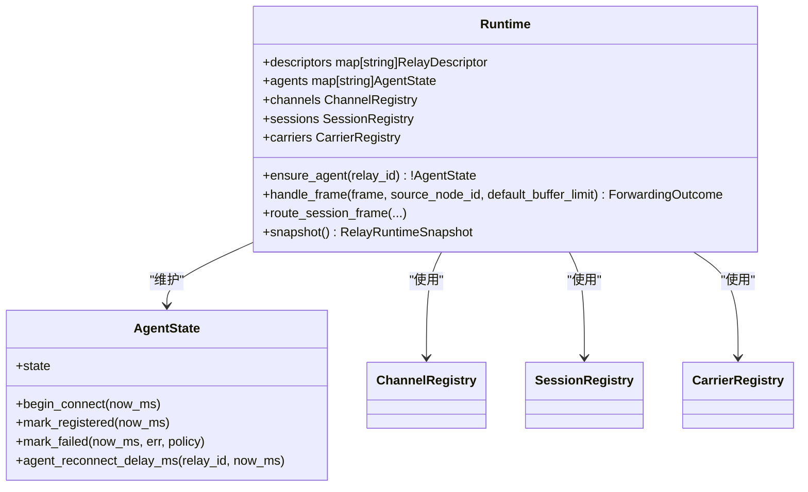
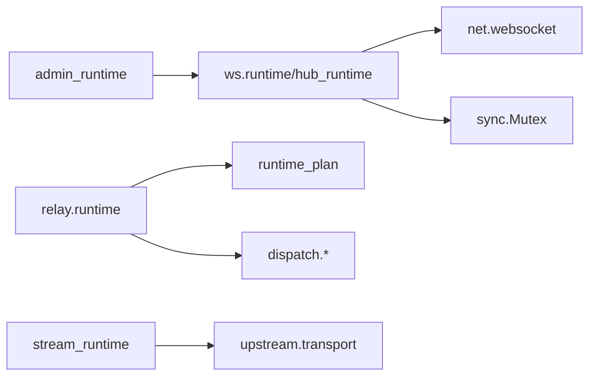

# 实时通信配置

<cite>
**本文引用的文件**   
- [config/vhttpd.example.toml](file://config/vhttpd.example.toml)
- [config/vhttpd.multi.example.toml](file://config/vhttpd.multi.example.toml)
- [config/vhttpd.vjsx.example.toml](file://config/vhttpd.vjsx.example.toml)
- [src/ws/runtime.v](file://src/ws/runtime.v)
- [src/ws/hub_runtime.v](file://src/ws/hub_runtime.v)
- [src/relay/runtime.v](file://src/relay/runtime.v)
- [src/stream_runtime.v](file://src/stream_runtime.v)
- [src/host_builtin_runtime.v](file://src/host_builtin_runtime.v)
- [src/stream_dispatch_runtime.v](file://src/stream_dispatch_runtime.v)
- [src/admin_runtime.v](file://src/admin_runtime.v)
- [src/config/v2_config_test.v](file://src/config/v2_config_test.v)
- [examples/paseo-relay/app.mts](file://examples/paseo-relay/app.mts)
</cite>

## 目录
1. [简介](#简介)
2. [项目结构](#项目结构)
3. [核心组件](#核心组件)
4. [架构总览](#架构总览)
5. [详细组件分析](#详细组件分析)
6. [依赖关系分析](#依赖关系分析)
7. [性能考虑](#性能考虑)
8. [故障排查指南](#故障排查指南)
9. [结论](#结论)
10. [附录：完整配置示例与监控告警](#附录完整配置示例与监控告警)

## 简介
本文件面向部署与运维人员，系统化说明 vhttpd 在“实时通信”方面的配置与实践，覆盖以下能力：
- WebSocket 服务器：连接生命周期、房间管理、广播与分发、连接限制与缓冲策略。
- SSE（Server-Sent Events）：流式输出、断线重连、客户端缓冲控制。
- 消息队列：异步处理、优先级调度、持久化存储（结合现有会话队列与限流）。
- 中继服务：多实例协调、负载均衡、状态同步与回退重试。
- 安全配置：身份验证、访问控制、加密传输。
- 性能优化：连接池、内存使用、网络带宽控制。
- 监控与告警：运行时快照、事件日志、关键指标采集。

## 项目结构
vhttpd 的实时通信相关实现主要分布在如下模块：
- ws 模块：WebSocket Hub 状态、房间与会元数据、发送与关闭、快照导出。
- relay 模块：中继运行时、Agent 状态机、通道与会话路由、载体注册与投递投影。
- stream 模块：SSE 流式上下文与分发钩子。
- host_builtin_runtime：内置 SSE 演示与响应头设置。
- admin_runtime：运行时 WebSockets 快照查询接口。
- config 示例：单站点、多站点与 VJSX 运行时的基础配置。

图示来源
- [src/ws/hub_runtime.v:177-334](file://src/ws/hub_runtime.v#L177-L334)
- [src/relay/runtime.v:100-135](file://src/relay/runtime.v#L100-L135)
- [src/stream_runtime.v:7-28](file://src/stream_runtime.v#L7-L28)
- [src/admin_runtime.v:499-517](file://src/admin_runtime.v#L499-L517)

章节来源
- [src/ws/hub_runtime.v:177-334](file://src/ws/hub_runtime.v#L177-L334)
- [src/relay/runtime.v:100-135](file://src/relay/runtime.v#L100-L135)
- [src/stream_runtime.v:7-28](file://src/stream_runtime.v#L7-L28)
- [src/admin_runtime.v:499-517](file://src/admin_runtime.v#L499-L517)

## 核心组件
- WebSocket Hub 运行时
  - 负责连接注册、房间加入/离开、元数据读写、消息发送与缓冲、批量广播、连接关闭与清理。
  - 提供快照导出用于管理端查看活跃连接与房间成员。
- 中继运行时
  - 维护 Agent 状态机（连接、注册、失败与退避）、通道与会话路由、载体注册与投递投影。
  - 支持按路径匹配 Hub 模式的中继入口。
- 流式运行时（SSE）
  - 提供 open/next/close 三个阶段的分发钩子，配合 HTTP 层进行流式写出与缓冲控制。
- 管理端点
  - 暴露 /admin/runtime/websockets 接口，支持分页与过滤，返回连接与房间快照。

章节来源
- [src/ws/runtime.v:24-343](file://src/ws/runtime.v#L24-L343)
- [src/ws/hub_runtime.v:177-565](file://src/ws/hub_runtime.v#L177-L565)
- [src/relay/runtime.v:1-187](file://src/relay/runtime.v#L1-L187)
- [src/stream_runtime.v:1-48](file://src/stream_runtime.v#L1-L48)
- [src/admin_runtime.v:499-517](file://src/admin_runtime.v#L499-L517)

## 架构总览
下图展示从 HTTP 请求到 WS/SSE 的处理链路，以及中继系统的参与方式。

图示来源
- [src/ws/hub_runtime.v:177-334](file://src/ws/hub_runtime.v#L177-L334)
- [src/relay/runtime.v:100-135](file://src/relay/runtime.v#L100-L135)
- [src/stream_runtime.v:7-28](file://src/stream_runtime.v#L7-L28)
- [src/admin_runtime.v:499-517](file://src/admin_runtime.v#L499-L517)

## 详细组件分析

### WebSocket 服务器配置
- 连接限制与缓冲
  - 连接注册与生命周期：注册连接、标记关闭、清理资源、未决消息缓冲与刷新。
  - 发送策略：当连接不可写时入队缓冲；关闭目标连接前清空缓冲。
  - 房间与元数据：join/leave、set_meta/clear_meta、rooms_snapshot/meta_snapshot。
  - 广播：按房间广播，支持排除指定连接；同时支持“广播分发”将命令转发至下游 Worker。
- 连接数与房间规模
  - 快照导出支持分页与过滤（按房间名、连接 ID），便于容量规划与限流阈值设定。
- 心跳检测
  - 代码库中未发现显式的 WS Ping/Pong 实现；可通过应用层定时发送“ping”消息或借助上游代理完成保活。
- 房间管理
  - 基于内存的成员表与连接-房间映射，适合单机或短生命周期场景；跨节点需依赖中继。

图示来源
- [src/ws/runtime.v:303-343](file://src/ws/runtime.v#L303-L343)
- [src/ws/hub_runtime.v:177-215](file://src/ws/hub_runtime.v#L177-L215)

章节来源
- [src/ws/runtime.v:24-343](file://src/ws/runtime.v#L24-L343)
- [src/ws/hub_runtime.v:177-334](file://src/ws/hub_runtime.v#L177-L334)
- [src/admin_runtime.v:499-517](file://src/admin_runtime.v#L499-L517)

### SSE（Server-Sent Events）配置
- 流式输出
  - 通过 StreamRuntimeContext 的 open/next/close 钩子驱动后端逻辑，HTTP 层负责写出 SSE 帧。
  - 内置示例展示了设置 x-accel-buffering=no 以禁用反向代理缓冲，确保实时性。
- 断线重连
  - 服务端侧未实现自动重连；由客户端根据 SSE 规范实现重连逻辑。
- 客户端缓冲
  - 通过响应头控制中间件缓冲行为，避免代理层引入延迟。

图示来源
- [src/stream_runtime.v:7-28](file://src/stream_runtime.v#L7-L28)
- [src/host_builtin_runtime.v:107-137](file://src/host_builtin_runtime.v#L107-L137)
- [src/stream_dispatch_runtime.v:132-148](file://src/stream_dispatch_runtime.v#L132-L148)

章节来源
- [src/stream_runtime.v:1-48](file://src/stream_runtime.v#L1-L48)
- [src/host_builtin_runtime.v:107-137](file://src/host_builtin_runtime.v#L107-L137)
- [src/stream_dispatch_runtime.v:132-148](file://src/stream_dispatch_runtime.v#L132-L148)

### 消息队列配置
- 异步处理
  - 通过 MCP 会话队列将消息入队，支持最大待处理条数上限与溢出裁剪。
- 优先级调度
  - 当前实现为 FIFO 队列；如需优先级，可在上层封装排序策略或在协议层扩展字段。
- 持久化存储
  - 当前队列基于内存；持久化需结合外部存储并在应用层实现落盘与恢复。

图示来源
- [src/mcp_session_queue_runtime.v:1-84](file://src/mcp_session_queue_runtime.v#L1-L84)

章节来源
- [src/mcp_session_queue_runtime.v:1-84](file://src/mcp_session_queue_runtime.v#L1-L84)

### 中继服务配置
- 多实例协调
  - 通过 CarrierRegistry 注册不同载体（如 WebSocket），按 frame 选择投递计划。
  - Hub 模式按路径匹配，Agent 模式维护连接状态与退避策略。
- 负载均衡
  - 可按节点/通道维度进行路由；结合多实例部署与外部负载均衡器实现横向扩展。
- 状态同步
  - Agent 状态机包含 connecting/registered/backoff/closed 等状态，支持失败重试与退避计算。
  - 快照导出聚合 Agent、Channel、Session 与 Carrier 信息，便于观测。

图示来源
- [src/relay/runtime.v:1-187](file://src/relay/runtime.v#L1-L187)

章节来源
- [src/relay/runtime.v:1-187](file://src/relay/runtime.v#L1-L187)
- [src/config/v2_config_test.v:81-108](file://src/config/v2_config_test.v#L81-L108)

### 安全配置
- 身份验证
  - 建议在 WS 握手阶段校验 token/签名，并将认证结果写入连接元数据（set_meta），供后续鉴权使用。
- 访问控制
  - 基于房间与元数据进行细粒度授权；对敏感房间实施白名单策略。
- 加密传输
  - 使用 wss:// 与 HTTPS 保障传输安全；示例配置中包含 wss URL 的使用。

章节来源
- [config/vhttpd.multi.example.toml:23-33](file://config/vhttpd.multi.example.toml#L23-L33)

### 性能优化配置
- 连接池管理
  - 针对上游 PHP/Node 执行器，配置 worker.pool_size、autostart、socket_prefix 等参数，减少启动开销。
- 内存使用优化
  - 合理设置房间与连接数量上限；利用快照接口观察热点房间与长尾连接。
- 网络带宽控制
  - 通过代理层限速与 SSE 响应头控制缓冲；对大消息采用分片与节流策略。

章节来源
- [config/vhttpd.example.toml:19-26](file://config/vhttpd.example.toml#L19-L26)
- [config/vhttpd.multi.example.toml:44-55](file://config/vhttpd.multi.example.toml#L44-L55)
- [config/vhttpd.vjsx.example.toml:21-26](file://config/vhttpd.vjsx.example.toml#L21-L26)

## 依赖关系分析
- ws 模块依赖 net.websocket 与 sync 并发原语，内部维护 HubState 的互斥锁与发送锁。
- relay 模块依赖 runtime_plan 与 dispatch 抽象，承载跨节点转发与载体选择。
- stream 模块依赖 upstream.transport 与内核分发函数，形成 open/next/close 三阶段流水线。
- admin_runtime 依赖 ws.snapshot 导出运行时视图。

图示来源
- [src/ws/runtime.v:1-20](file://src/ws/runtime.v#L1-L20)
- [src/ws/hub_runtime.v:1-10](file://src/ws/hub_runtime.v#L1-L10)
- [src/relay/runtime.v:1-10](file://src/relay/runtime.v#L1-L10)
- [src/stream_runtime.v:1-10](file://src/stream_runtime.v#L1-L10)
- [src/admin_runtime.v:499-517](file://src/admin_runtime.v#L499-L517)

章节来源
- [src/ws/runtime.v:1-20](file://src/ws/runtime.v#L1-L20)
- [src/ws/hub_runtime.v:1-10](file://src/ws/hub_runtime.v#L1-L10)
- [src/relay/runtime.v:1-10](file://src/relay/runtime.v#L1-L10)
- [src/stream_runtime.v:1-10](file://src/stream_runtime.v#L1-L10)
- [src/admin_runtime.v:499-517](file://src/admin_runtime.v#L499-L517)

## 性能考虑
- 连接与房间规模
  - 使用快照接口定期评估活跃连接与房间大小，识别热点房间与异常增长。
- 缓冲与背压
  - 关注 send_to 的入队分支与 flush_pending 触发时机，避免队列无限增长。
- 中继退避
  - 合理设置 reconnect_delay_ms 与最大退避时间，降低雪崩风险。
- SSE 缓冲
  - 通过 x-accel-buffering=no 与合适的 flush 间隔，平衡实时性与吞吐。

[本节为通用指导，不直接分析具体文件]

## 故障排查指南
- 连接无法建立
  - 检查 WS 升级路径与认证逻辑；确认代理层是否启用压缩或修改了头部。
- 消息丢失或延迟
  - 查看 send_to 是否频繁入队；检查 flush_pending 是否被及时调用；评估下游 Worker 处理能力。
- 房间成员异常
  - 使用 /admin/runtime/websockets 快照接口，按房间与连接过滤定位问题。
- 中继不稳定
  - 检查 Agent 状态机与退避策略；核对载体注册与路径匹配是否正确。

章节来源
- [src/admin_runtime.v:499-517](file://src/admin_runtime.v#L499-L517)
- [src/ws/hub_runtime.v:336-367](file://src/ws/hub_runtime.v#L336-L367)
- [src/relay/runtime.v:43-98](file://src/relay/runtime.v#L43-L98)

## 结论
vhttpd 的实时通信体系围绕 ws.HubState 与 relay.Runtime 构建，前者提供高效的本地房间与连接管理，后者支撑跨节点的中继与路由。SSE 通过三阶段分发钩子实现灵活流式输出。建议在生产环境结合代理层与外部队列/存储完善心跳、持久化与限流策略，并通过管理端点与事件日志建立完善的观测与告警体系。

[本节为总结，不直接分析具体文件]

## 附录：完整配置示例与监控告警
- 基础示例
  - 单站点示例：[config/vhttpd.example.toml](file://config/vhttpd.example.toml)
  - 多站点示例：[config/vhttpd.multi.example.toml](file://config/vhttpd.multi.example.toml)
  - VJSX 示例：[config/vhttpd.vjsx.example.toml](file://config/vhttpd.vjsx.example.toml)
- 中继配置片段参考
  - relays.edge.mode/carrier/url/autostart 等键位定义见测试用例：[src/config/v2_config_test.v:81-108](file://src/config/v2_config_test.v#L81-L108)
- 监控与告警
  - 管理端点：/admin/runtime/websockets（支持 details/limit/offset/room/conn_id 过滤）
  - 事件日志：配置文件中的 files.event_log 路径
  - 中继快照：relay.Runtime.snapshot 聚合 Agent/Channel/Session/Carrier 状态
- 客户端示例（中继版本协商与常量）
  - 示例应用：[examples/paseo-relay/app.mts](file://examples/paseo-relay/app.mts)

章节来源
- [config/vhttpd.example.toml:1-67](file://config/vhttpd.example.toml#L1-L67)
- [config/vhttpd.multi.example.toml:1-73](file://config/vhttpd.multi.example.toml#L1-L73)
- [config/vhttpd.vjsx.example.toml:1-37](file://config/vhttpd.vjsx.example.toml#L1-L37)
- [src/config/v2_config_test.v:81-108](file://src/config/v2_config_test.v#L81-L108)
- [src/admin_runtime.v:499-517](file://src/admin_runtime.v#L499-L517)
- [src/relay/runtime.v:169-178](file://src/relay/runtime.v#L169-L178)
- [examples/paseo-relay/app.mts:1-47](file://examples/paseo-relay/app.mts#L1-L47)