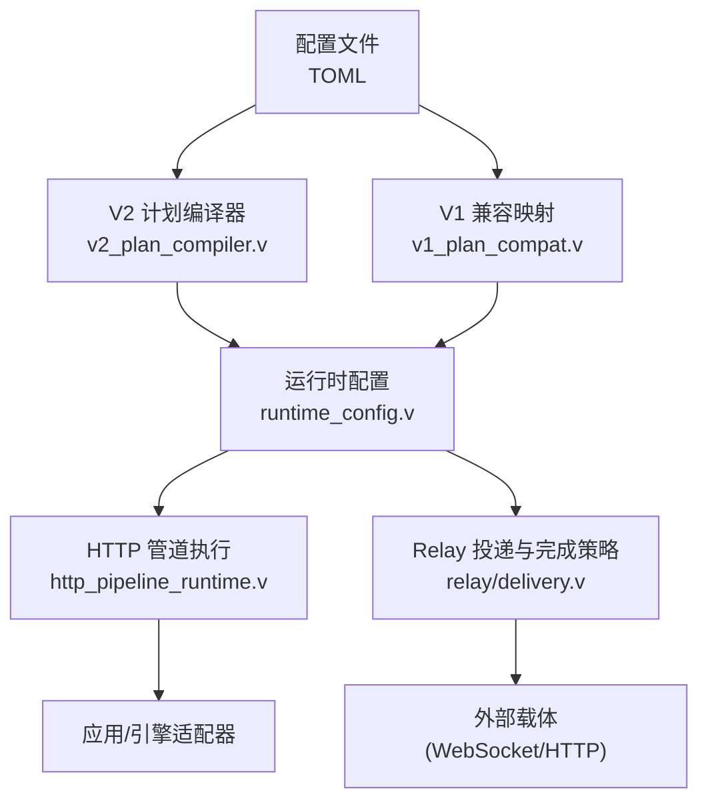
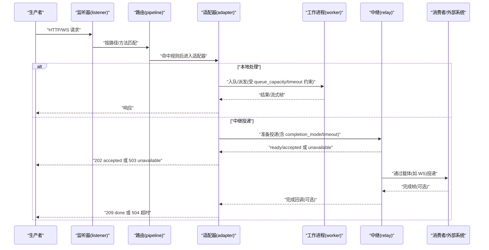
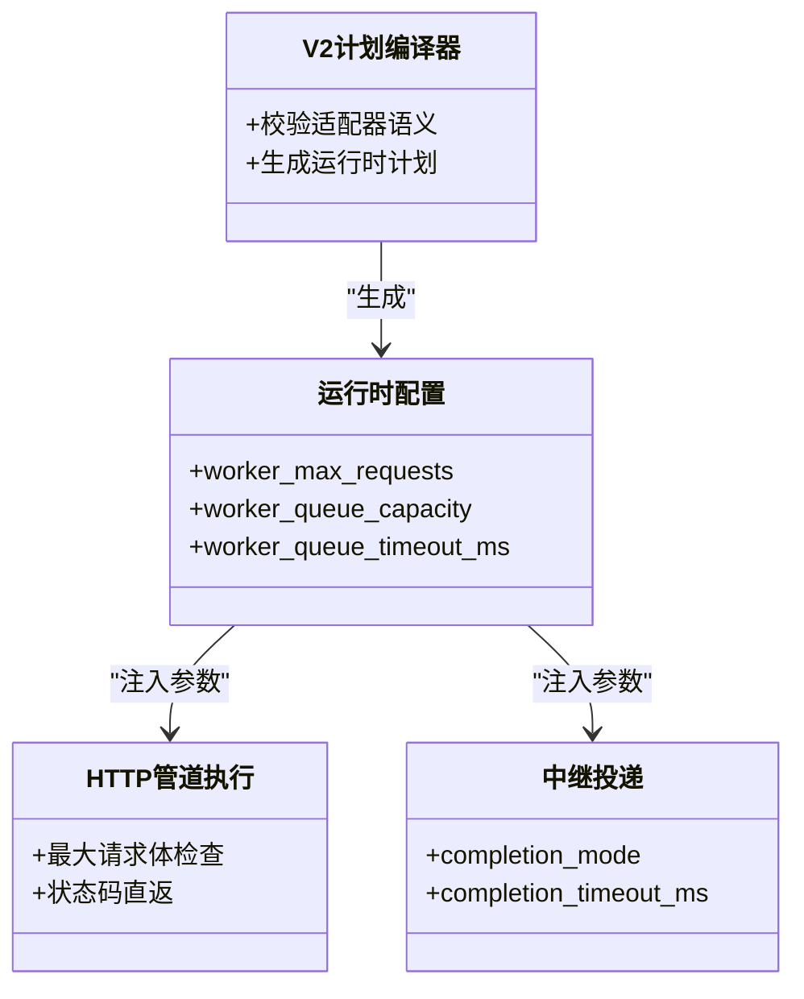

# 消息队列配置

<cite>
**本文引用的文件**
- [config/vhttpd.example.toml](file://config/vhttpd.example.toml)
- [config/vhttpd.multi.example.toml](file://config/vhttpd.multi.example.toml)
- [config/vhttpd.vjsx.example.toml](file://config/vhttpd.vjsx.example.toml)
- [examples/config/hello-v2.toml](file://examples/config/hello-v2.toml)
- [examples/config/feishu-paseo.toml](file://examples/config/feishu-paseo.toml)
- [examples/config/mcp-relay-local-v2.toml](file://examples/config/mcp-relay-local-v2.toml)
- [examples/config/stream-dispatch.toml](file://examples/config/stream-dispatch.toml)
- [src/server_lifecycle/runtime_config.v](file://src/server_lifecycle/runtime_config.v)
- [src/config/v1_plan_compat.v](file://src/config/v1_plan_compat.v)
- [src/config/v2_plan_compiler.v](file://src/config/v2_plan_compiler.v)
- [src/http_pipeline_runtime.v](file://src/http_pipeline_runtime.v)
- [src/relay/delivery.v](file://src/relay/delivery.v)
- [src/relay/outbound_test.v](file://src/relay/outbound_test.v)
- [src/relay/delivery_test.v](file://src/relay/delivery_test.v)
- [src/http_response_relay_delivery_test.v](file://src/http_response_relay_delivery_test.v)
- [src/upstream/transport/worker_protocol.v](file://src/upstream/transport/worker_protocol.v)
- [articles/11-observability.md](file://articles/11-observability.md)
- [tests/e2e/config_acceptance_test.sh](file://tests/e2e/config_acceptance_test.sh)
</cite>

## 目录
1. [简介](#简介)
2. [项目结构](#项目结构)
3. [核心组件](#核心组件)
4. [架构总览](#架构总览)
5. [详细组件分析](#详细组件分析)
6. [依赖关系分析](#依赖关系分析)
7. [性能调优](#性能调优)
8. [故障排查指南](#故障排查指南)
9. [结论](#结论)
10. [附录：完整配置示例与监控告警](#附录完整配置示例与监控告警)

## 简介
本文件面向在 vhttpd 中构建“类消息队列”能力的工程团队，聚焦以下目标：
- 队列后端选择：内存队列、进程内队列（Worker 队列）、基于 WebSocket 的分布式中继（Relay）
- 消息路由与调度：HTTP/WS 管道匹配、亲和性路由、优先级策略
- 消费者组与确认：WebSocket 亲和与派发、完成模式（accepted/wait）、超时控制
- 持久化与清理：当前仓库未提供内置消息持久化；建议通过外部系统或应用层实现
- 可靠性保证：幂等键、重试与退避、错误分类与可观测性
- 性能参数：批量大小、异步处理、资源限制
- 监控告警：Admin API、事件日志、关键指标采集

说明：vhttpd 并非传统意义上的 MQ 服务器，但通过 Worker 队列、WebSocket 亲和派发与 Relay 能力，可以组合出高吞吐、低延迟的消息通道。

## 项目结构
与“消息队列”相关的配置与实现主要分布在如下位置：
- 配置样例：config/*.toml、examples/config/*.toml
- 运行时计划编译与校验：src/config/v2_plan_compiler.v、src/config/v1_plan_compat.v
- 运行时参数解析与注入：src/server_lifecycle/runtime_config.v
- HTTP 管道与最大请求体限制：src/http_pipeline_runtime.v
- 中继（Relay）投递与完成策略：src/relay/delivery.v、outbound_test.v、delivery_test.v、http_response_relay_delivery_test.v
- Worker 协议帧定义：src/upstream/transport/worker_protocol.v
- 可观测性与性能调优参考：articles/11-observability.md、tests/e2e/config_acceptance_test.sh

图表来源
- [src/config/v2_plan_compiler.v:698-745](file://src/config/v2_plan_compiler.v#L698-L745)
- [src/config/v1_plan_compat.v:504-544](file://src/config/v1_plan_compat.v#L504-L544)
- [src/server_lifecycle/runtime_config.v:89-112](file://src/server_lifecycle/runtime_config.v#L89-L112)
- [src/http_pipeline_runtime.v:37-62](file://src/http_pipeline_runtime.v#L37-L62)
- [src/relay/delivery.v:1-39](file://src/relay/delivery.v#L1-L39)

章节来源
- [config/vhttpd.example.toml:1-67](file://config/vhttpd.example.toml#L1-L67)
- [config/vhttpd.multi.example.toml:1-73](file://config/vhttpd.multi.example.toml#L1-L73)
- [config/vhttpd.vjsx.example.toml:1-37](file://config/vhttpd.vjsx.example.toml#L1-L37)
- [examples/config/hello-v2.toml:1-31](file://examples/config/hello-v2.toml#L1-L31)
- [examples/config/feishu-paseo.toml:1-64](file://examples/config/feishu-paseo.toml#L1-L64)
- [examples/config/mcp-relay-local-v2.toml:1-36](file://examples/config/mcp-relay-local-v2.toml#L1-L36)
- [examples/config/stream-dispatch.toml:1-30](file://examples/config/stream-dispatch.toml#L1-L30)

## 核心组件
- Worker 进程内队列
  - 用于将请求排队到 PHP/VJSX 工作进程，支持容量与等待超时控制
  - 关键参数：pool_size、queue_capacity、queue_timeout_ms、max_requests、read_timeout_ms
- WebSocket 亲和与派发
  - 基于 key 的亲和路由，可将同一会话的请求稳定派发到同一 lane/worker
  - 支持从 header/query/app 计算 key，以及 fallback/reject 策略
- Relay 中继（分布式通道）
  - 以 carrier=websocket 为载体，在节点间转发消息
  - 支持 completion_mode=accepted/wait 与超时控制，返回 202/209/5xx 语义
- HTTP 管道与路由
  - 通过 listeners/adapters/pipelines 声明式编排
  - 支持路径匹配、状态码直返、最大请求体限制等

章节来源
- [src/server_lifecycle/runtime_config.v:89-112](file://src/server_lifecycle/runtime_config.v#L89-L112)
- [src/server_lifecycle/runtime_config.v:146-171](file://src/server_lifecycle/runtime_config.v#L146-L171)
- [src/config/v1_plan_compat.v:504-544](file://src/config/v1_plan_compat.v#L504-L544)
- [src/relay/delivery.v:1-39](file://src/relay/delivery.v#L1-L39)
- [src/http_pipeline_runtime.v:37-62](file://src/http_pipeline_runtime.v#L37-L62)

## 架构总览
下图展示了“生产者 -> 管道 -> 适配器 -> 引擎/工作者 -> 中继/外部载体”的整体流程，并标注了关键配置点。

图表来源
- [examples/config/hello-v2.toml:10-31](file://examples/config/hello-v2.toml#L10-L31)
- [examples/config/mcp-relay-local-v2.toml:18-36](file://examples/config/mcp-relay-local-v2.toml#L18-L36)
- [src/relay/delivery.v:1-39](file://src/relay/delivery.v#L1-L39)
- [src/http_response_relay_delivery_test.v:1-247](file://src/http_response_relay_delivery_test.v#L1-L247)

## 详细组件分析

### 队列后端配置
- 内存/进程内队列（Worker 队列）
  - 适用场景：单实例或同机多进程的高吞吐短任务
  - 关键参数
    - pool_size：并发工作进程数
    - queue_capacity：队列容量
    - queue_timeout_ms：入队等待超时
    - max_requests：生命周期内最大请求数（配合重启避免内存泄漏）
    - read_timeout_ms：读超时（长连接/AI 流式需增大）
  - 参考样例
    - [config/vhttpd.example.toml:19-26](file://config/vhttpd.example.toml#L19-L26)
    - [examples/config/stream-dispatch.toml:9-15](file://examples/config/stream-dispatch.toml#L9-L15)
    - [tests/e2e/config_acceptance_test.sh:2233-2256](file://tests/e2e/config_acceptance_test.sh#L2233-L2256)
- 持久化存储
  - 仓库未提供内置消息持久化；如需持久化，建议在应用层落盘或通过外部系统（数据库/对象存储）实现
- 分布式队列
  - 使用 Relay + WebSocket 作为载体，实现跨实例的消息分发与回传
  - 参考样例
    - [examples/config/mcp-relay-local-v2.toml:18-27](file://examples/config/mcp-relay-local-v2.toml#L18-L27)
    - [examples/config/feishu-paseo.toml:50-64](file://examples/config/feishu-paseo.toml#L50-L64)

章节来源
- [config/vhttpd.example.toml:19-26](file://config/vhttpd.example.toml#L19-L26)
- [examples/config/stream-dispatch.toml:9-15](file://examples/config/stream-dispatch.toml#L9-L15)
- [tests/e2e/config_acceptance_test.sh:2233-2256](file://tests/e2e/config_acceptance_test.sh#L2233-L2256)
- [examples/config/mcp-relay-local-v2.toml:18-27](file://examples/config/mcp-relay-local-v2.toml#L18-L27)
- [examples/config/feishu-paseo.toml:50-64](file://examples/config/feishu-paseo.toml#L50-L64)

### 消息路由配置
- 路由规则
  - 使用 pipelines 声明 ingress/egress 与 match.paths
  - 参考样例
    - [examples/config/hello-v2.toml:26-31](file://examples/config/hello-v2.toml#L26-L31)
- 优先级调度
  - WebSocket 亲和支持 priority（high/low/数字），结合 should_pin_lane 决定是否钉住 lane
  - 参考实现
    - [src/executor/inproc_vjsx_websocket_policy.v:67-73](file://src/executor/inproc_vjsx_websocket_policy.v#L67-L73)
    - [src/executor/inproc_vjsx_websocket_affinity_runtime.v:148-185](file://src/executor/inproc_vjsx_websocket_affinity_runtime.v#L148-L185)
- 死信队列
  - 仓库未提供内置死信队列；可在应用层对失败消息进行重放或归档

章节来源
- [examples/config/hello-v2.toml:26-31](file://examples/config/hello-v2.toml#L26-L31)
- [src/executor/inproc_vjsx_websocket_policy.v:67-73](file://src/executor/inproc_vjsx_websocket_policy.v#L67-L73)
- [src/executor/inproc_vjsx_websocket_affinity_runtime.v:148-185](file://src/executor/inproc_vjsx_websocket_affinity_runtime.v#L148-L185)

### 消费者组配置
- 负载均衡与亲和
  - 通过 websocket_affinity.source/key/scope/fallback 控制亲和来源与作用域
  - 参考样例
    - [examples/config/feishu-paseo.toml:56-60](file://examples/config/feishu-paseo.toml#L56-L60)
    - [src/config/v1_plan_compat.v:504-528](file://src/config/v1_plan_compat.v#L504-L528)
- 消费确认
  - 使用 completion_mode=accepted 或 wait，配合 completion_timeout_ms 控制等待时长
  - 参考测试与实现
    - [src/relay/outbound_test.v:28-43](file://src/relay/outbound_test.v#L28-L43)
    - [src/http_response_relay_delivery_test.v:209-247](file://src/http_response_relay_delivery_test.v#L209-L247)

章节来源
- [examples/config/feishu-paseo.toml:56-60](file://examples/config/feishu-paseo.toml#L56-L60)
- [src/config/v1_plan_compat.v:504-528](file://src/config/v1_plan_compat.v#L504-L528)
- [src/relay/outbound_test.v:28-43](file://src/relay/outbound_test.v#L28-L43)
- [src/http_response_relay_delivery_test.v:209-247](file://src/http_response_relay_delivery_test.v#L209-L247)

### 消息持久化配置
- 现状
  - 仓库未提供内置消息持久化机制
- 建议方案
  - 应用层落盘（文件/DB）
  - 通过外部消息系统（Kafka/RabbitMQ/Redis Streams）对接
  - 使用 Relay 的 channel_buffer 做缓冲（非持久化）

章节来源
- [examples/config/mcp-relay-local-v2.toml:26](file://examples/config/mcp-relay-local-v2.toml#L26)

### 可靠性保证配置
- 事务支持
  - 仓库未提供内置事务型消息；需在应用层实现两阶段提交或补偿逻辑
- 幂等性
  - 利用 frame/request_id/correlation_id/channel_id 等字段在应用层去重
  - 参考
    - [src/relay/delivery_test.v:12-34](file://src/relay/delivery_test.v#L12-L34)
- 重复消息处理
  - 在消费者侧基于唯一键去重；必要时结合幂等写入
- 错误分类与可观测性
  - 通过 error_class 与 metadata 暴露错误原因，便于告警与追踪
  - 参考
    - [src/http_response_relay_delivery_test.v:26-40](file://src/http_response_relay_delivery_test.v#L26-L40)

章节来源
- [src/relay/delivery_test.v:12-34](file://src/relay/delivery_test.v#L12-L34)
- [src/http_response_relay_delivery_test.v:26-40](file://src/http_response_relay_delivery_test.v#L26-L40)

### 性能调优参数
- Worker 池与队列
  - pool_size、queue_capacity、queue_timeout_ms、max_requests、read_timeout_ms
  - 参考
    - [config/vhttpd.example.toml:19-26](file://config/vhttpd.example.toml#L19-L26)
    - [articles/11-observability.md:622-666](file://articles/11-observability.md#L622-L666)
- 中继缓冲
  - channel_buffer 控制内部通道缓冲
  - 参考
    - [examples/config/mcp-relay-local-v2.toml:26](file://examples/config/mcp-relay-local-v2.toml#L26)
- 资源限制
  - 最大请求体限制（防止过大负载）
  - 参考
    - [src/http_pipeline_runtime.v:40-47](file://src/http_pipeline_runtime.v#L40-L47)

章节来源
- [config/vhttpd.example.toml:19-26](file://config/vhttpd.example.toml#L19-L26)
- [articles/11-observability.md:622-666](file://articles/11-observability.md#L622-L666)
- [examples/config/mcp-relay-local-v2.toml:26](file://examples/config/mcp-relay-local-v2.toml#L26)
- [src/http_pipeline_runtime.v:40-47](file://src/http_pipeline_runtime.v#L40-L47)

## 依赖关系分析
- 配置到运行时的链路
  - TOML -> V2 计划编译器 -> 运行时配置 -> 管道/适配器/中继
- 关键耦合点
  - v2_plan_compiler 对适配器语义进行校验（如 relay-delivery 必须指定 target）
  - runtime_config 将 worker 队列参数注入到 AppRuntimeBuildConfig
  - http_pipeline_runtime 在执行前检查请求体大小并短路返回

图表来源
- [src/config/v2_plan_compiler.v:698-745](file://src/config/v2_plan_compiler.v#L698-L745)
- [src/server_lifecycle/runtime_config.v:89-112](file://src/server_lifecycle/runtime_config.v#L89-L112)
- [src/http_pipeline_runtime.v:37-62](file://src/http_pipeline_runtime.v#L37-L62)
- [src/relay/delivery.v:1-39](file://src/relay/delivery.v#L1-L39)

章节来源
- [src/config/v2_plan_compiler.v:698-745](file://src/config/v2_plan_compiler.v#L698-L745)
- [src/server_lifecycle/runtime_config.v:89-112](file://src/server_lifecycle/runtime_config.v#L89-L112)
- [src/http_pipeline_runtime.v:37-62](file://src/http_pipeline_runtime.v#L37-L62)
- [src/relay/delivery.v:1-39](file://src/relay/delivery.v#L1-L39)

## 性能调优
- Worker 池与队列
  - 根据 CPU 核数设置 pool_size；合理设置 queue_capacity 与 queue_timeout_ms 避免雪崩
  - 设置 max_requests 定期重启，降低内存泄漏风险
- 超时与限流
  - 普通请求 read_timeout_ms 较小；AI 流式请求适当放大
  - 通过 Admin API 观察 queue_depth、inflight_requests 等指标
- 中继缓冲
  - 调整 channel_buffer 平衡吞吐与内存占用
- 资源限制
  - 启用最大请求体限制，避免异常大负载拖垮服务

章节来源
- [articles/11-observability.md:622-666](file://articles/11-observability.md#L622-L666)
- [tests/e2e/config_acceptance_test.sh:3144-3163](file://tests/e2e/config_acceptance_test.sh#L3144-L3163)
- [examples/config/mcp-relay-local-v2.toml:26](file://examples/config/mcp-relay-local-v2.toml#L26)
- [src/http_pipeline_runtime.v:40-47](file://src/http_pipeline_runtime.v#L40-L47)

## 故障排查指南
- 队列满导致拒绝
  - 现象：返回 503，error_class=worker_queue_full
  - 定位：查看 admin/workers 与 admin/runtime 中的 queue_depth
  - 解决：提升 queue_capacity、优化处理耗时、扩容 pool_size
- 中继不可用
  - 现象：返回 503，error_class=relay_carrier_unavailable
  - 定位：检查 relays 配置与载体健康
- 完成等待超时
  - 现象：返回 504，error_class=relay_response_missing
  - 定位：核对 completion_timeout_ms 与下游处理耗时
- 事件日志
  - 开启 event_log，结合 e2e 脚本中的 wait_event_contains 辅助定位

章节来源
- [tests/e2e/config_acceptance_test.sh:3144-3163](file://tests/e2e/config_acceptance_test.sh#L3144-L3163)
- [src/http_response_relay_delivery_test.v:26-40](file://src/http_response_relay_delivery_test.v#L26-L40)
- [src/http_response_relay_delivery_test.v:223-247](file://src/http_response_relay_delivery_test.v#L223-L247)
- [config/vhttpd.example.toml:12-14](file://config/vhttpd.example.toml#L12-L14)

## 结论
- vhttpd 通过 Worker 队列、WebSocket 亲和派发与 Relay 能力，能够组合出高性能的消息通道
- 当前仓库未提供内置持久化与死信队列，建议通过应用层或外部系统补齐
- 通过合理的队列与中继参数、完善的错误分类与可观测性，可获得良好的可靠性与可运维性

## 附录：完整配置示例与监控告警
- 最小可用示例（HTTP 管道）
  - [examples/config/hello-v2.toml:1-31](file://examples/config/hello-v2.toml#L1-L31)
- 多站点示例（PHP/VJSX）
  - [config/vhttpd.multi.example.toml:44-73](file://config/vhttpd.multi.example.toml#L44-L73)
- 中继示例（WebSocket 载体）
  - [examples/config/mcp-relay-local-v2.toml:18-36](file://examples/config/mcp-relay-local-v2.toml#L18-L36)
- 亲和与派发示例
  - [examples/config/feishu-paseo.toml:56-60](file://examples/config/feishu-paseo.toml#L56-L60)
- 监控告警
  - Admin API 指标：/admin/runtime、/admin/workers
  - 事件日志：files.event_log
  - 参考
    - [articles/11-observability.md:602-666](file://articles/11-observability.md#L602-L666)
    - [config/vhttpd.example.toml:12-14](file://config/vhttpd.example.toml#L12-L14)