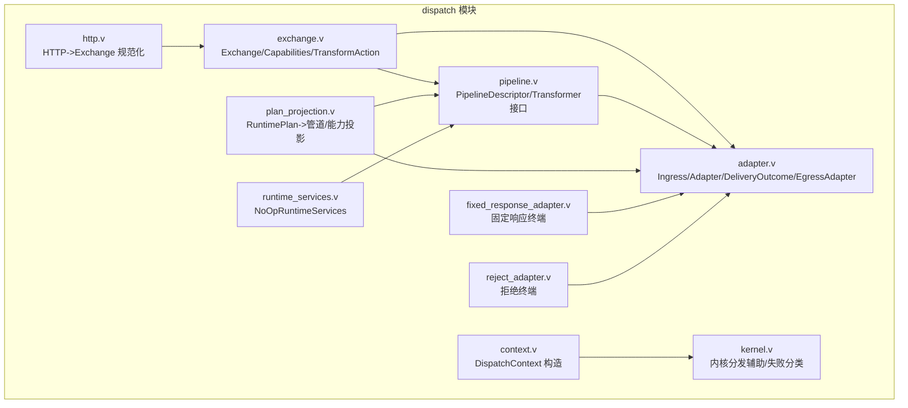
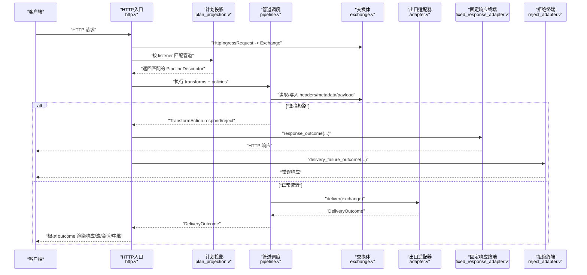
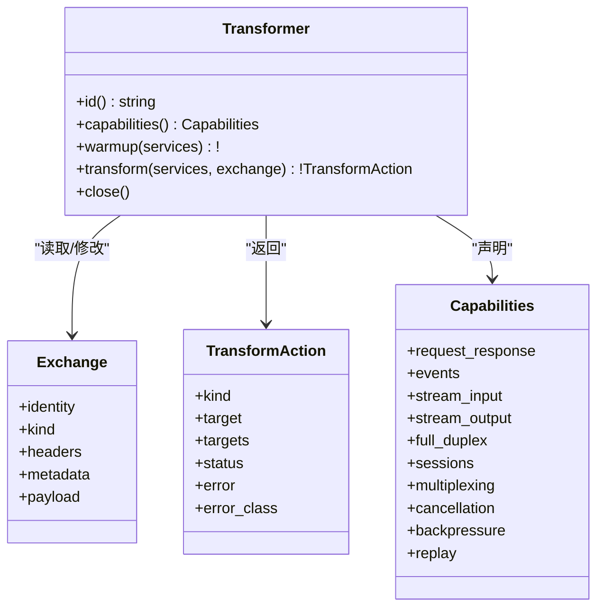
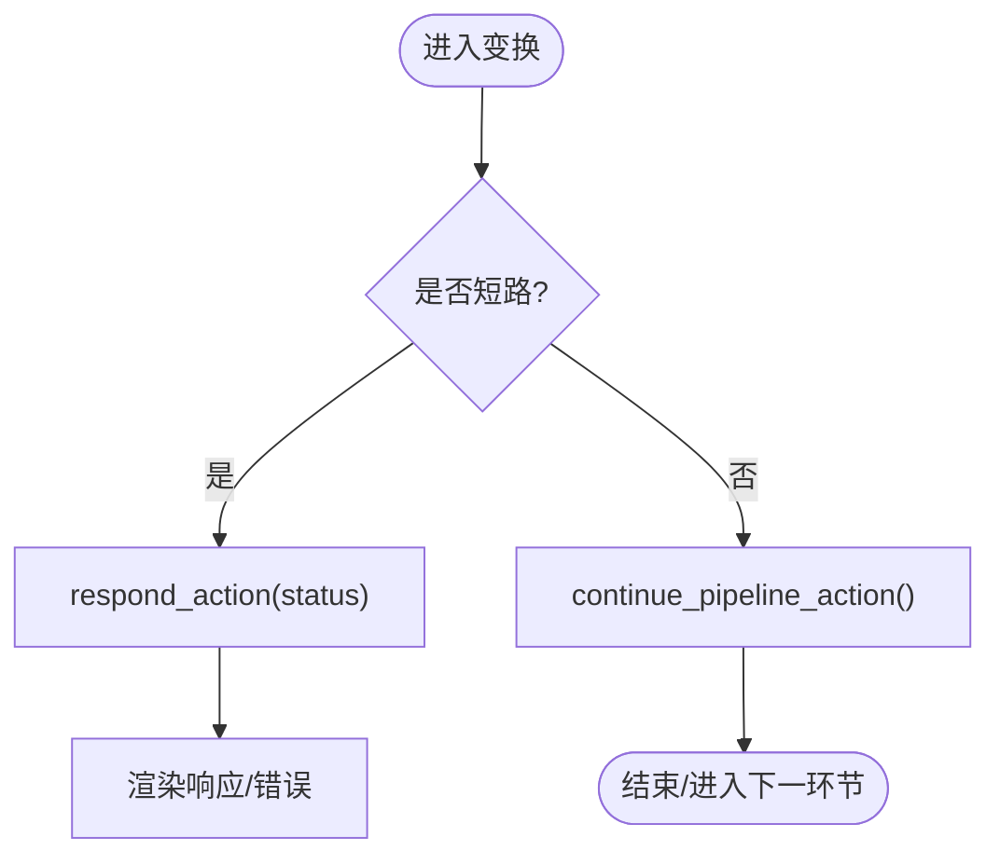
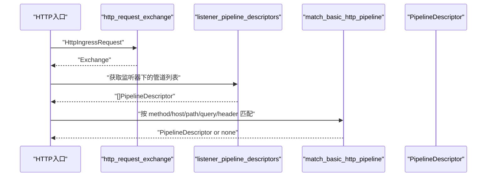
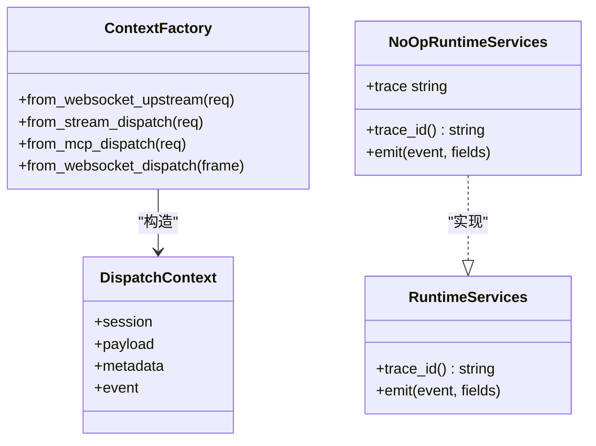
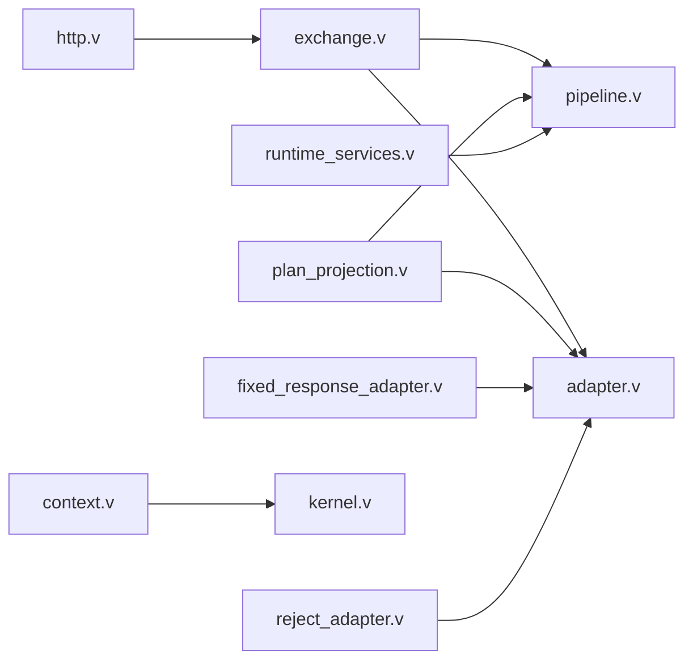

# 中间件插件开发

<cite>
**本文引用的文件**   
- [src/dispatch/pipeline.v](file://src/dispatch/pipeline.v)
- [src/dispatch/adapter.v](file://src/dispatch/adapter.v)
- [src/dispatch/exchange.v](file://src/dispatch/exchange.v)
- [src/dispatch/context.v](file://src/dispatch/context.v)
- [src/dispatch/http.v](file://src/dispatch/http.v)
- [src/dispatch/kernel.v](file://src/dispatch/kernel.v)
- [src/dispatch/fixed_response_adapter.v](file://src/dispatch/fixed_response_adapter.v)
- [src/dispatch/reject_adapter.v](file://src/dispatch/reject_adapter.v)
- [src/dispatch/plan_projection.v](file://src/dispatch/plan_projection.v)
- [src/dispatch/runtime_services.v](file://src/dispatch/runtime_services.v)
- [README.md](file://README.md)
</cite>

## 目录
1. [简介](#简介)
2. [项目结构](#项目结构)
3. [核心组件](#核心组件)
4. [架构总览](#架构总览)
5. [详细组件分析](#详细组件分析)
6. [依赖关系分析](#依赖关系分析)
7. [性能考量](#性能考量)
8. [故障排查指南](#故障排查指南)
9. [结论](#结论)
10. [附录](#附录)

## 简介
本指南面向希望在 vhttpd 中开发“中间件插件”的工程师，围绕以下目标展开：
- 实现模式：请求拦截器、响应处理器、错误处理器的开发与接入方式
- 管道机制：中间件链构建、执行顺序控制、短路处理逻辑
- 上下文管理：请求属性传递、会话状态保持、异步操作支持
- 常用示例：日志记录、认证授权、请求限流、缓存处理
- 性能优化：异步处理、批量操作、连接复用
- 测试方法：模拟请求、断言响应、性能测试

vhttpd 将“协议入口—调度—适配器/终端—执行器”解耦为可组合的运行时管线。中间件以 Transform（转换）与 EgressAdapter（出口适配器）的形式参与管线，通过统一的 Exchange 对象在阶段间传递数据，并通过 DeliveryOutcome 表达最终交付意图。

## 项目结构
与中间件/插件相关的关键代码集中在 dispatch 模块，其职责包括：
- 定义交换体 Exchange、能力 Capabilities、动作 TransformAction
- 定义管道描述 PipelineDescriptor、变换 TransformDescriptor、终端 TerminalDescriptor
- 定义入口/出口适配器描述 IngressDescriptor/AdapterDescriptor 及交付结果 DeliveryOutcome
- 提供 HTTP 到 Exchange 的规范化转换
- 从 RuntimePlan 投影出管道与能力约束
- 提供内置终端适配器（固定响应、拒绝）用于短路返回

图表来源
- [src/dispatch/exchange.v:1-160](file://src/dispatch/exchange.v#L1-L160)
- [src/dispatch/pipeline.v:1-119](file://src/dispatch/pipeline.v#L1-L119)
- [src/dispatch/adapter.v:1-137](file://src/dispatch/adapter.v#L1-L137)
- [src/dispatch/http.v:1-55](file://src/dispatch/http.v#L1-L55)
- [src/dispatch/plan_projection.v:1-314](file://src/dispatch/plan_projection.v#L1-L314)
- [src/dispatch/fixed_response_adapter.v:1-45](file://src/dispatch/fixed_response_adapter.v#L1-L45)
- [src/dispatch/reject_adapter.v:1-45](file://src/dispatch/reject_adapter.v#L1-L45)
- [src/dispatch/context.v:1-66](file://src/dispatch/context.v#L1-L66)
- [src/dispatch/kernel.v:1-151](file://src/dispatch/kernel.v#L1-L151)
- [src/dispatch/runtime_services.v:1-17](file://src/dispatch/runtime_services.v#L1-L17)

章节来源
- [README.md:1-800](file://README.md#L1-L800)

## 核心组件
- Exchange：跨阶段的统一消息载体，包含身份标识、类型、入站/管道信息、时间戳、头与元数据、负载等
- Capabilities：声明式能力矩阵，用于校验入站/变换/出口的能力匹配
- TransformAction：变换动作，支持继续、直接响应、转发、扇出、拒绝、丢弃等
- Transformer：变换接口，具备 warmup/transform/close 生命周期
- EgressAdapter：出口适配器接口，负责将 Exchange 转换为 DeliveryOutcome
- DeliveryOutcome：统一的交付结果，涵盖响应、文件、事件接受、流计划、会话计划、中继投递、失败等
- PipelineDescriptor：管道描述，包含 ingress、transforms、policies、egress 以及 required capabilities
- IngressDescriptor/AdapterDescriptor/TerminalDescriptor：入口/适配器/终端的描述与能力声明
- HttpIngressRequest->Exchange：HTTP 标准化转换
- NoOpRuntimeServices：最小化运行时服务（trace_id/emit），供测试或无观测场景使用

章节来源
- [src/dispatch/exchange.v:1-160](file://src/dispatch/exchange.v#L1-L160)
- [src/dispatch/pipeline.v:1-119](file://src/dispatch/pipeline.v#L1-L119)
- [src/dispatch/adapter.v:1-137](file://src/dispatch/adapter.v#L1-L137)
- [src/dispatch/http.v:1-55](file://src/dispatch/http.v#L1-L55)
- [src/dispatch/runtime_services.v:1-17](file://src/dispatch/runtime_services.v#L1-L17)

## 架构总览
下图展示了从 HTTP 请求进入，到管道匹配、变换执行、出口适配与交付的整体流程，并标注了关键文件位置。

图表来源
- [src/dispatch/http.v:1-55](file://src/dispatch/http.v#L1-L55)
- [src/dispatch/plan_projection.v:1-314](file://src/dispatch/plan_projection.v#L1-L314)
- [src/dispatch/pipeline.v:1-119](file://src/dispatch/pipeline.v#L1-L119)
- [src/dispatch/exchange.v:1-160](file://src/dispatch/exchange.v#L1-L160)
- [src/dispatch/adapter.v:1-137](file://src/dispatch/adapter.v#L1-L137)
- [src/dispatch/fixed_response_adapter.v:1-45](file://src/dispatch/fixed_response_adapter.v#L1-L45)
- [src/dispatch/reject_adapter.v:1-45](file://src/dispatch/reject_adapter.v#L1-L45)

## 详细组件分析

### 组件A：变换（Transform）与中间件链
- 角色定位：作为“请求拦截器/响应处理器/错误处理器”的统一抽象
- 生命周期：warmup（预热）、transform（处理）、close（关闭）
- 输入输出：接收 Exchange；返回 TransformAction（继续、响应、拒绝、转发、扇出、丢弃）
- 能力约束：通过 Capabilities 声明自身支持的协议/特性，由 plan_projection 进行静态校验

图表来源
- [src/dispatch/exchange.v:1-160](file://src/dispatch/exchange.v#L1-L160)
- [src/dispatch/pipeline.v:1-119](file://src/dispatch/pipeline.v#L1-L119)

章节来源
- [src/dispatch/exchange.v:1-160](file://src/dispatch/exchange.v#L1-L160)
- [src/dispatch/pipeline.v:1-119](file://src/dispatch/pipeline.v#L1-L119)

#### 开发要点
- 请求拦截器：在 transform 中读取 headers/metadata/payload，做鉴权、签名校验、参数归一化等
- 响应处理器：在后续阶段或出口适配器前，基于 Exchange 追加响应头、埋点、统计
- 错误处理器：通过 reject_action 或 delivery_failure_outcome 快速短路并携带 error_class 便于分类

### 组件B：出口适配器（EgressAdapter）与短路处理
- 角色定位：将 Exchange 转换为 DeliveryOutcome，完成最终的协议渲染（HTTP/文件/流/会话/中继/失败）
- 内置终端：
  - 固定响应：直接返回 response_outcome
  - 拒绝：返回 delivery_failure_outcome
- 短路路径：变换可直接 respond/reject，无需到达出口适配器

图表来源
- [src/dispatch/exchange.v:106-145](file://src/dispatch/exchange.v#L106-L145)
- [src/dispatch/fixed_response_adapter.v:1-45](file://src/dispatch/fixed_response_adapter.v#L1-L45)
- [src/dispatch/reject_adapter.v:1-45](file://src/dispatch/reject_adapter.v#L1-L45)

章节来源
- [src/dispatch/adapter.v:1-137](file://src/dispatch/adapter.v#L1-L137)
- [src/dispatch/fixed_response_adapter.v:1-45](file://src/dispatch/fixed_response_adapter.v#L1-L45)
- [src/dispatch/reject_adapter.v:1-45](file://src/dispatch/reject_adapter.v#L1-L45)

### 组件C：HTTP 标准化与管道匹配
- HTTP 标准化：将 HttpIngressRequest 转为 Exchange，规范化 header 键名、填充 protocol/remote_addr 等元数据
- 管道匹配：从 RuntimePlan 投影得到 PipelineDescriptor，并按 match 规则选择管道
- 能力校验：对 pipeline.required 与 ingress.capabilities 进行一致性检查，避免不兼容组合

图表来源
- [src/dispatch/http.v:1-55](file://src/dispatch/http.v#L1-L55)
- [src/dispatch/plan_projection.v:280-314](file://src/dispatch/plan_projection.v#L280-L314)

章节来源
- [src/dispatch/http.v:1-55](file://src/dispatch/http.v#L1-L55)
- [src/dispatch/plan_projection.v:1-314](file://src/dispatch/plan_projection.v#L1-L314)

### 组件D：上下文管理与异步支持
- DispatchContext：封装 session、payload、metadata、event 等，用于不同分发场景（WebSocket upstream、Stream、MCP、WebSocket dispatch）
- 构造器：提供多种 from_* 工厂函数，将底层传输帧/请求映射为统一的 DispatchContext
- 运行时服务：RuntimeServices 暴露 trace_id/emit，NoOpRuntimeServices 提供最小实现，便于测试与无观测环境

图表来源
- [src/dispatch/context.v:1-66](file://src/dispatch/context.v#L1-L66)
- [src/dispatch/runtime_services.v:1-17](file://src/dispatch/runtime_services.v#L1-L17)

章节来源
- [src/dispatch/context.v:1-66](file://src/dispatch/context.v#L1-L66)
- [src/dispatch/runtime_services.v:1-17](file://src/dispatch/runtime_services.v#L1-L17)

### 组件E：错误分类与内核分发辅助
- 失败分类：transport_failure/stream_failure 将后端错误归类为 status/error_class，便于统一错误语义
- 请求构建：提供 stream/mcp/websocket 等分发的请求构建器，保证字段一致性与可观测性

章节来源
- [src/dispatch/kernel.v:1-151](file://src/dispatch/kernel.v#L1-L151)

## 依赖关系分析
- 低耦合：变换与出口适配器仅依赖 Exchange/RuntimeServices，不直接持有协议细节
- 强内聚：每个适配器/变换聚焦单一职责（如固定响应、拒绝）
- 配置驱动：通过 RuntimePlan 投影生成管道与能力约束，启动时即可发现不匹配问题
- 外部依赖：上游 transport 的错误分类被复用，确保错误语义稳定

图表来源
- [src/dispatch/exchange.v:1-160](file://src/dispatch/exchange.v#L1-L160)
- [src/dispatch/pipeline.v:1-119](file://src/dispatch/pipeline.v#L1-L119)
- [src/dispatch/adapter.v:1-137](file://src/dispatch/adapter.v#L1-L137)
- [src/dispatch/http.v:1-55](file://src/dispatch/http.v#L1-L55)
- [src/dispatch/plan_projection.v:1-314](file://src/dispatch/plan_projection.v#L1-L314)
- [src/dispatch/fixed_response_adapter.v:1-45](file://src/dispatch/fixed_response_adapter.v#L1-L45)
- [src/dispatch/reject_adapter.v:1-45](file://src/dispatch/reject_adapter.v#L1-L45)
- [src/dispatch/context.v:1-66](file://src/dispatch/context.v#L1-L66)
- [src/dispatch/kernel.v:1-151](file://src/dispatch/kernel.v#L1-L151)
- [src/dispatch/runtime_services.v:1-17](file://src/dispatch/runtime_services.v#L1-L17)

## 性能考量
- 短路优先：在变换层尽早 respond/reject，减少后续 IO 与序列化开销
- 零拷贝倾向：尽量复用 Exchange.headers/metadata，避免不必要的深拷贝
- 批量与批处理：对于需要聚合的请求（如限流计数、指标上报），可在 warmup 阶段初始化计数器，transform 中增量更新
- 连接复用：出口适配器内部维护连接池（例如上游 HTTP/WebSocket），减少握手成本
- 异步编排：利用 RuntimeServices.emit 进行非阻塞埋点，避免阻塞主路径
- 能力预检：通过 plan_projection 的静态能力校验，避免运行期无效路径

[本节为通用指导，不涉及具体文件]

## 故障排查指南
- 能力不匹配：当 pipeline.required 与 ingress.capabilities 不一致时，会在计划投影阶段产生诊断信息，建议优先修复配置
- 错误分类：使用 delivery_failure_outcome 并设置 error_class，便于上层统一处理与告警
- 追踪与观测：通过 RuntimeServices.trace_id()/emit() 注入 trace_id 与自定义事件，配合 admin 面板观察
- 常见短路误用：仅在必要时使用 respond/reject，避免破坏下游必要的清理逻辑

章节来源
- [src/dispatch/plan_projection.v:133-190](file://src/dispatch/plan_projection.v#L133-L190)
- [src/dispatch/adapter.v:120-127](file://src/dispatch/adapter.v#L120-L127)
- [src/dispatch/runtime_services.v:1-17](file://src/dispatch/runtime_services.v#L1-L17)

## 结论
vhttpd 的中间件/插件体系以 Exchange 为中心，通过 Transform 与 EgressAdapter 的组合实现灵活的请求拦截、响应处理与错误处理。借助 RuntimePlan 投影与能力矩阵，系统在启动时即可完成兼容性校验，降低运行期风险。结合短路策略、异步埋点与连接复用，可以在保证功能的同时获得良好的性能表现。

[本节为总结，不涉及具体文件]

## 附录

### 常用中间件开发示例（思路与步骤）
- 日志记录
  - 在 warmup 阶段初始化日志上下文
  - 在 transform 中记录请求元数据（method/path/headers）
  - 在 close 阶段记录耗时与状态码（可从后续 DeliveryOutcome 推断）
- 认证授权
  - 在 transform 中校验 token/签名/权限
  - 失败时使用 reject_action 返回 401/403 并附带 error_class
  - 成功时将用户信息写入 metadata，供下游使用
- 请求限流
  - 在 warmup 阶段创建令牌桶/滑动窗口计数器
  - 在 transform 中依据 key（如 IP/用户ID）扣减配额
  - 超限则 respond/reject，并在 headers 中附加重试提示
- 缓存处理
  - 在 transform 中计算缓存键（path+query+headers）
  - 命中则 respond 返回缓存体；未命中则 continue_pipeline，并在出口后写回缓存

[本节为概念性示例，不涉及具体文件]

### 测试方法
- 模拟请求
  - 构造 HttpIngressRequest，调用 http_request_exchange 生成 Exchange
  - 或直接构造 Exchange，设置 kind=/.request、payload=RequestPayload
- 断言响应
  - 对变换：断言返回的 TransformAction 是否为 respond/reject/continue
  - 对出口适配器：断言返回的 DeliveryOutcome.kind/status/headers/body
- 性能测试
  - 使用 k6 或类似工具对 HTTP 入口压测
  - 关注 transform 与出口适配器的耗时分布
  - 结合 RuntimeServices.emit 的事件日志进行热点定位

章节来源
- [src/dispatch/http.v:1-55](file://src/dispatch/http.v#L1-L55)
- [src/dispatch/exchange.v:1-160](file://src/dispatch/exchange.v#L1-L160)
- [src/dispatch/adapter.v:1-137](file://src/dispatch/adapter.v#L1-L137)