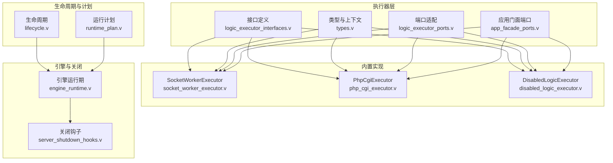
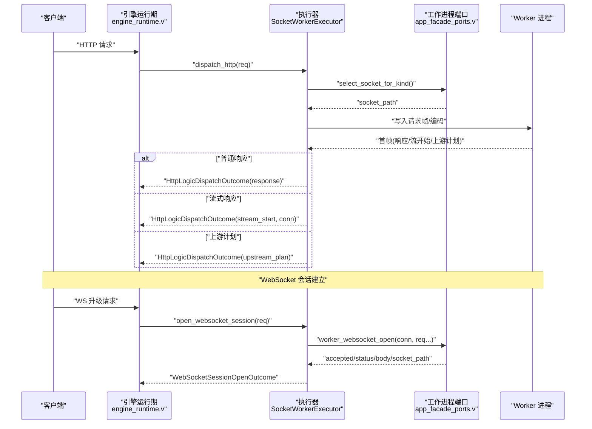
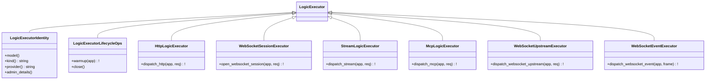
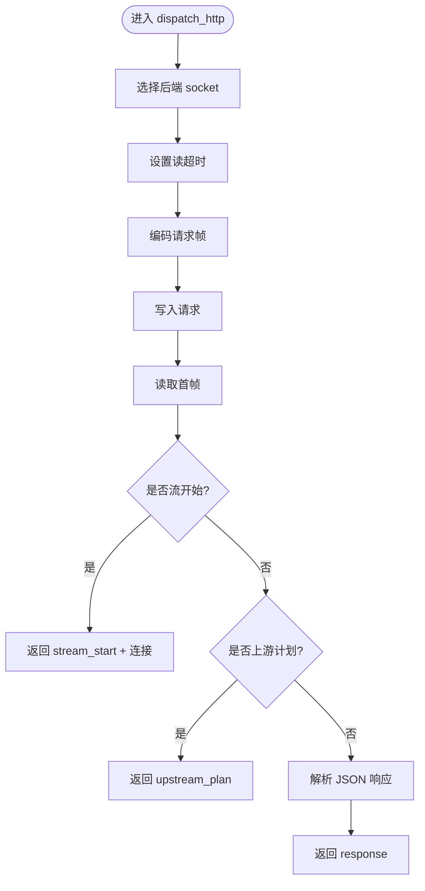
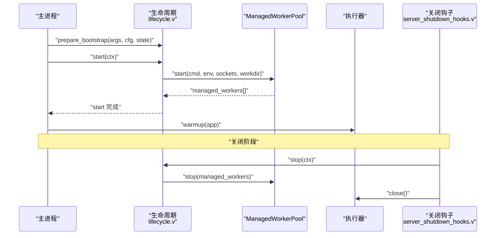
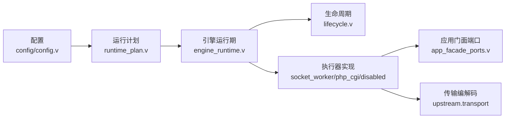

# 执行器插件开发

<cite>
**本文引用的文件**   
- [src/executor/logic_executor_interfaces.v](file://src/executor/logic_executor_interfaces.v)
- [src/executor/logic_executor_ports.v](file://src/executor/logic_executor_ports.v)
- [src/executor/types.v](file://src/executor/types.v)
- [src/executor/app_facade_ports.v](file://src/executor/app_facade_ports.v)
- [src/executor/disabled_logic_executor.v](file://src/executor/disabled_logic_executor.v)
- [src/executor/php_cgi_executor.v](file://src/executor/php_cgi_executor.v)
- [src/executor/socket_worker_executor.v](file://src/executor/socket_worker_executor.v)
- [src/executor/lifecycle.v](file://src/executor/lifecycle.v)
- [src/executor/runtime_plan.v](file://src/executor/runtime_plan.v)
- [src/engine_runtime.v](file://src/engine_runtime.v)
- [src/server_shutdown_hooks.v](file://src/server_shutdown_hooks.v)
- [src/config/config.v](file://src/config/config.v)
- [docs/EXECUTOR_MODES.md](file://docs/EXECUTOR_MODES.md)
- [src/logic_executor_test.v](file://src/logic_executor_test.v)
- [src/websocket_session_delivery_projection_test.v](file://src/websocket_session_delivery_projection_test.v)
- [src/openai_gateway_integration_test.v](file://src/openai_gateway_integration_test.v)
</cite>

## 目录
1. [简介](#简介)
2. [项目结构](#项目结构)
3. [核心组件](#核心组件)
4. [架构总览](#架构总览)
5. [详细组件分析](#详细组件分析)
6. [依赖分析](#依赖分析)
7. [性能考虑](#性能考虑)
8. [故障排查指南](#故障排查指南)
9. [结论](#结论)
10. [附录](#附录)

## 简介
本指南面向希望为 vhttpd 编写自定义“逻辑执行器”的开发者。内容覆盖：
- 自定义执行器的实现接口与能力边界
- HTTP、WebSocket、流式与 MCP 等请求处理流程与响应生成机制
- 执行器生命周期管理（初始化、启动、停止、销毁）
- 配置结构与参数验证、默认值与环境变量支持
- 资源管理与并发控制策略（连接池、内存、队列）
- 调试与测试方法（单元、集成、基准）
- 从简单到复杂的渐进式示例路径

## 项目结构
vhttpd 将“逻辑执行器”抽象为一组可插拔的能力接口，并通过运行时计划与生命周期钩子进行装配。关键位置如下：
- 接口定义与类型：src/executor/*
- 内置执行器实现：SocketWorkerExecutor（PHP Worker）、PhpCgiExecutor（PHP CGI）、DisabledLogicExecutor（禁用占位）
- 生命周期与运行计划：lifecycle.v、runtime_plan.v
- 引擎启动/停止编排：engine_runtime.v、server_shutdown_hooks.v
- 配置模型：config/config.v
- 模式说明文档：docs/EXECUTOR_MODES.md

图表来源
- [src/executor/logic_executor_interfaces.v:1-51](file://src/executor/logic_executor_interfaces.v#L1-L51)
- [src/executor/types.v:1-449](file://src/executor/types.v#L1-L449)
- [src/executor/logic_executor_ports.v:1-104](file://src/executor/logic_executor_ports.v#L1-L104)
- [src/executor/app_facade_ports.v:1-38](file://src/executor/app_facade_ports.v#L1-L38)
- [src/executor/socket_worker_executor.v:1-157](file://src/executor/socket_worker_executor.v#L1-L157)
- [src/executor/php_cgi_executor.v:1-118](file://src/executor/php_cgi_executor.v#L1-L118)
- [src/executor/disabled_logic_executor.v:1-81](file://src/executor/disabled_logic_executor.v#L1-L81)
- [src/executor/lifecycle.v:1-179](file://src/executor/lifecycle.v#L1-L179)
- [src/executor/runtime_plan.v:1-32](file://src/executor/runtime_plan.v#L1-L32)
- [src/engine_runtime.v:32-84](file://src/engine_runtime.v#L32-L84)
- [src/server_shutdown_hooks.v:1-38](file://src/server_shutdown_hooks.v#L1-L38)

章节来源
- [docs/EXECUTOR_MODES.md:1-56](file://docs/EXECUTOR_MODES.md#L1-L56)

## 核心组件
- 逻辑执行器接口族
  - 身份与生命周期：model/kind/provider/admin_details、warmup/close
  - 协议能力：HTTP 调度、WebSocket 会话打开、流式调度、MCP 调度、WebSocket 上游与事件
- 端口适配层
  - 通过 Port 包装统一暴露各协议能力，便于上层按能力选择调用
- 应用门面端口
  - 向执行器暴露运行时配置、工作进程后端选择、流/MCP/WebSocket 分发等能力
- 内置执行器
  - SocketWorkerExecutor：基于 Unix Socket 的 PHP Worker 模式
  - PhpCgiExecutor：FastCGI 模式的 PHP 执行器
  - DisabledLogicExecutor：禁用占位，所有能力返回错误
- 生命周期与运行计划
  - Lifecycle 提供 prepare_bootstrap/start/stop 钩子，负责 Worker 池启动与清理
  - RuntimePlan 根据配置与工厂解析出具体执行器与生命周期

章节来源
- [src/executor/logic_executor_interfaces.v:1-51](file://src/executor/logic_executor_interfaces.v#L1-L51)
- [src/executor/logic_executor_ports.v:1-104](file://src/executor/logic_executor_ports.v#L1-L104)
- [src/executor/app_facade_ports.v:1-38](file://src/executor/app_facade_ports.v#L1-L38)
- [src/executor/socket_worker_executor.v:1-157](file://src/executor/socket_worker_executor.v#L1-L157)
- [src/executor/php_cgi_executor.v:1-118](file://src/executor/php_cgi_executor.v#L1-L118)
- [src/executor/disabled_logic_executor.v:1-81](file://src/executor/disabled_logic_executor.v#L1-L81)
- [src/executor/lifecycle.v:1-179](file://src/executor/lifecycle.v#L1-L179)
- [src/executor/runtime_plan.v:1-32](file://src/executor/runtime_plan.v#L1-L32)

## 架构总览
下图展示了从 HTTP 请求进入，到执行器调度、响应生成的端到端流程，以及 WebSocket 会话建立与后续事件分发的路径。

图表来源
- [src/engine_runtime.v:32-84](file://src/engine_runtime.v#L32-L84)
- [src/executor/socket_worker_executor.v:43-132](file://src/executor/socket_worker_executor.v#L43-L132)
- [src/executor/app_facade_ports.v:20-38](file://src/executor/app_facade_ports.v#L20-L38)

## 详细组件分析

### 接口与类型设计
- 身份与生命周期
  - model/kind/provider/admin_details：描述执行器模型、种类、提供者与管理详情
  - warmup/close：在引擎启动后与停止前调用，用于预热与释放资源
- 协议能力
  - dispatch_http：返回三种结果之一：普通响应、流式响应、上游计划
  - open_websocket_session：决定是否接受 WS 升级并返回握手信息或透传 socket
  - dispatch_stream / dispatch_mcp / dispatch_websocket_upstream / dispatch_websocket_event：扩展协议能力
- 类型与上下文
  - HttpLogicDispatchRequest/Outcome、WebSocketSessionOpenRequest/Outcome、Stream/MCP/WebSocket 相关请求/响应类型
  - DispatchContext/KernelDispatchEnvelope 等用于跨模块传递上下文

图表来源
- [src/executor/logic_executor_interfaces.v:1-51](file://src/executor/logic_executor_interfaces.v#L1-L51)

章节来源
- [src/executor/logic_executor_interfaces.v:1-51](file://src/executor/logic_executor_interfaces.v#L1-L51)
- [src/executor/types.v:1-449](file://src/executor/types.v#L1-L449)

### 端口适配层
- 目的：以 Port 对象封装 LogicExecutor，屏蔽内部差异，向上层提供稳定的能力入口
- 典型用法：引擎侧通过 logic_executor_http_port 等构造 Port，再调用对应方法

章节来源
- [src/executor/logic_executor_ports.v:1-104](file://src/executor/logic_executor_ports.v#L1-L104)

### 应用门面端口（AppFacade Ports）
- 提供访问运行时配置、选择工作进程 socket、发起流/MCP/WebSocket 分发等能力
- 关键方法：
  - worker_backend_select_socket_for_kind / select_socket_queued
  - worker_websocket_open
  - worker_backend_dispatch_stream / dispatch_mcp / dispatch_websocket_*

章节来源
- [src/executor/app_facade_ports.v:1-38](file://src/executor/app_facade_ports.v#L1-L38)

### 内置执行器实现

#### SocketWorkerExecutor（PHP Worker）
- 模型：worker；提供者：php-worker；种类：php
- HTTP 调度：选择 socket -> 设置读超时 -> 编码请求 -> 读取首帧 -> 判断 response/stream/upstream_plan
- WebSocket：通过 worker_websocket_open 完成握手，返回 socket_path 与连接句柄
- 其他能力：通过 AppFacade 端口转发至后端

图表来源
- [src/executor/socket_worker_executor.v:43-95](file://src/executor/socket_worker_executor.v#L43-L95)

章节来源
- [src/executor/socket_worker_executor.v:1-157](file://src/executor/socket_worker_executor.v#L1-L157)

#### PhpCgiExecutor（PHP CGI）
- 模型：worker；提供者：php-cgi；种类：php-cgi
- HTTP 调度：使用 FastCGI 编解码器与后端通信，仅支持普通响应
- 其他能力：显式返回不支持错误

章节来源
- [src/executor/php_cgi_executor.v:1-118](file://src/executor/php_cgi_executor.v#L1-L118)

#### DisabledLogicExecutor（禁用占位）
- 所有能力均返回“已禁用”错误，用于占位或灰度场景

章节来源
- [src/executor/disabled_logic_executor.v:1-81](file://src/executor/disabled_logic_executor.v#L1-L81)

### 生命周期管理
- 生命周期钩子
  - prepare_bootstrap：准备 Worker 命令、环境变量、自动启动标志等
  - start：按需启动 ManagedWorkerPool，并广播 worker.started/restart_scheduled 等事件
  - stop：停止所有受管 Worker
- 引擎编排
  - 启动：先调用 lifecycle.start，再调用 executor.warmup
  - 停止：先 lifecycle.stop，再 executor.close
- 服务器关闭钩子
  - 触发 server.stopped 事件，随后停止引擎、关闭插件与 Provider、清理运行时文件

图表来源
- [src/executor/lifecycle.v:84-135](file://src/executor/lifecycle.v#L84-L135)
- [src/engine_runtime.v:32-66](file://src/engine_runtime.v#L32-L66)
- [src/server_shutdown_hooks.v:11-38](file://src/server_shutdown_hooks.v#L11-L38)

章节来源
- [src/executor/lifecycle.v:1-179](file://src/executor/lifecycle.v#L1-L179)
- [src/engine_runtime.v:32-84](file://src/engine_runtime.v#L32-L84)
- [src/server_shutdown_hooks.v:1-38](file://src/server_shutdown_hooks.v#L1-L38)

### 配置结构与参数
- 顶层配置项
  - executor.kind：选择执行器种类（如 php、php-cgi、vjsx 等）
  - php.*：PHP 二进制、入口、扩展、参数等
  - vjsx.*：VJSX 嵌入模式的路径、线程数、最大请求数、权限开关等
  - worker.*：Worker 池大小、socket 前缀、读超时、最大请求数、重启退避等
- 多站点与路由级覆盖
  - SiteConfig 包含 executor、php、vjsx、worker 等字段，可在站点级别覆盖
- 环境变量与别名
  - 配置展开支持 ${paths.xxx} 与系统环境变量替换

章节来源
- [src/config/config.v:52-86](file://src/config/config.v#L52-L86)
- [src/config/config.v:343-391](file://src/config/config.v#L343-L391)
- [docs/EXECUTOR_MODES.md:25-56](file://docs/EXECUTOR_MODES.md#L25-L56)

### 资源管理与并发控制
- 连接与超时
  - 每个请求选择 socket 时设置 read_timeout_ms，避免阻塞
- 队列与容量
  - 可通过 worker.queue_capacity 与 queue_timeout_ms 控制入队等待行为
- 进程池与重启
  - max_requests 定期重启 Worker 防止内存泄漏；restart_backoff_* 控制重连退避
- 内存与并发
  - vjsx.thread_count 控制内嵌线程数；max_requests 限制单进程请求上限

章节来源
- [src/executor/socket_worker_executor.v:52-55](file://src/executor/socket_worker_executor.v#L52-L55)
- [src/config/config.v:52-86](file://src/config/config.v#L52-L86)
- [docs/EXECUTOR_MODES.md:48-56](file://docs/EXECUTOR_MODES.md#L48-L56)

### 调试与测试方法
- 单元测试
  - 身份断言：验证 model/kind/provider 返回值
  - 能力契约：确保内置执行器满足各能力接口
- 集成测试
  - WebSocket 会话交付投影：验证握手成功后的目标、头部与元数据
  - OpenAI Gateway 流式集成：验证事件流输出
- 基准与回归
  - 参考 bench 目录下的 k6 脚本与回归脚本进行压测

章节来源
- [src/logic_executor_test.v:14-33](file://src/logic_executor_test.v#L14-L33)
- [src/websocket_session_delivery_projection_test.v:1-49](file://src/websocket_session_delivery_projection_test.v#L1-L49)
- [src/openai_gateway_integration_test.v:1156-1182](file://src/openai_gateway_integration_test.v#L1156-L1182)
- [bench/README.md](file://bench/README.md)

### 渐进式自定义执行器示例路径
- 最小可用（占位型）
  - 实现 LogicExecutor 全部方法，并在 warmup/close 中做空操作
  - 参考：[DisabledLogicExecutor:1-81](file://src/executor/disabled_logic_executor.v#L1-L81)
- 简单 HTTP 处理器（CGI 风格）
  - 复用 PhpCgiExecutor 的 FastCGI 编解码与 socket 选择逻辑
  - 参考：[PhpCgiExecutor.dispatch_http:42-82](file://src/executor/php_cgi_executor.v#L42-L82)
- 完整 Worker 模式
  - 复用 SocketWorkerExecutor 的 HTTP/WS/Stream/MCP 分发路径
  - 参考：[SocketWorkerExecutor:1-157](file://src/executor/socket_worker_executor.v#L1-L157)
- 嵌入模式（vjsx）
  - 使用 embedded_executor_lifecycle 作为生命周期模板，配合 VJSX 宿主 API
  - 参考：[embedded_executor_lifecycle:158-178](file://src/executor/lifecycle.v#L158-L178)

## 依赖分析
- 耦合关系
  - 执行器实现依赖 AppFacade 端口获取运行时能力（socket 选择、分发）
  - 引擎运行期依赖生命周期与执行器实例，负责编排 warmup/close
  - 配置模块提供执行器与 Worker 池的参数来源
- 外部依赖
  - upstream.transport：FastCGI/Worker 帧编解码、ManagedWorkerPool
  - net.unix/net.http：Unix Socket 与 HTTP 基础能力

图表来源
- [src/config/config.v:52-86](file://src/config/config.v#L52-L86)
- [src/executor/runtime_plan.v:1-32](file://src/executor/runtime_plan.v#L1-L32)
- [src/engine_runtime.v:32-84](file://src/engine_runtime.v#L32-L84)
- [src/executor/lifecycle.v:1-179](file://src/executor/lifecycle.v#L1-L179)
- [src/executor/socket_worker_executor.v:1-157](file://src/executor/socket_worker_executor.v#L1-L157)
- [src/executor/php_cgi_executor.v:1-118](file://src/executor/php_cgi_executor.v#L1-L118)
- [src/executor/disabled_logic_executor.v:1-81](file://src/executor/disabled_logic_executor.v#L1-L81)
- [src/executor/app_facade_ports.v:1-38](file://src/executor/app_facade_ports.v#L1-L38)

章节来源
- [src/executor/runtime_plan.v:1-32](file://src/executor/runtime_plan.v#L1-L32)
- [src/engine_runtime.v:32-84](file://src/engine_runtime.v#L32-L84)

## 性能考虑
- Worker 池规模
  - pool_size 建议与 CPU 核数匹配或略高，结合业务 IO/CPU 特征调优
- 超时与队列
  - read_timeout_ms 针对长耗时任务适当提高；queue_capacity/queue_timeout_ms 平衡吞吐与延迟
- 进程回收
  - max_requests 定期重启 Worker，避免长期运行的内存增长
- 内嵌模式
  - vjsx.thread_count 控制并发度；enable_fs/process/network 按需开启以减少攻击面与开销

章节来源
- [docs/EXECUTOR_MODES.md:48-56](file://docs/EXECUTOR_MODES.md#L48-L56)
- [src/config/config.v:72-86](file://src/config/config.v#L72-L86)

## 故障排查指南
- 常见错误定位
  - 执行器被禁用：检查 kind 与 provider 是否正确
  - 无法连接 Worker：确认 socket_prefix 与 autostart 配置，观察 worker.pool.empty 事件
  - 超时失败：调整 read_timeout_ms 与队列超时
- 观测手段
  - 通过 /admin/executors 查看当前执行器清单与详情
  - 关注 worker.started/worker.restart_scheduled 等事件日志
- 关闭阶段问题
  - 确认 lifecycle.stop 与 executor.close 顺序，确保资源释放与文件清理

章节来源
- [src/executor/disabled_logic_executor.v:40-81](file://src/executor/disabled_logic_executor.v#L40-L81)
- [src/executor/lifecycle.v:97-134](file://src/executor/lifecycle.v#L97-L134)
- [src/server_shutdown_hooks.v:11-38](file://src/server_shutdown_hooks.v#L11-L38)

## 结论
通过统一的接口与端口适配，vhttpd 允许以一致的方式接入多种执行器（Worker/Embedded）。借助生命周期钩子与运行计划，执行器可以在启动/停止阶段精细控制资源。合理的配置与监控能显著提升稳定性与性能。建议从占位实现起步，逐步扩展到完整的 HTTP/WS/Stream/MCP 能力。

## 附录
- 快速参考
  - 接口定义：[src/executor/logic_executor_interfaces.v:1-51](file://src/executor/logic_executor_interfaces.v#L1-L51)
  - 类型与上下文：[src/executor/types.v:1-449](file://src/executor/types.v#L1-L449)
  - 端口适配：[src/executor/logic_executor_ports.v:1-104](file://src/executor/logic_executor_ports.v#L1-L104)
  - 应用门面端口：[src/executor/app_facade_ports.v:1-38](file://src/executor/app_facade_ports.v#L1-L38)
  - 生命周期：[src/executor/lifecycle.v:1-179](file://src/executor/lifecycle.v#L1-L179)
  - 运行计划：[src/executor/runtime_plan.v:1-32](file://src/executor/runtime_plan.v#L1-L32)
  - 引擎编排：[src/engine_runtime.v:32-84](file://src/engine_runtime.v#L32-L84)
  - 关闭钩子：[src/server_shutdown_hooks.v:1-38](file://src/server_shutdown_hooks.v#L1-L38)
  - 配置模型：[src/config/config.v:52-86](file://src/config/config.v#L52-L86)
  - 模式说明：[docs/EXECUTOR_MODES.md:1-56](file://docs/EXECUTOR_MODES.md#L1-L56)