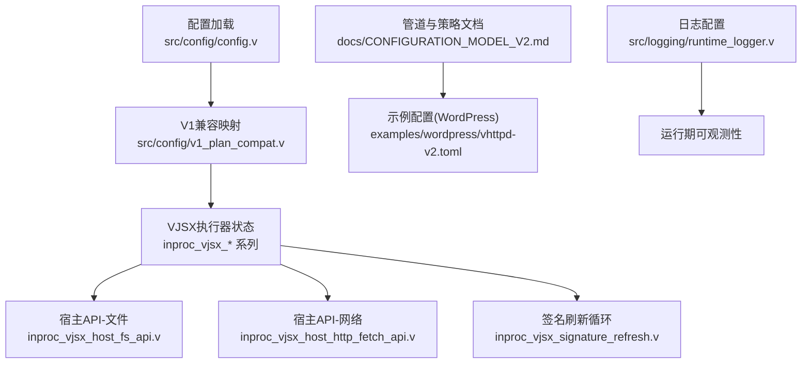
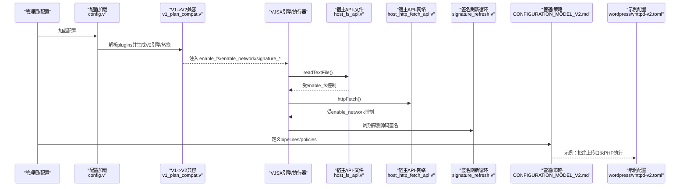
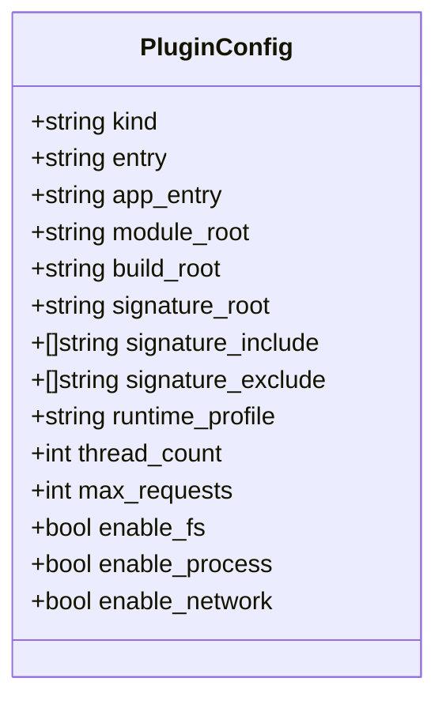
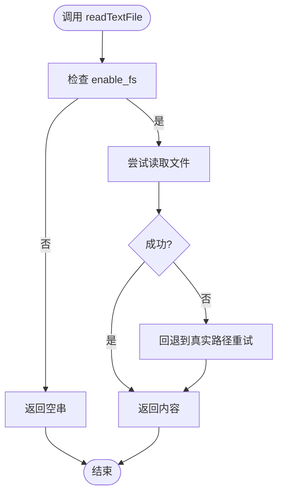
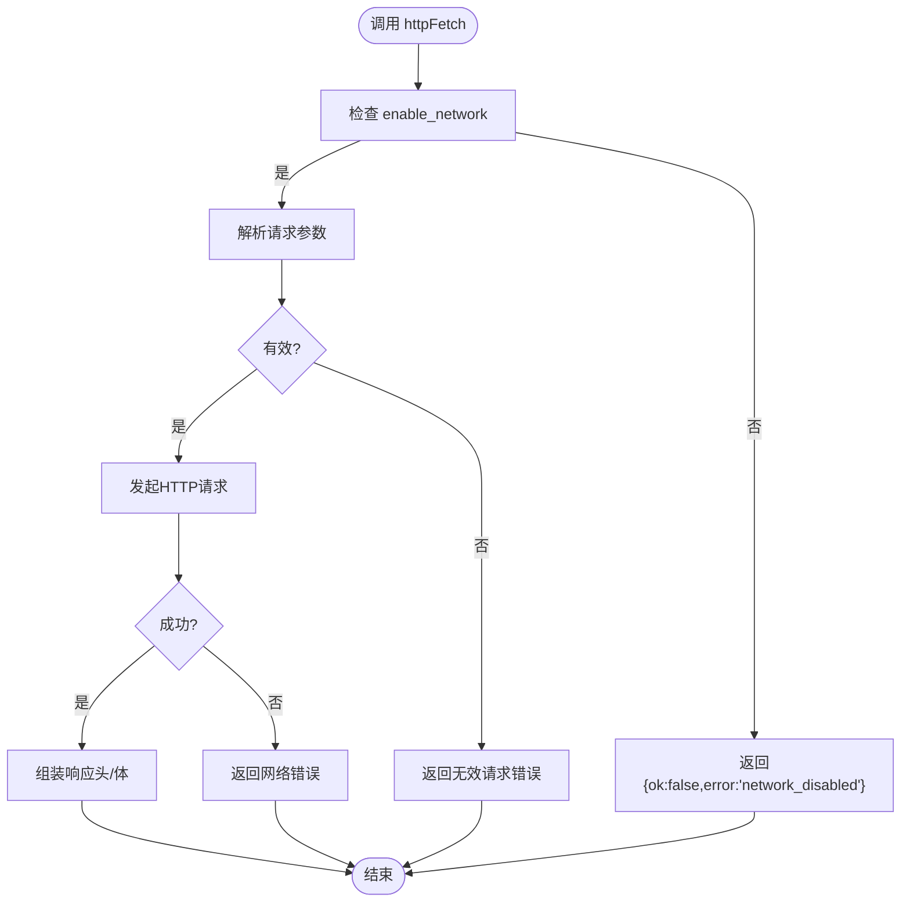
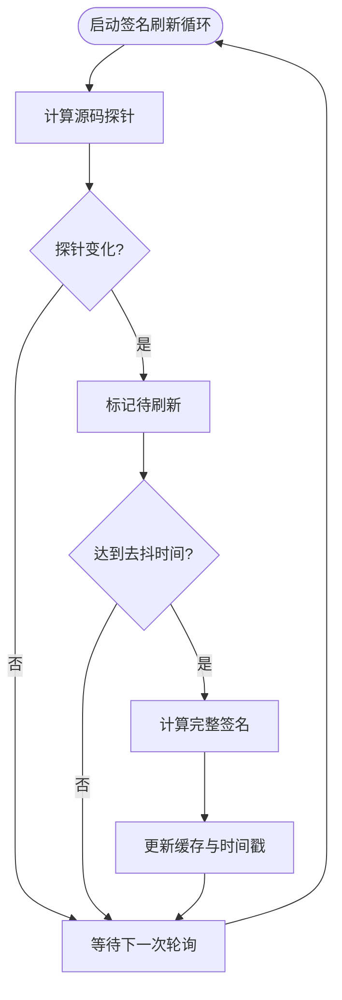
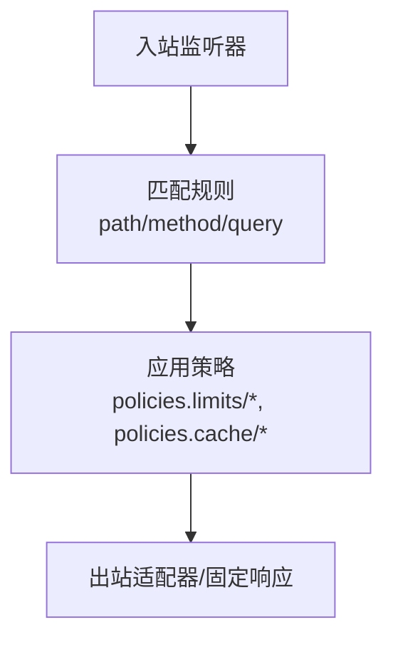
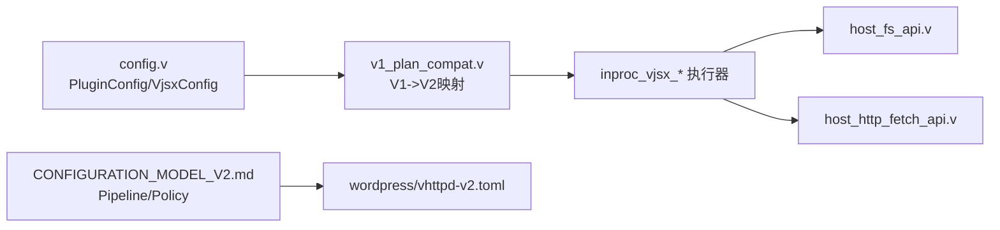

# 插件安全配置

<cite>
**本文引用的文件**   
- [src/config/config.v](file://src/config/config.v)
- [src/config/v1_plan_compat.v](file://src/config/v1_plan_compat.v)
- [src/executor/inproc_vjsx_host_fs_api.v](file://src/executor/inproc_vjsx_host_fs_api.v)
- [src/executor/inproc_vjsx_host_http_fetch_api.v](file://src/executor/inproc_vjsx_host_http_fetch_api.v)
- [src/executor/inproc_vjsx_signature_refresh.v](file://src/executor/inproc_vjsx_signature_refresh.v)
- [src/logging/runtime_logger.v](file://src/logging/runtime_logger.v)
- [examples/wordpress/vhttpd-v2.toml](file://examples/wordpress/vhttpd-v2.toml)
- [docs/CONFIGURATION_MODEL_V2.md](file://docs/CONFIGURATION_MODEL_V2.md)
</cite>

## 目录
1. [简介](#简介)
2. [项目结构](#项目结构)
3. [核心组件](#核心组件)
4. [架构总览](#架构总览)
5. [详细组件分析](#详细组件分析)
6. [依赖关系分析](#依赖关系分析)
7. [性能与资源限制](#性能与资源限制)
8. [故障排查指南](#故障排查指南)
9. [结论](#结论)
10. [附录：最佳实践与安全模板](#附录最佳实践与安全模板)

## 简介
本文件聚焦于 vhttpd 的“插件安全配置”，围绕以下目标展开：
- 权限控制机制：访问验证、操作授权、资源访问控制
- 沙箱隔离策略：文件系统访问限制、网络请求控制、系统调用过滤
- 资源限制配置：CPU/内存/并发连接数等
- 插件签名验证：代码完整性检查、来源可信度、版本兼容性
- 安全审计：操作日志记录、异常行为检测、安全事件告警
- 安全最佳实践：最小权限原则、安全配置模板、漏洞防护策略

## 项目结构
与插件安全相关的关键位置：
- 配置模型与解析：定义插件能力开关（如 enable_fs、enable_network）及签名校验根路径等
- VJSX 执行器宿主 API：在运行时对文件系统与网络进行白名单式放行
- 签名刷新循环：周期性探测源码变更并计算签名，用于热更新与完整性感知
- 管道与策略：通过 pipeline + policy 组合实现细粒度路由与访问控制
- 日志级别与输出：统一日志等级配置，便于安全审计

图表来源
- [src/config/config.v:88-104](file://src/config/config.v#L88-L104)
- [src/config/v1_plan_compat.v:477-502](file://src/config/v1_plan_compat.v#L477-L502)
- [src/executor/inproc_vjsx_host_fs_api.v:1-58](file://src/executor/inproc_vjsx_host_fs_api.v#L1-L58)
- [src/executor/inproc_vjsx_host_http_fetch_api.v:1-81](file://src/executor/inproc_vjsx_host_http_fetch_api.v#L1-L81)
- [src/executor/inproc_vjsx_signature_refresh.v:1-96](file://src/executor/inproc_vjsx_signature_refresh.v#L1-L96)
- [docs/CONFIGURATION_MODEL_V2.md:568-618](file://docs/CONFIGURATION_MODEL_V2.md#L568-L618)
- [examples/wordpress/vhttpd-v2.toml:255-313](file://examples/wordpress/vhttpd-v2.toml#L255-L313)
- [src/logging/runtime_logger.v:1-42](file://src/logging/runtime_logger.v#L1-L42)

章节来源
- [src/config/config.v:88-104](file://src/config/config.v#L88-L104)
- [src/config/v1_plan_compat.v:477-502](file://src/config/v1_plan_compat.v#L477-L502)
- [docs/CONFIGURATION_MODEL_V2.md:568-618](file://docs/CONFIGURATION_MODEL_V2.md#L568-L618)
- [examples/wordpress/vhttpd-v2.toml:255-313](file://examples/wordpress/vhttpd-v2.toml#L255-L313)
- [src/logging/runtime_logger.v:1-42](file://src/logging/runtime_logger.v#L1-L42)

## 核心组件
- 插件配置结构体：包含 kind、entry、module_root、build_root、signature_root/include/exclude、runtime_profile、thread_count、max_requests、enable_fs、enable_process、enable_network 等字段，用于声明插件能力与签名范围。
- V1 到 V2 计划兼容层：将旧版 plugins 配置转换为 V2 引擎与转换规则，透传 enable_fs/enable_process/enable_network 以及 signature_* 参数。
- 宿主 API 网关：
  - 文件系统读取：readTextFile 仅在 enable_fs=true 时生效，否则返回空串。
  - HTTP 外发：httpFetch 仅在 enable_network=true 时生效，否则返回错误响应。
- 签名刷新循环：周期性探测源码探针与完整签名，支持热更新与完整性感知。
- 管道与策略：通过 pipelines/policies 组合实现访问控制、限流、缓存策略等。
- 日志：提供统一的日志等级解析与设置，便于安全审计。

章节来源
- [src/config/config.v:88-104](file://src/config/config.v#L88-L104)
- [src/config/v1_plan_compat.v:477-502](file://src/config/v1_plan_compat.v#L477-L502)
- [src/executor/inproc_vjsx_host_fs_api.v:1-58](file://src/executor/inproc_vjsx_host_fs_api.v#L1-L58)
- [src/executor/inproc_vjsx_host_http_fetch_api.v:1-81](file://src/executor/inproc_vjsx_host_http_fetch_api.v#L1-L81)
- [src/executor/inproc_vjsx_signature_refresh.v:1-96](file://src/executor/inproc_vjsx_signature_refresh.v#L1-L96)
- [docs/CONFIGURATION_MODEL_V2.md:568-618](file://docs/CONFIGURATION_MODEL_V2.md#L568-L618)
- [src/logging/runtime_logger.v:1-42](file://src/logging/runtime_logger.v#L1-L42)

## 架构总览
下图展示了插件从配置到运行期的关键安全边界与控制点：

图表来源
- [src/config/config.v:88-104](file://src/config/config.v#L88-L104)
- [src/config/v1_plan_compat.v:477-502](file://src/config/v1_plan_compat.v#L477-L502)
- [src/executor/inproc_vjsx_host_fs_api.v:1-58](file://src/executor/inproc_vjsx_host_fs_api.v#L1-L58)
- [src/executor/inproc_vjsx_host_http_fetch_api.v:1-81](file://src/executor/inproc_vjsx_host_http_fetch_api.v#L1-L81)
- [src/executor/inproc_vjsx_signature_refresh.v:1-96](file://src/executor/inproc_vjsx_signature_refresh.v#L1-L96)
- [docs/CONFIGURATION_MODEL_V2.md:568-618](file://docs/CONFIGURATION_MODEL_V2.md#L568-L618)
- [examples/wordpress/vhttpd-v2.toml:255-313](file://examples/wordpress/vhttpd-v2.toml#L255-L313)

## 详细组件分析

### 组件A：插件配置与能力开关
- 关键字段
  - enable_fs：是否允许插件读取本地文件
  - enable_process：是否允许插件创建进程（当前未暴露宿主API，默认关闭更安全）
  - enable_network：是否允许插件发起HTTP外发请求
  - signature_root/include/exclude：签名校验的文件范围
  - thread_count/max_requests：线程与请求级并发上限
- 作用域
  - 全局 plugins 与站点 site.plugins 均可声明
  - V1 兼容层会将这些字段映射为 V2 引擎选项

图表来源
- [src/config/config.v:88-104](file://src/config/config.v#L88-L104)

章节来源
- [src/config/config.v:88-104](file://src/config/config.v#L88-L104)
- [src/config/v1_plan_compat.v:477-502](file://src/config/v1_plan_compat.v#L477-L502)

### 组件B：文件系统访问控制（沙箱）
- 控制点
  - 宿主API readTextFile 在调用前检查 enable_fs
  - 若禁用，直接返回空字符串，避免任何IO泄露
- 建议
  - 生产环境默认关闭 enable_fs
  - 仅对确需读文件的插件开启，并通过签名范围限定可信文件集

图表来源
- [src/executor/inproc_vjsx_host_fs_api.v:1-58](file://src/executor/inproc_vjsx_host_fs_api.v#L1-L58)

章节来源
- [src/executor/inproc_vjsx_host_fs_api.v:1-58](file://src/executor/inproc_vjsx_host_fs_api.v#L1-L58)

### 组件C：网络请求控制（沙箱）
- 控制点
  - 宿主API httpFetch 在调用前检查 enable_network
  - 若禁用，返回结构化错误响应（ok=false, error="network_disabled"）
- 建议
  - 默认关闭 enable_network
  - 如需启用，结合上游代理与域名白名单策略（由上层网关或反向代理实现）

图表来源
- [src/executor/inproc_vjsx_host_http_fetch_api.v:1-81](file://src/executor/inproc_vjsx_host_http_fetch_api.v#L1-L81)

章节来源
- [src/executor/inproc_vjsx_host_http_fetch_api.v:1-81](file://src/executor/inproc_vjsx_host_http_fetch_api.v#L1-L81)

### 组件D：插件签名验证与热更新
- 功能
  - 周期性探测源码探针变化与完整签名
  - 当探针变化或达到全量刷新阈值时重新计算签名
  - 供执行器判断是否需要重置 lane/host 以应用新代码
- 建议
  - 使用 signature_root/include/exclude 精确限定可信文件集合
  - 结合外部CI/CD对产物进行数字签名与校验（可在上层流程中实现）

图表来源
- [src/executor/inproc_vjsx_signature_refresh.v:1-96](file://src/executor/inproc_vjsx_signature_refresh.v#L1-L96)

章节来源
- [src/executor/inproc_vjsx_signature_refresh.v:1-96](file://src/executor/inproc_vjsx_signature_refresh.v#L1-L96)

### 组件E：管道与策略（访问控制与资源限制）
- 概念
  - Pipeline：按 ingress/match 顺序匹配，决定 egress 适配器或 transform
  - Policy：复用型策略块，常用于限流、缓存、响应头等
- 示例
  - WordPress 示例中通过 deny 管道禁止上传目录下的 PHP 执行
  - 可通过 policies.limits.* 定义最大请求体大小、超时等

图表来源
- [docs/CONFIGURATION_MODEL_V2.md:568-618](file://docs/CONFIGURATION_MODEL_V2.md#L568-L618)
- [examples/wordpress/vhttpd-v2.toml:255-313](file://examples/wordpress/vhttpd-v2.toml#L255-L313)

章节来源
- [docs/CONFIGURATION_MODEL_V2.md:568-618](file://docs/CONFIGURATION_MODEL_V2.md#L568-L618)
- [examples/wordpress/vhttpd-v2.toml:255-313](file://examples/wordpress/vhttpd-v2.toml#L255-L313)

### 组件F：安全审计与日志
- 日志等级
  - 支持 debug/info/warn/error/fatal
  - 生产环境默认 warn，开发环境默认 info
- 用途
  - 记录插件生命周期、错误与异常
  - 配合外部日志收集系统进行安全审计与告警

章节来源
- [src/logging/runtime_logger.v:1-42](file://src/logging/runtime_logger.v#L1-L42)

## 依赖关系分析
- 配置到执行器的依赖链
  - config.v 定义 PluginConfig/VjsxConfig 等结构
  - v1_plan_compat.v 将旧版 plugins 映射为 V2 引擎与转换，透传 enable_* 与 signature_*
  - inproc_vjsx_* 系列在运行时依据配置决定是否放行 IO/网络
- 管道与策略作为横切关注点，独立于插件能力开关，但共同构成访问控制面

图表来源
- [src/config/config.v:88-104](file://src/config/config.v#L88-L104)
- [src/config/v1_plan_compat.v:477-502](file://src/config/v1_plan_compat.v#L477-L502)
- [src/executor/inproc_vjsx_host_fs_api.v:1-58](file://src/executor/inproc_vjsx_host_fs_api.v#L1-L58)
- [src/executor/inproc_vjsx_host_http_fetch_api.v:1-81](file://src/executor/inproc_vjsx_host_http_fetch_api.v#L1-L81)
- [docs/CONFIGURATION_MODEL_V2.md:568-618](file://docs/CONFIGURATION_MODEL_V2.md#L568-L618)
- [examples/wordpress/vhttpd-v2.toml:255-313](file://examples/wordpress/vhttpd-v2.toml#L255-L313)

章节来源
- [src/config/config.v:88-104](file://src/config/config.v#L88-L104)
- [src/config/v1_plan_compat.v:477-502](file://src/config/v1_plan_compat.v#L477-L502)
- [docs/CONFIGURATION_MODEL_V2.md:568-618](file://docs/CONFIGURATION_MODEL_V2.md#L568-L618)

## 性能与资源限制
- 线程与请求上限
  - thread_count：插件运行时的线程数
  - max_requests：单实例最大请求数（用于优雅重启/回收）
- 管道策略
  - 通过 policies.limits.* 可配置 max_body_bytes、timeout_ms 等
- 建议
  - 根据业务峰值与机器资源合理设置 thread_count 与 max_requests
  - 针对敏感接口使用更严格的 timeout 与 body 大小限制

章节来源
- [src/config/config.v:88-104](file://src/config/config.v#L88-L104)
- [docs/CONFIGURATION_MODEL_V2.md:568-618](file://docs/CONFIGURATION_MODEL_V2.md#L568-L618)

## 故障排查指南
- 常见问题定位
  - 插件无法读取文件：确认 enable_fs 是否开启；查看宿主API返回是否为空串
  - 插件无法发起HTTP请求：确认 enable_network 是否开启；查看返回的错误码
  - 签名未生效：检查 signature_root/include/exclude 是否覆盖目标文件；观察签名刷新日志
  - 访问被拒绝：检查对应 pipeline 的 match 与 egress 配置，确认 deny 策略是否命中
- 日志与可观测性
  - 调整日志等级至 debug/info 以便定位问题
  - 结合管道策略与示例配置进行回归验证

章节来源
- [src/executor/inproc_vjsx_host_fs_api.v:1-58](file://src/executor/inproc_vjsx_host_fs_api.v#L1-L58)
- [src/executor/inproc_vjsx_host_http_fetch_api.v:1-81](file://src/executor/inproc_vjsx_host_http_fetch_api.v#L1-L81)
- [src/executor/inproc_vjsx_signature_refresh.v:1-96](file://src/executor/inproc_vjsx_signature_refresh.v#L1-L96)
- [examples/wordpress/vhttpd-v2.toml:255-313](file://examples/wordpress/vhttpd-v2.toml#L255-L313)
- [src/logging/runtime_logger.v:1-42](file://src/logging/runtime_logger.v#L1-L42)

## 结论
vhttpd 的插件安全体系以“配置驱动+宿主API白名单”为核心，结合管道/策略实现细粒度的访问控制与资源限制。通过 enable_fs/enable_network 等开关与 signature_* 范围限定，可有效降低插件越权风险；配合日志与策略示例，可快速落地最小权限与纵深防御。

## 附录：最佳实践与安全模板
- 最小权限原则
  - 默认关闭 enable_fs 与 enable_network，按需开启
  - 使用 signature_root/include/exclude 精确限定可信文件集合
- 安全配置模板（要点）
  - 在站点或全局 plugins 中声明 enable_* 与 signature_*
  - 在 pipelines 中为敏感路径添加 deny 或固定响应
  - 在 policies.limits.* 中设置合理的 max_body_bytes 与 timeout_ms
- 漏洞防护策略
  - 禁止上传目录执行脚本（参考 WordPress 示例）
  - 对外部网络访问进行白名单与代理转发
  - 定期轮换密钥与令牌，限制管理端口访问范围

章节来源
- [src/config/config.v:88-104](file://src/config/config.v#L88-L104)
- [docs/CONFIGURATION_MODEL_V2.md:568-618](file://docs/CONFIGURATION_MODEL_V2.md#L568-L618)
- [examples/wordpress/vhttpd-v2.toml:255-313](file://examples/wordpress/vhttpd-v2.toml#L255-L313)