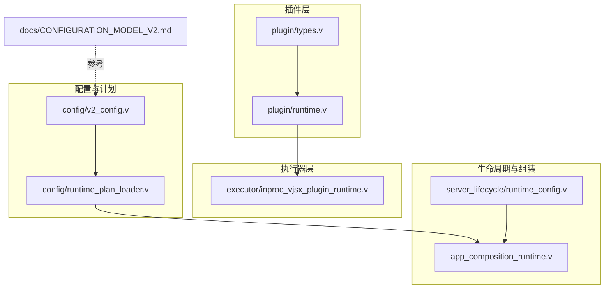
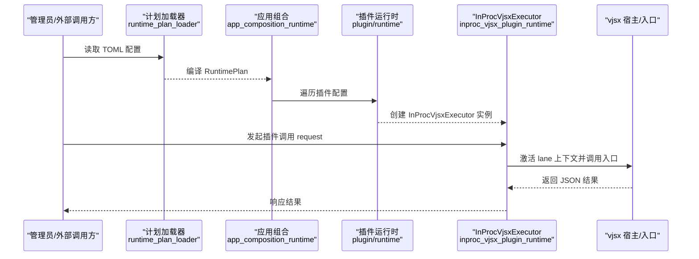
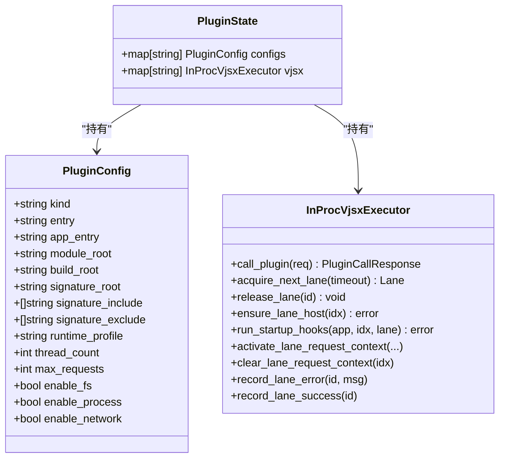
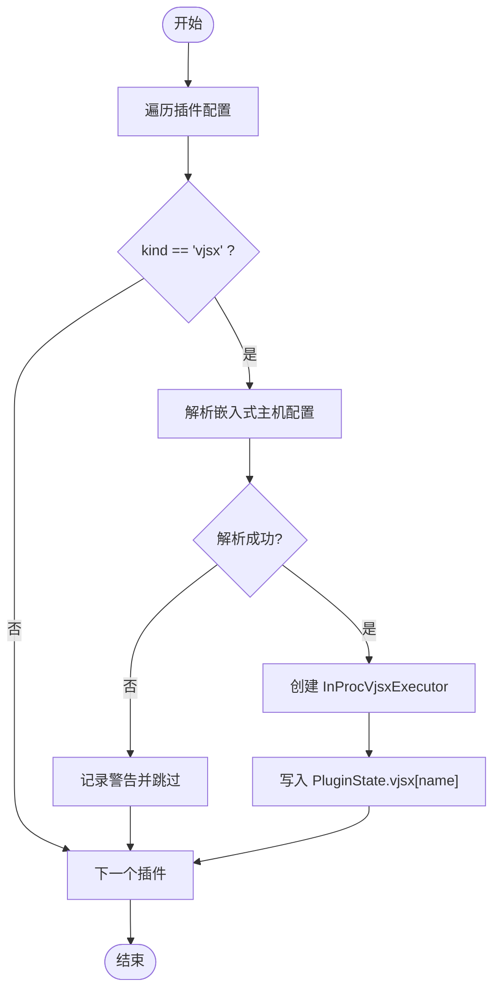
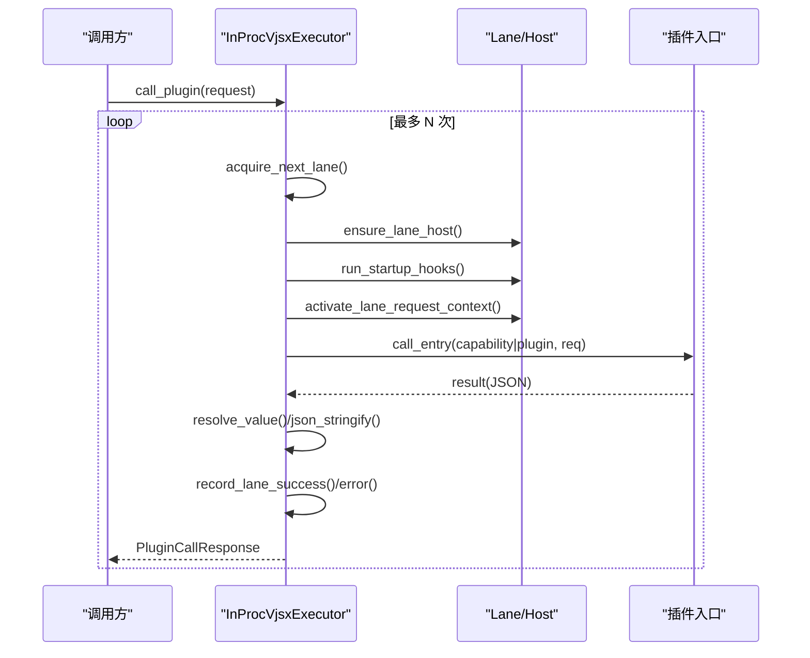
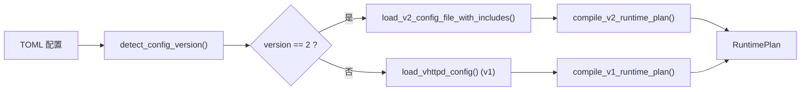

# 插件架构设计

<cite>
**本文引用的文件列表**
- [README.md](file://README.md)
- [src/plugin/runtime.v](file://src/plugin/runtime.v)
- [src/plugin/types.v](file://src/plugin/types.v)
- [src/executor/inproc_vjsx_plugin_runtime.v](file://src/executor/inproc_vjsx_plugin_runtime.v)
- [src/config/v2_config.v](file://src/config/v2_config.v)
- [src/config/runtime_plan_loader.v](file://src/config/runtime_plan_loader.v)
- [src/server_lifecycle/runtime_config.v](file://src/server_lifecycle/runtime_config.v)
- [src/app_composition_runtime.v](file://src/app_composition_runtime.v)
- [docs/CONFIGURATION_MODEL_V2.md](file://docs/CONFIGURATION_MODEL_V2.md)
- [examples/codexbot-app-ts/codex/ts/v2/SandboxPolicy.ts](file://examples/codexbot-app-ts/codex/ts/v2/SandboxPolicy.ts)
</cite>

## 目录
1. [简介](#简介)
2. [项目结构](#项目结构)
3. [核心组件](#核心组件)
4. [架构总览](#架构总览)
5. [详细组件分析](#详细组件分析)
6. [依赖关系分析](#依赖关系分析)
7. [性能与隔离特性](#性能与隔离特性)
8. [故障排查指南](#故障排查指南)
9. [结论](#结论)
10. [附录](#附录)

## 简介
本文件围绕 vhttpd 的“插件系统”进行系统化设计与实现说明，聚焦以下目标：
- 插件生命周期管理、依赖注入机制、资源隔离策略
- 插件状态管理（配置存储、运行时状态维护、热重载支持）
- 插件注册表（发现算法、加载顺序控制、版本兼容性检查）
- 插件间通信（事件总线、消息传递、共享状态）
- 安全模型（权限控制、沙箱隔离、资源限制）

vhttpd 将请求逻辑抽象为“执行器”，当前内置 php-worker 与 in-process vjsx 两种执行器。其中，“插件”以 in-process vjsx 为载体，通过统一的运行时门面与宿主交互，具备可插拔、可观测、可替换的能力。

## 项目结构
与插件系统直接相关的代码主要分布在如下模块：
- 插件类型与运行时装配：src/plugin/*
- 插件调用路径（in-process vjsx）：src/executor/inproc_vjsx_plugin_runtime.v
- 配置模型与计划编译：src/config/v2_config.v、src/config/runtime_plan_loader.v
- 服务器生命周期与构建参数：src/server_lifecycle/runtime_config.v
- 应用组合与运行时中心：src/app_composition_runtime.v
- 文档与示例：docs/CONFIGURATION_MODEL_V2.md、examples/...

图表来源
- [src/plugin/types.v:1-12](file://src/plugin/types.v#L1-L12)
- [src/plugin/runtime.v:1-62](file://src/plugin/runtime.v#L1-L62)
- [src/executor/inproc_vjsx_plugin_runtime.v:1-92](file://src/executor/inproc_vjsx_plugin_runtime.v#L1-L92)
- [src/config/v2_config.v:1-318](file://src/config/v2_config.v#L1-L318)
- [src/config/runtime_plan_loader.v:1-46](file://src/config/runtime_plan_loader.v#L1-L46)
- [src/server_lifecycle/runtime_config.v:1-52](file://src/server_lifecycle/runtime_config.v#L1-L52)
- [src/app_composition_runtime.v:1-47](file://src/app_composition_runtime.v#L1-L47)
- [docs/CONFIGURATION_MODEL_V2.md:218-275](file://docs/CONFIGURATION_MODEL_V2.md#L218-L275)

章节来源
- [README.md:1-126](file://README.md#L1-L126)
- [src/plugin/types.v:1-12](file://src/plugin/types.v#L1-L12)
- [src/plugin/runtime.v:1-62](file://src/plugin/runtime.v#L1-L62)
- [src/executor/inproc_vjsx_plugin_runtime.v:1-92](file://src/executor/inproc_vjsx_plugin_runtime.v#L1-L92)
- [src/config/v2_config.v:1-318](file://src/config/v2_config.v#L1-L318)
- [src/config/runtime_plan_loader.v:1-46](file://src/config/runtime_plan_loader.v#L1-L46)
- [src/server_lifecycle/runtime_config.v:1-52](file://src/server_lifecycle/runtime_config.v#L1-L52)
- [src/app_composition_runtime.v:1-47](file://src/app_composition_runtime.v#L1-L47)
- [docs/CONFIGURATION_MODEL_V2.md:218-275](file://docs/CONFIGURATION_MODEL_V2.md#L218-L275)

## 核心组件
- 插件状态与配置映射
  - PluginState 持有每个插件的配置与对应的 in-process vjsx 执行器实例，提供按名称索引的访问能力。
- 插件运行时装配
  - 根据配置生成 vjsx 运行门面配置，并创建 InProcVjsxExecutor 实例；对无效或不可用的插件跳过并记录告警。
- 插件调用入口
  - 通过 InProcVjsxExecutor 的 call_plugin 方法，在 lane 上启动/复用宿主上下文，解析请求对象，调用插件入口（默认 plugin 或 capability 路由），返回 JSON 结果。
- 配置与计划
  - V2 配置模型定义引擎、适配器、管道、策略等；计划加载器负责从 TOML 解析并编译为运行时计划，兼容 v1/v2 版本。
- 生命周期与构建参数
  - ServerRuntimeConfig/AppRuntimeBuildConfig 贯穿进程级与站点级构建参数，包括 admin、assets、worker 行为等。
- 应用组合
  - DataPlaneRuntime 聚合传输、WebSocket、上游、协议、提供者、引擎、资产、管道、转换器、计划替换等运行时组件。

章节来源
- [src/plugin/types.v:1-12](file://src/plugin/types.v#L1-L12)
- [src/plugin/runtime.v:1-62](file://src/plugin/runtime.v#L1-L62)
- [src/executor/inproc_vjsx_plugin_runtime.v:1-92](file://src/executor/inproc_vjsx_plugin_runtime.v#L1-L92)
- [src/config/v2_config.v:1-318](file://src/config/v2_config.v#L1-L318)
- [src/config/runtime_plan_loader.v:1-46](file://src/config/runtime_plan_loader.v#L1-L46)
- [src/server_lifecycle/runtime_config.v:1-52](file://src/server_lifecycle/runtime_config.v#L1-L52)
- [src/app_composition_runtime.v:1-47](file://src/app_composition_runtime.v#L1-L47)

## 架构总览
下图展示了插件在 vhttpd 中的位置与关键交互：配置驱动的计划编译、插件运行时装配、以及基于 in-process vjsx 的插件调用路径。

图表来源
- [src/config/runtime_plan_loader.v:1-46](file://src/config/runtime_plan_loader.v#L1-L46)
- [src/app_composition_runtime.v:1-47](file://src/app_composition_runtime.v#L1-L47)
- [src/plugin/runtime.v:1-62](file://src/plugin/runtime.v#L1-L62)
- [src/executor/inproc_vjsx_plugin_runtime.v:1-92](file://src/executor/inproc_vjsx_plugin_runtime.v#L1-L92)

## 详细组件分析

### 插件类型与状态管理
- PluginState
  - configs：按插件名映射到配置项（包含 entry/app_entry、module_root、build_root、签名根、线程数、最大请求数、FS/进程/网络开关等）。
  - vjsx：按插件名映射到已创建的 InProcVjsxExecutor 实例。
- 作用
  - 作为插件注册表的内存视图，支撑后续发现、加载、调用与热更新。

图表来源
- [src/plugin/types.v:1-12](file://src/plugin/types.v#L1-L12)
- [src/plugin/runtime.v:1-62](file://src/plugin/runtime.v#L1-L62)
- [src/executor/inproc_vjsx_plugin_runtime.v:1-92](file://src/executor/inproc_vjsx_plugin_runtime.v#L1-L92)

章节来源
- [src/plugin/types.v:1-12](file://src/plugin/types.v#L1-L12)
- [src/plugin/runtime.v:1-62](file://src/plugin/runtime.v#L1-L62)

### 插件运行时装配与依赖注入
- 装配流程
  - 遍历所有插件配置，过滤非 vjsx 类型。
  - 使用 EmbeddedHostRuntimeConfig.resolve 合并 CLI 覆盖与默认值，生成 VjsxRuntimeFacadeConfig。
  - 若失败则记录警告并跳过该插件；成功则创建 InProcVjsxExecutor 并加入 map。
- 依赖注入点
  - 通过 VjsxRuntimeFacadeConfig 注入文件系统、进程、网络等能力开关，形成“最小权限”的依赖注入面。
  - 线程池/队列/超时等由上层 EngineSpec 与 ServerRuntimeConfig 共同决定。

图表来源
- [src/plugin/runtime.v:1-62](file://src/plugin/runtime.v#L1-L62)

章节来源
- [src/plugin/runtime.v:1-62](file://src/plugin/runtime.v#L1-L62)

### 插件调用路径与生命周期
- 调用序列
  - 获取 lane（带等待超时），确保 lane 宿主已就绪，运行启动钩子。
  - 激活请求上下文（method/path/trace_id/request_id），构造 JSON 请求对象。
  - 优先尝试 capability 入口，缺失时回退到默认 plugin 入口。
  - 解析返回值并序列化，记录成功/错误统计。
- 重试与容错
  - 外层循环支持有限次重试，依据错误分类决定是否继续。

图表来源
- [src/executor/inproc_vjsx_plugin_runtime.v:1-92](file://src/executor/inproc_vjsx_plugin_runtime.v#L1-L92)

章节来源
- [src/executor/inproc_vjsx_plugin_runtime.v:1-92](file://src/executor/inproc_vjsx_plugin_runtime.v#L1-L92)

### 配置模型与版本兼容
- V2 配置模型
  - 定义 listeners、engines、adapters、transforms、policies、providers、pipelines、relays 等，统一描述运行时拓扑。
  - 引擎（engine）支持 vjsx 模式，包含 module_root/build_root/signature_*、thread_count/max_requests、enable_fs/process/network 等字段。
- 计划加载与兼容
  - 自动检测 version 字段：v2 走严格编译路径；无 version 则回退 v1 兼容路径。
  - 支持 include 与变量展开，最终产出 RuntimePlan 供运行时消费。

图表来源
- [src/config/runtime_plan_loader.v:1-46](file://src/config/runtime_plan_loader.v#L1-L46)
- [src/config/v2_config.v:1-318](file://src/config/v2_config.v#L1-L318)

章节来源
- [src/config/runtime_plan_loader.v:1-46](file://src/config/runtime_plan_loader.v#L1-L46)
- [src/config/v2_config.v:1-318](file://src/config/v2_config.v#L1-L318)
- [docs/CONFIGURATION_MODEL_V2.md:218-275](file://docs/CONFIGURATION_MODEL_V2.md#L218-L275)

### 服务器生命周期与构建参数
- ServerRuntimeConfig/AppRuntimeBuildConfig
  - 承载监听器、TLS、admin、assets、worker 行为、内部管理 socket、提供者设置、执行器计划等。
  - 这些参数影响插件运行时的资源配额、超时、重启策略等。

章节来源
- [src/server_lifecycle/runtime_config.v:1-52](file://src/server_lifecycle/runtime_config.v#L1-L52)

### 应用组合与运行时中心
- DataPlaneRuntime
  - 聚合传输、WebSocket、上游、协议、提供者、引擎、资产、管道、转换器、计划替换等运行时组件。
  - 插件运行时作为引擎的一种形态被纳入整体编排。

章节来源
- [src/app_composition_runtime.v:1-47](file://src/app_composition_runtime.v#L1-L47)

## 依赖关系分析
- 插件运行时依赖
  - plugin/runtime.v 依赖 config 与 executor，用于解析配置并创建执行器。
  - executor/inproc_vjsx_plugin_runtime.v 依赖宿主 API、lane 管理与错误分类。
- 配置到运行时的链路
  - config/v2_config.v 提供数据模型；config/runtime_plan_loader.v 负责解析与编译；server_lifecycle/runtime_config.v 提供进程级构建参数；app_composition_runtime.v 完成组装。

图表来源
- [src/config/v2_config.v:1-318](file://src/config/v2_config.v#L1-L318)
- [src/config/runtime_plan_loader.v:1-46](file://src/config/runtime_plan_loader.v#L1-L46)
- [src/server_lifecycle/runtime_config.v:1-52](file://src/server_lifecycle/runtime_config.v#L1-L52)
- [src/app_composition_runtime.v:1-47](file://src/app_composition_runtime.v#L1-L47)
- [src/plugin/runtime.v:1-62](file://src/plugin/runtime.v#L1-L62)
- [src/executor/inproc_vjsx_plugin_runtime.v:1-92](file://src/executor/inproc_vjsx_plugin_runtime.v#L1-L92)

章节来源
- [src/config/v2_config.v:1-318](file://src/config/v2_config.v#L1-L318)
- [src/config/runtime_plan_loader.v:1-46](file://src/config/runtime_plan_loader.v#L1-L46)
- [src/server_lifecycle/runtime_config.v:1-52](file://src/server_lifecycle/runtime_config.v#L1-L52)
- [src/app_composition_runtime.v:1-47](file://src/app_composition_runtime.v#L1-L47)
- [src/plugin/runtime.v:1-62](file://src/plugin/runtime.v#L1-L62)
- [src/executor/inproc_vjsx_plugin_runtime.v:1-92](file://src/executor/inproc_vjsx_plugin_runtime.v#L1-L92)

## 性能与隔离特性
- 并发与资源
  - 插件通过 lane 模型并发执行，线程数由 engine.thread_count 控制；max_requests 控制单实例生命周期内的请求上限，配合 worker 重启策略避免长驻泄漏。
- 资源隔离
  - 通过 enable_fs/enable_process/enable_network 三开关精细控制插件能力面，结合签名校验（signature_root/include/exclude）保障入口白名单。
- 超时与限流
  - 上层 pipeline 与 policy 可配置 timeout_ms、queue_capacity、max_in_flight 等，保护宿主不被过载。
- 可观测性
  - observability.event_log/log_level/tracing 提供事件日志与追踪采样，便于定位插件问题。

章节来源
- [src/config/v2_config.v:120-155](file://src/config/v2_config.v#L120-L155)
- [src/config/v2_config.v:218-259](file://src/config/v2_config.v#L218-L259)
- [docs/CONFIGURATION_MODEL_V2.md:218-275](file://docs/CONFIGURATION_MODEL_V2.md#L218-L275)

## 故障排查指南
- 插件不可用
  - 现象：构建阶段跳过某插件并记录警告。
  - 排查：确认 kind 是否为 vjsx；检查 entry/app_entry/module_root/build_root 是否存在；核对签名根与包含/排除规则。
- 插件调用失败
  - 现象：返回错误码 with “plugin_handler_failed” 或 “missing_*_handler”。
  - 排查：确认插件是否暴露 capability 或默认 plugin 入口；检查 lane 是否可用、宿主是否初始化成功；查看重试次数与错误分类。
- 超时与队列拥塞
  - 现象：请求排队或超时。
  - 排查：调整 queue_capacity/queue_timeout_ms/max_in_flight；评估 thread_count 与 max_requests；观察 event_log 与 tracing。
- 权限与沙箱
  - 现象：访问受限（FS/进程/网络）。
  - 排查：按需开启对应能力开关；结合签名白名单限制入口范围。

章节来源
- [src/plugin/runtime.v:1-62](file://src/plugin/runtime.v#L1-L62)
- [src/executor/inproc_vjsx_plugin_runtime.v:1-92](file://src/executor/inproc_vjsx_plugin_runtime.v#L1-L92)
- [src/config/v2_config.v:120-155](file://src/config/v2_config.v#L120-L155)
- [docs/CONFIGURATION_MODEL_V2.md:218-275](file://docs/CONFIGURATION_MODEL_V2.md#L218-L275)

## 结论
vhttpd 的插件系统以“配置驱动 + in-process vjsx 执行器”为核心，借助 V2 配置模型与计划编译器，实现了插件的发现、装配、调用与可观测闭环。通过细粒度的能力开关与签名校验，提供了良好的资源隔离与安全基线；结合 pipeline/policy 的超时与限流能力，保障了整体稳定性。未来可在注册表持久化、动态热重载、跨插件事件总线等方面进一步增强。

## 附录

### 插件生命周期管理
- 启动期
  - 加载配置 -> 编译计划 -> 遍历插件 -> 解析嵌入主机配置 -> 创建执行器 -> 注册至 PluginState。
- 运行期
  - 接收调用 -> 分配 lane -> 初始化宿主上下文 -> 调用入口 -> 返回结果 -> 清理上下文。
- 停止期
  - 受限于 engine.max_requests 与 worker 重启策略，逐步释放资源。

章节来源
- [src/plugin/runtime.v:1-62](file://src/plugin/runtime.v#L1-L62)
- [src/executor/inproc_vjsx_plugin_runtime.v:1-92](file://src/executor/inproc_vjsx_plugin_runtime.v#L1-L92)

### 依赖注入机制
- 注入面
  - 文件系统、进程、网络能力通过配置开关注入。
  - 线程池、队列、超时等由引擎与服务器构建参数注入。
- 扩展点
  - 可通过新的 host API 扩展注入面，保持最小权限原则。

章节来源
- [src/config/v2_config.v:120-155](file://src/config/v2_config.v#L120-L155)
- [src/server_lifecycle/runtime_config.v:1-52](file://src/server_lifecycle/runtime_config.v#L1-L52)

### 资源隔离策略
- 能力开关
  - enable_fs / enable_process / enable_network 控制三类资源访问。
- 入口白名单
  - signature_root + signature_include/exclude 限定可执行入口集合。
- 沙箱策略参考
  - 示例中定义了多种沙箱策略类型，可作为更细粒度控制的参考。

章节来源
- [src/config/v2_config.v:120-155](file://src/config/v2_config.v#L120-L155)
- [examples/codexbot-app-ts/codex/ts/v2/SandboxPolicy.ts:1-8](file://examples/codexbot-app-ts/codex/ts/v2/SandboxPolicy.ts#L1-L8)

### 插件注册表工作原理
- 发现算法
  - 遍历 PluginState.configs，筛选 kind=vjsx 的条目。
- 加载顺序控制
  - 按 map 遍历顺序加载；如需强序，可在配置层显式声明依赖并通过 pipeline 编排。
- 版本兼容性检查
  - 计划加载器根据 version 字段选择 v1/v2 编译路径，保证向后兼容。

章节来源
- [src/plugin/runtime.v:1-62](file://src/plugin/runtime.v#L1-L62)
- [src/config/runtime_plan_loader.v:1-46](file://src/config/runtime_plan_loader.v#L1-L46)

### 插件间通信机制
- 事件总线
  - 当前仓库未提供通用插件事件总线；建议通过 pipeline/policy 或外部消息中间件桥接。
- 消息传递
  - 插件可通过宿主提供的 HTTP/WebSocket/MCP 等通道与外部服务通信。
- 共享状态
  - 建议在宿主侧提供 session/store 能力，插件通过宿主 API 读写，避免直接共享内存。

[本节为概念性说明，不直接分析具体文件，故无章节来源]

### 安全模型
- 权限控制
  - 通过能力开关与签名白名单限制插件能力面。
- 沙箱隔离
  - 结合 FS/进程/网络开关与入口白名单，形成基础沙箱；可参考示例中的沙箱策略类型进行扩展。
- 资源限制
  - 通过 pipeline/policy 的超时、队列容量、并发度等指标限制资源消耗。

章节来源
- [src/config/v2_config.v:120-155](file://src/config/v2_config.v#L120-L155)
- [src/config/v2_config.v:218-259](file://src/config/v2_config.v#L218-L259)
- [examples/codexbot-app-ts/codex/ts/v2/SandboxPolicy.ts:1-8](file://examples/codexbot-app-ts/codex/ts/v2/SandboxPolicy.ts#L1-L8)