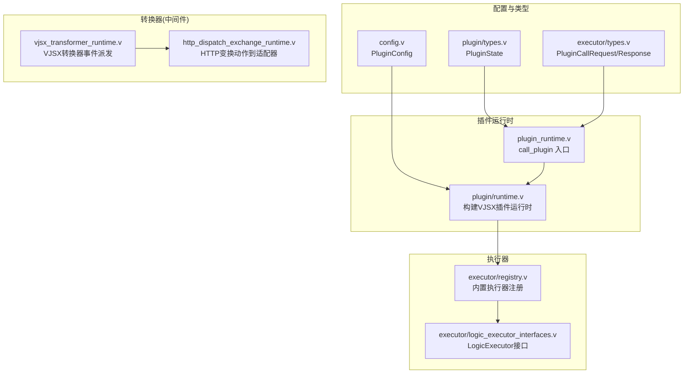
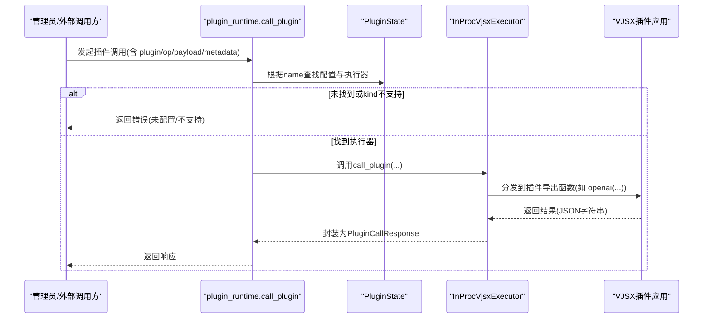
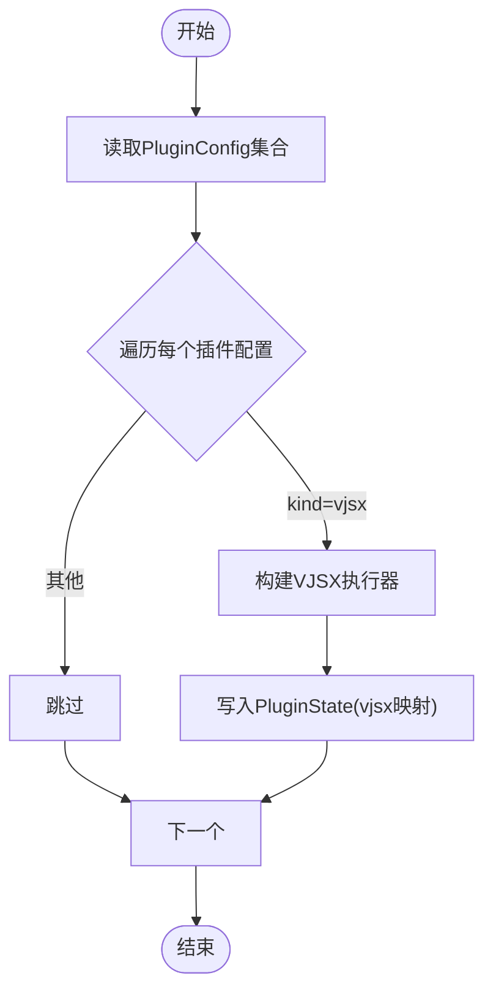
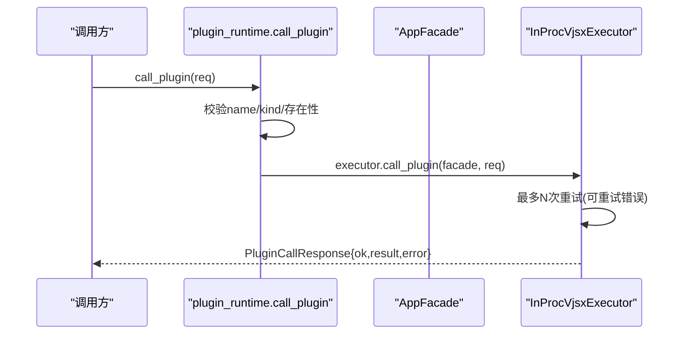
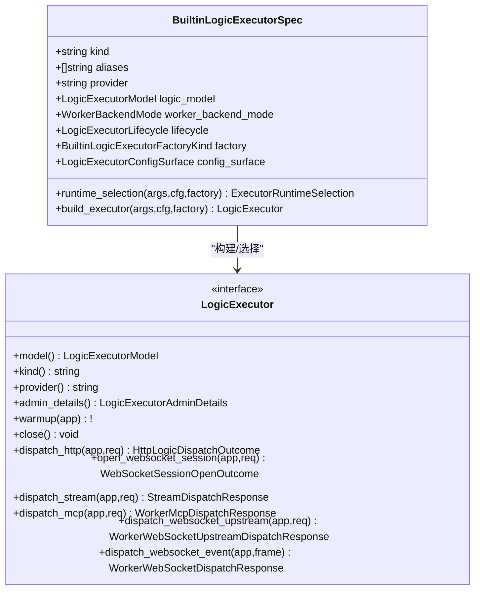
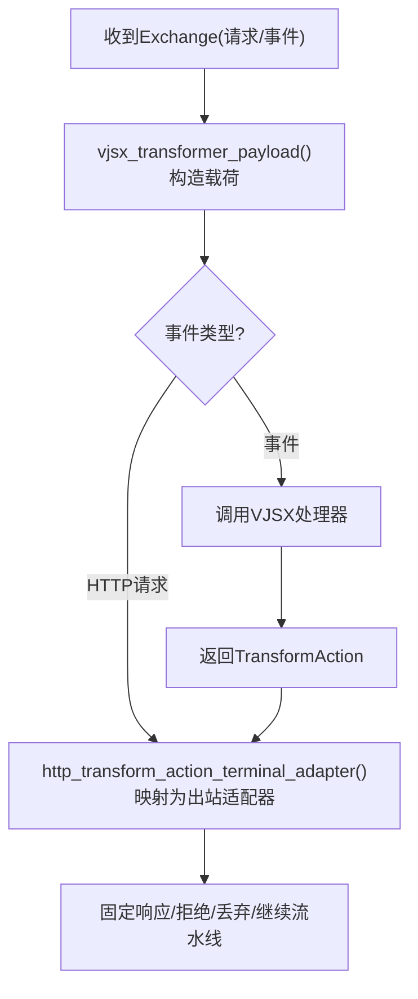
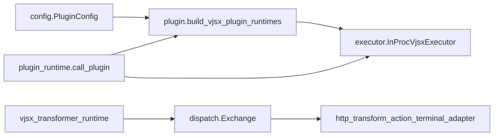

# 插件系统配置

<cite>
**本文引用的文件**   
- [src/config/config.v](file://src/config/config.v)
- [src/plugin/runtime.v](file://src/plugin/runtime.v)
- [src/plugin/types.v](file://src/plugin/types.v)
- [src/executor/types.v](file://src/executor/types.v)
- [src/executor/logic_executor_interfaces.v](file://src/executor/logic_executor_interfaces.v)
- [src/executor/registry.v](file://src/executor/registry.v)
- [src/plugin_runtime.v](file://src/plugin_runtime.v)
- [src/vjsx_transformer_runtime.v](file://src/vjsx_transformer_runtime.v)
- [src/http_dispatch_exchange_runtime.v](file://src/http_dispatch_exchange_runtime.v)
- [src/transformer_runtime_test.v](file://src/transformer_runtime_test.v)
- [src/dispatch/exchange_test.v](file://src/dispatch/exchange_test.v)
- [examples/vjsx/openai-gateway-plugin.mts](file://examples/vjsx/openai-gateway-plugin.mts)
- [examples/vjsx/openai-executor-app.mts](file://examples/vjsx/openai-executor-app.mts)
</cite>

## 目录
1. [简介](#简介)
2. [项目结构](#项目结构)
3. [核心组件](#核心组件)
4. [架构总览](#架构总览)
5. [详细组件分析](#详细组件分析)
6. [依赖关系分析](#依赖关系分析)
7. [性能与资源隔离](#性能与资源隔离)
8. [故障排查指南](#故障排查指南)
9. [结论](#结论)
10. [附录：开发示例与部署要点](#附录开发示例与部署要点)

## 简介
本文件面向 vhttpd 的“插件系统”提供完整配置与实现说明，覆盖以下主题：
- 插件注册机制：发现、加载顺序、依赖管理
- 执行器插件配置：自定义执行器实现、生命周期管理、资源隔离
- 中间件（转换器）插件：请求拦截、响应修改、错误处理
- 转换器插件：数据格式转换、协议适配、内容处理
- 安全配置：权限控制、沙箱隔离、资源限制
- 热重载：版本管理、平滑升级、回滚机制
- 完整的插件开发与部署示例

## 项目结构
围绕插件系统的核心代码主要分布在如下模块：
- 配置与类型定义：config.v、plugin/types.v、executor/types.v
- 插件运行时与调用入口：plugin/runtime.v、plugin_runtime.v
- 执行器注册与生命周期：executor/registry.v、executor/logic_executor_interfaces.v
- 转换器（中间件）运行时：vjsx_transformer_runtime.v、http_dispatch_exchange_runtime.v
- 示例插件与执行器应用：examples/vjsx/*.mts

图表来源
- [src/config/config.v:88-104](file://src/config/config.v#L88-L104)
- [src/plugin/types.v:6-12](file://src/plugin/types.v#L6-L12)
- [src/executor/types.v:355-379](file://src/executor/types.v#L355-L379)
- [src/plugin/runtime.v:1-62](file://src/plugin/runtime.v#L1-L62)
- [src/plugin_runtime.v:1-39](file://src/plugin_runtime.v#L1-L39)
- [src/executor/registry.v:65-128](file://src/executor/registry.v#L65-L128)
- [src/executor/logic_executor_interfaces.v:1-51](file://src/executor/logic_executor_interfaces.v#L1-L51)
- [src/vjsx_transformer_runtime.v:1-52](file://src/vjsx_transformer_runtime.v#L1-L52)
- [src/http_dispatch_exchange_runtime.v:97-122](file://src/http_dispatch_exchange_runtime.v#L97-L122)

章节来源
- [src/config/config.v:88-104](file://src/config/config.v#L88-L104)
- [src/plugin/types.v:6-12](file://src/plugin/types.v#L6-L12)
- [src/executor/types.v:355-379](file://src/executor/types.v#L355-L379)
- [src/plugin/runtime.v:1-62](file://src/plugin/runtime.v#L1-L62)
- [src/plugin_runtime.v:1-39](file://src/plugin_runtime.v#L1-L39)
- [src/executor/registry.v:65-128](file://src/executor/registry.v#L65-L128)
- [src/executor/logic_executor_interfaces.v:1-51](file://src/executor/logic_executor_interfaces.v#L1-L51)
- [src/vjsx_transformer_runtime.v:1-52](file://src/vjsx_transformer_runtime.v#L1-L52)
- [src/http_dispatch_exchange_runtime.v:97-122](file://src/http_dispatch_exchange_runtime.v#L97-L122)

## 核心组件
- 插件配置模型：PluginConfig 定义了插件 kind、entry/app_entry、模块根、构建根、签名根、包含/排除列表、运行期 profile、线程数、最大请求数以及文件系统/进程/网络能力开关。
- 插件状态容器：PluginState 持有所有插件的配置映射与已创建的 VJSX 执行器实例映射。
- 插件运行时构建：根据 PluginConfig 解析并创建 InProcVjsxExecutor 实例，支持按名称索引。
- 插件调用入口：统一通过 call_plugin 路由，校验 name/kind，查找对应执行器并转发请求。
- 执行器注册表：内置执行器（none/php/php-cgi/vjsx）及其工厂、配置面、生命周期与选择策略。
- 转换器（中间件）运行时：将 Exchange 事件转换为 VJSX 可识别的载荷，并在 HTTP 场景下把变换动作映射为出站适配器。

章节来源
- [src/config/config.v:88-104](file://src/config/config.v#L88-L104)
- [src/plugin/types.v:6-12](file://src/plugin/types.v#L6-L12)
- [src/plugin/runtime.v:14-62](file://src/plugin/runtime.v#L14-L62)
- [src/plugin_runtime.v:17-31](file://src/plugin_runtime.v#L17-L31)
- [src/executor/registry.v:65-128](file://src/executor/registry.v#L65-L128)
- [src/vjsx_transformer_runtime.v:22-52](file://src/vjsx_transformer_runtime.v#L22-L52)
- [src/http_dispatch_exchange_runtime.v:97-122](file://src/http_dispatch_exchange_runtime.v#L97-L122)

## 架构总览
下图展示了从配置到运行时、再到插件调用的整体流程，以及转换器在 HTTP 管道中的位置。

图表来源
- [src/plugin_runtime.v:17-31](file://src/plugin_runtime.v#L17-L31)
- [src/plugin/types.v:6-12](file://src/plugin/types.v#L6-L12)
- [src/executor/types.v:355-379](file://src/executor/types.v#L355-L379)
- [examples/vjsx/openai-gateway-plugin.mts:197-212](file://examples/vjsx/openai-gateway-plugin.mts#L197-L212)

## 详细组件分析

### 插件注册与发现
- 配置来源：通过 PluginConfig 声明插件元信息与运行参数。
- 运行时构建：build_vjsx_plugin_runtimes 遍历配置，仅对 kind 为 vjsx 的项构建执行器实例；失败时记录警告并跳过。
- 状态维护：PluginState 以 map[string]... 形式保存配置与执行器，便于按名称快速定位。
- 发现与顺序：当前实现基于配置键名集合进行迭代，无显式排序字段；如需严格顺序，可在上层编排中保证配置注入顺序或使用有序数据结构。

图表来源
- [src/plugin/runtime.v:48-62](file://src/plugin/runtime.v#L48-L62)
- [src/plugin/types.v:6-12](file://src/plugin/types.v#L6-L12)

章节来源
- [src/config/config.v:88-104](file://src/config/config.v#L88-L104)
- [src/plugin/runtime.v:48-62](file://src/plugin/runtime.v#L48-L62)
- [src/plugin/types.v:6-12](file://src/plugin/types.v#L6-L12)

### 插件调用与错误处理
- 入口校验：call_plugin 检查 name 是否为空、kind 是否受支持、是否存在对应执行器。
- 调用路径：最终委托给 InProcVjsxExecutor.call_plugin，内部会尝试多次重试（针对特定可重试错误），并将结果序列化为 JSON 字符串返回。
- 错误分类：包括未配置、不受支持的 kind、执行器不可用、插件处理器缺失或失败等。

图表来源
- [src/plugin_runtime.v:17-31](file://src/plugin_runtime.v#L17-L31)
- [src/executor/types.v:355-379](file://src/executor/types.v#L355-L379)
- [src/executor/inproc_vjsx_plugin_runtime.v:76-91](file://src/executor/inproc_vjsx_plugin_runtime.v#L76-L91)

章节来源
- [src/plugin_runtime.v:17-31](file://src/plugin_runtime.v#L17-L31)
- [src/executor/types.v:355-379](file://src/executor/types.v#L355-L379)
- [src/executor/inproc_vjsx_plugin_runtime.v:76-91](file://src/executor/inproc_vjsx_plugin_runtime.v#L76-L91)

### 执行器插件配置与生命周期
- 内置执行器：none、php、php-cgi、vjsx，分别对应不同的 worker/embedded 模式与后端要求。
- 配置面：每种执行器暴露一组 CLI 标志位用于覆盖配置（例如 vjsx 的 entry/module_root/build_root/signature_* 等）。
- 生命周期：通过 LogicExecutorLifecycleOps 暴露 warmup/close；具体实现由各执行器负责。
- 选择与构建：builtin_executor_spec.runtime_selection 根据 kind 选择并构建执行器实例。

图表来源
- [src/executor/registry.v:65-128](file://src/executor/registry.v#L65-L128)
- [src/executor/logic_executor_interfaces.v:1-51](file://src/executor/logic_executor_interfaces.v#L1-L51)

章节来源
- [src/executor/registry.v:65-128](file://src/executor/registry.v#L65-L128)
- [src/executor/logic_executor_interfaces.v:1-51](file://src/executor/logic_executor_interfaces.v#L1-L51)

### 中间件（转换器）插件：请求拦截、响应修改、错误处理
- 事件派发：vjsx_transformer_runtime 将 Exchange 转换为 VJSX 可识别的载荷，并根据事件类型选择 handler。
- HTTP 变换动作：http_dispatch_exchange_runtime 将变换动作（respond/reject/drop/continue_pipeline 等）映射为出站适配器，从而完成响应短路或继续流水线。
- 测试用例验证了 native 与 vjsx 两种 transform 的注册与可用性。

图表来源
- [src/vjsx_transformer_runtime.v:22-52](file://src/vjsx_transformer_runtime.v#L22-L52)
- [src/http_dispatch_exchange_runtime.v:97-122](file://src/http_dispatch_exchange_runtime.v#L97-L122)
- [src/transformer_runtime_test.v:8-27](file://src/transformer_runtime_test.v#L8-L27)

章节来源
- [src/vjsx_transformer_runtime.v:22-52](file://src/vjsx_transformer_runtime.v#L22-L52)
- [src/http_dispatch_exchange_runtime.v:97-122](file://src/http_dispatch_exchange_runtime.v#L97-L122)
- [src/transformer_runtime_test.v:8-27](file://src/transformer_runtime_test.v#L8-L27)
- [src/dispatch/exchange_test.v:458-477](file://src/dispatch/exchange_test.v#L458-L477)

### 转换器插件：数据格式转换、协议适配、内容处理
- 数据格式转换：通过变换动作直接生成响应或拒绝，或在 continue_pipeline 后交由后续环节处理。
- 协议适配：结合 OpenAI 网关插件示例，可在插件内完成不同后端（OpenAI/Ollama/自定义）的请求路由与帧映射。
- 内容处理：在映射阶段对上游帧进行转换，再输出为标准协议帧。

章节来源
- [examples/vjsx/openai-gateway-plugin.mts:171-212](file://examples/vjsx/openai-gateway-plugin.mts#L171-L212)
- [examples/vjsx/openai-executor-app.mts:51-101](file://examples/vjsx/openai-executor-app.mts#L51-L101)

### 插件安全配置：权限控制、沙箱隔离、资源限制
- 资源能力开关：PluginConfig 提供 enable_fs、enable_process、enable_network 三个布尔开关，用于限制插件访问文件系统、子进程与网络的能力。
- 并发与负载：thread_count 控制线程数，max_requests 控制单实例最大请求数，避免资源耗尽。
- 运行时配置：vjsx 执行器在解析配置时会透传这些能力开关至宿主环境，形成运行时约束。

章节来源
- [src/config/config.v:88-104](file://src/config/config.v#L88-L104)
- [src/plugin/runtime.v:14-46](file://src/plugin/runtime.v#L14-L46)

### 插件热重载：版本管理、平滑升级、回滚机制
- 热重载范围：当配置变更影响到的引擎/提供者/转换器需要重新加载时，系统会计算差异并执行轻量级替换或重启策略。
- 平滑升级：对于嵌入式引擎（如 vjsx）的转换器，通常无需 drain worker 即可热更新。
- 回滚机制：通过运行时计划替换快照与事件日志，可观察 apply/reject 状态与原因，必要时回退到上一版本。

章节来源
- [src/logic_executor_test.v:842-912](file://src/logic_executor_test.v#L842-L912)
- [src/logic_executor_test.v:950-1013](file://src/logic_executor_test.v#L950-L1013)
- [src/runtime_plan/replacement_test.v:440-476](file://src/runtime_plan/replacement_test.v#L440-L476)

## 依赖关系分析
- 插件运行时依赖配置模块解析 PluginConfig，并依赖执行器模块创建 InProcVjsxExecutor。
- 插件调用入口依赖 PluginState 获取执行器实例，并通过 executor 接口统一调度。
- 转换器运行时依赖 dispatch 抽象，将变换动作映射为出站适配器。

图表来源
- [src/config/config.v:88-104](file://src/config/config.v#L88-L104)
- [src/plugin/runtime.v:48-62](file://src/plugin/runtime.v#L48-L62)
- [src/plugin_runtime.v:17-31](file://src/plugin_runtime.v#L17-L31)
- [src/vjsx_transformer_runtime.v:22-52](file://src/vjsx_transformer_runtime.v#L22-L52)
- [src/http_dispatch_exchange_runtime.v:97-122](file://src/http_dispatch_exchange_runtime.v#L97-L122)

章节来源
- [src/config/config.v:88-104](file://src/config/config.v#L88-L104)
- [src/plugin/runtime.v:48-62](file://src/plugin/runtime.v#L48-L62)
- [src/plugin_runtime.v:17-31](file://src/plugin_runtime.v#L17-L31)
- [src/vjsx_transformer_runtime.v:22-52](file://src/vjsx_transformer_runtime.v#L22-L52)
- [src/http_dispatch_exchange_runtime.v:97-122](file://src/http_dispatch_exchange_runtime.v#L97-L122)

## 性能与资源隔离
- 线程与请求上限：通过 thread_count 与 max_requests 控制并发与生命周期，避免长连接与内存泄漏导致的资源膨胀。
- 能力最小化：关闭不必要的 enable_fs/enable_process/enable_network，降低攻击面与开销。
- 执行器选择：vjsx 为嵌入式模式，减少进程间通信成本；PHP 模式适合已有 PHP 生态集成。
- 重试与容错：插件调用具备有限次数的自动重试，提升稳定性。

章节来源
- [src/config/config.v:88-104](file://src/config/config.v#L88-L104)
- [src/executor/registry.v:197-261](file://src/executor/registry.v#L197-L261)
- [src/executor/inproc_vjsx_plugin_runtime.v:76-91](file://src/executor/inproc_vjsx_plugin_runtime.v#L76-L91)

## 故障排查指南
- 常见错误
  - 插件未配置或未启用：检查 name 与 kind，确认已在配置中声明且被构建。
  - 插件执行器不可用：确认 entry/app_entry 路径有效、模块根与构建根正确。
  - 插件处理器缺失：确保插件导出了期望的函数（如 openai）。
  - 变换动作不支持：HTTP 场景下某些动作会被映射为拒绝或丢弃。
- 定位方法
  - 查看事件日志与替换快照，确认热重载策略与失败原因。
  - 使用 admin 端点查看执行器规格与运行时摘要。

章节来源
- [src/plugin_runtime.v:17-31](file://src/plugin_runtime.v#L17-L31)
- [src/plugin/runtime.v:48-62](file://src/plugin/runtime.v#L48-L62)
- [src/http_dispatch_exchange_runtime.v:97-122](file://src/http_dispatch_exchange_runtime.v#L97-L122)
- [src/logic_executor_test.v:950-1013](file://src/logic_executor_test.v#L950-L1013)

## 结论
vhttpd 的插件系统以“配置驱动 + 执行器抽象 + 转换器中间件”为核心，提供了可扩展的执行环境与灵活的请求/事件处理链路。通过严格的资源能力开关与热重载机制，可以在保障稳定性的同时实现平滑演进。

## 附录：开发示例与部署要点
- 插件开发示例
  - OpenAI 网关插件：演示多后端路由、帧映射与降级回退。
  - 执行器应用：演示 chat.execute/responses.execute 的处理与流式输出。
- 部署要点
  - 在配置中声明 plugins 段，指定 kind=vjsx、entry/app_entry、module_root 等。
  - 按需开启/关闭 enable_fs/enable_process/enable_network。
  - 合理设置 thread_count 与 max_requests，结合监控指标调整。
  - 使用运行时计划替换进行热更新，关注事件日志与快照信息。

章节来源
- [examples/vjsx/openai-gateway-plugin.mts:1-212](file://examples/vjsx/openai-gateway-plugin.mts#L1-212)
- [examples/vjsx/openai-executor-app.mts:1-102](file://examples/vjsx/openai-executor-app.mts#L1-L102)
- [src/config/config.v:88-104](file://src/config/config.v#L88-L104)