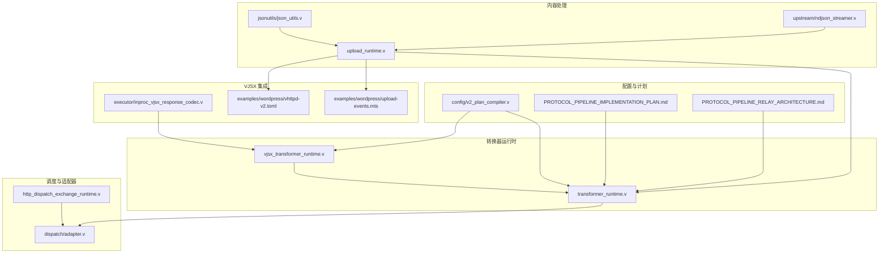
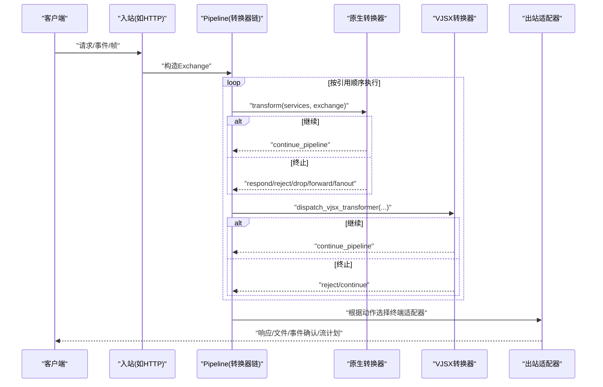
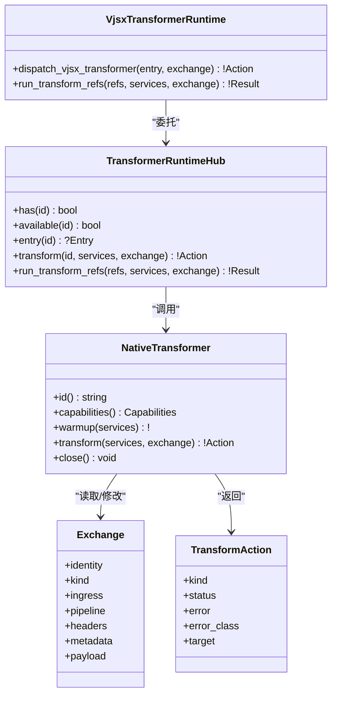
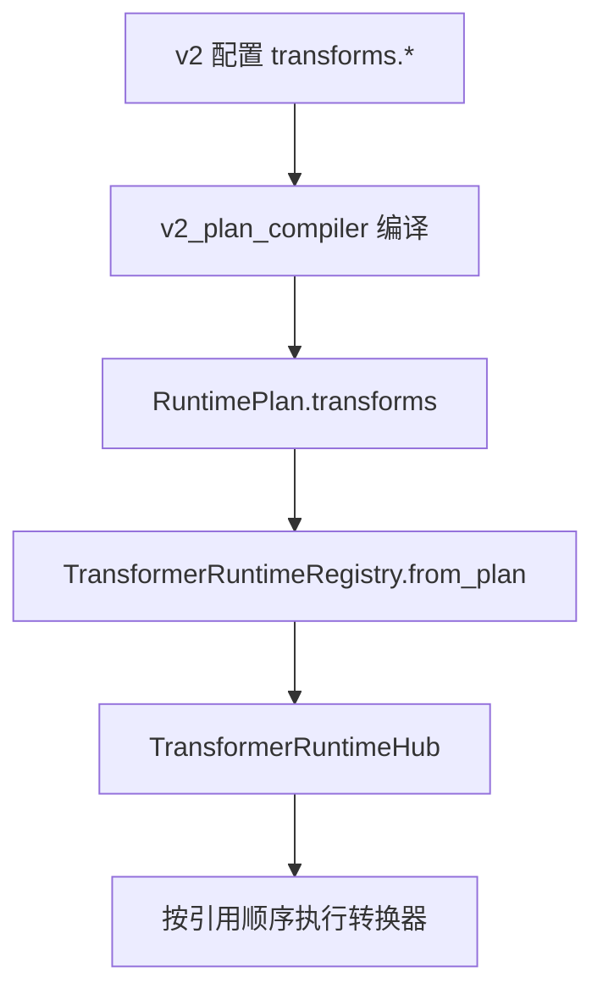
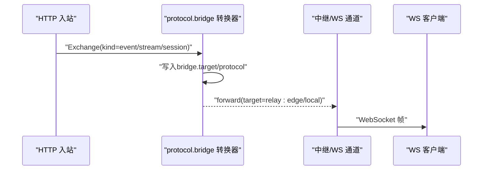
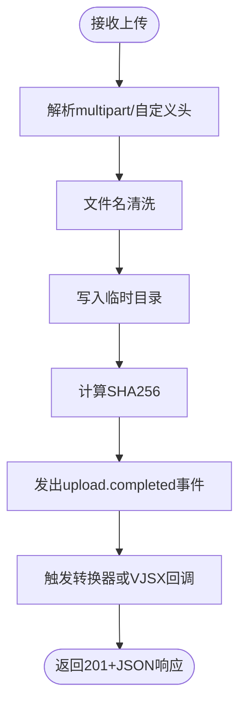
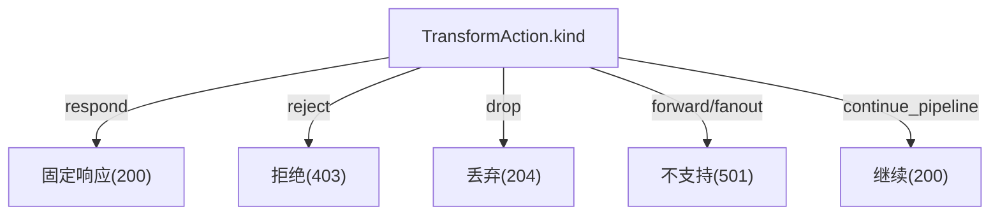
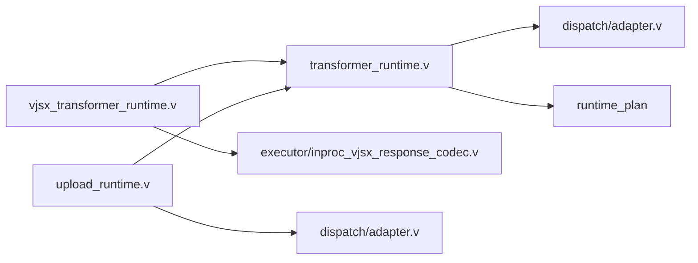

# 转换器插件开发

<cite>
**本文引用的文件**   
- [src/transformer_runtime.v](file://src/transformer_runtime.v)
- [src/vjsx_transformer_runtime.v](file://src/vjsx_transformer_runtime.v)
- [src/dispatch/adapter.v](file://src/dispatch/adapter.v)
- [src/http_dispatch_exchange_runtime.v](file://src/http_dispatch_exchange_runtime.v)
- [src/upload_runtime.v](file://src/upload_runtime.v)
- [src/jsonutils/json_utils.v](file://src/jsonutils/json_utils.v)
- [examples/wordpress/upload-events.mts](file://examples/wordpress/upload-events.mts)
- [examples/wordpress/vhttpd-v2.toml](file://examples/wordpress/vhttpd-v2.toml)
- [src/config/v2_plan_compiler.v](file://src/config/v2_plan_compiler.v)
- [docs/PROTOCOL_PIPELINE_IMPLEMENTATION_PLAN.md](file://docs/PROTOCOL_PIPELINE_IMPLEMENTATION_PLAN.md)
- [docs/PROTOCOL_PIPELINE_RELAY_ARCHITECTURE.md](file://docs/PROTOCOL_PIPELINE_RELAY_ARCHITECTURE.md)
- [src/executor/inproc_vjsx_response_codec.v](file://src/executor/inproc_vjsx_response_codec.v)
- [src/upstream/ndjson_streamer.v](file://src/upstream/ndjson_streamer.v)
</cite>

## 目录
1. [简介](#简介)
2. [项目结构](#项目结构)
3. [核心组件](#核心组件)
4. [架构总览](#架构总览)
5. [详细组件分析](#详细组件分析)
6. [依赖关系分析](#依赖关系分析)
7. [性能考虑](#性能考虑)
8. [故障排查指南](#故障排查指南)
9. [结论](#结论)
10. [附录](#附录)

## 简介
本指南面向需要在 vhttpd 中开发“转换器插件”的工程师，围绕以下目标展开：
- 数据转换器的实现接口与运行契约（输入输出格式、转换规则配置、错误处理）
- 协议适配器开发（HTTP 到 WebSocket 适配、SSE 流式转换、二进制数据处理）
- 内容处理器实现（文本格式化、JSON 序列化、XML 解析、文件上传处理）
- 常见转换场景示例（API 网关转换、数据格式标准化、协议升级迁移）
- 转换器性能优化（流式处理、内存管理、并发控制）
- 转换器测试方法（输入输出验证、边界条件测试、性能基准测试）

vhttpd 的转换能力以“交换对象 Exchange + 转换器 Transform + 管道 Pipeline + 适配器 Adapter”为核心抽象。原生转换器（Native）与 VJSX 转换器共享统一运行时契约，通过注册表与计划（Plan）驱动执行。

## 项目结构
与转换器插件开发密切相关的代码与文档分布如下：
- 转换器运行时与注册：src/transformer_runtime.v、src/vjsx_transformer_runtime.v
- 适配器与交付结果：src/dispatch/adapter.v
- HTTP 动作到终端适配映射：src/http_dispatch_exchange_runtime.v
- 上传处理与事件分发：src/upload_runtime.v、examples/wordpress/upload-events.mts、examples/wordpress/vhttpd-v2.toml
- JSON 轻量检测工具：src/jsonutils/json_utils.v
- 计划编译与选项合并：src/config/v2_plan_compiler.v
- 协议管道设计与类型约定：docs/PROTOCOL_PIPELINE_IMPLEMENTATION_PLAN.md、docs/PROTOCOL_PIPELINE_RELAY_ARCHITECTURE.md
- VJSX 响应编解码：src/executor/inproc_vjsx_response_codec.v
- NDJSON 流式器：src/upstream/ndjson_streamer.v

图表来源
- [src/transformer_runtime.v:1-344](file://src/transformer_runtime.v#L1-L344)
- [src/vjsx_transformer_runtime.v:1-128](file://src/vjsx_transformer_runtime.v#L1-L128)
- [src/dispatch/adapter.v:1-137](file://src/dispatch/adapter.v#L1-L137)
- [src/http_dispatch_exchange_runtime.v:97-122](file://src/http_dispatch_exchange_runtime.v#L97-L122)
- [src/upload_runtime.v:1-357](file://src/upload_runtime.v#L1-L357)
- [src/jsonutils/json_utils.v:1-306](file://src/jsonutils/json_utils.v#L1-L306)
- [src/upstream/ndjson_streamer.v](file://src/upstream/ndjson_streamer.v)
- [src/config/v2_plan_compiler.v:32-70](file://src/config/v2_plan_compiler.v#L32-L70)
- [docs/PROTOCOL_PIPELINE_IMPLEMENTATION_PLAN.md:85-160](file://docs/PROTOCOL_PIPELINE_IMPLEMENTATION_PLAN.md#L85-L160)
- [docs/PROTOCOL_PIPELINE_RELAY_ARCHITECTURE.md:90-193](file://docs/PROTOCOL_PIPELINE_RELAY_ARCHITECTURE.md#L90-L193)
- [src/executor/inproc_vjsx_response_codec.v:1-65](file://src/executor/inproc_vjsx_response_codec.v#L1-L65)
- [examples/wordpress/upload-events.mts:1-24](file://examples/wordpress/upload-events.mts#L1-L24)
- [examples/wordpress/vhttpd-v2.toml:191-253](file://examples/wordpress/vhttpd-v2.toml#L191-L253)

章节来源
- [src/transformer_runtime.v:1-344](file://src/transformer_runtime.v#L1-L344)
- [src/vjsx_transformer_runtime.v:1-128](file://src/vjsx_transformer_runtime.v#L1-L128)
- [src/dispatch/adapter.v:1-137](file://src/dispatch/adapter.v#L1-L137)
- [src/http_dispatch_exchange_runtime.v:97-122](file://src/http_dispatch_exchange_runtime.v#L97-L122)
- [src/upload_runtime.v:1-357](file://src/upload_runtime.v#L1-L357)
- [src/jsonutils/json_utils.v:1-306](file://src/jsonutils/json_utils.v#L1-L306)
- [src/upstream/ndjson_streamer.v](file://src/upstream/ndjson_streamer.v)
- [src/config/v2_plan_compiler.v:32-70](file://src/config/v2_plan_compiler.v#L32-L70)
- [docs/PROTOCOL_PIPELINE_IMPLEMENTATION_PLAN.md:85-160](file://docs/PROTOCOL_PIPELINE_IMPLEMENTATION_PLAN.md#L85-L160)
- [docs/PROTOCOL_PIPELINE_RELAY_ARCHITECTURE.md:90-193](file://docs/PROTOCOL_PIPELINE_RELAY_ARCHITECTURE.md#L90-L193)
- [src/executor/inproc_vjsx_response_codec.v:1-65](file://src/executor/inproc_vjsx_response_codec.v#L1-L65)
- [examples/wordpress/upload-events.mts:1-24](file://examples/wordpress/upload-events.mts#L1-L24)
- [examples/wordpress/vhttpd-v2.toml:191-253](file://examples/wordpress/vhttpd-v2.toml#L191-L253)

## 核心组件
- 转换器运行时与注册表
  - 提供转换器条目、能力声明、原生/VJSX 双后端执行、流水线串联与短路返回。
  - 关键路径：从计划加载 -> 构建 Hub -> 按引用顺序执行 -> 遇到非 continue 即短路。
- VJSX 转换器桥接
  - 将 Exchange 编码为事件请求，调用 VJSX 引擎执行，再将结果归一化为标准动作。
- 适配器与交付结果
  - 定义入站描述、出站适配器接口、统一交付结果 DeliveryOutcome（响应、文件、事件、流、会话、中继、失败）。
- HTTP 动作到终端适配器映射
  - 将转换动作 respond/reject/drop/forward/fanout/continue_pipeline 映射为具体终端适配器行为。
- 上传处理与完成事件
  - 解析 multipart/表单或自定义头，落盘并计算摘要，生成 upload.completed 事件，触发转换器或 VJSX 回调。
- JSON 轻量键检测
  - 单遍扫描顶层键，避免完整解析带来的分配与开销。
- 计划编译与选项合并
  - 将 v2 配置编译为运行时计划，合并 transforms/options/target/strip_prefix 等字段。
- 协议管道设计
  - 明确 Surface/Carrier/Canonical Exchange/Adapter/Transform 概念，强调显式协议转换。

章节来源
- [src/transformer_runtime.v:1-344](file://src/transformer_runtime.v#L1-L344)
- [src/vjsx_transformer_runtime.v:1-128](file://src/vjsx_transformer_runtime.v#L1-L128)
- [src/dispatch/adapter.v:1-137](file://src/dispatch/adapter.v#L1-L137)
- [src/http_dispatch_exchange_runtime.v:97-122](file://src/http_dispatch_exchange_runtime.v#L97-L122)
- [src/upload_runtime.v:1-357](file://src/upload_runtime.v#L1-L357)
- [src/jsonutils/json_utils.v:1-306](file://src/jsonutils/json_utils.v#L1-L306)
- [src/config/v2_plan_compiler.v:32-70](file://src/config/v2_plan_compiler.v#L32-L70)
- [docs/PROTOCOL_PIPELINE_IMPLEMENTATION_PLAN.md:85-160](file://docs/PROTOCOL_PIPELINE_IMPLEMENTATION_PLAN.md#L85-L160)
- [docs/PROTOCOL_PIPELINE_RELAY_ARCHITECTURE.md:90-193](file://docs/PROTOCOL_PIPELINE_RELAY_ARCHITECTURE.md#L90-L193)

## 架构总览
下图展示了从入站到出站的端到端流程，以及转换器在其中的位置与作用。

图表来源
- [src/transformer_runtime.v:116-135](file://src/transformer_runtime.v#L116-L135)
- [src/vjsx_transformer_runtime.v:91-127](file://src/vjsx_transformer_runtime.v#L91-L127)
- [src/http_dispatch_exchange_runtime.v:97-122](file://src/http_dispatch_exchange_runtime.v#L97-L122)
- [src/dispatch/adapter.v:129-137](file://src/dispatch/adapter.v#L129-L137)

## 详细组件分析

### 数据转换器接口与运行契约
- 输入输出
  - 输入：统一的 Exchange（包含 identity、kind、ingress、pipeline、headers、metadata、payload）。
  - 输出：TransformAction（continue_pipeline/respond/reject/drop/forward/fanout），附带状态码、错误分类、目标等。
- 能力声明
  - 转换器需声明 Capabilities（request_response/events/stream_input/stream_output/full_duplex/sessions/multiplexing/cancellation/backpressure/replay）。
- 生命周期
  - warmup/transform/close；原生转换器由注册表直接调用，VJSX 转换器通过事件派发执行。
- 错误处理
  - 返回错误时记录 trace_id、exchange_id、pipeline 等信息；VJSX 侧对 4xx 视为失败并拒绝。

图表来源
- [src/transformer_runtime.v:60-135](file://src/transformer_runtime.v#L60-L135)
- [src/vjsx_transformer_runtime.v:91-127](file://src/vjsx_transformer_runtime.v#L91-L127)
- [docs/PROTOCOL_PIPELINE_IMPLEMENTATION_PLAN.md:144-160](file://docs/PROTOCOL_PIPELINE_IMPLEMENTATION_PLAN.md#L144-L160)

章节来源
- [src/transformer_runtime.v:60-135](file://src/transformer_runtime.v#L60-L135)
- [src/vjsx_transformer_runtime.v:91-127](file://src/vjsx_transformer_runtime.v#L91-L127)
- [docs/PROTOCOL_PIPELINE_IMPLEMENTATION_PLAN.md:144-160](file://docs/PROTOCOL_PIPELINE_IMPLEMENTATION_PLAN.md#L144-L160)

### 转换规则配置与加载
- 配置项
  - transforms.id/kind/engine/handler/options（含 target、strip_prefix 等字符串选项，ints/bools/lists/maps 扩展）。
- 编译过程
  - v2 计划编译器将配置转换为 RuntimePlan.transforms，并合并 options。
- 运行时
  - 转换器运行时从 Plan 构建 Registry/Hub，支持 native 与 vjsx 两类。

图表来源
- [src/config/v2_plan_compiler.v:32-70](file://src/config/v2_plan_compiler.v#L32-L70)
- [src/transformer_runtime.v:67-102](file://src/transformer_runtime.v#L67-L102)

章节来源
- [src/config/v2_plan_compiler.v:32-70](file://src/config/v2_plan_compiler.v#L32-L70)
- [src/transformer_runtime.v:67-102](file://src/transformer_runtime.v#L67-L102)

### 协议适配器开发（HTTP→WebSocket、SSE、二进制）
- HTTP 到 WebSocket 适配
  - 使用 protocol.bridge 原生转换器设置 bridge.target/protocol 元数据，并将动作设为 forward，交由下游中继/WS 通道处理。
- SSE 流式转换
  - 上游 NDJSON 流式器负责分块传输；转换器可将内部事件映射为 SSE 帧（event/data/id/retry）。
- 二进制数据处理
  - 通过 EventPayload.data 承载二进制（建议 base64 或 chunked 语义），或在 metadata 中携带长度/偏移等元信息。

图表来源
- [src/transformer_runtime.v:282-339](file://src/transformer_runtime.v#L282-L339)
- [src/upstream/ndjson_streamer.v](file://src/upstream/ndjson_streamer.v)

章节来源
- [src/transformer_runtime.v:282-339](file://src/transformer_runtime.v#L282-L339)
- [src/upstream/ndjson_streamer.v](file://src/upstream/ndjson_streamer.v)

### 内容处理器实现（文本、JSON、XML、文件上传）
- 文本格式化
  - 在转换器中基于 headers/metadata 决定 content-type 与字符集，必要时进行转义与截断。
- JSON 序列化
  - 使用内置 JSON 库；对于大负载可结合 jsonutils.has_any_top_level_key 做快速判断，避免全量解析。
- XML 解析
  - 在转换器中引入 XML 解析逻辑，注意命名空间与实体安全；将解析结果写入 metadata 供后续步骤消费。
- 文件上传处理
  - 支持 multipart/form-data 与自定义 x-vhttpd-filename 头；落盘后生成 upload.completed 事件，触发转换器或 VJSX 回调。

图表来源
- [src/upload_runtime.v:80-131](file://src/upload_runtime.v#L80-L131)
- [src/upload_runtime.v:183-212](file://src/upload_runtime.v#L183-L212)
- [src/upload_runtime.v:214-274](file://src/upload_runtime.v#L214-L274)
- [src/upload_runtime.v:276-356](file://src/upload_runtime.v#L276-L356)
- [examples/wordpress/upload-events.mts:1-24](file://examples/wordpress/upload-events.mts#L1-L24)
- [examples/wordpress/vhttpd-v2.toml:191-253](file://examples/wordpress/vhttpd-v2.toml#L191-L253)

章节来源
- [src/upload_runtime.v:80-131](file://src/upload_runtime.v#L80-L131)
- [src/upload_runtime.v:183-212](file://src/upload_runtime.v#L183-L212)
- [src/upload_runtime.v:214-274](file://src/upload_runtime.v#L214-L274)
- [src/upload_runtime.v:276-356](file://src/upload_runtime.v#L276-L356)
- [examples/wordpress/upload-events.mts:1-24](file://examples/wordpress/upload-events.mts#L1-L24)
- [examples/wordpress/vhttpd-v2.toml:191-253](file://examples/wordpress/vhttpd-v2.toml#L191-L253)

### 常见转换场景示例
- API 网关转换
  - 使用 protocol.bridge 将 HTTP 请求转发至 WS/Stream/Session 目标，并在 metadata 中注入路由与协议信息。
- 数据格式标准化
  - 在转换器中将不同来源的 payload 规范化为统一结构，写入 metadata 中的标准化字段，便于下游消费。
- 协议升级迁移
  - 通过 pipeline 组合多个转换器：先做兼容层（旧协议→中间态），再做新协议适配（中间态→新协议），逐步灰度切换。

章节来源
- [src/transformer_runtime.v:282-339](file://src/transformer_runtime.v#L282-L339)
- [docs/PROTOCOL_PIPELINE_RELAY_ARCHITECTURE.md:90-193](file://docs/PROTOCOL_PIPELINE_RELAY_ARCHITECTURE.md#L90-L193)

### HTTP 动作到终端适配映射
- respond → fixed_response_adapter（默认200）
- reject → reject_adapter（默认403）
- drop → fixed_response_adapter（204）
- forward/fanout → reject_adapter（501，HTTP 不支持）
- continue_pipeline → fixed_response_adapter（200）

图表来源
- [src/http_dispatch_exchange_runtime.v:97-122](file://src/http_dispatch_exchange_runtime.v#L97-L122)

章节来源
- [src/http_dispatch_exchange_runtime.v:97-122](file://src/http_dispatch_exchange_runtime.v#L97-L122)

## 依赖关系分析
- 低耦合高内聚
  - 转换器仅依赖 Exchange 与 TransformAction，不感知底层载体（TCP/TLS/WS/Unix socket）。
- 直接依赖
  - 转换器运行时依赖 dispatch 模块（Exchange/Adapter/Capabilities）、runtime_plan（PlanOptions）。
  - VJSX 转换器依赖 executor 的事件派发与响应编解码。
- 间接依赖
  - 上传处理依赖 net.http/os/crypto/json/rand/veb，并通过适配器与管道系统联动。

图表来源
- [src/transformer_runtime.v:1-344](file://src/transformer_runtime.v#L1-L344)
- [src/vjsx_transformer_runtime.v:1-128](file://src/vjsx_transformer_runtime.v#L1-L128)
- [src/dispatch/adapter.v:1-137](file://src/dispatch/adapter.v#L1-L137)
- [src/upload_runtime.v:1-357](file://src/upload_runtime.v#L1-L357)
- [src/executor/inproc_vjsx_response_codec.v:1-65](file://src/executor/inproc_vjsx_response_codec.v#L1-L65)

章节来源
- [src/transformer_runtime.v:1-344](file://src/transformer_runtime.v#L1-L344)
- [src/vjsx_transformer_runtime.v:1-128](file://src/vjsx_transformer_runtime.v#L1-L128)
- [src/dispatch/adapter.v:1-137](file://src/dispatch/adapter.v#L1-L137)
- [src/upload_runtime.v:1-357](file://src/upload_runtime.v#L1-L357)
- [src/executor/inproc_vjsx_response_codec.v:1-65](file://src/executor/inproc_vjsx_response_codec.v#L1-L65)

## 性能考虑
- 流式处理
  - 优先使用 stream_open/chunk/end 语义，避免一次性加载大负载；SSE/NDJSON 分块传输减少首字节延迟。
- 内存管理
  - 使用 jsonutils.has_any_top_level_key 进行快速判定，避免不必要的完整解析；尽量复用 headers/metadata 拷贝策略。
- 并发控制
  - 利用 Lane/Actor 队列执行 VJSX 转换器，限制并发度；对热点路径采用只读快照与无锁队列（参考重构建议）。
- 缓存与幂等
  - 对只读转换结果进行短期缓存；为 fanout 聚合策略设定超时与去重。

[本节为通用指导，无需特定文件来源]

## 故障排查指南
- 常见问题定位
  - 转换器未注册/不可用：检查 plan.transforms 与 registry.available。
  - 协议桥缺少目标：protocol.bridge 要求 target 不为空，否则报错。
  - VJSX 转换器失败：当返回状态≥400 时会被归类为失败。
  - HTTP 不支持的动作：forward/fanout 在 HTTP 终端会返回 501。
- 诊断信息
  - 关注 metadata 中的 bridge.transform/handler/target/protocol/exchange_kind 等键。
  - 观察 transform.warmup/transform 事件与 upload.completed.dispatch 事件。

章节来源
- [src/transformer_runtime.v:282-339](file://src/transformer_runtime.v#L282-L339)
- [src/vjsx_transformer_runtime.v:91-105](file://src/vjsx_transformer_runtime.v#L91-L105)
- [src/http_dispatch_exchange_runtime.v:97-122](file://src/http_dispatch_exchange_runtime.v#L97-L122)
- [src/upload_runtime.v:214-274](file://src/upload_runtime.v#L214-L274)

## 结论
vhttpd 的转换器体系以 Exchange 为中心，通过原生与 VJSX 双后端实现统一契约，配合适配器与管道完成协议适配与内容处理。借助明确的计划配置与能力校验，开发者可以灵活组合转换器实现网关、标准化、协议升级等场景，并通过流式与内存友好的工具获得良好性能。

[本节为总结性内容，无需特定文件来源]

## 附录
- 最佳实践清单
  - 始终声明 Capabilities，确保与入站能力匹配。
  - 在 metadata 中保留可观测性字段（trace_id、pipeline、bridge.*）。
  - 对大负载采用流式与增量处理，避免阻塞。
  - 对 VJSX 转换器做好错误分类与降级策略。
- 参考示例
  - 上传完成事件处理：examples/wordpress/upload-events.mts
  - 上传相关管道与策略：examples/wordpress/vhttpd-v2.toml

章节来源
- [examples/wordpress/upload-events.mts:1-24](file://examples/wordpress/upload-events.mts#L1-L24)
- [examples/wordpress/vhttpd-v2.toml:191-253](file://examples/wordpress/vhttpd-v2.toml#L191-L253)