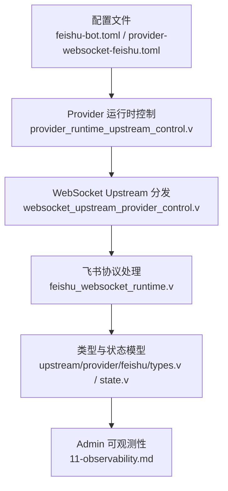
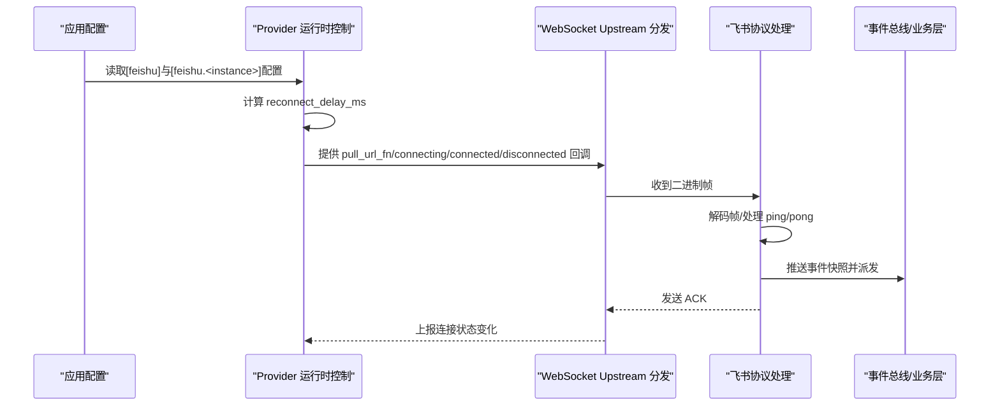
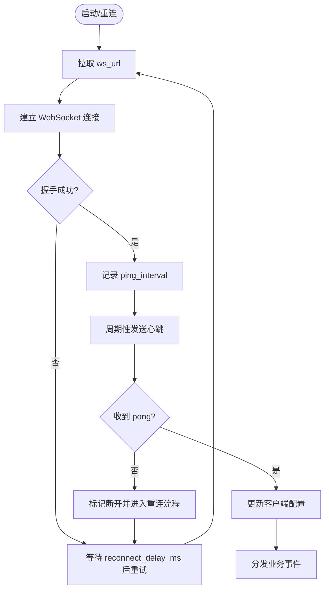
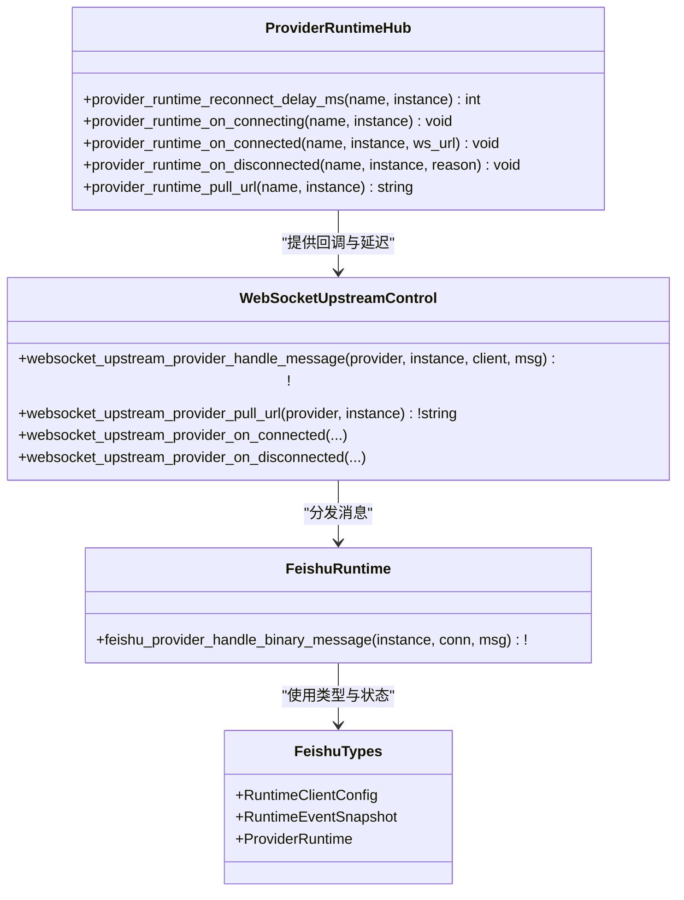

# WebSocket 连接配置

<cite>
**本文引用的文件**   
- [feishu-bot.toml](file://examples/config/feishu-bot.toml)
- [provider-websocket-feishu.toml](file://examples/config/provider-websocket-feishu.toml)
- [feishu_websocket_runtime.v](file://src/feishu_websocket_runtime.v)
- [websocket_upstream_provider_control.v](file://src/websocket_upstream_provider_control.v)
- [provider_runtime_upstream_control.v](file://src/provider_runtime_upstream_control.v)
- [upstream/provider/feishu/types.v](file://src/upstream/provider/feishu/types.v)
- [upstream/provider/feishu/state.v](file://src/upstream/provider/feishu/state.v)
- [WEBSOCKET_UPSTREAM_PLAN.md](file://docs/WEBSOCKET_UPSTREAM_PLAN.md)
- [07-feishu-bot.md](file://articles/07-feishu-bot.md)
- [11-observability.md](file://articles/11-observability.md)
</cite>

## 目录
1. [简介](#简介)
2. [项目结构](#项目结构)
3. [核心组件](#核心组件)
4. [架构总览](#架构总览)
5. [详细组件分析](#详细组件分析)
6. [依赖关系分析](#依赖关系分析)
7. [性能与调优建议](#性能与调优建议)
8. [故障诊断指南](#故障诊断指南)
9. [结论](#结论)
10. [附录：配置示例](#附录配置示例)

## 简介
本文面向需要在 vhttpd 中配置飞书 WebSocket 长连接的开发者，聚焦以下目标：
- ws_url 的配置方式与获取流程
- 连接参数（ping_interval、reconnect_delay_ms、reconnect_count）的作用与推荐值
- 连接状态监控（建立、断开重连、心跳检测）的实现机制
- 多应用独立连接池的示例与最佳实践
- 常见故障的诊断方法与性能优化建议

## 项目结构
围绕飞书 WebSocket 上游连接的关键代码与配置分布如下：
- 配置样例：examples/config/feishu-bot.toml、examples/config/provider-websocket-feishu.toml
- 运行时处理：src/feishu_websocket_runtime.v、src/websocket_upstream_provider_control.v、src/provider_runtime_upstream_control.v
- 类型与状态：src/upstream/provider/feishu/types.v、src/upstream/provider/feishu/state.v
- 设计文档：docs/WEBSOCKET_UPSTREAM_PLAN.md
- 使用与观测：articles/07-feishu-bot.md、articles/11-observability.md

图表来源
- [feishu-bot.toml:1-40](file://examples/config/feishu-bot.toml#L1-L40)
- [provider-websocket-feishu.toml](file://examples/config/provider-websocket-feishu.toml)
- [provider_runtime_upstream_control.v:1-92](file://src/provider_runtime_upstream_control.v#L1-L92)
- [websocket_upstream_provider_control.v:1-76](file://src/websocket_upstream_provider_control.v#L1-L76)
- [feishu_websocket_runtime.v:1-222](file://src/feishu_websocket_runtime.v#L1-L222)
- [upstream/provider/feishu/types.v:1-333](file://src/upstream/provider/feishu/types.v#L1-L333)
- [upstream/provider/feishu/state.v:1-346](file://src/upstream/provider/feishu/state.v#L1-L346)
- [11-observability.md:179-331](file://articles/11-observability.md#L179-L331)

章节来源
- [07-feishu-bot.md:50-111](file://articles/07-feishu-bot.md#L50-L111)
- [WEBSOCKET_UPSTREAM_PLAN.md:1-89](file://docs/WEBSOCKET_UPSTREAM_PLAN.md#L1-L89)

## 核心组件
- Provider 运行时控制层：负责按 provider 名称与实例名解析连接 URL、重连延迟、连接生命周期事件。
- WebSocket Upstream 分发层：将底层 WebSocket 消息路由到具体 provider 的处理逻辑。
- 飞书协议处理层：解码二进制帧、处理 ping/pong、封装事件快照并派发至业务层。
- 类型与状态模型：定义客户端握手返回的配置项（含 ping_interval、reconnect_count）、连接状态统计与最近事件缓存。

章节来源
- [provider_runtime_upstream_control.v:1-92](file://src/provider_runtime_upstream_control.v#L1-L92)
- [websocket_upstream_provider_control.v:1-76](file://src/websocket_upstream_provider_control.v#L1-L76)
- [feishu_websocket_runtime.v:1-222](file://src/feishu_websocket_runtime.v#L1-L222)
- [upstream/provider/feishu/types.v:1-333](file://src/upstream/provider/feishu/types.v#L1-L333)
- [upstream/provider/feishu/state.v:1-346](file://src/upstream/provider/feishu/state.v#L1-L346)

## 架构总览
vhttpd 作为“WebSocket upstream”主动拉取远端连接，持有会话生命周期，并在本地完成协议消费、转发与观测。飞书是首个 provider，后续可扩展其他 provider。

图表来源
- [provider_runtime_upstream_control.v:67-92](file://src/provider_runtime_upstream_control.v#L67-L92)
- [websocket_upstream_provider_control.v:13-75](file://src/websocket_upstream_provider_control.v#L13-L75)
- [feishu_websocket_runtime.v:22-222](file://src/feishu_websocket_runtime.v#L22-L222)

## 详细组件分析

### ws_url 的配置与获取流程
- 配置入口
  - 全局开关与基础地址在 [feishu] 段，例如 open_base_url、reconnect_delay_ms 等。
  - 每个应用实例在 [feishu.<instance>] 段配置 app_id、app_secret 等凭证。
- 动态获取
  - 实际 ws_url 并非静态配置，而是由 provider 运行时通过 REST 接口拉取，再由上层统一接入 WebSocket 客户端循环。
  - 该过程由 provider_runtime_pull_url 抽象，内部根据 provider 名称调用对应实现（如 feishu）。
- 连接生命周期
  - connecting/connected/disconnected 回调贯穿整个连接过程，用于记录状态与触发重连策略。

章节来源
- [feishu-bot.toml:28-40](file://examples/config/feishu-bot.toml#L28-L40)
- [provider_runtime_upstream_control.v:67-75](file://src/provider_runtime_upstream_control.v#L67-L75)
- [WEBSOCKET_UPSTREAM_PLAN.md:28-67](file://docs/WEBSOCKET_UPSTREAM_PLAN.md#L28-L67)

### 连接参数说明与推荐值
- ping_interval（秒）
  - 作用：心跳间隔，决定向对端发送心跳的频率。
  - 取值来源：握手时服务端返回 ClientConfig.ping_interval；若未设置则回退默认值。
  - 推荐：遵循服务端返回或保持较短间隔（如 5~15 秒），避免被中间网络设施超时断开。
- reconnect_delay_ms（毫秒）
  - 作用：断线后下一次重连的等待时间。
  - 取值来源：全局 [feishu].reconnect_delay_ms；未设置时使用默认值。
  - 推荐：默认 3000ms 适用于多数场景；生产环境可根据网络抖动调整至 3000~10000ms。
- reconnect_count
  - 作用：握手返回的重连计数提示，可用于观测与告警。
  - 取值来源：ClientConfig.reconnect_count。
  - 推荐：结合监控指标观察趋势，异常增长需排查网络或服务端限流。

章节来源
- [upstream/provider/feishu/types.v:38-44](file://src/upstream/provider/feishu/types.v#L38-L44)
- [upstream/provider/feishu/types.v:123-129](file://src/upstream/provider/feishu/types.v#L123-L129)
- [upstream/provider/feishu/types.v:195-199](file://src/upstream/provider/feishu/types.v#L195-L199)
- [provider_runtime_upstream_control.v:5-23](file://src/provider_runtime_upstream_control.v#L5-L23)
- [feishu-bot.toml:28-33](file://examples/config/feishu-bot.toml#L28-L33)

### 连接状态监控与心跳检测
- 连接状态
  - connected/ws_url/last_connect_at_unix/last_disconnect_at_unix/last_error 等字段反映当前连接健康度。
  - note_connected/note_disconnected 在生命周期事件中更新状态。
- 心跳检测
  - 服务端握手返回 ClientConfig，包含 ping_interval 等参数。
  - 运行时根据 ping_interval 定时发送心跳，收到 pong 后更新客户端配置并记录日志。
- 事件与指标
  - received_frames、acked_events、messages_sent、send_errors 等指标便于评估吞吐与错误率。
  - recent_events 保留最近 N 条事件快照，便于快速定位问题。

图表来源
- [provider_runtime_upstream_control.v:25-65](file://src/provider_runtime_upstream_control.v#L25-L65)
- [feishu_websocket_runtime.v:22-50](file://src/feishu_websocket_runtime.v#L22-L50)
- [upstream/provider/feishu/types.v:195-199](file://src/upstream/provider/feishu/types.v#L195-L199)

章节来源
- [upstream/provider/feishu/types.v:165-177](file://src/upstream/provider/feishu/types.v#L165-L177)
- [upstream/provider/feishu/state.v:30-71](file://src/upstream/provider/feishu/state.v#L30-L71)
- [feishu_websocket_runtime.v:22-50](file://src/feishu_websocket_runtime.v#L22-L50)

### 多应用独立连接池配置示例
- 为多个应用分别创建 [feishu.<name>] 段，各自维护独立的连接与状态。
- 支持并行运行，例如 feishu.main、feishu.openclaw 等。
- 可通过 Admin API 查看各实例的连接状态与事件。

章节来源
- [WEBSOCKET_UPSTREAM_PLAN.md:69-80](file://docs/WEBSOCKET_UPSTREAM_PLAN.md#L69-L80)
- [11-observability.md:263-309](file://articles/11-observability.md#L263-L309)

## 依赖关系分析
- provider_runtime_upstream_control.v 提供统一的 provider 抽象，屏蔽不同 provider 的差异。
- websocket_upstream_provider_control.v 将底层 WebSocket 消息分发给具体 provider 处理器。
- feishu_websocket_runtime.v 实现飞书协议细节（帧编解码、ACK、心跳、事件派发）。
- types.v/state.v 承载数据模型与运行时状态，支撑可观测性与调试。

图表来源
- [provider_runtime_upstream_control.v:1-92](file://src/provider_runtime_upstream_control.v#L1-L92)
- [websocket_upstream_provider_control.v:1-76](file://src/websocket_upstream_provider_control.v#L1-L76)
- [feishu_websocket_runtime.v:1-222](file://src/feishu_websocket_runtime.v#L1-L222)
- [upstream/provider/feishu/types.v:1-333](file://src/upstream/provider/feishu/types.v#L1-L333)

章节来源
- [provider_runtime_upstream_control.v:1-92](file://src/provider_runtime_upstream_control.v#L1-L92)
- [websocket_upstream_provider_control.v:1-76](file://src/websocket_upstream_provider_control.v#L1-L76)
- [feishu_websocket_runtime.v:1-222](file://src/feishu_websocket_runtime.v#L1-L222)
- [upstream/provider/feishu/types.v:1-333](file://src/upstream/provider/feishu/types.v#L1-L333)

## 性能与调优建议
- 合理设置 ping_interval
  - 过短会增加网络开销，过长可能被中间设备判定为空闲而断开。建议遵循握手返回的值或在 5~15 秒之间选择。
- 调整 reconnect_delay_ms
  - 在网络不稳定时可适当增大，避免频繁重连造成雪崩效应。
- 限制 recent_event_limit
  - 仅保留最近 N 条事件快照，降低内存占用，便于快速定位问题。
- 关注 send_errors 与 acked_events 比率
  - 若 send_errors 持续上升，检查下游处理能力与网络质量。
- 利用 Admin 接口与事件日志
  - 通过 /admin/runtime/feishu 与 events.ndjson 进行实时监控与回溯。

章节来源
- [upstream/provider/feishu/types.v:206-214](file://src/upstream/provider/feishu/types.v#L206-L214)
- [11-observability.md:313-331](file://articles/11-observability.md#L313-L331)

## 故障诊断指南
- 无法建立连接
  - 检查 [feishu] 与 [feishu.<instance>] 配置是否完整，确认 open_base_url 与凭证正确。
  - 查看连接状态接口与事件日志，确认是否出现频繁重连。
- 心跳失败导致断连
  - 核对 ping_interval 与服务端返回一致，检查中间网络设备是否拦截心跳。
- 事件未到达业务层
  - 检查 ACK 是否返回，确认业务层是否正确消费事件。
- 多实例冲突
  - 确保每个实例有唯一 name，避免共享状态。

章节来源
- [feishu-bot.toml:28-40](file://examples/config/feishu-bot.toml#L28-L40)
- [11-observability.md:263-309](file://articles/11-observability.md#L263-L309)

## 结论
vhttpd 以统一的 WebSocket upstream 抽象管理飞书长连接，具备自动拉取 ws_url、心跳检测、断线重连与完善的可观测能力。通过合理的连接参数与多实例配置，可在生产环境中获得稳定高效的机器人集成体验。

## 附录：配置示例
- 单实例基本配置
  - 参考 examples/config/feishu-bot.toml 中的 [feishu] 与 [feishu.main] 段。
- 多实例与 provider 模式
  - 参考 examples/config/provider-websocket-feishu.toml，展示 provider 适配器与管道配置。

章节来源
- [feishu-bot.toml:28-40](file://examples/config/feishu-bot.toml#L28-L40)
- [provider-websocket-feishu.toml](file://examples/config/provider-websocket-feishu.toml)