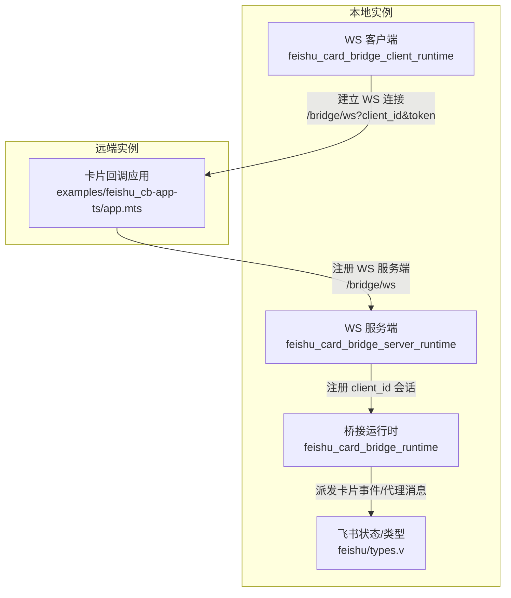
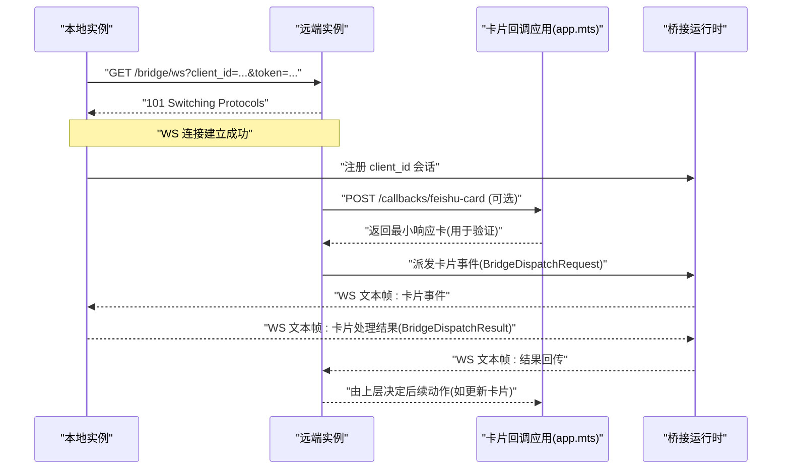
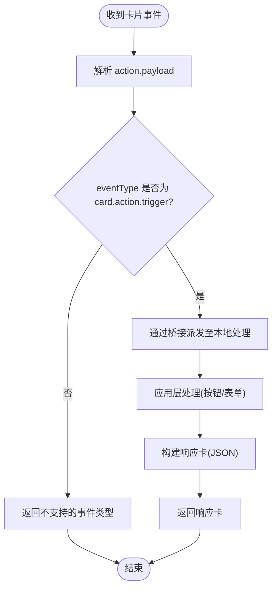
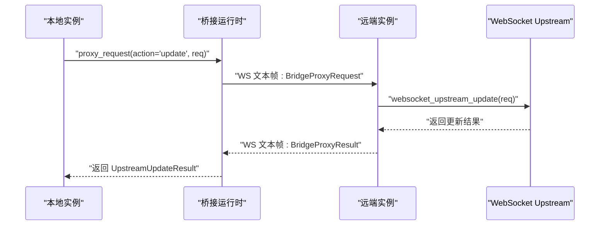
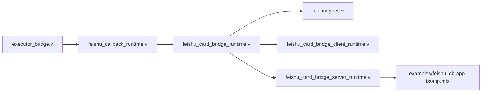

# 卡片桥接配置

<cite>
**本文引用的文件列表**
- [src/feishu/types.v](file://src/feishu/types.v)
- [src/feishu_card_bridge_runtime.v](file://src/feishu_card_bridge_runtime.v)
- [src/feishu_card_bridge_client_runtime.v](file://src/feishu_card_bridge_client_runtime.v)
- [src/feishu_card_bridge_server_runtime.v](file://src/feishu_card_bridge_server_runtime.v)
- [config/vhttpd.example.toml](file://config/vhttpd.example.toml)
- [examples/feishu_cb-app-ts/local.example.toml](file://examples/feishu_cb-app-ts/local.example.toml)
- [examples/feishu_cb-app-ts/remote.example.toml](file://examples/feishu_cb-app-ts/remote.example.toml)
- [examples/feishu_cb-app-ts/app.mts](file://examples/feishu_cb-app-ts/app.mts)
- [src/executor_bridge.v](file://src/executor_bridge.v)
- [src/feishu_callback_runtime.v](file://src/feishu_callback_runtime.v)
</cite>

## 目录
1. [简介](#简介)
2. [项目结构](#项目结构)
3. [核心组件](#核心组件)
4. [架构总览](#架构总览)
5. [详细组件分析](#详细组件分析)
6. [依赖关系分析](#依赖关系分析)
7. [性能与超时](#性能与超时)
8. [故障排查指南](#故障排查指南)
9. [结论](#结论)
10. [附录：配置示例与集成步骤](#附录配置示例与集成步骤)

## 简介
本文件面向需要在 vhttpd 中启用“飞书卡片桥接”能力的开发者，提供从配置到交互流程、状态同步策略、错误处理与超时的完整说明。重点覆盖以下能力：
- 卡片桥接服务的启用与参数配置（card_bridge_enabled_flag、card_bridge_ws_url、card_bridge_client_id、card_bridge_token、card_bridge_target_id）
- 卡片交互流程（模板渲染、按钮事件处理、表单提交响应）
- 卡片状态同步机制（实时更新、增量更新、全量更新的策略选择）
- 在应用中集成卡片功能的配置示例与部署建议
- 错误处理与超时配置

## 项目结构
与卡片桥接相关的核心代码位于 src 目录下，示例应用与配置文件位于 examples 和 config 目录。关键文件如下：
- 类型与状态定义：src/feishu/types.v
- 桥接运行时（调度、代理、连接管理）：src/feishu_card_bridge_runtime.v
- 客户端运行时（主动连远端 /bridge/ws）：src/feishu_card_bridge_client_runtime.v
- 服务端运行时（接收本地 WS 连接并转发）：src/feishu_card_bridge_server_runtime.v
- 示例应用（最小化卡片回调处理）：examples/feishu_cb-app-ts/app.mts
- 示例配置（本地/远端）：examples/feishu_cb-app-ts/local.example.toml、remote.example.toml
- 全局示例配置：config/vhttpd.example.toml
- 调用入口（执行器桥接、回调分发）：src/executor_bridge.v、src/feishu_callback_runtime.v

图表来源
- [src/feishu_card_bridge_client_runtime.v:130-179](file://src/feishu_card_bridge_client_runtime.v#L130-L179)
- [src/feishu_card_bridge_server_runtime.v:182-251](file://src/feishu_card_bridge_server_runtime.v#L182-L251)
- [src/feishu_card_bridge_runtime.v:192-246](file://src/feishu_card_bridge_runtime.v#L192-L246)
- [src/feishu/types.v:313-384](file://src/feishu/types.v#L313-L384)
- [examples/feishu_cb-app-ts/app.mts:226-265](file://examples/feishu_cb-app-ts/app.mts#L226-L265)

章节来源
- [src/feishu/types.v:313-384](file://src/feishu/types.v#L313-L384)
- [src/feishu_card_bridge_runtime.v:192-246](file://src/feishu_card_bridge_runtime.v#L192-L246)
- [src/feishu_card_bridge_client_runtime.v:130-179](file://src/feishu_card_bridge_client_runtime.v#L130-L179)
- [src/feishu_card_bridge_server_runtime.v:182-251](file://src/feishu_card_bridge_server_runtime.v#L182-L251)
- [examples/feishu_cb-app-ts/app.mts:226-265](file://examples/feishu_cb-app-ts/app.mts#L226-L265)

## 核心组件
- 桥接运行时（调度与代理）
  - 负责将飞书卡片事件派发到本地目标 client_id，并通过 WebSocket 往返结果；同时支持 send/update/append/finish/fail 等代理操作。
  - 关键函数路径：[dispatch 回调:192-246](file://src/feishu_card_bridge_runtime.v#L192-L246)、[代理请求封装:248-297](file://src/feishu_card_bridge_runtime.v#L248-L297)。
- 客户端运行时（本地主动连接远端）
  - 根据 ws_url/client_id/token 自动拼接查询参数并建立 WS 连接，维护心跳 ping/pong。
  - 关键函数路径：[run_client:130-179](file://src/feishu_card_bridge_client_runtime.v#L130-L179)、[心跳循环:110-128](file://src/feishu_card_bridge_client_runtime.v#L110-L128)。
- 服务端运行时（远端接收本地连接）
  - 暴露 GET /bridge/ws，校验 client_id 与 token，升级 WS 后注册 client_id 会话，转发卡片事件与代理请求。
  - 关键函数路径：[WS 路由与握手:203-251](file://src/feishu_card_bridge_server_runtime.v#L203-L251)、[会话处理:182-201](file://src/feishu_card_bridge_server_runtime.v#L182-L201)。
- 类型与状态
  - 定义 BridgeSettings、FeishuState 中的 card_bridge_* 字段，以及 BridgeDispatchRequest/BridgeProxyRequest 等协议帧。
  - 关键定义路径：[BridgeSettings/FeishuState:313-384](file://src/feishu/types.v#L313-L384)。

章节来源
- [src/feishu_card_bridge_runtime.v:192-297](file://src/feishu_card_bridge_runtime.v#L192-L297)
- [src/feishu_card_bridge_client_runtime.v:110-179](file://src/feishu_card_bridge_client_runtime.v#L110-L179)
- [src/feishu_card_bridge_server_runtime.v:182-251](file://src/feishu_card_bridge_server_runtime.v#L182-L251)
- [src/feishu/types.v:313-384](file://src/feishu/types.v#L313-L384)

## 架构总览
卡片桥接采用“本地实例 <-> 远端实例”的 WebSocket 双向通道：
- 本地实例通过 feishu_card_bridge_client_runtime 主动连接远端的 /bridge/ws，携带 client_id 与 token。
- 远端实例通过 feishu_card_bridge_server_runtime 接受连接，按 client_id 注册会话，并将卡片事件或代理请求转发给本地业务逻辑。
- 本地业务逻辑（如示例 app.mts）处理卡片事件并返回响应卡；或通过代理接口完成发送/更新/追加/结束等操作。

图表来源
- [src/feishu_card_bridge_client_runtime.v:130-179](file://src/feishu_card_bridge_client_runtime.v#L130-L179)
- [src/feishu_card_bridge_server_runtime.v:203-251](file://src/feishu_card_bridge_server_runtime.v#L203-L251)
- [src/feishu_card_bridge_runtime.v:192-246](file://src/feishu_card_bridge_runtime.v#L192-L246)
- [examples/feishu_cb-app-ts/app.mts:226-265](file://examples/feishu_cb-app-ts/app.mts#L226-L265)

## 详细组件分析

### 配置项与启用开关
- 启用开关
  - card_bridge_enabled_flag：布尔值，控制是否启用卡片桥接。
  - 判定逻辑：当 enabled_flag 为真且 ws_url 非空时，桥接功能才生效。
  - 参考路径：[enabled 判定:56-58](file://src/feishu_card_bridge_runtime.v#L56-L58)。
- 连接与认证
  - card_bridge_ws_url：远端 /bridge/ws 地址（本地侧使用）。
  - card_bridge_client_id：本地实例标识（远端侧用于会话路由）。
  - card_bridge_token：鉴权令牌（远端侧校验）。
  - card_bridge_target_id：本地侧将事件派发的目标 client_id（默认等于 client_id）。
- 环境变量回退
  - 若配置为空，会从环境变量 VHTTPD_FEISHU_CARD_BRIDGE_WS_URL、VHTTPD_FEISHU_CARD_BRIDGE_CLIENT_ID、VHTTPD_FEISHU_CARD_BRIDGE_TOKEN、VHTTPD_FEISHU_CARD_BRIDGE_TARGET_ID 回退填充。
  - 参考路径：[环境变量回退:33-54](file://src/feishu_card_bridge_runtime.v#L33-L54)。
- 配置来源映射
  - BridgeSettings 字段映射至 FeishuState.card_bridge_*。
  - 参考路径：[类型定义与映射:313-384](file://src/feishu/types.v#L313-L384)。

章节来源
- [src/feishu_card_bridge_runtime.v:33-58](file://src/feishu_card_bridge_runtime.v#L33-L58)
- [src/feishu/types.v:313-384](file://src/feishu/types.v#L313-L384)

### 卡片交互流程
- 卡片模板渲染
  - 示例应用构建最小响应卡，包含 markdown 元素展示事件信息。
  - 参考路径：[buildResponseCard:119-141](file://examples/feishu_cb-app-ts/app.mts#L119-L141)。
- 按钮事件处理
  - 解析 action.payload，提取 eventType、actionTag、actionValue 等字段，统一走 websocket_upstream 分发。
  - 参考路径：[parseActionPayload:97-117](file://examples/feishu_cb-app-ts/app.mts#L97-L117)、[websocket_upstream:245-265](file://examples/feishu_cb-app-ts/app.mts#L245-L265)。
- 表单提交响应
  - 通过 response.status/response.headers/response.body 返回 JSON 响应体，作为卡片交互结果。
  - 参考路径：[response 构造:257-264](file://examples/feishu_cb-app-ts/app.mts#L257-L264)。

图表来源
- [examples/feishu_cb-app-ts/app.mts:97-141](file://examples/feishu_cb-app-ts/app.mts#L97-L141)
- [examples/feishu_cb-app-ts/app.mts:226-265](file://examples/feishu_cb-app-ts/app.mts#L226-L265)

章节来源
- [examples/feishu_cb-app-ts/app.mts:97-141](file://examples/feishu_cb-app-ts/app.mts#L97-L141)
- [examples/feishu_cb-app-ts/app.mts:226-265](file://examples/feishu_cb-app-ts/app.mts#L226-L265)

### 卡片状态同步机制
- 代理操作
  - send：首次发送卡片内容。
  - update：全量更新卡片内容。
  - append：增量追加内容片段。
  - finish：结束流式输出，触发最终刷新。
  - fail：失败清理并更新状态。
- 实现要点
  - 本地通过 feishu_card_bridge_proxy_request 封装请求，经 WS 发送至远端。
  - 远端根据 action 调用 websocket_upstream_send/update/flush_buffer/clear_buffer 等接口，并回写结果。
  - 参考路径：
    - [代理请求封装:248-297](file://src/feishu_card_bridge_runtime.v#L248-L297)
    - [send/append/finish/fail/update 封装:299-352](file://src/feishu_card_bridge_runtime.v#L299-L352)
    - [远端代理处理:77-173](file://src/feishu_card_bridge_server_runtime.v#L77-L173)

图表来源
- [src/feishu_card_bridge_runtime.v:248-297](file://src/feishu_card_bridge_runtime.v#L248-L297)
- [src/feishu_card_bridge_server_runtime.v:115-127](file://src/feishu_card_bridge_server_runtime.v#L115-L127)

章节来源
- [src/feishu_card_bridge_runtime.v:248-352](file://src/feishu_card_bridge_runtime.v#L248-L352)
- [src/feishu_card_bridge_server_runtime.v:77-173](file://src/feishu_card_bridge_server_runtime.v#L77-L173)

### 错误处理与超时
- 分发超时
  - 本地派发卡片事件等待远端结果，默认超时时间为 5 秒，超时返回 bridge_timeout。
  - 参考路径：[分发超时:231-244](file://src/feishu_card_bridge_runtime.v#L231-L244)。
- 代理超时
  - 代理请求同样设置 5 秒超时，超时返回 bridge_proxy_timeout。
  - 参考路径：[代理超时:276-295](file://src/feishu_card_bridge_runtime.v#L276-L295)。
- 连接与写入错误
  - WS 写入失败会记录日志并清理连接或注销客户端。
  - 参考路径：
    - [客户端错误回调](file://src/feishu_card_bridge_client_runtime.v:93-L99)
    - [服务端关闭回调](file://src/feishu_card_bridge_server_runtime.v:176-L180)
    - [发送失败清理](file://src/feishu_card_bridge_runtime.v:146-L151)

章节来源
- [src/feishu_card_bridge_runtime.v:231-295](file://src/feishu_card_bridge_runtime.v#L231-L295)
- [src/feishu_card_bridge_client_runtime.v:93-99](file://src/feishu_card_bridge_client_runtime.v#L93-L99)
- [src/feishu_card_bridge_server_runtime.v:176-180](file://src/feishu_card_bridge_server_runtime.v#L176-L180)
- [src/feishu_card_bridge_runtime.v:146-151](file://src/feishu_card_bridge_runtime.v#L146-L151)

## 依赖关系分析
- 调用链
  - 执行器桥接入口触发卡片事件分发：[executor_bridge.v:126-126](file://src/executor_bridge.v#L126-L126)
  - 回调运行时检查 target_id 并调用桥接分发：[feishu_callback_runtime.v:94-95](file://src/feishu_callback_runtime.v#L94-L95)
- 模块耦合
  - 桥接运行时依赖 feishu/types.v 的类型定义与状态存储。
  - 客户端与服务端运行时分别负责 WS 连接与会话管理。
  - 示例应用通过 HTTP 回调与 WS 上游分发参与卡片交互。

图表来源
- [src/executor_bridge.v:126-126](file://src/executor_bridge.v#L126-L126)
- [src/feishu_callback_runtime.v:94-95](file://src/feishu_callback_runtime.v#L94-L95)
- [src/feishu_card_bridge_runtime.v:192-246](file://src/feishu_card_bridge_runtime.v#L192-L246)
- [src/feishu/types.v:313-384](file://src/feishu/types.v#L313-L384)
- [src/feishu_card_bridge_client_runtime.v:130-179](file://src/feishu_card_bridge_client_runtime.v#L130-L179)
- [src/feishu_card_bridge_server_runtime.v:182-251](file://src/feishu_card_bridge_server_runtime.v#L182-L251)
- [examples/feishu_cb-app-ts/app.mts:226-265](file://examples/feishu_cb-app-ts/app.mts#L226-L265)

章节来源
- [src/executor_bridge.v:126-126](file://src/executor_bridge.v#L126-L126)
- [src/feishu_callback_runtime.v:94-95](file://src/feishu_callback_runtime.v#L94-L95)
- [src/feishu_card_bridge_runtime.v:192-246](file://src/feishu_card_bridge_runtime.v#L192-L246)
- [src/feishu/types.v:313-384](file://src/feishu/types.v#L313-L384)
- [src/feishu_card_bridge_client_runtime.v:130-179](file://src/feishu_card_bridge_client_runtime.v#L130-L179)
- [src/feishu_card_bridge_server_runtime.v:182-251](file://src/feishu_card_bridge_server_runtime.v#L182-L251)
- [examples/feishu_cb-app-ts/app.mts:226-265](file://examples/feishu_cb-app-ts/app.mts#L226-L265)

## 性能与超时
- 默认超时
  - 分发与代理均使用 5 秒超时，适合大多数卡片交互场景。
  - 参考路径：[分发超时:231-244](file://src/feishu_card_bridge_runtime.v#L231-L244)、[代理超时:276-295](file://src/feishu_card_bridge_runtime.v#L276-L295)。
- 连接超时
  - WS 客户端与服务端连接读写超时设置为无限，避免长连接被意外中断。
  - 参考路径：
    - [客户端连接超时](file://src/feishu_card_bridge_client_runtime.v:156-L158)
    - [服务端连接超时](file://src/feishu_card_bridge_server_runtime.v:244-L246)
- 心跳保活
  - 客户端每 15 秒发送一次心跳 ping，服务端回 pong，确保链路健康。
  - 参考路径：[心跳循环](file://src/feishu_card_bridge_client_runtime.v:110-L128)、[心跳处理](file://src/feishu_card_bridge_server_runtime.v:51-L61)。

章节来源
- [src/feishu_card_bridge_runtime.v:231-295](file://src/feishu_card_bridge_runtime.v#L231-L295)
- [src/feishu_card_bridge_client_runtime.v:156-158](file://src/feishu_card_bridge_client_runtime.v#L156-L158)
- [src/feishu_card_bridge_server_runtime.v:244-246](file://src/feishu_card_bridge_server_runtime.v#L244-L246)
- [src/feishu_card_bridge_client_runtime.v:110-128](file://src/feishu_card_bridge_client_runtime.v#L110-L128)
- [src/feishu_card_bridge_server_runtime.v:51-61](file://src/feishu_card_bridge_server_runtime.v#L51-L61)

## 故障排查指南
- 常见问题定位
  - 未配置 target_id：返回 bridge_target_unconfigured。
    - 参考路径：[target 未配置](file://src/feishu_card_bridge_runtime.v:194-L196)
  - 客户端不可用：返回 bridge_client_unavailable:<client_id>。
    - 参考路径：[客户端不可用](file://src/feishu_card_bridge_runtime.v:198-L200)
  - 发送失败：返回 bridge_send_failed:<client_id/server>。
    - 参考路径：
      - [本地发送失败](file://src/feishu_card_bridge_runtime.v:228-L230)
      - [远端发送失败](file://src/feishu_card_bridge_runtime.v:273-L275)
  - 超时：返回 bridge_timeout 或 bridge_proxy_timeout。
    - 参考路径：[分发超时](file://src/feishu_card_bridge_runtime.v:240-L243)、[代理超时](file://src/feishu_card_bridge_runtime.v:289-L294)
- 连接问题
  - WS 握手失败或连接关闭会记录错误并清理连接。
  - 参考路径：
    - [客户端错误回调](file://src/feishu_card_bridge_client_runtime.v:93-L99)
    - [服务端关闭回调](file://src/feishu_card_bridge_server_runtime.v:176-L180)
- 鉴权失败
  - 远端校验 client_id 与 token，不匹配返回 403 forbidden。
  - 参考路径：[鉴权校验](file://src/feishu_card_bridge_server_runtime.v:233-L241)

章节来源
- [src/feishu_card_bridge_runtime.v:194-200](file://src/feishu_card_bridge_runtime.v#L194-L200)
- [src/feishu_card_bridge_runtime.v:228-230](file://src/feishu_card_bridge_runtime.v#L228-L230)
- [src/feishu_card_bridge_runtime.v:273-275](file://src/feishu_card_bridge_runtime.v#L273-L275)
- [src/feishu_card_bridge_runtime.v:240-243](file://src/feishu_card_bridge_runtime.v#L240-L243)
- [src/feishu_card_bridge_runtime.v:289-294](file://src/feishu_card_bridge_runtime.v#L289-L294)
- [src/feishu_card_bridge_client_runtime.v:93-99](file://src/feishu_card_bridge_client_runtime.v#L93-L99)
- [src/feishu_card_bridge_server_runtime.v:176-180](file://src/feishu_card_bridge_server_runtime.v#L176-L180)
- [src/feishu_card_bridge_server_runtime.v:233-241](file://src/feishu_card_bridge_server_runtime.v#L233-L241)

## 结论
卡片桥接通过本地与远端之间的 WebSocket 通道，实现了卡片事件的可靠分发与代理操作。其配置简洁、容错完善，并提供明确的错误码与超时策略。结合示例应用与配置文件，可以快速集成卡片功能，满足按钮事件处理、表单提交响应与卡片状态同步的需求。

## 附录：配置示例与集成步骤

### 本地实例配置（发起连接）
- 关键配置段
  - [feishu.bridge]
    - enabled = true
    - ws_url = "${env.VHTTPD_BRIDGE_WS_URL:-ws://127.0.0.1:19884/bridge/ws}"
    - client_id = "local-main"
    - token = "${env.VHTTPD_BRIDGE_TOKEN:-change-me}"
- 参考路径：
  - [本地示例配置:36-41](file://examples/feishu_cb-app-ts/local.example.toml#L36-L41)
  - [全局示例配置:49-67](file://config/vhttpd.example.toml#L49-L67)

章节来源
- [examples/feishu_cb-app-ts/local.example.toml:36-41](file://examples/feishu_cb-app-ts/local.example.toml#L36-L41)
- [config/vhttpd.example.toml:49-67](file://config/vhttpd.example.toml#L49-L67)

### 远端实例配置（接收连接）
- 关键配置段
  - [feishu.bridge]
    - enabled = true
    - token = "${env.VHTTPD_BRIDGE_TOKEN:-change-me}"
    - target_id = "local-main"
- 参考路径：
  - [远端示例配置:29-33](file://examples/feishu_cb-app-ts/remote.example.toml#L29-L33)

章节来源
- [examples/feishu_cb-app-ts/remote.example.toml:29-33](file://examples/feishu_cb-app-ts/remote.example.toml#L29-L33)

### 应用集成步骤
- 远端应用
  - 暴露 POST /callbacks/feishu-card 处理飞书回调，进行签名校验与解密。
  - 将 card.action.trigger 事件通过桥接转发至本地。
  - 参考路径：
    - [README 说明](file://examples/feishu_cb-app-ts/README.md:1-L35)
    - [HTTP 回调处理](file://examples/feishu_cb-app-ts/app.mts:226-L243)
- 本地应用
  - 监听 websocket_upstream，处理卡片事件并返回响应卡。
  - 参考路径：
    - [websocket_upstream 处理](file://examples/feishu_cb-app-ts/app.mts:245-L265)

章节来源
- [examples/feishu_cb-app-ts/README.md:1-35](file://examples/feishu_cb-app-ts/README.md#L1-L35)
- [examples/feishu_cb-app-ts/app.mts:226-243](file://examples/feishu_cb-app-ts/app.mts#L226-L243)
- [examples/feishu_cb-app-ts/app.mts:245-265](file://examples/feishu_cb-app-ts/app.mts#L245-L265)