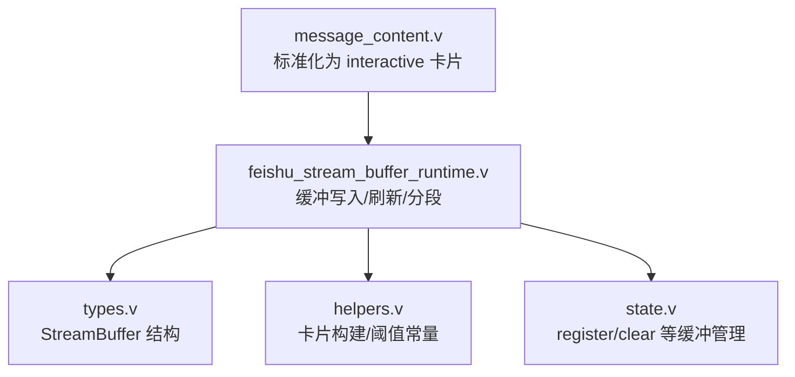
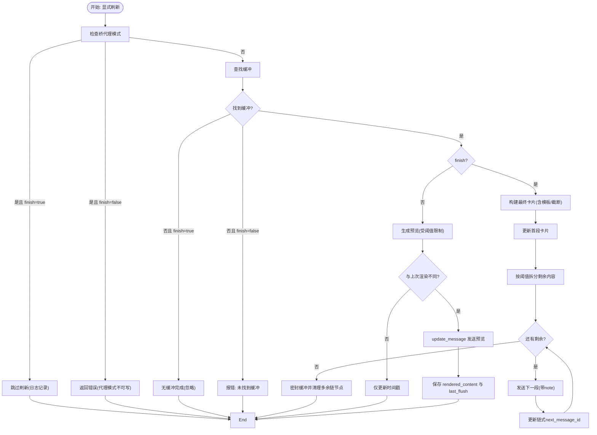
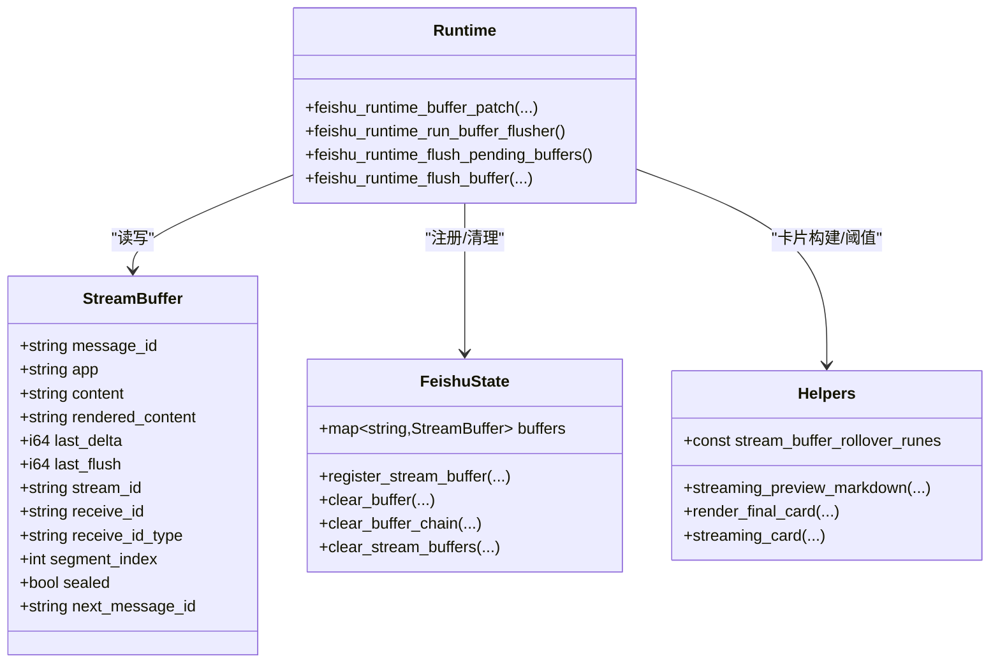

# 流式缓冲区配置

<cite>
**本文引用的文件列表**
- [src/feishu/types.v](file://src/feishu/types.v)
- [src/feishu/state.v](file://src/feishu/state.v)
- [src/feishu/helpers.v](file://src/feishu/helpers.v)
- [src/feishu_stream_buffer_runtime.v](file://src/feishu_stream_buffer_runtime.v)
- [src/upstream/provider/feishu/message_content.v](file://src/upstream/provider/feishu/message_content.v)
</cite>

## 目录
1. [简介](#简介)
2. [项目结构](#项目结构)
3. [核心组件](#核心组件)
4. [架构总览](#架构总览)
5. [详细组件分析](#详细组件分析)
6. [依赖关系分析](#依赖关系分析)
7. [性能与内存管理](#性能与内存管理)
8. [故障排查指南](#故障排查指南)
9. [结论](#结论)
10. [附录：配置示例与最佳实践](#附录配置示例与最佳实践)

## 简介
本文件面向飞书流式响应缓冲区的实现与配置，聚焦 StreamBuffer 的结构与字段语义、增量更新机制（content 与 rendered_content 的区别、last_delta 与 last_flush 的时间戳策略）、生命周期管理（创建、更新、清理），并提供实时消息推送与进度反馈的配置与实践建议。文档同时给出内存管理与性能调优要点，帮助在长文本输出场景下获得稳定、低延迟的用户体验。

## 项目结构
与流式缓冲区相关的核心代码分布在以下模块：
- 类型定义与状态容器：src/feishu/types.v
- 缓冲区注册、清理与查询：src/feishu/state.v
- 卡片构建与滚动阈值常量：src/feishu/helpers.v
- 运行时缓冲写入、定时刷新与分段发送：src/feishu_stream_buffer_runtime.v
- 上游请求标准化（将普通消息转为交互式卡片）：src/upstream/provider/feishu/message_content.v



图表来源
- [src/feishu_stream_buffer_runtime.v:1-286](file://src/feishu_stream_buffer_runtime.v#L1-L286)
- [src/feishu/types.v:218-233](file://src/feishu/types.v#L218-L233)
- [src/feishu/helpers.v:28-29](file://src/feishu/helpers.v#L28-L29)
- [src/feishu/state.v:152-230](file://src/feishu/state.v#L152-L230)
- [src/upstream/provider/feishu/message_content.v:196-224](file://src/upstream/provider/feishu/message_content.v#L196-L224)

章节来源
- [src/feishu/types.v:218-233](file://src/feishu/types.v#L218-L233)
- [src/feishu/state.v:152-230](file://src/feishu/state.v#L152-L230)
- [src/feishu/helpers.v:28-29](file://src/feishu/helpers.v#L28-L29)
- [src/feishu_stream_buffer_runtime.v:1-286](file://src/feishu_stream_buffer_runtime.v#L1-L286)
- [src/upstream/provider/feishu/message_content.v:196-224](file://src/upstream/provider/feishu/message_content.v#L196-L224)

## 核心组件
- StreamBuffer：表示一次流式输出的内存缓冲，包含消息标识、内容、渲染结果、时间戳、分段索引、密封状态与链式转发目标等。
- FeishuState：维护所有活跃缓冲的 map[string]StreamBuffer，提供注册、清理、按 stream_id 批量清理等方法。
- 运行时缓冲处理：负责增量追加、定时合并预览、最终分段发送、以及“继续输出”多段卡片生成。
- 卡片构建工具：提供交互式卡片模板、滚动阈值常量、预览截断逻辑与最终卡片渲染。

章节来源
- [src/feishu/types.v:218-233](file://src/feishu/types.v#L218-L233)
- [src/feishu/state.v:152-230](file://src/feishu/state.v#L152-L230)
- [src/feishu/helpers.v:28-29](file://src/feishu/helpers.v#L28-L29)
- [src/feishu_stream_buffer_runtime.v:1-286](file://src/feishu_stream_buffer_runtime.v#L1-L286)

## 架构总览
下图展示了从上游请求到飞书卡片的端到端流程，包括缓冲写入、预览刷新与最终分段发送。

```mermaid
sequenceDiagram
participant Up as "上游调用方"
participant RT as "feishu_stream_buffer_runtime.v"
participant ST as "feishu/state.v"
participant HT as "feishu/helpers.v"
participant MC as "message_content.v"
participant FE as "飞书开放平台"
Up->>MC : 发送普通消息(可能非interactive)
MC-->>Up : 标准化为 interactive 卡片
Up->>RT : 追加文本到 target(message_id)
RT->>ST : 获取或创建 StreamBuffer
alt 未密封(sealed=false)
RT->>RT : content += text; last_delta=now
RT-->>Up : 返回(等待定时刷新)
else 已密封且有 next_message_id
RT->>RT : 切换到下一个 message_id 继续追加
else 需要新建下一段
RT->>HT : 构造 streaming_card(segment_index)
RT->>FE : 发送新卡片(得到新的 message_id)
RT->>ST : 记录 next_message_id 并初始化新缓冲
RT-->>Up : 返回
end
Note over RT,ST : 后台每约400ms触发 flush_pending_buffers()
RT->>ST : 遍历 buffers 筛选待刷新项
RT->>HT : 生成 preview_markdown(受滚动阈值限制)
RT->>FE : update_message(仅当预览变化)
RT->>ST : 更新 last_flush/rendered_content
```

图表来源
- [src/feishu_stream_buffer_runtime.v:13-96](file://src/feishu_stream_buffer_runtime.v#L13-L96)
- [src/feishu_stream_buffer_runtime.v:126-182](file://src/feishu_stream_buffer_runtime.v#L126-L182)
- [src/feishu/helpers.v:1058-1103](file://src/feishu/helpers.v#L1058-L1103)
- [src/upstream/provider/feishu/message_content.v:196-224](file://src/upstream/provider/feishu/message_content.v#L196-L224)

## 详细组件分析

### StreamBuffer 结构与字段说明
- message_id：当前缓冲对应的飞书消息标识，作为 key 定位缓冲。
- app：所属应用名，用于选择飞书实例上下文。
- content：累积的原始文本内容（增量拼接）。
- rendered_content：最近一次成功渲染并发送到前端的预览内容，用于去抖与对比。
- last_delta：最后一次内容变更的时间戳（毫秒），用于判断是否需要刷新。
- last_flush：最后一次实际刷新（update_message）的时间戳（毫秒）。
- stream_id：关联的流会话标识，用于跨层追踪与清理。
- receive_id / receive_id_type：飞书接收目标的标识与类型，决定更新的目标位置。
- segment_index：当前分段的序号；首段通常为 1，后续分段自增。
- sealed：是否已“密封”，即已完成首次发送并进入“继续输出”阶段。
- next_message_id：当内容过长需分段时，指向下一段消息的 message_id，形成链式转发。

章节来源
- [src/feishu/types.v:218-233](file://src/feishu/types.v#L218-L233)

### 增量更新机制：content 与 rendered_content
- content：只增不减，保存所有追加的文本片段，用于最终完整输出。
- rendered_content：仅在成功更新前端后同步，避免重复网络请求。
- last_delta 与 last_flush：
  - last_delta 每次追加时更新，标记“有变更”。
  - last_flush 在成功 update_message 后更新，配合全局定时器（约 400ms）进行节流合并。
- 预览截断：使用滚动阈值常量控制预览长度，超长时在末尾附加提示，确保用户即时感知进度。

章节来源
- [src/feishu/stream_buffer_runtime.v:13-96](file://src/feishu/stream_buffer_runtime.v#L13-L96)
- [src/feishu/stream_buffer_runtime.v:126-182](file://src/feishu/stream_buffer_runtime.v#L126-L182)
- [src/feishu/helpers.v:1058-1103](file://src/feishu/helpers.v#L1058-L1103)
- [src/feishu/helpers.v:28-29](file://src/feishu/helpers.v#L28-L29)

### 生命周期管理：创建、更新、清理
- 创建：
  - 通过 register_stream_buffer 初始化缓冲，可设置初始内容与时间戳。
  - 若 target 不存在，运行时会在首次 patch 时自动创建。
- 更新：
  - 未密封时直接追加 content 并更新时间戳。
  - 已密封且存在 next_message_id 时，将追加路由到下一段缓冲。
  - 需要新建下一段时，发送“继续输出”卡片并建立新缓冲，链接 next_message_id。
- 清理：
  - clear_buffer 按 message_id 删除单个缓冲。
  - clear_buffer_chain 沿 next_message_id 链式清理。
  - clear_stream_buffers 按 stream_id 批量清理所有相关缓冲。

章节来源
- [src/feishu/state.v:152-230](file://src/feishu/state.v#L152-L230)
- [src/feishu/stream_buffer_runtime.v:13-96](file://src/feishu/stream_buffer_runtime.v#L13-L96)

### 分段与“继续输出”策略
- 滚动阈值：常量 stream_buffer_rollover_runes 控制预览最大字符数，防止单次卡片过大。
- 预览生成：streaming_preview_markdown 对超长内容进行截断并附加提示。
- 最终渲染：render_final_card 支持自定义模板，默认以 markdown 卡片形式输出。
- 分段发送：finish 模式下，先更新首段，再循环发送后续段落，每段附带“继续输出 · 第 N 段”的 note 元素。

章节来源
- [src/feishu/helpers.v:28-29](file://src/feishu/helpers.v#L28-L29)
- [src/feishu/helpers.v:1058-1103](file://src/feishu/helpers.v#L1058-L1103)
- [src/feishu/stream_buffer_runtime.v:184-285](file://src/feishu/stream_buffer_runtime.v#L184-L285)

### 上游标准化：普通消息转交互式卡片
- 当上游请求为非 interactive 类型且存在 stream_id 时，自动转换为交互式卡片，内容为占位提示或提取的 markdown。
- 该步骤确保流式场景下统一以卡片为载体，便于后续更新与分段。

章节来源
- [src/upstream/provider/feishu/message_content.v:196-224](file://src/upstream/provider/feishu/message_content.v#L196-L224)

### 关键流程图：显式刷新与完成


图表来源
- [src/feishu/stream_buffer_runtime.v:184-285](file://src/feishu/stream_buffer_runtime.v#L184-L285)

## 依赖关系分析
- feishu_stream_buffer_runtime.v 依赖：
  - types.v：StreamBuffer 结构体
  - helpers.v：卡片构建函数与滚动阈值常量
  - state.v：缓冲注册与清理方法
  - upstream/provider/feishu/message_content.v：标准化为 interactive 卡片
- 运行时调度：
  - 后台任务每约 400ms 触发 flush_pending_buffers，扫描并批量更新。



图表来源
- [src/feishu/types.v:218-233](file://src/feishu/types.v#L218-L233)
- [src/feishu/state.v:152-230](file://src/feishu/state.v#L152-L230)
- [src/feishu/helpers.v:28-29](file://src/feishu/helpers.v#L28-L29)
- [src/feishu/stream_buffer_runtime.v:1-286](file://src/feishu/stream_buffer_runtime.v#L1-L286)

章节来源
- [src/feishu/types.v:218-233](file://src/feishu/types.v#L218-L233)
- [src/feishu/state.v:152-230](file://src/feishu/state.v#L152-L230)
- [src/feishu/helpers.v:28-29](file://src/feishu/helpers.v#L28-L29)
- [src/feishu/stream_buffer_runtime.v:1-286](file://src/feishu/stream_buffer_runtime.v#L1-L286)

## 性能与内存管理
- 节流与合并：
  - 后台每约 400ms 扫描一次，仅当 last_delta >= last_flush 且距上次刷新超过阈值时才尝试更新，避免频繁网络请求。
  - 预览相同则跳过网络调用，仅更新时间戳，降低开销。
- 滚动阈值：
  - 使用固定常量控制预览长度，保证卡片大小可控，减少渲染与传输成本。
- 分段策略：
  - 完成时按阈值切分内容，逐段发送，避免单条消息过大导致失败或卡顿。
- 内存管理：
  - 使用 next_message_id 形成链式缓冲，完成后清理多余节点，避免内存泄漏。
  - 提供按 message_id 和 stream_id 的清理接口，便于业务侧在会话结束时主动释放资源。
- 调优建议：
  - 根据业务节奏调整后台刷新周期（当前约 400ms），在高吞吐场景可适当增大以降低 CPU 与网络压力。
  - 合理设置滚动阈值，平衡用户体验与网络负载。
  - 在长会话中定期调用 clear_stream_buffers 清理历史缓冲，避免 map 膨胀。

章节来源
- [src/feishu/stream_buffer_runtime.v:126-182](file://src/feishu/stream_buffer_runtime.v#L126-L182)
- [src/feishu/helpers.v:28-29](file://src/feishu/helpers.v#L28-L29)
- [src/feishu/state.v:212-252](file://src/feishu/state.v#L212-L252)

## 故障排查指南
- 常见问题与定位：
  - 未收到任何更新：检查 target 是否为空；确认 register_stream_buffer 是否被调用；查看 last_delta 与 last_flush 是否推进。
  - 预览不变化：确认 rendered_content 是否与最新预览一致；检查滚动阈值是否导致预览被截断。
  - 分段异常：检查 sealed 与 next_message_id 是否正确设置；确认 send_result.message_id 是否回写。
  - 代理模式限制：在 bridge proxy only 模式下，显式刷新可能被跳过或报错，需确认运行模式。
- 日志线索：
  - 刷新器启动、显式刷新、预览失败、完成跳过等均有日志输出，便于快速定位问题。

章节来源
- [src/feishu/stream_buffer_runtime.v:126-182](file://src/feishu/stream_buffer_runtime.v#L126-L182)
- [src/feishu/stream_buffer_runtime.v:184-285](file://src/feishu/stream_buffer_runtime.v#L184-L285)

## 结论
飞书流式缓冲区通过 StreamBuffer 统一管理增量内容、渲染结果与分段状态，结合后台定时刷新与滚动阈值控制，实现了稳定、低延迟的实时消息推送与进度反馈。合理的生命周期管理与内存清理策略确保了系统在高并发与长会话下的健壮性。通过上述配置与实践建议，可在复杂业务场景中取得良好的用户体验与性能表现。

## 附录：配置示例与最佳实践
- 基本配置要点：
  - 启用飞书适配器与事件管道，确保消息能标准化为 interactive 卡片。
  - 在业务侧调用 register_stream_buffer 初始化缓冲，传入 message_id、stream_id、receive_id 与 receive_id_type。
  - 在生成过程中持续追加文本至对应 target（message_id），由运行时自动合并与刷新。
  - 在结束或失败时调用显式刷新，触发最终卡片与分段发送。
- 实时消息推送与进度反馈：
  - 使用 streaming_preview_markdown 生成的预览作为中间态展示，并在完成时使用 render_final_card 输出完整内容。
  - 利用 segment_index 与“继续输出”note 元素提升长文本的可读性与连续性。
- 最佳实践：
  - 在会话结束时调用 clear_stream_buffers(stream_id) 清理所有相关缓冲。
  - 监控 last_delta 与 last_flush 差值，评估刷新频率与用户体验。
  - 根据业务需求调整滚动阈值与刷新周期，平衡性能与体验。

章节来源
- [src/upstream/provider/feishu/message_content.v:196-224](file://src/upstream/provider/feishu/message_content.v#L196-L224)
- [src/feishu/state.v:152-230](file://src/feishu/state.v#L152-L230)
- [src/feishu/helpers.v:1058-1103](file://src/feishu/helpers.v#L1058-L1103)
- [src/feishu/stream_buffer_runtime.v:184-285](file://src/feishu/stream_buffer_runtime.v#L184-L285)